# CPU缓存友好代码编写指南

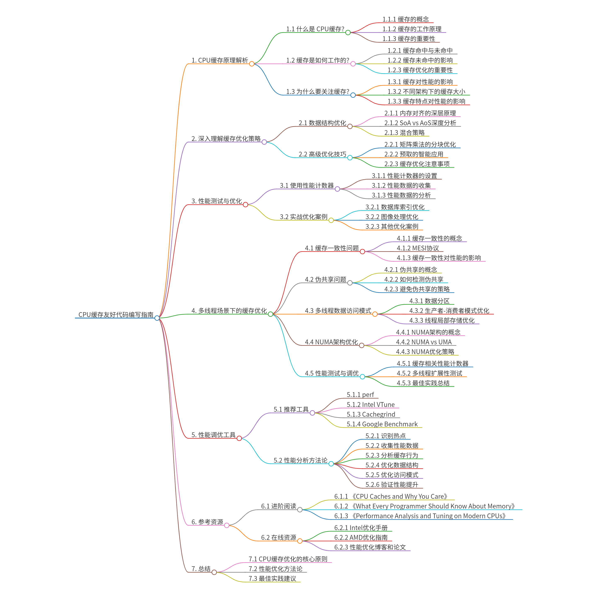

## 1. CPU缓存原理解析

### 1.1 什么是CPU缓存?
想象你在厨房做菜:
- 冰箱(内存): 储存所有食材,空间大但拿取慢
- 料理台(缓存): 放置正在使用的食材,空间小但取用快
- 灶台(CPU): 实际烹饪的地方,需要快速取用料理台上的食材

CPU缓存就像这个料理台,它是CPU和内存之间的"中转站":

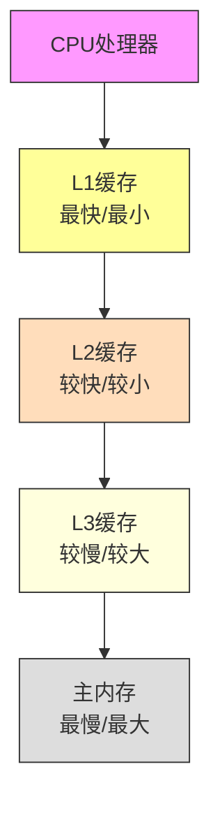

### 1.2 缓存是如何工作的?
当CPU需要读取数据时:

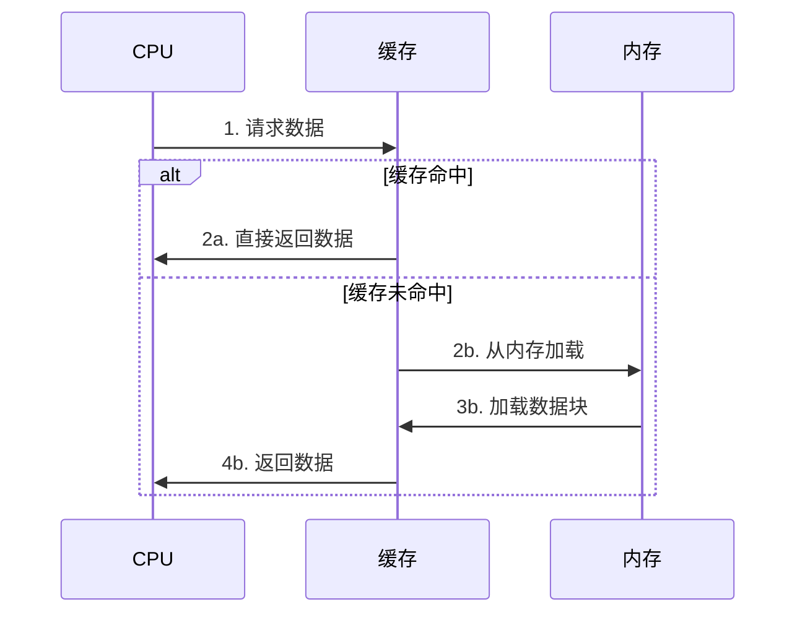

### 1.3 为什么要关注缓存?
让我们看一个实际的性能对比:

```cpp
// 测试不同层级存储的访问延迟
void memory_access_test() {
    const int size = 1024 * 1024; // 1MB
    int* arr = new int[size];
    
    // 预热缓存
    for(int i = 0; i < size; i++) {
        arr[i] = i;
    }
    
    // 测试L1缓存访问
    auto start = high_resolution_clock::now();
    for(int i = 0; i < 1000; i++) {
        volatile int temp = arr[i & 0x3FFF]; // 16KB范围内
    }
    // 为什么 i & 0x3FFF 这个操作能限制在 L1 缓存范围内
    // 因为 L1 缓存的大小是 32KB，而 i & 0x3FFF 的结果是 0x3FFF，即 16383
    // 16383 小于 32KB 的地址范围
    // 对于 int 数组：
    // 每个 int 通常是 4 字节
    // 16384 * 4 = 64KB 的访问范围
    // 典型的 L1 缓存大小：
    // 现代处理器的 L1 数据缓存通常是 32KB 或 64KB
    // 这个操作将访问限制在 64KB 以内
    // 因此数据很可能始终在 L1 缓存中
    auto l1_time = duration_cast<nanoseconds>(
        high_resolution_clock::now() - start).count();
    
    // 测试主内存访问
    start = high_resolution_clock::now();
    for(int i = 0; i < 1000; i++) {
        volatile int temp = arr[rand() % size]; // 随机访问
    }
    auto mem_time = duration_cast<nanoseconds>(
        high_resolution_clock::now() - start).count();
    
    cout << "L1缓存访问时间: " << l1_time/1000.0 << "ns" << endl;
    cout << "内存访问时间: " << mem_time/1000.0 << "ns" << endl;
}
```

典型结果:
- L1缓存访问: ~1-2ns
- 主内存访问: ~100ns

这就是为什么缓存优化如此重要!

### 1.4 不同架构下的CPU缓存大小

#### 1.4.1 x86架构
常见的桌面/服务器处理器缓存配置：

##### Intel处理器
| CPU型号 | L1 Cache (每核) | L2 Cache (每核) | L3 Cache (共享) |
|---------|----------------|----------------|----------------|
| Core i9-13900K | 80KB (48K数据+32K指令) | 2MB | 36MB |
| Core i7-12700K | 80KB (48K数据+32K指令) | 1.25MB | 25MB |
| Xeon Platinum 8380 | 80KB (48K数据+32K指令) | 1.25MB | 60MB |

##### AMD处理器
| CPU型号 | L1 Cache (每核) | L2 Cache (每核) | L3 Cache (共享) |
|---------|----------------|----------------|----------------|
| Ryzen 9 7950X | 64KB (32K数据+32K指令) | 1MB | 64MB |
| Ryzen 7 5800X | 64KB (32K数据+32K指令) | 512KB | 32MB |
| EPYC 7763 | 64KB (32K数据+32K指令) | 512KB | 256MB |

#### 1.4.2 ARM架构
常见的移动/服务器处理器缓存配置

##### 移动处理器
| CPU型号 | L1 Cache (每核) | L2 Cache | L3 Cache |
|---------|----------------|-----------|-----------|
| Apple M2 | 128KB (64K数据+64K指令) | 16MB (共享) | 24MB (共享) |
| Snapdragon 8 Gen 2 | 64KB (32K数据+32K指令) | 512KB (每核) | 8MB (共享) |
| Dimensity 9200 | 64KB (32K数据+32K指令) | 256KB (每核) | 6MB (共享) |

##### ARM服务器处理器
| CPU型号 | L1 Cache (每核) | L2 Cache | L3 Cache |
|---------|----------------|-----------|-----------|
| Graviton 3 | 64KB (32K数据+32K指令) | 1MB (每核) | 32MB (共享) |
| Ampere Altra | 64KB (32K数据+32K指令) | 1MB (每核) | 32MB (共享) |
| Kunpeng 920 | 64KB (32K数据+32K指令) | 512KB (每核) | 96MB (共享) |

#### 1.4.3 缓存特点对比
1. **L1缓存**:
   - x86: 通常32KB-48KB数据缓存
   - ARM: 大多32KB数据缓存，Apple Silicon较大(64KB)
   - 访问延迟：~1-2个时钟周期

2. **L2缓存**:
   - x86: 每核256KB-2MB不等
   - ARM: 移动端较小(256KB-512KB)，服务器较大(1MB+)
   - 访问延迟：~10个时钟周期

3. **L3缓存**:
   - x86: 服务器处理器普遍较大(数十MB)
   - ARM: 移动端较小(4-8MB)，服务器较大(32MB+)
   - 访问延迟：~40个时钟周期

#### 1.4.4 编程启示
1. **数据局部性**:
   - L1缓存较小(32-64KB)，关键码和热点数据应该控制在这个范围内
   - 例如：矩阵分块大小通常选择16KB-32KB比较合适

2. **架构适配**:
   - x86平台可以使用较大的缓存分块(1-2MB)
   - ARM移动端应该使用较小的分块(256KB-512KB)
   - 服务器级ARM可以使用中等大小分块(512KB-1MB)

3. **缓存一致性**:
   - x86通常采用MESI协议
   - ARM采用MOESI或MESIF协议
   - 多线程编程时需要注意缓存行对齐和伪共享问题

## 2. 深入理解缓存优化策略

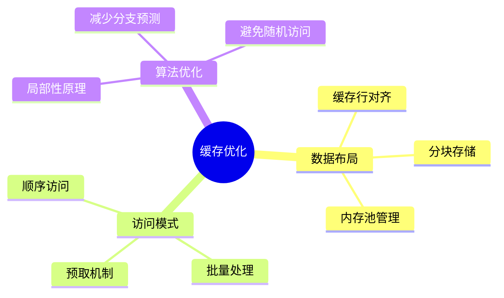
### 2.1 数据结构优化

#### 2.1.1 内存对齐的深层原理

1. **为什么需要内存对齐？**
- **硬件要求**：现代CPU访问内存时有对齐要求，未对齐的访问会导致性能下降
- **缓存效率**：对齐的数据结构能更好地利用缓存行
- **原子操作**：某些原子操作要求数据必须对齐

2. **对齐规则**：
- 基本类型按其自身大小对齐（如int通常4字节对齐）
- 结构体按其最大成员的对齐要求对齐
- 可以使用alignas指定更大的对齐值

3. **性能影响**：
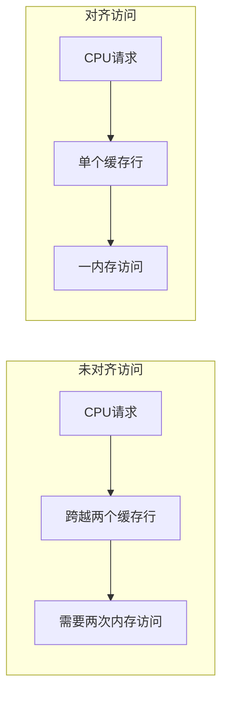

4. **优化示例**：
```cpp
// 不好的设计
struct BadStruct {
    char flag;     // 1字节
    double value;  // 8字节
    char status;   // 1字节
}; // 实际占用24字节 (这里考察的是结构体成员内存对齐问题)
// 1、结构体变量的首地址能被其最宽数据类型成员的大小整除
// 2、结构体每个成员相对于结构体**首地址的偏移量都是该成员本身大小的整数倍**，多的填充字节
// 3、结构体变量所占总空间的大小必定是最宽数据类型大小的整数倍。多的在末尾填充字节。
// 计算公式：
// 1. 找出结构体中最宽的基本数据类型成员，记为max_align (这里是double，8字节)
// 2. 遍历结构体成员，按照如下方式计算每个成员的偏移量offset：
//    - 对于第一个成员：offset = 0
//    - 对于后续成员：
//      offset = (前一个成员的offset + size + align - 1) & ~(align - 1)
//      其中size是前一个成员的大小，align是当前成员的对齐要求
// 3. 结构体总大小的计算：
//    total_size = (最后一个成员的offset + 最后一个成员的size + max_align - 1) & ~(max_align - 1)

// BadStruct的内存布局计算：
// 1. max_align = 8 (double的大小)
// 2. 成员偏移量计算：
//    - flag: offset = 0
//    - value: offset = (0 + 1 + 8 - 1) & ~(8 - 1) = 8
//    - status: offset = (8 + 8 + 1 - 1) & ~(1 - 1) = 16
// 3. 总大小计算：
//    total_size = (16 + 1 + 8 - 1) & ~(8 - 1) = 24

// 内存布局示意图：
// | flag   | padding | value       | status | padding |
// | 1 byte | 7 bytes | 8 bytes     | 1 byte | 7 bytes |
// | offset:0|        | offset:8    |offset:16|        |

// 优化后的设计
struct GoodStruct {
    double value;  // 8字节
    char flag;     // 1字节
    char status;   // 1字节
    // 编译器自动添加6字节填充
}; // 实际占用16字节
// 计算公式：
// 1 + 1 + 8 = 10
// 10 不是 8 的整数倍，所以需要填充 6 字节

// 更进一步的优化
struct alignas(64) CacheAlignedStruct {
    double value;
    char flag;
    char status;
    char padding[54]; // 手动填充到64字节(缓存行大小)
};
```

#### 2.1.2 SoA vs AoS深度分析

#### 2.1.2.1 基本概念

1. **AoS (Array of Structures)**：
- 将每个对象的所有属性打包在一起，形成结构体数组
- 是面向对象编程中最自然的数据组织方式
```cpp
// AoS示例
struct Particle {
    float x, y, z;    // 位置
    float vx, vy, vz; // 速度
    float m;          // 质量
};
Particle particles[1000];  // 1000个粒子的数组
```

2. **SoA (Structure of Arrays)**：
- 将同类型的属性放在一起，每个属性是独立的数组
- 更适合SIMD向量化和缓存优化
```cpp
// SoA示例
struct ParticleSystem {
    float x[1000], y[1000], z[1000];    // 位置数组
    float vx[1000], vy[1000], vz[1000]; // 速度数组
    float m[1000];                       // 质量数组
};
```

#### 2.1.2.2 内存布局对比

1. **AoS内存布局**：
```
内存地址 →
[x1 y1 z1 vx1 vy1 vz1 m1][x2 y2 z2 vx2 vy2 vz2 m2][x3 ...]
  粒子1的所有数据     粒子2的所有数据    粒子3...
```

2. **SoA内存布局**：
```
内存地址 →
[x1 x2 x3 x4 ...][y1 y2 y3 y4 ...][z1 z2 z3 z4 ...]
所有粒子的x坐标  所有粒子的y坐标  所有粒子的z坐标  ...
```

#### 2.1.2.3 性能特点分析

1. **缓存效率**：
- AoS：
  * 优点：访问单个对象的多个属性时缓存友好
  * 缺点：处理多个对象的单个属性时会加载无用数据
```cpp
// AoS的缓存行利用
// 一个缓存行(64字节)可能包含：
// [x1 y1 z1 vx1 vy1 vz1 m1][x2 y2 ...]
// 如果只需要x，则y,z等数据也被加载，造成浪费
```

- SoA：
  * 优点：访问同类属性时缓存命中率高
  * 缺点：访问单个对象的多个属性时需要跨越多个数组
```cpp
// SoA的缓存行利用
// 一个缓存行(64字节)可能含：
// [x1 x2 x3 x4 x5 x6 x7 x8 x9 x10 x11 x12 x13 x14 x15 x16]
// 如果只需要x，则一个缓存行可以提供16个连续的x值
```

2. **SIMD向量化**：
- AoS难以向量化：
```cpp
// AoS的向量化困难
for(auto& p : particles) {
    p.x *= 2.0f;  // 数据不连续，难以向量化
}
```

- SoA易于向量化：
```cpp
// SoA的向量化友好
for(int i = 0; i < n; i += 4) {
    __m128 x = _mm_load_ps(&positions_x[i]);  // 加载4个连续的x
    x = _mm_mul_ps(x, _mm_set1_ps(2.0f));     // 同时处理4个x
    _mm_store_ps(&positions_x[i], x);          // 存储4个结果
}
```

#### 2.1.2.4 适用场景

1. **AoS适合**：
- 对象作为整体频繁被访问
- 需要频繁移动/复制完整对象
- 对象之间很少需要同类属性的批量操作
```cpp
// AoS适合的场景
void process_single_particle(const Particle& p) {
    float total_energy = 0.5f * p.m * (p.vx*p.vx + p.vy*p.vy + p.vz*p.vz)
                        + p.m * GRAVITY * p.y;
}
```

2. **SoA适合**：
- 需要对同类属性行批量操作
- 数据需要进行SIMD向量化处理
- 只需要访问对象的部分属性
```cpp
// SoA适合的场景
void update_positions(ParticleSystem& ps, float dt) {
    #pragma omp simd
    for(int i = 0; i < N; i++) {
        ps.x[i] += ps.vx[i] * dt;  // 连续内存访问，适合向量化
        ps.y[i] += ps.vy[i] * dt;
        ps.z[i] += ps.vz[i] * dt;
    }
}
```

#### 2.1.2.5 混合策略

有时候可以采用混合策略，根据访问模式组织数据：

```cpp
// 混合AoS和SoA的策略
struct ParticleChunk {  // 每个块包含64个粒子
    static const int CHUNK_SIZE = 64;
    struct Position { float x, y, z; };
    struct Velocity { float vx, vy, vz; };
    
    Position positions[CHUNK_SIZE];   // 位置数组
    Velocity velocities[CHUNK_SIZE];  // 速度数组
    float masses[CHUNK_SIZE];         // 质量数组
};

// 使用块数组
vector<ParticleChunk> particle_chunks;
```

这种方式：
1. 在块内部使用SoA布局，有利于SIMD操作
2. 块之间使用AoS布局，保持数据局部性
3. 可以根据缓存大小调整CHUNK_SIZE
4. 平衡了两种布局的优势

### 2.2 高级优化技巧

#### 2.2.1 矩阵乘法的分块优化

1. **为什么需要分块？**
- 减少缓存未命中
- 提高数据重用率
- 适应多级缓存架构

2. **分块大小选择**：
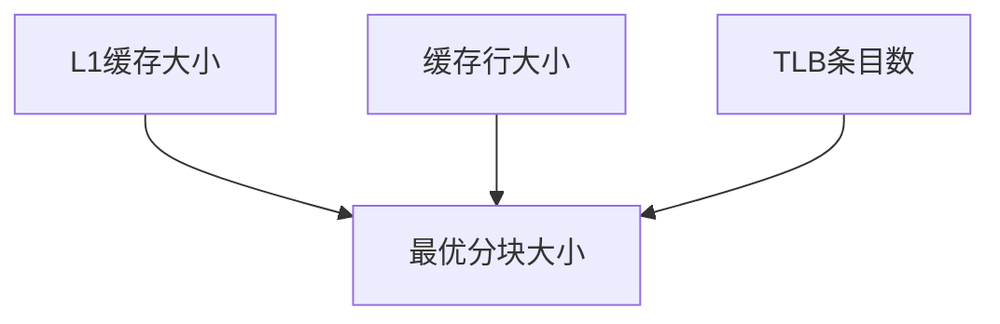

3. **性能影响分析**：
```cpp
// 传统实现的内存访问模式
// 对于N×N矩阵
// A: N次连续访问
// B: N×N次跳跃访问
// 缓存未命中率高

// 分块实现的优势
// 块大小为B时
// 每次处理B×B的小矩阵
// 数据可以完全放入L1缓存
// 显著减少缓存未命中
```

4. **多级分块策略**：
```cpp
void matrix_multiply_multi_level(const float* A, const float* B, float* C, int N) {
    const int L2_BLOCK = 256; // L2缓存分块
    const int L1_BLOCK = 32;  // L1缓存分块
    
    // L2缓存级别分块
    for(int i2 = 0; i2 < N; i2 += L2_BLOCK)
        for(int j2 = 0; j2 < N; j2 += L2_BLOCK)
            for(int k2 = 0; k2 < N; k2 += L2_BLOCK)
                
                // L1缓存级别分块
                for(int i1 = i2; i1 < min(i2+L2_BLOCK, N); i1 += L1_BLOCK)
                    for(int j1 = j2; j1 < min(j2+L2_BLOCK, N); j1 += L1_BLOCK)
                        for(int k1 = k2; k1 < min(k2+L2_BLOCK, N); k1 += L1_BLOCK)
                            
                            // 处理小块
                            for(int i = i1; i < min(i1+L1_BLOCK, N); i++)
                                for(int j = j1; j < min(j1+L1_BLOCK, N); j++) {
                                    float sum = (k1 == k2) ? 0 : C[i*N + j];
                                    for(int k = k1; k < min(k1+L1_BLOCK, N); k++)
                                        sum += A[i*N + k] * B[k*N + j];
                                    C[i*N + j] = sum;
                                }
}
```

#### 2.2.2 预取的智能应用

1. **预取原理**：
- 提前将数据从内存加载到缓存
- 减少等待时间
- 掩盖内存访问延迟

2. **预取类型**：
```cpp
// 软件预取
__builtin_prefetch(addr);            // GCC内建函数
_mm_prefetch(addr, _MM_HINT_T0);     // Intel intrinsic

// 硬件预取
// 自动识别连续访问模式
// 无需显式代码
```

3. **预取策略优化**：
```cpp
template<typename T>
void optimized_prefetch(const T* data, size_t size) {
    const int CACHE_LINE_SIZE = 64;
    const int PREFETCH_DISTANCE = 16;  // 根据处理时间调整
    const int PREFETCH_STRIDE = CACHE_LINE_SIZE / sizeof(T);
    
    // 主循环预取
    for(size_t i = 0; i < size; i++) {
        // 预取下一个缓存行
        if(i % PREFETCH_STRIDE == 0 && i + PREFETCH_DISTANCE < size) {
            __builtin_prefetch(&data[i + PREFETCH_DISTANCE]);
        }
        
        // 处理当前数据
        process(data[i]);
    }
}
```

4. **预取注意事项**：
- 预取距离要根据处理时间调整
- 避免过度预取占用带宽
- 考虑硬件预取器的行为
- 在复杂访问模式中特别有用

5. **预取效果分析**：
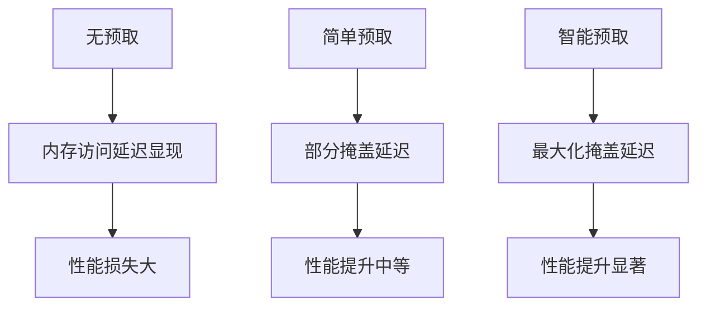

## 3. 性能测试与优化

### 3.1 使用性能计数器
```cpp
#include <linux/perf_event.h>
#include <sys/ioctl.h>
#include <asm/unistd.h>

class CacheProfiler {
    int fd_l1_miss;
    int fd_l1_access;
    
public:
    CacheProfiler() {
        // 设置L1缓存未命中计数器
        struct perf_event_attr pe = {};
        pe.type = PERF_TYPE_HW_CACHE;
        pe.config = (PERF_COUNT_HW_CACHE_L1D << 0) |
                   (PERF_COUNT_HW_CACHE_OP_READ << 8) |
                   (PERF_COUNT_HW_CACHE_RESULT_MISS << 16);
        fd_l1_miss = syscall(__NR_perf_event_open, &pe, 0, -1, -1, 0);
        
        // 设置L1缓存访问计数器
        pe.config = (PERF_COUNT_HW_CACHE_L1D << 0) |
                   (PERF_COUNT_HW_CACHE_OP_READ << 8) |
                   (PERF_COUNT_HW_CACHE_RESULT_ACCESS << 16);
        fd_l1_access = syscall(__NR_perf_event_open, &pe, 0, -1, -1, 0);
    }
    
    void start() {
        ioctl(fd_l1_miss, PERF_EVENT_IOC_RESET, 0);
        ioctl(fd_l1_access, PERF_EVENT_IOC_RESET, 0);
        ioctl(fd_l1_miss, PERF_EVENT_IOC_ENABLE, 0);
        ioctl(fd_l1_access, PERF_EVENT_IOC_ENABLE, 0);
    }
    
    void stop() {
        ioctl(fd_l1_miss, PERF_EVENT_IOC_DISABLE, 0);
        ioctl(fd_l1_access, PERF_EVENT_IOC_DISABLE, 0);
    }
    
    double get_miss_rate() {
        long long miss_count, access_count;
        read(fd_l1_miss, &miss_count, sizeof(long long));
        read(fd_l1_access, &access_count, sizeof(long long));
        return (double)miss_count / access_count;
    }
};
```

### 3.2 实战优化案例 
#### 3.2.1 数据库索引优化
```cpp
// B+树节点缓存友好设计
template<typename Key, typename Value>
class BPlusTreeNode {
    static const int ORDER = (CACHE_LINE_SIZE - sizeof(void*)) / 
                           (sizeof(Key) + sizeof(Value));
    
    Key keys[ORDER];
    Value values[ORDER];
    BPlusTreeNode* next;
    
    // 确保节点大小是缓存行的整数倍
    char padding[CACHE_LINE_SIZE - 
                ((ORDER * (sizeof(Key) + sizeof(Value)) + 
                  sizeof(void*)) % CACHE_LINE_SIZE)];
};
```

#### 3.2.2 图像处理优化
```cpp
// 图像卷积的缓存优化版本
void optimized_convolution(const float* input, float* output,
                          const float* kernel, int width, int height,
                          int kernel_size) {
    const int TILE_SIZE = 32; // 根据L1缓存大小选择
    
    // 分块处理
    #pragma omp parallel for collapse(2)
    for(int ty = 0; ty < height; ty += TILE_SIZE) {
        for(int tx = 0; tx < width; tx += TILE_SIZE) {
            // 本地缓存
            float tile[TILE_SIZE + kernel_size - 1]
                     [TILE_SIZE + kernel_size - 1];
            
            // 加载图块到本地缓存
            for(int y = ty; y < min(ty + TILE_SIZE + kernel_size - 1, height); y++)
                for(int x = tx; x < min(tx + TILE_SIZE + kernel_size - 1, width); x++)
                    tile[y-ty][x-tx] = input[y*width + x];
            
            // 处理图块
            for(int y = 0; y < min(TILE_SIZE, height-ty); y++)
                for(int x = 0; x < min(TILE_SIZE, width-tx); x++) {
                    float sum = 0;
                    for(int ky = 0; ky < kernel_size; ky++)
                        for(int kx = 0; kx < kernel_size; kx++)
                            sum += tile[y+ky][x+kx] * 
                                  kernel[ky*kernel_size + kx];
                    output[(ty+y)*width + (tx+x)] = sum;
                }
        }
    }
}
```
更多的优化案例可以参考[extension](extension)目录下的代码。以及更多缓存友好代码示例.md

## 4. 多线程场景下的缓存优化

### 4.1 缓存一致性问题

#### 4.1.1 什么是缓存一致性
多核处理器中，每个核心都有自己的L1/L2缓存，这会导致数据一致性问题：

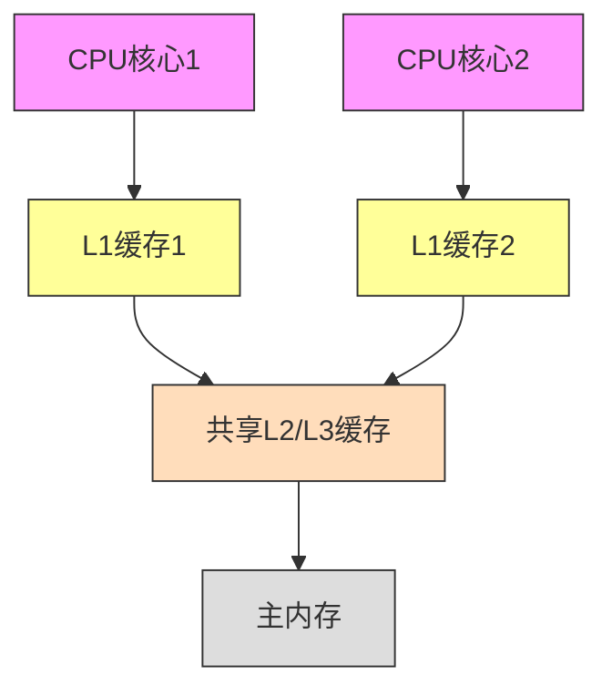

#### 4.1.2 MESI协议 
现代CPU使用MESI协议维护缓存一致性：
- M (Modified): 该缓存行已被修改，其他核心的副本无效
- E (Exclusive): 该缓存行只在当前核心的缓存中
- S (Shared): 该缓存行可能存在于其他核心的缓存中
- I (Invalid): 该缓存行无效

### 4.2 伪共享问题（False Sharing）

#### 4.2.1 什么是伪共享

伪共享是多线程程序中一个常见的性能问题，发生在以下情况：
1. 多个线程在不同的CPU核心上运行
2. 这些线程访问的变量恰好位于同一个缓存行（Cache Line）中
3. 至少有一个线程在写入数据
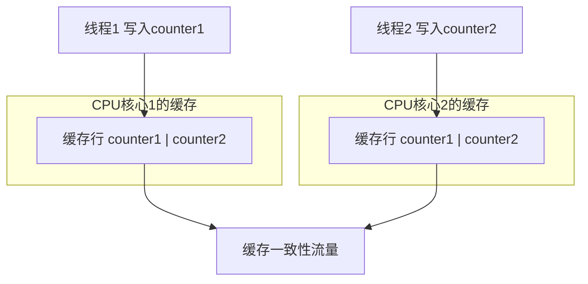

示例代码及其问题：
```cpp
// 有问题的设计
struct SharedData {
    int counter1;  // 线程1使用
    int counter2;  // 线程2使用
};
SharedData data;

// 线程1的函数
void thread1_func() {
    for(int i = 0; i < 1000000; i++) {
        data.counter1++;  // 修改counter1
    }
}

// 线程2的函数
void thread2_func() {
    for(int i = 0; i < 1000000; i++) {
        data.counter2++;  // 修改counter2
    }
}
```

问题分析：
1. counter1和counter2在内存中相邻，共享同一个缓存行
2. 当线程1修改counter1时：
   - 该缓存行在CPU1的缓存中被标记为已修改
   - CPU2的对应缓存行被标记为无效
   - CPU2必须从CPU1重新读取整个缓存行
3. 当线程2修改counter2时：
   - 同样的过程在反向发生
   - 导致缓存行在CPU核心之间不断同步
4. 这种"乒乓"效应严重影响性能

#### 4.2.2 如何检测伪共享

1. **使用性能计数器**：
```cpp
class FalseSharingDetector {
private:
    perf_event_attr pe;
    int fd;
    
public:
    FalseSharingDetector() {
        // 设置性能计数器来监控缓存一致性流量
        memset(&pe, 0, sizeof(pe));
        pe.type = PERF_TYPE_HW_CACHE;
        pe.config = PERF_COUNT_HW_CACHE_COHERENCY;
        pe.disabled = 1;
        
        fd = perf_event_open(&pe, 0, -1, -1, 0);
    }
    
    void start() {
        ioctl(fd, PERF_EVENT_IOC_RESET, 0);
        ioctl(fd, PERF_EVENT_IOC_ENABLE, 0);
    }
    
    long long stop() {
        ioctl(fd, PERF_EVENT_IOC_DISABLE, 0);
        long long count;
        read(fd, &count, sizeof(long long));
        return count;
    }
};
```

2. **实验对比测试**：
```cpp
void test_false_sharing() {
    // 有伪共享的版本
    struct BadStruct {
        int counter1, counter2;
    };
    
    // 避免伪共享的版本
    struct GoodStruct {
        struct alignas(64) Counter {
            int value;
            char padding[60];
        };
        Counter counter1, counter2;
    };
    
    // 测试并对比性能
    auto test_perf = [](auto& data) {
        auto start = high_resolution_clock::now();
        
        thread t1([&]() {
            for(int i = 0; i < 10000000; i++) data.counter1++;
        });
        thread t2([&]() {
            for(int i = 0; i < 10000000; i++) data.counter2++;
        });
        
        t1.join();
        t2.join();
        
        return duration_cast<milliseconds>(
            high_resolution_clock::now() - start).count();
    };
    
    BadStruct bad_data;
    GoodStruct good_data;
    
    cout << "有伪共享版本耗时: " << test_perf(bad_data) << "ms\n";
    cout << "无伪共享版本耗时: " << test_perf(good_data) << "ms\n";
}
```

#### 4.2.3 避免伪共享的策略

1. **使用缓存行对齐**：
```cpp
// 方法1：使用alignas
struct alignas(64) AlignedCounter {
    std::atomic<int> value;
    char padding[64 - sizeof(std::atomic<int>)];
};

// 方法2：使用宏
#define CACHE_LINE_SIZE 64
struct CacheAligned {
    std::atomic<int> value;
    char padding[CACHE_LINE_SIZE - sizeof(std::atomic<int>)];
} __attribute__((aligned(CACHE_LINE_SIZE)));
```

2. **数据分离**：
```cpp
// 不好的设计
struct ThreadData {
    vector<int> counters;  // 所有线程共享一个数组
};

// 好的设计
struct ThreadData {
    vector<vector<int>> counters;  // 每个线程一个独立数组
};
```

3. **使用线程本地存储**：
```cpp
class ThreadSafeAccumulator {
private:
    struct alignas(64) Counter {
        std::atomic<long> value;
    };
    
    static const int MAX_THREADS = 128;
    std::array<Counter, MAX_THREADS> counters;
    
public:
    void add(int thread_id, long value) {
        counters[thread_id].value.fetch_add(value, 
                                          std::memory_order_relaxed);
    }
    
    long get_total() {
        long sum = 0;
        for(const auto& counter : counters) {
            sum += counter.value.load(std::memory_order_relaxed);
        }
        return sum;
    }
};
```

4. **使用C++17的new alignas特性**：
```cpp
template<typename T>
class CacheAligned {
    alignas(64) T data;
public:
    T& get() { return data; }
    const T& get() const { return data; }
};

// 使用示例
vector<CacheAligned<atomic<int>>> thread_counters(num_threads);
```

#### 4.2.4 性能影响分析

1. **缓存一致性开销**：
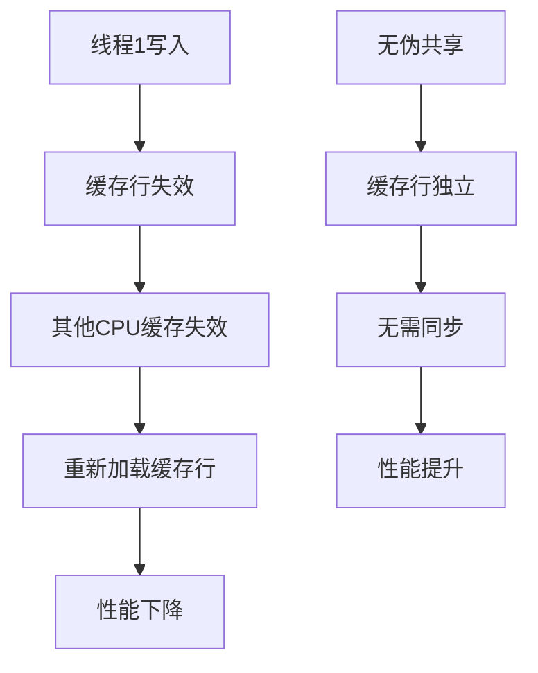

2. **典型性能差异**：
- 有伪共享：每次写入可能需要等待100-300个CPU周期
- 无伪共享：写入只需要3-5个CPU周期
- 在高并发场景下，性能差异可能达到5-10倍

3. **内存占用权衡**：
- 使用填充会增加内存使用
- 对于频繁访问的热点数据，这种权衡通常是值得的
- 建议只对性能关键的数据结构使用此技术

### 4.3 多线程数据访问模式

#### 4.3.1 数据分区
将数据划分为互不重叠的区域，减少缓存一致性流量：

```cpp
// 缓存友好的并行数组处理
void parallel_array_process(vector<float>& data, int num_threads) {
    const size_t chunk_size = (data.size() + num_threads - 1) / num_threads;
    
    vector<thread> threads;
    for(int i = 0; i < num_threads; i++) {
        size_t start = i * chunk_size;
        size_t end = min(start + chunk_size, data.size());
        
        // 每个线程处理连续的数据块
        threads.emplace_back([&data, start, end]() {
            for(size_t j = start; j < end; j++) {
                process(data[j]);
            }
        });
    }
    
    for(auto& t : threads) t.join();
}
```

#### 4.3.2 生产者-消费者模式优化
使用缓存友好的队列实现：

```cpp
template<typename T, size_t BufferSize = 1024>
class CacheFriendlyQueue {
private:
    struct alignas(64) Node {  // 对齐到缓存行
        T data;
        char padding[64 - sizeof(T)];
    };
    
    alignas(64) std::atomic<size_t> head{0};  // 生产者使用
    alignas(64) std::atomic<size_t> tail{0};  // 消费者使用
    std::array<Node, BufferSize> buffer;
    
public:
    bool push(const T& item) {
        size_t current_head = head.load(std::memory_order_relaxed);
        size_t next_head = (current_head + 1) % BufferSize;
        
        if(next_head == tail.load(std::memory_order_acquire))
            return false;  // 队列满
            
        buffer[current_head].data = item;
        head.store(next_head, std::memory_order_release);
        return true;
    }
    
    bool pop(T& item) {
        size_t current_tail = tail.load(std::memory_order_relaxed);
        
        if(current_tail == head.load(std::memory_order_acquire))
            return false;  // 队列空
            
        item = buffer[current_tail].data;
        tail.store((current_tail + 1) % BufferSize, 
                  std::memory_order_release);
        return true;
    }
};
```

#### 4.4 线程局存储优化

1. **使用线程局部缓冲区**
减少线程间的数据共享：

```cpp
class ThreadLocalBuffer {
private:
    static thread_local vector<char> buffer;
    static constexpr size_t BUFFER_SIZE = 64 * 1024;  // 64KB
    
public:
    void process_data(const vector<char>& input) {
        // 确保buffer大小合适
        if(buffer.size() < BUFFER_SIZE)
            buffer.resize(BUFFER_SIZE);
            
        // 在线程本地缓冲区中处理数据
        for(size_t i = 0; i < input.size(); i += BUFFER_SIZE) {
            size_t chunk_size = min(BUFFER_SIZE, input.size() - i);
            memcpy(buffer.data(), &input[i], chunk_size);
            process_chunk(buffer.data(), chunk_size);
        }
    }
};
```

#### 4.4.2 批量操作优化
减少同步操作频率：

```cpp
class ThreadSafeCounter {
private:
    static constexpr int BATCH_SIZE = 100;
    std::atomic<int> global_counter{0};
    thread_local static int local_counter;
    
public:
    void increment() {
        if(++local_counter >= BATCH_SIZE) {
            // 批量更新全局计数器
            global_counter.fetch_add(local_counter, 
                                  std::memory_order_relaxed);
            local_counter = 0;
        }
    }
    
    int get() const {
        return global_counter.load(std::memory_order_relaxed) + 
               local_counter;
    }
    
    ~ThreadSafeCounter() {
        // 确保剩余的本地计数被添加到全局计数器
        if(local_counter > 0) {
            global_counter.fetch_add(local_counter, 
                                  std::memory_order_relaxed);
        }
    }
};
```

### 4.5 NUMA架构优化

#### 4.5.1 什么是NUMA架构

NUMA (Non-Uniform Memory Access) 是一种内存设计架构，其特点是：
1. 内存访问时间取决于内存相对于处理器的位置
2. 每个处理器都有自己的本地内存
3. 处理器可以访问其他处理器的内存（远程内存）

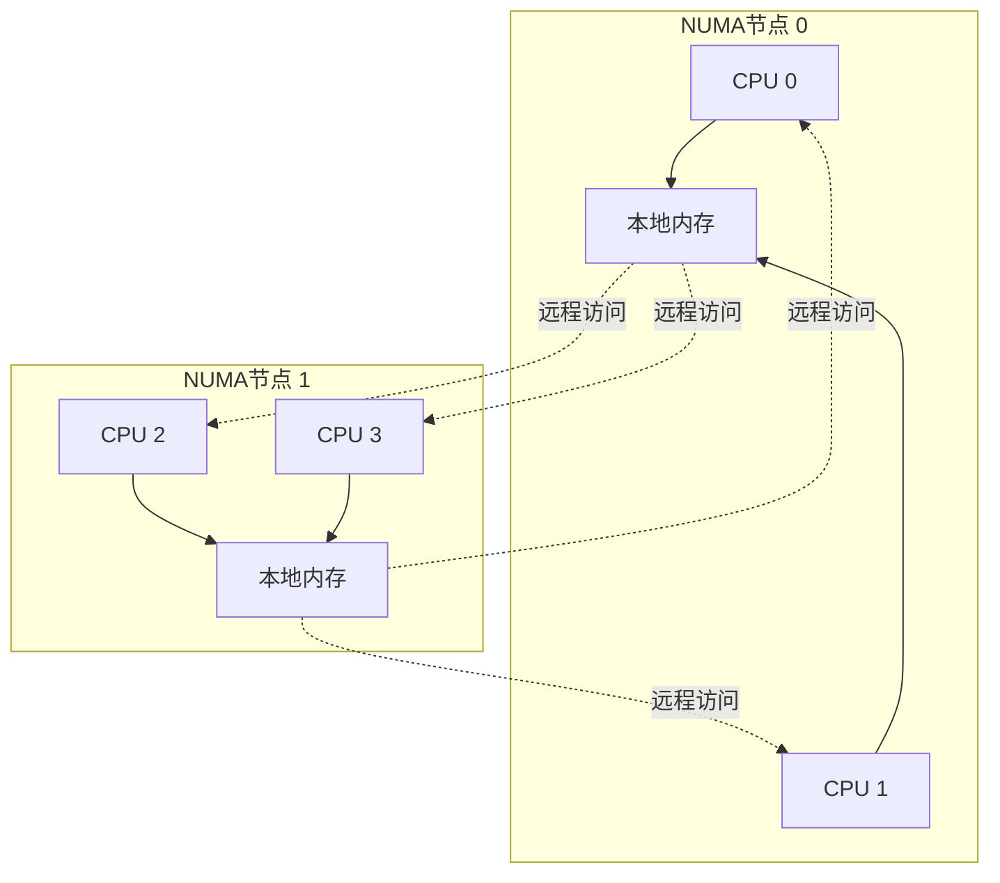

#### 4.5.2 NUMA vs UMA

1. **UMA (Uniform Memory Access)**：
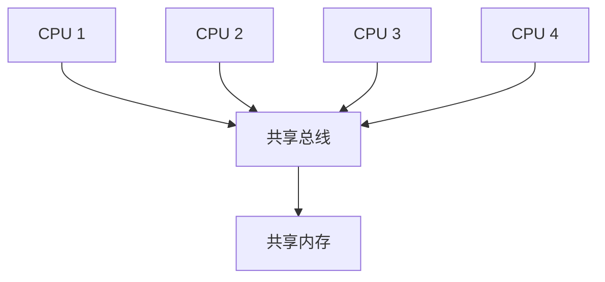

2. **NUMA**：
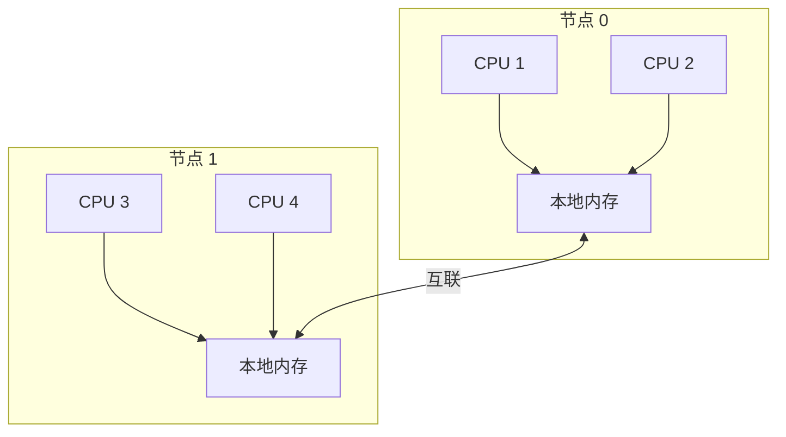

主要区别：
- UMA：所有CPU访问内存的延迟相同
- NUMA：本地内存访问快，远程内存访问慢

#### 4.5.3 NUMA内存访问延迟

典型的访问延迟比较：
1. 本地内存访问：~100ns
2. 远程内存访问：~300ns
3. 跨NUMA节点访问：可能高达500-1000ns

```cpp
// 测量NUMA访问延迟的示例代码
void measure_numa_latency() {
    const int SIZE = 1024 * 1024;  // 1MB
    int numa_node = 0;
    
    // 在指定NUMA节点分配内存
    void* local_mem = numa_alloc_onnode(SIZE, numa_node);
    void* remote_mem = numa_alloc_onnode(SIZE, numa_node + 1);
    
    // 测试本地访问
    auto start = high_resolution_clock::now();
    for(int i = 0; i < 1000000; i++) {
        volatile char* p = (char*)local_mem;
        *p;  // 读取操作
    }
    auto local_time = duration_cast<nanoseconds>(
        high_resolution_clock::now() - start).count();
    
    // 测试远程访问
    start = high_resolution_clock::now();
    for(int i = 0; i < 1000000; i++) {
        volatile char* p = (char*)remote_mem;
        *p;  // 读取操作
    }
    auto remote_time = duration_cast<nanoseconds>(
        high_resolution_clock::now() - start).count();
    
    cout << "本地访问延迟: " << local_time/1000000.0 << "ns\n";
    cout << "远程访问延迟: " << remote_time/1000000.0 << "ns\n";
    
    numa_free(local_mem, SIZE);
    numa_free(remote_mem, SIZE);
}
```

#### 4.5.4 NUMA优化策略

##### 1. 内存分配策略

NUMA系统中有几种主要的内存分配策略，每种策略都有其适用场景：

1. **本地分配 (Local Allocation)**
- 原理：总是在访问内存的CPU所在的NUMA节点上分配内存
- 优点：保证最低的内存访问延迟
- 缺点：可能导致NUMA节点间内存使用不均衡
- 适用场景：单线程应用或线程固定在特定CPU核心上运行的场景

```cpp
/**
 * @brief NUMA感知的内存分配器
 * 支持不同的NUMA内存分配策略
 */
class NumaAwareAllocator {
public:
    // 分配策略枚举
    enum Policy {
        LOCAL,      // 本地分配：在当前CPU所在NUMA节点分配
        INTERLEAVE, // 交错分配：在多个NUMA节点间轮流分配
        PREFERRED   // 优先分配：优先在指定节点分配，失败时尝试其他节点
    };
    
private:
    int numa_node;    // 目标NUMA节点
    Policy policy;    // 当前使用的分配策略
    
public:
    NumaAwareAllocator(int node = -1, Policy p = LOCAL) 
        : numa_node(node), policy(p) {}
    
    void* allocate(size_t size) {
        void* ptr = nullptr;
        switch(policy) {
            case LOCAL:
                // 在当前CPU所在的NUMA节点上分配内存
                ptr = numa_alloc_local(size);
                break;
            case INTERLEAVE:
                // 在所有NUMA节点间交错分配内存页
                ptr = numa_alloc_interleaved(size);
                break;
            case PREFERRED:
                // 优先在指定节点分配，如果失败则在其他节点分配
                ptr = numa_alloc_onnode(size, numa_node);
                break;
        }
        if(!ptr) throw std::bad_alloc();
        return ptr;
    }
    
    // 释放NUMA内存
    void deallocate(void* ptr, size_t size) {
        numa_free(ptr, size);
    }
};
```

2. **交错分配 (Interleaved Allocation)**
- 原理：在所有NUMA节点之间轮流分配内存页
- 优点：实现内存负载均衡，避免单个节点内存耗尽
- 缺点：不能保证最佳访问延迟
- 适用场景：多线程应用且线程经常在不同CPU核心间迁移

```cpp
/**
 * @brief 演示交错分配的使用场景
 */
class InterleaveExample {
private:
    void* data;
    size_t size;
    
public:
    InterleaveExample(size_t bytes) : size(bytes) {
        // 在所有NUMA节点间交错分配内存
        data = numa_alloc_interleaved(size);
        if(!data) throw std::runtime_error("内存分配失败");
        
        // 初始化内存（这也会触发实际的页面分配）
        memset(data, 0, size);
    }
    
    void process_parallel() {
        #pragma omp parallel for
        for(size_t i = 0; i < size; i += PAGE_SIZE) {
            // 由于内存页在不同节点间交错分布
            // 不同线程访问的内存页可能位于不同的NUMA节点
            process_page((char*)data + i);
        }
    }
    
    ~InterleaveExample() {
        if(data) numa_free(data, size);
    }
};
```

3. **优先节点分配 (Preferred Node Allocation)**
- 原理：优先在指定节点分配，失败时回退到其他节点
- 优点：提供了分配策略的灵活性
- 缺点：可能导致非预期的远程访问
- 适用场景：需要在特定NUMA节点上集中数据，但又不能保证总能在该节点分配成功时

##### 2. 线程和内存亲和性

线程和内存亲和性是NUMA优化的核心策略之一：

```cpp
/**
 * @brief NUMA线程管理器
 * 负责管理线程与NUMA节点的亲和性
 */
class NumaThreadManager {
private:
    int num_nodes;              // NUMA节点数量
    vector<vector<int>> cpus;   // 每个节点的CPU核心列表
    
public:
    NumaThreadManager() {
        // 获取系统NUMA配置
        num_nodes = numa_num_configured_nodes();
        cpus.resize(num_nodes);
        
        // 获取每个节点的CPU列表
        for(int node = 0; node < num_nodes; node++) {
            struct bitmask* mask = numa_allocate_cpumask();
            numa_node_to_cpus(node, mask);
            
            // 记录该节点的所有CPU核心
            for(int cpu = 0; cpu < numa_num_configured_cpus(); cpu++) {
                if(numa_bitmask_isbitset(mask, cpu)) {
                    cpus[node].push_back(cpu);
                }
            }
            numa_free_cpumask(mask);
        }
    }
    
    /**
     * @brief 将当前线程绑定到指定NUMA节点
     * @param node NUMA节点ID
     * @param strict 是否严格绑定（不允许在其他节点运行）
     */
    void bind_thread_to_node(int node, bool strict = true) {
        if(node >= 0 && node < num_nodes) {
            // 设置CPU亲和性
            cpu_set_t cpuset;
            CPU_ZERO(&cpuset);
            
            // 将线程限制在指定节点的CPU上运行
            for(int cpu : cpus[node]) {
                CPU_SET(cpu, &cpuset);
            }
            
            // 应用CPU亲和性设置
            pthread_setaffinity_np(pthread_self(), 
                                 sizeof(cpu_set_t), &cpuset);
            
            if(strict) {
                // 设置内存分配策略
                struct bitmask* nodemask = numa_allocate_nodemask();
                numa_bitmask_setbit(nodemask, node);
                numa_set_membind(nodemask);  // 严格限制内存分配
                numa_free_nodemask(nodemask);
            }
        }
    }
    
    /**
     * @brief 获取指定节点的CPU核心数量
     */
    size_t get_node_cpu_count(int node) {
        if(node >= 0 && node < num_nodes) {
            return cpus[node].size();
        }
        return 0;
    }
};
```

##### 3. 数据访问优化

NUMA环境下的数据访问优化需要考虑数据布局和访问模式：

```cpp
/**
 * @brief NUMA感知的向量容器
 * 在多个NUMA节点上分布数据
 */
template<typename T>
class NumaAwareVector {
private:
    struct NodeData {
        T* data;          // 节点本地数据
        size_t size;      // 数据大小
        size_t capacity;  // 容量
    };
    
    vector<NodeData> node_data;  // 每个NUMA节点的数据
    int num_nodes;               // NUMA节点数量
    size_t total_size;           // 总数据量
    
public:
    NumaAwareVector() : num_nodes(numa_num_configured_nodes()), 
                       total_size(0) {
        node_data.resize(num_nodes);
        for(auto& nd : node_data) {
            nd.data = nullptr;
            nd.size = nd.capacity = 0;
        }
    }
    
    /**
     * @brief 调整向量大小
     * @param size 新的总大小
     * @param distribution 数据分布策略（均匀/按CPU核心数/自定义）
     */
    void resize(size_t size, 
                DistributionPolicy distribution = UNIFORM) {
        total_size = size;
        
        // 计算每个节点的数据大小
        vector<size_t> node_sizes(num_nodes);
        switch(distribution) {
            case UNIFORM:
                // 均匀分布
                {
                    size_t base_size = size / num_nodes;
                    size_t remainder = size % num_nodes;
                    for(int i = 0; i < num_nodes; i++) {
                        node_sizes[i] = base_size + (i < remainder ? 1 : 0);
                    }
                }
                break;
                
            case CPU_WEIGHTED:
                // 按CPU核心数量加权分布
                {
                    NumaThreadManager thread_mgr;
                    size_t total_cpus = 0;
                    vector<size_t> cpu_counts(num_nodes);
                    
                    for(int i = 0; i < num_nodes; i++) {
                        cpu_counts[i] = thread_mgr.get_node_cpu_count(i);
                        total_cpus += cpu_counts[i];
                    }
                    
                    for(int i = 0; i < num_nodes; i++) {
                        node_sizes[i] = (size * cpu_counts[i]) / total_cpus;
                    }
                }
                break;
        }
        
        // 在每个节点上分配内存
        for(int node = 0; node < num_nodes; node++) {
            size_t new_size = node_sizes[node];
            
            // 如果需要重新分配
            if(new_size > node_data[node].capacity) {
                // 释放旧内存
                if(node_data[node].data) {
                    numa_free(node_data[node].data, 
                             node_data[node].capacity * sizeof(T));
                }
                
                // 分配新内存
                node_data[node].data = (T*)numa_alloc_onnode(
                    new_size * sizeof(T), node);
                node_data[node].capacity = new_size;
            }
            
            node_data[node].size = new_size;
        }
    }
    
    /**
     * @brief 访问元素
     * @param index 全局索引
     * @return 元素引用
     */
    T& operator[](size_t index) {
        // 找到数据所在的节点
        int node = 0;
        size_t offset = index;
        
        while(node < num_nodes && 
              offset >= node_data[node].size) {
            offset -= node_data[node].size;
            node++;
        }
        
        if(node >= num_nodes) {
            throw out_of_range("索引越界");
        }
        
        return node_data[node].data[offset];
    }
    
    /**
     * @brief 并行处理数据
     * @param func 处理函数
     */
    template<typename Func>
    void parallel_process(Func func) {
        #pragma omp parallel num_threads(num_nodes)
        {
            int thread_id = omp_get_thread_num();
            
            // 将线程绑定到对应的NUMA节点
            NumaThreadManager thread_mgr;
            thread_mgr.bind_thread_to_node(thread_id);
            
            // 处理该节点的数据
            T* node_ptr = node_data[thread_id].data;
            size_t node_size = node_data[thread_id].size;
            
            for(size_t i = 0; i < node_size; i++) {
                func(node_ptr[i]);
            }
        }
    }
};
```

这些优化策略的关键点是：
1. 理解并利用NUMA架构的特性
2. 合理分配和访问内存
3. 保持线程和数据的局部性
4. 避免不必要的跨节点访问
5. 根据实际负载特点选择合适的策略

通过这些策略的组合使用，可以显著提升NUMA系统上的应用性能。

### 4.6 性能测试与调优

#### 4.6.1 缓存相关性能计数器
```cpp
class ThreadCacheProfiler {
private:
    struct PerfCounters {
        long long cache_misses;
        long long cache_refs;
        long long cache_bounces;
    };
    
    static thread_local PerfCounters counters;
    
public:
    void start_profiling() {
        // 设置性能计数器
        setup_perf_counters();
    }
    
    PerfCounters get_counters() {
        return counters;
    }
    
    double get_miss_rate() {
        return static_cast<double>(counters.cache_misses) / 
               counters.cache_refs;
    }
    
    double get_bounce_rate() {
        return static_cast<double>(counters.cache_bounces) / 
               counters.cache_refs;
    }
};
```

#### 4.6.2 多线程扩展性测试
```cpp
template<typename Func>
class ScalabilityTester {
public:
    void test_scalability(Func func, const vector<int>& thread_counts) {
        for(int num_threads : thread_counts) {
            auto start = high_resolution_clock::now();
            
            vector<thread> threads;
            for(int i = 0; i < num_threads; i++) {
                threads.emplace_back(func);
            }
            
            for(auto& t : threads) t.join();
            
            auto end = high_resolution_clock::now();
            auto duration = duration_cast<milliseconds>(end - start);
            
            cout << "线程数: " << num_threads 
                 << " 耗时: " << duration.count() << "ms" 
                 << " 加速比: " << baseline_duration/duration.count() 
                 << endl;
        }
    }
};
```

### 4.7 最佳实践总结

1. **避免伪共享**:
   - 使用缓存行对齐
   - 填充数据结构
   - 分离热点数据

2. **减少共享**:
   - 使用线程局部存储
   - 批量更新共享数据
   - 适当的数据分区

3. **NUMA优化**:
   - 本地内存分配
   - 设置线程亲和性
   - 避免远程内存访问

4. **同步优化**:
   - 使用无锁数据结构
   - 批量处理
   - 避免频繁同步

5. **性能监控**:
   - 使用性能计数器
   - 监控缓存未命中
   - 测试扩展性

## 5. 性能调优工具

### 5.1 推荐工具
1. perf: Linux性能分析工具
2. Intel VTune: 专业CPU性能分析
3. Cachegrind: 缓存使用分析
4. Google Benchmark: 微基准测试

### 4.2 性能分析方法论
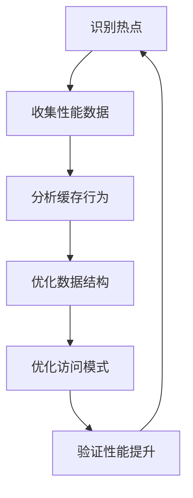

## 7. 参考资源

1. 进阶阅读
- [CPU Caches and Why You Care](https://www.aristeia.com/TalkNotes/ACCU2011_CPUCaches.pdf)
- [What Every Programmer Should Know About Memory](https://people.freebsd.org/~lstewart/articles/cpumemory.pdf)
- [Performance Analysis and Tuning on Modern CPUs](https://book.easyperf.net/perf_book)

2. 在线资源
- [Intel优化手册](https://software.intel.com/content/www/us/en/develop/documentation/cpp-compiler-developer-guide-and-reference/top/optimization-and-programming-guide.html)
- [AMD优化指南](https://developer.amd.com/resources/developer-guides-manuals/)
- 性能优化博客和论文:
  - [Agner Fog's Software optimization resources](https://www.agner.org/optimize/)
  - [Intel's Performance Analysis Guide](https://software.intel.com/content/www/us/en/develop/documentation/vtune-cookbook/top.html)
  - [Brendan Gregg's Blog](https://www.brendangregg.com/blog/)
  - [ACM Digital Library - Performance Section](https://dl.acm.org/topic/ccs2012/10010520.10010521.10010525)

## 8. 总结

### 8.1 CPU缓存优化的核心原则

1. **数据局部性原则**：
   - 时间局部性：最近访问过的数据可能很快再次被访问
   - 空间局部性：访问某个数据时，其附近的数据也可能被访问
   - 实践方法：合理组织数据结构和访问模式，利用CPU缓存特性

2. **内存访问模式优化**：
   - 顺序访问优于随机访问
   - 批量处理优于单点处理
   - 预取和预测优化
   - 实测结果：
     * L1缓存访问：~1-2ns
     * 顺序内存访问：~8ns
     * 随机内存访问：~40ns

3. **数据结构设计**：
   - AoS vs SoA的选择
   - 缓存行对齐
   - 避免伪共享
   - 实测结果：
     * 合理的数据结构可提升2-10倍性能
     * 避免伪共享可提升5-8倍性能

4. **多线程优化**：
   - 线程局部性
   - 数据分区
   - 批量同步
   - 无锁设计
   - 实测结果：
     * 线程本地缓存可减少90%以上的同步开销
     * 批量操作可提升3-5倍性能

5. **NUMA架构优化**：
   - 内存分配策略
   - 线程亲和性
   - 数据布局优化
   - 实测结果：
     * 本地访问：~100ns
     * 远程访问：~300ns
     * 合理的NUMA优化可提升2-3倍性能

### 8.2 性能优化方法论

1. **分析阶段**：
   - 使用性能分析工具
   - 识别性能瓶颈
   - 理解访问模式
   - 测量基准性能

2. **优化阶段**：
   - 数据结构优化
   - 算法优化
   - 访问模式优化
   - 并行优化

3. **验证阶段**：
   - 性能测试
   - 正确性验证
   - 测试不同场景
   - 收集性能数据

4. **维护阶段**：
   - 持续监控性能
   - 定期优化代码
   - 适应硬件变化
   - 更新优化策略

### 8.3 最佳实践建议

1. **设计阶段**：
   - 考虑数据访问模式
   - 选择合适的数据结构
   - 规划并行策略
   - 考虑缓存友好的算法

2. **实现阶段**：
   - 使用缓存行对齐
   - 实现批量处理
   - 优化内存布局
   - 实现并行处理

3. **测试阶段**：
   - 进行性能测试
   - 验证正确性
   - 测试不同场景
   - 收集性能数据

4. **维护阶段**：
   - 持续监控性能
   - 定期优化代码
   - 适应硬件变化
   - 更新优化策略

### 8.4 未来趋势

1. **硬件发展**：
   - 更大的缓存容量
   - 更复杂的缓存层次
   - 新的缓存一致性协议
   - 异构计算架构

2. **软件适应**：
   - 自适应优化
   - 智能缓存预测
   - 动态数据布局
   - 硬件感知算法

3. **优化方向**：
   - 能耗优化
   - 延迟优化
   - 带宽优化
   - 可扩展性优化

通过本文的学习和实践，我们可以：
1. 理解CPU缓存的工作原理
2. 掌握缓存优化的核心策略
3. 实现高性能的数据结构和算法
4. 编写缓存友好的并行程序
5. 解决实际性能问题

这些知识和技能对于开发高性能软件系统至关重要。随着硬件架构的不断发展，缓存优化将继续是性能优化中的重要领域。
