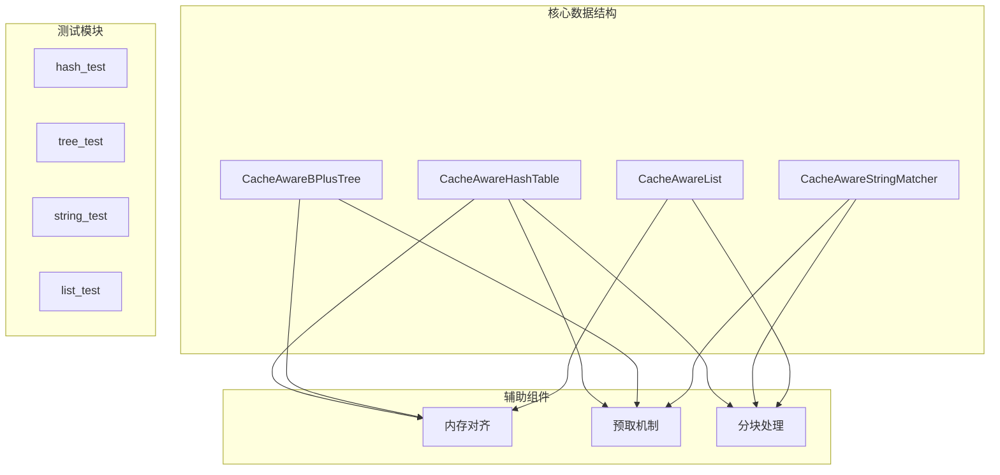
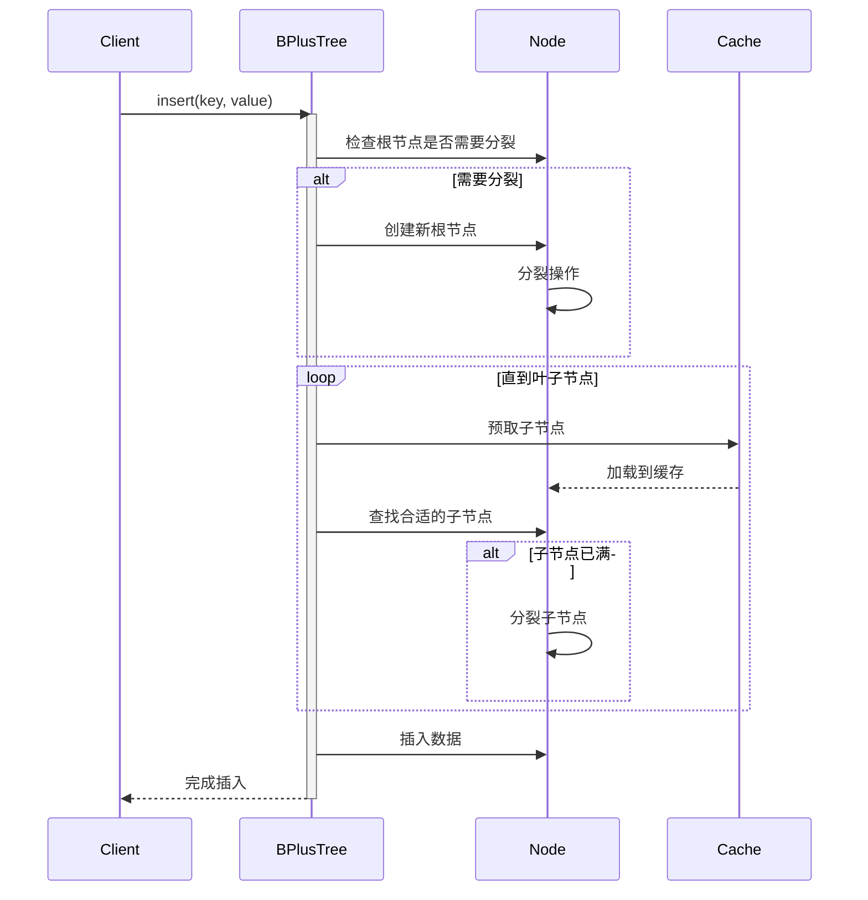
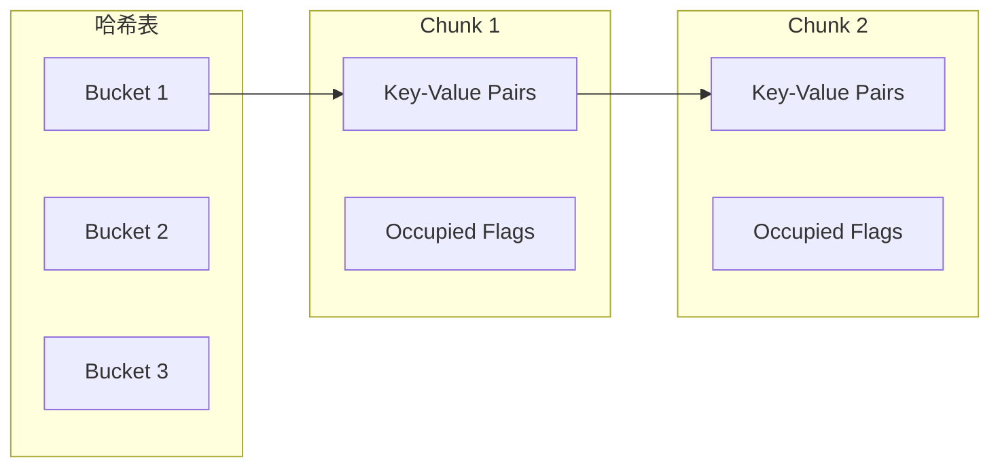
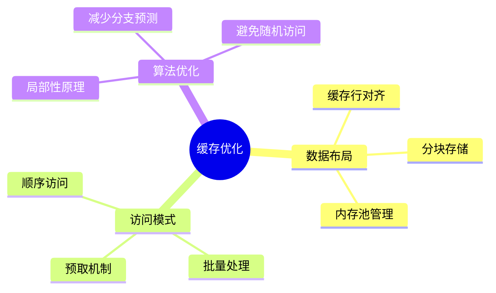
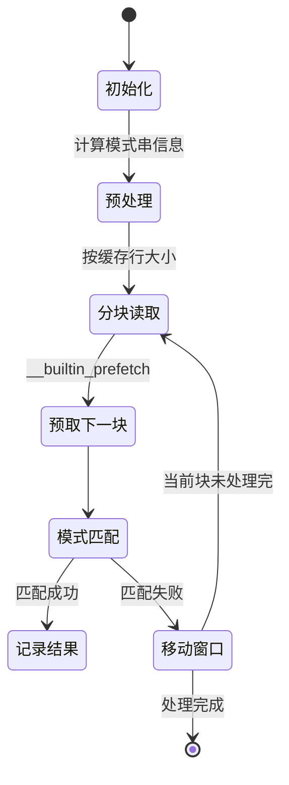
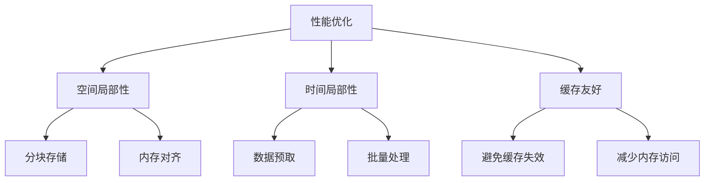
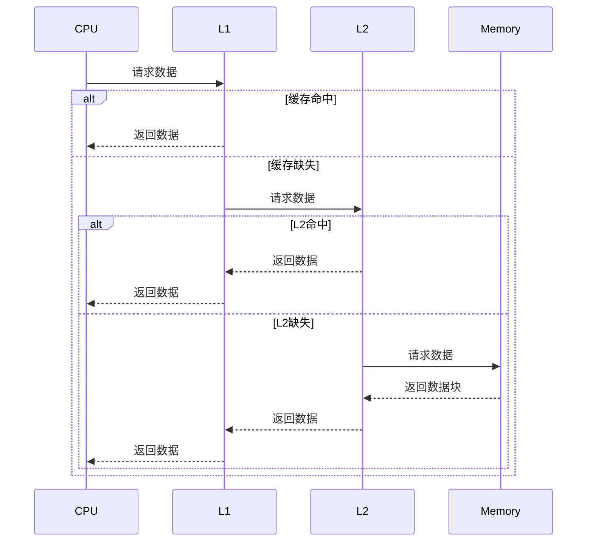
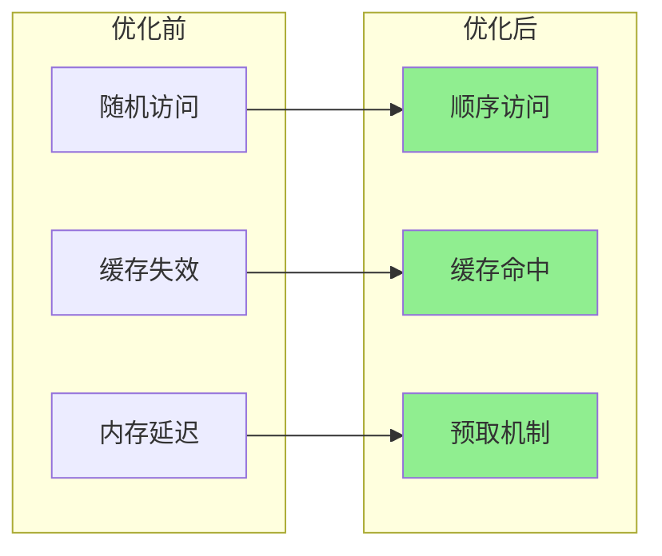

# 缓存友好数据结构设计文档

## 代码组织结构

```mermaid
graph TD
    subgraph 核心数据结构
        A[CacheAwareHashTable] 
        B[CacheAwareBPlusTree]
        C[CacheAwareStringMatcher]
        D[CacheAwareList]
    end
    
    subgraph 辅助组件
        E[内存对齐]
        F[预取机制]
        G[分块处理]
    end
    
    subgraph 测试模块
        H[hash_test]
        I[tree_test]
        J[string_test]
        K[list_test]
    end
    
    A --> E
    A --> F
    A --> G
    B --> E
    B --> F
    C --> G
    C --> F
    D --> E
    D --> G
```

## B+树操作时序图

```mermaid
sequenceDiagram
    participant Client
    participant BPlusTree
    participant Node
    participant Cache
    
    Client->>BPlusTree: insert(key, value)
    activate BPlusTree
    
    BPlusTree->>Node: 检查根节点是否需要分裂
    
    alt 需要分裂
        BPlusTree->>Node: 创建新根节点
        Node->>Node: 分裂操作
    end
    
    loop 直到叶子节点
        BPlusTree->>Cache: 预取子节点
        Cache-->>Node: 加载到缓存
        BPlusTree->>Node: 查找合适的子节点
        
        alt 子节点已满
            Node->>Node: 分裂子节点
        end
    end
    
    BPlusTree->>Node: 插入数据
    BPlusTree-->>Client: 完成插入
    deactivate BPlusTree
```

## 哈希表分块存储结构

```mermaid
graph LR
    subgraph 哈希表
        B1[Bucket 1]
        B2[Bucket 2]
        B3[Bucket 3]
    end
    
    subgraph Chunk 1
        C1[Key-Value Pairs]
        C2[Occupied Flags]
    end
    
    subgraph Chunk 2
        C3[Key-Value Pairs]
        C4[Occupied Flags]
    end
    
    B1 --> C1
    C1 --> C3
```

## 缓存优化策略

```mermaid
mindmap
    root((缓存优化))
        数据布局
            缓存行对齐
            分块存储
            内存池管理
        访问模式
            预取机制
            批量处理
            顺序访问
        算法优化
            局部性原理
            减少分支预测
            避免随机访问
```

## 字符串匹配优化流程

```mermaid
stateDiagram-v2
    [*] --> 初始化
    初始化 --> 预处理: 计算模式串信息
    预处理 --> 分块读取: 按缓存行大小
    分块读取 --> 预取下一块: __builtin_prefetch
    预取下一块 --> 模式匹配
    模式匹配 --> 记录结果: 匹配成功
    模式匹配 --> 移动窗口: 匹配失败
    移动窗口 --> 分块读取: 当前块未处理完
    移动窗口 --> [*]: 处理完成
```

## 性能优化关键点

```mermaid
graph TD
    A[性能优化] --> B[空间局部性]
    A --> C[时间局部性]
    A --> D[缓存友好]
    
    B --> E[分块存储]
    B --> F[内存对齐]
    
    C --> G[数据预取]
    C --> H[批量处理]
    
    D --> I[避免缓存失效]
    D --> J[减少内存访问]
```

## 内存访问模式

```mermaid
sequenceDiagram
    participant CPU
    participant L1
    participant L2
    participant Memory
    
    CPU->>L1: 请求数据
    alt 缓存命中
        L1-->>CPU: 返回数据
    else 缓存缺失
        L1->>L2: 请求数据
        alt L2命中
            L2-->>L1: 返回数据
            L1-->>CPU: 返回数据
        else L2缺失
            L2->>Memory: 请求数据
            Memory-->>L2: 返回数据块
            L2-->>L1: 返回数据
            L1-->>CPU: 返回数据
        end
    end
```

## 优化效果分析

```mermaid
graph LR
    subgraph 优化前
        A1[随机访问]
        B1[缓存失效]
        C1[内存延迟]
    end
    
    subgraph 优化后
        A2[顺序访问]
        B2[缓存命中]
        C2[预取机制]
    end
    
    A1 --> A2
    B1 --> B2
    C1 --> C2
    
    style A2 fill:#90EE90
    style B2 fill:#90EE90
    style C2 fill:#90EE90
``` 