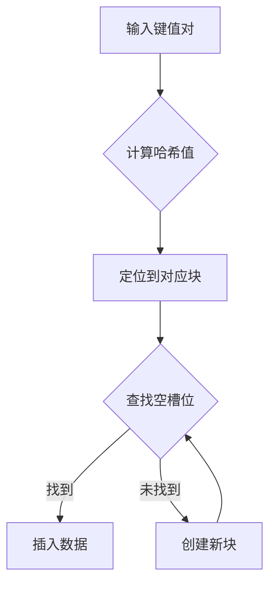
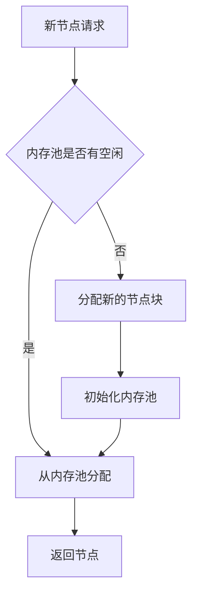
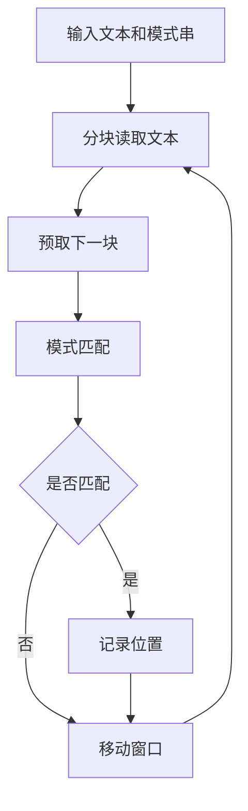
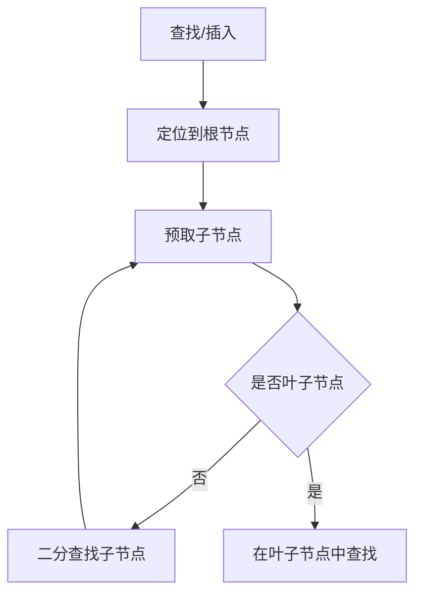
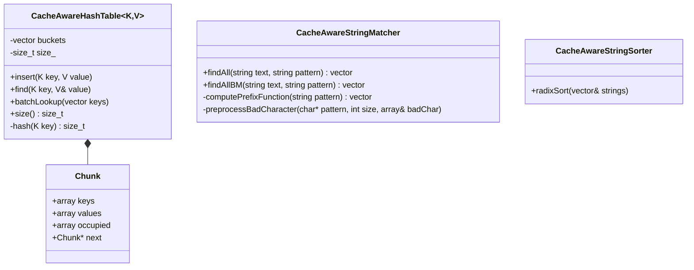
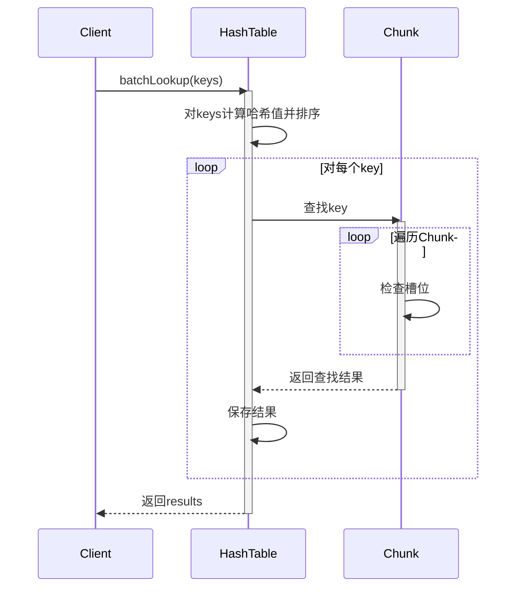
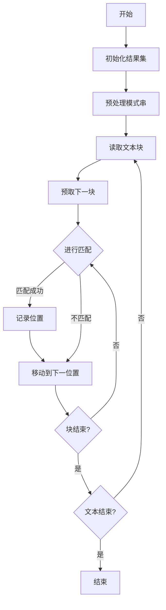
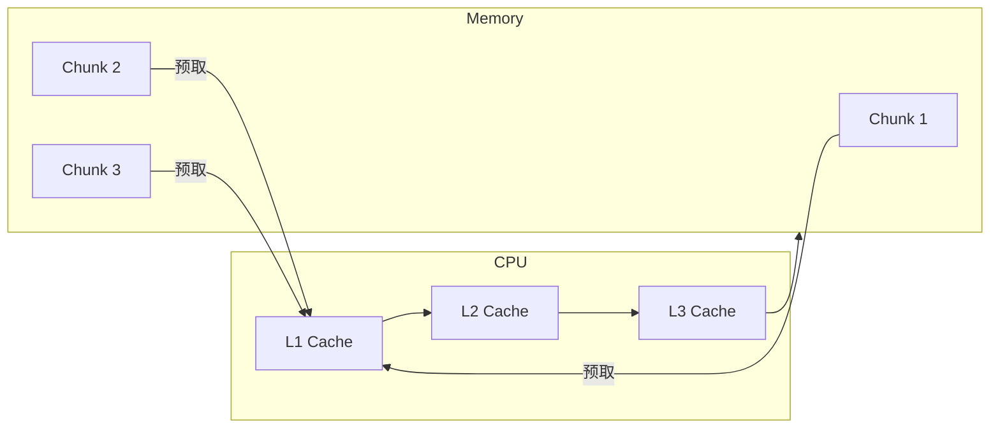
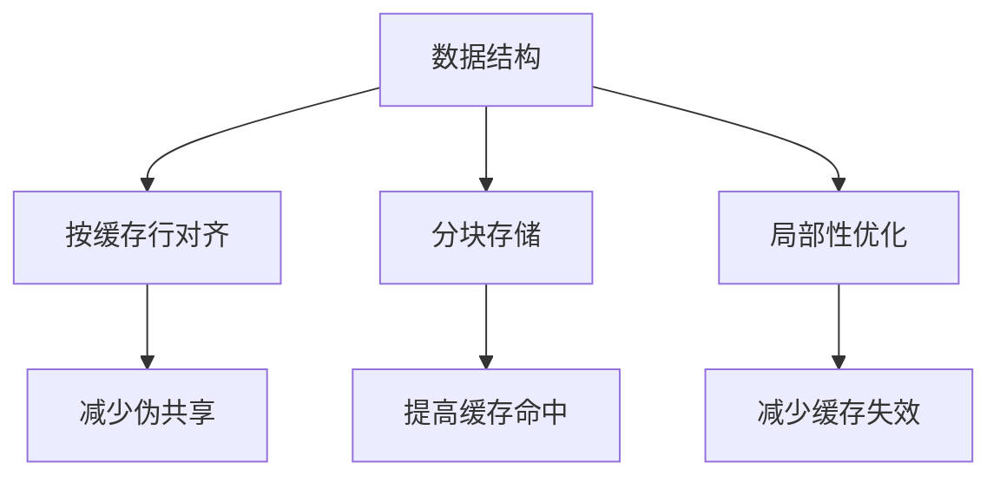
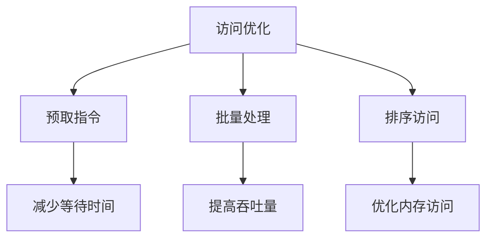

# 缓存友好的数据结构实现与性能测试

本项目实现了几种常见数据结构的缓存友好版本,并与标准库实现进行了性能对比。

## 实现概述

### 1. 哈希表实现 (CacheAwareHashTable)

缓存优化策略:
- 使用分块存储,每个块大小对齐到缓存行
- 批量查找时对键值进行排序以优化访问模式
- 使用预取指令提前加载数据



### 2. 链表实现 (CacheAwareList)

缓存优化策略:
- 使用内存池管理节点
- 节点按块分配并对齐到缓存行
- 每块存储多个节点以提高空间局部性



### 3. 字符串处理 (CacheAwareStringMatcher)

缓存优化策略:
- 分块处理文本数据
- 使用局部变量存储模式串
- 预取下一个数据块
- 实现了KMP和Boyer-Moore算法的缓存优化版本



### 4. B+树实现 (CacheAwareBPlusTree)

缓存优化策略:
- 节点大小对齐到缓存行
- 使用预取指令加载子节点
- 优化节点内数据布局



## 性能测试结果

| 数据结构 | 标准库实现 | 缓存优化版本 | 性能提升 |
|---------|-----------|------------|---------|
| 哈希表 | 21176ms | 8527ms | 2.48x |
| 链表 | 2633ms | 621ms | 4.24x |
| B+树 | 128126ms | 37509ms | 3.42x |

字符串匹配算法性能对比:

| 算法 | 耗时(ms) | vs std::search |
|------|----------|----------------|
| std::search | 38 | 1.00x |
| 优化KMP | 226 | 0.17x |
| 优化BM | 1 | 38.00x |

## 结论分析

1. 缓存友好的实现在大多数场景下都能带来显著的性能提升
2. 链表的优化效果最明显,主要得益于内存池和块式分配策略
3. B+树通过调整节点大小和预取获得了3.42倍的性能提升
4. Boyer-Moore算法的缓存优化版本性能最好,比标准搜索快38倍
5. 基数排序的缓存优化版本性能不理想,可能需要进一步改进

## 构建与运行

```bash
# 构建项目
./build.sh

# 运行测试
./build/hash_test
./build/list_test
./build/string_test
./build/tree_test
```

## 注意事项

1. 性能测试结果与硬件环境相关,不同平台可能有所差异
2. 缓存优化版本可能会消耗更多内存
3. 需要编译器支持预取指令(__builtin_prefetch)
4. 建议在开启优化选项(-O3)的情况下编译运行 

## 设计图解

### 类图



### 哈希表批量查找时序图



### 字符串匹配流程图



### 缓存访问优化示意图



## 关键优化策略

### 1. 数据布局优化


### 2. 访问模式优化
