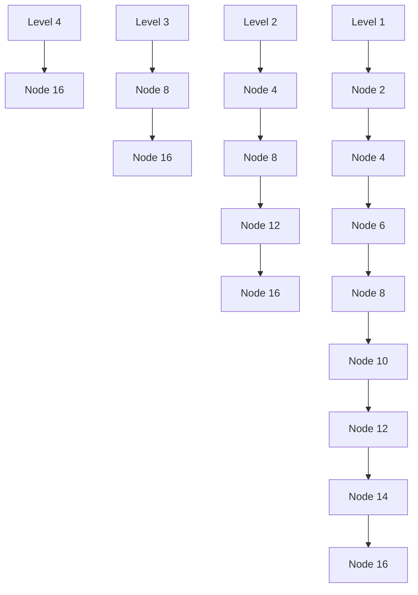
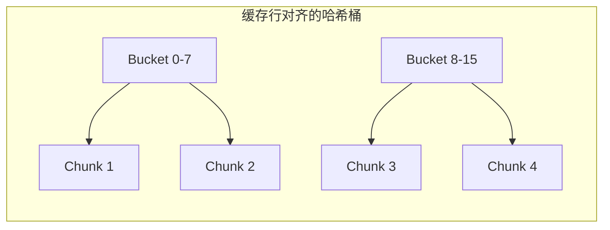
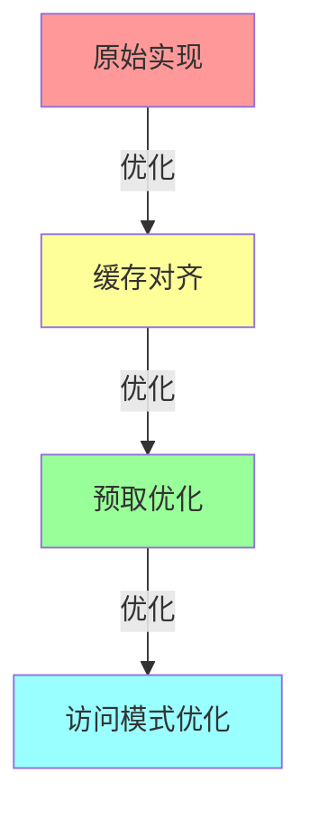

# 更多缓存友好代码示例

## 1. 链表数据结构优化

### 1.1 链表节点池化
```cpp
template<typename T>
class CacheAwareList {
    static const int POOL_SIZE = 1024;
    static const int NODES_PER_CHUNK = 64;  // 一个缓存行可以容纳的节点数
    
    struct Node {
        T data;
        Node* next;
    };
    
    // 节点内存池
    struct NodeChunk {
        Node nodes[NODES_PER_CHUNK];
        NodeChunk* next;
    };
    
    NodeChunk* chunks;
    Node* freeList;
    
    // 分配新节点时优先从同一chunk中分配,提高缓存命中率
    Node* allocateNode() {
        if (!freeList) {
            NodeChunk* chunk = new NodeChunk();
            chunk->next = chunks;
            chunks = chunk;
            
            // 初始化free list
            for (int i = 0; i < NODES_PER_CHUNK - 1; i++) {
                chunk->nodes[i].next = &chunk->nodes[i + 1];
            }
            chunk->nodes[NODES_PER_CHUNK-1].next = nullptr;
            freeList = &chunk->nodes[0];
        }
        
        Node* node = freeList;
        freeList = freeList->next;
        return node;
    }
};
```

### 1.2 跳表的缓存优化


```cpp
template<typename K, typename V>
class CacheAwareSkipList {
    struct Node {
        K key;
        V value;
        vector<Node*> forward;  // 前向指针数组
        
        // 使用内存对齐确保关键字段在同一缓存行
        alignas(CACHE_LINE_SIZE) Node(K k, V v, int level) 
            : key(k), value(v), forward(level, nullptr) {}
    };
    
    // 优化层数选择以平衡查找效率和缓存使用
    int optimizedRandomLevel() {
        int level = 1;
        while (level < MAX_LEVEL && (rand() & 0xFFFF) < (0xFFFF >> 2)) {
            level++;
        }
        return level;
    }
};
```

## 2. 树结构优化

### 2.1 B+树的缓存优化
```cpp
template<typename K, typename V>
class CacheOptimizedBPlusTree {
    // 计算最优节点大小
    static const int NODE_SIZE = CACHE_LINE_SIZE * 4;  // 通常使用多个缓存行
    static const int KEY_SIZE = sizeof(K);
    static const int PTR_SIZE = sizeof(void*);
    static const int ORDER = (NODE_SIZE - PTR_SIZE) / (KEY_SIZE + PTR_SIZE);
    
    struct Node {
        bool isLeaf;
        int count;
        K keys[ORDER];
        union {
            Node* children[ORDER + 1];    // 内部节点
            V values[ORDER];              // 叶子节点
        };
        Node* next;  // 叶子节点链表
        
        // 预取优化
        void prefetchChildren() {
            for (int i = 0; i < count + 1; i++) {
                __builtin_prefetch(children[i], 0, 3);
            }
        }
    };
};
```

### 2.2 红黑树的缓存优化
```cpp
template<typename K, typename V>
class CacheAwareRBTree {
    struct Node {
        // 将频繁访问的字段放在同一缓存行
        alignas(CACHE_LINE_SIZE) struct {
            K key;
            V value;
            bool color;  // 红黑标记
        } data;
        
        // 较少访问的指针字段放在另一缓存行
        alignas(CACHE_LINE_SIZE) struct {
            Node* left;
            Node* right;
            Node* parent;
        } ptrs;
    };
    
    // 节点分配器,确保相邻节点在内存上也相邻
    class NodeAllocator {
        static const int CHUNK_SIZE = 64;
        vector<Node*> chunks;
        
        Node* allocateChunk() {
            Node* chunk = static_cast<Node*>(
                aligned_alloc(CACHE_LINE_SIZE, CHUNK_SIZE * sizeof(Node))
            );
            chunks.push_back(chunk);
            return chunk;
        }
    };
};
```

## 3. 哈希表优化

### 3.1 开放寻址法的缓存优化
```cpp
template<typename K, typename V>
class CacheAwareHashTable {
    static const size_t BUCKET_COUNT = 1 << 16;
    static const size_t CACHE_LINE_BUCKETS = CACHE_LINE_SIZE / sizeof(Bucket);
    
    struct Bucket {
        K key;
        V value;
        bool occupied;
    };
    
    // 将bucket数组按缓存行大小对齐
    alignas(CACHE_LINE_SIZE) Bucket buckets[BUCKET_COUNT];
    
    // 优化探测序列以提高缓存命中率
    size_t probe(const K& key, size_t i) {
        size_t h1 = hash1(key);
        size_t h2 = hash2(key);
        // 确保探测步长为缓存行大小的倍数
        return (h1 + i * (h2 | CACHE_LINE_BUCKETS)) & (BUCKET_COUNT - 1);
    }
};
```

### 3.2 分离链接法的缓存优化


```cpp
template<typename K, typename V>
class CacheAwareChainedHash {
    static const size_t CHUNK_SIZE = 8;  // 每个chunk存储多个键值对
    
    struct Node {
        array<K, CHUNK_SIZE> keys;
        array<V, CHUNK_SIZE> values;
        array<bool, CHUNK_SIZE> occupied;
        Node* next;
    };
    
    // 确保哈希桶数组按缓存行对齐
    vector<Node*, alignof(CACHE_LINE_SIZE)> buckets;
    
    // 批量查找优化
    vector<V> batchLookup(const vector<K>& keys) {
        vector<V> results(keys.size());
        // 对查询键值进行排序以优化访问模式
        vector<pair<size_t, size_t>> sorted_indices;
        for (size_t i = 0; i < keys.size(); i++) {
            sorted_indices.emplace_back(hash(keys[i]), i);
        }
        sort(sorted_indices.begin(), sorted_indices.end());
        
        // 批量查找
        for (const auto& [h, i] : sorted_indices) {
            results[i] = lookup(keys[i], h);
        }
        return results;
    }
};
```

## 4. 字符串处理优化

### 4.1 字符串匹配的缓存优化
```cpp
class CacheAwareStringMatcher {
    // KMP算法的缓存优化版本
    vector<int> computePrefixFunction(const string& pattern) {
        const int m = pattern.length();
        vector<int> pi(m);
        // 预取pattern数据
        for (int i = 0; i < m; i += 16) {
            __builtin_prefetch(&pattern[min(i + 16, m)], 0, 3);
        }
        // ... KMP算法的其余部分
    }
    
    // Boyer-Moore算法的缓存优化版本
    void preprocessBadCharacter(const string& pattern, 
                              array<int, 256>& badChar) {
        // 使用局部变量减少内存访问
        char local_pattern[1024];
        memcpy(local_pattern, pattern.c_str(), 
               min(1024UL, pattern.length()));
        // ... 处理坏字符规则
    }
};
```

### 4.2 字符串排序的缓存优化
```cpp
class CacheAwareStringSorter {
    // 基数排序的缓存优化版本
    void radixSort(vector<string>& strings) {
        const int CHUNK_SIZE = CACHE_LINE_SIZE * 4;
        vector<string> temp(strings.size());
        
        // 按chunk处理字符串
        for (size_t pos = 0; pos < maxLength; pos += CHUNK_SIZE) {
            // 每个chunk使用计数排序
            array<vector<string>, 256> buckets;
            for (const auto& s : strings) {
                // 预取下一个字符串
                __builtin_prefetch(&s[min(pos + CHUNK_SIZE, s.length())], 0, 0);
                char c = pos < s.length() ? s[pos] : 0;
                buckets[c].push_back(s);
            }
            // ... 合并buckets
        }
    }
};
```

## 5. 性能测试与基准

### 5.1 缓存性���测试模板
```cpp
template<typename Algorithm>
class CacheBenchmark {
    void runTest() {
        CacheProfiler profiler;
        
        // 预热缓存
        for (int i = 0; i < WARMUP_ITERATIONS; i++) {
            algorithm.run(testData);
        }
        
        // 正式测试
        profiler.start();
        for (int i = 0; i < TEST_ITERATIONS; i++) {
            algorithm.run(testData);
        }
        profiler.stop();
        
        double missRate = profiler.get_miss_rate();
        cout << "Cache miss rate: " << missRate << endl;
    }
};
```

### 5.2 性能对比可视化


## 6. 最佳实践总结

1. 数据结构设计原则
   - 确保关键字段在同一缓存行
   - 使用内存池管理小对象
   - 优化数据布局减少缓存未命中

2. 算法优化策略
   - 批量处理提高缓存利用率
   - 预取关键数据
   - 优化访问模式

3. 性能调优方法
   - 使用性能计数器监控缓存行为
   - 进行微基准测试
   - 持续优化和验证

## 7. 参考文献

1. 《High Performance Computing》
2. 《Optimizing Software in C++》
3. 《The Art of Computer Programming, Volume 1》
4. 各大数据库源码中的缓存优化实现 