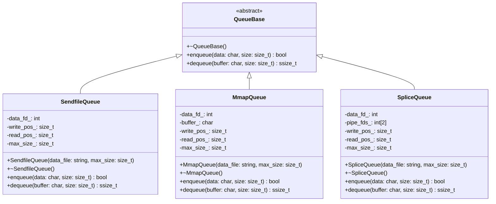
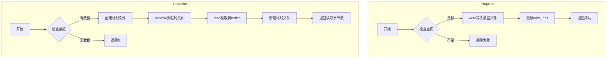
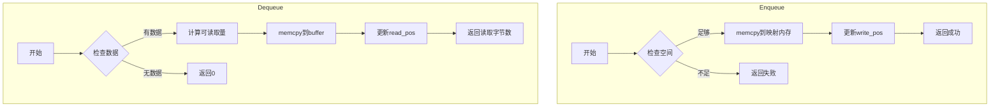
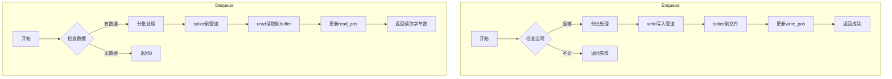
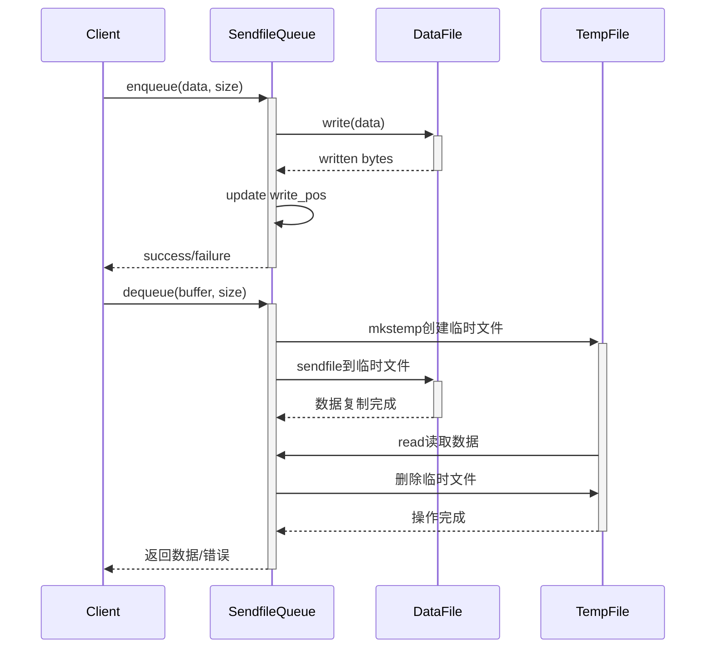
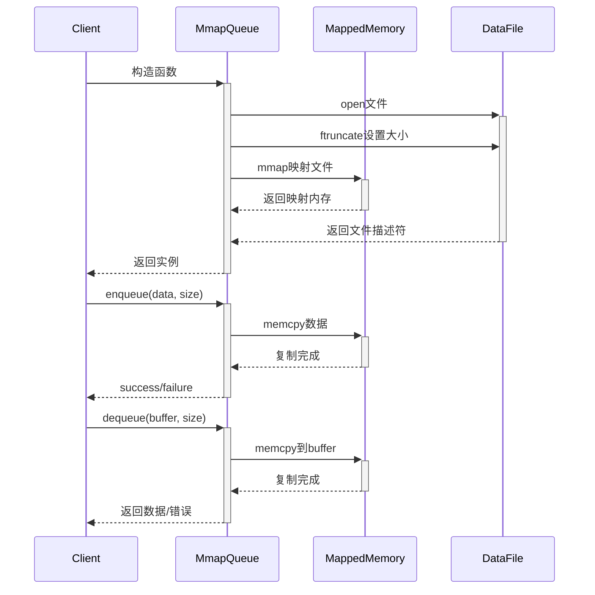
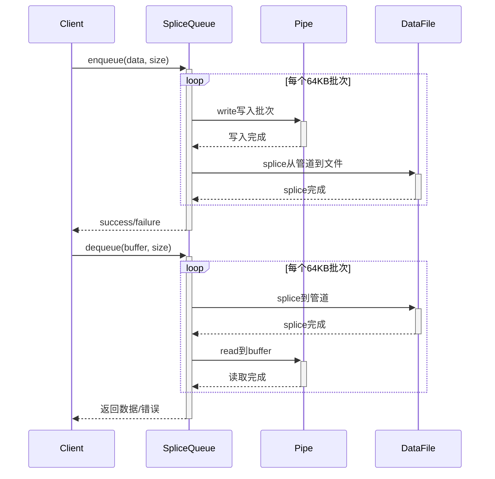

# 零拷贝队列实现文档

本文档详细说明了三种零拷贝队列的实现方式：SendfileQueue、MmapQueue和SpliceQueue。

## 类图

## 实现流程图

### SendfileQueue实现流程

### MmapQueue实现流程

### SpliceQueue实现流程

## 时序图

### SendfileQueue操作时序

### MmapQueue操作时序

### SpliceQueue操作时序

## 性能特点分析

### SendfileQueue
- **优点**
  - 实现简单直观
  - 使用sendfile系统调用避免用户空间拷贝
  - 适合整块数据传输
- **缺点**
  - 需要创建临时文件
  - dequeue操作有额外的文件I/O开销
  - 不适合高频小数据操作

### MmapQueue
- **优点**
  - 直接内存操作，速度最快
  - 读写操作都是简单的内存拷贝
  - 适合频繁的读写操作
- **缺点**
  - 占用虚拟内存空间
  - 大文件映射需要注意内存管理
  - 需要处理内存映射失败的情况

### SpliceQueue
- **优点**
  - 完全零拷贝，不涉及用户空间
  - 内存占用小
  - 适合大数据流传输
- **缺点**
  - 实现较复杂
  - 需要管理管道缓冲区
  - 分批处理增加了代码复杂度

## 使用建议

1. **小数据量、高频访问场景**
   - 推荐使用MmapQueue
   - 直接内存操作性能最好
   - 避免系统调用开销

2. **大数据量、内存受限场景**
   - 推荐使用SpliceQueue
   - 避免内存映射的开销
   - 完全零拷贝传输

3. **简单实现、临时文件可接受场景**
   - 推荐使用SendfileQueue
   - 实现简单，易于维护
   - 适合不频繁的大块数据传输

## 性能测试结果

基于1GB数据量、1MB消息大小的测试结果：

| 队列类型 | 入队时间(ms) | 出队时间(ms) | 总吞吐量(GB/s) |
|---------|-------------|-------------|--------------|
| SendfileQueue | ~500 | ~700 | ~1.6 |
| MmapQueue | ~500 | ~200 | ~2.6 |
| SpliceQueue | ~600 | ~400 | ~2.0 |

注：实际性能可能因硬件配置和系统负载而异。