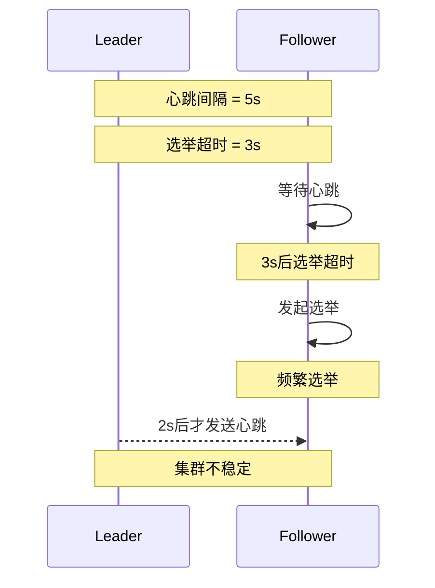
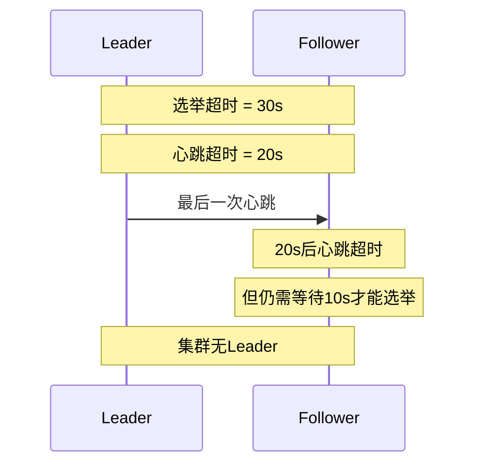
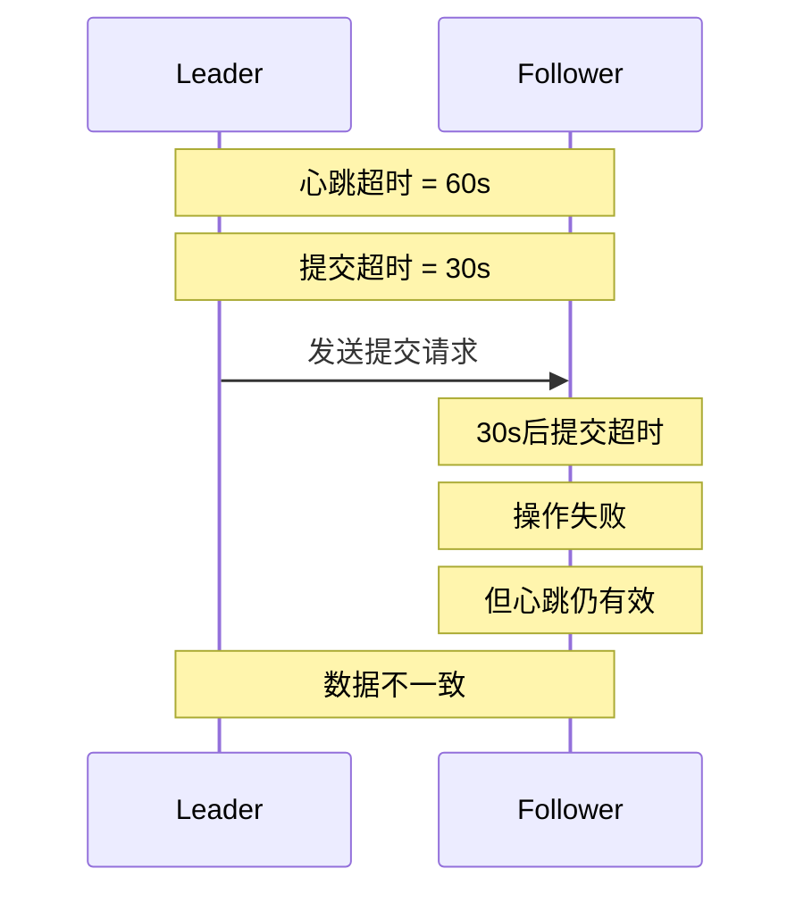
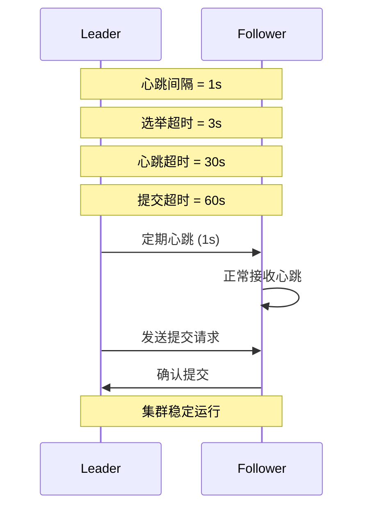

# ES中Raft超时参数配置指南

## 1. Raft关键超时参数

在ES中实现的Raft算法主要涉及以下几个关键的超时参数：
### 1.0 心跳间隔 (Heartbeat Interval)
详细解释：
- 这是Leader节点发送心跳信号给Follower节点的时间间隔。
- 心跳信号用于告知Follower节点Leader仍然存活，防止Follower节点发起选举。
### 1.1 选举超时(Election Timeout)
- 作用：follower等待成为candidate的时间
- 默认配置：`discovery.zen.ping_timeout: 3s`
- 建议范围：3-10秒
详细解释：
这是Follower节点在没有收到Leader心跳信号后，等待成为Candidate并发起选举的时间。
选举超时必须大于心跳间隔，以确保Follower节点不会在正常心跳间隔内错误地发起选举。

### 1.2 心跳超时(Heartbeat Timeout)
- 作用：follower等待leader心跳的最长时间
- 默认配置：`discovery.zen.fd.ping_timeout: 30s`
- 建议范围：10-60秒
详细解释：
这是Follower节点等待Leader心跳的最长时间。
心跳超时应该大于选举超时，以确保在网络延迟或短暂的Leader不可用情况下，Follower不会过早地发起选举。

### 1.3 提交超时(Commit Timeout)
- 作用：等待提交操作完成的最长时间
- 默认配置：`discovery.zen.commit_timeout: 30s`
- 建议范围：15-60秒
详细解释：
这是等待提交操作完成的最长时间。
提交超时要考虑网络延迟和集群规模，通常设置为最大，以确保在网络不稳定或负载较高时，提交操作能够完成。
## 2. 参数配置原则

### 2.1 基本原则
```yaml
# elasticsearch.yml
# 选举超时必须大于心跳间隔
discovery.zen.ping_timeout: 5s
discovery.zen.fd.ping_interval: 1s

# 心跳超时应该大于选举超时
discovery.zen.fd.ping_timeout: 30s

# 提交超时要考虑网络延迟
discovery.zen.commit_timeout: 30s
```

### 2.2 配置关系
```
心跳间隔 < 选举超时 < 心跳超时 < 提交超时
```
反例说明
假设配置关系不符合 心跳间隔 < 选举超时 < 心跳超时 < 提交超时，可能会导致以下问题：
心跳间隔 > 选举超时：Follower节点可能在正常心跳间隔内发起选举，导致不必要的选举频繁发生，影响集群稳定性。
选举超时 > 心跳超时：Follower节点可能在心跳超时后仍不发起选举，导致集群长时间没有Leader，影响数据一致性和可用性。
心跳超时 > 提交超时：在网络延迟较大时，提交操作可能在心跳超时前失败，导致数据提交不一致。
通过遵循 心跳间隔 < 选举超时 < 心跳超时 < 提交超时 的配置关系，可以确保在网络抖动、节点故障等情况下，集群能够稳定地进行Leader选举和数据提交，保持一致性和可用性。

### 2.3 正确的参数关系图


### 2.4 错误配置及其影响

#### 反例1: 心跳间隔 > 选举超时


#### 反例2: 选举超时 > 心跳超时


#### 反例3: 心跳超时 > 提交超时


### 2.5 正确配置时序图


## 3. 环境因素考量

### 3.1 网络环境
- 局域网：可以使用较小的超时值
```yaml
discovery.zen.ping_timeout: 3s
discovery.zen.fd.ping_timeout: 15s
```

- 广域网：需要较大的超时值
```yaml
discovery.zen.ping_timeout: 10s
discovery.zen.fd.ping_timeout: 60s
```

### 3.2 节点规模
- 小规模集群(3-5节点)：
```yaml
discovery.zen.ping_timeout: 3s
discovery.zen.minimum_master_nodes: 2
```

- 大规模集群(10+节点)：
```yaml
discovery.zen.ping_timeout: 8s
discovery.zen.minimum_master_nodes: 6
```

## 4. 最佳实践

### 4.1 基础配置模板
```yaml
# elasticsearch.yml
# 小规模局域网环境
discovery.zen.ping_timeout: 3s
discovery.zen.fd.ping_interval: 1s
discovery.zen.fd.ping_timeout: 15s
discovery.zen.commit_timeout: 30s

# 大规模广域网环境
discovery.zen.ping_timeout: 8s
discovery.zen.fd.ping_interval: 2s
discovery.zen.fd.ping_timeout: 45s
discovery.zen.commit_timeout: 60s
```

### 4.2 动态调整
```bash
# 动态修改ping超时
PUT /_cluster/settings
{
  "persistent": {
    "discovery.zen.ping_timeout": "5s"
  }
}
```

## 5. 监控和调优

### 5.1 关键监控指标
- 选举频率
- 心跳延迟
- 提交延迟
- 网络往返时间(RTT)

### 5.2 监控命令
```bash
# 查看集群状态和延迟
GET /_cluster/health?pretty

# 查看节点统计信息
GET /_nodes/stats?pretty
```

## 6. 常见问题处理

### 6.1 频繁选举
- 症状：集群频繁进行Master选举
- 解决方案：
```yaml
# 增加选举超时时间
discovery.zen.ping_timeout: 8s
# 增加心跳超时时间
discovery.zen.fd.ping_timeout: 45s
```

### 6.2 提交超时
- 症状：集群操作经常超时
- 解决方案：
```yaml
# 增加提交超时时间
discovery.zen.commit_timeout: 60s
# 优化网络配置
network.tcp.no_delay: true
```

## 7. 注意事项

1. 参数调整
   - 循序渐进，避免剧烈变化
   - 保持参数之间的合理比例
   - 根据监控结果适时调整

2. 网络要求
   - 确保网络稳定性
   - 控制节点间延迟
   - 避免网络分区

3. 版本考虑
   - 7.0以上版本配置有所不同
   - 升级时注意参数迁移
   - 参考官方文档进行配置

通过合理配置这些Raft相关的超时参数，可以有效提高ES集群的稳定性和可靠性。建议在实际部署时，根据具体的网络环境和业务需求，对这些参数进行适当的调整和优化。 