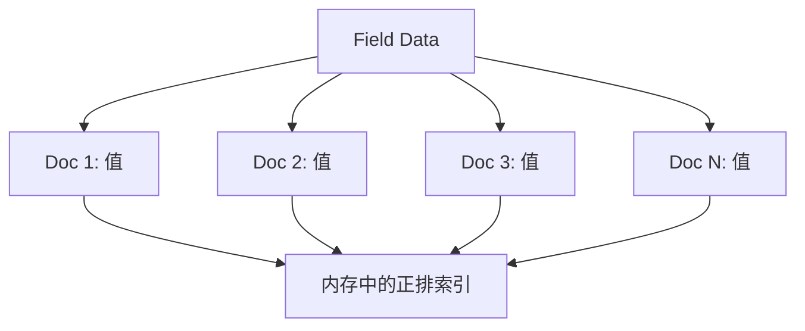
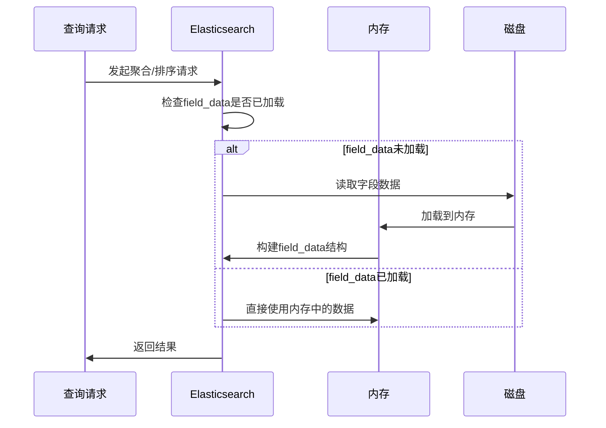
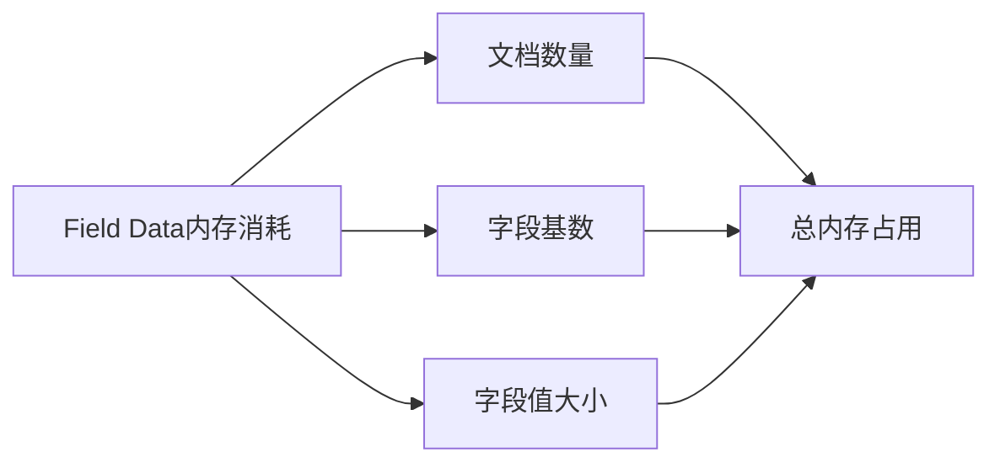
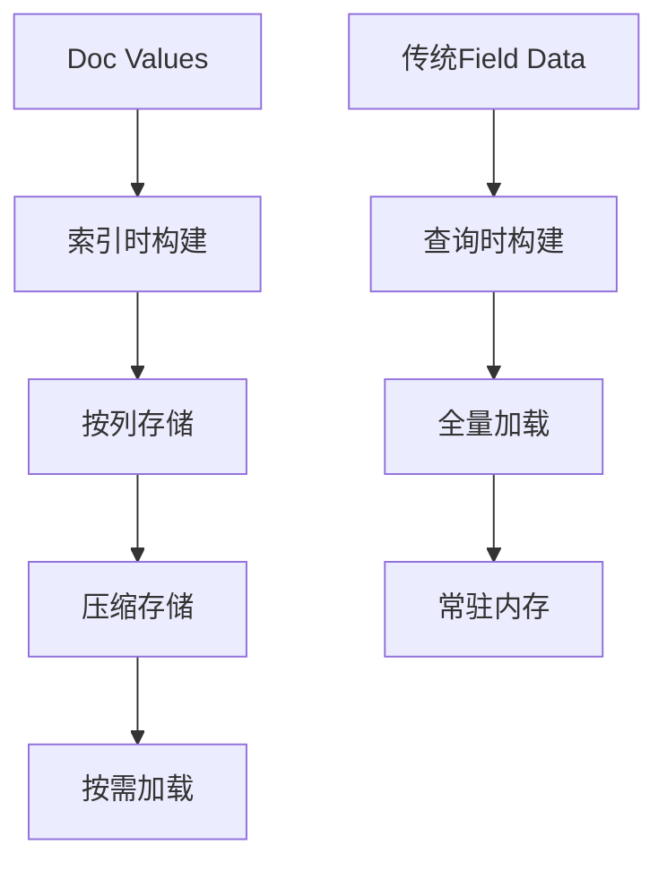
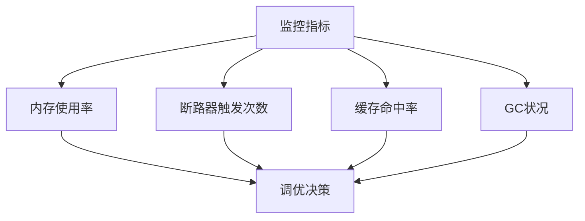
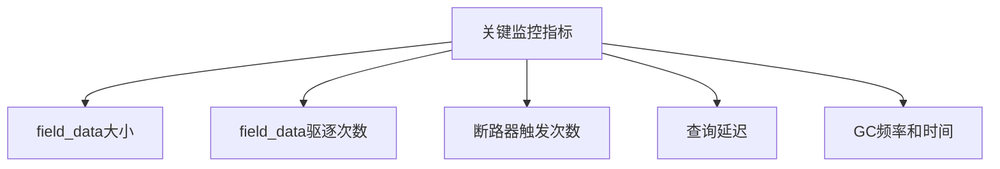
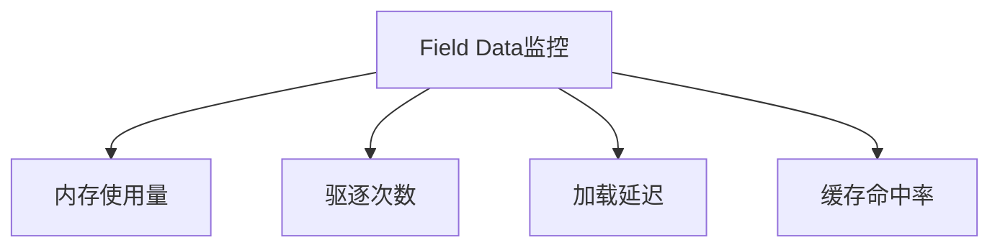
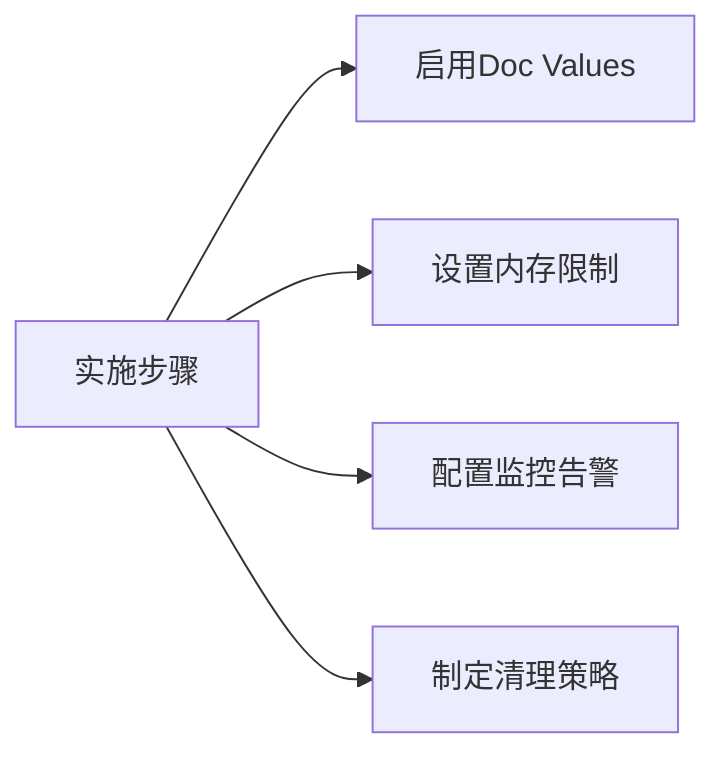

# ES中的field_data是什么,如何优化性能

## 引言
在 Elasticsearch 中，`field_data` 是一种用于存储字段值的内存数据结构，主要用于聚合、排序和脚本计算等操作。它通过在内存中构建字段值的正排索引来提供快速访问能力，但同时也可能带来显著的内存开销。

## field_data 的定义与结构

### 1. 基本概念
`field_data` 是ES中的一种内存数据结构:
- 用于在内存中构建字段的正排索引
- 主要服务于聚合、排序和脚本计算
- 默认情况下是延迟加载的
- 加载后会常驻内存直到被清除

### 2. 数据结构示意


### 3. 加载过程


## 性能问题

### 1. 内存消耗分析


### 2. 常见性能瓶颈
- **内存溢出**: 当字段数据量过大时可能导致OOM
- **GC压力**: 频繁的字段数据加载会增加GC频率
- **查询延迟**: 首次加载field_data时会产生较高延迟
- **内存碎片**: 长期使用可能导致内存碎片化

## 优化方法

### 1. 使用 Doc Values
Doc Values是ES中一种磁盘上的列式存储格式,可以替代field_data。它在索引时就会构建并存储在磁盘上,而不是在查询时动态加载到内存。

#### 工作原理


#### 优势分析
1. **内存友好**
   - 按需加载而不是全量加载
   - 可以被操作系统页缓存
   - GC压力小

2. **性能优势**
   - 避免了查询时的构建开销
   - 减少了IO操作
   - 支持操作系统级别的缓存

#### 配置示例
```json
{
  "mappings": {
    "properties": {
      "my_field": {
        "type": "keyword",
        "doc_values": true
      }
    }
  }
}
```

#### 使用场景
- 适用于聚合、排序、脚本计算等操作
- 特别适合处理keyword、numeric、date等结构化字段
- 不适用于text类型字段(需要分词的字段)

### 2. 内存限制设置

#### Circuit Breaker机制
ES使用断路器(Circuit Breaker)来防止OOM:


#### 关键配置参数
1. **indices.fielddata.cache.size**
   ```json
   {
     "indices.fielddata.cache.size": "20%"
   }
   ```
   - 控制field_data缓存的总大小
   - 可以设置具体值(如"2gb")或百分比
   - 达到限制时会触发LRU淘汰

2. **indices.breaker.fielddata.limit**
   ```json
   {
     "indices.breaker.fielddata.limit": "60%"
   }
   ```
   - 控制单个请求的内存限制
   - 防止单个请求消耗过多内存
   - 超过限制会抛出CircuitBreakingException

3. **indices.breaker.request.limit**
   ```json
   {
     "indices.breaker.request.limit": "40%"
   }
   ```
   - 控制请求级别的内存限制
   - 包括请求缓冲区等临时内存使用

#### 监控与调优


### 3. 字段类型优化

#### 合理使用字段类型
1. **keyword vs text**
   ```json
   {
     "mappings": {
       "properties": {
         "user_id": {
           "type": "keyword"  // 不需要分词的字段用keyword
         },
         "description": {
           "type": "text",    // 需要分词的字段用text
           "fielddata": false,
           "fields": {
             "keyword": {     // 同时需要聚合时添加keyword子字段
               "type": "keyword",
               "doc_values": true
             }
           }
         }
       }
     }
   }
   ```

2. **Numeric字段优化**
   ```json
   {
     "mappings": {
       "properties": {
         "price": {
           "type": "scaled_float",  // 使用scaled_float替代float
           "scaling_factor": 100
         }
       }
     }
   }
   ```

#### 字段存储策略
1. **禁用不需要的字段**
   ```json
   {
     "mappings": {
       "properties": {
         "unused_field": {
           "enabled": false
         }
       }
     }
   }
   ```

2. **控制索引选项**
   ```json
   {
     "mappings": {
       "properties": {
         "content": {
           "type": "text",
           "index": false,      // 不需要搜索的字段禁用索引
           "doc_values": false  // 不需要聚合/排序的字段禁用doc_values
         }
       }
     }
   }
   ```

### 4. 查询优化建议

#### 延迟加载策略
```json
{
  "mappings": {
    "properties": {
      "title": {
        "type": "text",
        "fielddata": true,
        "fielddata_frequency_filter": {
          "min": 0.001,
          "max": 0.1,
          "min_segment_size": 500
        }
      }
    }
  }
}
```

#### 预加载配置
```json
{
  "index": {
    "preload_indices": true,
    "preload_fields": ["field1", "field2"]
  }
}
```

#### 缓存预热
```bash
# 预热特定字段的field_data
POST /my_index/_cache/prepare_fielddata
{
  "fields": ["field1", "field2"]
}
```

### 实践建议

#### 1. 系统层面
- 预估数据量和内存需求
- 合理配置JVM堆大小
- 监控GC情况
- 定期清理缓存

#### 2. 应用层面
- 避免对大基数text字段使用field_data
- 合理使用doc_values
- 控制聚合和排序的字段数量
- 使用过滤器减少需要处理的文档数

#### 3. 监控指标


这些优化方法需要根据具体场景和需求来选择和组合使用,没有一种通用的最佳方案。需要通过监控和测试来确定最适合的优化策略。

## 使用场景与示例

### 1. 文本字段聚合
```json
GET /my_index/_search
{
  "aggs": {
    "text_terms": {
      "terms": {
        "field": "text_field",
        "size": 10
      }
    }
  }
}
```

### 2. 自定义排序
```json
GET /my_index/_search
{
  "sort": [
    {
      "text_field": {
        "order": "desc"
      }
    }
  ]
}
```

### 3. 脚本计算
```json
GET /my_index/_search
{
  "script_fields": {
    "custom_score": {
      "script": {
        "lang": "painless",
        "source": "doc['numeric_field'].value * 2"
      }
    }
  }
}
```

## 监控与维护

### 1. 监控指标


### 2. 清理命令
```bash
# 清理所有field_data缓存
POST /_cache/clear?fielddata=true

# 清理特定索引的field_data缓存
POST /my_index/_cache/clear?fielddata=true
```

### 3. 查看统计信息
```bash
# 查看field_data使用统计
GET /_stats/fielddata?fields=*

# 查看特定字段的field_data使用情况
GET /_nodes/stats/indices/fielddata?fields=my_field
```

## 最佳实践建议

### 1. 设计阶段
- 评估字段的使用方式
- 选择合适的字段类型
- 规划内存使用

### 2. 实施阶段


### 3. 运维阶段
- 定期监控内存使用
- 及时清理无用缓存
- 优化查询模式
- 合理设置刷新策略

## 总结
field_data是ES中重要的内存数据结构，合理使用和优化可以显著提升性能。主要优化手段包括使用Doc Values、控制内存使用、选择合适的字段类型等。同时需要建立完善的监控和维护机制，确保系统稳定运行。

## 参考资料
1. [Elasticsearch官方文档 - Field Data](https://www.elastic.co/guide/en/elasticsearch/reference/current/fielddata.html)
2. [Elasticsearch权威指南 - Field Data](https://www.elastic.co/guide/cn/elasticsearch/guide/current/fielddata.html)
3. [Elasticsearch性能优化实战](https://www.elastic.co/blog/performance-considerations-elasticsearch-indexing)