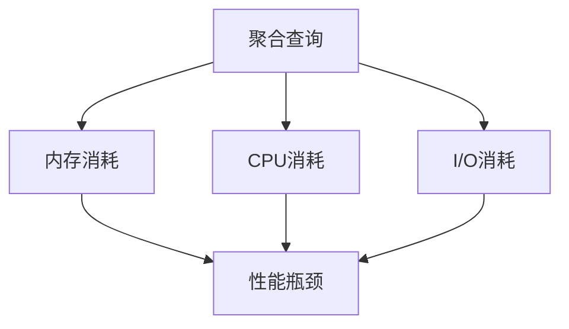
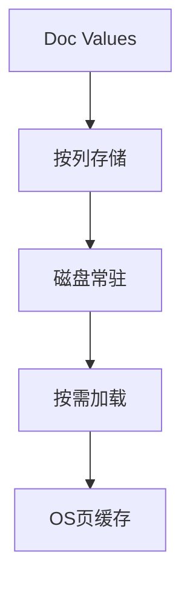
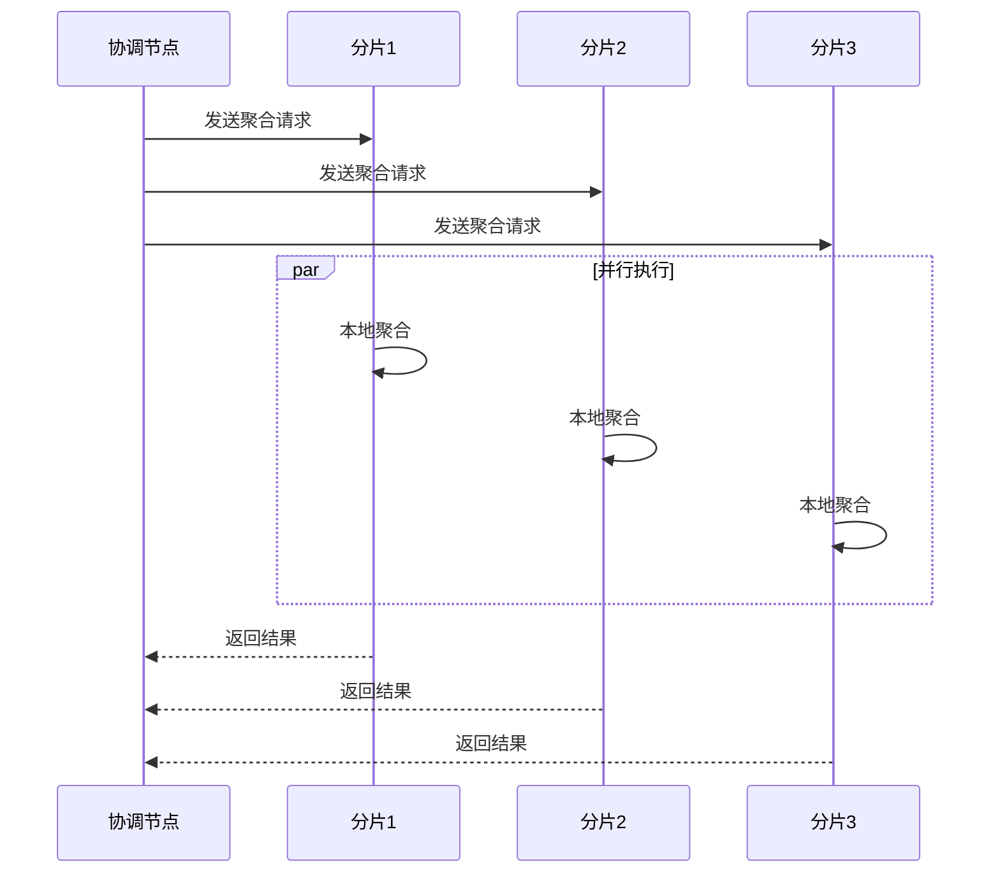
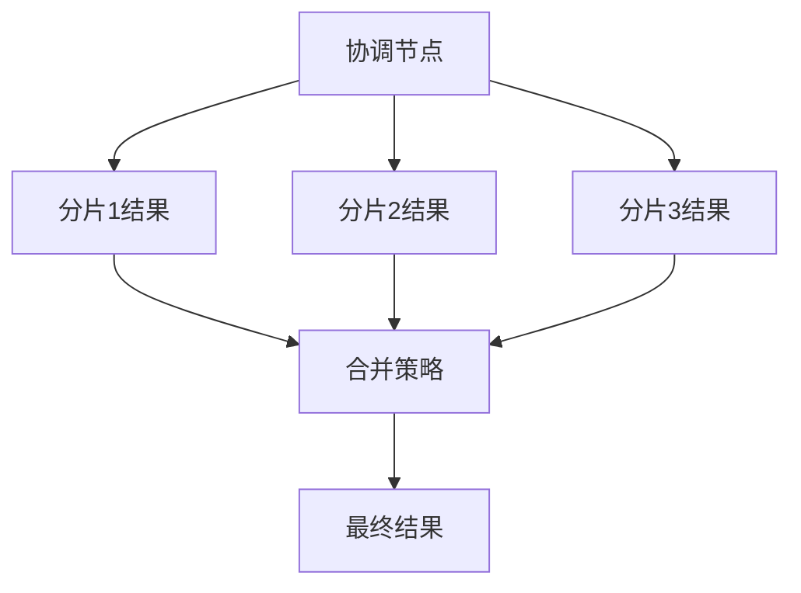
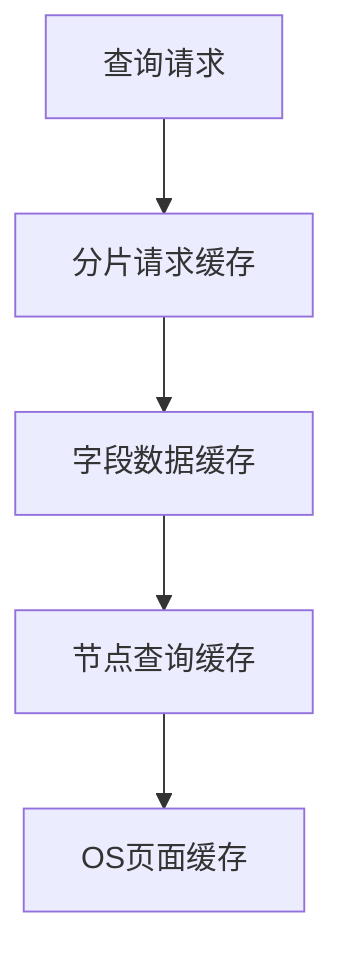
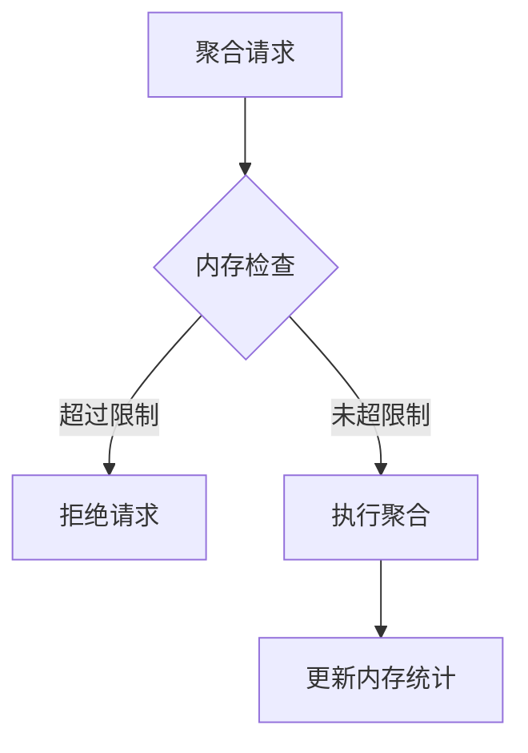
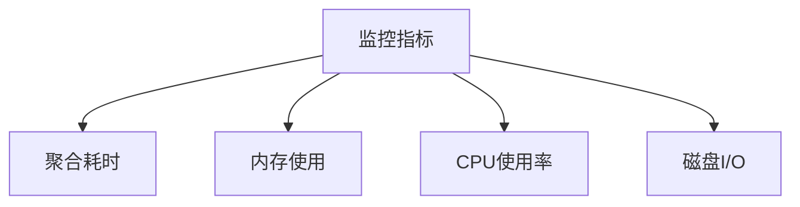

# ES大数据量快速聚合查询的实现原理

## 1. 聚合查询的挑战

在大数据量场景下,ES的聚合查询面临以下挑战：

### 1.1 数据规模问题
- 数据量大,可能达到数十亿级别
- 字段基数高,聚合维度复杂
- 实时性要求高

### 1.2 资源消耗


## 2. 核心实现机制

### 2.1 Doc Values
Doc Values是ES中专门为聚合设计的列式存储结构：



工作原理：
```java
class DocValues {
    // 每个字段的值都单独存储
    Map<String, ColumnStore> columns;
    
    class ColumnStore {
        byte[] values;        // 实际的列数据
        int[] docIds;         // 文档ID映射
        int[] ordinals;       // 字符串值的序号表
        
        // 写入过程
        void write(int docId, byte[] value) {
            // 追加写入值
            int position = values.length;
            values = Arrays.copyOf(values, position + value.length);
            System.arraycopy(value, 0, values, position, value.length);
            
            // 记录文档ID映射
            docIds[docId] = position;
        }
        
        // 读取过程
        byte[] read(int docId) {
            int position = docIds[docId];
            int nextPosition = docId < docIds.length - 1 ? docIds[docId + 1] : values.length;
            return Arrays.copyOfRange(values, position, nextPosition);
        }
    }
}
```

### 2.2 分片内聚合并行计算
每个分片独立执行聚合计算，充分利用多核优势：



实现示例：
```java
class ShardAggregator {
    // 本地聚合计算
    Map<String, AggregationResult> aggregate(Query query, AggregationBuilder aggs) {
        // 1. 加载相关Doc Values
        DocValues docValues = loadDocValues(aggs.getFields());
        
        // 2. 并行处理每个聚合
        return aggs.getAggregations().parallelStream()
            .collect(Collectors.toMap(
                Aggregation::getName,
                agg -> executeAggregation(agg, docValues)
            ));
    }
    
    // 执行具体的聚合计算
    AggregationResult executeAggregation(Aggregation agg, DocValues values) {
        switch(agg.getType()) {
            case TERMS:
                return executeTermsAggregation(agg, values);
            case HISTOGRAM:
                return executeHistogramAggregation(agg, values);
            // ... 其他聚合类型
        }
    }
}
```

### 2.3 分片间结果合并
协调节点负责合并各分片的聚合结果：



实现示例：
```java
class AggregationMerger {
    // 合并多个分片的聚合结果
    AggregationResult merge(List<AggregationResult> shardResults) {
        switch(aggregationType) {
            case TERMS:
                return mergeTermsAggregation(shardResults);
            case HISTOGRAM:
                return mergeHistogramAggregation(shardResults);
            // ... 其他聚合类型
        }
    }
    
    // Terms聚合的合并
    TermsAggregationResult mergeTermsAggregation(List<TermsAggregationResult> results) {
        Map<Object, Long> mergedCounts = new HashMap<>();
        
        // 合并每个分片的词项计数
        for (TermsAggregationResult result : results) {
            result.getBuckets().forEach(bucket -> 
                mergedCounts.merge(bucket.getKey(), bucket.getDocCount(), Long::sum));
        }
        
        // 构建最终结果
        return new TermsAggregationResult(mergedCounts);
    }
}
```

### 2.4 多级缓存机制
ES使用多层缓存来加速聚合查询：



实现示例：
```java
class AggregationCache {
    // 分片请求缓存
    Cache<String, AggregationResult> requestCache;
    // 字段数据缓存
    Cache<String, DocValues> fieldDataCache;
    
    AggregationResult getFromCache(String cacheKey) {
        // 1. 检查分片请求缓存
        AggregationResult result = requestCache.get(cacheKey);
        if (result != null) {
            return result;
        }
        
        // 2. 检查字段数据缓存
        DocValues fieldData = fieldDataCache.get(cacheKey);
        if (fieldData != null) {
            result = computeAggregation(fieldData);
            requestCache.put(cacheKey, result);
            return result;
        }
        
        // 3. 从磁盘加载
        return loadAndCompute(cacheKey);
    }
}
```

### 2.5 断路器保护
防止聚合操作消耗过多内存：



实现示例：
```java
class AggregationCircuitBreaker {
    private final long memoryLimit;
    private AtomicLong currentMemory;
    
    boolean allowAggregation(long estimatedMemory) {
        // 1. 检查是否超过限制
        if (currentMemory.get() + estimatedMemory > memoryLimit) {
            throw new CircuitBreakerException("内存使用超过限制");
        }
        
        // 2. 更新内存使用
        if (!currentMemory.compareAndSet(
            currentMemory.get(),
            currentMemory.get() + estimatedMemory)) {
            // 重试或失败处理
            return false;
        }
        
        return true;
    }
    
    void releaseMemory(long memory) {
        currentMemory.addAndGet(-memory);
    }
}
```

这五个机制相互配合，共同实现了ES的高性能聚合查询：
1. Doc Values提供了高效的列式存储
2. 分片内并行计算提高了计算效率
3. 分片间合并实现了分布式计算
4. 多级缓存减少了重复计算
5. 断路器确保了系统稳定性

通过这些机制的组合，ES能够在大数据量场景下提供快速的聚合查询能力。

## 3. 优化策略

### 3.1 内存优化

#### 1. Circuit Breaker
```yaml
# elasticsearch.yml
indices.breaker.total.limit: 70%
indices.breaker.request.limit: 60%
indices.breaker.fielddata.limit: 40%
```

#### 2. 预聚合
```json
{
  "mappings": {
    "properties": {
      "daily_stats": {
        "type": "aggregate_metric_double",
        "metrics": ["min", "max", "sum", "value_count"],
        "default_metric": "value_count"
      }
    }
  }
}
```

### 3.2 查询优化

#### 1. 过滤提前
```json
{
  "aggs": {
    "filtered_terms": {
      "filter": {
        "range": {
          "timestamp": {
            "gte": "now-1d"
          }
        }
      },
      "aggs": {
        "term_counts": {
          "terms": {
            "field": "status",
            "size": 10
          }
        }
      }
    }
  }
}
```

#### 2. 采样聚合
```json
{
  "aggs": {
    "sampled_terms": {
      "sampler": {
        "shard_size": 1000
      },
      "aggs": {
        "keywords": {
          "terms": {
            "field": "keywords"
          }
        }
      }
    }
  }
}
```

### 3.3 存储优化

#### 1. Segment合并策略
```yaml
# elasticsearch.yml
index.merge.policy.floor_segment: 2mb
index.merge.policy.max_merge_at_once: 10
index.merge.policy.segments_per_tier: 10
```

#### 2. 刷新策略
```yaml
index.refresh_interval: 30s
```

## 4. 性能监控

### 4.1 关键指标


### 4.2 监控命令
```bash
# 查看聚合性能
GET /_nodes/stats/indices/search

# 查看内存使用
GET /_nodes/stats/indices/fielddata

# 查看热点字段
GET /_nodes/stats/indices/fielddata?fields=*
```

## 5. 最佳实践

### 5.1 索引设计
1. 合理使用Doc Values
```json
{
  "mappings": {
    "properties": {
      "keyword_field": {
        "type": "keyword",
        "doc_values": true
      },
      "numeric_field": {
        "type": "long",
        "doc_values": true
      }
    }
  }
}
```

2. 控制字段基数
```json
{
  "mappings": {
    "properties": {
      "high_cardinality_field": {
        "type": "keyword",
        "ignore_above": 256
      }
    }
  }
}
```

### 5.2 查询设计
1. 使用桶聚合
```json
{
  "aggs": {
    "daily_sales": {
      "date_histogram": {
        "field": "timestamp",
        "calendar_interval": "day"
      },
      "aggs": {
        "total_amount": {
          "sum": {
            "field": "amount"
          }
        }
      }
    }
  }
}
```

2. 控制聚合深度
```json
{
  "aggs": {
    "level_1": {
      "terms": {
        "field": "category",
        "size": 10
      },
      "aggs": {
        "level_2": {
          "terms": {
            "field": "subcategory",
            "size": 5
          }
        }
      }
    }
  }
}
```

## 6. 常见问题处理

### 6.1 内存溢出
- 症状：聚合查询导致OOM
- 解决方案：
```yaml
# 增加断路器限制
indices.breaker.request.limit: 40%

# 使用过滤器减少文档数
GET /index/_search
{
  "query": {
    "bool": {
      "filter": [
        {"range": {"timestamp": {"gte": "now-1d"}}}
      ]
    }
  },
  "aggs": {...}
}
```

### 6.2 查询超时
- 症状：聚合查询响应慢
- 解决方案：
```json
{
  "timeout": "30s",
  "aggs": {
    "sampled_terms": {
      "sampler": {
        "shard_size": 1000
      },
      "aggs": {...}
    }
  }
}
```

## 7. 总结

ES通过以下机制实现大数据量的快速聚合：

1. Doc Values列式存储
2. 分片内聚合并行计算
3. 分片间结果合并
4. 多级缓存机制
5. 断路器保护

关键优化点：

1. 合理的内存管理
2. 优化的查询设计
3. 高效的存储策略
4. 完善的监控机制

## 参考资料
1. [Elasticsearch官方文档 - Aggregations](https://www.elastic.co/guide/en/elasticsearch/reference/current/search-aggregations.html)
2. [Elasticsearch性能优化实践](https://www.elastic.co/blog/performance-considerations-elasticsearch-aggregations)
3. [Doc Values介绍](https://www.elastic.co/guide/en/elasticsearch/reference/current/doc-values.html)