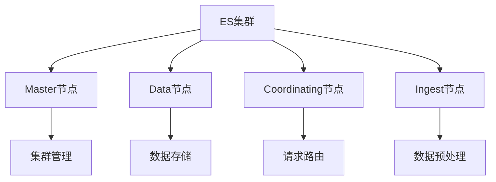
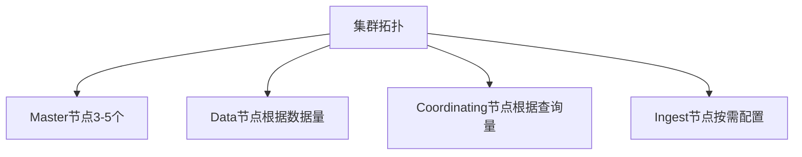
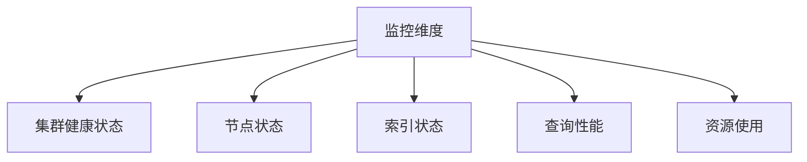

# ES集群架构调优策略

## 1. 集群架构概述

### 1.1 基本架构


### 1.2 节点角色
1. Master节点
   - 管理集群元数据
   - 节点状态监控
   - 分片分配决策

2. Data节点
   - 存储索引数据
   - 执行CRUD操作
   - 执行搜索和聚合

3. Coordinating节点
   - 请求路由
   - 结果合并
   - 客户端通信

4. Ingest节点
   - 数据预处理
   - Pipeline管理
   - 数据转换

## 2. 硬件资源优化

### 2.1 CPU配置
```yaml
# elasticsearch.yml
# 线程池配置
thread_pool:
  search:
    size: 30  # CPU核心数+1
    queue_size: 1000
  write:
    size: 16
    queue_size: 10000
```

### 2.2 内存配置
```yaml
# jvm.options
-Xms31g
-Xmx31g

# elasticsearch.yml
indices.memory.index_buffer_size: 20%
indices.memory.min_index_buffer_size: 96mb
```

### 2.3 磁盘配置
```yaml
# elasticsearch.yml
path.data: /path/to/data
path.logs: /path/to/logs

# 磁盘阈值设置
cluster.routing.allocation.disk.watermark.low: 85%
cluster.routing.allocation.disk.watermark.high: 90%
cluster.routing.allocation.disk.watermark.flood_stage: 95%
```

## 3. 集群拓扑优化

### 3.1 节点规划


### 3.2 分片策略
```json
{
  "index": {
    "number_of_shards": 5,
    "number_of_replicas": 1
  }
}
```

### 3.3 路由策略
```json
{
  "settings": {
    "index.routing.allocation.require.box_type": "hot",
    "index.routing.allocation.include.rack": "rack1,rack2"
  }
}
```

## 4. 网络优化

### 4.1 网络配置
```yaml
# elasticsearch.yml
network.host: 0.0.0.0
transport.tcp.port: 9300
http.port: 9200
network.tcp.no_delay: true
network.tcp.keep_alive: true
network.tcp.reuse_address: true
```

### 4.2 通信优化
```yaml
# elasticsearch.yml
transport.tcp.compress: true
http.compression: true
http.compression_level: 3
```

## 5. 索引优化

### 5.1 索引设置
```json
{
  "settings": {
    "index": {
      "refresh_interval": "30s",
      "number_of_shards": 5,
      "number_of_replicas": 1,
      "translog.durability": "async",
      "translog.sync_interval": "5s"
    }
  }
}
```

### 5.2 Mapping优化
```json
{
  "mappings": {
    "dynamic": "strict",
    "properties": {
      "text_field": {
        "type": "text",
        "norms": false,
        "index_options": "docs"
      },
      "keyword_field": {
        "type": "keyword",
        "doc_values": true
      }
    }
  }
}
```

## 6. 查询优化

### 6.1 查询路由
```json
{
  "routing": "user_1",
  "query": {
    "term": {
      "user_id": "1"
    }
  }
}
```

### 6.2 查询缓存
```yaml
# elasticsearch.yml
indices.queries.cache.size: 10%
index.queries.cache.enabled: true
```

## 7. 监控与维护

### 7.1 监控指标


### 7.2 维护命令
```bash
# 查看集群健康状态
GET /_cluster/health

# 查看节点统计信息
GET /_nodes/stats

# 查看索引状态
GET /_cat/indices?v

# 查看分片分配
GET /_cat/shards?v
```

## 8. 性能调优实践

### 8.1 写入优化
```yaml
# elasticsearch.yml
# 批量写入优化
indices.memory.index_buffer_size: 30%
indices.memory.min_index_buffer_size: 128mb
```

### 8.2 查询优化
```json
{
  "size": 0,
  "query": {
    "bool": {
      "filter": [
        {"term": {"status": "active"}},
        {"range": {"date": {"gte": "now-1d"}}}
      ]
    }
  },
  "aggs": {
    "group_by_status": {
      "terms": {
        "field": "status",
        "size": 10
      }
    }
  }
}
```

## 9. 故障处理

### 9.1 常见问题
1. 集群红色状态
```bash
# 检查未分配分片
GET /_cat/shards?h=index,shard,prirep,state,unassigned.reason&v
```

2. 节点OOM
```yaml
# 调整JVM配置
-XX:+HeapDumpOnOutOfMemoryError
-XX:HeapDumpPath=/path/to/dumps
```

### 9.2 恢复策略
```bash
# 手动分配分片
POST /_cluster/reroute
{
  "commands": [
    {
      "allocate_replica": {
        "index": "test",
        "shard": 0,
        "node": "node_1"
      }
    }
  ]
}
```

## 10. 最佳实践

### 10.1 配置建议
1. 节点配置
   - Master节点3-5个
   - Data节点根据数据量配置
   - 资源预留30%余量

2. 分片策略
   - 单个分片大小控制在30GB以内
   - 分片数不超过节点数的3倍

3. 内存配置
   - JVM堆内存不超过32GB
   - 预留50%给操作系统缓存

### 10.2 运维建议
1. 定期维护
   - 索引定期优化
   - 冷热数据分离
   - 定期备份数据

2. 监控告警
   - 集群状态监控
   - 资源使用监控
   - 性能指标监控

## 参考资料
1. [Elasticsearch官方文档](https://www.elastic.co/guide/en/elasticsearch/reference/current/index.html)
2. [Elasticsearch性能调优指南](https://www.elastic.co/guide/en/elasticsearch/reference/current/tune-for-search-speed.html)
3. [集群管理最佳实践](https://www.elastic.co/guide/en/elasticsearch/reference/current/cluster-management.html)