# Elasticsearch架构设计详解

## 目录
1. [整体架构概述](#1-整体架构概述)
2. [节点角色与职责](#2-节点角色与职责)
3. [分片与索引管理](#3-分片与索引管理)
4. [集群管理与协调](#4-集群管理与协调)
5. [数据流与处理](#5-数据流与处理)
6. [扩展性与高可用](#6-扩展性与高可用)
7. [性能优化与监控](#7-性能优化与监控)
8. [代码实现示例](#8-代码实现示例)
9. [最佳实践建议](#9-最佳实践建议)
10. [结语](#10-结语)

## 1. 整体架构概述

### 1.1 架构层次图
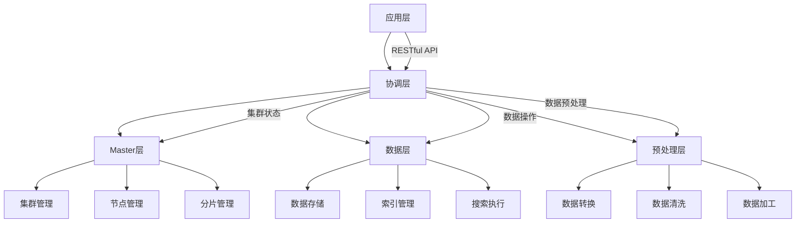

### 1.2 节点交互图
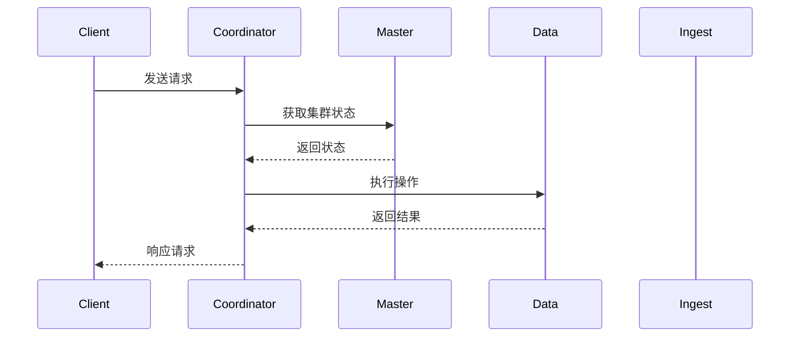

## 2. 节点角色与职责

### 2.1 Master节点工作流程
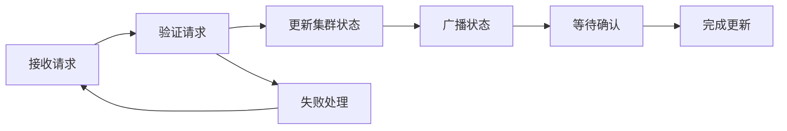

### 2.2 Data节点数据流转
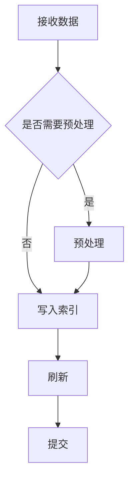

### 2.3 Ingest节点处理流程


## 3. 分片与索引管理

### 3.1 分片分配流程
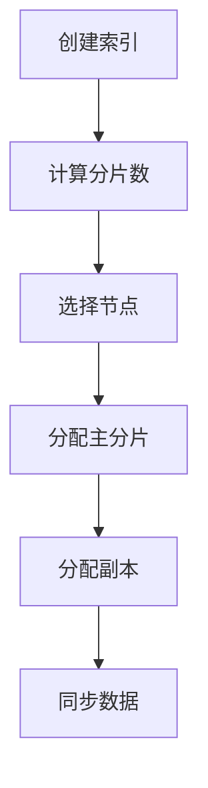

### 3.2 索引生命周期
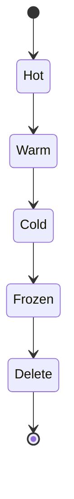

## 4. 集群管理与协调

### 4.1 集群状态更新流程
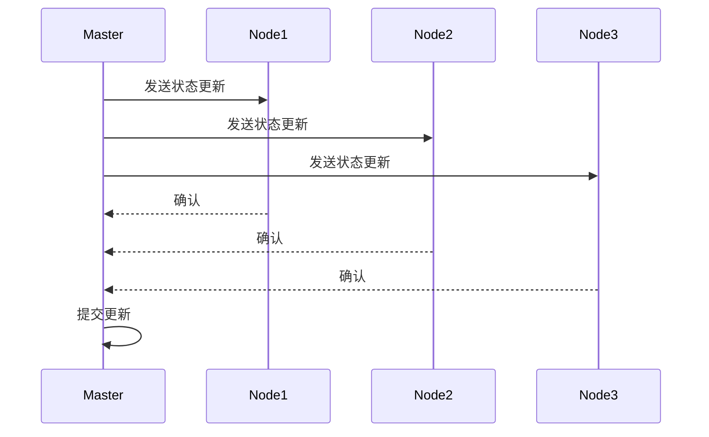

### 4.2 请求处理流程
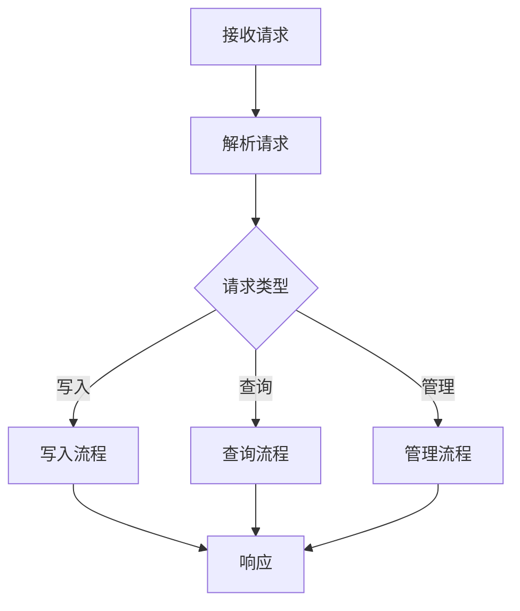

## 5. 数据流与处理

### 5.1 写入流程
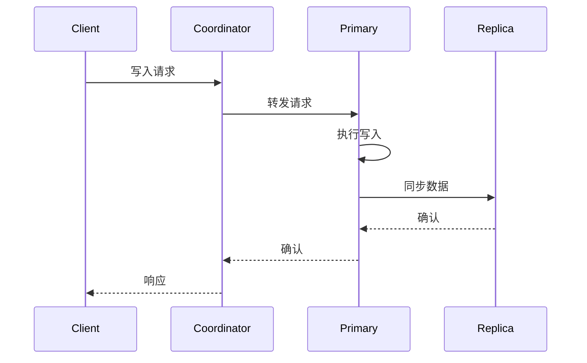

### 5.2 查询流程
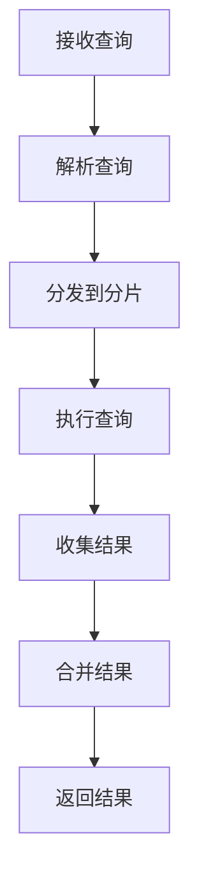

## 6. 扩展性与高可用

### 6.1 扩展机制
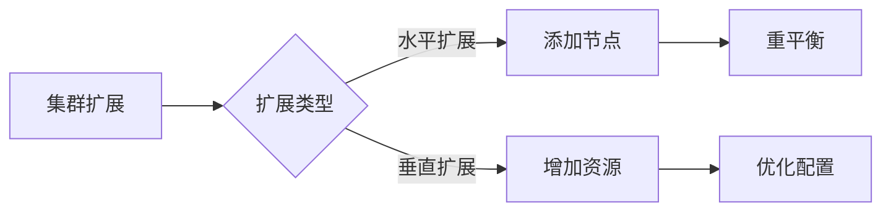

### 6.2 故障恢复流程
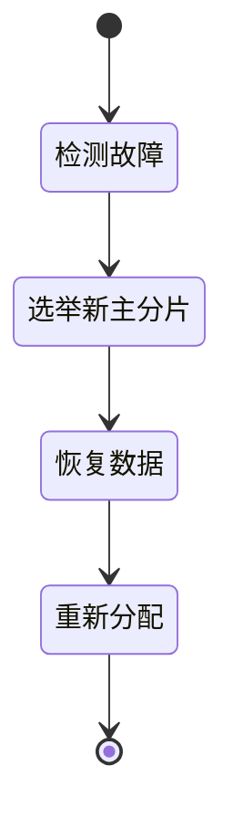

## 7. 性能优化与监控

### 7.1 性能优化层次
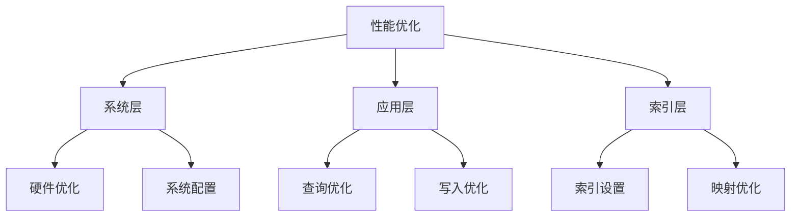

### 7.2 监控体系
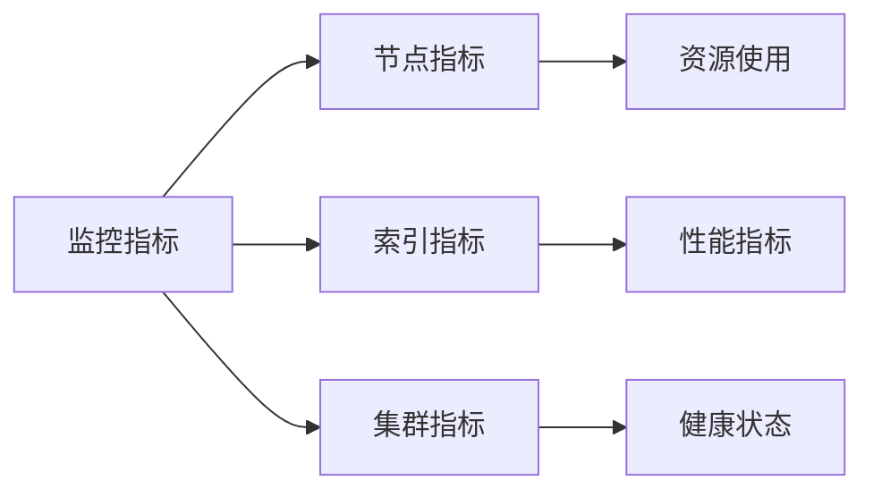

## 8. 代码实现示例


### 1. Master节点核心实现
````java
class MasterNode {
    // 集群状态管理
    void manageCluster() {
        // 1. 集群状态管理
        updateClusterState();
        // 2. 节点管理
        handleNodeChanges();
        // 3. 分片分配
        allocateShards();
    }
    
    // 集群状态更新
    void updateClusterState() {
        // 1. 收集节点信息
        Map<String, NodeInfo> nodesInfo = collectNodeInfo();
        
        // 2. 更新元数据
        ClusterState newState = ClusterState.builder()
            .nodes(nodesInfo)
            .metadata(currentMetadata)
            .build();
            
        // 3. 广播状态
        publishClusterState(newState);
    }
    
    // 节点变更处理
    void handleNodeChanges() {
        // 1. 节点加入处理
        void handleNodeJoin(DiscoveryNode node) {
            // 验证节点
            validateNode(node);
            // 更新集群视图
            updateClusterView();
            // 触发重平衡
            triggerRebalance();
        }
        
        // 2. 节点离开处理
        void handleNodeLeave(DiscoveryNode node) {
            // 移除节点
            removeNode(node);
            // 重新分配分片
            reallocateShards();
            // 更新集群状态
            updateClusterState();
        }
    }
    
    // 分片分配管理
    void allocateShards() {
        // 1. 计算分配策略
        AllocationStrategy strategy = computeAllocationStrategy();
        
        // 2. 执行分片分配
        for (ShardRouting shard : unassignedShards) {
            RoutingNode targetNode = strategy.findTargetNode(shard);
            if (targetNode != null) {
                assignShard(shard, targetNode);
            }
        }
    }
}
````

### 2. Data节点核心实现
````java
class DataNode {
    // 数据处理
    void processData() {
        // 1. 数据存储
        void storeData() {
            // 管理分片
            manageShards();
            // 执行CRUD操作
            executeCRUDOperations();
            // 维护索引
            maintainIndices();
        }
        
        // 2. 查询执行
        void executeQuery() {
            // 解析查询
            Query query = parseQuery(queryRequest);
            // 执行搜索
            SearchResponse response = search(query);
            // 返回结果
            return response;
        }
        
        // 3. 数据同步
        void syncData() {
            // 主副本同步
            syncWithPrimary();
            // 检查点同步
            syncCheckpoints();
            // 状态同步
            syncState();
        }
    }
    
    // 分片管理
    class ShardManager {
        // 1. 分片初始化
        void initializeShard(ShardId shardId) {
            // 创建分片目录
            createShardDirectory();
            // 恢复数据
            recoverShardData();
            // 启动分片
            startShard();
        }
        
        // 2. 分片恢复
        void recoverShard(ShardId shardId) {
            // 获取恢复源
            RecoverySource source = getRecoverySource();
            // 执行恢复
            performRecovery(source);
            // 验证恢复
            validateRecovery();
        }
    }
}
````

### 3. 集群协调核心实现
````java
class ClusterCoordinator {
    // 请求协调
    void coordinate() {
        // 1. 请求路由
        void routeRequest() {
            // 解析请求
            Request request = parseRequest();
            // 选择目标节点
            Node targetNode = selectTargetNode(request);
            // 转发请求
            forwardRequest(request, targetNode);
        }
        
        // 2. 结果聚合
        void aggregateResults() {
            // 收集分片结果
            List<ShardResult> results = collectShardResults();
            // 合并结果
            Result finalResult = mergeResults(results);
            // 返回结果
            return finalResult;
        }
        
        // 3. 错误处理
        void handleErrors() {
            // 重试机制
            RetryPolicy retryPolicy = new RetryPolicy();
            // 失败处理
            handleFailures();
            // 超时处理
            handleTimeouts();
        }
    }
    
    // 负载均衡
    class LoadBalancer {
        // 1. 节点选择
        Node selectNode(Request request) {
            // 计算负载
            Map<Node, Load> loads = calculateLoads();
            // 选择最优节点
            return selectOptimalNode(loads);
        }
        
        // 2. 负载计算
        Load calculateNodeLoad(Node node) {
            // CPU负载
            double cpuLoad = node.getCpuUsage();
            // 内存负载
            double memLoad = node.getMemoryUsage();
            // IO负载
            double ioLoad = node.getIOUsage();
            return new Load(cpuLoad, memLoad, ioLoad);
        }
    }
}
````

### 4. 索引管理实现
````java
class IndexManager {
    // 索引操作
    class IndexOperations {
        // 1. 创建索引
        void createIndex(CreateIndexRequest request) {
            // 验证设置
            validateSettings(request.settings());
            // 创建元数据
            createMetadata();
            // 分配分片
            allocateShards();
        }
        
        // 2. 更新索引
        void updateIndex(UpdateIndexRequest request) {
            // 验证更新
            validateUpdate(request);
            // 应用更新
            applyUpdate();
            // 更新元数据
            updateMetadata();
        }
        
        // 3. 删除索引
        void deleteIndex(DeleteIndexRequest request) {
            // 验证删除
            validateDeletion(request);
            // 清理数据
            cleanupData();
            // 更新元数据
            removeMetadata();
        }
    }
    
    // 映射管理
    class MappingManager {
        // 1. 更新映射
        void updateMapping(UpdateMappingRequest request) {
            // 验证映射
            validateMapping(request.mapping());
            // 合并映射
            mergeMapping();
            // 更新元数据
            updateMetadata();
        }
        
        // 2. 字段映射
        void mapField(Field field) {
            // 确定字段类型
            FieldType type = determineFieldType(field);
            // 创建映射
            createFieldMapping(field, type);
            // 更新映射缓存
            updateMappingCache();
        }
    }
}
````

### 5. 搜索执行实现
````java
class SearchExecutor {
    // 搜索处理
    class SearchProcessor {
        // 1. 查询解析
        Query parseQuery(QueryRequest request) {
            // 解析DSL
            QueryBuilder builder = parseDSL(request);
            // 构建查询
            return builder.build();
        }
        
        // 2. 查询执行
        SearchResponse executeQuery(Query query) {
            // 创建上下文
            SearchContext context = createContext(query);
            // 执行搜索
            Result result = doSearch(context);
            // 处理结果
            return processResult(result);
        }
        
        // 3. 结果处理
        SearchResponse processResults(SearchHits hits) {
            // 排序结果
            sortHits(hits);
            // 聚合处理
            processAggregations();
            // 构建响应
            return buildResponse();
        }
    }
    
    // 聚合处理
    class AggregationProcessor {
        // 1. 执行聚合
        AggregationResults aggregate(Aggregations aggs) {
            // 构建聚合器
            AggregatorFactories factories = createAggregators();
            // 执行聚合
            return executeAggregations(factories);
        }
        
        // 2. 合并结果
        AggregationResults mergeResults(List<AggregationResults> results) {
            // 初始化结果
            AggregationResults merged = initResults();
            // 合并处理
            mergeAggregations(results, merged);
            // 返回结果
            return merged;
        }
    }
}
````

## 9. 最佳实践建议

### 1. 架构设计
- 合理规划节点角色
- 优化分片策略
- 实现高可用机制

### 2. 性能优化
- 调整JVM参数
- 优化索引设置
- 合理使用缓存

### 3. 运维管理
- 建立监控体系
- 制定备份策略
- 规范运维流程

## 10.结语

本文档详细介绍了Elasticsearch的架构设计，通过丰富的流程图展示了各个组件的工作机制和交互过程。理解这些机制对于构建高性能、可靠的ES集群至关重要。如有疑问，欢迎继续讨论。

