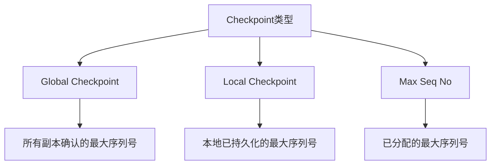
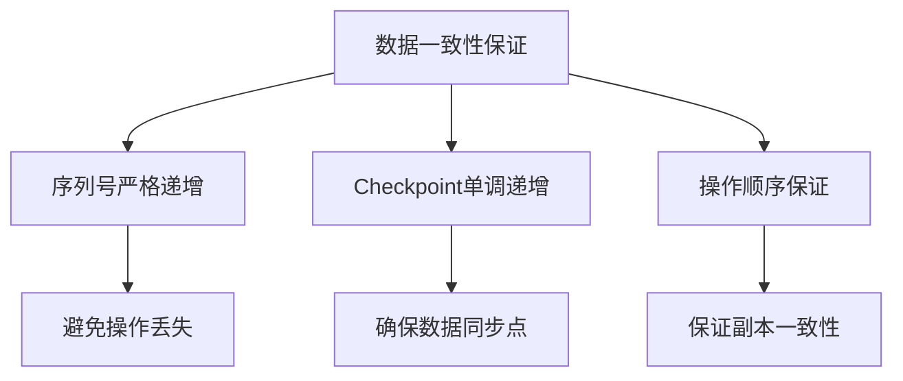

# Elasticsearch Checkpoint与序列号机制详解

## 目录
1. [基础概念](#1-基础概念)
2. [序列号分配机制](#2-序列号分配机制)
3. [Checkpoint更新机制](#3-checkpoint更新机制)
4. [恢复流程应用](#4-恢复流程应用)
5. [数据一致性保证](#5-数据一致性保证)
6. [性能优化与监控](#6-性能优化与监控)
7. [常见问题解答](#7-常见问题解答)

## 1. 基础概念

### 1.1 三种核心Checkpoint


### 1.2 核心定义
```java
class SequenceNumbers {
    // 全局检查点：所有活跃副本都已处理的最大序列号
    private volatile long globalCheckpoint;
    
    // 本地检查点：当前分片已处理的最大序列号
    private volatile long localCheckpoint;
    
    // 最大序列号：已分配的最大操作序列号
    private volatile long maxSeqNo;
}
```

## 2. 序列号分配机制

### 2.1 序列号特性
1. **分片级别独立**
   - 每个主分片独立维护序列号
   - 不同索引的分片互不影响
   - 副本分片复制主分片的序列号

2. **序列号生成**
```java
class SequenceNumbersService {
    private final AtomicLong maxSeqNo;
    
    // 分配新的序列号
    long generateSeqNo() {
        return maxSeqNo.incrementAndGet();
    }
    
    // 分片初始化
    void initializeSeqNo() {
        maxSeqNo.set(-1);
        localCheckpoint.set(-1);
    }
}
```

### 2.2 序列号分配流程
```java
class IndexShard {
    Engine.IndexResult index(Engine.Index index) {
        // 1. 分配新序列号
        long seqNo = generateSeqNo();
        
        // 2. 更新maxSeqNo
        maxSeqNo.updateAndGet(curr -> Math.max(curr, seqNo));
        
        // 3. 设置操作序列号
        index.setSeqNo(seqNo);
        
        // 4. 执行实际写入
        return engineIndex(index);
    }
}
```

## 3. Checkpoint更新机制

### 3.1 更新流程


### 3.2 本地Checkpoint更新
```java
class LocalCheckpointTracker {
    void markSeqNoAsProcessed(long seqNo) {
        // 1. 检查序列号有效性
        if (seqNo <= localCheckpoint) {
            return;
        }
        
        // 2. 更新已处理序列号集合
        processedSeqNos.add(seqNo);
        
        // 3. 尝试推进本地checkpoint
        advanceLocalCheckpoint();
    }
    
    void advanceLocalCheckpoint() {
        // 查找连续的最大序列号
        long newCheckpoint = localCheckpoint;
        while (processedSeqNos.contains(newCheckpoint + 1)) {
            newCheckpoint++;
        }
        
        // 更新本地checkpoint
        if (newCheckpoint > localCheckpoint) {
            localCheckpoint = newCheckpoint;
            notifyCheckpointListeners();
        }
    }
}
```

### 3.3 全局Checkpoint更新
```java
class GlobalCheckpointTracker {
    void updateGlobalCheckpoint() {
        // 1. 收集所有副本的本地checkpoint
        Map<String, Long> replicaCheckpoints = getReplicaCheckpoints();
        
        // 2. 计算新的全局checkpoint
        long newGlobalCheckpoint = calculateGlobalCheckpoint(replicaCheckpoints);
        
        // 3. 更新全局checkpoint
        if (newGlobalCheckpoint > globalCheckpoint) {
            globalCheckpoint = newGlobalCheckpoint;
            notifyGlobalCheckpointListeners();
        }
    }
}
```

## 4. 恢复流程应用

### 4.1 主分片恢复
```java
class PrimaryRecovery {
    void recover() {
        // 1. 获取最后一次提交的checkpoint
        long lastCommittedCheckpoint = getLastCommittedCheckpoint();
        
        // 2. 确定需要重放的操作范围
        long startSeqNo = lastCommittedCheckpoint + 1;
        long endSeqNo = maxSeqNo;
        
        // 3. 重放translog中的操作
        replayTranslogOperations(startSeqNo, endSeqNo);
        
        // 4. 更新checkpoint
        updateCheckpoints();
    }
}
```

### 4.2 副本分片恢复
```java
class ReplicaRecovery {
    void syncFromPrimary() {
        // 1. 获取当前checkpoint信息
        CheckpointInfo localInfo = getLocalCheckpoint();
        CheckpointInfo primaryInfo = getPrimaryCheckpoint();
        
        // 2. 确定需要同步的范围
        long gapStart = localInfo.globalCheckpoint + 1;
        long gapEnd = primaryInfo.maxSeqNo;
        
        // 3. 同步缺失的操作
        syncOperations(gapStart, gapEnd);
    }
}
```

## 5. 数据一致性保证

### 5.1 一致性机制


### 5.2 安全清理机制
```java
class SafeCommit {
    void safelyTrimTranslog() {
        // 1. 获取全局checkpoint
        long safePoint = globalCheckpoint;
        
        // 2. 确保所有副本都已同步
        ensureReplicasSynced(safePoint);
        
        // 3. 清理已确认的translog
        trimTranslog(safePoint);
    }
}
```

## 6. 性能优化与监控

### 6.1 配置优化
```yaml
# elasticsearch.yml
# translog相关配置
index.translog.durability: async
index.translog.sync_interval: 5s
index.translog.flush_threshold_size: 512mb

# 恢复相关配置
indices.recovery.max_bytes_per_sec: 40mb
indices.recovery.concurrent_streams: 3
```

### 6.2 监控指标
1. **关键指标**
   - Checkpoint更新延迟
   - 序列号分配速率
   - 副本同步状态
   - Translog大小

2. **监控命令**
```bash
# 查看checkpoint状态
GET _cat/shards?v
GET _cat/recovery?v

# 查看序列号状态
GET _cat/shards?h=index,shard,prirep,seq_no,global_checkpoint
```

## 7. 常见问题解答

### 7.1 序列号分配问题
Q: 为什么要按分片独立分配序列号？
> A: 分片级别序列号的优势：
> 1. 并发性能
>    - 避免全局竞争
>    - 提高写入吞吐量
>    - 减少锁竞争
>
> 2. 可扩展性
>    - 支持分片水平扩展
>    - 独立维护序列号
>    - 简化恢复流程
>
> 3. 故障隔离
>    - 分片故障互不影响
>    - 简化故障恢复
>    - 提高系统稳定性

### 7.2 Checkpoint更新延迟
Q: 什么因素会影响Checkpoint更新？
> A: 主要影响因素：
> 1. 写入延迟
>    - 写入缓冲区满
>    - IO性能瓶颈
>    - 系统负载高
>
> 2. 副本同步
>    - 网络延迟
>    - 副本处理慢
>    - 副本不可用
>
> 3. 系统配置
>    - 刷新间隔
>    - 并发设置
>    - 资源限制

### 7.3 数据一致性检查
Q: 如何利用Checkpoint进行数据一致性检查？
> A: 检查方法：
> 1. 比对Checkpoint
>    ```java
>    boolean isConsistent() {
>        return localCheckpoint <= globalCheckpoint &&
>               globalCheckpoint <= maxSeqNo;
>    }
>    ```
>
> 2. 验证操作序列
>    - 检查操作连续性
>    - 验证版本号
>    - 确认无缺失操作
>
> 3. 修复策略
>    - 请求缺失操作
>    - 强制重新同步
>    - 重建副本

## 结语

本文档详细介绍了ES的Checkpoint机制和序列号分配机制，包括基本概念、实现原理、应用场景以及性能优化建议。理解这些机制对于维护ES集群的数据一致性和优化性能都很重要。
