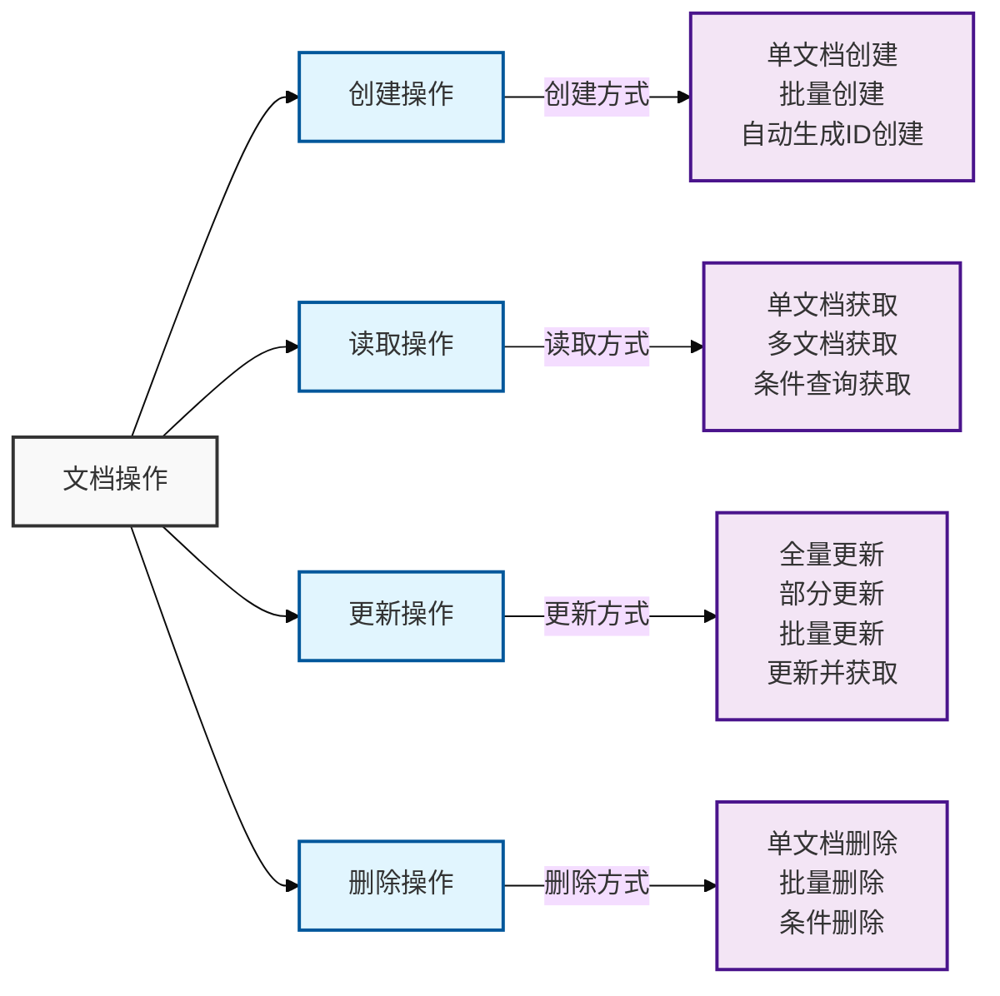

# Elasticsearch常用命令完整指南

## 目录
1. [集群管理命令](#1-集群管理命令)
2. [索引管理命令](#2-索引管理命令)
3. [文档操作命令](#3-文档操作命令)
4. [搜索查询命令](#4-搜索查询命令)
5. [监控统计命令](#5-监控统计命令)
6. [设置配置命令](#6-设置配置命令)
7. [分析调试命令](#7-分析调试命令)
8. [高级功能命令](#8-高级功能命令)

## 1. 集群管理命令

### 1.1 集群命令分类
`````mermaid


mindmap
  root((集群命令))
    健康检查
      集群健康
      节点状态
      分片状态
    节点管理
      节点列表
      节点统计
      热线程
    任务管理
      任务列表
      取消任务
      任务状态
`````

### 1.2 常用集群命令
```bash
# 1. 集群健康状态
GET _cluster/health
{
    "timeout": "30s",
    "wait_for_status": "green"
}

# 2. 节点信息
GET _cat/nodes?v
GET _nodes/stats
GET _nodes/hot_threads

# 3. 分片状态
GET _cat/shards?v
GET _cluster/allocation/explain

# 4. 任务管理
GET _tasks
POST _tasks/{task_id}/_cancel

# 5. 集群设置
GET _cluster/settings
PUT _cluster/settings
{
    "persistent": {
        "cluster.routing.allocation.enable": "all"
    }
}
```

## 2. 索引管理命令

### 2.1 索引操作分类
`````mermaid


graph TD
    A[索引管理] --> B[创建索引]
    A --> C[修改索引]
    A --> D[删除索引]
    A --> E[别名管理]
    
    B --> F[映射设置]
    B --> G[分片设置]
    
    C --> H[更新设置]
    C --> I[更新映射]
    
    E --> J[添加别名]
    E --> K[删除别名]
`````

### 2.2 索引管理命令
```bash
# 1. 创建索引
PUT my_index
{
    "settings": {
        "number_of_shards": 3,
        "number_of_replicas": 1
    },
    "mappings": {
        "properties": {
            "field1": { "type": "text" },
            "field2": { "type": "keyword" },
            "field3": { "type": "date" }
        }
    }
}

# 2. 查看索引
GET _cat/indices?v
GET my_index

# 3. 更新索引设置
PUT my_index/_settings
{
    "index": {
        "number_of_replicas": 2
    }
}

# 4. 更新映射
PUT my_index/_mapping
{
    "properties": {
        "new_field": {
            "type": "keyword"
        }
    }
}

# 5. 别名管理
POST _aliases
{
    "actions": [
        {
            "add": {
                "index": "my_index",
                "alias": "my_alias"
            }
        }
    ]
}
```

## 3. 文档操作命令

### 3.1 文档操作分类




### 3.2 文档操作命令
```bash
# 1. 创建文档
PUT my_index/_doc/1
{
    "field1": "value1",
    "field2": "value2"
}

# 2. 批量操作
POST _bulk
{"index": {"_index": "my_index", "_id": "1"}}
{"field1": "value1"}
{"index": {"_index": "my_index", "_id": "2"}}
{"field1": "value2"}

# 3. 获取文档
GET my_index/_doc/1
GET my_index/_mget
{
    "ids": ["1", "2"]
}

# 4. 更新文档
POST my_index/_update/1
{
    "doc": {
        "field1": "new_value"
    }
}

# 5. 删除文档
DELETE my_index/_doc/1
```

## 4. 搜索查询命令

### 4.1 查询类型分类
`````mermaid


mindmap
  root((查询类型))
    全文搜索
      match查询
      match_phrase查询
      query_string查询
    结构化搜索
      term查询
      range查询
      exists查询
    复合查询
      bool查询
      dis_max查询
      function_score查询
    特殊查询
      geo查询
      nested查询
      script查询
`````

### 4.2 搜索查询命令
```bash
# 1. 基本查询
GET my_index/_search
{
    "query": {
        "match": {
            "field1": "value"
        }
    }
}

# 2. 复合查询
GET my_index/_search
{
    "query": {
        "bool": {
            "must": [
                { "match": { "field1": "value1" }},
                { "term": { "field2": "value2" }}
            ],
            "filter": [
                { "range": {
                    "age": {
                        "gte": 20,
                        "lte": 30
                    }
                }}
            ]
        }
    }
}

# 3. 聚合查询
GET my_index/_search
{
    "size": 0,
    "aggs": {
        "group_by_field": {
            "terms": {
                "field": "field1",
                "size": 10
            },
            "aggs": {
                "avg_value": {
                    "avg": {
                        "field": "value"
                    }
                }
            }
        }
    }
}

# 4. 高亮查询
GET my_index/_search
{
    "query": {
        "match": {
            "content": "search text"
        }
    },
    "highlight": {
        "fields": {
            "content": {}
        }
    }
}
```

## 5. 监控统计命令

### 5.1 监控指标分类
`````mermaid


graph LR
    A[监控指标] --> B[节点指标]
    A --> C[索引指标]
    A --> D[集群指标]
    
    B --> E[CPU使用]
    B --> F[内存使用]
    B --> G[磁盘使用]
    
    C --> H[文档数]
    C --> I[存储大小]
    C --> J[查询统计]
    
    D --> K[健康状态]
    D --> L[分片分配]
    D --> M[任务队列]
`````

### 5.2 监控统计命令
```bash
# 1. 节点统计
GET _cat/nodes?v&h=ip,heap.percent,ram.percent,cpu,load_1m
GET _nodes/stats

# 2. 索引统计
GET _cat/indices?v&h=index,docs.count,store.size
GET my_index/_stats

# 3. 分片统计
GET _cat/shards?v
GET _cat/segments?v

# 4. 任务统计
GET _cat/pending_tasks?v
GET _cat/thread_pool?v

# 5. 热点线程
GET _nodes/hot_threads
```

## 6. 设置配置命令

### 6.1 配置类型分类
`````mermaid


mindmap
  root((配置类型))
    集群设置
      分片分配
      发现设置
      网络设置
    索引设置
      分片设置
      刷新设置
      存储设置
    节点设置
      内存设置
      线程设置
      路径设置
`````

### 6.2 设置配置命令
```bash
# 1. 集群设置
PUT _cluster/settings
{
    "persistent": {
        "cluster.routing.allocation.enable": "all",
        "cluster.routing.allocation.cluster_concurrent_rebalance": "2"
    }
}

# 2. 索引设置
PUT my_index/_settings
{
    "index": {
        "refresh_interval": "30s",
        "number_of_replicas": 1
    }
}

# 3. 模板设置
PUT _template/my_template
{
    "index_patterns": ["my_*"],
    "settings": {
        "number_of_shards": 3
    },
    "mappings": {
        "properties": {
            "field1": { "type": "keyword" }
        }
    }
}

# 4. 分析器设置
PUT my_index
{
    "settings": {
        "analysis": {
            "analyzer": {
                "my_analyzer": {
                    "type": "custom",
                    "tokenizer": "standard",
                    "filter": ["lowercase", "my_stop"]
                }
            },
            "filter": {
                "my_stop": {
                    "type": "stop",
                    "stopwords": ["a", "the"]
                }
            }
        }
    }
}
```

## 7. 分析调试命令

### 7.1 调试工具分类
`````mermaid


graph TD
    A[调试工具] --> B[分析器测试]
    A --> C[查询分析]
    A --> D[性能分析]
    
    B --> E[分词测试]
    B --> F[过滤器测试]
    
    C --> G[查询解释]
    C --> H[查询验证]
    
    D --> I[Profile API]
    D --> J[慢查询日志]
`````

### 7.2 分析调试命令
```bash
# 1. 分析器测试
GET my_index/_analyze
{
    "analyzer": "standard",
    "text": "This is a test"
}

# 2. 查询解释
GET my_index/_explain/1
{
    "query": {
        "match": {
            "field1": "value"
        }
    }
}

# 3. 查询验证
GET my_index/_validate/query
{
    "query": {
        "match": {
            "field1": "value"
        }
    }
}

# 4. 性能分析
GET my_index/_search
{
    "profile": true,
    "query": {
        "match": {
            "field1": "value"
        }
    }
}

# 5. 映射检查
GET my_index/_mapping
```

## 8. 高级功能命令

### 8.1 高级功能分类
`````mermaid


mindmap
  root((高级功能))
    数据流
      创建流
      管理流
      回滚流
    生命周期
      策略管理
      阶段转换
      行为定义
    快照备份
      仓库管理
      快照创建
      快照恢复
    安全管理
      角色定义
      用户管理
      权限分配
`````

### 8.2 高级功能命令
```bash
# 1. 数据流管理
PUT _data_stream/my_stream
GET _data_stream/my_stream
POST my_stream/_rollover
{
    "conditions": {
        "max_age": "7d",
        "max_docs": 1000000
    }
}

# 2. 生命周期管理
PUT _ilm/policy/my_policy
{
    "policy": {
        "phases": {
            "hot": {
                "actions": {
                    "rollover": {
                        "max_size": "50GB",
                        "max_age": "30d"
                    }
                }
            },
            "warm": {
                "min_age": "30d",
                "actions": {
                    "shrink": {
                        "number_of_shards": 1
                    }
                }
            }
        }
    }
}

# 3. 快照管理
PUT _snapshot/my_backup
{
    "type": "fs",
    "settings": {
        "location": "/mount/backups/my_backup"
    }
}

PUT _snapshot/my_backup/snapshot_1?wait_for_completion=true
{
    "indices": "my_index",
    "ignore_unavailable": true
}

# 4. 安全管理
POST _security/role/my_role
{
    "cluster": ["monitor"],
    "indices": [
        {
            "names": ["my_index"],
            "privileges": ["read"],
            "field_security": {
                "grant": ["field1", "field2"]
            }
        }
    ]
}
```

## 结语

本文档详细介绍了ES的常用命令和操作，通过分类和实例全面展示了相关命令的使用方法。掌握这些命令对于日常运维和开发工作至关重要。