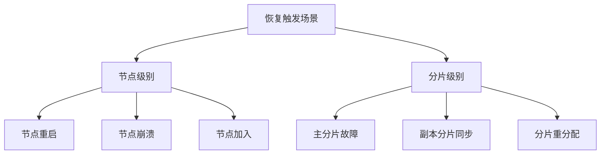
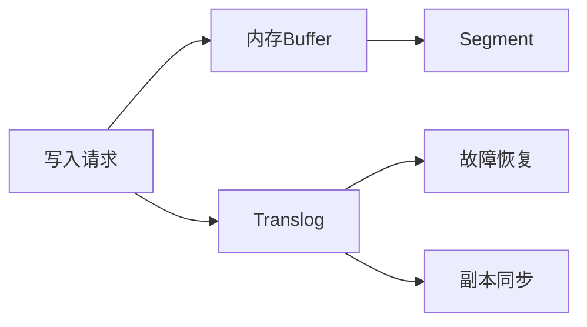

# Elasticsearch数据恢复机制详解

## 目录
1. [数据恢复概述](#1-数据恢复概述)
2. [主分片恢复流程](#2-主分片恢复流程)
3. [副本分片恢复流程](#3-副本分片恢复流程)
4. [Translog一致性机制](#4-translog一致性机制)
5. [数据写入与查询控制](#5-数据写入与查询控制)
6. [性能优化与最佳实践](#6-性能优化与最佳实践)
7. [常见问题解答](#7-常见问题解答)

## 1. 数据恢复概述

### 1.1 恢复类型
1. **全量恢复**
   - 节点重启恢复
   - 集群完整重启
   - 分片完整重分配

2. **增量恢复**
   - 主分片故障转移
   - 副本分片同步
   - 分片重新分配

### 1.2 触发场景


## 2. 主分片恢复流程

### 2.1 恢复步骤
1. **启动前检查**
```java
class PrimaryShardRecovery {
    void preRecoveryCheck() {
        // 1. 验证分片ID
        // 2. 检查分片文件完整性
        // 3. 验证全局checkpoint
    }
}
```

2. **本地恢复流程**
```java
class LocalRecoveryStep {
    void recover() {
        // 1. 加载分片元数据
        loadShardMetadata();
        // 2. 恢复segment文件
        recoverSegments();
        // 3. 重放translog
        replayTranslog();
        // 4. 更新全局checkpoint
        updateGlobalCheckpoint();
    }
}
```

### 2.2 故障处理
1. **故障检测**
   - 节点心跳检查
   - 分片健康检查
   - 集群状态更新

2. **故障转移**
   - 选举新主分片
   - 更新集群状态
   - 启动恢复流程

## 3. 副本分片恢复流程

### 3.1 恢复阶段


### 3.2 详细步骤

1. **Phase 1: 初始化**
```java
class ReplicaRecoveryInit {
    void initialize() {
        // 1. 创建临时恢复目录
        createTempDir();
        // 2. 获取主分片元数据
        fetchPrimaryMetadata();
        // 3. 清理旧文件
        cleanupOldFiles();
    }
}
```

2. **Phase 2: 文件传输**
```java
class FileTransferPhase {
    void transferFiles() {
        // 1. 获取文件差异
        getFileDiffs();
        // 2. 传输segment文件
        transferSegments();
        // 3. 校验文件完整性
        verifyFiles();
    }
}
```

3. **Phase 3: Translog同步**
```java
class TranslogSync {
    void syncTranslog() {
        // 1. 获取起始位置
        long startSeqNo = getStartSeqNo();
        // 2. 传输translog
        transferTranslog(startSeqNo);
        // 3. 重放操作
        replayOperations();
    }
}
```

## 4. Translog一致性机制

### 4.1 Translog基础
1. **作用**
   - 数据持久化保证
   - 故障恢复支持
   - 副本同步保证

2. **生命周期**


### 4.2 序列号机制
```java
class SequenceNumbers {
    // 全局checkpoint：所有副本都确认的最大序列号
    long globalCheckpoint;
    
    // 本地checkpoint：本地已持久化的最大序列号
    long localCheckpoint;
    
    // 最大序列号：已分配的最大序列号
    long maxSeqNo;
}
```

### 4.3 Flush影响
```java
class TranslogHandler {
    void onFlush() {
        // 1. 获取当前checkpoint
        long checkpoint = getCheckpoint();
        
        // 2. 创建新segment
        createNewSegment();
        
        // 3. 更新commit point
        updateCommitPoint();
        
        // 4. 清理已提交translog
        trimTranslog(checkpoint);
        
        // 5. 保留未同步操作
        retainUnsynced(checkpoint);
    }
}
```

## 5. 数据写入与查询控制

### 5.1 写入控制
```java
class IndexShard {
    boolean allowWrite() {
        return isStarted() &&  // 分片已启动
               isWriteActive() &&  // 写入功能激活
               recoveryState.stage() == RecoveryState.Stage.DONE;  // 恢复完成
    }
}
```

### 5.2 查询控制
```yaml
# 相关配置
index.recovery.initial_shards: quorum  # 控制允许查询的最小分片数
```

## 6. 性能优化与最佳实践

### 6.1 配置优化
```yaml
# elasticsearch.yml
indices.recovery.max_bytes_per_sec: 40mb
indices.recovery.concurrent_streams: 3
indices.recovery.concurrent_small_file_streams: 2

index.translog.durability: async
index.translog.sync_interval: 5s
index.translog.flush_threshold_size: 512mb
```

### 6.2 监控建议
1. **关键指标**
   - 恢复速度
   - translog大小
   - checkpoint更新状态

2. **监控命令**
```bash
# 查看恢复状态
GET _cat/recovery?v
GET _cluster/health
```

## 7. 常见问题解答

### 7.1 写入时机
Q: 什么时候可以开始接受写入请求？
> A: 写入请求的接受条件：
> 1. 主分片条件
>    - 分片状态为STARTED
>    - 恢复状态为DONE
>    - 写入功能已激活
>
> 2. 副本分片条件
>    - 至少一个副本就绪
>    - 主副本间可以正常同步
>
> 3. 集群条件
>    - 集群状态为GREEN或YELLOW
>    - Master节点正常工作

### 7.2 Translog处理
Q: 主分片Flush如何影响Translog同步？
> A: Translog处理机制：
> 1. Flush过程
>    - 生成新的Segment文件
>    - 更新Commit Point
>    - 清理已提交的Translog
>
> 2. 同步保证
>    - 保留未同步的操作
>    - 维护全局checkpoint
>    - 确保数据一致性
>
> 3. 副本同步
>    - 基于序列号同步
>    - 保证操作顺序
>    - 处理冲突情况

### 7.3 数据一致性
Q: 如何保证恢复过程中的数据一致性？
> A: 一致性保证机制：
> 1. 序列号控制
>    - 全局checkpoint
>    - 本地checkpoint
>    - 序列号追踪
>
> 2. 文件同步
>    - 文件校验和
>    - 增量传输
>    - 原子性更新
>
> 3. 操作重放
>    - 顺序重放
>    - 冲突检测
>    - 版本控制

## 结语

本文档详细介绍了ES的数据恢复机制，包括主分片恢复、副本分片恢复、Translog一致性保证等核心内容。理解这些机制对于运维ES集群和优化性能都很重要。

