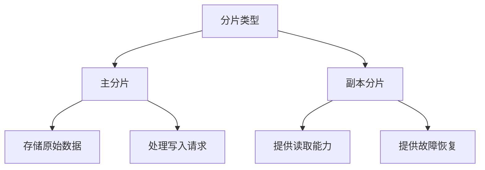
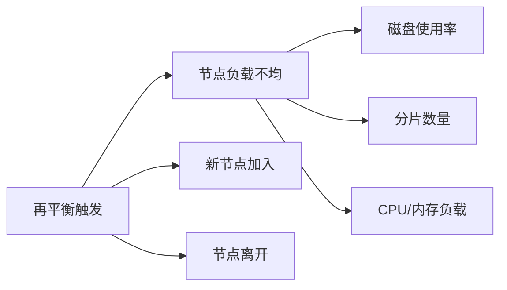
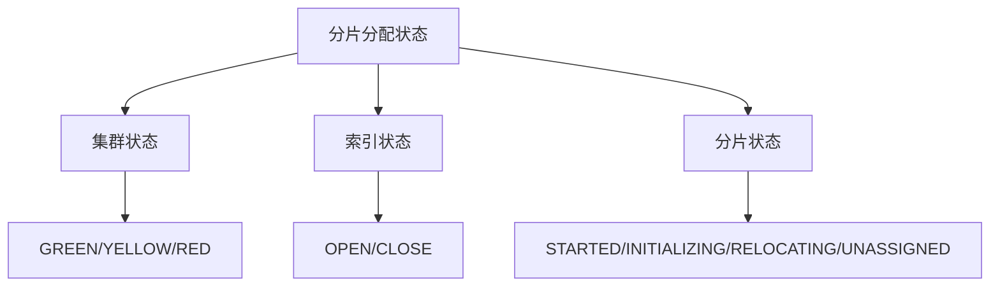

# Elasticsearch分片分配机制完整指南

## 目录
1. [基础概念](#1-基础概念)
2. [分配器与决策器](#2-分配器与决策器)
3. [分片分配过程](#3-分片分配过程)
4. [主副分片分配策略](#4-主副分片分配策略)
5. [分配规则详解](#5-分配规则详解)
6. [分片再平衡](#6-分片再平衡)
7. [分片恢复控制](#7-分片恢复控制)
8. [新索引vs已存在索引分配](#8-新索引vs已存在索引分配)
9. [监控与维护](#9-监控与维护)
10. [最佳实践与常见问题](#10-最佳实践与常见问题)

## 1. 基础概念

### 1.1 分片类型


### 1.2 分配策略基础组件
```java
class AllocationService {
    // 分配决策器
    private final AllocationDeciders allocationDeciders;
    
    // 分配器
    private final ShardsAllocator shardsAllocator;
    
    // 重平衡策略
    private final RebalanceStrategy rebalanceStrategy;
}
```

## 2. 分配器与决策器

### 2.1 分配器(ShardsAllocator)
```java
class ShardsAllocator {
    // 主要职责
    void allocateShard(ShardRouting shard, RoutingAllocation allocation) {
        // 1. 计算分配权重
        Map<String, Float> weights = calculateNodeWeights(shard);
        
        // 2. 选择最优节点
        RoutingNode bestNode = selectBestNode(weights);
        
        // 3. 执行分配
        allocation.assign(shard, bestNode);
    }
    
    // 权重计算因素
    float calculateWeight(RoutingNode node) {
        return diskUsage          // 磁盘使用率
             + shardCount         // 分片数量
             + existingData      // 已有数据
             + networkLatency;   // 网络延迟
    }
}
```

### 2.2 决策器(AllocationDeciders)
```java
class AllocationDeciders {
    // 决策链
    private final List<AllocationDecider> deciders;
    
    Decision canAllocate(ShardRouting shard, RoutingNode node) {
        // 1. 磁盘决策器
        if (!diskThresholdDecider.canAllocate()) {
            return Decision.NO;
        }
        
        // 2. 过滤决策器
        if (!filterAllocationDecider.canAllocate()) {
            return Decision.NO;
        }
        
        // 3. 感知决策器
        if (!awarenessAllocationDecider.canAllocate()) {
            return Decision.NO;
        }
        
        // 4. 并发恢复决策器
        return concurrentRecoveryDecider.canAllocate();
    }
}
```

## 3. 分片分配过程

### 3.1 分配触发场景
1. **集群状态变更**
   - 节点加入/离开
   - 索引创建/删除
   - 分片迁移请求

2. **手动触发**
   - Reroute API
   - 更新分配设置
   - 强制分配命令

### 3.2 分配决策流程
```java
class AllocationDecider {
    Decision canAllocate(ShardRouting shardRouting, RoutingNode node, RoutingAllocation allocation) {
        // 1. 节点过滤
        if (!nodeMatchesFilters(node)) {
            return Decision.NO;
        }
        
        // 2. 磁盘空间检查
        if (!hasEnoughDiskSpace(node)) {
            return Decision.NO;
        }
        
        // 3. 分片分配规则检查
        if (!matchesAllocationRules(shardRouting, node)) {
            return Decision.NO;
        }
        
        // 4. 其他约束检查
        return checkOtherConstraints(shardRouting, node);
    }
}
```

## 4. 主副分片分配策略

### 4.1 主分片分配策略
```java
class PrimaryShardAllocator {
    RoutingNode allocatePrimaryShard(ShardRouting shard) {
        // 1. 选择最新数据节点
        List<NodeData> nodes = findNodesWithLatestData(shard);
        
        // 2. 按数据完整性排序
        nodes.sort((n1, n2) -> 
            compareDataCompleteness(n1, n2));
        
        // 3. 考虑其他因素
        return selectBestNode(nodes, new Criteria()
            .diskSpace()         // 磁盘空间
            .shardBalance()      // 分片平衡
            .nodeLoad());        // 节点负载
    }
}
```

### 4.2 副本分片分配策略
```java
class ReplicaShardAllocator {
    RoutingNode allocateReplicaShard(ShardRouting shard) {
        // 1. 优先选择有数据的节点
        List<NodeData> nodesWithData = findNodesWithExistingData(shard);
        if (!nodesWithData.isEmpty()) {
            return selectBestNode(nodesWithData);
        }
        
        // 2. 考虑网络拓扑
        return selectNodeByTopology(new Criteria()
            .rackAwareness()     // 机架感知
            .zoneBalance()       // 区域平衡
            .networkProximity());// 网络近接性
    }
}
```

## 5. 分配规则详解

### 5.1 节点级别规则

1. **节点属性过滤**
```yaml
# elasticsearch.yml
cluster.routing.allocation.awareness.attributes: zone,rack
node.attr.zone: zone1
node.attr.rack: rack1
```

2. **节点角色过滤**
```yaml
# 节点角色配置
node.roles: [ data, master ]
```

### 5.2 索引级别规则

1. **索引分配设置**
```json
{
  "index.routing.allocation.include.zone": "zone1,zone2",
  "index.routing.allocation.exclude.rack": "rack1",
  "index.routing.allocation.require.box_type": "hot"
}
```

2. **分片分配规则**
```java
class IndexMetadata {
    // 分片数量
    int numberOfShards;
    
    // 副本数量
    int numberOfReplicas;
    
    // 分配规则
    Map<String, String> routingRules;
}
```

## 6. 分片再平衡

### 6.1 再平衡触发条件


### 6.2 再平衡算法
```java
class RebalanceStrategy {
    void rebalance(RoutingAllocation allocation) {
        // 1. 计算当前不平衡度
        float currentImbalance = calculateImbalance(allocation);
        
        // 2. 生成迁移方案
        List<MoveAllocation> moves = computeRebalancingMoves(allocation);
        
        // 3. 执行分片迁移
        executeRebalancing(moves);
    }
}
```

## 7. 分片恢复控制

### 7.1 并发恢复限制
```yaml
# elasticsearch.yml
# 节点级别并发恢复数
cluster.routing.allocation.node_concurrent_recoveries: 2

# 入站恢复数
cluster.routing.allocation.node_concurrent_incoming_recoveries: 2

# 出站恢复数
cluster.routing.allocation.node_concurrent_outgoing_recoveries: 2
```

### 7.2 恢复限流
```yaml
# 恢复速率限制
indices.recovery.max_bytes_per_sec: 40mb

# 并发流数量
indices.recovery.concurrent_streams: 3

# 小文件并发流
indices.recovery.concurrent_small_file_streams: 2
```

## 8. 新索引vs已存在索引分配

### 8.1 新索引分配
```java
class NewIndexAllocator {
    void allocateNewIndex(Index index) {
        // 1. 初始分配策略
        InitialAllocationStrategy strategy = new InitialAllocationStrategy()
            .evenDistribution()   // 均匀分布
            .diskUsageBalance()   // 磁盘均衡
            .nodeLoadBalance();   // 节点负载均衡
            
        // 2. 主分片分配
        allocatePrimaryShards(index, strategy);
        
        // 3. 副本分片分配
        allocateReplicaShards(index, strategy);
    }
}
```

### 8.2 已存在索引重分配
```java
class ExistingIndexReallocator {
    void reallocateExistingIndex(Index index) {
        // 1. 数据恢复考虑
        RecoveryStrategy recovery = new RecoveryStrategy()
            .minimizeDataTransfer()  // 最小化数据传输
            .prioritizeExistingData()// 优先使用已有数据
            .balanceRecoveryLoad();  // 平衡恢复负载
            
        // 2. 分片迁移策略
        MigrationStrategy migration = new MigrationStrategy()
            .gradualMigration()      // 渐进式迁移
            .controlConcurrency()     // 控制并发
            .monitorProgress();       // 监控进度
    }
}
```

## 9. 监控与维护

### 9.1 分配状态查看
```bash
# 1. 查看分片分配状态
GET _cat/shards?v

# 2. 查看未分配分片
GET _cat/shards?v&h=index,shard,prirep,state,unassigned.reason

# 3. 查看分配决策说明
GET _cluster/allocation/explain
```

### 9.2 未分配原因分析
```json
{
  "index": "test_index",
  "shard": 0,
  "primary": true,
  "current_state": "unassigned",
  "unassigned_info": {
    "reason": "NODE_LEFT",
    "at": "2024-01-20T10:00:00.123Z",
    "details": "node left the cluster",
    "allocation_status": "no_attempt"
  },
  "can_allocate": "no",
  "allocate_explanation": "cannot allocate because of disk usage"
}
```

### 9.3 状态影响关系


### 9.4 监控最佳实践

1. **定期检查脚本**
```bash
#!/bin/bash
# check_shards.sh

# 检查未分配分片
echo "Checking unassigned shards..."
curl -s "localhost:9200/_cat/shards?h=index,shard,prirep,state,unassigned.reason" | grep UNASSIGNED

# 检查初始化分片
echo "Checking initializing shards..."
curl -s "localhost:9200/_cat/shards?h=index,shard,prirep,state" | grep INITIALIZING

# 检查重定位分片
echo "Checking relocating shards..."
curl -s "localhost:9200/_cat/shards?h=index,shard,prirep,state" | grep RELOCATING
```

2. **告警设置**
```yaml
# elasticsearch.yml
xpack.monitoring.enabled: true
xpack.monitoring.collection.enabled: true

# 设置告警规则
PUT _watcher/watch/shard_allocation_alert
{
  "trigger": {
    "schedule": {
      "interval": "5m"
    }
  },
  "input": {
    "search": {
      "request": {
        "indices": [".monitoring-es-*"],
        "body": {
          "query": {
            "bool": {
              "must": [
                { "term": { "state": "unassigned" } }
              ]
            }
          }
        }
      }
    }
  },
  "condition": {
    "compare": {
      "ctx.payload.hits.total": {
        "gt": 0
      }
    }
  },
  "actions": {
    "notify": {
      "email": {
        "to": "admin@example.com",
        "subject": "Unassigned Shards Alert"
      }
    }
  }
}
```

## 10. 最佳实践与常见问题

### 10.1 分片设计最佳实践
1. **分片数量**
   - 考虑数据量
   - 考虑节点数
   - 预留扩展空间

2. **副本策略**
   - 数据可靠性
   - 查询性能
   - 资源消耗

### 10.2 分配策略优化
1. **awareness配置**
   - 跨区域部署
   - 机架感知
   - 故障域隔离

2. **资源控制**
   - 磁盘使用率
   - 并发恢复数
   - 网络带宽

### 10.3 常见问题解答

1. **分片分配失败**
> 主要原因：
> - 资源不足（磁盘空间、节点负载、内存）
> - 配置问题（分配规则冲突、过滤条件过严）
> - 系统问题（网络故障、节点故障）

2. **再平衡优化**
> 优化方向：
> - 阈值调整（磁盘水位线、负载阈值）
> - 并发控制（恢复并发数、迁移速率）
> - 时间窗口（指定再平衡时间、避开高峰）

3. **性能优化**
> 关键点：
> - 合理的分片数量
> - 优化的副本策略
> - 适当的恢复限流
> - 有效的监控告警

## 结语

本文档详细介绍了ES的分片分配机制，包括基本概念、分配策略、监控维护等方面。理解这些机制对于优化ES集群性能和保证其可靠运行至关重要。

