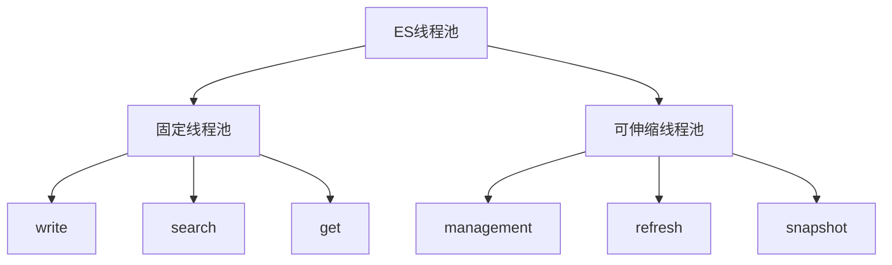

# Elasticsearch线程池完整指南

## 目录
1. [基础概念](#1-基础概念)
2. [线程池配置与管理](#2-线程池配置与管理)
3. [线程池工作机制](#3-线程池工作机制)
4. [核心线程池详解](#4-核心线程池详解)
5. [线程池优化](#5-线程池优化)
6. [监控与故障排查](#6-监控与故障排查)
7. [最佳实践](#7-最佳实践)

## 1. 基础概念

### 1.1 线程池类型


### 1.2 线程池分类
1. **固定大小线程池**
   - write: 写入操作
   - search: 搜索操作
   - get: 获取操作

2. **可伸缩线程池**
   - management: 管理操作
   - refresh: 刷新操作
   - snapshot: 快照操作

### 1.3 核心参数定义
```java
class ThreadPoolConfig {
    // 固定线程池参数
    class FixedThreadPool {
        int size;           // 线程数量
        int queueSize;      // 队列大小
        String type;        // 线程池类型
    }
    
    // 可伸缩线程池参数
    class ScalingThreadPool {
        int coreSize;       // 核心线程数
        int maxSize;        // 最大线程数
        TimeValue keepAlive;// 空闲时间
    }
}
```

## 2. 线程池配置与管理

### 2.1 基础配置
```yaml
# elasticsearch.yml

# 写入线程池
thread_pool.write:
    size: 32
    queue_size: 200

# 搜索线程池
thread_pool.search:
    size: 24
    queue_size: 1000

# GET线程池
thread_pool.get:
    size: 16
    queue_size: 1000

# 管理线程池
thread_pool.management:
    core_size: 1
    max_size: 32
    keep_alive: 5m
```

### 2.2 线程池监控
```java
class ThreadPoolMonitor {
    void monitorThreadPool() {
        // 1. 活跃线程数
        int activeThreads = threadPool.getActiveCount();
        
        // 2. 队列大小
        int queueSize = threadPool.getQueue().size();
        
        // 3. 已完成任务数
        long completedTasks = threadPool.getCompletedTaskCount();
        
        // 4. 拒绝任务数
        long rejectedTasks = threadPool.getRejectedExecutionCount();
    }
}
```

## 3. 线程池工作机制

### 3.1 任务提交流程
```java
class ThreadPoolExecutor {
    void execute(Runnable task) {
        // 1. 核心线程处理
        if (activeCount < corePoolSize) {
            addWorker(task);
            return;
        }
        
        // 2. 队列处理
        if (workQueue.offer(task)) {
            return;
        }
        
        // 3. 最大线程处理
        if (activeCount < maximumPoolSize) {
            addWorker(task);
            return;
        }
        
        // 4. 拒绝策略
        rejectHandler.rejectedExecution(task, this);
    }
}
```

### 3.2 拒绝策略
```java
class RejectionHandlers {
    // 1. 直接拒绝
    class AbortPolicy implements RejectedExecutionHandler {
        void rejectedExecution(Runnable r) {
            throw new RejectedExecutionException();
        }
    }
    
    // 2. 调用者执行
    class CallerRunsPolicy implements RejectedExecutionHandler {
        void rejectedExecution(Runnable r) {
            r.run();  // 在调用者线程中执行
        }
    }
    
    // 3. 丢弃最老任务
    class DiscardOldestPolicy implements RejectedExecutionHandler {
        void rejectedExecution(Runnable r) {
            workQueue.poll();  // 丢弃队列头部任务
            execute(r);        // 重新提交新任务
        }
    }
}
```

## 4. 核心线程池详解

### 4.1 写入线程池(write)
```java
class WriteThreadPool {
    // 特点：固定大小，有限队列
    void configure() {
        int size = Math.max(1, availableProcessors);
        int queueSize = 200;
        
        // 任务类型
        List<TaskType> tasks = Arrays.asList(
            "index",        // 索引请求
            "bulk",         // 批量请求
            "delete",       // 删除请求
            "update"        // 更新请求
        );
        
        // 拒绝策略：抛出异常
        RejectedExecutionHandler rejectedHandler = new AbortPolicy();
    }
}
```

### 4.2 搜索线程池(search)
```java
class SearchThreadPool {
    // 特点：固定大小，较大队列
    void configure() {
        int size = Math.max(1, (availableProcessors * 3) / 2 + 1);
        int queueSize = 1000;
        
        // 任务类型
        List<TaskType> tasks = Arrays.asList(
            "search",       // 搜索请求
            "count",        // 计数请求
            "suggest",      // 建议请求
            "aggs"         // 聚合请求
        );
        
        // 拒绝策略：抛出异常
        RejectedExecutionHandler rejectedHandler = new AbortPolicy();
    }
}
```

### 4.3 GET线程池(get)
```java
class GetThreadPool {
    // 特点：固定大小，中等队列
    void configure() {
        int size = Math.max(1, availableProcessors);
        int queueSize = 1000;
        
        // 任务类型
        List<TaskType> tasks = Arrays.asList(
            "get",          // 获取文档
            "mget",         // 批量获取
            "exists",       // 文档存在检查
            "terms"         // terms查询
        );
        
        // 拒绝策略：抛出异常
        RejectedExecutionHandler rejectedHandler = new AbortPolicy();
    }
}
```

### 4.4 管理线程池(management)
```java
class ManagementThreadPool {
    // 特点：可伸缩，无队列
    void configure() {
        int coreSize = 1;
        int maxSize = availableProcessors * 2;
        TimeValue keepAlive = TimeValue.timeValueMinutes(5);
        
        // 任务类型
        List<TaskType> tasks = Arrays.asList(
            "cluster_state",    // 集群状态更新
            "cluster_health",   // 集群健康检查
            "cluster_stats",    // 集群统计
            "cluster_reroute"   // 集群重路由
        );
        
        // 拒绝策略：调用者执行
        RejectedExecutionHandler rejectedHandler = new CallerRunsPolicy();
    }
}
```

## 5. 线程池优化

### 5.1 线程池大小优化
```java
class ThreadPoolOptimizer {
    void optimizeThreadPoolSize() {
        // 1. 写入线程池
        int writePoolSize = calculateWritePoolSize(
            availableProcessors,
            avgWriteLatency,
            targetThroughput
        );
        
        // 2. 搜索线程池
        int searchPoolSize = calculateSearchPoolSize(
            availableProcessors,
            avgSearchLatency,
            concurrentSearches
        );
        
        // 3. GET线程池
        int getPoolSize = calculateGetPoolSize(
            availableProcessors,
            avgGetLatency,
            concurrentGets
        );
    }
}
```

### 5.2 队列大小优化
```java
class QueueOptimizer {
    void optimizeQueueSize() {
        // 1. 写入队列
        int writeQueueSize = calculateWriteQueueSize(
            writePoolSize,
            avgWriteLatency,
            peakWriteRate
        );
        
        // 2. 搜索队列
        int searchQueueSize = calculateSearchQueueSize(
            searchPoolSize,
            avgSearchLatency,
            peakSearchRate
        );
        
        // 3. GET队列
        int getQueueSize = calculateGetQueueSize(
            getPoolSize,
            avgGetLatency,
            peakGetRate
        );
    }
}
```

## 6. 监控与故障排查

### 6.1 监控指标
```bash
# 1. 线程池统计
GET _cat/thread_pool?v

# 2. 节点统计
GET _nodes/stats/thread_pool

# 3. 详细统计
GET _nodes/stats/thread_pool?detailed=true
```

### 6.2 常见问题分析
1. **队列满/拒绝**
```java
class QueueRejectAnalyzer {
    void analyzeRejection() {
        // 1. 检查线程池使用情况
        checkThreadPoolUsage();
        
        // 2. 分析任务特征
        analyzeTaskCharacteristics();
        
        // 3. 提供优化建议
        provideOptimizationSuggestions();
    }
}
```

2. **线程池饱和**
```java
class ThreadPoolSaturationAnalyzer {
    void analyzeSaturation() {
        // 1. 检查活跃线程数
        checkActiveThreads();
        
        // 2. 分析任务执行时间
        analyzeTaskExecutionTime();
        
        // 3. 检查资源使用情况
        checkResourceUsage();
    }
}
```

## 7. 最佳实践

### 7.1 配置建议
```yaml
# elasticsearch.yml

# 1. 写入线程池
thread_pool.write:
    size: ${writePoolSize}
    queue_size: ${writeQueueSize}

# 2. 搜索线程池
thread_pool.search:
    size: ${searchPoolSize}
    queue_size: ${searchQueueSize}

# 3. GET线程池
thread_pool.get:
    size: ${getPoolSize}
    queue_size: ${getQueueSize}
```

### 7.2 监控建议
```bash
#!/bin/bash
# monitor_thread_pools.sh

# 1. 检查线程池状态
check_thread_pool_status() {
    curl -s "localhost:9200/_cat/thread_pool?v"
}

# 2. 检查拒绝率
check_rejection_rate() {
    curl -s "localhost:9200/_nodes/stats/thread_pool" | \
    jq '.nodes[].thread_pool.*.rejected'
}

# 3. 设置告警
setup_alerts() {
    # 队列使用率告警
    if [ $queue_usage -gt 80 ]; then
        send_alert "Queue usage high"
    fi
    
    # 拒绝率告警
    if [ $rejection_rate -gt 0 ]; then
        send_alert "Tasks being rejected"
    fi
}
```

### 7.3 优化建议

1. **性能优化**
   - 合理设置线程池大小
   - 适当调整队列容量
   - 选择合适的拒绝策略

2. **资源利用**
   - 监控CPU使用率
   - 关注内存使用情况
   - 平衡各线程池负载

3. **运维建议**
   - 定期检查线程池状态
   - 设置合理的告警阈值
   - 及时处理拒绝情况

## 结语

本文档详细介绍了ES的线程池机制，包括基本概念、配置管理、工作机制、优化建议等方面。理解这些机制对于优化ES集群性能和保证其可靠运行至关重要。

