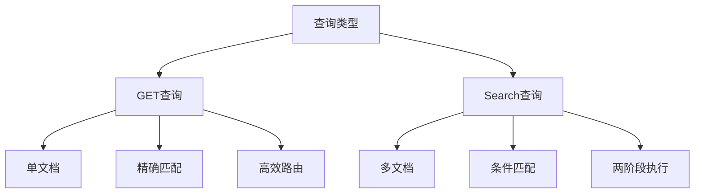
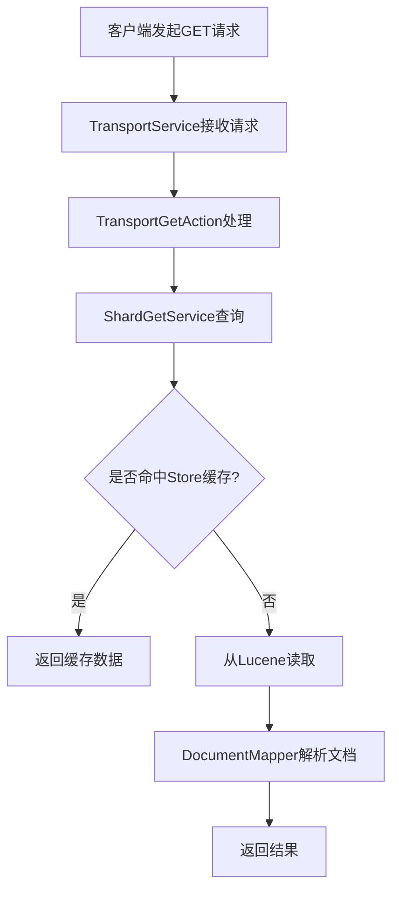
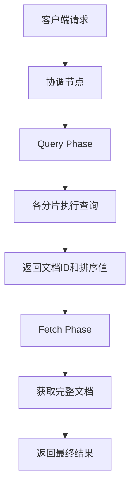
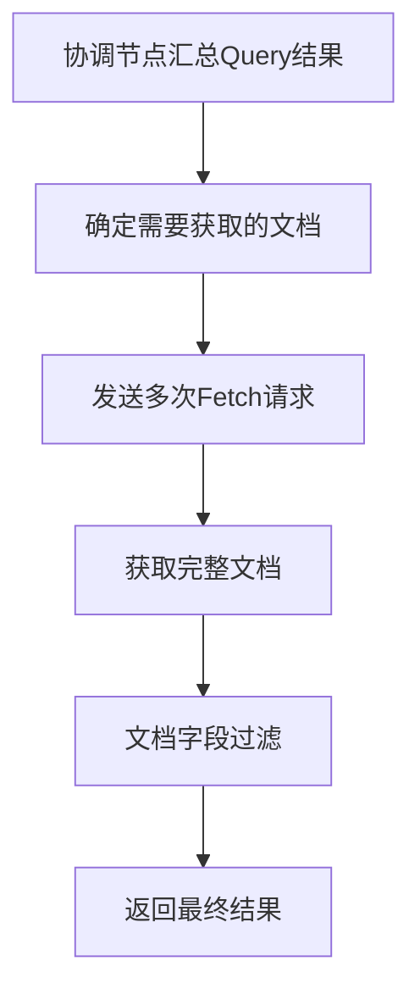

我将为您整理一份完整的ES查询流程文档：

# Elasticsearch查询流程详解

## 目录
1. [查询类型概述](#1-查询类型概述)
2. [GET查询详解](#2-get查询详解)
3. [Search查询详解](#3-search查询详解)
4. [Query Phase详解](#4-query-phase详解)
5. [Fetch Phase详解](#5-fetch-phase详解)
6. [性能优化指南](#6-性能优化指南)
7. [常见面试题总结](#7-常见面试题总结)

## 1. 查询类型概述

### 1.1 两种主要查询类型
- GET查询：根据ID精确获取单个文档
- Search查询：条件搜索，可能返回多个文档

### 1.2 核心区别


## 2. GET查询详解

### 2.1 执行流程


### 2.2 核心组件
1. **TransportService**：网络传输层
2. **ShardGetService**：分片查询服务
3. **DocumentMapper**：文档映射器

## 3. Search查询详解

### 3.1 两阶段查询设计
1. **为什么需要两阶段？**
   - 减少网络传输
   - 优化内存使用
   - 提高并发能力

2. **无状态特性**
   - 两阶段间无状态维护
   - 支持节点动态伸缩
   - 提高系统可靠性

### 3.2 整体流程


## 4. Query Phase详解

### 4.1 执行步骤
1. **查询解析**
```java
SearchContext context = new SearchContext();
SearchSourceBuilder.resolveSearchSource(
    searchRequest.source(), 
    context
);
```

2. **分片查询**
- 创建Lucene查询
- 执行查询获取结果
- 构建优先队列排序

### 4.2 功能实现
1. **评分计算**
2. **聚合处理**
3. **自动补全**

## 5. Fetch Phase详解

### 5.1 执行步骤


### 5.2 特性对比
| 特性 | Fetch查询 | GET查询 |
|------|-----------|---------|
| 查询方式 | 批量查询 | 单文档查询 |
| 性能优化 | 支持批处理 | 单次请求 |
| 功能支持 | 支持高亮等后处理 | 基础查询 |

## 6. 性能优化指南

### 6.1 Filter Context优化
```json
{
  "query": {
    "bool": {
      "filter": [
        { "term": { "status": "active" }},
        { "range": { "age": { "gte": 18 }}}
      ]
    }
  }
}
```

### 6.2 Filter Context优势
1. **不计算相关性得分**
2. **结果可缓存**
3. **适用于精确匹配场景**

### 6.3 性能优化建议
1. **索引优化**
   - 合理设置分片数
   - 优化mapping设计
   - 定期force_merge

2. **查询优化**
   - 使用Filter Context
   - 避免深度分页
   - 控制返回字段

3. **系统优化**
   - 调整JVM参数
   - 使用SSD存储
   - 合理设置缓存

## 7. 常见面试题总结

### 7.1 Query和Fetch两阶段
Q: 详细描述Search的两个阶段是如何协同工作的？
> A: 两阶段协同过程：
> 1. Query阶段：
>    - 协调节点接收请求
>    - 广播到相关分片
>    - 返回文档ID和排序值
> 
> 2. Fetch阶段：
>    - 获取所需文档
>    - 批量处理
>    - 返回最终结果

### 7.2 深度分页处理
Q: ES如何处理深度分页问题？
> A: 三种方案：
> 1. from + size
> 2. scroll
> 3. search_after

### 7.3 Filter Context应用
Q: 什么场景下应该使用Filter Context？
> A: 适用场景：
> 1. 精确值匹配
> 2. 范围查询
> 3. 地理位置过滤

