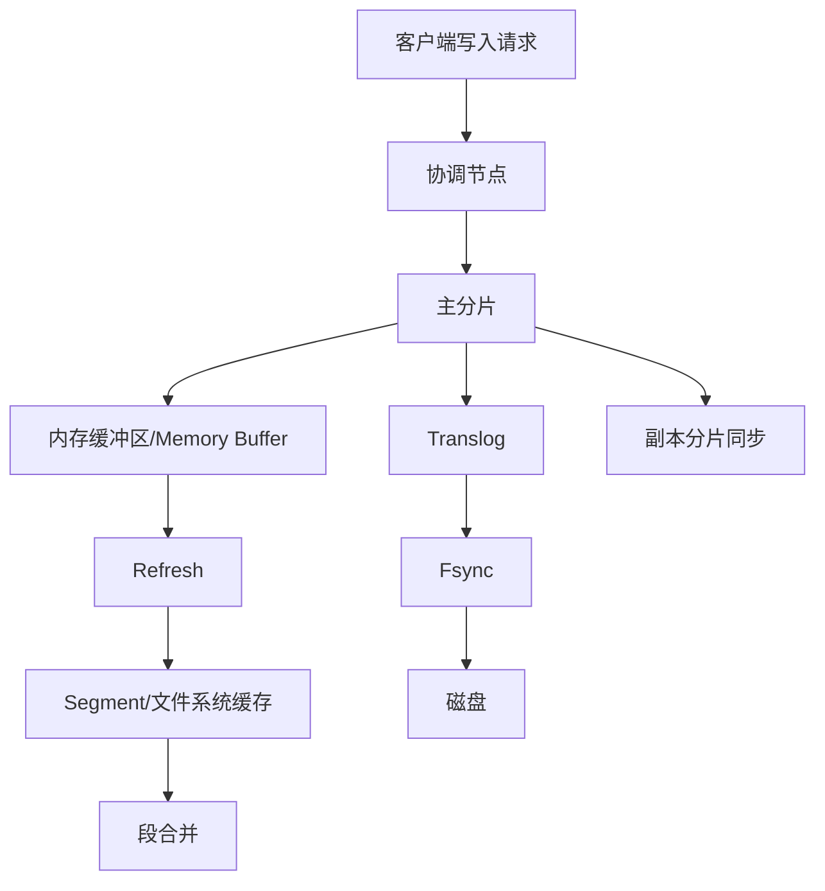
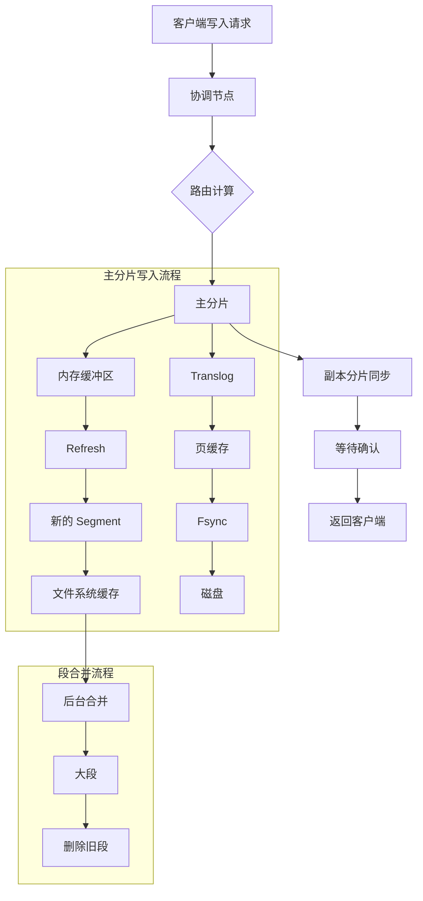
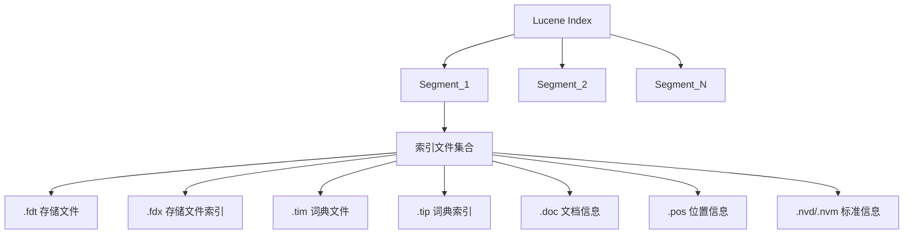

Elasticsearch 写入流程详解
一 、 整体流程概览
1. 基础流程图

2. 详细流程图

二 、 写入流程详细说明
1. 请求初始化阶段
客户端发送写入请求到任意节点
该节点成为协调节点（Coordinating Node）
根据路由计算公式确定目标分片：
shard_num = hash(_routing) % num_primary_shards

2. 主分片写入阶段
2.1 内存缓冲区写入
内存缓冲区（Memory Buffer）中的数据结构：
{
    "term_dictionary": {
        "apple": [doc1, doc3, doc5],
        "banana": [doc2, doc4]
    },
    "document_values": {
        "doc1": {"id": 1, "text": "red apple", "price": 5},
        "doc2": {"id": 2, "text": "yellow banana", "price": 3}
    },
    "field_metadata": {
        "text": {"type": "text", "analyzer": "standard"},
        "price": {"type": "integer"}
    }
}

2.2 Translog 写入
Translog 文件结构：
/indices/<index_uuid>/0/translog/
    - translog-1.tlog
    - translog-2.tlog
    - translog-3.tlog

Translog 记录格式：
{
    "op_type": "index",
    "timestamp": 1234567890,
    "source": {"field1": "value1"},
    "version": 1,
    "primary_term": 1,
    "seq_no": 0
}

3. Refresh 过程
3.1 触发条件
默认每 1 秒自动触发
手动调用 refresh API
内存缓冲区达到上限
3.2 Segment 文件结构
segment_N/
    ├── _1.fdt     # 存储原始文档
    ├── _1.fdx     # 文档索引
    ├── _1.tim     # 词条字典
    ├── _1.tip     # 词条索引
    ├── _1.dii     # DocValues 索引
    ├── _1.dim     # DocValues 数据
    ├── _1.fnm     # 字段信息
    └── _1.si      # 段信息

4. Flush 过程
4.1 触发条件
默认 30 分钟自动触发
translog 大小达到 512 MB
手动调用 flush API
4.2 执行步骤
执行 refresh
将段文件 fsync 到磁盘
清空 translog
创建新的 translog 文件
三 、 关键配置参数
1. Refresh 相关
index.refresh_interval: "1 s"
indices.memory.index_buffer_size: "10%"
2. Translog 相关
index.translog.durability: "request/async"
index.translog.sync_interval: "5 s"
index.translog.flush_threshold_size: "512 mb"
3. 写入性能相关
index.number_of_replicas: 1
index.refresh_interval: "30 s"  # 批量写入时

四 、 数据安全保障
1. Translog 机制
异步模式：可能丢失 5 秒数据
同步模式：每次请求都 fsync
index.translog.durability: "request"
2. 副本机制
写入确认机制
wait_for_active_shards: 1
consistency: "one"/"all"/"quorum"

五 、 性能优化建议
1. 批量写入优化
PUT /my_index/_settings
{
    "index.refresh_interval": "-1",  # 禁用自动 refresh
    "index.number_of_replicas": 0    # 临时禁用副本
}
2. 内存配置优化
预留 50%内存给文件系统缓存
JVM 堆内存不超过 32 GB
合理设置内存缓冲区大小
2.1 内存配置优化详解
2.1.1 预留 50%内存给文件系统缓存
系统总内存： 64 GB
├── 文件系统缓存： 32 GB (50%)
└── ES 使用： 32 GB (50%)
    ├── JVM 堆内存： 16 GB
    └── 其他开销： 16 GB
原因和作用：
ES 大量使用文件系统缓存来存储段数据
文件系统缓存由操作系统管理，访问速度快
段数据存在于文件系统缓存中可以显著提升搜索性能
避免在 JVM 堆和文件系统缓存之间复制数据

配置建议：
# 如果服务器有 64 GB 内存
- 预留 32 GB 给文件系统缓存
- ES 最大使用 32 GB

2.1.2. JVM 堆内存不超过 32 GB
JVM 堆内存配置示例：
├── 服务器内存 <= 64 GB: 设置堆内存为 31 GB
└── 服务器内存 > 64 GB: 仍然设置为 31 GB
原因：
2.1.2.1. JVM 对象指针压缩
32 GB 以下：使用压缩指针（4 字节）
32 GB 以上：使用普通指针（8 字节）
压缩指针可节省大量内存
32 GB 限制原理
1. 地址计算
压缩指针寻址能力：
4 字节 = 32 位 = 2^32 个地址
每个地址单位（因为对象 8 字节对齐）：
2^32 × 8 = 2^35 = 32 GB

2. 超过 32 GB 的情况
当堆内存 > 32 GB 时：
- 无法使用压缩指针（地址空间不够）
- 必须使用 8 字节完整指针
- 导致内存使用增加

2.1.2.2. GC 性能
堆内存越大，GC 耗时越长
32 GB 是一个经验值平衡点
配置方法：
# elasticsearch.yml
-Xms31 g  # 最小堆内存
-Xmx31 g  # 最大堆内存
2.1.2.3. 合理设置内存缓冲区大小
内存缓冲区配置：
# elasticsearch.yml
indices.memory.index_buffer_size: "10%"  # 默认值

详细说明：
1. 总大小计算
总缓冲区大小 = JVM 堆内存 × index_buffer_size 百分比
示例：30 GB 堆 × 10% = 3 GB 缓冲区
2.分配方式
每个分片的缓冲区 = 总缓冲区大小 ÷ 活跃分片数
建议配置
写入密集：增加到 15%-20%
读取密集：保持 10%或调低
混合场景：保持默认 10%
优化建议：
# 写入密集型场景
indices.memory.index_buffer_size: "15%"

# 具体分片配置
index.number_of_shards: 5  # 减少分片数提高每个分片的缓冲区大小

监控指标
# 需要监控的内存指标
- JVM 堆内存使用率
- 文件系统缓存命中率
- 内存缓冲区使用情况
- GC 频率和耗时

最佳实践
1.内存分配示例（64 GB 服务器）：
系统总内存： 64 GB
├── 操作系统： 2 GB
├── 文件系统缓存： 31 GB
└── Elasticsearch: 31 GB (JVM 堆内存)

2.定期监控和调整：
# 监控以下方面
- GC 日志
- 内存使用趋势
- 搜索延迟
- 索引性能

3.警戒线设置：
# 设置告警阈值
- JVM 堆使用率 > 75%
- GC 耗时 > 5 秒
- 文件系统缓存命中率 < 90%

3. 监控指标
- refresh 频率和耗时
- translog 大小
- 段数量和合并速度
- 写入延迟

六 、 常见问题处理
1. 写入延迟高
检查 refresh 频率
观察段合并情况
监控系统资源使用
2. 数据丢失风险
使用同步模式
配置副本
定期备份
