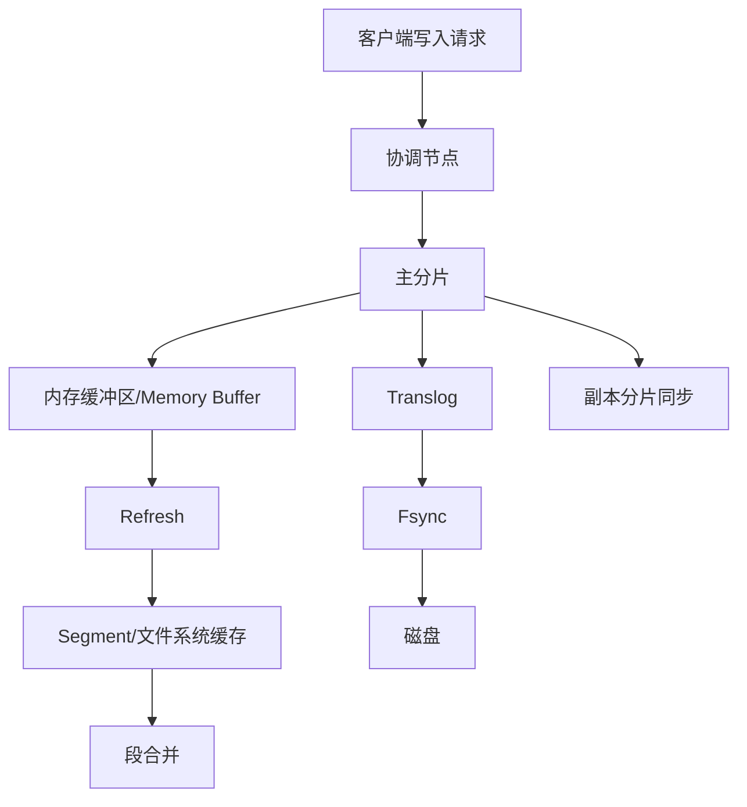
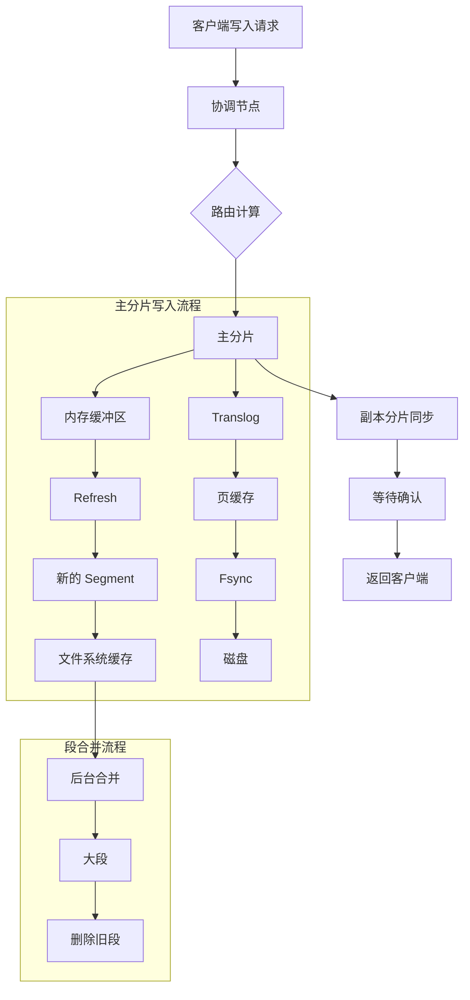
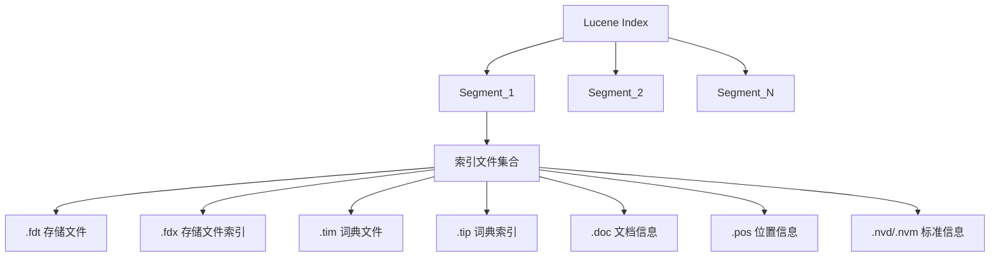

# Elasticsearch 写入流程详解

## 目录
- [1. 整体流程概览](#1-整体流程概览)
  - [1.1 基础流程图](#11-基础流程图)
  - [1.2 详细流程图](#12-详细流程图)
- [2. 写入流程详细说明](#2-写入流程详细说明)
  - [2.1 请求初始化阶段](#21-请求初始化阶段)
  - [2.2 主分片写入阶段](#22-主分片写入阶段)
  - [2.3 Refresh 过程](#23-refresh-过程)
  - [2.4 Flush 过程](#24-flush-过程)
- [3. 内部结构详解](#3-内部结构详解)
  - [3.1 内存缓冲区结构](#31-内存缓冲区结构)
  - [3.2 Translog 结构](#32-translog-结构)
  - [3.3 Segment 文件结构](#33-segment-文件结构)
- [4. 配置与优化](#4-配置与优化)
  - [4.1 关键配置参数](#41-关键配置参数)
  - [4.2 内存配置优化](#42-内存配置优化)
  - [4.3 写入性能优化](#43-写入性能优化)
- [5. 数据安全与监控](#5-数据安全与监控)
  - [5.1 数据安全保障](#51-数据安全保障)
  - [5.2 监控指标](#52-监控指标)
- [6. 常见问题处理](#6-常见问题处理)

## 1. 整体流程概览

### 1.1 基础流程图



### 1.2 详细流程图



## 2. 写入流程详细说明

### 2.1 请求初始化阶段
- 客户端发送写入请求到任意节点
- 该节点成为协调节点（Coordinating Node）
- 路由计算公式：`shard_num = hash(_routing) % num_primary_shards`

### 2.2 主分片写入阶段

#### 内存缓冲区写入
```json
{
    "term_dictionary": {
        "apple": [doc1, doc3, doc5],
        "banana": [doc2, doc4]
    },
    "document_values": {
        "doc1": {"id": 1, "text": "red apple", "price": 5},
        "doc2": {"id": 2, "text": "yellow banana", "price": 3}
    },
    "field_metadata": {
        "text": {"type": "text", "analyzer": "standard"},
        "price": {"type": "integer"}
    }
}
```

#### Translog 写入
目录结构：
```
/indices/<index_uuid>/0/translog/
    - translog-1.tlog
    - translog-2.tlog
    - translog-3.tlog
```

记录格式：
```json
{
    "op_type": "index",
    "timestamp": 1234567890,
    "source": {"field1": "value1"},
    "version": 1,
    "primary_term": 1,
    "seq_no": 0
}
```

### 2.3 Refresh 过程
触发条件：
- 默认每 1 秒自动触发
- 手动调用 refresh API
- 内存缓冲区达到上限

### 2.4 Flush 过程
触发条件：
- 默认 30 分钟自动触发
- translog 大小达到 512 MB
- 手动调用 flush API

执行步骤：
1. 执行 refresh
2. 将段文件 fsync 到磁盘
3. 清空 translog
4. 创建新的 translog 文件

## 3. 内部结构详解

### 3.1 内存缓冲区结构
[已在 2.2 节展示]

### 3.2 Translog 结构
[已在 2.2 节展示]

### 3.3 Segment 文件结构
```
segment_N/
    ├── _1.fdt     # 存储原始文档
    ├── _1.fdx     # 文档索引
    ├── _1.tim     # 词条字典
    ├── _1.tip     # 词条索引
    ├── _1.dii     # DocValues 索引
    ├── _1.dim     # DocValues 数据
    ├── _1.fnm     # 字段信息
    └── _1.si      # 段信息
```



## 4. 配置与优化

### 4.1 关键配置参数
```yaml
# Refresh 相关
index.refresh_interval: "1s"
indices.memory.index_buffer_size: "10%"

# Translog 相关
index.translog.durability: "request/async"
index.translog.sync_interval: "5s"
index.translog.flush_threshold_size: "512mb"

# 写入性能相关
index.number_of_replicas: 1
index.refresh_interval: "30s"  # 批量写入时
```

### 4.2 内存配置优化

#### 内存分配详解
系统总内存： 64 GB
- 文件系统缓存： 32 GB (50%)
- ES 使用： 32 GB (50%)
  - JVM 堆内存： 16 GB
  - 其他开销： 16 GB

#### JVM 堆内存配置
- 服务器内存 <= 64 GB: 设置堆内存为 31 GB
- 服务器内存 > 64 GB: 仍然设置为 31 GB

原因：
1. JVM 对象指针压缩
   - 32 GB 以下：使用压缩指针（4 字节）
   - 32 GB 以上：使用普通指针（8 字节）

2. GC 性能考虑
   - 堆内存越大，GC 耗时越长
   - 32 GB 是经验值平衡点


### 4.3 写入性能优化

#### 批量写入优化
````yaml
PUT /my_index/_settings
{
    "index.refresh_interval": "-1",  # 禁用自动 refresh
    "index.number_of_replicas": 0    # 临时禁用副本
}
````

#### 内存缓冲区优化
````yaml
# 写入密集型场景
indices.memory.index_buffer_size: "15%"

# 具体分片配置
index.number_of_shards: 5  # 减少分片数提高每个分片的缓冲区大小
````

#### 最佳实践配置示例（64 GB 服务器）
````
系统总内存： 64 GB
├── 操作系统： 2 GB
├── 文件系统缓存： 31 GB
└── Elasticsearch: 31 GB (JVM 堆内存)
````

## 5. 数据安全与监控

### 5.1 数据安全保障

#### Translog 机制
- 异步模式：可能丢失 5 秒数据
- 同步模式：每次请求都 fsync
````yaml
index.translog.durability: "request"
````

#### 副本机制
````yaml
wait_for_active_shards: 1
consistency: "one"/"all"/"quorum"
````

### 5.2 监控指标

#### 需要监控的指标
1. 内存相关：
- JVM 堆内存使用率
- 文件系统缓存命中率
- 内存缓冲区使用情况
- GC 频率和耗时

2. 性能相关：
- refresh 频率和耗时
- translog 大小
- 段数量和合并速度
- 写入延迟

#### 警戒线设置
````yaml
# 设置告警阈值
- JVM 堆使用率 > 75%
- GC 耗时 > 5 秒
- 文件系统缓存命中率 < 90%
````

#### 定期监控和调整
监控内容：
- GC 日志
- 内存使用趋势
- 搜索延迟
- 索引性能

## 6. 常见问题处理

### 6.1 写入延迟高问题排查

1. 检查项：
- refresh 频率
- 段合并情况
- 系统资源使用
- GC 状况

2. 解决方案：
````yaml
# 调整 refresh 间隔
index.refresh_interval: "5s"

# 控制段合并
index.merge.scheduler.max_thread_count: 1

# 优化批量写入
index.number_of_replicas: 0
index.refresh_interval: "-1"
````

### 6.2 数据丢失风险防范

1. Translog 配置：
````yaml
# 同步模式配置
index.translog.durability: "request"
index.translog.sync_interval: "5s"
````

2. 副本配置：
````yaml
# 副本数量
index.number_of_replicas: 1

# 写入确认
wait_for_active_shards: "all"
````

3. 定期备份策略：
````bash
# 创建快照
PUT /_snapshot/my_backup/snapshot_1
{
    "indices": "index_name",
    "ignore_unavailable": true
}
````

### 6.3 系统资源监控

1. 磁盘空间监控：
````bash
# 检查索引大小
GET _cat/indices?v

# 检查分片分配
GET _cat/allocation?v
````

2. 集群健康状态：
````bash
# 检查集群健康
GET _cluster/health

# 检查节点状态
GET _cat/nodes?v
````


