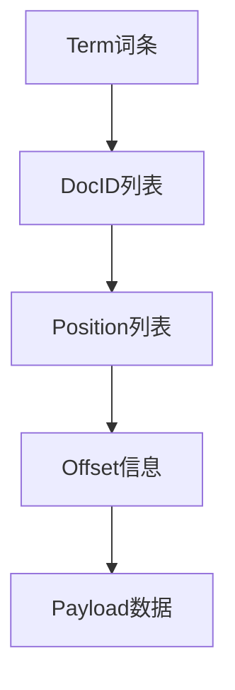
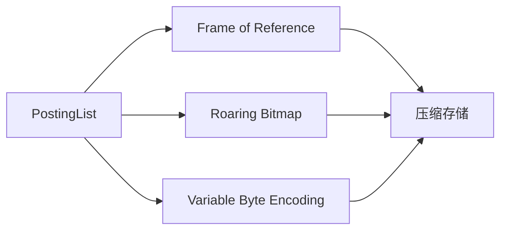
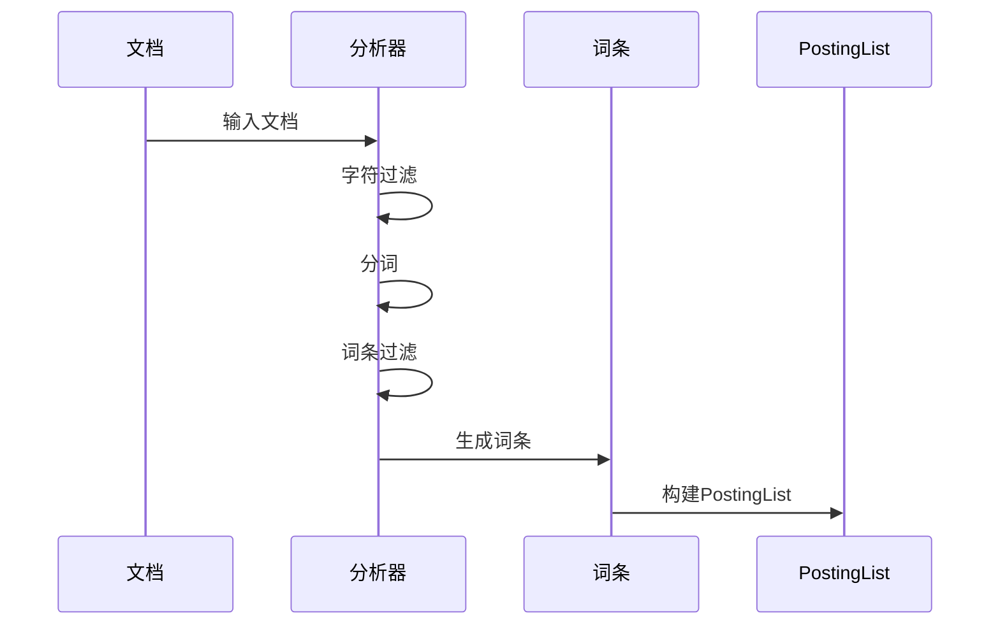
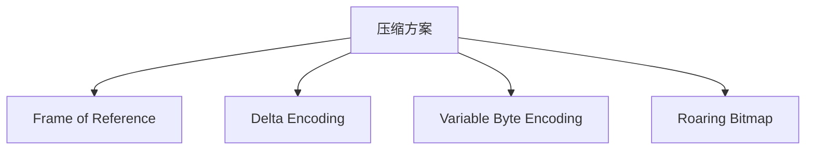
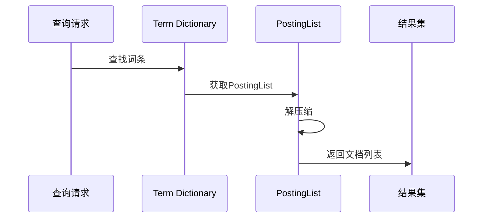
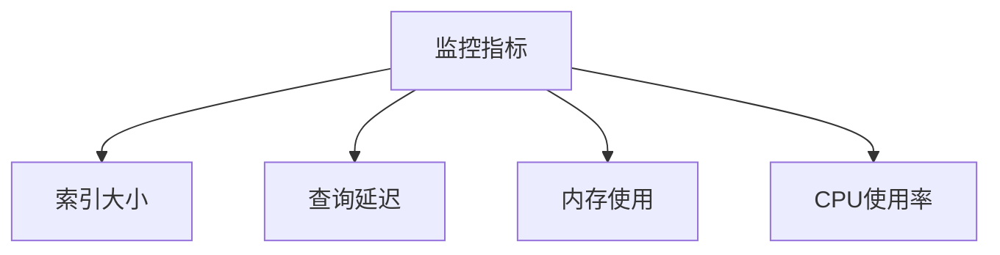

# ES中的PostingList倒排列表详解

## 1. 什么是PostingList

PostingList(倒排列表)是Elasticsearch中用于实现全文检索的核心数据结构。它记录了每个词条(Term)出现在哪些文档中,以及出现的位置等信息。

### 1.1 基本概念
- Term(词条): 文本分词后的最小单位
- DocID: 文档唯一标识符
- Position: 词条在文档中的位置
- Offset: 词条在原文中的偏移量
- Payload: 自定义的附加信息

### 1.2 数据结构示意


## 2. PostingList的组成部分

### 2.1 基本结构
```json
{
  "term": "elasticsearch",
  "doc_freq": 3,
  "postings": [
    {
      "doc_id": 1,
      "freq": 2,
      "positions": [0, 5],
      "offsets": [[0,13], [45,58]]
    },
    {
      "doc_id": 4,
      "freq": 1,
      "positions": [2],
      "offsets": [[15,28]]
    }
  ]
}
```

### 2.2 存储格式


## 3. PostingList的生成过程

### 3.1 文档分析流程


### 3.2 构建步骤
1. 文档输入
2. 文本分析
3. 词条提取
4. 位置记录
5. 偏移量计算
6. PostingList构建

## 4. PostingList的优化策略

### 4.1 压缩技术


### 4.2 压缩方案实现示例

#### 1. Frame of Reference (FOR)
```java
class FrameOfReference {
    int base;
    int[] differences;
    
    // 编码: 记录最小值作为base,其他值存储与base的差值
    void encode(int[] numbers) {
        base = findMinimum(numbers);
        differences = new int[numbers.length];
        for (int i = 0; i < numbers.length; i++) {
            differences[i] = numbers[i] - base;
        }
    }
    
    // 解码: 还原原始值
    int[] decode() {
        int[] original = new int[differences.length];
        for (int i = 0; i < differences.length; i++) {
            original[i] = differences[i] + base;
        }
        return original;
    }
}
```

#### 2. Delta Encoding (增量编码)
```java
class DeltaEncoding {
    int firstValue;
    int[] deltas;
    
    // 编码: 存储第一个值和后续值的差值
    void encode(int[] numbers) {
        if (numbers.length == 0) return;
        
        firstValue = numbers[0];
        deltas = new int[numbers.length - 1];
        
        for (int i = 1; i < numbers.length; i++) {
            deltas[i-1] = numbers[i] - numbers[i-1];
        }
    }
    
    // 解码: 通过累加差值还原原始序列
    int[] decode() {
        int[] original = new int[deltas.length + 1];
        original[0] = firstValue;
        
        for (int i = 0; i < deltas.length; i++) {
            original[i+1] = original[i] + deltas[i];
        }
        return original;
    }
}
```

#### 3. Variable Byte Encoding (变长字节编码)
```java
class VariableByteEncoding {
    // 编码: 使用可变字节数编码整数
    byte[] encode(int number) {
        List<Byte> bytes = new ArrayList<>();
        while (true) {
            byte b = (byte)(number & 0x7F); // 取最后7位
            number >>>= 7;  // 无符号右移7位
            if (number == 0) {
                b |= 0x80;  // 设置最高位为1表示结束
                bytes.add(b);
                break;
            }
            bytes.add(b);
        }
        
        // 转换为byte数组
        byte[] result = new byte[bytes.size()];
        for (int i = 0; i < bytes.size(); i++) {
            result[i] = bytes.get(i);
        }
        return result;
    }
    
    // 解码: 还原整数值
    int decode(byte[] bytes) {
        int number = 0;
        int shift = 0;
        
        for (byte b : bytes) {
            number |= (b & 0x7F) << shift;  // 取7位有效数据
            if ((b & 0x80) != 0) {  // 检查最高位是否为1
                break;
            }
            shift += 7;
        }
        return number;
    }
}
```

#### 4. Roaring Bitmap (路由位图)
```java
class RoaringBitmap {
    // 使用两层存储结构
    Map<Short, Container> containers;
    
    class Container {
        boolean isArray;  // true表示数组存储,false表示位图存储
        Object data;      // 可能是short[]或BitSet
        
        // 根据数据密度选择存储方式
        void optimize() {
            if (isArray && ((short[])data).length > 4096) {
                // 转换为位图存储
                convertToBitmap();
            } else if (!isArray && getBitmapCardinality() < 4096) {
                // 转换为数组存储
                convertToArray();
            }
        }
        
        // 添加值
        void add(short value) {
            if (isArray) {
                addToArray(value);
            } else {
                addToBitmap(value);
            }
            optimize();
        }
        
        // 获取基数(有效值的数量)
        int getCardinality() {
            if (isArray) {
                return ((short[])data).length;
            } else {
                return getBitmapCardinality();
            }
        }
    }
    
    // 添加一个整数
    void add(int value) {
        short high = (short)(value >>> 16);  // 高16位作为container索引
        short low = (short)value;            // 低16位作为container中的值
        
        Container container = containers.get(high);
        if (container == null) {
            container = new Container();
            containers.put(high, container);
        }
        container.add(low);
    }
    
    // 检查值是否存在
    boolean contains(int value) {
        short high = (short)(value >>> 16);
        short low = (short)value;
        
        Container container = containers.get(high);
        if (container == null) return false;
        
        if (container.isArray) {
            short[] array = (short[])container.data;
            return Arrays.binarySearch(array, low) >= 0;
        } else {
            BitSet bitmap = (BitSet)container.data;
            return bitmap.get(low);
        }
    }
}
```

这些压缩方案各有特点：

1. Frame of Reference (FOR)
   - 适用于数值范围相对集中的场景
   - 压缩效果依赖于数值分布
   - 解压速度快

2. Delta Encoding
   - 适用于递增序列
   - 对于排序后的DocID列表效果好
   - 实现简单,压缩效果好

3. Variable Byte Encoding
   - 适用于值分布不均匀的场景
   - 压缩率和解压速度平衡
   - 实现相对复杂

4. Roaring Bitmap
   - 适用于大规模稀疏数据集
   - 根据数据密度自动选择存储方式
   - 内存使用效率高

在实际应用中,通常会根据数据特点选择合适的压缩方案,或者组合使用多种方案。

## 5. PostingList的查询过程

### 5.1 基本查询流程


### 5.2 查询优化
1. **跳表优化**
```java
class SkipList {
    int skipInterval;
    int[] skipPositions;
    
    int search(int target) {
        // 使用跳表加速查找
        return binarySearch(skipPositions, target);
    }
}
```

2. **缓存策略**
```yaml
indices.memory.index_buffer_size: 10%
indices.memory.min_index_buffer_size: 48mb
```

## 6. 性能优化建议

### 6.1 索引优化
1. 合理设置分片数
2. 控制字段数量
3. 使用适当的分词器
4. 优化刷新间隔

### 6.2 查询优化
```json
{
  "query": {
    "bool": {
      "should": [
        {"term": {"content": "elasticsearch"}},
        {"term": {"content": "search"}}
      ],
      "minimum_should_match": 1
    }
  }
}
```

## 7. 监控与维护

### 7.1 关键指标


### 7.2 常用命令
```bash
# 查看索引统计信息
GET /_stats

# 查看段信息
GET /index_name/_segments

# 查看内存使用
GET /_nodes/stats/indices/segments
```

## 8. 最佳实践

### 8.1 设计建议
1. 合理设计分词策略
2. 控制字段数量
3. 使用适当的压缩算法
4. 定期优化索引

### 8.2 配置示例
```yaml
# elasticsearch.yml
index.refresh_interval: "30s"
index.number_of_shards: 5
index.number_of_replicas: 1
```

## 9. 常见问题与解决方案

### 9.1 内存占用过大
- 原因分析
- 解决方案
  ```yaml
  indices.memory.index_buffer_size: "10%"
  indices.memory.min_index_buffer_size: "48mb"
  ```

### 9.2 查询性能问题
- 诊断方法
- 优化建议
  ```json
  {
    "index": {
      "codec": "best_compression"
    }
  }
  ```

## 10. 总结

PostingList是ES实现全文检索的核心数据结构,通过合理的设计和优化可以显著提升检索性能。主要优化手段包括:

1. 使用高效的压缩算法
2. 合理的缓存策略
3. 优化查询设计
4. 定期维护和监控

## 参考资料
1. [Elasticsearch官方文档](https://www.elastic.co/guide/en/elasticsearch/reference/current/index.html)
2. [Lucene实现原理](https://lucene.apache.org/core/documentation.html)
3. [信息检索导论](https://nlp.stanford.edu/IR-book/)