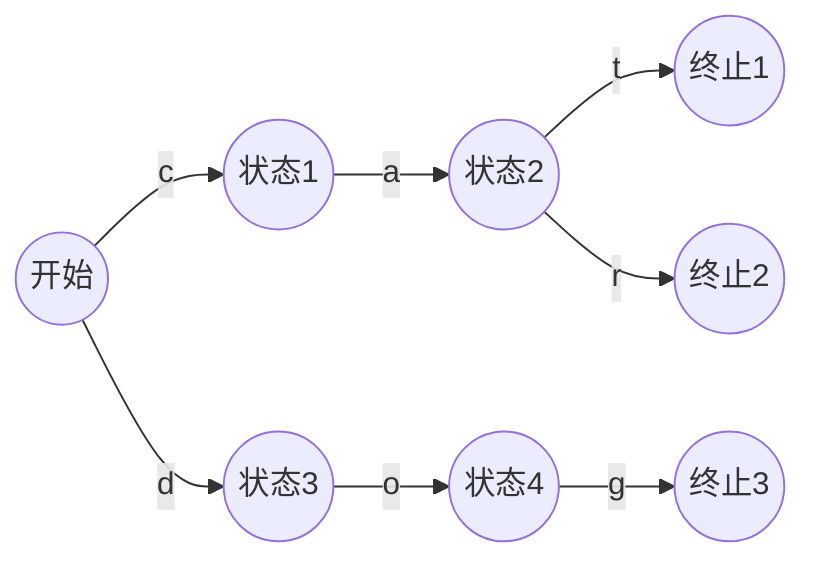
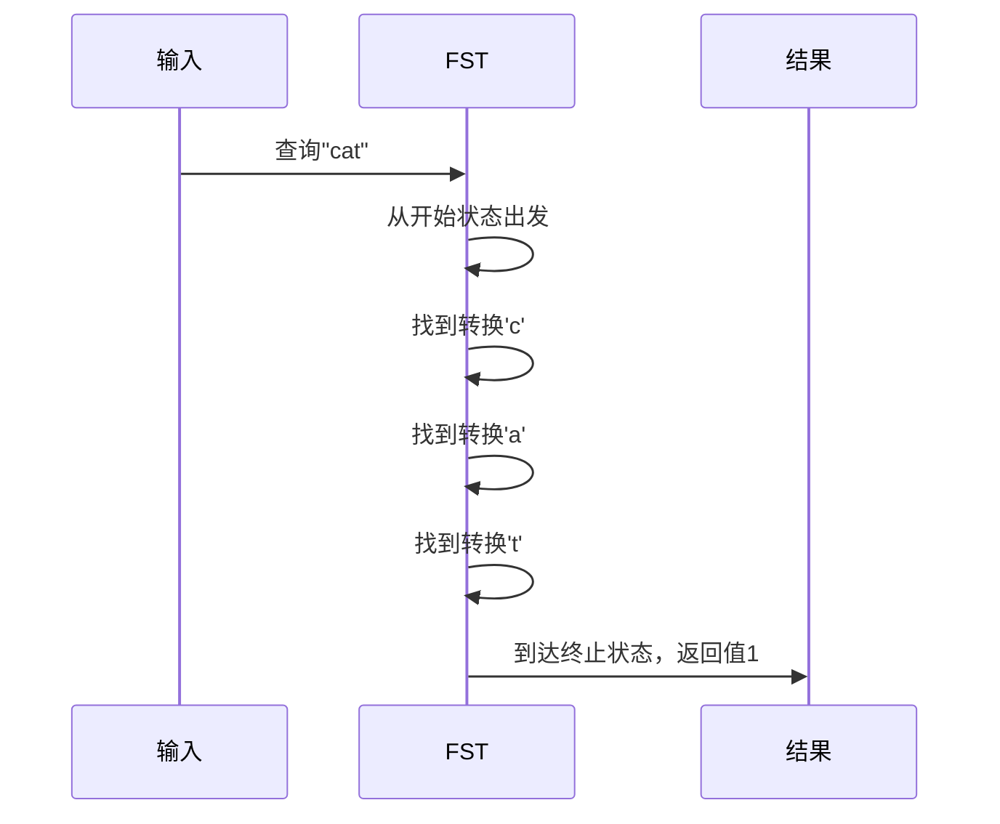

FST（Finite State Transducers，有限状态转换器）是一种高效的数据结构，它在语音识别和自然语言处理等领域有广泛的应用。在Elasticsearch中，FST主要应用于提高搜索和处理效率。
# 什么是FST

FST（Finite State Transducers，有限状态转换器）是一种高效的数据结构，它可以将一组字符串映射到对应的值。FST的核心特点是通过共享前缀和后缀来压缩数据，从而大大减少存储空间。

## FST的基本原理

1. **基本结构**
FST本质上是一个有向无环图（DAG），包含以下核心元素：
- 状态（State）：图中的节点
- 转换（Transition）：节点之间的边，带有输入字符
- 输出值（Output）：到达终止状态时可以得到的值

2. **前缀共享示例**
假设我们要存储以下单词集合：
- cat -> 1
- car -> 2
- dog -> 3

FST会这样构建：

3. **压缩原理**
FST通过以下方式实现数据压缩：

- **前缀压缩**：共同前缀只存储一次。如上图中，"cat"和"car"的"ca"前缀只存储一次。
- **后缀压缩**：通过将相同的后缀合并，进一步节省空间。
- **字符串重排序**：在构建FST时，要求输入的字符串必须按字典序排序，这样可以最大化共享机会。

4. **查询过程**
以上面的FST为例，查询"cat"的过程：

5. **FST的优势**

- **空间效率**：通过共享前缀和后缀，显著减少存储空间
- **查询效率**：查询时间复杂度为O(len(str))
- **内存友好**：数据结构紧凑，对CPU缓存友好
- **不可变性**：构建完成后是不可变的，线程安全

6. **局限性**

- **构建要求**：输入必须按字典序排序
- **不可修改**：一旦构建完成就不能修改
- **仅支持前缀查询**：不支持任意位置的通配符查询

# FST在Elasticsearch中如何具体实现
FST（Finite State Transducers，有限状态转换器）在Elasticsearch中的实现主要体现在以下几个方面：

1. **数据结构**：
   FST是一种有向图，其中每个节点表示一个状态，每个状态可以有多个出边，每个出边都有对应的标签和权重。在FST中，从根节点到任何其他节点的路径都代表一个键，权重表示该键的相关度或分值。

2. **构建过程**：
   - 首先创建一个空节点，表示FST的入口，所有的Key都从这个入口开始。
   - 如果还有未处理的Key，则枚举Key的每一个label，并进行相应的状态转移和权重调整。

3. **查询和匹配机制**：
   - **前缀搜索**：在FST中，前缀搜索是通过深度优先遍历来实现的，从根节点开始，遍历到所有以给定前缀为前缀的字符串所对应的终止状态，并输出这些字符串。
   - **精确匹配**：精确匹配是通过遍历FST上从根节点到终止状态的路径来实现的，如果最后到达的状态是终止状态，则说明给定字符串在FST中存在。
   - **模糊搜索**：FST可以用于实现近似搜索功能，通过构建Levenshtein自动机来实现，找到与给定字符串相似的所有字符串。

4. **应用场景**：
   FST在Elasticsearch中的应用包括自动补全、拼写纠错、近似搜索等功能。Elasticsearch使用FST作为内部数据结构，可以快速地搜索和匹配大量的文本数据，提高搜索效率和准确性。

5. **优化和调优**：
   - **状态压缩**：将FST中的冗余状态进行合并，以减少状态数量，降低内存占用和查询时间。
   - **权重调整**：为FST中的每个状态设置一个权重值，可以根据权重值对搜索结果进行排序，提高搜索质量和效率。

6. **Off-Heap优化**：
   从Elasticsearch 7.3版本开始，`.tip`文件（包含FST数据结构）通过`mmap`的方式加载，使得FST占据的内存从堆内转移到了堆外，由操作系统的page cache管理，这样可以减少JVM内存的使用，提高节点能够处理的数据规模。

通过上述实现方式，FST在Elasticsearch中提供了高效的数据存储和查询能力，特别是在处理大规模文本数据时，FST的优势尤为明显。

# 以下是FST在Elasticsearch中的一些应用场景：

1. **全文搜索应用场景**：
   - 网站搜索：利用FST提高搜索引擎的效率和准确性。
   - 文档管理系统：通过FST快速检索文档中的关键信息。
   - 电子商务搜索：在商品搜索中应用FST，提升搜索响应速度和结果的相关性。

2. **实时分析**：
   - Elasticsearch能够进行实时分析，FST在此过程中用于追踪实时数据的仪表板，例如用户活动、交易或传感器输出。

3. **机器学习**：
   - 通过X-Pack中的机器学习功能，Elasticsearch能够自动检测数据中的异常、模式和趋势，FST在此过程中发挥作用。

4. **地理数据应用**：
   - Elasticsearch支持通过地理空间索引和搜索来处理地理数据，FST在此过程中用于提高地理数据处理的效率。

5. **日志和事件数据分析**：
   - Elasticsearch在日志分析中的应用广泛，FST在此领域中用于提高日志数据的搜索和分析效率。

FST的优势在于其空间占用小、查询速度快，以及适用性广。它通过压缩存储空间和重复利用前缀和后缀，有效地表示大量字符串集合，使得在处理大规模文本数据时具有显著优势。查询时间复杂度为O(len(str))，使得FST在执行查询操作时非常高效，这使得它在实时处理和大数据分析等场景中具有广泛应用价值。
