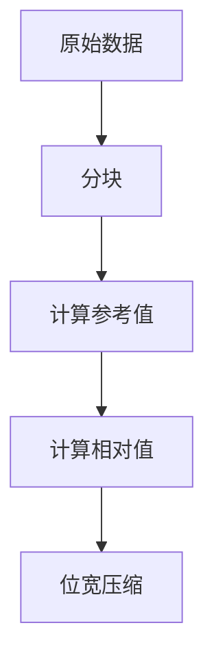
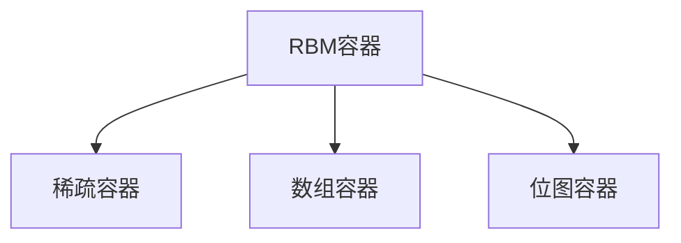
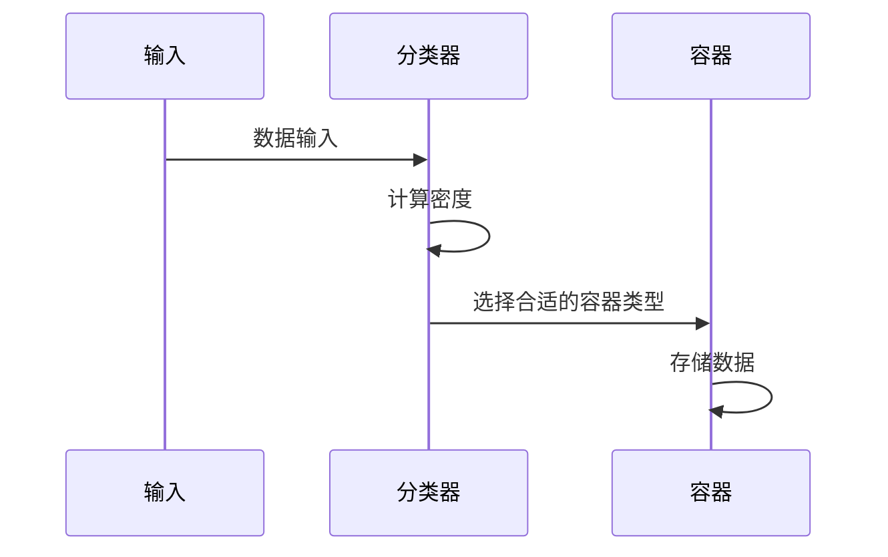

倒排表(Inverted Index)是搜索引擎的核心数据结构,为了节省存储空间和提高查询效率,Elasticsearch采用了FOR(Frame of Reference)和RBM(Roaring Bitmap)等压缩算法对倒排表进行压缩。本文将详细介绍这两种算法的工作原理及应用场景。

# FOR压缩算法

FOR(Frame of Reference)是一种基于数据分块的压缩算法,其核心思想是将数据分成固定大小的块,然后对每个块内的数据进行相对值编码,从而达到压缩的目的。

## FOR的基本原理

1. **基本概念**
FOR压缩算法包含以下核心要素:
- 数据块(Frame): 固定大小的数据分组
- 参考值(Reference): 每个块的最小值
- 相对值(Delta): 原始值与参考值的差值
- 位宽: 存储相对值所需的最小位数

2. **压缩过程示例**
假设有以下文档ID序列:
```
[103, 105, 108, 110, 115, 130, 132, 135]
```

FOR压缩过程如下:


3. **具体步骤**
- **分块**: 将数据分成大小为4的块
  块1: [103, 105, 108, 110]
  块2: [115, 130, 132, 135]

- **计算参考值**
  块1参考值: 103
  块2参考值: 115

- **计算相对值**
  块1: [0, 2, 5, 7]
  块2: [0, 15, 17, 20]

4. **FOR的优势**

- **高压缩率**: 相对值通常比原始值小,需要更少的位数存储
- **解压速度快**: 简单的加法运算即可恢复原始值
- **随机访问**: 支持对单个值的快速访问
- **适合递增序列**: 对于文档ID这样的递增序列特别有效

5. **局限性**

- **数据顺序要求**: 最适合有序数据
- **参考值开销**: 每个块都需要存储参考值
- **块内波动限制**: 如果块内数据波动太大,压缩效果下降

# RBM压缩算法

RBM(Roaring Bitmap)是一种混合型的位图压缩算法,它根据数据特点选择不同的存储方式,实现了空间效率和查询性能的平衡。

## RBM的基本原理

1. **数据结构**
RBM使用分层存储结构:


2. **存储策略**
- **稀疏容器**: 当数据非常稀疏时使用
- **数组容器**: 当数据中等稀疏时使用
- **位图容器**: 当数据密集时使用

3. **压缩过程**
以存储数字集合为例:


4. **RBM的优势**

- **自适应压缩**: 根据数据特点选择最优存储方式
- **查询效率高**: 支持快速的位运算
- **空间效率好**: 针对不同数据密度采用不同策略
- **动态调整**: 可以动态切换容器类型

5. **局限性**

- **实现复杂**: 需要维护多种容器类型
- **内存开销**: 容器切换可能带来额外开销
- **更新成本**: 更新操作可能触发容器转换

# 在Elasticsearch中的实现

1. **索引构建时的压缩**:
   - 文档ID使用FOR压缩
   - 布尔字段使用RBM压缩
   - 根据字段特点选择合适的压缩算法

2. **查询优化**:
   - 支持压缩状态下的跳表
   - 实现了快速的位运算
   - 优化了随机访问性能

3. **内存管理**:
   - 使用堆外内存存储压缩数据
   - 实现了内存映射文件
   - 支持分页加载

# 应用场景

1. **文档ID压缩**:
   - 使用FOR压缩存储文档ID列表
   - 支持快速的范围查询
   - 节省存储空间

2. **布尔过滤器**:
   - 使用RBM存储布尔字段
   - 支持高效的AND/OR操作
   - 适合大规模数据集
布尔值更适合使用RBM（Roaring Bitmap）压缩的原因主要有以下几点：
1. 数据稀疏性：布尔值通常在数据集中表现出较高的稀疏性。RBM的稀疏容器能够有效地存储稀疏数据，避免了不必要的内存浪费。
位运算效率：RBM支持高效的位运算，这对于布尔值的AND、OR等操作非常重要。布尔字段的查询通常涉及到多个条件的组合，RBM能够快速执行这些位运算，从而提高查询性能。
3. 动态调整：RBM能够根据数据的特点动态选择合适的存储方式。当布尔字段的密度变化时，RBM可以在不同的容器之间切换，以保持最佳的存储和查询效率。
4. 空间效率：RBM在处理布尔值时，能够根据数据的密度选择最优的存储策略，从而实现更好的空间利用率。这对于大规模数据集尤为重要，因为它可以显著减少存储成本。
5. 支持大规模数据集：布尔值通常用于过滤和查询操作，RBM的设计使其能够高效处理大规模数据集，确保在高并发情况下仍能保持良好的性能。
3. **聚合计算**:
   - 压缩状态下进行基数统计
   - 支持近似去重计算
   - 优化内存使用

4. **实时分析**:
   - 支持压缩数据的实时查询
   - 减少IO开销
   - 提高查询响应速度

这两种压缩算法在Elasticsearch中扮演着重要角色,它们不仅显著减少了存储空间,还保证了查询性能。FOR算法主要用于压缩有序的文档ID列表,而RBM算法则更适合处理布尔类型的字段。通过合理使用这些压缩算法,Elasticsearch能够高效处理大规模数据集,同时保持较低的存储成本。