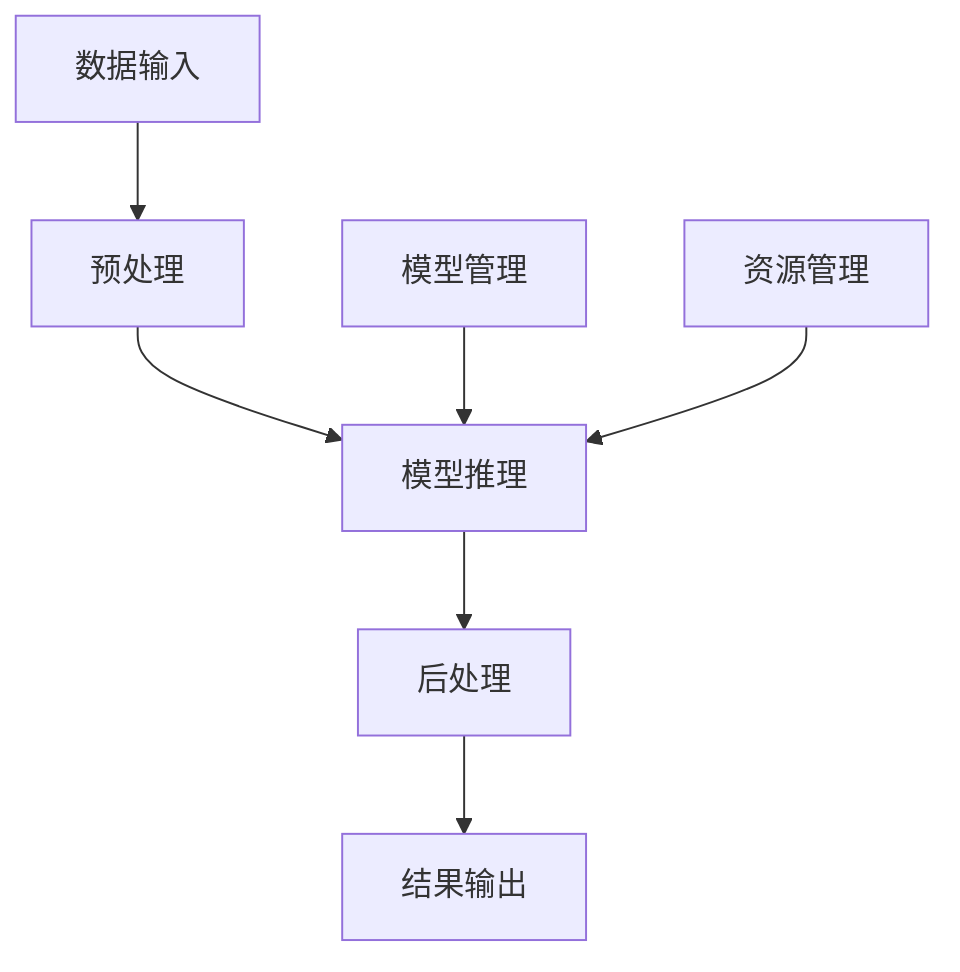
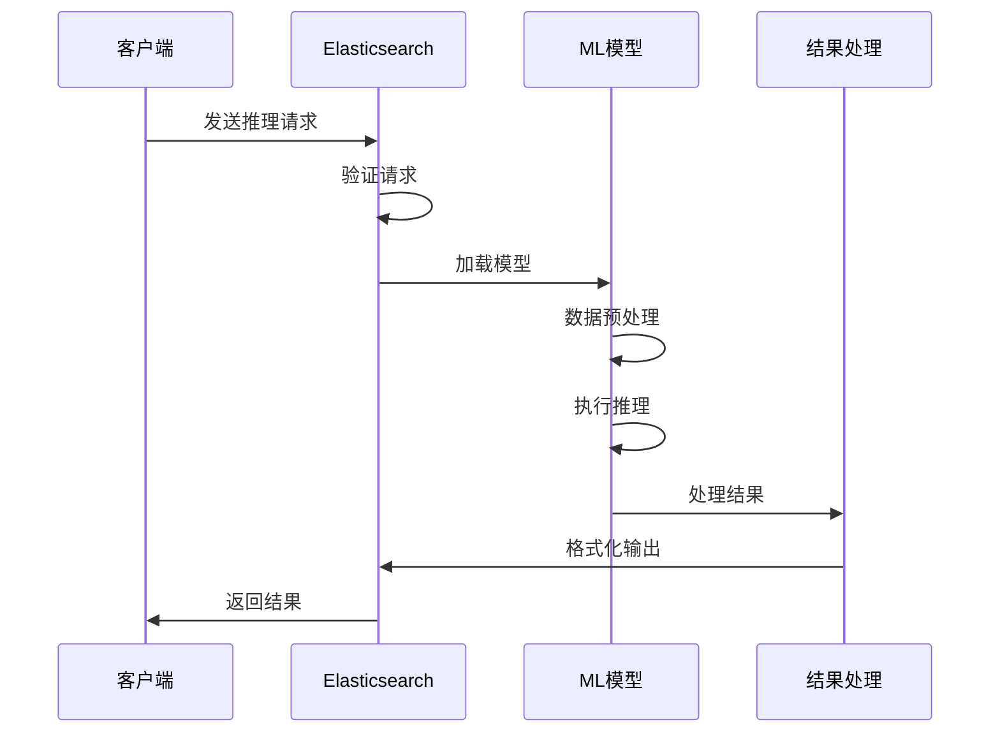
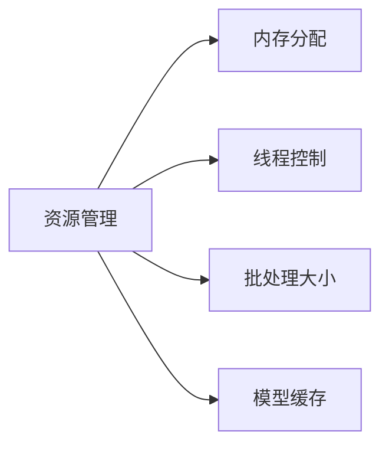
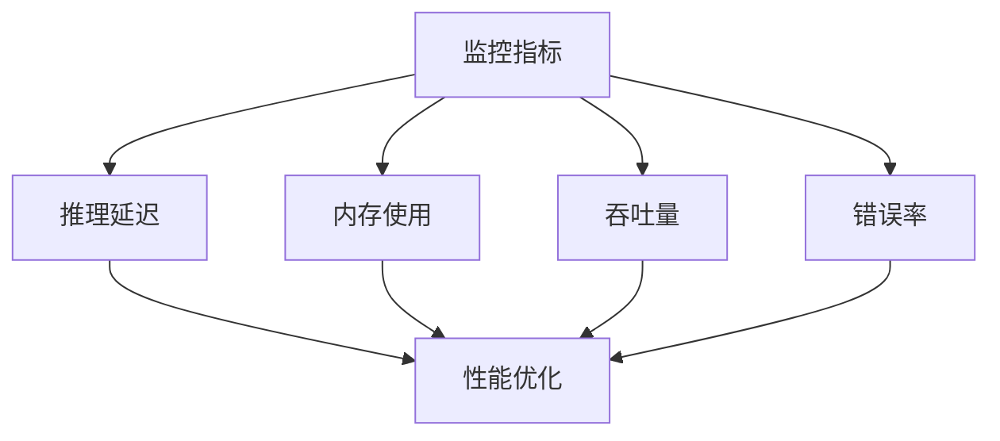
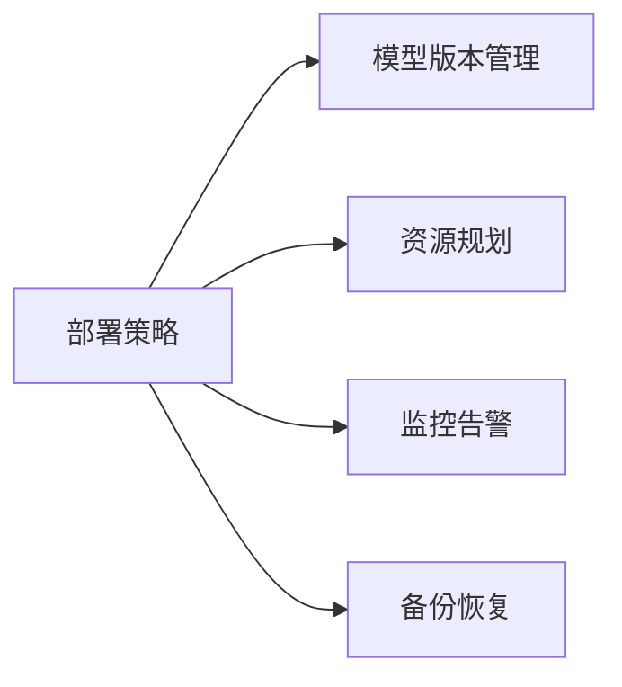
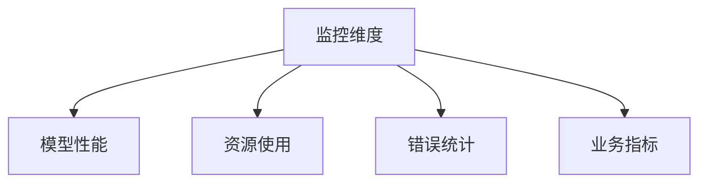

# 如何使用ES进行机器学习模型的推理

## 引言
Elasticsearch (ES) 提供了强大的机器学习功能，不仅支持异常检测和预测分析，还支持在其数据上进行模型训练和推理。本文将详细介绍如何在ES中进行机器学习模型的推理。

## 机器学习推理架构

### 1. 基本架构


### 2. 推理流程


## 实现步骤

### 1. 准备数据
#### 数据格式要求
```json
{
  "docs": [
    {
      "field1": "value1",
      "field2": "value2"
    }
  ]
}
```

#### 数据预处理
```json
{
  "preprocessors": [
    {
      "one_hot_encoding": {
        "field": "category",
        "hot_map": {
          "type_a": "1",
          "type_b": "2"
        }
      }
    },
    {
      "normalization": {
        "field": "numeric_value",
        "method": "min_max"
      }
    }
  ]
}
```

### 2. 模型管理

#### 模型部署
```json
PUT _ml/trained_models/my_model
{
  "input": {
    "field_names": ["field1", "field2"]
  },
  "description": "My deployed model",
  "model_type": "pytorch",
  "inference_config": {
    "classification": {
      "num_classes": 2,
      "num_top_classes": 2
    }
  }
}
```

#### 模型状态查看
```bash
GET _ml/trained_models/my_model/_stats
```

### 3. 执行推理

#### 单文档推理
```json
POST _ml/inference/my_model/_infer
{
  "docs": [
    {
      "field1": 1.0,
      "field2": "value"
    }
  ]
}
```

#### 批量推理
```json
POST _ml/inference/my_model/_infer
{
  "docs": [
    {
      "field1": 1.0,
      "field2": "value1"
    },
    {
      "field1": 2.0,
      "field2": "value2"
    }
  ],
  "inference_config": {
    "batch_size": 10
  }
}
```

## 性能优化

### 1. 资源管理


### 2. 优化配置
```json
{
  "model_memory_limit": "512mb",
  "max_inference_processors": 4,
  "batch_size": 16,
  "timeout": "10s",
  "cache_size": "1gb"
}
```

### 3. 监控指标


## 使用场景

### 1. 文本分类
```json
POST _ml/inference/text_classifier/_infer
{
  "docs": [
    {
      "text_field": "This is a sample text for classification"
    }
  ]
}
```

### 2. 异常检测
```json
POST _ml/inference/anomaly_detector/_infer
{
  "docs": [
    {
      "metric_value": 100,
      "timestamp": "2023-01-01T00:00:00Z"
    }
  ]
}
```

### 3. 预测分析
```json
POST _ml/inference/forecaster/_infer
{
  "docs": [
    {
      "series": [1, 2, 3, 4, 5],
      "horizon": 3
    }
  ]
}
```

## 最佳实践

### 1. 模型部署策略


### 2. 性能优化建议
1. **批量处理**
   - 合理设置批处理大小
   - 使用异步处理
   - 实现请求队列

2. **资源管理**
   - 监控内存使用
   - 控制并发数
   - 实现自动扩缩容

3. **缓存策略**
   - 模型缓存
   - 结果缓存
   - 预热策略

### 3. 错误处理
```json
{
  "error_handling": {
    "on_failure": "skip",
    "retry": {
      "count": 3,
      "delay": "1s"
    },
    "fallback": {
      "default_value": 0
    }
  }
}
```

## 监控与维护

### 1. 监控指标


### 2. 告警配置
```json
{
  "alerts": {
    "latency": {
      "threshold": "1s",
      "window": "5m"
    },
    "error_rate": {
      "threshold": 0.01,
      "window": "1h"
    }
  }
}
```

### 3. 维护操作
```bash
# 更新模型
PUT _ml/trained_models/my_model/_update

# 删除模型
DELETE _ml/trained_models/my_model

# 停止推理
POST _ml/trained_models/my_model/_stop
```

## 总结
ES的机器学习推理功能提供了强大的模型部署和推理能力。通过合理的配置和优化，可以实现高效的模型服务。关键是要注意资源管理、性能优化和监控维护等方面。

## 参考资料
1. [Elasticsearch Machine Learning](https://www.elastic.co/guide/en/elasticsearch/reference/current/ml-apis.html)
2. [Model Inference API](https://www.elastic.co/guide/en/elasticsearch/reference/current/infer-trained-model.html)
3. [ML Best Practices](https://www.elastic.co/guide/en/elasticsearch/reference/current/ml-best-practices.html)