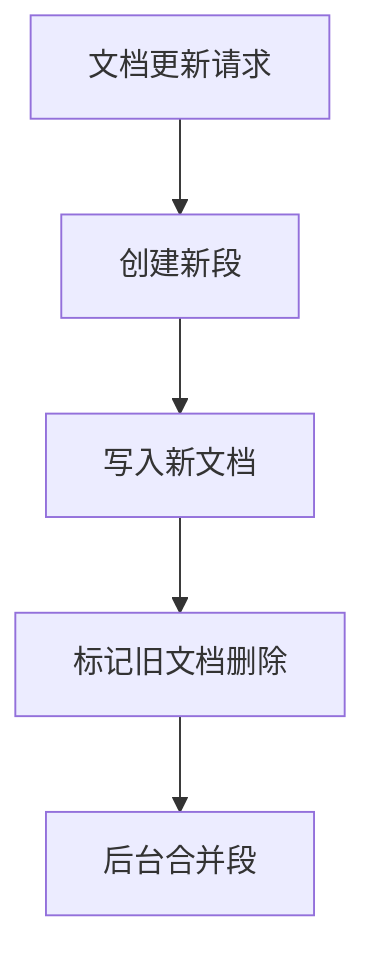
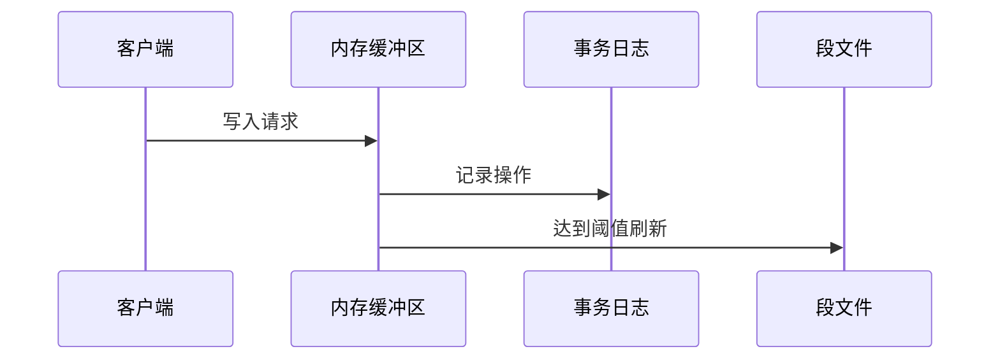
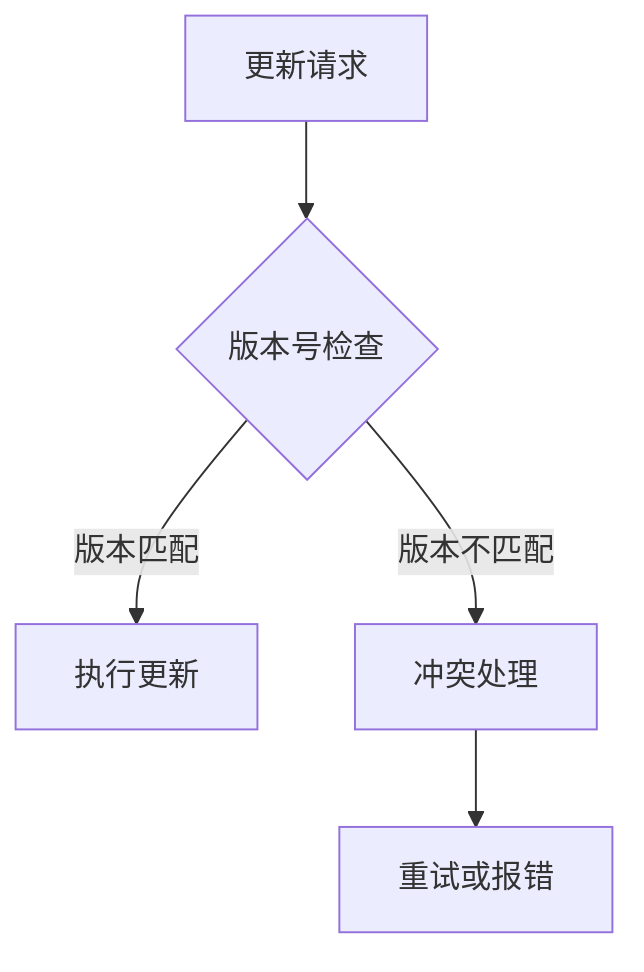
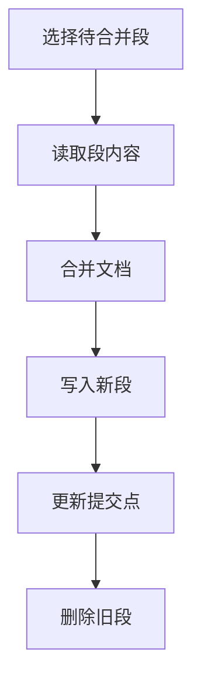
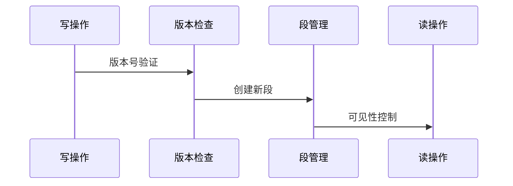
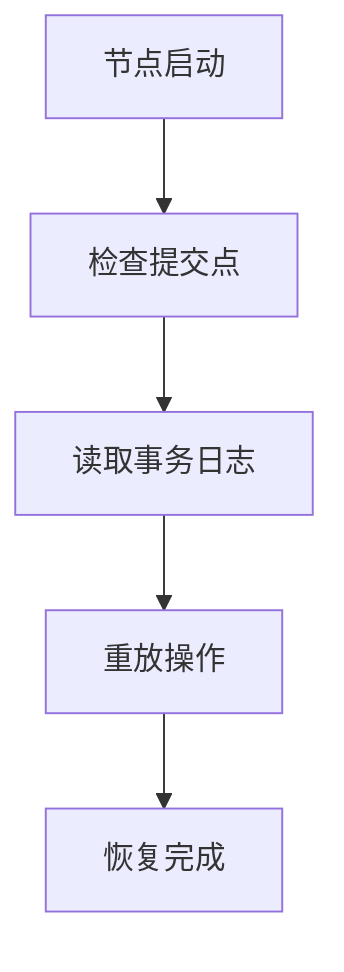

Elasticsearch的倒排索引本质上是不可变的(Immutable),这种设计既保证了查询性能,又带来了更新的挑战。本文将详细介绍ES如何在保证数据一致性的前提下实现倒排索引的更新。

# 倒排索引更新的基本原理

## 不可变性设计

1. **核心特点**
倒排索引的不可变性体现在:
- 一旦创建就不能修改
- 删除和更新都是标记操作
- 实际更新通过新建完成

2. **更新过程示例**

3. **优势与挑战**
优势:
- 无需锁机制
- 利于缓存
- 支持压缩

挑战:
- 存储空间开销
- 需要合并优化
- 实时性要求

# 写入流程与一致性保证

## 写入过程

1. **内存缓冲区**

2. **刷新(Refresh)机制**
- 默认每1秒刷新一次
- 生成新的段
- 使数据可搜索
- 不保证持久化

3. **提交(Commit)机制**
- 将段持久化到磁盘
- 写入提交点
- 清空事务日志
- 保证数据持久性

## 版本控制

1. **内部版本控制**

2. **版本号管理**
- 每次更新递增
- 乐观并发控制
- 支持外部版本号

3. **版本控制机制详解**

a. 内部版本控制
- 系统自动维护version字段
- 初始值为1,每次更新加1
- 使用_version参数进行并发控制
- 基于乐观锁实现

b. 外部版本控制
- 使用version_type=external
- 版本号由外部系统提供
- 新版本必须大于当前版本
- 适用于外部数据源同步

4. **版本冲突处理**

a. 冲突检测

b. 处理策略
- 重试机制
  * 指数退避重试
  * 最大重试次数限制
  * 重试间隔控制
- 冲突报告
  * VersionConflictEngineException
  * 详细的错误信息
  * 冲突原因说明

5. **分布式环境下的版本控制**

a. 主副本同步
- 主分片版本控制
- 副本分片同步
- 版本号一致性保证

b. 跨集群同步
- 版本号传递
- 冲突解决策略
- 最终一致性保证

6. **版本控制最佳实践**

a. 使用建议
- 对并发更新频繁的文档启用版本控制
- 合理设置重试策略
- 正确处理冲突异常

b. 性能优化
- 避免频繁版本检查
- 批量操作时的版本控制
- 合理使用外部版本控制

# 段合并机制

## 合并策略

1. **触发条件**
- 段数量达到阈值
- 段大小符合策略
- 系统资源允许

2. **合并过程**

3. **优化策略**
- 分层合并
- 后台执行
- 资源控制

# 并发控制机制

## 读写一致性

1. **实时性与一致性**
- 近实时搜索
- 写后读一致性
- 原子性操作

2. **并发控制**

3. **隔离级别**
- 写操作隔离
- 读操作一致性视图
- 段级别可见性控制

# 故障恢复机制

1. **事务日志(Translog)**
- 记录所有操作
- 故障恢复依据
- 定期清理

2. **恢复流程**

3. **数据保护机制**
- 副本机制
- 快照备份
- 集群状态同步

# 实际应用场景

1. **实时更新场景**
- 社交媒体feed流
- 实时计数器
- 状态更新

2. **批量更新场景**
- 数据迁移
- 批量价格调整
- 状态批量修改

3. **删除场景**
- 软删除
- 硬删除
- 批量删除

4. **特殊场景处理**
- 高并发更新
- 大批量更新
- 频繁更新

# 性能优化建议

1. **写入优化**
- 批量写入
- 合理刷新间隔
- 预热索引

2. **合并优化**
- 控制段数量
- 合理的合并策略
- 资源分配

3. **一致性优化**
- 合理副本数
- 写一致性级别
- 读一致性级别

通过以上机制,Elasticsearch在保证数据一致性的同时,实现了高效的倒排索引更新。不可变性设计、版本控制、段合并等机制相互配合,共同构建了一个可靠的更新体系。在实际应用中,需要根据具体场景选择合适的更新策略,平衡好实时性、一致性和性能的关系。