# Kafka 架构详解

## 目录
- [1. Kafka 简介](#1-kafka-简介)
  - [1.1 什么是 Kafka](#11-什么是-kafka)
  - [1.2 主要应用场景](#12-主要应用场景)
  - [1.3 核心概念](#13-核心概念)
- [2. 整体架构](#2-整体架构)
  - [2.1 架构组件](#21-架构组件)
  - [2.2 数据流转过程](#22-数据流转过程)
  - [2.3 集群架构](#23-集群架构)
- [3. Broker 详解](#3-broker-详解)
  - [3.1 Broker 工作原理](#31-broker-工作原理)
  - [3.2 请求处理机制](#32-请求处理机制)
  - [3.3 数据复制机制](#33-数据复制机制)
- [4. ZooKeeper 协调服务](#4-zookeeper-协调服务)
  - [4.1 元数据管理](#41-元数据管理)
  - [4.2 集群协调](#42-集群协调)
  - [4.3 控制器选举](#43-控制器选举)
- [5. 消息存储机制](#5-消息存储机制)
  - [5.1 存储架构](#51-存储架构)
  - [5.2 日志管理](#52-日志管理)
  - [5.3 索引机制](#53-索引机制)

## 1. Kafka 简介

### 1.1 什么是 Kafka

Apache Kafka 是一个分布式流处理平台，最初由 LinkedIn 公司开发，后来成为 Apache 软件基金会的一部分。它具有以下特点：

- **高吞吐量**：能够处理大量的消息数据
- **可扩展性**：支持集群水平扩展
- **持久性**：消息数据持久化到磁盘
- **可靠性**：支持数据复制和故障恢复
- **高性能**：通过零拷贝等技术实现高性能

### 1.2 主要应用场景

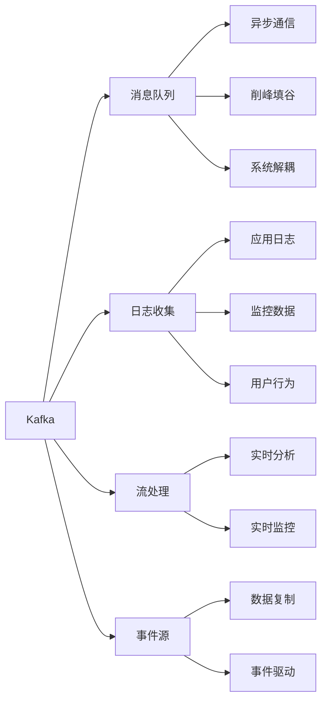

### 1.3 核心概念

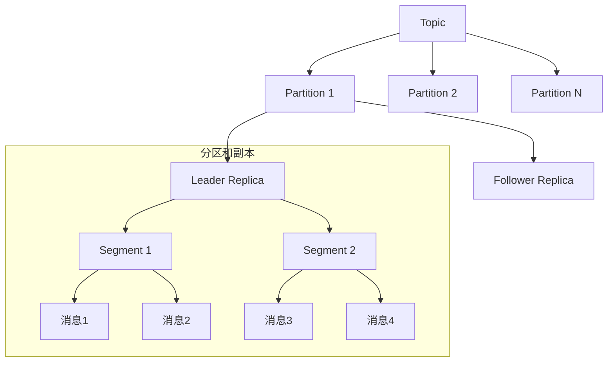

1. **Topic（主题）**
   - Kafka 中消息的分类单元
   - 每个主题可以有多个分区
   - 支持多订阅者模式

2. **Partition（分区）**
   - Topic 物理上的分组
   - 每个分区是一个有序的消息序列
   - 分区数据分布在不同的 Broker 上

3. **Replica（副本）**
   - 分区的备份
   - 包含 Leader 和 Follower 副本
   - 提供数据冗余和故障恢复能力
‵‵‵
## 2. 整体架构

### 2.1 架构组件

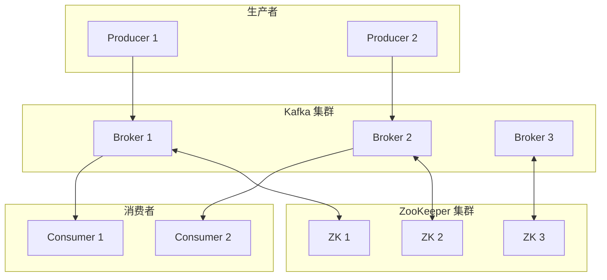

主要组件说明：

1. **Producer（生产者）**
   - 消息生产的客户端
   - 支持同步和异步发送
   - 实现负载均衡和故障转移

2. **Broker（消息代理）**
   - Kafka 服务器实例
   - 负责消息存储和传输
   - 管理分区和副本

3. **Consumer（消费者）**
   - 消息消费的客户端
   - 支持单播和广播模式
   - 通过消费组实现负载均衡

4. **ZooKeeper**
   - 提供集群协调服务
   - 存储元数据信息
   - 实现领导者选举

### 2.2 数据流转过程

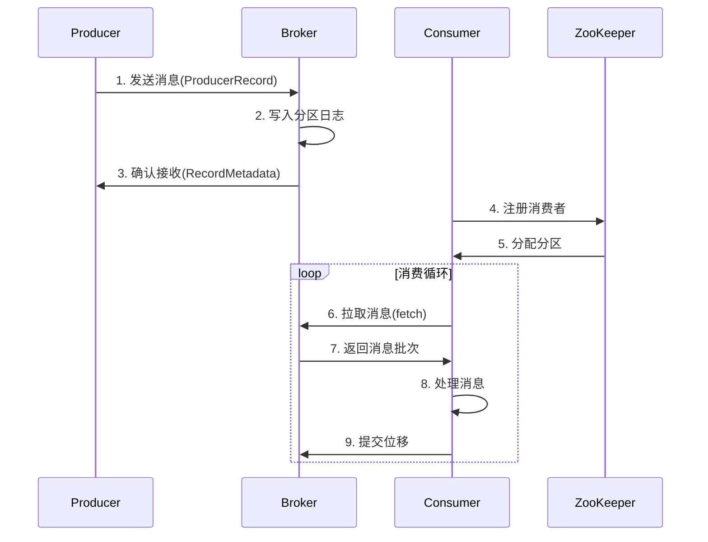

详细流程说明：

1. **消息发送阶段**
   ```java
   // Producer 发送消息示例代码
   Properties props = new Properties();
   props.put("bootstrap.servers", "localhost:9092");
   props.put("acks", "all");
   props.put("retries", 3);
   
   Producer<String, String> producer = new KafkaProducer<>(props);
   ProducerRecord<String, String> record = 
       new ProducerRecord<>("topic-name", "key", "value");
   
   producer.send(record, (metadata, exception) -> {
       if (exception == null) {
           System.out.println("Partition: " + metadata.partition() + 
                            ", Offset: " + metadata.offset());
       }
   });
   ```

2. **消息存储阶段**
   - 消息写入分区日志文件
   - 更新索引文件
   - 复制到其他副本

3. **消息消费阶段**
   ```java
   // Consumer 消费消息示例代码
   Properties props = new Properties();
   props.put("bootstrap.servers", "localhost:9092");
   props.put("group.id", "test-group");
   
   KafkaConsumer<String, String> consumer = new KafkaConsumer<>(props);
   consumer.subscribe(Arrays.asList("topic-name"));
   
   while (true) {
       ConsumerRecords<String, String> records = consumer.poll(Duration.ofMillis(100));
       for (ConsumerRecord<String, String> record : records) {
           System.out.printf("offset = %d, key = %s, value = %s%n", 
               record.offset(), record.key(), record.value());
       }
   }
   ```

### 2.3 集群架构

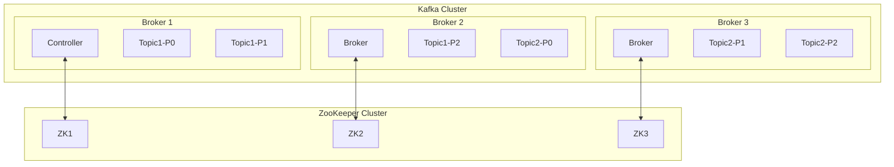

集群架构特点：

1. **分区分布**
   - 分区均匀分布在所有 Broker 上
   - 每个 Broker 可能同时是多个分区的 Leader
   - 支持机架感知的分区分配

2. **副本放置**
   ```bash
   # 创建带有副本的主题
   bin/kafka-topics.sh --create \
       --bootstrap-server localhost:9092 \
       --replication-factor 3 \
       --partitions 6 \
       --topic my-replicated-topic
   ```

3. **故障转移**
   - Controller 监控 Broker 存活状态
   - 自动进行 Leader 选举
   - 重新分配分区和副本

## 3. Broker 详解

### 3.1 Broker 工作原理

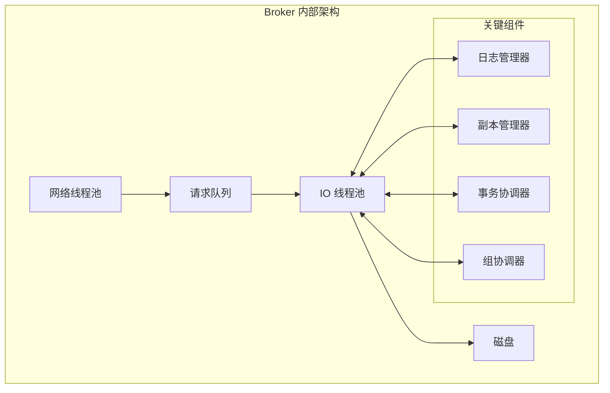

核心组件功能：

1. **网络线程池**
   - 处理客户端连接
   - 接收请求和发送响应
   - 可配置线程数：
   ```properties
   num.network.threads=3
   num.io.threads=8
   ```

2. **日志管理器**
   - 管理分区日志
   - 处理日志分段
   - 清理过期数据

3. **副本管理器**
   - 处理副本同步
   - 管理 ISR 集合
   - 处理副本状态转换

### 3.2 请求处理机制

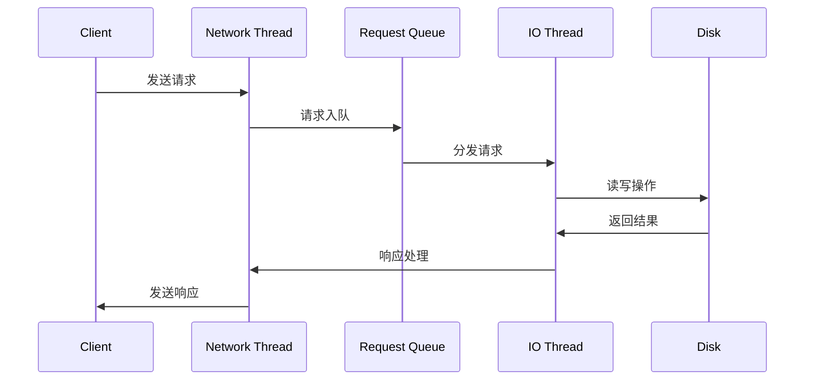

请求处理流程：

1. **请求接收**
   ```java
   // 网络层配置示例
   socket.server.send.buffer.bytes=102400
   socket.receive.buffer.bytes=102400
   socket.request.max.bytes=104857600
   ```

2. **请求排队**
   - 使用请求队列缓存请求
   - 实现背压机制
   - 控制请求处理速率

3. **请求处理**
   ```java
   // IO线程池配置
   num.io.threads=8
   background.threads=10
   ```

### 3.3 数据复制机制

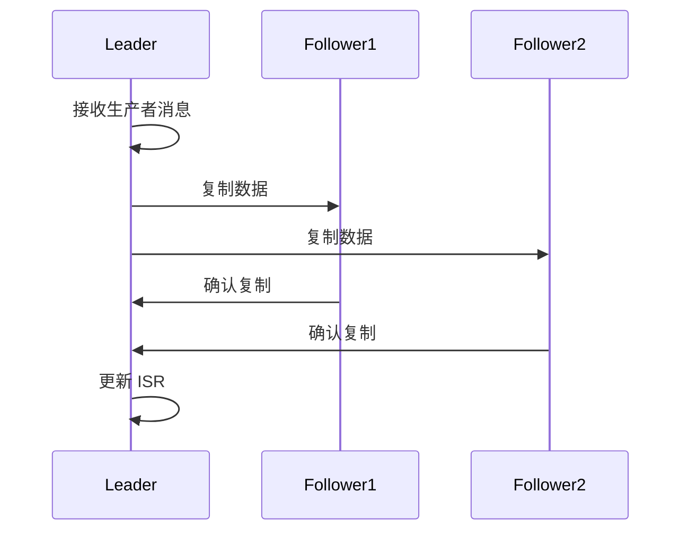

复制机制特点：

1. **ISR（In-Sync Replicas）管理**
   ```properties
   # ISR 相关配置
   replica.lag.time.max.ms=10000
   min.insync.replicas=2
   ```

2. **Leader Epoch**
   - 防止脑裂
   - 保证数据一致性
   - 支持故障恢复

3. **副本同步策略**
   ```properties
   # 副本同步配置
   replica.fetch.max.bytes=1048576
   replica.fetch.wait.max.ms=500
   ```

## 4. ZooKeeper 协调服务

### 4.1 元数据管理

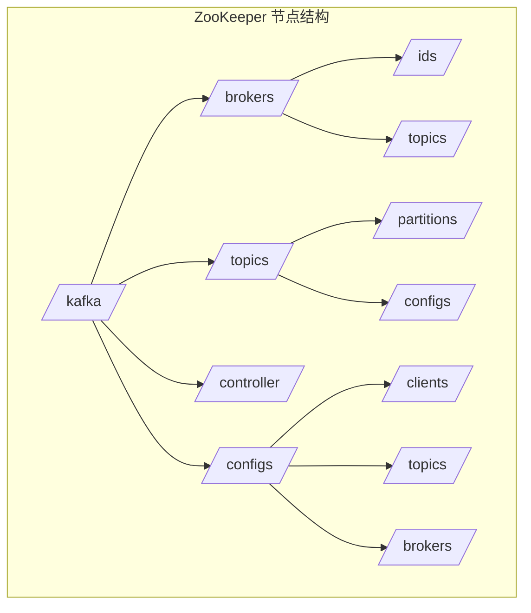

1. **节点结构说明**
   ```bash
   # ZooKeeper 常用命令
   # 查看 broker 列表
   zkCli.sh -server localhost:2181
   ls /kafka/brokers/ids
   
   # 查看 topic 信息
   get /kafka/brokers/topics/my-topic
   
   # 查看 controller 信息
   get /kafka/controller
   ```

2. **元数据存储格式**
   ```json
   // Broker 注册信息示例
   {
     "version": 1,
     "host": "192.168.1.100",
     "port": 9092,
     "jmx_port": 9999,
     "timestamp": "1629264000000",
     "endpoints": ["PLAINTEXT://192.168.1.100:9092"],
     "rack": "rack1"
   }
   
   // Topic 配置信息示例
   {
     "version": 1,
     "partitions": {
       "0": [1,2,3],
       "1": [2,3,1],
       "2": [3,1,2]
     }
   }
   ```

### 4.2 集群协调

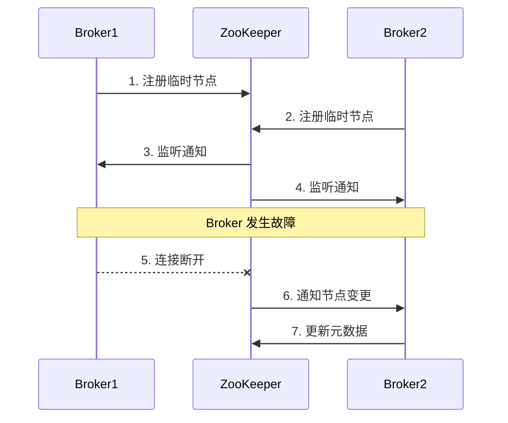

1. **Broker 注册**
   ```java
   // Broker 配置示例
   broker.id=1
   zookeeper.connect=localhost:2181
   zookeeper.connection.timeout.ms=6000
   zookeeper.session.timeout.ms=6000
   ```

2. **状态监控**
   - 心跳检测
   - 会话管理
   - 节点监听

### 4.3 控制器选举

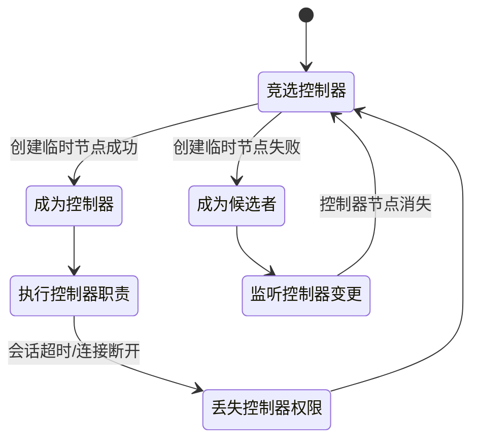

1. **选举过程**
   ```java
   // 控制器相关配置
   controller.socket.timeout.ms=30000
   controller.message.queue.size=10000
   ```

2. **控制器职责**
   - 分区领导者选举
   - 集群成员管理
   - 主题管理
   - 配额管理

## 5. 消息存储机制

### 5.1 存储架构

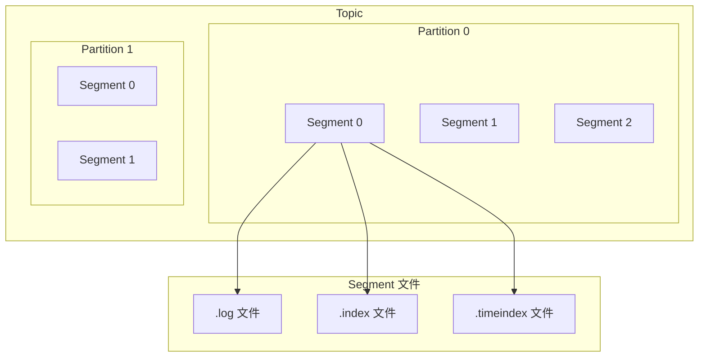

1. **目录结构**
   ```bash
   # 典型的数据目录结构
   /kafka-logs/
   ├── my-topic-0/
   │   ├── 00000000000000000000.log
   │   ├── 00000000000000000000.index
   │   ├── 00000000000000000000.timeindex
   │   └── leader-epoch-checkpoint
   ├── my-topic-1/
   │   └── ...
   └── replication-offset-checkpoint
   ```

2. **配置参数**
   ```properties
   # 存储相关配置
   log.dirs=/var/lib/kafka/data
   log.segment.bytes=1073741824
   log.retention.hours=168
   log.retention.bytes=-1
   ```

### 5.2 日志管理

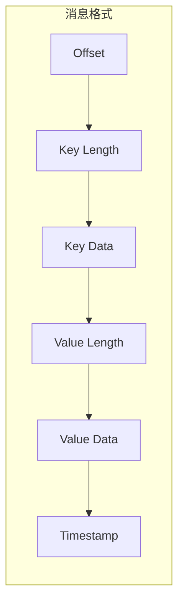

1. **日志分段**
   ```java
   // 日志分段配置
   log.segment.bytes=1073741824        // 段文件大小
   log.segment.ms=604800000           // 段文件时间
   log.roll.hours=168                 // 滚动时间
   ```

2. **日志清理**
   - 基于时间的清理
   - 基于大小的清理
   - 压缩清理（Log Compaction）

### 5.3 索引机制

Kafka 的索引机制是其高效消息存储和检索的关键部分。以下是对索引机制的细化和底层原理的详细说明。

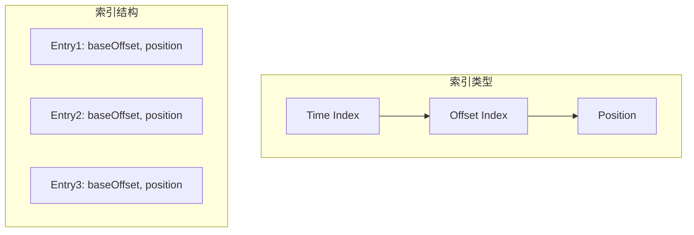

1. **偏移量索引**
   - 偏移量索引用于快速定位消息在日志文件中的位置。每个索引项包含两个字段：
     - `baseOffset`: 消息在日志中的起始偏移量
     - `position`: 消息在日志文件中的字节位置
   - 索引项格式：
   ```
   // 索引项格式
   baseOffset: 8 bytes
   position: 4 bytes
   ```

2. **时间索引**
   - 时间索引用于根据时间戳快速查找消息。每个时间索引项包含两个字段：
     - `timestamp`: 消息的时间戳
     - `offset`: 消息在日志中的偏移量
   - 时间索引项格式：
   ```
   // 时间索引项格式
   timestamp: 8 bytes
   offset: 8 bytes
   ```

3. **索引查找示例**
   - 查找指定偏移量的消息的过程如下：
   ```java
   // 查找指定 offset 的消息
   public Record findMessage(long offset) {
       // 1. 通过二分查找定位 segment
       LogSegment segment = findSegment(offset);
       
       // 2. 在 segment 中查找具体位置
       int position = segment.index.lookup(offset);
       
       // 3. 读取消息
       return segment.log.read(position);
   }
   ```

### 5.3.1 索引的底层原理

- **索引结构**：Kafka 使用稀疏索引结构来减少内存占用。每个分区的索引文件只存储每个日志段的起始偏移量和对应的字节位置。这样可以在不占用过多内存的情况下，快速定位到消息。

- **二分查找**：在查找消息时，Kafka 会使用二分查找算法在索引中快速定位到目标偏移量。这种方法的时间复杂度为 O(log n)，大大提高了查找效率。

- **日志分段**：Kafka 将日志分为多个段，每个段都有自己的索引文件。这样可以有效管理和清理过期数据，同时提高写入性能。

- **清理策略**：Kafka 支持基于时间和大小的日志清理策略。过期的日志段会被删除，索引也会相应更新，以保持系统的高效性。

- **高效的磁盘 I/O**：Kafka 的索引机制设计旨在减少磁盘 I/O 操作。通过将索引和日志分开存储，Kafka 可以在读取消息时只访问必要的索引项，从而提高整体性能。

### 5.3.2 索引的使用场景

- **快速消息检索**：在高吞吐量的场景下，Kafka 的索引机制能够快速响应消费者的消息请求，确保低延迟。

- **时间序列数据**：对于需要按时间顺序检索的应用，时间索引提供了高效的查找能力，适用于日志分析和监控等场景。

- **数据恢复**：在故障恢复过程中，索引可以帮助快速定位到最后成功写入的消息，减少数据丢失的风险。

通过以上细化，Kafka 的索引机制不仅提高了消息的存储和检索效率，还为系统的可靠性和可扩展性提供了重要支持。

## 6. 总结与最佳实践

### 6.1 架构设计要点
1. 分区是实现扩展性和并行处理的基础
2. 副本机制保证了数据的可靠性
3. Controller 确保了集群的可管理性
4. ZooKeeper 提供了可靠的协调服务
5. 高效的存储机制保证了性能

### 6.2 配置建议
```properties
# 生产环境推荐配置
num.network.threads=3
num.io.threads=8
socket.send.buffer.bytes=102400
socket.receive.buffer.bytes=102400
socket.request.max.bytes=104857600
log.dirs=/data/kafka-logs
num.partitions=3
num.recovery.threads.per.data.dir=1
offsets.topic.replication.factor=3
transaction.state.log.replication.factor=3
transaction.state.log.min.isr=2
log.retention.hours=168
log.segment.bytes=1073741824
zookeeper.connect=zk1:2181,zk2:2181,zk3:2181
```
### 6.2 配置建议

```properties
# 生产环境推荐配置

# 网络线程数，处理客户端请求的线程数量
num.network.threads=3
```
- **含义**：指定用于处理网络请求的线程数量。每个网络线程负责接收和发送请求。
- **原因**：设置为3是为了在高并发情况下保持良好的响应能力，确保能够处理多个客户端的请求。

```properties
# IO线程数，处理磁盘读写的线程数量
num.io.threads=8
```
- **含义**：指定用于处理磁盘I/O操作的线程数量。
- **原因**：设置为8可以提高磁盘的读写性能，尤其是在高吞吐量的场景下，确保Kafka能够快速地将消息写入磁盘并从中读取。

```properties
# 发送缓冲区大小，单位为字节
socket.send.buffer.bytes=102400
```
- **含义**：指定网络发送缓冲区的大小。
- **原因**：设置为102400字节（100KB）可以在高负载情况下提高数据发送的效率，减少网络拥塞。

```properties
# 接收缓冲区大小，单位为字节
socket.receive.buffer.bytes=102400
```
- **含义**：指定网络接收缓冲区的大小。
- **原因**：同样设置为102400字节，以确保在高并发情况下能够有效接收大量数据，避免丢包。

```properties
# 请求最大字节数，单位为字节
socket.request.max.bytes=104857600
```
- **含义**：指定单个请求允许的最大字节数。
- **原因**：设置为104857600字节（100MB）可以支持较大的消息传输，适用于需要传输大数据的场景。

```properties
# 日志存储目录
log.dirs=/data/kafka-logs
```
- **含义**：指定Kafka存储日志文件的目录。
- **原因**：选择一个专用的目录来存储日志文件，以便于管理和监控磁盘使用情况。

```properties
# 默认分区数量
num.partitions=3
```
- **含义**：指定每个主题的默认分区数量。
- **原因**：设置为3可以在一定程度上实现负载均衡，允许多个消费者并行消费，提高吞吐量。

```properties
# 每个数据目录的恢复线程数
num.recovery.threads.per.data.dir=1
```
- **含义**：指定每个数据目录用于恢复的线程数量。
- **原因**：设置为1可以避免在恢复过程中对磁盘的过度竞争，确保恢复过程的稳定性。

```properties
# 偏移量主题的副本因子
offsets.topic.replication.factor=3
```
- **含义**：指定偏移量主题的副本数量。
- **原因**：设置为3可以提高数据的可靠性和可用性，确保在某个Broker故障时仍然可以访问到偏移量信息。

```properties
# 事务状态日志的副本因子
transaction.state.log.replication.factor=3
```
- **含义**：指定事务状态日志的副本数量。
- **原因**：同样设置为3，以确保事务的可靠性，避免因Broker故障导致事务信息丢失。

```properties
# 事务状态日志的最小同步副本数
transaction.state.log.min.isr=2
```
- **含义**：指定事务状态日志的最小同步副本数。
- **原因**：设置为2可以确保在进行事务操作时，至少有两个副本是同步的，从而提高数据的一致性和可靠性。

```properties
# 日志保留时间，单位为小时
log.retention.hours=168
```
- **含义**：指定日志文件的保留时间。
- **原因**：设置为168小时（7天）可以在一定时间内保留消息，便于消费者在需要时进行重放。

```properties
# 日志段大小，单位为字节
log.segment.bytes=1073741824
```
- **含义**：指定每个日志段的大小。
- **原因**：设置为1073741824字节（1GB）可以在保证性能的同时，减少日志段的数量，降低管理开销。

```properties
# ZooKeeper连接地址
zookeeper.connect=zk1:2181,zk2:2181,zk3:2181
```
- **含义**：指定ZooKeeper的连接地址。
- **原因**：使用多个ZooKeeper节点（zk1、zk2、zk3）可以提高集群的可用性和容错能力，确保在某个节点故障时仍然可以正常工作。

### 6.3 监控指标
1. **Broker 层面**
   - 活跃控制器数
   - 请求处理速率
   - 网络处理线程空闲率

2. **Topic 层面**
   - 消息生产速率
   - 消息消费速率
   - 分区副本同步状态

3. **Consumer 层面**
   - 消费延迟
   - 消费者组重平衡
   - 提交的 offset

### 6.4 运维建议
1. 合理规划分区数量
2. 定期监控磁盘使用情况
3. 及时清理过期数据
4. 保持适当的副本因子
5. 定期进行性能测试
```

