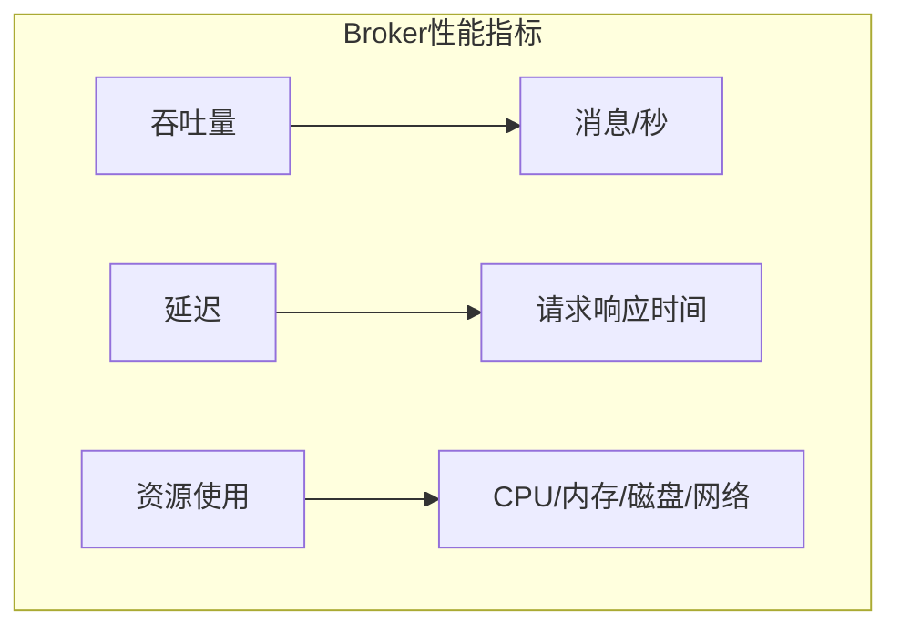
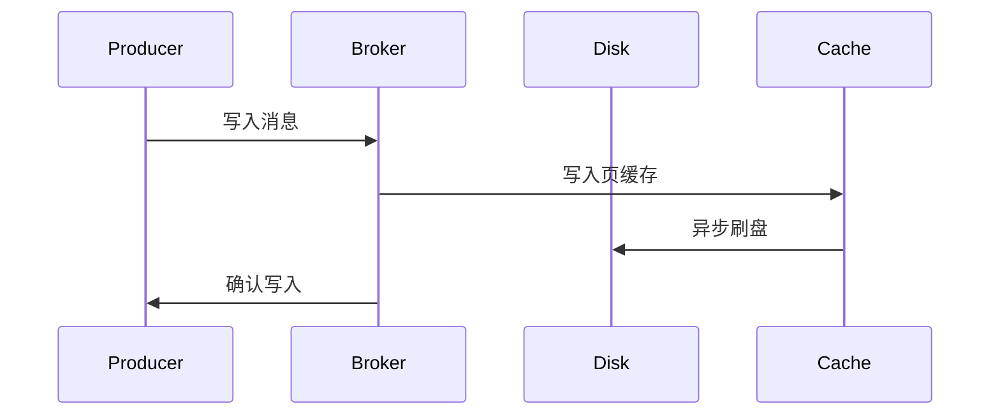
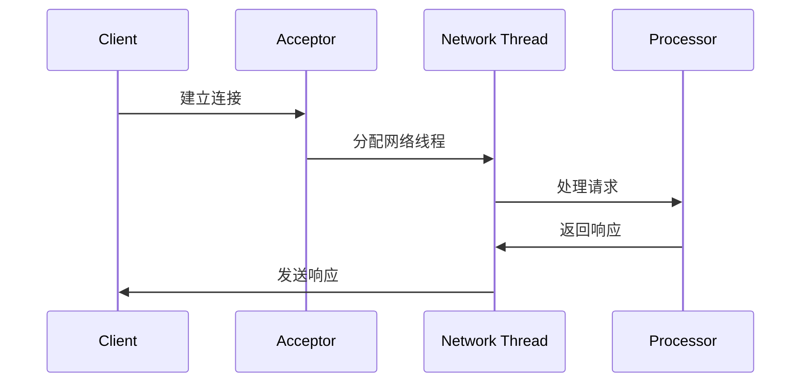
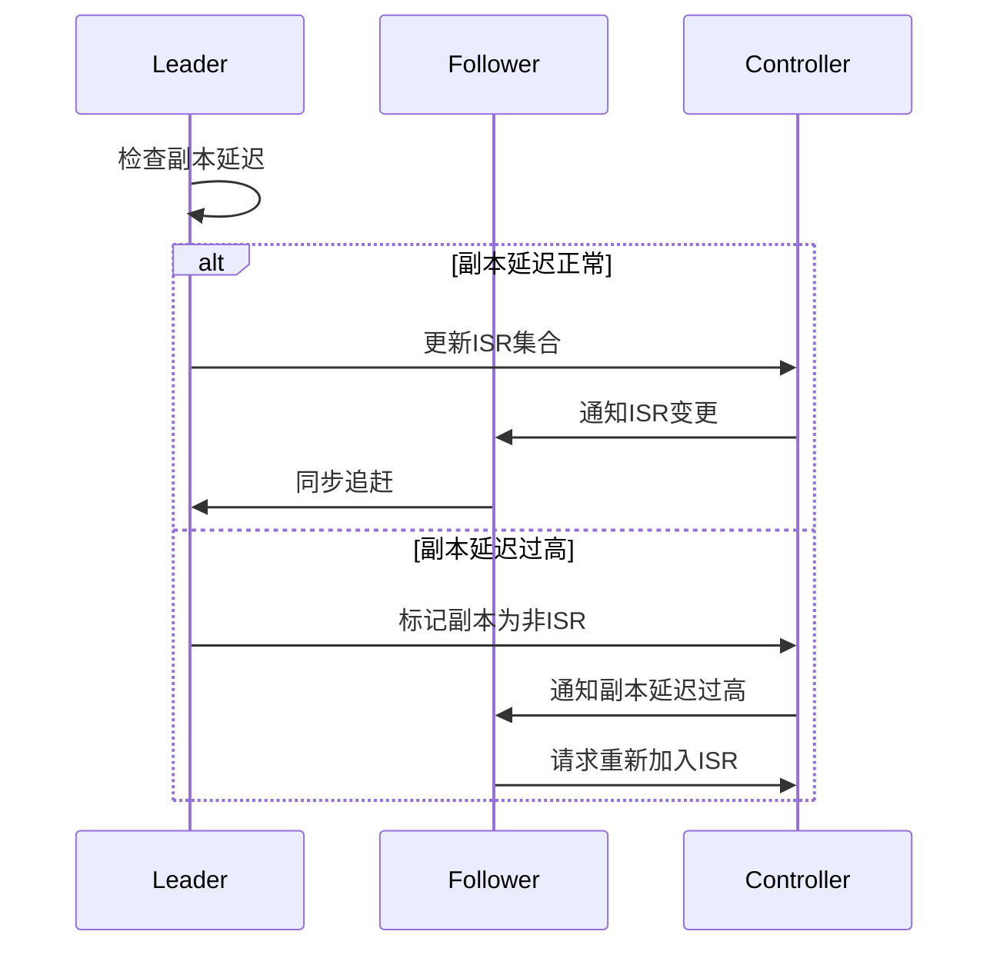

# Kafka Broker 性能优化详解

## 目录
- [1. 基础优化](#1-基础优化)
  - [1.1 Broker架构](#11-broker架构)
  - [1.2 关键参数](#12-关键参数)
  - [1.3 性能指标](#13-性能指标)
- [2. 存储优化](#2-存储优化)
  - [2.1 日志管理](#21-日志管理)
  - [2.2 磁盘性能](#22-磁盘性能)
  - [2.3 页缓存优化](#23-页缓存优化)
- [3. 网络优化](#3-网络优化)
  - [3.1 网络线程](#31-网络线程)
  - [3.2 请求处理](#32-请求处理)
  - [3.3 连接管理](#33-连接管理)
- [4. 副本管理优化](#4-副本管理优化)
  - [4.1 副本同步](#41-副本同步)
  - [4.2 Leader选举](#42-leader选举)
  - [4.3 ISR管理](#43-isr管理)
- [5. 监控与调优](#5-监控与调优)
  - [5.1 性能监控](#51-性能监控)
  - [5.2 资源调优](#52-资源调优)
  - [5.3 故障处理](#53-故障处理)

## 1. 基础优化

### 1.1 Broker架构


### 1.2 关键参数

基础配置示例：

```properties

# Broker基础配置
broker.id=0
num.network.threads=3
num.io.threads=8
socket.send.buffer.bytes=102400
socket.receive.buffer.bytes=102400
socket.request.max.bytes=104857600
log.dirs=/data/kafka-logs
num.partitions=1
num.recovery.threads.per.data.dir=1
```

### 1.3 性能指标



性能监控代码示例：

```java


public class BrokerMetrics {
    private final MetricRegistry metrics = new MetricRegistry();
    
    public void registerMetrics() {
        // 请求处理速率
        metrics.meter("request.total.time");
        
        // 活跃连接数
        metrics.gauge("active.connections", () -> 
            getActiveConnections());
            
        // 分区数量
        metrics.gauge("partition.count", () ->
            getPartitionCount());
            
        // 副本同步延迟
        metrics.histogram("replica.lag");
    }
}
```

## 2. 存储优化

### 2.1 日志管理



日志配置优化：

```properties


# 日志管理配置
log.segment.bytes=1073741824
log.retention.hours=168
log.retention.check.interval.ms=300000
log.cleaner.enable=true
log.cleaner.threads=1
log.cleaner.dedupe.buffer.size=134217728
```
当然可以！以下是对这些日志管理配置参数的分析：

```markdown:bagu/middlewares/kafka/kafka/details/kafka_broker_tuning.md
# 日志管理配置
log.segment.bytes=1073741824
log.retention.hours=168
log.retention.check.interval.ms=300000
log.cleaner.enable=true
log.cleaner.threads=1
log.cleaner.dedupe.buffer.size=134217728
```

1. **log.segment.bytes=1073741824**
   - **作用**：这个参数定义了每个日志段的大小，单位是字节。在这个例子中，设置为 1GB（1073741824 字节）。当日志文件达到这个大小时，Kafka 会创建一个新的日志段。合理的段大小可以提高性能，因为较小的段可以更快地被删除或压缩，而较大的段则可以减少文件系统的开销。

2. **log.retention.hours=168**
   - **作用**：这个参数指定了日志保留的时间，单位是小时。在这个例子中，设置为 168 小时（即 7 天）。这意味着 Kafka 会保留消息日志 7 天，超过这个时间的日志会被删除。这个设置有助于管理存储空间，确保旧数据不会无限制地占用磁盘。

3. **log.retention.check.interval.ms=300000**
   - **作用**：这个参数定义了 Kafka 检查日志保留策略的时间间隔，单位是毫秒。在这个例子中，设置为 300000 毫秒（即 5 分钟）。Kafka 会每 5 分钟检查一次，删除超过保留时间的日志段。这个设置可以影响日志清理的频率，较短的间隔可以更快地释放存储空间，但也会增加系统的负担。

4. **log.cleaner.enable=true**
   - **作用**：这个参数用于启用或禁用日志清理功能。当设置为 `true` 时，Kafka 会启用日志清理，允许对旧的日志段进行压缩和删除。日志清理是 Kafka 的一个重要特性，可以帮助管理存储，确保不必要的数据不会占用过多的空间。

5. **log.cleaner.threads=1**
   - **作用**：这个参数定义了用于执行日志清理的线程数。在这个例子中，设置为 1，意味着只有一个线程负责清理工作。根据系统的负载和性能需求，可以调整这个值以提高清理效率，但过多的线程可能会导致资源竞争。

6. **log.cleaner.dedupe.buffer.size=134217728**
   - **作用**：这个参数指定了日志清理器在去重过程中使用的缓冲区大小，单位是字节。在这个例子中，设置为 128MB（134217728 字节）。这个缓冲区用于存储待处理的日志数据，以便在清理过程中进行去重。合理的缓冲区大小可以提高清理效率，减少内存使用。

这些参数的合理配置可以显著提高 Kafka 的性能和存储管理能力，确保系统在高负载下仍能稳定运行。


### 2.2 磁盘性能

磁盘性能优化命令：

```properties
# 文件系统优化
# 禁用atime更新
mount -o noatime /dev/sda1 /data/kafka-logs

# IO调度器设置
echo deadline > /sys/block/sda/queue/scheduler

# 预读设置
blockdev --setra 16384 /dev/sda
```

### 2.3 页缓存优化


系统参数优化：

```properties

# 系统参数优化
vm.dirty_background_ratio=10
vm.dirty_ratio=20
vm.swappiness=1
vm.min_free_kbytes=1048576
```
当然可以！以下是对这些系统参数的详细分析：

````markdown:bagu/middlewares/kafka/kafka/details/kafka_broker_tuning.md
# 系统参数优化
vm.dirty_background_ratio=10
vm.dirty_ratio=20
vm.swappiness=1
vm.min_free_kbytes=1048576
````

1. **vm.dirty_background_ratio=10**
   - **作用**：这个参数定义了系统中脏页（dirty pages）占用内存的比例。当脏页的比例超过这个值时，内核会开始在后台进行写入操作，将脏页写入磁盘。这里设置为 10，表示当脏页占用内存的 10% 时，系统会开始进行写入。这有助于防止内存中的脏页过多，从而避免内存压力过大。

2. **vm.dirty_ratio=20**
   - **作用**：这个参数定义了系统中脏页占用内存的最大比例。当脏页的比例超过这个值时，系统会阻止新的写入操作，直到脏页被写入磁盘。设置为 20，表示脏页最多可以占用内存的 20%。这个设置可以防止系统因为脏页过多而导致的内存不足，从而影响系统的稳定性和性能。

3. **vm.swappiness=1**
   - **作用**：这个参数控制了系统在内存不足时使用交换空间（swap space）的倾向。值的范围是 0 到 100，值越低，表示系统越不倾向于使用交换空间。设置为 1，意味着系统在内存使用接近极限时，几乎不使用交换空间。这对于需要高性能的应用（如 Kafka）非常重要，因为使用交换空间会导致性能下降。

4. **vm.min_free_kbytes=1048576**
   - **作用**：这个参数定义了系统在内存中保留的最小空闲字节数。设置为 1048576 字节（即 1MB），表示系统会确保至少有 1MB 的内存是空闲的。这有助于防止系统在高负载时出现内存不足的情况，确保有足够的内存可供新进程或线程使用。

这些参数的合理配置可以显著提高系统的性能和稳定性，尤其是在高负载的情况下，确保 Kafka 等应用能够高效运行。


## 3. 网络优化

### 3.1 网络线程


网络配置优化：

```properties


# 网络相关配置
num.network.threads=8
num.io.threads=16
socket.send.buffer.bytes=102400
socket.receive.buffer.bytes=102400
socket.request.max.bytes=104857600
queued.max.requests=500
```

### 3.2 请求处理

请求处理优化代码示例：

```java


public class RequestHandler {
    private final int maxBatchSize;
    private final ExecutorService ioThreadPool;
    
    public void handleRequest(Request request) {
        // 请求验证
        validateRequest(request);
        
        // 批量处理
        if (request.canBatch()) {
            batchProcess(request);
        } else {
            singleProcess(request);
        }
    }
    
    private void batchProcess(Request request) {
        List<Future<?>> futures = new ArrayList<>();
        
        // 并行处理请求
        for (Operation op : request.getOperations()) {
            futures.add(ioThreadPool.submit(() -> {
                processOperation(op);
            }));
        }
        
        // 等待所有操作完成
        waitForCompletion(futures);
    }
}
```

### 3.3 连接管理



## 4. 副本管理优化

### 4.1 副本同步


副本同步配置：

```properties


# 副本同步配置
num.replica.fetchers=4
replica.fetch.min.bytes=1
replica.fetch.max.bytes=1048576
replica.fetch.wait.max.ms=500
replica.lag.time.max.ms=10000
```
1. **num.replica.fetchers=4**
   - **作用**：这个参数定义了用于从领导者副本拉取数据的副本获取器的数量。在这个例子中，设置为 4，意味着最多可以有 4 个副本获取器并行地从领导者副本拉取数据。增加这个值可以提高副本同步的吞吐量，尤其是在高负载情况下。

2. **replica.fetch.min.bytes=1**
   - **作用**：这个参数指定了副本获取器在拉取数据时，最小需要等待的数据量（以字节为单位）。在这个例子中，设置为 1，表示副本获取器会立即拉取数据，而不需要等待更多的数据到达。这有助于减少延迟，但可能会导致网络带宽的浪费。

3. **replica.fetch.max.bytes=1048576**
   - **作用**：这个参数定义了副本获取器每次从领导者副本拉取的最大字节数。在这个例子中，设置为 1048576 字节（即 1MB）。合理的设置可以确保副本获取器在拉取数据时不会过载，同时也能提高数据传输的效率。

4. **replica.fetch.wait.max.ms=500**
   - **作用**：这个参数指定了副本获取器在拉取数据时，最多等待的时间（以毫秒为单位）。在这个例子中，设置为 500 毫秒，表示副本获取器会在拉取数据时最多等待 500 毫秒，以便收集更多的数据。如果在这个时间内没有足够的数据到达，副本获取器将会继续拉取现有的数据。这有助于平衡延迟和吞吐量。

5. **replica.lag.time.max.ms=10000**
   - **作用**：这个参数定义了副本在同步过程中，允许的最大延迟时间（以毫秒为单位）。在这个例子中，设置为 10000 毫秒（即 10 秒）。如果副本的延迟超过这个时间，Kafka 将会将该副本标记为不在同步状态。这有助于确保数据的一致性和可靠性，防止过时的副本影响系统的整体性能。


### 4.2 Leader选举

Leader选举优化代码示例：

```java


public class LeaderElector {
    private final int minInsyncReplicas;
    
    public void electLeader(TopicPartition partition) {
        try {
            // 获取ISR集合
            Set<Integer> isr = getInSyncReplicas(partition);
            
            // 验证ISR数量
            if (isr.size() < minInsyncReplicas) {
                handleInsufficientReplicas(partition);
                return;
            }
            
            // 选择新Leader
            int newLeader = selectNewLeader(isr);
            
            // 更新分区元数据
            updatePartitionMetadata(partition, newLeader);
            
        } catch (Exception e) {
            handleElectionError(partition, e);
        }
    }
}
```

### 4.3 ISR管理


### 细化说明：

1. **检查副本延迟**：
   - Leader会定期检查所有Follower的延迟情况，以确保它们能够及时同步数据。

2. **副本延迟正常**：
   - 如果Follower的延迟在可接受范围内，Leader会更新ISR集合，确保所有在同步状态的副本都被记录。
   - Controller会接收到ISR集合的更新，并通知所有Follower，确保它们知道当前的ISR状态。
   - Follower会向Leader发送请求，进行数据同步，确保它们的数据与Leader保持一致。

3. **副本延迟过高**：
   - 如果某个Follower的延迟超过了预设的阈值，Leader会将该副本标记为非ISR，表示它不再处于同步状态。
   - Controller会通知该Follower其延迟过高，可能会影响数据一致性。
   - Follower在接收到通知后，可以请求重新加入ISR，以便重新开始同步过程。

通过这种细化，ISR管理流程的每个环节都得到了更清晰的描述，帮助理解Kafka在副本管理中的工作机制。


## 5. 监控与调优

### 5.1 性能监控

监控指标示例：

```java


public class BrokerMonitor {
    private final MetricRegistry metrics;
    
    public void monitorBrokerMetrics() {
        // 消息吞吐量
        metrics.meter("messages.in.rate");
        
        // 字节吞吐量
        metrics.meter("bytes.in.rate");
        metrics.meter("bytes.out.rate");
        
        // 请求队列
        metrics.gauge("request.queue.size", () ->
            getRequestQueueSize());
            
        // 副本延迟
        metrics.histogram("replica.lag.max");
        
        // 分区数
        metrics.gauge("partition.count", () ->
            getPartitionCount());
    }
}
```

### 5.2 资源调优

JVM优化配置：

```properties
# JVM调优参数
-Xms6g
-Xmx6g
-XX:MetaspaceSize=96m
-XX:+UseG1GC
-XX:MaxGCPauseMillis=20
-XX:InitiatingHeapOccupancyPercent=35
-XX:G1HeapRegionSize=16M
-XX:MinMetaspaceFreeRatio=50
-XX:MaxMetaspaceFreeRatio=80
```

1. **-Xms6g**
   - **作用**：设置JVM初始堆内存大小为6GB。这个参数决定了JVM启动时分配的内存量，确保在应用启动时有足够的内存可用。

2. **-Xmx6g**
   - **作用**：设置JVM最大堆内存大小为6GB。这个参数限制了JVM可以使用的最大内存量，防止应用程序消耗过多的内存，导致系统不稳定。

3. **-XX:MetaspaceSize=96m**
   - **作用**：设置Metaspace的初始大小为96MB。Metaspace用于存储类的元数据，合理配置可以提高类加载性能。

4. **-XX:+UseG1GC**
   - **作用**：启用G1垃圾回收器（Garbage-First Garbage Collector）。G1 GC适合大内存应用，能够在低延迟的情况下进行高效的垃圾回收。

5. **-XX:MaxGCPauseMillis=20**
   - **作用**：设置最大垃圾回收暂停时间为20毫秒。这个参数帮助G1 GC在进行垃圾回收时尽量控制停顿时间，适合对延迟敏感的应用。

6. **-XX:InitiatingHeapOccupancyPercent=35**
   - **作用**：设置堆内存占用达到35%时，开始进行并发标记阶段的垃圾回收。这个参数可以帮助提前触发垃圾回收，避免内存使用过高。

7. **-XX:G1HeapRegionSize=16M**
   - **作用**：设置G1 GC的堆区域大小为16MB。G1 GC将堆划分为多个区域，合理的区域大小可以提高垃圾回收的效率。

8. **-XX:MinMetaspaceFreeRatio=50**
   - **作用**：设置Metaspace中最小空闲比例为50%。当Metaspace的使用率超过这个比例时，JVM会尝试扩展Metaspace，以避免类加载失败。

9. **-XX:MaxMetaspaceFreeRatio=80**
   - **作用**：设置Metaspace中最大空闲比例为80%。当Metaspace的空闲比例超过这个值时，JVM会尝试缩减Metaspace的大小，以释放内存。

这些参数的合理配置可以显著提高JVM的性能，确保Kafka在高负载情况下能够稳定运行。

### 5.3 故障处理


## 最佳实践建议

1. **存储优化建议**
   - 使用高性能磁盘
   - 合理配置日志保留
   - 优化文件系统
   - 监控磁盘使用

2. **网络优化建议**
   - 调整网络线程数
   - 优化TCP参数
   - 控制请求大小
   - 监控网络延迟

3. **副本管理建议**
   - 合理设置副本数
   - 优化同步策略
   - 监控副本延迟
   - 及时处理异常

4. **监控调优建议**
   - 全面监控指标
   - 设置告警阈值
   - 定期性能评估
   - 持续优化改进
```


