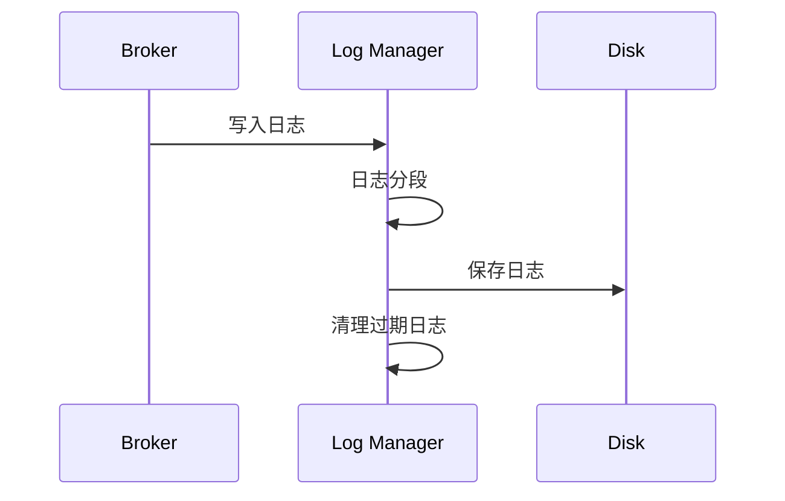
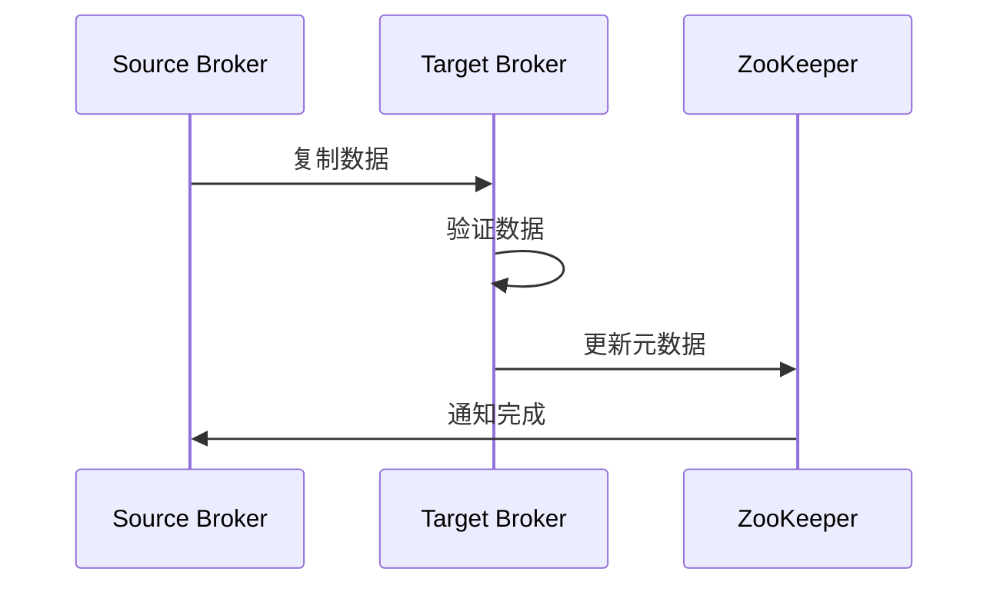

# Kafka 集群运维管理详解

## 目录
- [1. 集群部署](#1-集群部署)
  - [1.1 环境准备](#11-环境准备)
  - [1.2 安装配置](#12-安装配置)
  - [1.3 集群规划](#13-集群规划)
- [2. 日常运维](#2-日常运维)
  - [2.1 监控管理](#21-监控管理)
  - [2.2 日志管理](#22-日志管理)
  - [2.3 配置管理](#23-配置管理)
- [3. 扩容与缩容](#3-扩容与缩容)
  - [3.1 Broker管理](#31-broker管理)
  - [3.2 分区管理](#32-分区管理)
  - [3.3 数据迁移](#33-数据迁移)
- [4. 故障处理](#4-故障处理)
  - [4.1 故障检测](#41-故障检测)
  - [4.2 故障恢复](#42-故障恢复)
  - [4.3 数据修复](#43-数据修复)
- [5. 安全管理](#5-安全管理)
  - [5.1 认证授权](#51-认证授权)
  - [5.2 加密传输](#52-加密传输)
  - [5.3 审计日志](#53-审计日志)

## 1. 集群部署

### 1.1 环境准备


系统配置优化：

```bash
# 系统参数优化
cat >> /etc/sysctl.conf << EOF
net.ipv4.tcp_fin_timeout = 30
net.ipv4.tcp_keepalive_time = 300
net.ipv4.tcp_max_syn_backlog = 8192
net.ipv4.tcp_max_tw_buckets = 5000
vm.swappiness = 1
EOF

# 应用系统参数
sysctl -p

# 文件描述符配置
cat >> /etc/security/limits.conf << EOF
* soft nofile 65536
* hard nofile 65536
* soft nproc 32768
* hard nproc 32768
EOF
```

### 1.2 安装配置

基础配置示例：

```properties
# server.properties
broker.id=0
listeners=PLAINTEXT://192.168.1.100:9092
num.network.threads=3
num.io.threads=8
socket.send.buffer.bytes=102400
socket.receive.buffer.bytes=102400
socket.request.max.bytes=104857600
log.dirs=/data/kafka-logs
num.partitions=3
num.recovery.threads.per.data.dir=1
offsets.topic.replication.factor=3
transaction.state.log.replication.factor=3
transaction.state.log.min.isr=2
log.retention.hours=168
log.segment.bytes=1073741824
log.retention.check.interval.ms=300000
zookeeper.connect=192.168.1.101:2181,192.168.1.102:2181,192.168.1.103:2181
```

### 1.3 集群规划


## 2. 日常运维

### 2.1 监控管理

监控系统实现：

```java
public class ClusterMonitor {
    private final MetricRegistry metrics;
    private final AlertService alertService;
    
    public void monitorClusterHealth() {
        // 监控Broker存活
        metrics.gauge("broker.live.count", () ->
            getAliveBrokerCount());
            
        // 监控分区状态
        metrics.gauge("under.replicated.partitions", () ->
            getUnderReplicatedPartitions());
            
        // 监控Controller状态
        metrics.gauge("active.controller.count", () ->
            getActiveControllerCount());
            
        // 监控消费组状态
        metrics.gauge("consumer.group.lag", () ->
            getConsumerGroupLag());
    }
    
    private void handleAlert(Alert alert) {
        alertService.sendAlert(alert);
        logAlert(alert);
    }
}
```

### 2.2 日志管理



日志清理脚本：

```bash
#!/bin/bash
# 日志清理脚本

# 设置日志保留天数
RETENTION_DAYS=7

# 清理系统日志
find /var/log/kafka -name "*.log" -mtime +$RETENTION_DAYS -exec rm -f {} \;

# 清理GC日志
find /var/log/kafka -name "gc.log.*" -mtime +$RETENTION_DAYS -exec rm -f {} \;

# 压缩保留的日志
find /var/log/kafka -name "*.log" -mtime +1 -exec gzip {} \;
```

### 2.3 配置管理

配置管理工具示例：

```java
public class ConfigManager {
    private final AdminClient adminClient;
    private final Properties defaultConfig;
    
    public void updateBrokerConfig(int brokerId, Map<String, String> updates) {
        try {
            Collection<AlterConfigOp> configOps = updates.entrySet().stream()
                .map(entry -> new AlterConfigOp(
                    new ConfigEntry(entry.getKey(), entry.getValue()),
                    AlterConfigOp.OpType.SET
                ))
                .collect(Collectors.toList());
                
            adminClient.incrementalAlterConfigs(
                Collections.singletonMap(
                    new ConfigResource(ConfigResource.Type.BROKER, String.valueOf(brokerId)),
                    configOps
                )
            ).all().get();
            
        } catch (Exception e) {
            handleConfigUpdateError(brokerId, updates, e);
        }
    }
}
```

## 3. 扩容与缩容

### 3.1 Broker管理


Broker扩容脚本：

```bash
#!/bin/bash
# Broker扩容脚本

# 新Broker配置
NEW_BROKER_ID=$1
NEW_BROKER_HOST=$2
NEW_BROKER_PORT=$3

# 生成配置文件
cat > config/server.properties << EOF
broker.id=$NEW_BROKER_ID
listeners=PLAINTEXT://$NEW_BROKER_HOST:$NEW_BROKER_PORT
log.dirs=/data/kafka-logs
zookeeper.connect=zk1:2181,zk2:2181,zk3:2181
EOF

# 启动新Broker
bin/kafka-server-start.sh -daemon config/server.properties

# 等待Broker启动
sleep 30

# 触发分区重分配
bin/kafka-reassign-partitions.sh --bootstrap-server localhost:9092 \
    --reassignment-json-file expand-cluster-reassignment.json \
    --execute
```

### 3.2 分区管理

分区重分配工具：

```java
public class PartitionReassignmentTool {
    private final AdminClient adminClient;
    
    public void reassignPartitions(Map<TopicPartition, List<Integer>> reassignments) {
        try {
            // 创建重分配计划
            Map<TopicPartition, Optional<NewPartitionReassignment>> newAssignments =
                reassignments.entrySet().stream()
                    .collect(Collectors.toMap(
                        Map.Entry::getKey,
                        e -> Optional.of(new NewPartitionReassignment(e.getValue()))
                    ));
            
            // 执行重分配
            adminClient.alterPartitionReassignments(newAssignments).all().get();
            
            // 监控重分配进度
            monitorReassignmentProgress(reassignments.keySet());
            
        } catch (Exception e) {
            handleReassignmentError(reassignments, e);
        }
    }
}
```

### 3.3 数据迁移



## 4. 故障处理

### 4.1 故障检测

故障检测系统：

```java
public class FaultDetector {
    private final KafkaCluster cluster;
    private final AlertService alertService;
    
    public void detectFaults() {
        // 检查Broker状态
        checkBrokerHealth();
        
        // 检查分区状态
        checkPartitionHealth();
        
        // 检查副本同步状态
        checkReplicaSync();
        
        // 检查Controller状态
        checkControllerHealth();
    }
    
    private void checkBrokerHealth() {
        cluster.getBrokers().forEach(broker -> {
            if (!broker.isAlive()) {
                handleBrokerFailure(broker);
            }
        });
    }
}
```

### 4.2 故障恢复


### 4.3 数据修复

数据修复工具：

```java
public class DataRepairTool {
    private final KafkaConsumer<byte[], byte[]> consumer;
    private final KafkaProducer<byte[], byte[]> producer;
    
    public void repairData(TopicPartition partition, long startOffset, long endOffset) {
        try {
            // 设置消费起始位置
            consumer.assign(Collections.singleton(partition));
            consumer.seek(partition, startOffset);
            
            // 读取并重写数据
            while (consumer.position(partition) < endOffset) {
                ConsumerRecords<byte[], byte[]> records = consumer.poll(Duration.ofSeconds(1));
                for (ConsumerRecord<byte[], byte[]> record : records) {
                    producer.send(new ProducerRecord<>(
                        partition.topic(),
                        partition.partition(),
                        record.key(),
                        record.value()
                    ));
                }
            }
        } catch (Exception e) {
            handleRepairError(partition, startOffset, endOffset, e);
        }
    }
}
```

## 5. 安全管理

### 5.1 认证授权

SASL配置示例：

```properties
# SASL配置
security.protocol=SASL_PLAINTEXT
sasl.mechanism=PLAIN
sasl.jaas.config=org.apache.kafka.common.security.plain.PlainLoginModule required \
    username="admin" \
    password="admin-secret";
```

ACL管理脚本：

```bash
#!/bin/bash
# ACL管理脚本

# 添加ACL
bin/kafka-acls.sh --bootstrap-server localhost:9092 \
    --add --allow-principal User:Bob \
    --operation Read --operation Write \
    --topic test-topic

# 列出ACL
bin/kafka-acls.sh --bootstrap-server localhost:9092 \
    --list

# 删除ACL
bin/kafka-acls.sh --bootstrap-server localhost:9092 \
    --remove --allow-principal User:Bob \
    --operation Read --operation Write \
    --topic test-topic
```

### 5.2 加密传输

SSL配置示例：

```properties
# SSL配置
security.protocol=SSL
ssl.keystore.location=/path/to/kafka.server.keystore.jks
ssl.keystore.password=test1234
ssl.key.password=test1234
ssl.truststore.location=/path/to/kafka.server.truststore.jks
ssl.truststore.password=test1234
ssl.client.auth=required
```

### 5.3 审计日志

审计日志配置：

```properties
# 审计日志配置
audit.logs.enabled=true
audit.logs.destination=FILE
audit.logs.path=/var/log/kafka/audit.log
audit.logs.max.size=100MB
audit.logs.max.backup.index=10
```

## 最佳实践建议

1. **部署建议**
   - 合理规划硬件资源
   - 优化系统配置
   - 实施监控告警
   - 做好备份方案

2. **运维建议**
   - 制定运维规范
   - 自动化运维任务
   - 定期进行演练
   - 做好变更管理

3. **安全建议**
   - 实施最小权限
   - 加密敏感数据
   - 定期安全审计
   - 及时更新补丁

4. **故障处理建议**
   - 建立应急预案
   - 快速故障定位
   - 及时故障恢复
   - 总结改进措施
```

