# Kafka 核心组件详解

## 目录
- [1. Producer（生产者）详解](#1-producer生产者详解)
  - [1.1 生产者架构](#11-生产者架构)
  - [1.2 发送流程](#12-发送流程)
  - [1.3 分区策略](#13-分区策略)
  - [1.4 可靠性机制](#14-可靠性机制)
- [2. Consumer（消费者）详解](#2-consumer消费者详解)
  - [2.1 消费者架构](#21-消费者架构)
  - [2.2 消费流程](#22-消费流程)
  - [2.3 消费者组机制](#23-消费者组机制)
  - [2.4 位移管理](#24-位移管理)
- [3. Broker 管理机制](#3-broker-管理机制)
  - [3.1 请求处理](#31-请求处理)
  - [3.2 副本管理](#32-副本管理)
  - [3.3 日志管理](#33-日志管理)
- [4. Topic & Partition](#4-topic--partition)
  - [4.1 主题管理](#41-主题管理)
  - [4.2 分区管理](#42-分区管理)
  - [4.3 日志存储](#43-日志存储)
- [5. 副本机制详解](#5-副本机制详解)
  - [5.1 副本同步](#51-副本同步)
  - [5.2 Leader 选举](#52-leader-选举)
  - [5.3 故障恢复](#53-故障恢复)

## 1. Producer（生产者）详解

### 1.1 生产者架构

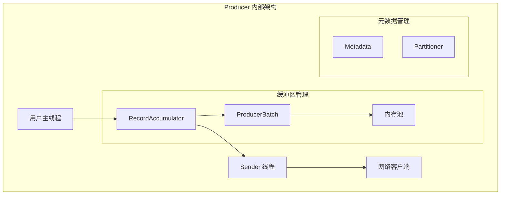

核心组件说明：
1. **RecordAccumulator（消息累加器）**
   - 缓存消息
   - 实现批量发送
   - 内存管理

2. **Sender 线程**
   - 发送消息批次
   - 处理响应
   - 管理连接

### 1.2 发送流程

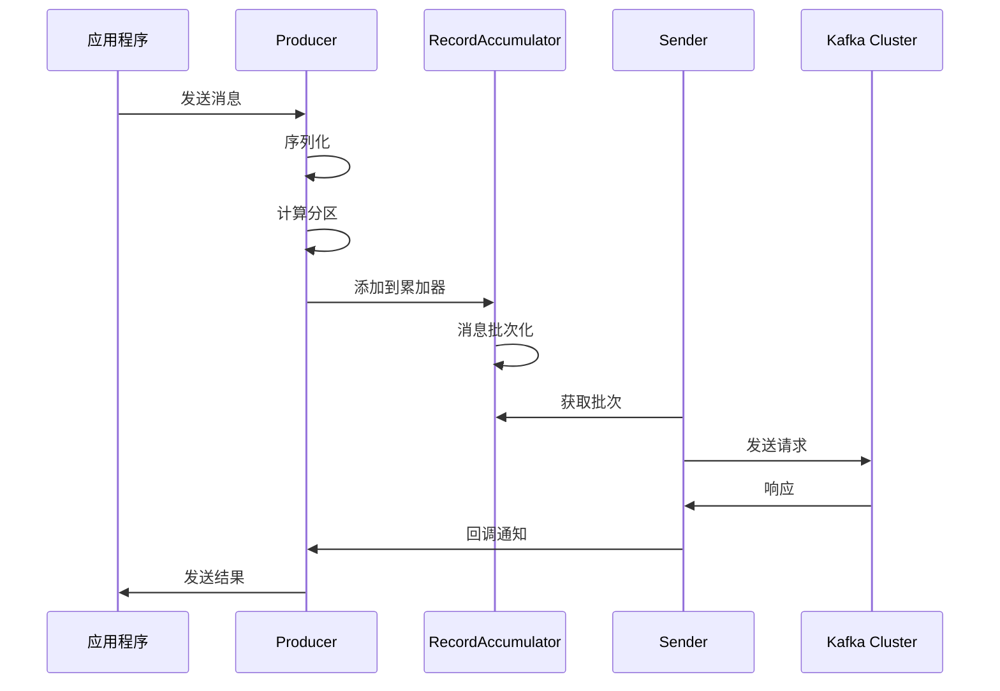

代码示例：
```java
// 生产者配置
Properties props = new Properties();
props.put(ProducerConfig.BOOTSTRAP_SERVERS_CONFIG, "localhost:9092");
props.put(ProducerConfig.KEY_SERIALIZER_CLASS_CONFIG, 
    "org.apache.kafka.common.serialization.StringSerializer");
props.put(ProducerConfig.VALUE_SERIALIZER_CLASS_CONFIG, 
    "org.apache.kafka.common.serialization.StringSerializer");
props.put(ProducerConfig.ACKS_CONFIG, "all");
props.put(ProducerConfig.RETRIES_CONFIG, 3);
props.put(ProducerConfig.BATCH_SIZE_CONFIG, 16384);
props.put(ProducerConfig.LINGER_MS_CONFIG, 1);
props.put(ProducerConfig.BUFFER_MEMORY_CONFIG, 33554432);

// 创建生产者实例
Producer<String, String> producer = new KafkaProducer<>(props);

// 发送消息
producer.send(new ProducerRecord<>("my-topic", "key", "value"), 
    (metadata, exception) -> {
        if (exception == null) {
            System.out.printf("Topic: %s, Partition: %d, Offset: %d%n",
                metadata.topic(), metadata.partition(), metadata.offset());
        } else {
            exception.printStackTrace();
        }
    });
```

### 1.3 分区策略

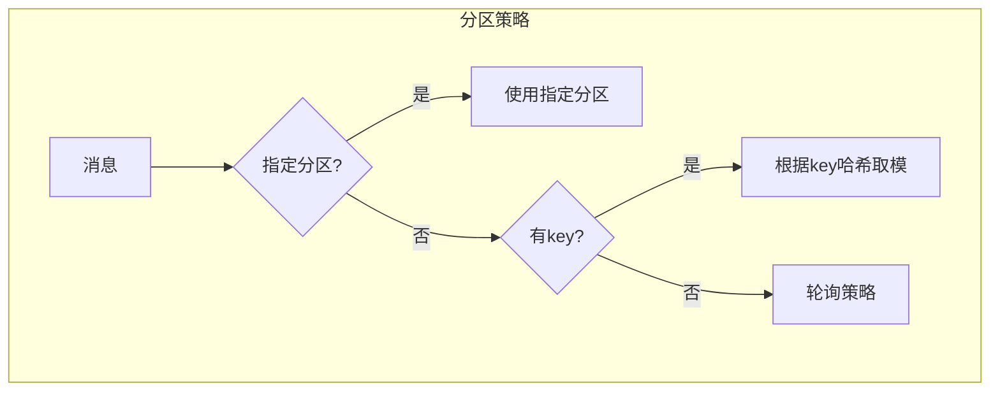

自定义分区器示例：
```java
public class CustomPartitioner implements Partitioner {
    @Override
    public int partition(String topic, Object key, byte[] keyBytes,
                        Object value, byte[] valueBytes, Cluster cluster) {
        List<PartitionInfo> partitions = cluster.partitionsForTopic(topic);
        int numPartitions = partitions.size();
        
        // 自定义分区逻辑
        if (keyBytes == null) {
            Random random = new Random();
            return random.nextInt(numPartitions);
        }
        // 基于 key 的哈希值计算分区
        return Math.abs(Utils.murmur2(keyBytes)) % numPartitions;
    }

    @Override
    public void close() {}

    @Override
    public void configure(Map<String, ?> configs) {}
}
```

### 1.4 可靠性机制

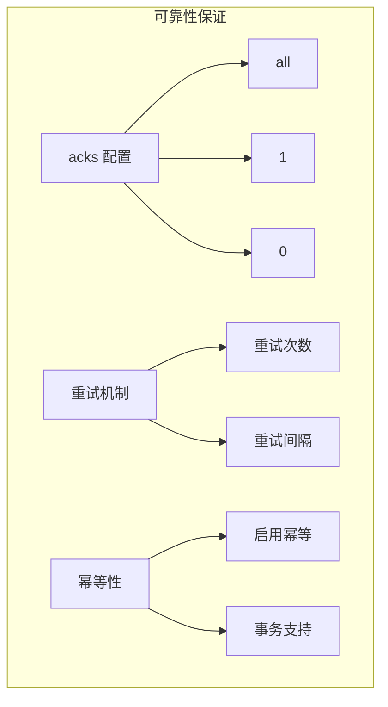

关键配置：
```properties
# 可靠性相关配置
acks=all
retries=3
retry.backoff.ms=100
enable.idempotence=true
transactional.id=my-transactional-id
```

事务示例：
```java
producer.initTransactions();
try {
    producer.beginTransaction();
    // 发送消息
    producer.send(record1);
    producer.send(record2);
    // 提交事务
    producer.commitTransaction();
} catch (Exception e) {
    // 终止事务
    producer.abortTransaction();
} finally {
    producer.close();
}
```

## 2. Consumer（消费者）详解

### 2.1 消费者架构

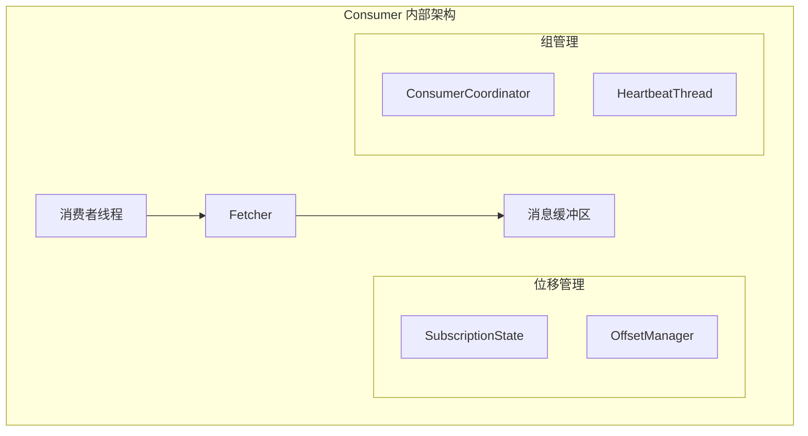

### 2.2 消费流程

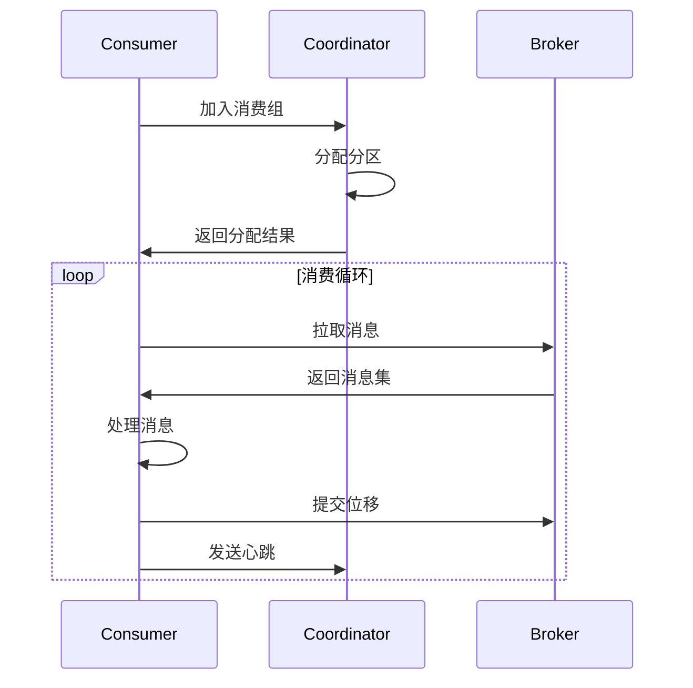

消费者示例代码：
```java
Properties props = new Properties();
props.put(ConsumerConfig.BOOTSTRAP_SERVERS_CONFIG, "localhost:9092");
props.put(ConsumerConfig.GROUP_ID_CONFIG, "my-group");
props.put(ConsumerConfig.KEY_DESERIALIZER_CLASS_CONFIG, 
    "org.apache.kafka.common.serialization.StringDeserializer");
props.put(ConsumerConfig.VALUE_DESERIALIZER_CLASS_CONFIG, 
    "org.apache.kafka.common.serialization.StringDeserializer");
props.put(ConsumerConfig.AUTO_OFFSET_RESET_CONFIG, "earliest");
props.put(ConsumerConfig.ENABLE_AUTO_COMMIT_CONFIG, "false");

KafkaConsumer<String, String> consumer = new KafkaConsumer<>(props);
consumer.subscribe(Arrays.asList("my-topic"));

try {
    while (true) {
        ConsumerRecords<String, String> records = consumer.poll(Duration.ofMillis(100));
        for (ConsumerRecord<String, String> record : records) {
            // 处理消息
            System.out.printf("offset = %d, key = %s, value = %s%n", 
                record.offset(), record.key(), record.value());
        }
        // 手动提交位移
        consumer.commitSync();
    }
} finally {
    consumer.close();
}
```

### 2.3 消费者组机制

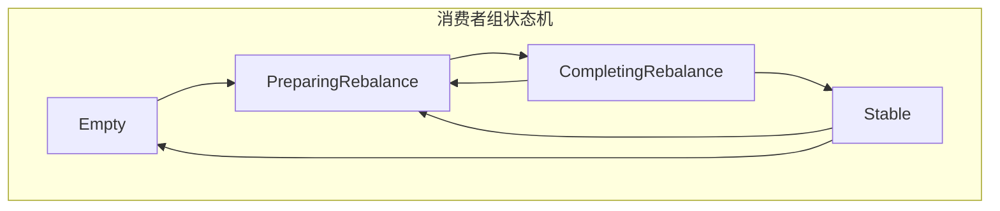

重平衡流程：
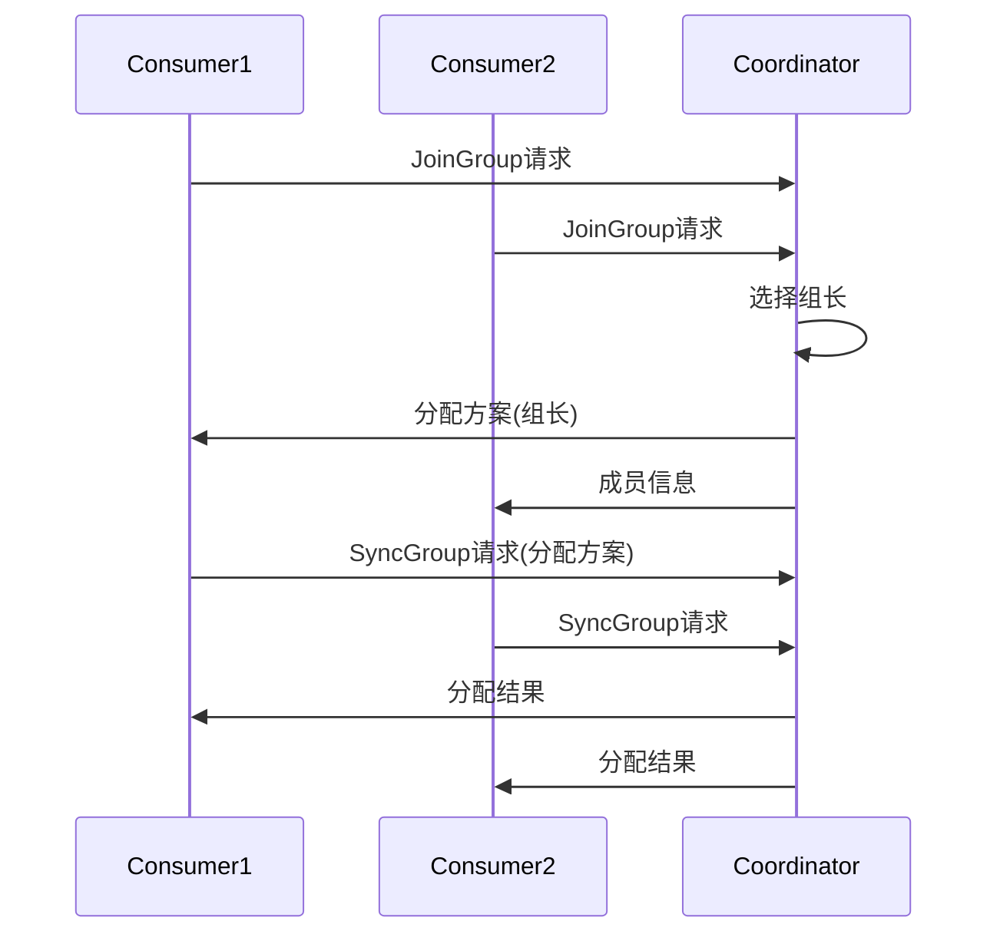

### 2.4 位移管理

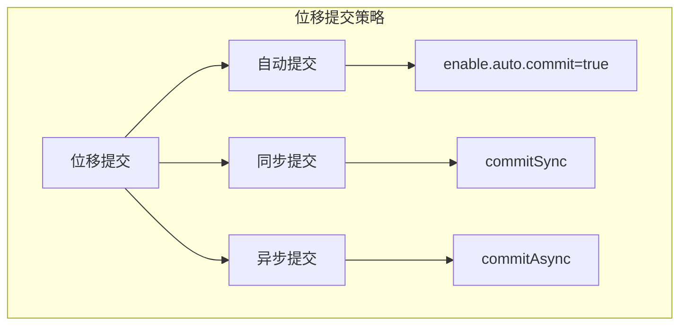

位移提交示例：
```java
// 同步提交
public void commitSyncExample(KafkaConsumer<String, String> consumer) {
    while (true) {
        ConsumerRecords<String, String> records = consumer.poll(Duration.ofMillis(100));
        for (ConsumerRecord<String, String> record : records) {
            // 处理消息
        }
        try {
            consumer.commitSync();
        } catch (CommitFailedException e) {
            log.error("Commit failed", e);
        }
    }
}

// 异步提交
public void commitAsyncExample(KafkaConsumer<String, String> consumer) {
    consumer.commitAsync((offsets, exception) -> {
        if (exception != null) {
            log.error("Commit failed for offsets {}", offsets, exception);
        }
    });
}
```

## 3. Broker 管理机制

### 3.1 请求处理

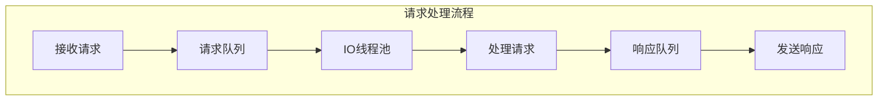

关键配置：
```properties
# 网络线程数
num.network.threads=3
# IO线程数
num.io.threads=8
# 请求队列大小
queued.max.requests=500
# Socket配置
socket.send.buffer.bytes=102400
socket.receive.buffer.bytes=102400
```

### 3.2 副本管理

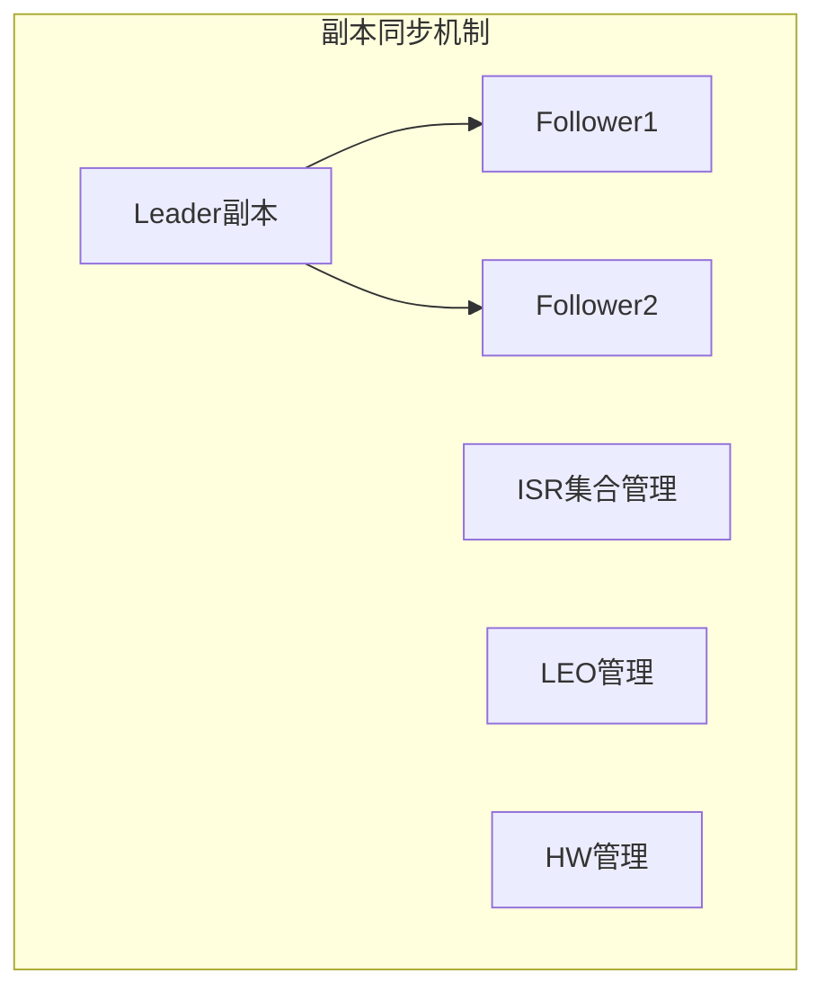

副本配置示例：
```properties
# 副本相关配置
replica.lag.time.max.ms=10000
replica.fetch.min.bytes=1
replica.fetch.max.bytes=1048576
replica.fetch.wait.max.ms=500
```

### 3.3 日志管理

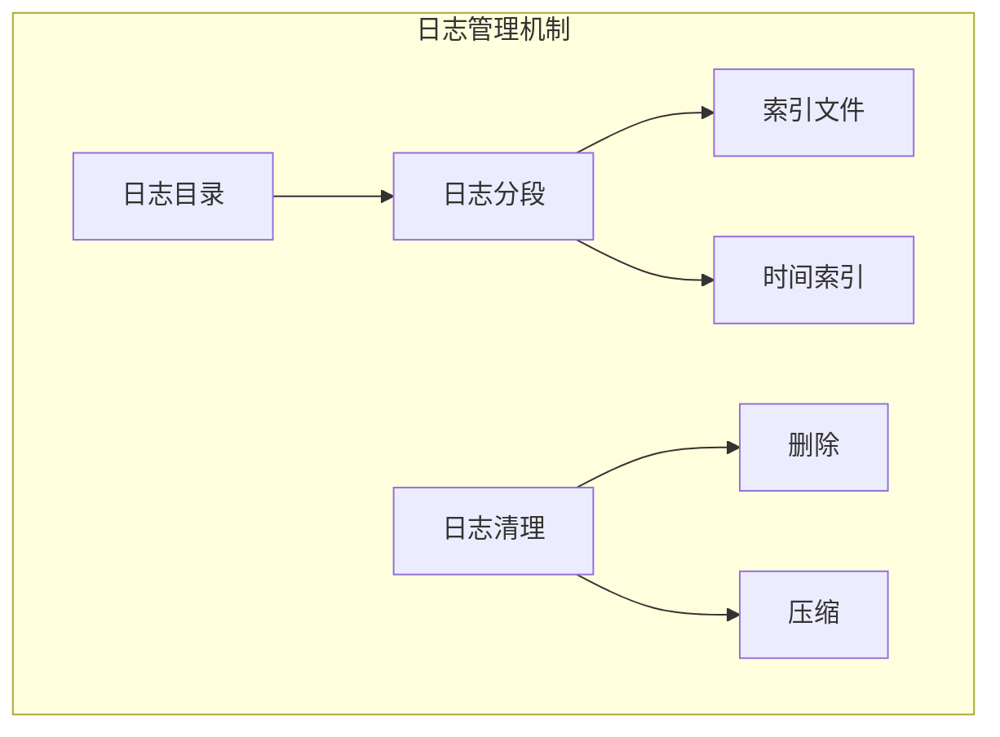

## 4. Topic & Partition

### 4.1 主题管理

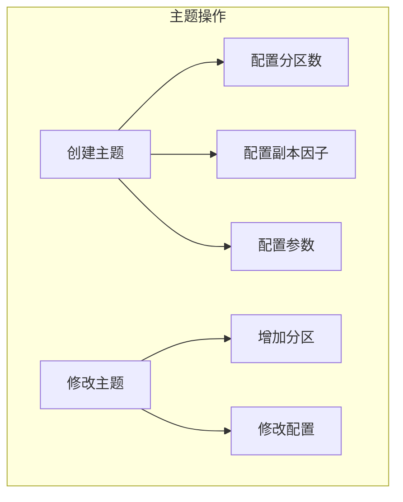

主题管理命令：
```bash
# 创建主题
bin/kafka-topics.sh --create \
    --bootstrap-server localhost:9092 \
    --replication-factor 3 \
    --partitions 6 \
    --topic my-topic \
    --config retention.ms=86400000

# 查看主题
bin/kafka-topics.sh --describe \
    --bootstrap-server localhost:9092 \
    --topic my-topic

# 修改主题
bin/kafka-topics.sh --alter \
    --bootstrap-server localhost:9092 \
    --topic my-topic \
    --partitions 8
```

### 4.2 分区管理

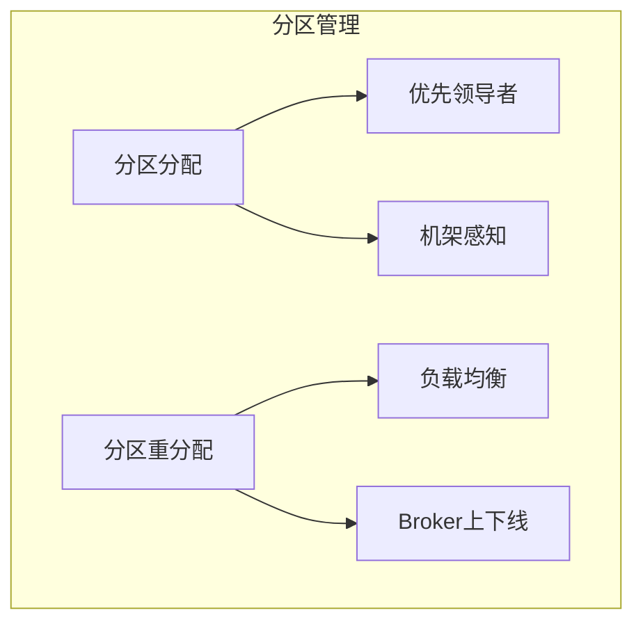

分区重分配示例：
```json
{
    "version": 1,
    "partitions": [
        {
            "topic": "my-topic",
            "partition": 0,
            "replicas": [0,1,2]
        }
    ]
}
```

```bash
# 执行分区重分配
bin/kafka-reassign-partitions.sh \
    --bootstrap-server localhost:9092 \
    --reassignment-json-file reassign.json \
    --execute
```

## 5. 副本机制详解

### 5.1 副本同步

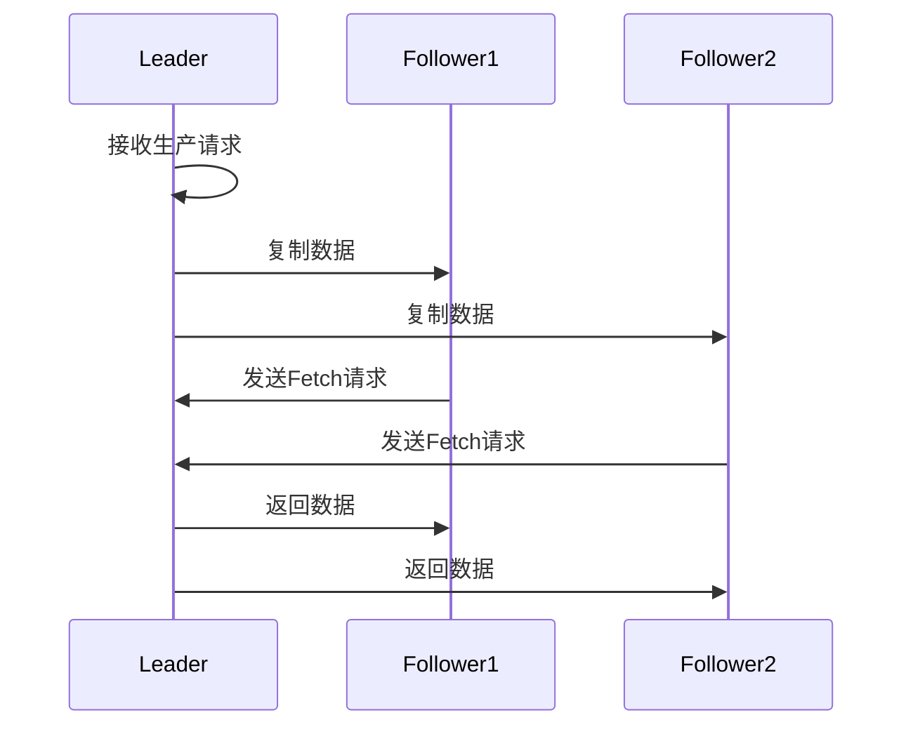

### 5.2 Leader 选举

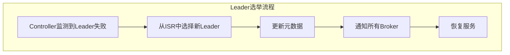

### 5.3 故障恢复

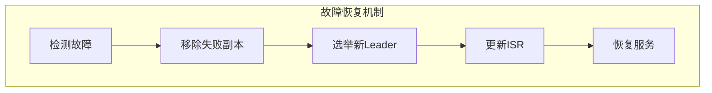

故障恢复配置：
```properties
# 故障检测相关配置
replica.lag.time.max.ms=30000
min.insync.replicas=2
unclean.leader.election.enable=false
```

## 最佳实践建议

1. **生产者最佳实践**
   - 合理配置批量大小和等待时间
   - 启用压缩
   - 适当的重试策略
   - 考虑使用异步发送

2. **消费者最佳实践**
   - 合理的消费者数量
   - 手动提交位移
   - 合理的拉取大小
   - 异常处理机制

3. **主题设计建议**
   - 合理的分区数
   - 适当的副本因子
   - 注意分区分配均衡
   - 定期检查主题配置

4. **监控指标**
   - 生产者监控：发送成功率、延迟
   - 消费者监控：消费延迟、重平衡次数
   - Broker监控：磁盘使用率、网络流量
   - 主题监控：消息数量、分区分布
```

