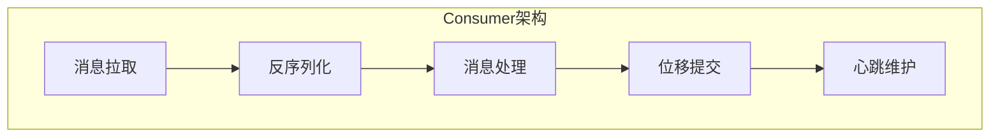
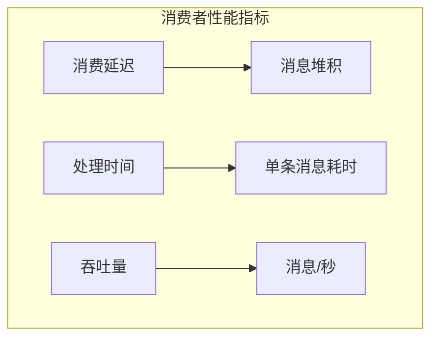
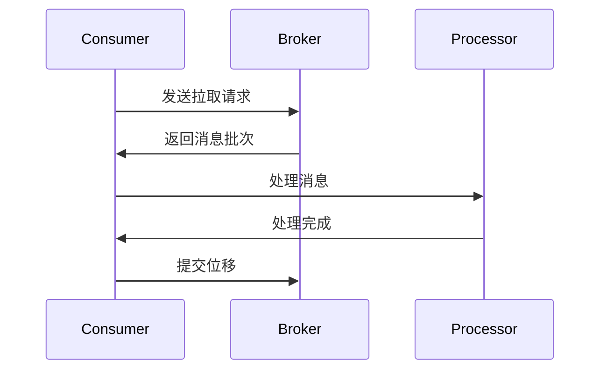
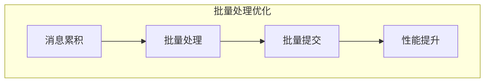
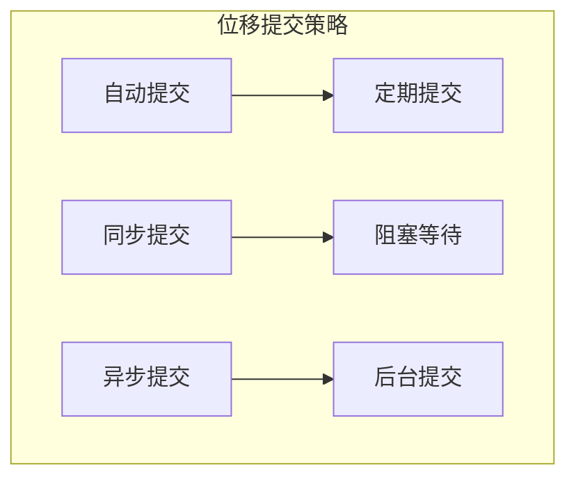
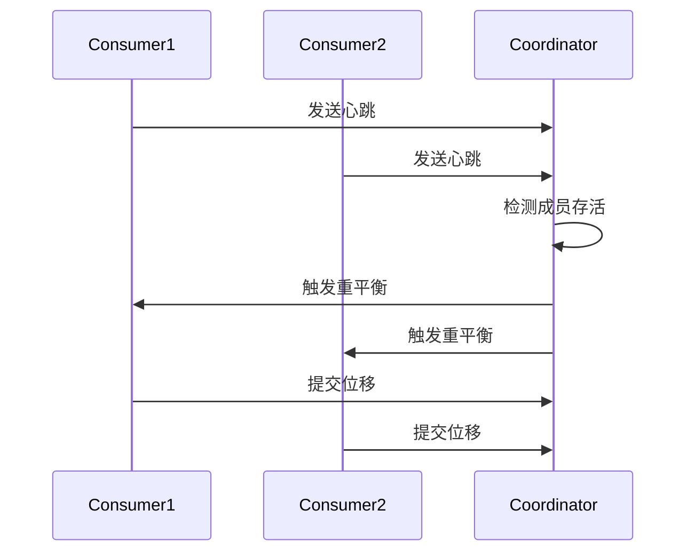
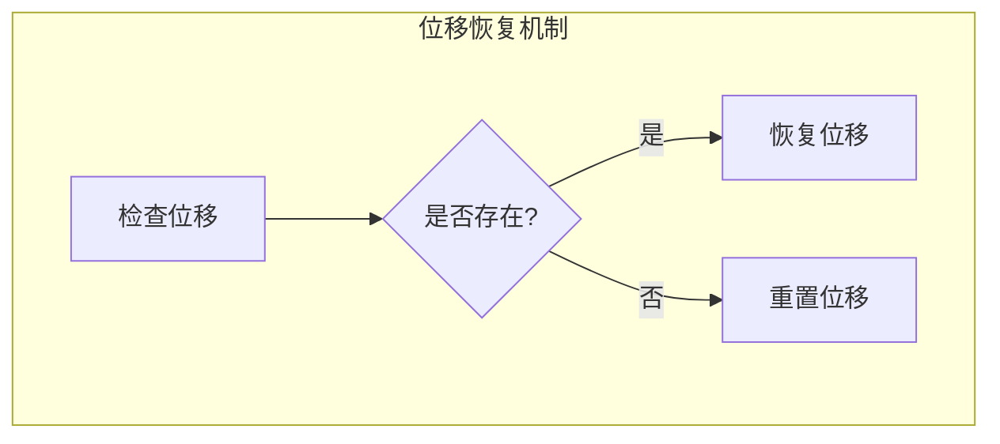
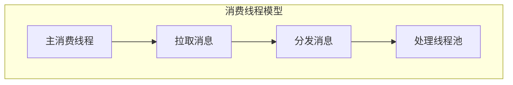
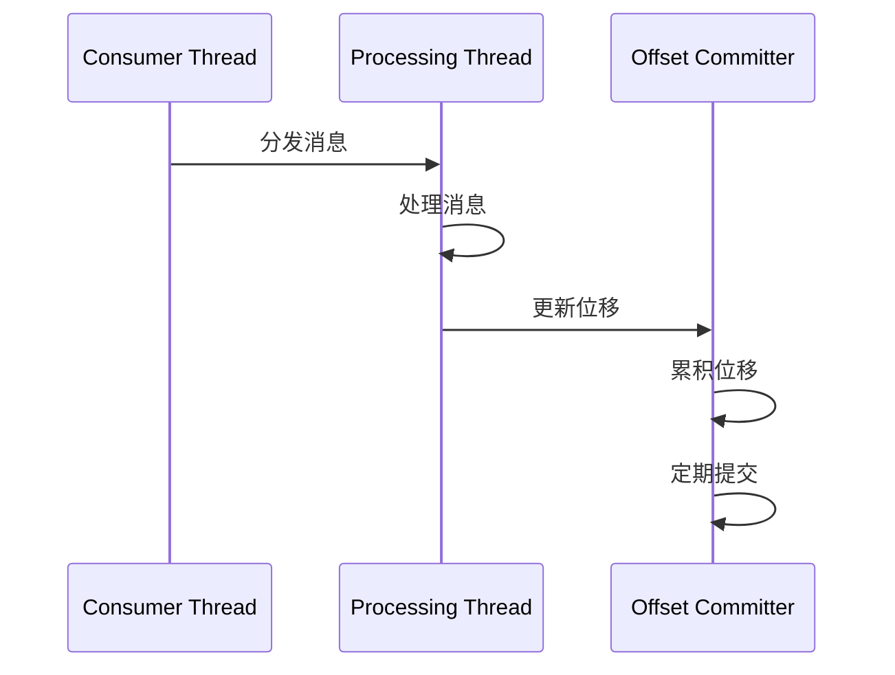
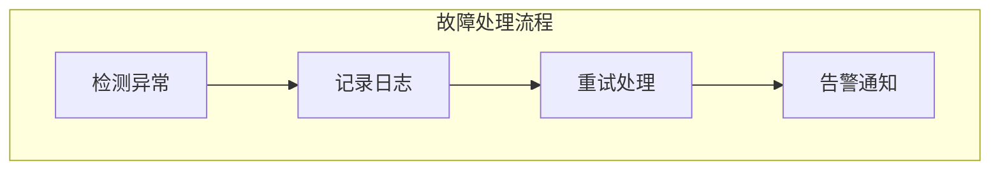

# Kafka 消费者性能优化详解

## 目录
- [1. 基础优化](#1-基础优化)
  - [1.1 消费者架构](#11-消费者架构)
  - [1.2 关键参数](#12-关键参数)
  - [1.3 性能指标](#13-性能指标)
- [2. 消费模型优化](#2-消费模型优化)
  - [2.1 拉取策略](#21-拉取策略)
  - [2.2 批量处理](#22-批量处理)
  - [2.3 并行处理](#23-并行处理)
- [3. 位移管理优化](#3-位移管理优化)
  - [3.1 提交策略](#31-提交策略)
  - [3.2 重平衡优化](#32-重平衡优化)
  - [3.3 位移恢复](#33-位移恢复)
- [4. 线程模型优化](#4-线程模型优化)
  - [4.1 消费线程](#41-消费线程)
  - [4.2 处理线程](#42-处理线程)
  - [4.3 提交线程](#43-提交线程)
- [5. 监控与调优](#5-监控与调优)
  - [5.1 性能监控](#51-性能监控)
  - [5.2 资源调优](#52-资源调优)
  - [5.3 故障处理](#53-故障处理)

## 1. 基础优化

### 1.1 消费者架构



### 1.2 关键参数

基础配置示例：

```properties
# 基础优化配置
bootstrap.servers=localhost:9092
group.id=my-group
enable.auto.commit=false
auto.offset.reset=earliest
max.poll.records=500
fetch.min.bytes=1
fetch.max.bytes=52428800
fetch.max.wait.ms=500
max.partition.fetch.bytes=1048576
```

### 1.3 性能指标



性能监控代码示例：

```java
public class ConsumerMetrics {
    private final MetricRegistry metrics = new MetricRegistry();
    private final Timer processLatency = metrics.timer("consumer.process.latency");
    private final Meter throughput = metrics.meter("consumer.throughput");
    private final Histogram batchSize = metrics.histogram("consumer.batch.size");
    
    public void processBatch(ConsumerRecords<String, String> records) {
        batchSize.update(records.count());
        Timer.Context context = processLatency.time();
        
        try {
            for (ConsumerRecord<String, String> record : records) {
                processRecord(record);
                throughput.mark();
            }
        } finally {
            context.stop();
        }
    }
}
```

## 2. 消费模型优化

### 2.1 拉取策略



拉取优化代码示例：

```java


public class OptimizedConsumer {
    private final KafkaConsumer<String, String> consumer;
    private final int maxPollRecords;
    private final long maxPollIntervalMs;
    
    public void consume() {
        try {
            while (true) {
                ConsumerRecords<String, String> records = consumer.poll(
                    Duration.ofMillis(maxPollIntervalMs)
                );
                
                if (!records.isEmpty()) {
                    // 批量处理消息
                    processBatch(records);
                    
                    // 异步提交位移
                    consumer.commitAsync((offsets, exception) -> {
                        if (exception != null) {
                            handleCommitError(exception);
                        }
                    });
                }
            }
        } catch (Exception e) {
            // 发生异常时同步提交
            consumer.commitSync();
            throw e;
        }
    }
}
```

### 2.2 批量处理



批量处理配置：

```properties


# 批量处理相关配置
max.poll.records=500
fetch.min.bytes=1024
fetch.max.wait.ms=500
```

### 2.3 并行处理

并行处理示例：

```java


public class ParallelConsumer {
    private final KafkaConsumer<String, String> consumer;
    private final ExecutorService executorService;
    private final int parallelism;
    
    public void processInParallel(ConsumerRecords<String, String> records) {
        // 按分区分组
        Map<TopicPartition, List<ConsumerRecord<String, String>>> recordsByPartition = 
            records.partitions().stream()
                .collect(Collectors.toMap(
                    tp -> tp,
                    tp -> records.records(tp)
                ));
        
        // 并行处理每个分区的数据
        List<CompletableFuture<Void>> futures = recordsByPartition.entrySet()
            .stream()
            .map(entry -> CompletableFuture.runAsync(
                () -> processPartitionRecords(entry.getValue()),
                executorService
            ))
            .collect(Collectors.toList());
        
        // 等待所有分区处理完成
        CompletableFuture.allOf(
            futures.toArray(new CompletableFuture[0])
        ).join();
    }
}
```

## 3. 位移管理优化

### 3.1 提交策略



位移提交优化：

```java


public class OffsetManager {
    private final KafkaConsumer<String, String> consumer;
    private final Map<TopicPartition, OffsetAndMetadata> offsetsToCommit;
    
    public void commitOffsets() {
        try {
            // 异步提交
            consumer.commitAsync(offsetsToCommit, (offsets, exception) -> {
                if (exception != null) {
                    // 异步提交失败，尝试同步提交
                    try {
                        consumer.commitSync(offsets);
                    } catch (Exception e) {
                        handleCommitError(e);
                    }
                }
            });
        } catch (Exception e) {
            // 处理提交异常
            handleCommitError(e);
        }
    }
}
```

### 3.2 重平衡优化



重平衡监听器示例：

```java
public class OptimizedRebalanceListener implements ConsumerRebalanceListener {
    private final KafkaConsumer<String, String> consumer;
    private final OffsetManager offsetManager;
    
    @Override
    public void onPartitionsRevoked(Collection<TopicPartition> partitions) {
        // 保存当前处理进度
        offsetManager.saveOffsets();
        // 提交位移
        consumer.commitSync();
    }
    
    @Override
    public void onPartitionsAssigned(Collection<TopicPartition> partitions) {
        // 恢复处理进度
        for (TopicPartition partition : partitions) {
            consumer.seek(partition, offsetManager.getOffset(partition));
        }
    }
}
```

### 3.3 位移恢复



## 4. 线程模型优化

### 4.1 消费线程



### 4.2 处理线程

处理线程池优化：

```java


public class ThreadPoolConsumer {
    private final KafkaConsumer<String, String> consumer;
    private final ExecutorService processingExecutor;
    private final int processingThreads;
    
    public void processWithThreadPool(ConsumerRecords<String, String> records) {
        // 创建处理任务
        List<Future<?>> futures = new ArrayList<>();
        
        for (ConsumerRecord<String, String> record : records) {
            futures.add(processingExecutor.submit(() -> {
                try {
                    processRecord(record);
                } catch (Exception e) {
                    handleProcessingError(record, e);
                }
            }));
        }
        
        // 等待所有任务完成
        for (Future<?> future : futures) {
            try {
                future.get();
            } catch (Exception e) {
                handleProcessingError(e);
            }
        }
    }
}
```

### 4.3 提交线程



## 5. 监控与调优

### 5.1 性能监控

监控指标收集：

```java


public class ConsumerMonitor {
    private final MetricRegistry metrics;
    
    public void collectMetrics() {
        // 消费延迟监控
        metrics.gauge("consumer.lag", () -> 
            calculateConsumerLag());
        
        // 处理速率监控
        metrics.meter("processing.rate");
        
        // 提交失败率监控
        metrics.meter("commit.failure.rate");
        
        // 重平衡次数监控
        metrics.counter("rebalance.count");
    }
}
```

### 5.2 资源调优

JVM优化配置：

```properties
# JVM调优参数
-Xms4g
-Xmx4g
-XX:+UseG1GC
-XX:MaxGCPauseMillis=20
-XX:InitiatingHeapOccupancyPercent=35
```

### 5.3 故障处理



## 最佳实践建议

1. **配置优化建议**
   - 合理设置批次大小
   - 优化拉取策略
   - 调整提交方式
   - 配置重平衡参数

2. **代码优化建议**
   - 实现并行处理
   - 优化位移管理
   - 处理好异常情况
   - 使用线程池处理

3. **监控建议**
   - 监控消费延迟
   - 监控处理性能
   - 监控资源使用
   - 设置告警阈值

4. **运维建议**
   - 合理分配分区
   - 及时处理告警
   - 定期检查性能
   - 做好容量规划
```

