# Kafka 容错机制详解

## 目录
- [1. 容错基础架构](#1-容错基础架构)
  - [1.1 故障类型](#11-故障类型)
  - [1.2 容错设计](#12-容错设计)
  - [1.3 监控机制](#13-监控机制)
- [2. Broker容错机制](#2-broker容错机制)
  - [2.1 Broker故障检测](#21-broker故障检测)
  - [2.2 Broker故障恢复](#22-broker故障恢复)
  - [2.3 Controller容错](#23-controller容错)
- [3. 分区容错机制](#3-分区容错机制)
  - [3.1 Leader选举](#31-leader选举)
  - [3.2 副本同步](#32-副本同步)
  - [3.3 数据一致性](#33-数据一致性)
- [4. 消息容错机制](#4-消息容错机制)
  - [4.1 消息可靠性](#41-消息可靠性)
  - [4.2 幂等性保证](#42-幂等性保证)
  - [4.3 事务支持](#43-事务支持)
- [5. 网络容错机制](#5-网络容错机制)
  - [5.1 网络分区处理](#51-网络分区处理)
  - [5.2 超时处理](#52-超时处理)
  - [5.3 连接管理](#53-连接管理)

## 1. 容错基础架构

### 1.1 故障类型

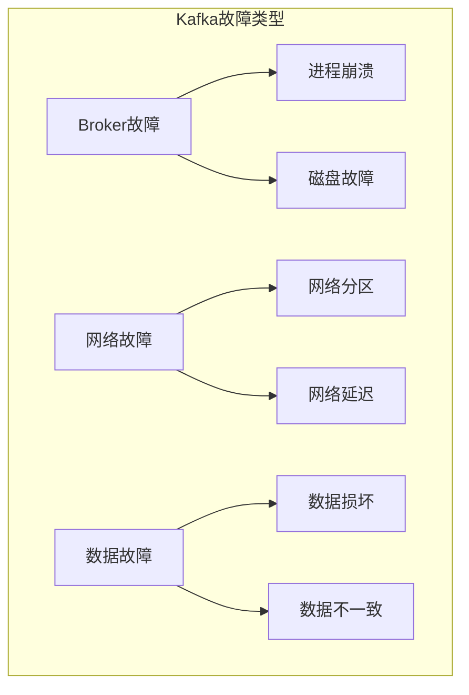

### 1.2 容错设计

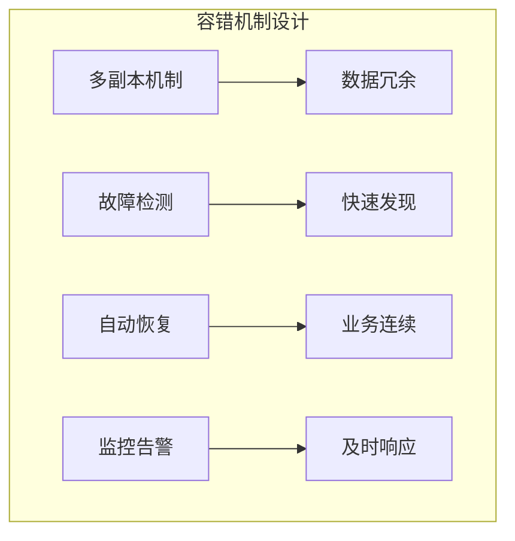

容错配置示例：

```properties

# 基础容错配置
num.replica.fetchers=4
replica.lag.time.max.ms=10000
min.insync.replicas=2
unclean.leader.election.enable=false
auto.leader.rebalance.enable=true
```

### 1.3 监控机制

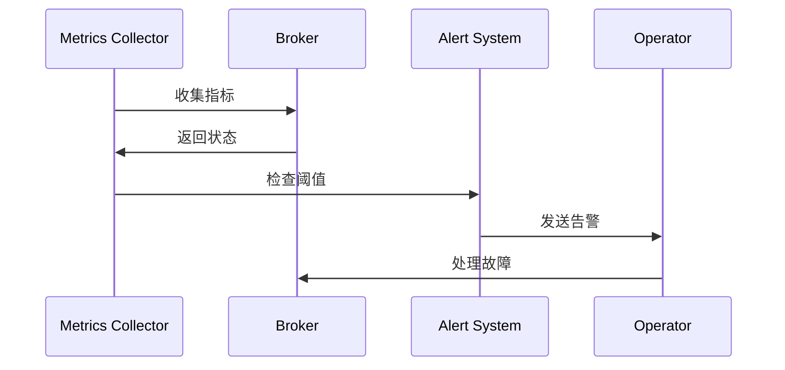

监控代码示例：

```java

public class FaultDetector {
    private final MetricRegistry metrics;
    private final AlertService alertService;
    
    public void monitorBrokerHealth(int brokerId) {
        Timer.Context context = metrics.timer("broker.health.check").time();
        try {
            // 检查Broker状态
            BrokerStatus status = checkBrokerStatus(brokerId);
            
            // 记录指标
            metrics.counter("broker.status." + status.name()).inc();
            
            // 处理异常状态
            if (!status.isHealthy()) {
                alertService.sendAlert(new BrokerAlert(brokerId, status));
            }
        } finally {
            context.stop();
        }
    }
}
```

## 2. Broker容错机制

### 2.1 Broker故障检测

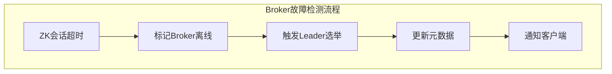

故障检测配置：

```properties

# Broker故障检测配置
zookeeper.session.timeout.ms=18000
zookeeper.connection.timeout.ms=6000
controlled.shutdown.enable=true
controlled.shutdown.max.retries=3
```

### 2.2 Broker故障恢复

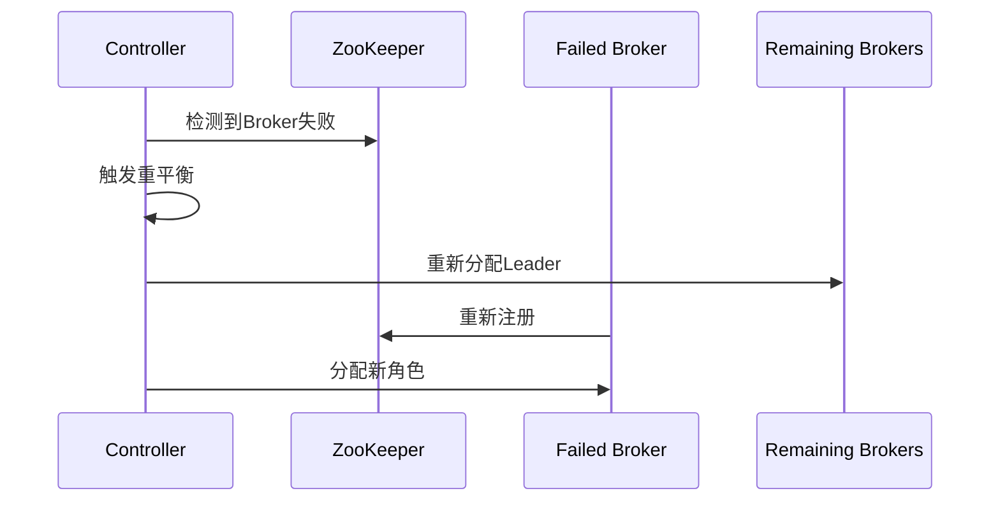

故障恢复代码示例：

```java

public class BrokerRecoveryManager {
    public void handleBrokerFailure(int brokerId) {
        try {
            // 1. 获取受影响的分区
            List<TopicPartition> affectedPartitions = 
                getAffectedPartitions(brokerId);
            
            // 2. 为每个分区选举新的Leader
            for (TopicPartition partition : affectedPartitions) {
                electNewLeader(partition);
            }
            
            // 3. 更新元数据
            updateMetadata();
            
            // 4. 通知客户端
            notifyClients();
            
        } catch (Exception e) {
            log.error("Failed to handle broker failure", e);
            throw e;
        }
    }
}
```

### 2.3 Controller容错

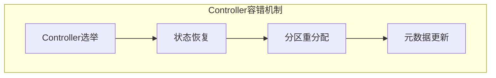

## 3. 分区容错机制

### 3.1 Leader选举

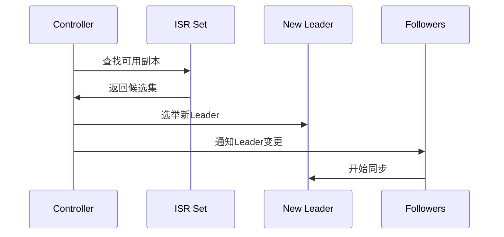

Leader选举配置：

```properties

# Leader选举相关配置
unclean.leader.election.enable=false
leader.imbalance.check.interval.seconds=300
leader.imbalance.per.broker.percentage=10
```

### 3.2 副本同步

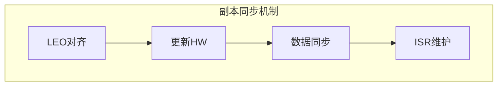

### 3.3 数据一致性

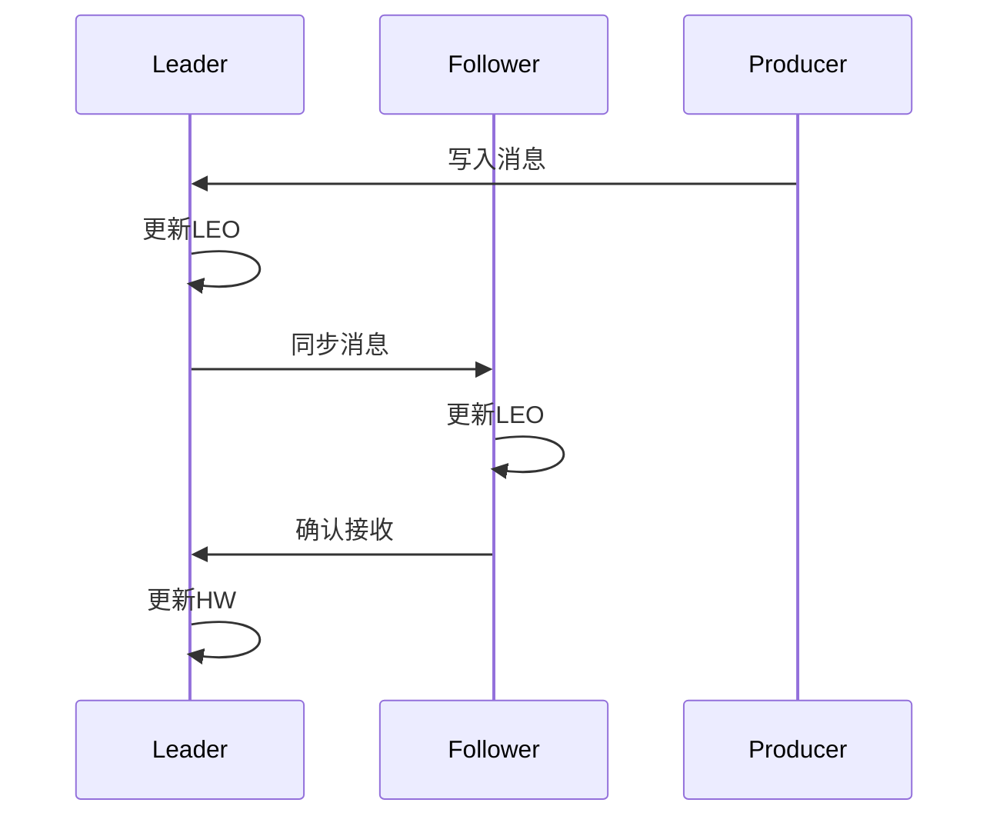

## 4. 消息容错机制

### 4.1 消息可靠性

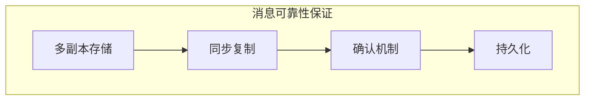

消息可靠性配置：

```properties

# 消息可靠性配置
acks=all
min.insync.replicas=2
enable.idempotence=true
retries=Integer.MAX_VALUE
```

### 4.2 幂等性保证

幂等性生产者示例：

```properties

Properties props = new Properties();
props.put("bootstrap.servers", "localhost:9092");
props.put("enable.idempotence", true);
// 必要的配置
props.put("acks", "all");
props.put("retries", Integer.MAX_VALUE);
props.put("max.in.flight.requests.per.connection", 5);

Producer<String, String> producer = new KafkaProducer<>(props);
```

### 4.3 事务支持

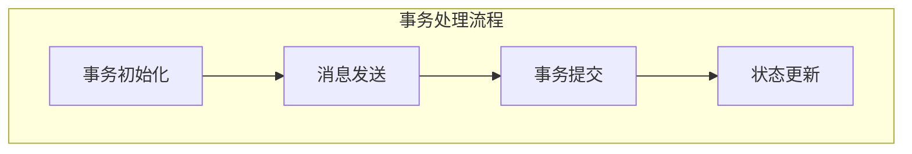

事务生产者示例：

```java

public class TransactionalProducer {
    public void sendMessagesInTransaction(List<ProducerRecord<String, String>> records) {
        Producer<String, String> producer = createTransactionalProducer();
        producer.initTransactions();
        
        try {
            producer.beginTransaction();
            
            for (ProducerRecord<String, String> record : records) {
                producer.send(record);
            }
            
            producer.commitTransaction();
        } catch (Exception e) {
            producer.abortTransaction();
            throw e;
        }
    }
    
    private Producer<String, String> createTransactionalProducer() {
        Properties props = new Properties();
        props.put("transactional.id", "my-transactional-id");
        props.put("enable.idempotence", true);
        // 其他必要配置...
        return new KafkaProducer<>(props);
    }
}
```

## 5. 网络容错机制

### 5.1 网络分区处理

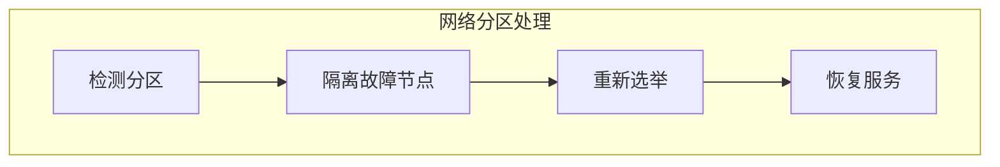

### 5.2 超时处理

网络超时配置：

```properties

# 网络超时相关配置
request.timeout.ms=30000
socket.connection.setup.timeout.ms=10000
socket.connection.setup.timeout.max.ms=30000
connections.max.idle.ms=600000
```

### 5.3 连接管理

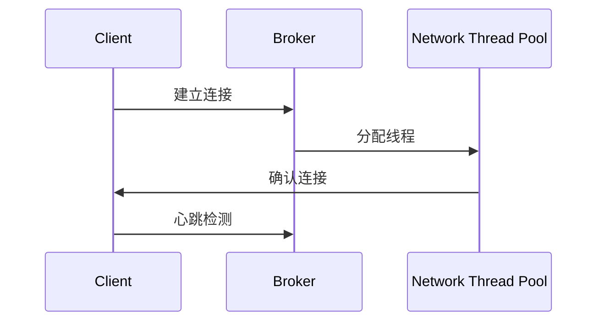

## 最佳实践建议

1. **基础配置建议**
   - 合理配置副本数
   - 启用幂等性和事务特性
   - 设置适当的超时时间
   - 配置充足的重试次数

2. **监控告警建议**
   - 监控Broker状态
   - 监控分区状态
   - 监控消息延迟
   - 设置合理的告警阈值

3. **运维建议**
   - 定期进行故障演练
   - 制定故障恢复流程
   - 保持文档更新
   - 做好容量规划

4. **性能优化建议**
   - 优化网络配置
   - 调整GC参数
   - 监控系统资源
   - 及时处理告警
```


