# Kafka 消息投递机制详解

## 目录
- [1. 消息投递基础](#1-消息投递基础)
  - [1.1 投递语义](#11-投递语义)
  - [1.2 投递流程](#12-投递流程)
  - [1.3 确认机制](#13-确认机制)
- [2. 生产者投递机制](#2-生产者投递机制)
  - [2.1 发送流程](#21-发送流程)
  - [2.2 重试机制](#22-重试机制)
  - [2.3 幂等性实现](#23-幂等性实现)
- [3. Broker 投递处理](#3-broker-投递处理)
  - [3.1 请求处理](#31-请求处理)
  - [3.2 副本同步](#32-副本同步)
  - [3.3 应答机制](#33-应答机制)
- [4. 消费者投递保证](#4-消费者投递保证)
  - [4.1 位移提交](#41-位移提交)
  - [4.2 重平衡处理](#42-重平衡处理)
  - [4.3 消费保证](#43-消费保证)
- [5. 端到端投递保证](#5-端到端投递保证)
  - [5.1 投递状态跟踪](#51-投递状态跟踪)
  - [5.2 失败处理](#52-失败处理)
  - [5.3 最佳实践](#53-最佳实践)

## 1. 消息投递基础

### 1.1 投递语义

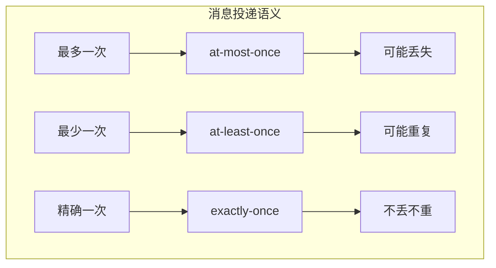

投递语义配置示例：

```properties
# Producer配置
enable.idempotence=true
acks=all
retries=3
max.in.flight.requests.per.connection=5

# Consumer配置
enable.auto.commit=false
isolation.level=read_committed
```

### 1.2 投递流程

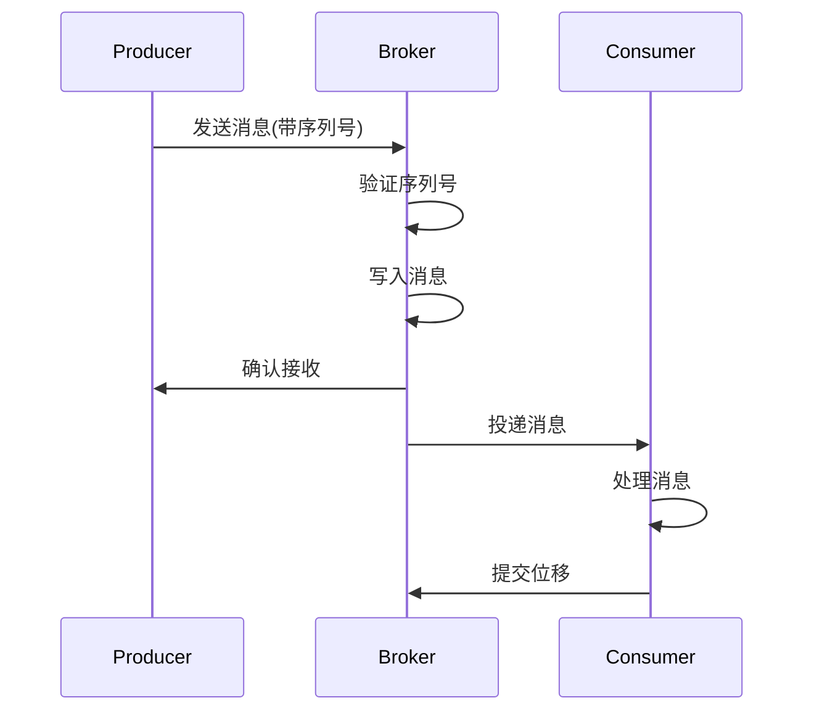

### 1.3 确认机制

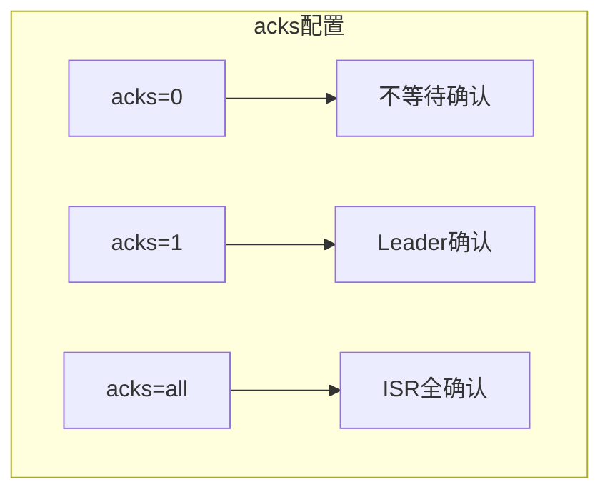

## 2. 生产者投递机制

### 2.1 发送流程

生产者发送示例：

```java
Properties props = new Properties();
props.put("bootstrap.servers", "localhost:9092");
props.put("key.serializer", "org.apache.kafka.common.serialization.StringSerializer");
props.put("value.serializer", "org.apache.kafka.common.serialization.StringSerializer");
props.put("acks", "all");
props.put("retries", 3);
props.put("enable.idempotence", true);

Producer<String, String> producer = new KafkaProducer<>(props);

// 同步发送
try {
    RecordMetadata metadata = producer.send(new ProducerRecord<>("topic", "key", "value")).get();
    System.out.printf("Partition: %d, Offset: %d%n", 
        metadata.partition(), metadata.offset());
} catch (Exception e) {
    e.printStackTrace();
}

// 异步发送
producer.send(new ProducerRecord<>("topic", "key", "value"), 
    (metadata, exception) -> {
        if (exception != null) {
            exception.printStackTrace();
        } else {
            System.out.printf("Partition: %d, Offset: %d%n", 
                metadata.partition(), metadata.offset());
        }
    });
```

### 2.2 重试机制

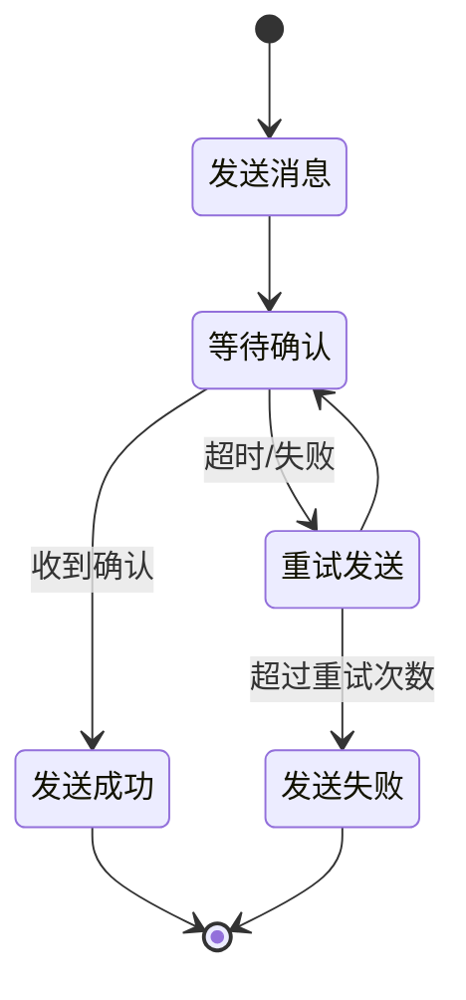

重试配置：

```properties
# 重试相关配置
retries=3
retry.backoff.ms=100
delivery.timeout.ms=120000
request.timeout.ms=30000
```

### 2.3 幂等性实现

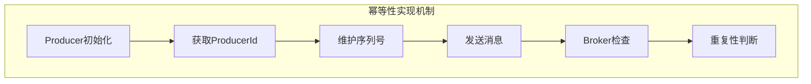

幂等性生产者示例：

```java
Properties props = new Properties();
// 启用幂等性
props.put("enable.idempotence", true);
// 必要的配置
props.put("acks", "all");
props.put("retries", Integer.MAX_VALUE);
props.put("max.in.flight.requests.per.connection", 5);

Producer<String, String> producer = new KafkaProducer<>(props);
```

## 3. Broker 投递处理

### 3.1 请求处理

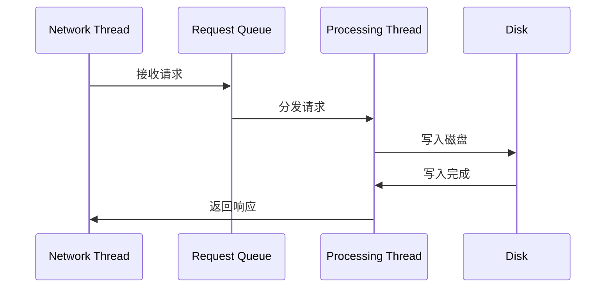

### 3.2 副本同步

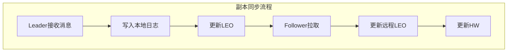

副本同步配置：

```properties
# 副本同步配置
min.insync.replicas=2
replica.lag.time.max.ms=10000
replica.fetch.wait.max.ms=500
replica.fetch.min.bytes=1
replica.fetch.max.bytes=1048576
```

### 3.3 应答机制

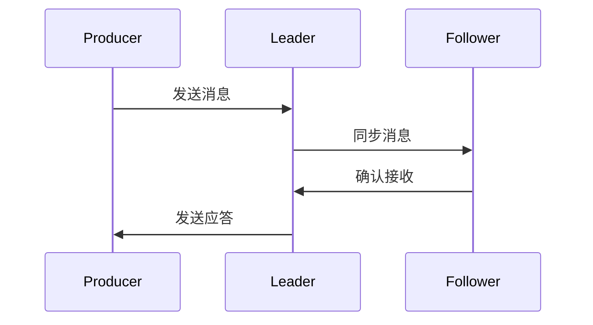

## 4. 消费者投递保证

### 4.1 位移提交

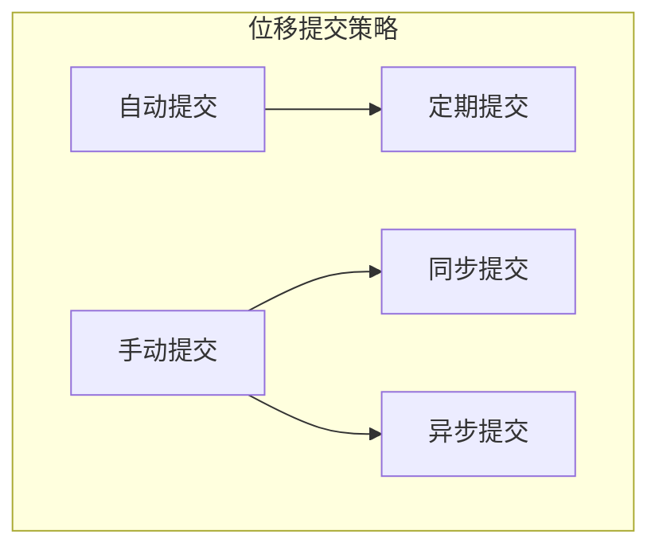

位移提交示例：

```java
// 手动提交示例
while (true) {
    ConsumerRecords<String, String> records = consumer.poll(Duration.ofMillis(100));
    for (ConsumerRecord<String, String> record : records) {
        // 处理消息
        processRecord(record);
    }
    try {
        // 同步提交
        consumer.commitSync();
        // 或异步提交
        consumer.commitAsync((offsets, exception) -> {
            if (exception != null) {
                log.error("Commit failed for offsets {}", offsets, exception);
            }
        });
    } catch (CommitFailedException e) {
        log.error("Commit failed", e);
    }
}
```

### 4.2 重平衡处理

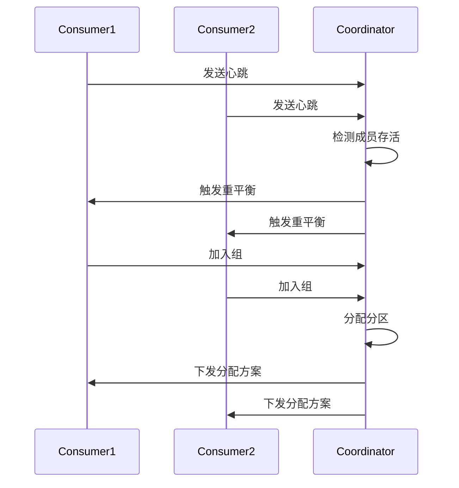

### 4.3 消费保证

消费者配置示例：

```properties
# 消费者配置
enable.auto.commit=false
auto.offset.reset=earliest
isolation.level=read_committed
max.poll.records=500
max.poll.interval.ms=300000
session.timeout.ms=10000
heartbeat.interval.ms=3000
```

## 5. 端到端投递保证

### 5.1 投递状态跟踪

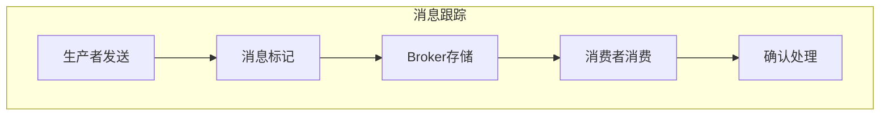

消息跟踪实现示例：

```java
public class MessageTracker {
    private final ConcurrentMap<String, DeliveryStatus> messageStatus = new ConcurrentHashMap<>();
    
    public void trackMessage(String messageId, String topic, int partition) {
        messageStatus.put(messageId, new DeliveryStatus(topic, partition));
    }
    
    public void confirmDelivery(String messageId) {
        DeliveryStatus status = messageStatus.get(messageId);
        if (status != null) {
            status.setDelivered(true);
        }
    }
    
    public boolean isDelivered(String messageId) {
        DeliveryStatus status = messageStatus.get(messageId);
        return status != null && status.isDelivered();
    }
}
```

### 5.2 失败处理

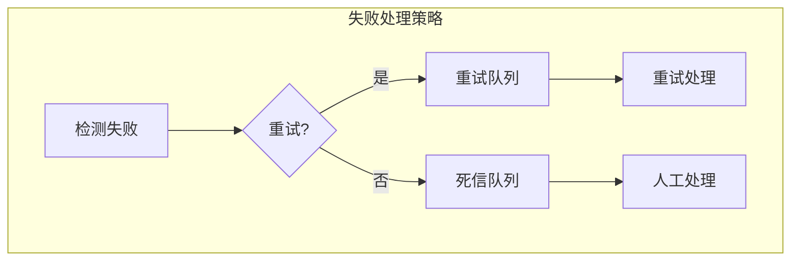

### 5.3 最佳实践

1. **生产者最佳实践**
   - 使用幂等性生产者
   - 合理配置重试参数
   - 实现消息发送回调
   - 监控发送状态

2. **消费者最佳实践**
   - 手动提交位移
   - 合理的消费者数量
   - 优雅的重平衡处理
   - 完善的异常处理

3. **监控建议**
   - 监控消息延迟
   - 监控投递成功率
   - 监控消费延迟
   - 监控重试次数

4. **运维建议**
   - 定期检查消息积压
   - 及时处理死信队列
   - 保持适当的副本数
   - 合理的清理策略
```

