# Kafka 消息模型详解

## 目录
- [1. 消息格式设计](#1-消息格式设计)
  - [1.1 消息结构](#11-消息结构)
  - [1.2 消息版本](#12-消息版本)
  - [1.3 消息属性](#13-消息属性)
- [2. 消息压缩机制](#2-消息压缩机制)
  - [2.1 压缩原理](#21-压缩原理)
  - [2.2 压缩算法](#22-压缩算法)
  - [2.3 压缩配置](#23-压缩配置)
- [3. 消息索引机制](#3-消息索引机制)
  - [3.1 索引文件结构](#31-索引文件结构)
  - [3.2 索引查找过程](#32-索引查找过程)
  - [3.3 索引维护](#33-索引维护)
- [4. 消息清理策略](#4-消息清理策略)
  - [4.1 日志删除](#41-日志删除)
  - [4.2 日志压缩](#42-日志压缩)
  - [4.3 清理配置](#43-清理配置)
- [5. 消息事务实现](#5-消息事务实现)
  - [5.1 事务原理](#51-事务原理)
  - [5.2 事务流程](#52-事务流程)
  - [5.3 事务保证](#53-事务保证)

## 1. 消息格式设计

### 1.1 消息结构

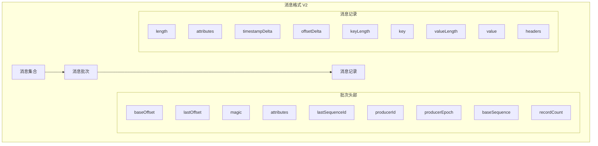

消息格式代码示例：
```java

// 创建消息记录
ProducerRecord<String, String> record = new ProducerRecord<>(
    "my-topic",                // 主题
    0,                         // 分区（可选）
    System.currentTimeMillis(),// 时间戳
    "message-key",            // 消息键
    "message-value",          // 消息值
    new RecordHeaders()        // 消息头部
        .add("header1", "value1".getBytes())
        .add("header2", "value2".getBytes())
);
```

### 1.2 消息版本

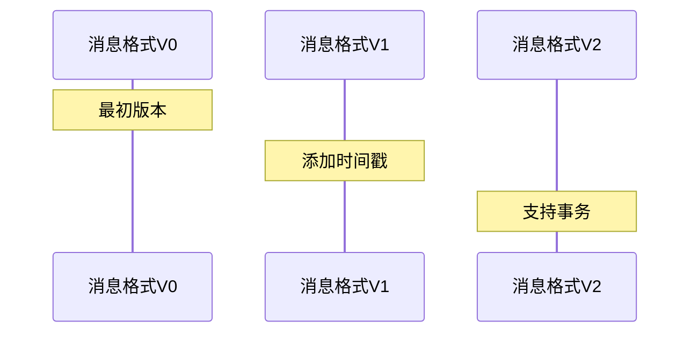

版本特性对比：
```

| 特性           | V0     | V1     | V2     |
|---------------|--------|--------|--------|
| 时间戳支持      | ❌     | ✅     | ✅     |
| 压缩支持       | 有限    | ✅     | ✅     |
| 事务支持       | ❌     | ❌     | ✅     |
| 幂等性支持      | ❌     | ❌     | ✅     |
| Header支持     | ❌     | ❌     | ✅     |
```

### 1.3 消息属性

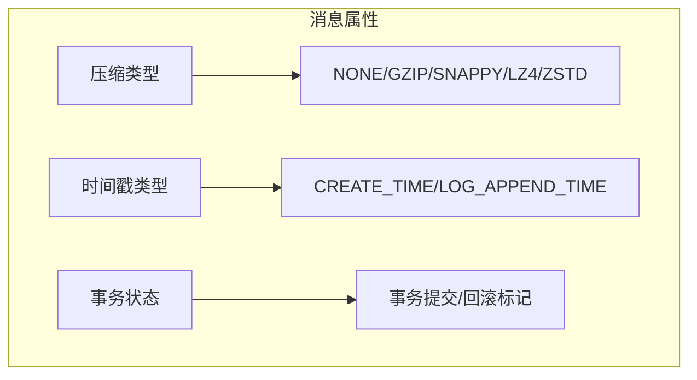

## 2. 消息压缩机制

### 2.1 压缩原理

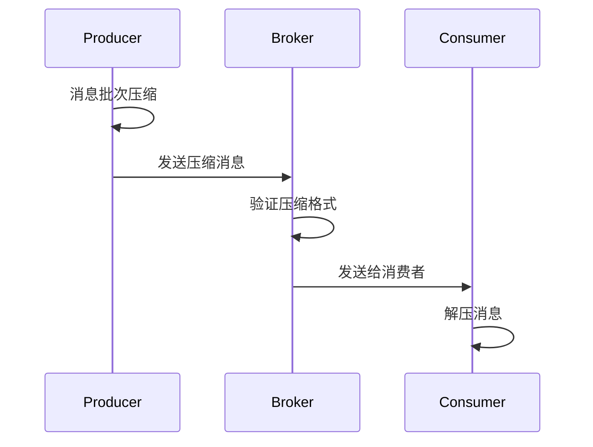

### 2.2 压缩算法

压缩算法性能对比：
```java

// 压缩算法配置
Properties props = new Properties();
props.put(ProducerConfig.COMPRESSION_TYPE_CONFIG, "gzip");  // gzip压缩
// 可选值: none, gzip, snappy, lz4, zstd

// 压缩级别配置（以GZIP为例）
props.put(ProducerConfig.COMPRESSION_TYPE_CONFIG, "gzip");
props.put("compression.codec.gzip.level", "6");  // 1-9，默认6
```

压缩算法特点：
```

| 算法    | 压缩比 | CPU消耗 | 特点                    |
|--------|--------|---------|------------------------|
| GZIP   | 高     | 高      | 适合对压缩比要求高的场景   |
| Snappy | 中     | 低      | 适合注重性能的场景        |
| LZ4    | 中     | 低      | 综合性能好              |
| ZSTD   | 高     | 中      | 压缩比和性能较好的平衡     |
```

### 2.3 压缩配置

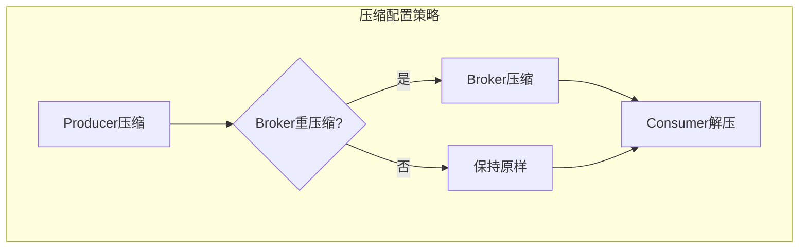

压缩配置示例：
```properties

# Producer端配置
compression.type=lz4
compression.level=6

# Broker端配置
compression.type=producer  # 使用生产者的压缩设置
# 或
compression.type=lz4      # 强制使用指定压缩方式
```

## 3. 消息索引机制

### 3.1 索引文件结构

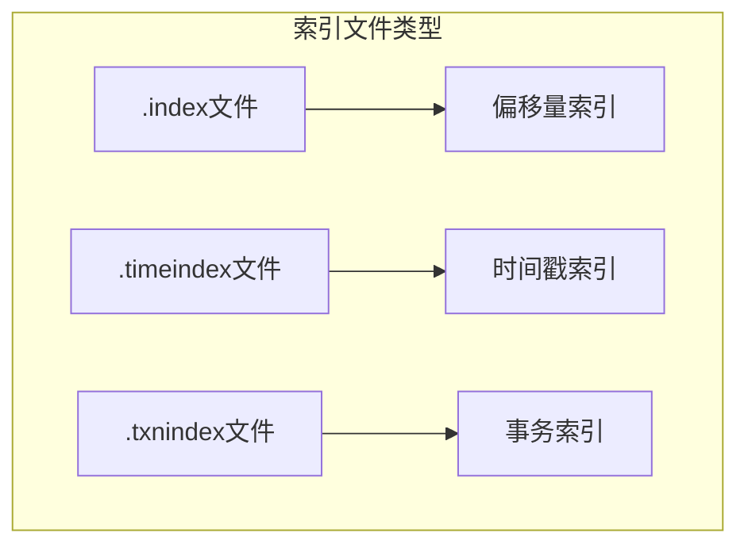

索引文件格式：
```properties

# 偏移量索引项结构
baseOffset: 8 bytes    // 基准偏移量
position: 4 bytes      // 物理文件位置

# 时间戳索引项结构
timestamp: 8 bytes     // 时间戳
offset: 8 bytes        // 对应偏移量
```

### 3.2 索引查找过程

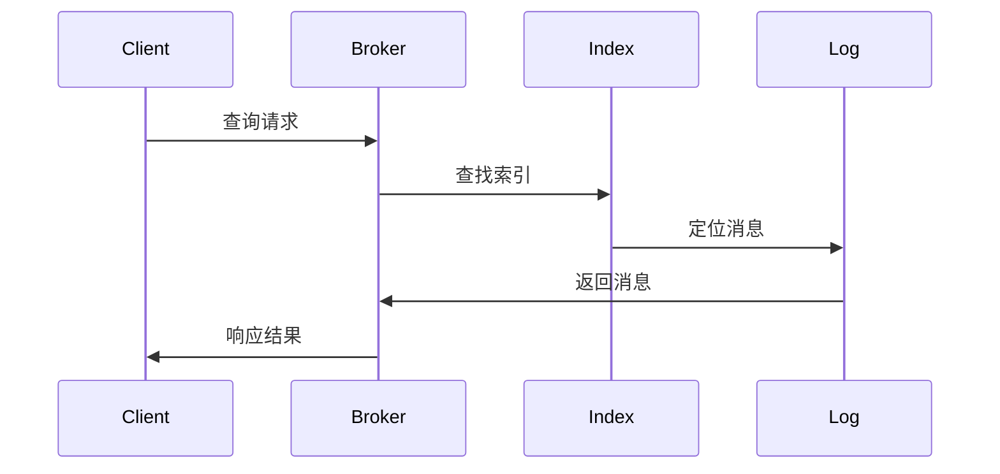

索引查找示例：
```java

// 根据时间戳查找消息
Map<TopicPartition, OffsetAndTimestamp> offsets = consumer.offsetsForTimes(
    Collections.singletonMap(
        new TopicPartition("my-topic", 0),
        System.currentTimeMillis() - 3600000  // 一小时前
    )
);
```

### 3.3 索引维护

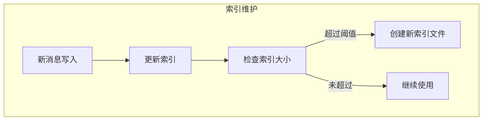

## 4. 消息清理策略

### 4.1 日志删除

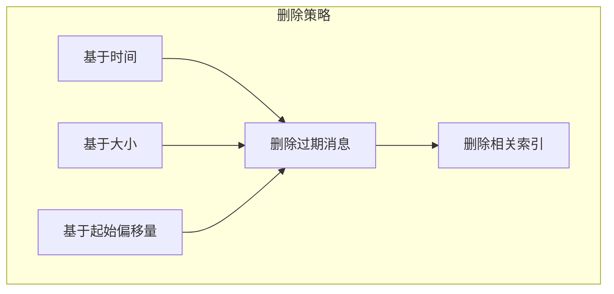

删除策略配置：
```properties

# 日志删除配置
log.retention.hours=168           # 保留时间
log.retention.bytes=1073741824    # 保留大小
log.segment.bytes=1073741824      # 日志段大小
log.retention.check.interval.ms=300000  # 检查间隔
```

### 4.2 日志压缩

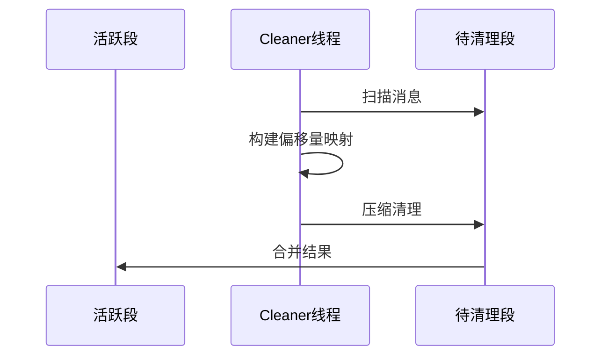

压缩配置示例：
```properties

# 日志压缩配置
log.cleaner.enable=true
log.cleaner.threads=1
log.cleaner.dedupe.buffer.size=134217728
log.cleaner.io.max.bytes.per.second=1048576
```

### 4.3 清理配置

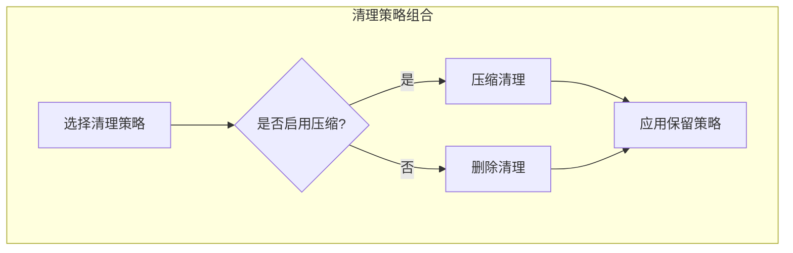

## 5. 消息事务实现

### 5.1 事务原理

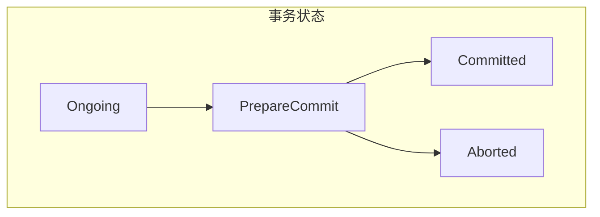

事务Producer示例：
```java

// 事务生产者配置
Properties props = new Properties();
props.put(ProducerConfig.TRANSACTIONAL_ID_CONFIG, "my-transactional-id");
props.put(ProducerConfig.ENABLE_IDEMPOTENCE_CONFIG, "true");

Producer<String, String> producer = new KafkaProducer<>(props);
producer.initTransactions();

try {
    producer.beginTransaction();
    producer.send(record1);
    producer.send(record2);
    producer.commitTransaction();
} catch (Exception e) {
    producer.abortTransaction();
}
```

### 5.2 事务流程

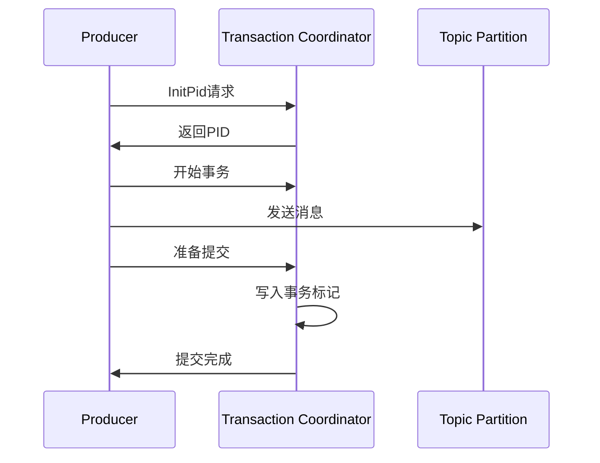

### 5.3 事务保证

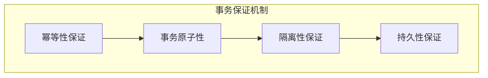

事务消费者配置：
```java

// 事务消费者配置
props.put(ConsumerConfig.ISOLATION_LEVEL_CONFIG, 
    "read_committed");  // 只读取已提交事务的消息

// 或
props.put(ConsumerConfig.ISOLATION_LEVEL_CONFIG, 
    "read_uncommitted");  // 读取所有消息
```

## 最佳实践建议

1. **消息格式设计**
   - 合理使用消息头部存储元数据
   - 选择适当的序列化方式
   - 考虑消息大小对性能的影响

2. **压缩策略选择**
   - 根据数据特点选择压缩算法
   - 监控压缩比和CPU使用率
   - 在Producer端开启压缩

3. **清理策略配置**
   - 根据业务需求选择清理策略
   - 合理配置清理参数
   - 监控清理效果

4. **事务使用建议**
   - 仅在必要时使用事务
   - 合理设置事务超时时间
   - 做好异常处理
```
