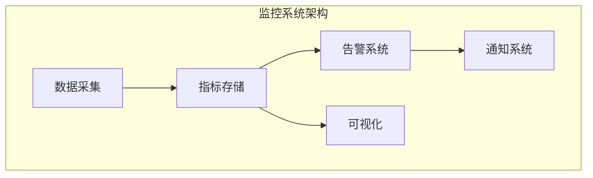
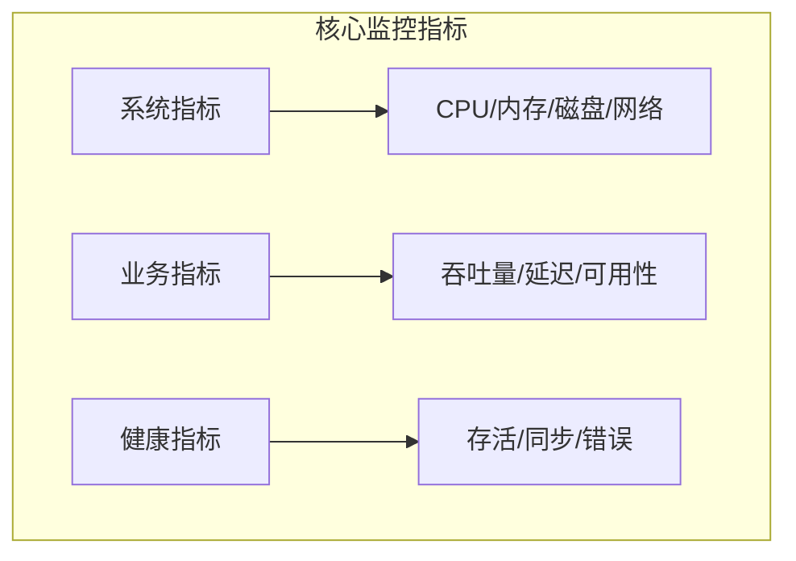
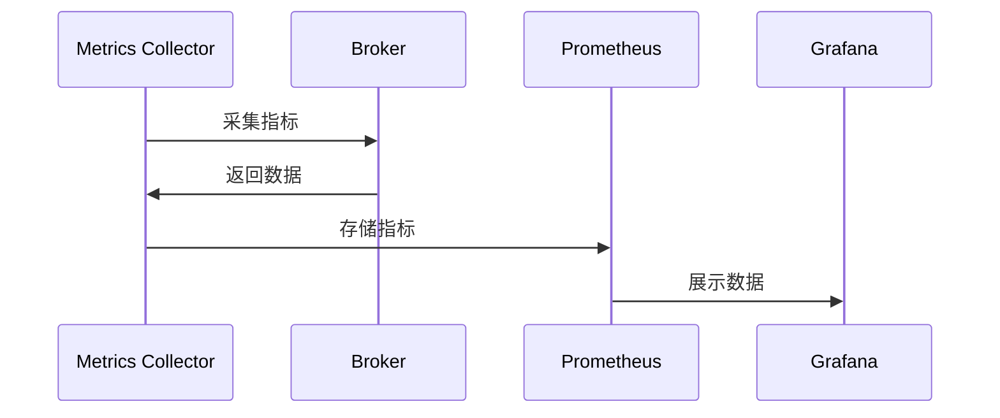
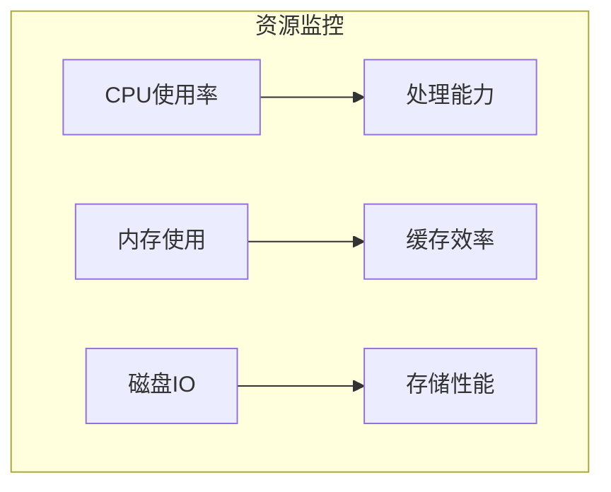
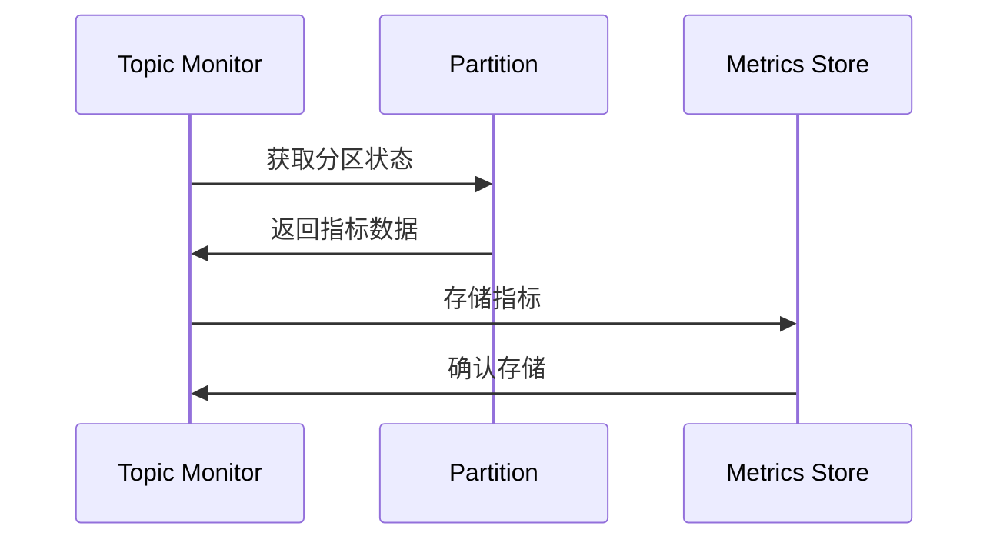
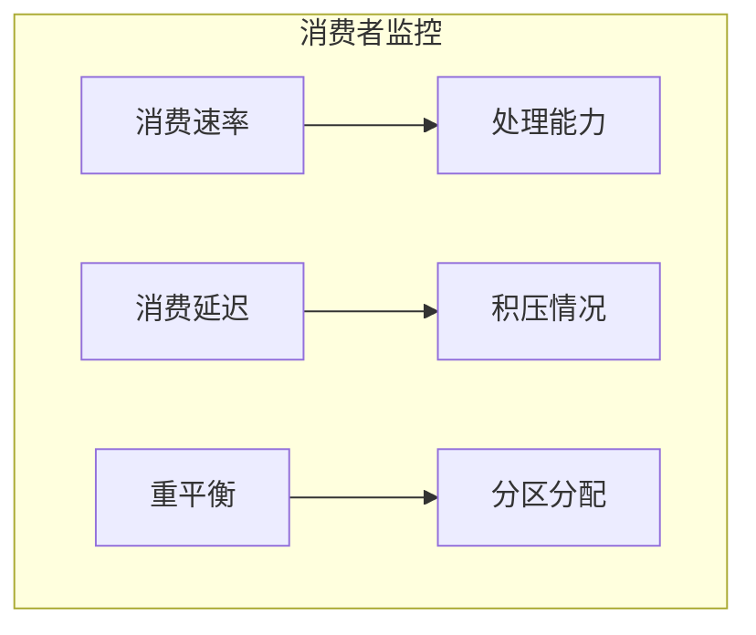
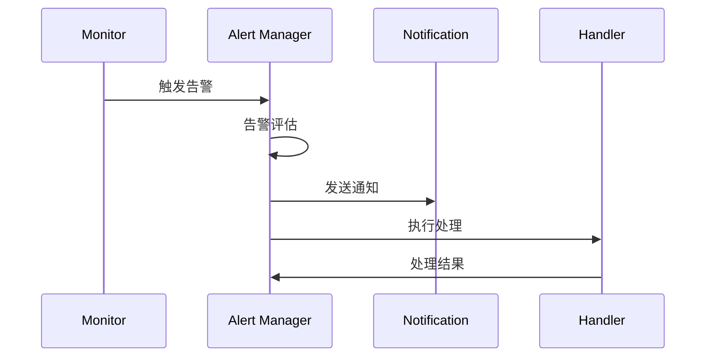

# Kafka 监控与告警系统详解

## 目录
- [1. 监控架构](#1-监控架构)
  - [1.1 整体架构](#11-整体架构)
  - [1.2 监控指标](#12-监控指标)
  - [1.3 数据采集](#13-数据采集)
- [2. Broker监控](#2-broker监控)
  - [2.1 基础指标](#21-基础指标)
  - [2.2 性能指标](#22-性能指标)
  - [2.3 资源指标](#23-资源指标)
- [3. Topic监控](#3-topic监控)
  - [3.1 消息指标](#31-消息指标)
  - [3.2 分区指标](#32-分区指标)
  - [3.3 延迟指标](#33-延迟指标)
- [4. 客户端监控](#4-客户端监控)
  - [4.1 生产者监控](#41-生产者监控)
  - [4.2 消费者监控](#42-消费者监控)
  - [4.3 连接监控](#43-连接监控)
- [5. 告警系统](#5-告警系统)
  - [5.1 告警规则](#51-告警规则)
  - [5.2 告警通道](#52-告警通道)
  - [5.3 告警处理](#53-告警处理)

## 1. 监控架构

### 1.1 整体架构



监控系统配置：

```properties
# prometheus.yml
global:
  scrape_interval: 15s
  evaluation_interval: 15s

scrape_configs:
  - job_name: 'kafka'
    static_configs:
      - targets: ['localhost:9308']
    metrics_path: '/metrics'
```

### 1.2 监控指标



### 1.3 数据采集

JMX采集器实现：

```java
public class KafkaMetricsCollector {
    private final MBeanServer mBeanServer;
    private final MetricRegistry metrics;
    
    public void collectBrokerMetrics() {
        // 收集Broker指标
        collectAttribute("kafka.server:type=BrokerTopicMetrics,name=MessagesInPerSec", 
            "OneMinuteRate", "message_in_rate");
            
        // 收集请求指标
        collectAttribute("kafka.network:type=RequestMetrics,name=RequestsPerSec", 
            "OneMinuteRate", "request_rate");
            
        // 收集副本指标
        collectAttribute("kafka.server:type=ReplicaManager,name=UnderReplicatedPartitions",
            "Value", "under_replicated_partitions");
    }
    
    private void collectAttribute(String objectName, String attribute, String metricName) {
        try {
            ObjectName mbeanName = new ObjectName(objectName);
            Object value = mBeanServer.getAttribute(mbeanName, attribute);
            metrics.register(metricName, (Gauge<Object>) () -> value);
        } catch (Exception e) {
            log.error("Failed to collect metric: " + metricName, e);
        }
    }
}
```

## 2. Broker监控

### 2.1 基础指标



Broker基础监控代码：

```java
public class BrokerMonitor {
    private final MetricRegistry metrics;
    
    public void monitorBasicMetrics() {
        // 活跃连接数
        metrics.gauge("active_connections", () ->
            getActiveConnections());
            
        // 请求队列大小
        metrics.gauge("request_queue_size", () ->
            getRequestQueueSize());
            
        // 网络处理线程空闲率
        metrics.gauge("network_processor_idle_percent", () ->
            getNetworkProcessorIdlePercent());
    }
}
```

### 2.2 性能指标

性能监控配置：

```properties
# 性能监控相关配置
metric.reporters=org.apache.kafka.common.metrics.JmxReporter
kafka.metrics.polling.interval.secs=10
kafka.metrics.reporters=org.apache.kafka.common.metrics.JmxReporter
```

### 2.3 资源指标



## 3. Topic监控

### 3.1 消息指标

Topic监控实现：

```java
public class TopicMonitor {
    private final AdminClient adminClient;
    private final MetricRegistry metrics;
    
    public void monitorTopicMetrics() {
        // 消息生产速率
        metrics.meter("message_produce_rate");
        
        // 消息大小分布
        metrics.histogram("message_size");
        
        // 分区数量
        metrics.gauge("partition_count", () ->
            getPartitionCount());
            
        // 副本同步状态
        metrics.gauge("in_sync_replicas", () ->
            getInSyncReplicasCount());
    }
}
```

### 3.2 分区指标



### 3.3 延迟指标

延迟监控代码：

```java
public class LagMonitor {
    private final KafkaConsumer<?, ?> consumer;
    private final MetricRegistry metrics;
    
    public void monitorConsumerLag() {
        Map<TopicPartition, Long> endOffsets = consumer.endOffsets(
            consumer.assignment());
            
        for (Map.Entry<TopicPartition, Long> entry : endOffsets.entrySet()) {
            TopicPartition partition = entry.getKey();
            long endOffset = entry.getValue();
            long currentOffset = consumer.position(partition);
            
            // 记录消费延迟
            metrics.gauge(
                String.format("consumer_lag_%s_%d", 
                    partition.topic(), 
                    partition.partition()
                ),
                () -> endOffset - currentOffset
            );
        }
    }
}
```

## 4. 客户端监控

### 4.1 生产者监控

生产者监控实现：

```java
public class ProducerMonitor {
    private final MetricRegistry metrics;
    
    public void monitorProducer() {
        // 发送成功率
        metrics.meter("producer.success.rate");
        
        // 发送延迟
        metrics.timer("producer.send.latency");
        
        // 重试次数
        metrics.counter("producer.retry.count");
        
        // 缓冲区使用
        metrics.gauge("producer.buffer.usage", () ->
            getBufferUsage());
    }
}
```

### 4.2 消费者监控



### 4.3 连接监控

连接监控代码：

```java
public class ConnectionMonitor {
    private final MetricRegistry metrics;
    
    public void monitorConnections() {
        // 连接数监控
        metrics.gauge("active_connections", () ->
            getActiveConnectionCount());
            
        // 连接失败率
        metrics.meter("connection.failure.rate");
        
        // 网络延迟
        metrics.timer("network.latency");
    }
}
```

## 5. 告警系统

### 5.1 告警规则

告警规则配置：

```yaml
# alert_rules.yml
groups:
  - name: kafka_alerts
    rules:
      - alert: KafkaBrokerDown
        expr: kafka_broker_up == 0
        for: 5m
        labels:
          severity: critical
        annotations:
          summary: "Kafka broker down"
          description: "Broker {{ $labels.broker }} has been down for more than 5 minutes"
          
      - alert: KafkaTopicLag
        expr: kafka_consumer_group_lag > 10000
        for: 10m
        labels:
          severity: warning
        annotations:
          summary: "High consumer lag"
          description: "Consumer group {{ $labels.group }} lag is high"
```

### 5.2 告警通道

告警处理实现：

```java
public class AlertManager {
    private final AlertService alertService;
    private final NotificationService notificationService;
    
    public void handleAlert(Alert alert) {
        // 告警级别判断
        if (alert.getSeverity() == AlertSeverity.CRITICAL) {
            // 发送紧急通知
            notificationService.sendUrgentNotification(alert);
            // 触发自动恢复
            triggerAutoRecovery(alert);
        } else {
            // 发送普通通知
            notificationService.sendNotification(alert);
        }
        
        // 记录告警
        alertService.recordAlert(alert);
    }
    
    private void triggerAutoRecovery(Alert alert) {
        try {
            // 执行自动恢复操作
            RecoveryAction action = determineRecoveryAction(alert);
            action.execute();
        } catch (Exception e) {
            log.error("Failed to execute recovery action", e);
            // 升级告警
            escalateAlert(alert);
        }
    }
}
```

### 5.3 告警处理



## 最佳实践建议

1. **监控建议**
   - 全面覆盖关键指标
   - 合理设置采集频率
   - 保留历史数据
   - 定期验证监控

2. **告警建议**
   - 设置合理阈值
   - 分级告警策略
   - 避免告警风暴
   - 定期优化规则

3. **运维建议**
   - 建立告警处理流程
   - 做好告警升级
   - 定期演练
   - 持续优化改进

4. **工具建议**
   - 使用专业监控工具
   - 集成自动化工具
   - 完善监控面板
   - 做好数据备份
```

