# Kafka 分区机制详解

## 目录
- [1. 分区基础概念](#1-分区基础概念)
  - [1.1 分区的作用](#11-分区的作用)
  - [1.2 分区数据结构](#12-分区数据结构)
  - [1.3 分区状态管理](#13-分区状态管理)
- [2. 分区分配策略](#2-分区分配策略)
  - [2.1 生产者分区策略](#21-生产者分区策略)
  - [2.2 消费者分区策略](#22-消费者分区策略)
  - [2.3 自定义分区策略](#23-自定义分区策略)
- [3. 分区副本放置](#3-分区副本放置)
  - [3.1 副本分配算法](#31-副本分配算法)
  - [3.2 机架感知](#32-机架感知)
  - [3.3 副本迁移](#33-副本迁移)
- [4. Leader 选举机制](#4-leader-选举机制)
  - [4.1 选举触发条件](#41-选举触发条件)
  - [4.2 选举流程](#42-选举流程)
  - [4.3 优先副本选举](#43-优先副本选举)
- [5. ISR 机制详解](#5-isr-机制详解)
  - [5.1 ISR 管理](#51-isr-管理)
  - [5.2 ISR 收缩与扩张](#52-isr-收缩与扩张)
  - [5.3 HW 和 LEO](#53-hw-和-leo)
- [6. 负载均衡原理](#6-负载均衡原理)
  - [6.1 分区重分配](#61-分区重分配)
  - [6.2 自动平衡策略](#62-自动平衡策略)
  - [6.3 手动平衡操作](#63-手动平衡操作)

## 1. 分区基础概念

### 1.1 分区的作用

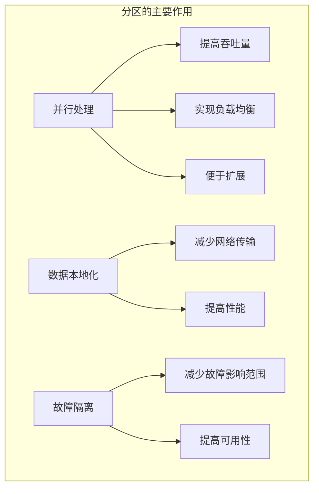

### 1.2 分区数据结构

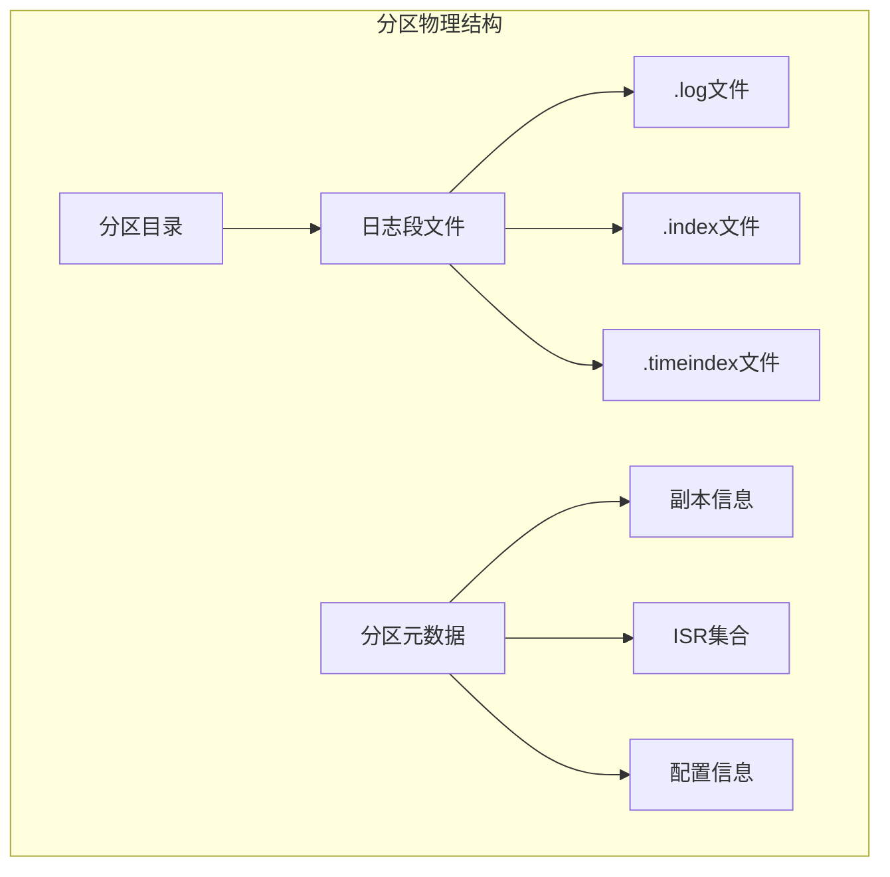

分区目录结构示例：
```bash
# 查看分区目录结构
$ ls -l /kafka/data/my-topic-0/
total 1024
-rw-r--r-- 1 kafka kafka 10485760 00000000000000000000.log
-rw-r--r-- 1 kafka kafka    10240 00000000000000000000.index
-rw-r--r-- 1 kafka kafka    10240 00000000000000000000.timeindex
-rw-r--r-- 1 kafka kafka      100 leader-epoch-checkpoint
```

### 1.3 分区状态管理

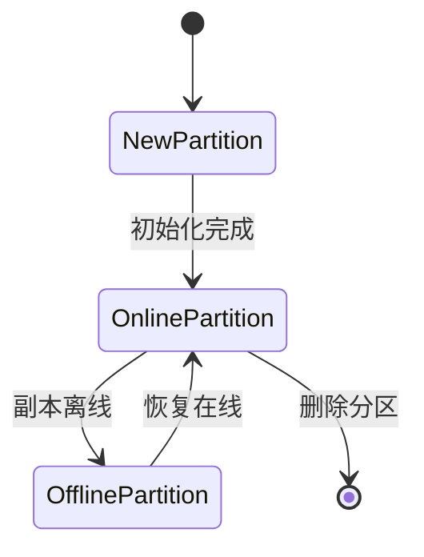

分区状态查看命令：
```bash
# 查看分区状态
bin/kafka-topics.sh --describe \
    --bootstrap-server localhost:9092 \
    --topic my-topic

# 输出示例
Topic: my-topic    PartitionCount: 3    ReplicationFactor: 3
Topic: my-topic    Partition: 0    Leader: 1    Replicas: 1,2,3    Isr: 1,2,3
Topic: my-topic    Partition: 1    Leader: 2    Replicas: 2,3,1    Isr: 2,3,1
Topic: my-topic    Partition: 2    Leader: 3    Replicas: 3,1,2    Isr: 3,1,2
```

## 2. 分区分配策略

### 2.1 生产者分区策略

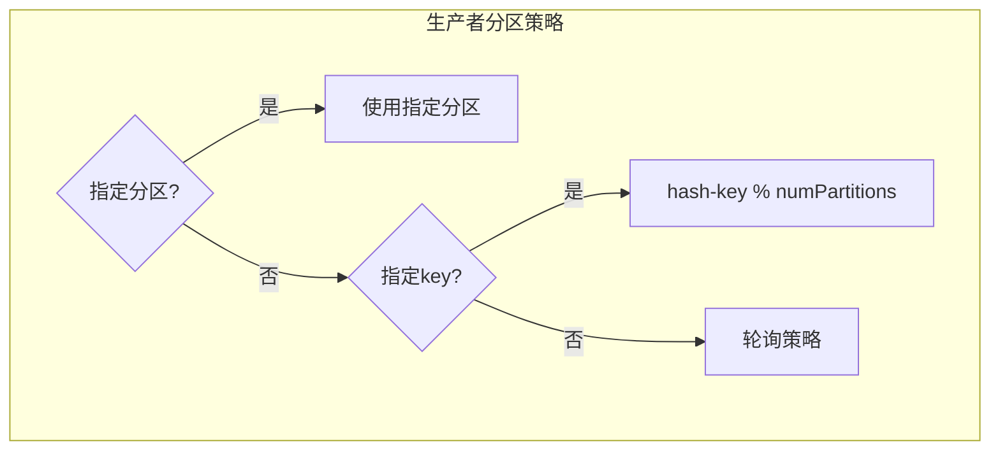

生产者分区代码示例：
```java
// 自定义分区器
public class CustomPartitioner implements Partitioner {
    @Override
    public int partition(String topic, Object key, byte[] keyBytes,
                        Object value, byte[] valueBytes, Cluster cluster) {
        List<PartitionInfo> partitions = cluster.partitionsForTopic(topic);
        int numPartitions = partitions.size();
        
        if (keyBytes == null) {
            // 自定义无key消息的分区逻辑
            return new Random().nextInt(numPartitions);
        }
        
        // 自定义有key消息的分区逻辑
        return Math.abs(key.hashCode()) % numPartitions;
    }
    
    @Override
    public void close() {}
    
    @Override
    public void configure(Map<String, ?> configs) {}
}

// 使用自定义分区器
Properties props = new Properties();
props.put(ProducerConfig.PARTITIONER_CLASS_CONFIG, CustomPartitioner.class.getName());
```

### 2.2 消费者分区策略

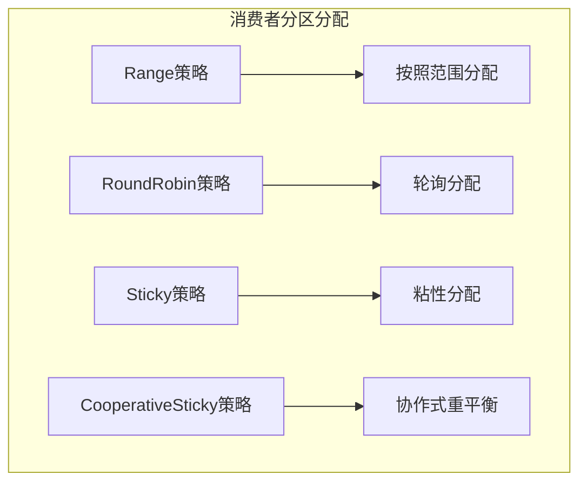

消费者分区分配配置：
```java
// 配置分区分配策略
Properties props = new Properties();
props.put(ConsumerConfig.PARTITION_ASSIGNMENT_STRATEGY_CONFIG, 
    Arrays.asList(
        CooperativeStickyAssignor.class.getName(),
        RoundRobinAssignor.class.getName()
    ));
```

### 2.3 自定义分区策略

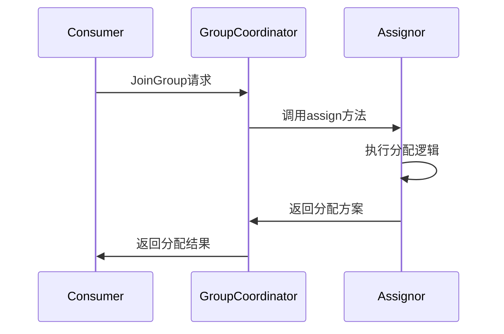

自定义分配策略示例：
```java
public class CustomAssignor extends AbstractPartitionAssignor {
    @Override
    public Map<String, List<TopicPartition>> assign(Map<String, Integer> partitionsPerTopic,
                                                   Map<String, Subscription> subscriptions) {
        // 实现自定义分配逻辑
        Map<String, List<TopicPartition>> assignment = new HashMap<>();
        // ... 分配逻辑实现
        return assignment;
    }
    
    @Override
    public String name() {
        return "custom";
    }
}
```

## 3. 分区副本放置

### 3.1 副本分配算法


副本分配示例：
```bash
# 创建主题时的副本分配
bin/kafka-topics.sh --create \
    --bootstrap-server localhost:9092 \
    --topic my-topic \
    --partitions 3 \
    --replication-factor 3 \
    --replica-assignment "1:2:3,2:3:1,3:1:2"
```

### 3.2 机架感知


机架配置示例：
```properties
# broker.rack配置
broker.rack=rack1
```

### 3.3 副本迁移

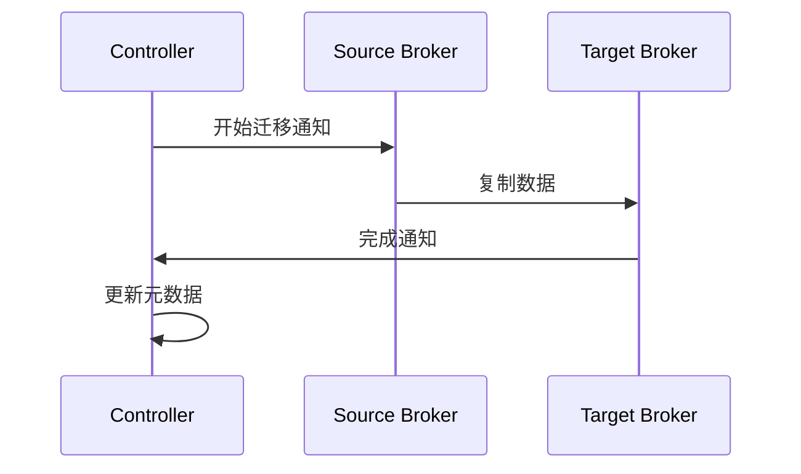

副本迁移命令：
```bash
# 创建迁移计划
cat > reassign.json <<EOF
{
  "version": 1,
  "partitions": [
    {
      "topic": "my-topic",
      "partition": 0,
      "replicas": [4,5,6]
    }
  ]
}
EOF

# 执行迁移
bin/kafka-reassign-partitions.sh \
    --bootstrap-server localhost:9092 \
    --reassignment-json-file reassign.json \
    --execute
```

## 4. Leader 选举机制

### 4.1 选举触发条件

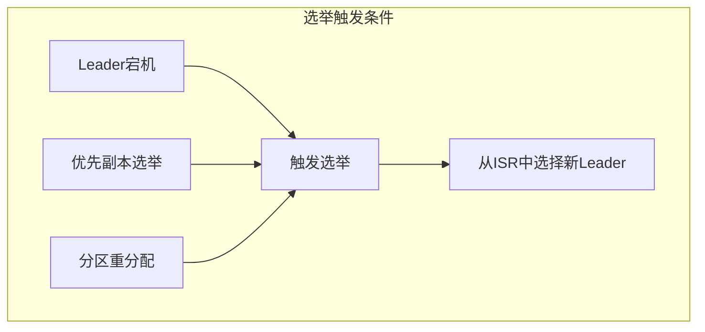

### 4.2 选举流程

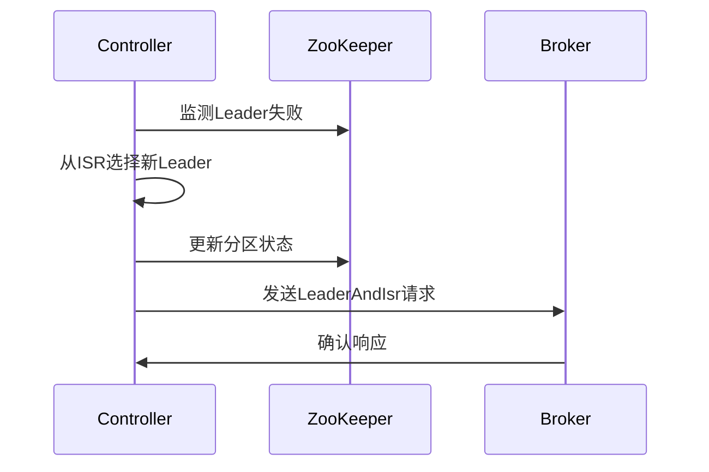

### 4.3 优先副本选举

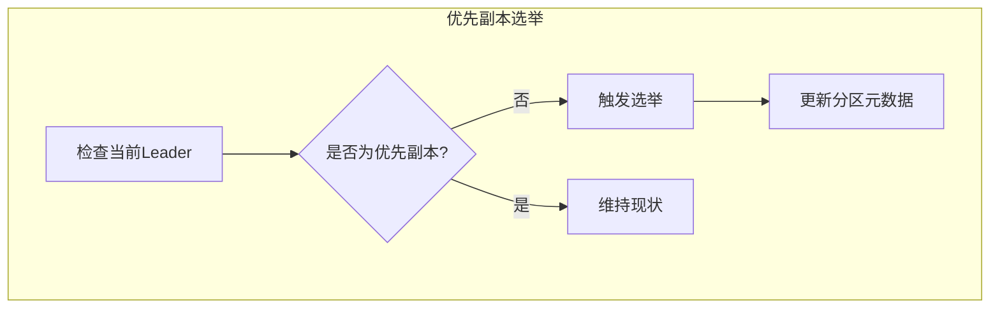

优先副本选举命令：
```bash
# 执行优先副本选举
bin/kafka-preferred-replica-election.sh \
    --bootstrap-server localhost:9092
```

## 5. ISR 机制详解

### 5.1 ISR 管理

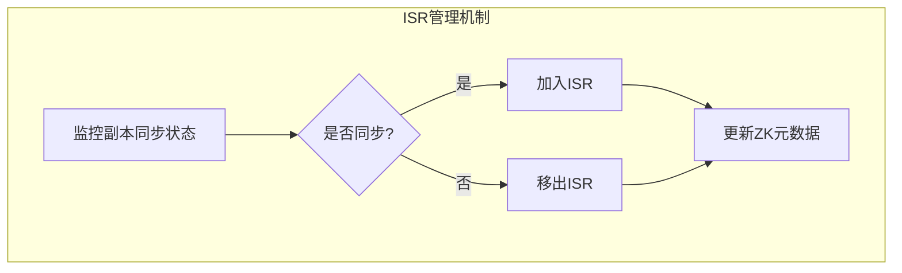

ISR 配置参数：
```properties
# ISR 相关配置
replica.lag.time.max.ms=10000
min.insync.replicas=2
```

### 5.2 ISR 收缩与扩张

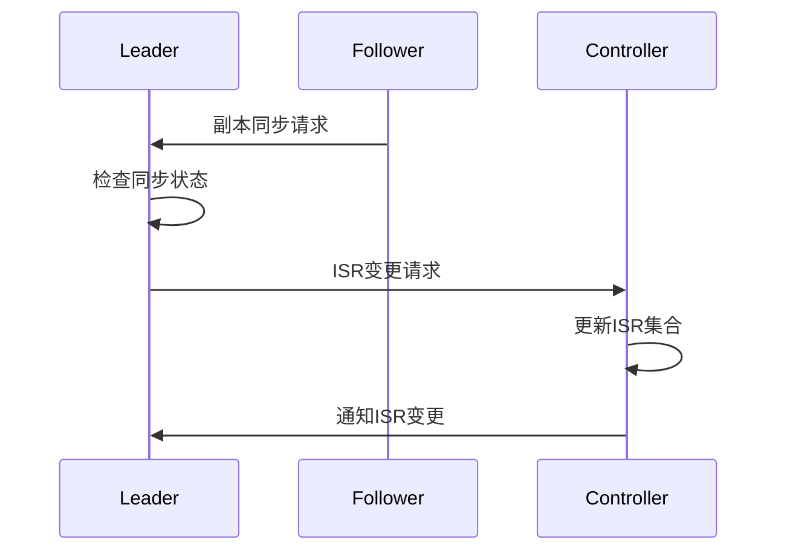

### 5.3 HW 和 LEO

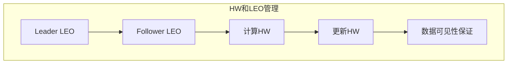

## 6. 负载均衡原理

### 6.1 分区重分配


### 6.2 自动平衡策略

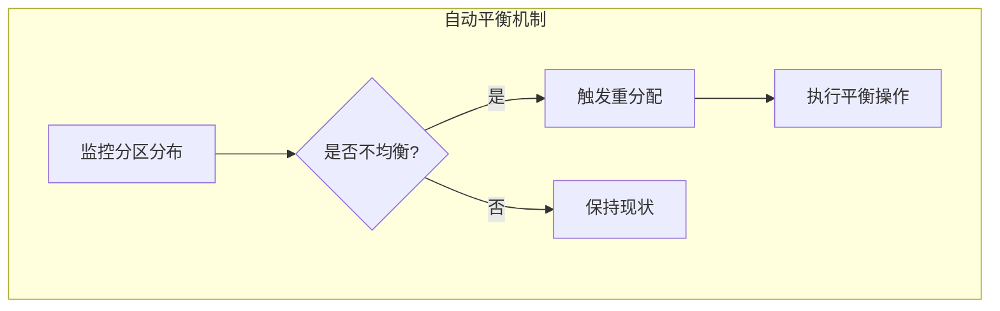

### 6.3 手动平衡操作

分区重分配工具使用示例：
```bash
# 生成重分配计划
bin/kafka-reassign-partitions.sh \
    --bootstrap-server localhost:9092 \
    --topics-to-move-json-file topics.json \
    --broker-list "1,2,3,4" \
    --generate

# 执行重分配
bin/kafka-reassign-partitions.sh \
    --bootstrap-server localhost:9092 \
    --reassignment-json-file reassign.json \
    --execute

# 验证重分配
bin/kafka-reassign-partitions.sh \
    --bootstrap-server localhost:9092 \
    --reassignment-json-file reassign.json \
    --verify
```

## 最佳实践建议

1. **分区数量设置**
   - 分区数不要过多，建议每个 Broker 上的分区数不超过 2000
   - 考虑未来扩展需求预留空间
   - 分区数量和消费者数量要协调

2. **副本因子配置**
   - 推荐配置为3，在可用性和性能间取得平衡
   - 重要数据可以考虑配置更多副本
   - 考虑存储成本和网络带宽消耗

3. **ISR 配置优化**
   - 合理设置 replica.lag.time.max.ms
   - 监控 ISR 变化情况
   - 设置适当的 min.insync.replicas

4. **负载均衡注意事项**
   - 避免频繁进行分区重分配
   - 选择业务低峰期进行重平衡
   - 监控重分配过程中的性能影响
```

