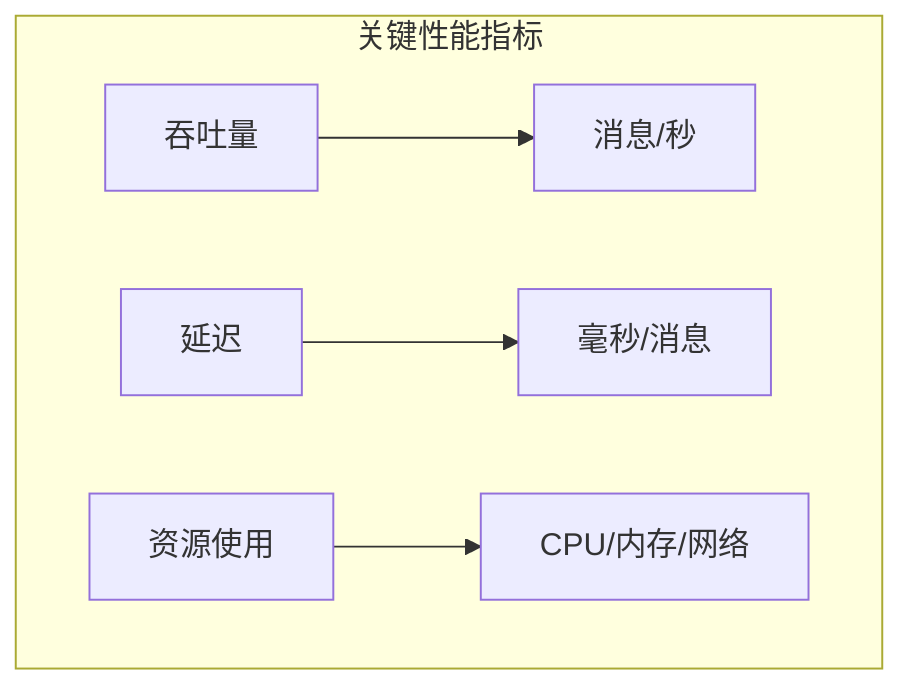
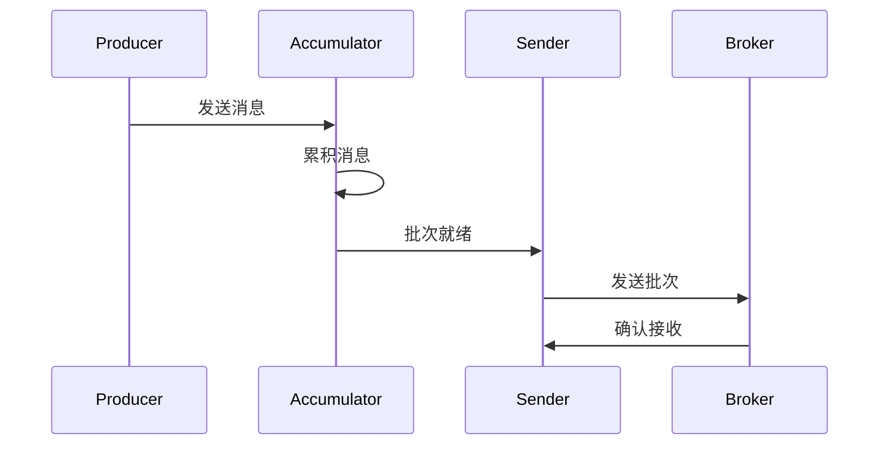
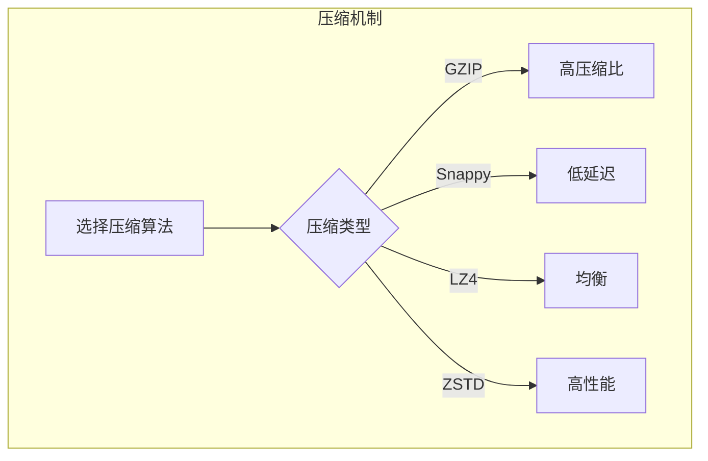
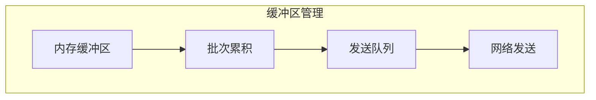
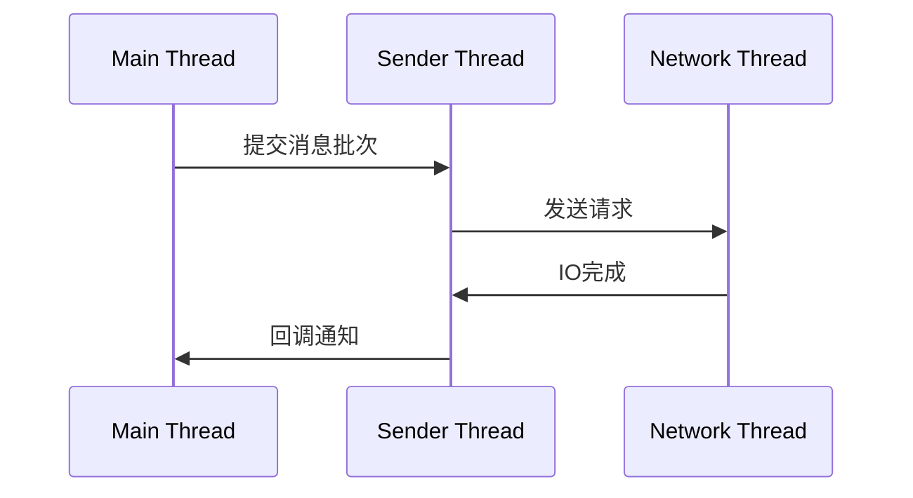
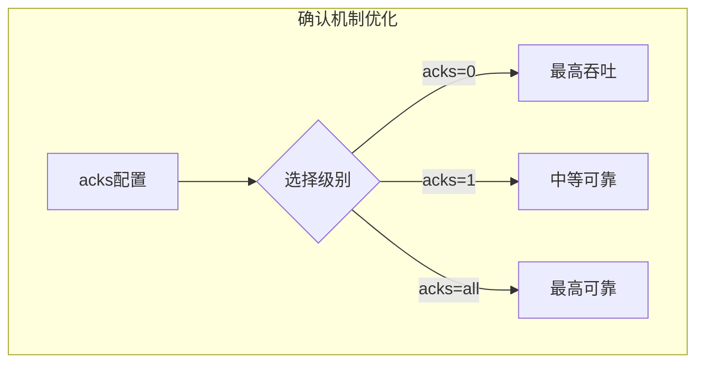
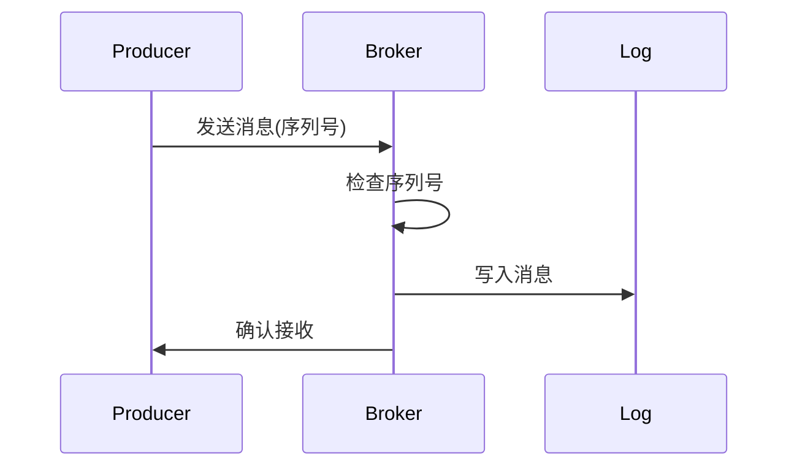
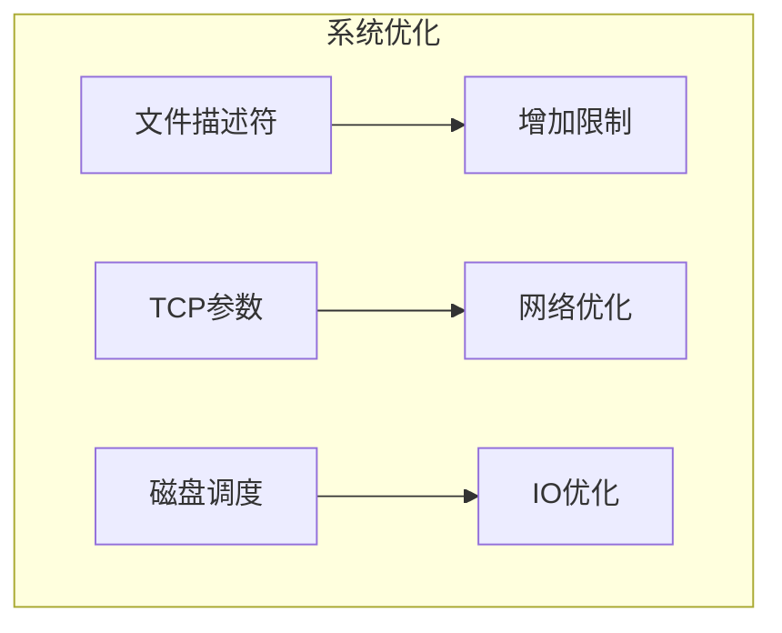

# Kafka 生产者性能优化详解

## 目录
- [1. 基础优化](#1-基础优化)
  - [1.1 生产者架构](#11-生产者架构)
  - [1.2 关键参数](#12-关键参数)
  - [1.3 性能指标](#13-性能指标)
- [2. 批量发送优化](#2-批量发送优化)
  - [2.1 批次配置](#21-批次配置)
  - [2.2 压缩机制](#22-压缩机制)
  - [2.3 缓冲区管理](#23-缓冲区管理)
- [3. 线程模型优化](#3-线程模型优化)
  - [3.1 发送线程](#31-发送线程)
  - [3.2 IO线程](#32-io线程)
  - [3.3 回调处理](#33-回调处理)
- [4. 可靠性优化](#4-可靠性优化)
  - [4.1 确认机制](#41-确认机制)
  - [4.2 重试机制](#42-重试机制)
  - [4.3 幂等性保证](#43-幂等性保证)
- [5. 监控与调优](#5-监控与调优)
  - [5.1 性能监控](#51-性能监控)
  - [5.2 JVM调优](#52-jvm调优)
  - [5.3 系统调优](#53-系统调优)

## 1. 基础优化

### 1.1 生产者架构


### 1.2 关键参数

基础配置示例：

```properties

# 基础优化配置
bootstrap.servers=localhost:9092
acks=all
retries=3
batch.size=16384
linger.ms=5
buffer.memory=33554432
compression.type=snappy
max.in.flight.requests.per.connection=5
```

### 1.3 性能指标



性能监控代码示例：

```java

public class ProducerMetrics {
    private final MetricRegistry metrics = new MetricRegistry();
    private final Timer sendLatency = metrics.timer("producer.send.latency");
    private final Meter throughput = metrics.meter("producer.throughput");
    
    public void send(ProducerRecord<String, String> record) {
        Timer.Context context = sendLatency.time();
        try {
            producer.send(record, (metadata, exception) -> {
                context.stop();
                if (exception == null) {
                    throughput.mark();
                }
            });
        } catch (Exception e) {
            context.stop();
            throw e;
        }
    }
}
```

## 2. 批量发送优化

### 2.1 批次配置



批次优化配置：

```properties

# 批次相关配置
batch.size=131072  # 128KB
linger.ms=10
max.request.size=1048576
```

### 2.2 压缩机制



压缩配置示例：

```properties

# 压缩配置
compression.type=snappy
# 可选: gzip, snappy, lz4, zstd

# 压缩级别（以GZIP为例）
compression.level=6  # 1-9之间
```

### 2.3 缓冲区管理



缓冲区优化代码示例：

```java

public class BufferPoolManager {
    private final int totalMemory;
    private final int batchSize;
    private final BlockingQueue<ByteBuffer> freeBuffers;
    
    public ByteBuffer allocateBuffer() {
        ByteBuffer buffer = freeBuffers.poll();
        if (buffer == null) {
            // 创建新的缓冲区
            buffer = ByteBuffer.allocate(batchSize);
        }
        return buffer;
    }
    
    public void releaseBuffer(ByteBuffer buffer) {
        buffer.clear();
        freeBuffers.offer(buffer);
    }
}
```

## 3. 线程模型优化

### 3.1 发送线程



发送线程优化示例：

```java

public class OptimizedProducer {
    private final KafkaProducer<String, String> producer;
    private final ExecutorService callbackExecutor;
    
    public void sendAsync(ProducerRecord<String, String> record) {
        producer.send(record, (metadata, exception) -> {
            // 使用单独的线程池处理回调
            callbackExecutor.submit(() -> {
                handleCallback(metadata, exception);
            });
        });
    }
    
    private void handleCallback(RecordMetadata metadata, Exception exception) {
        if (exception != null) {
            // 处理发送异常
            handleError(exception);
        } else {
            // 处理发送成功
            updateMetrics(metadata);
        }
    }
}
```

### 3.2 IO线程


### 3.3 回调处理

回调优化配置：

```properties

# IO相关配置
max.in.flight.requests.per.connection=5
connections.max.idle.ms=540000
request.timeout.ms=30000
```

## 4. 可靠性优化

### 4.1 确认机制



### 4.2 重试机制

重试优化代码示例：

```java

public class RetryOptimizer {
    private final KafkaProducer<String, String> producer;
    private final int maxRetries;
    private final long retryBackoff;
    
    public void sendWithRetry(ProducerRecord<String, String> record) {
        int retries = 0;
        while (true) {
            try {
                producer.send(record).get();
                break;
            } catch (RetriableException e) {
                if (retries >= maxRetries) {
                    throw e;
                }
                // 指数退避
                Thread.sleep(retryBackoff * Math.pow(2, retries));
                retries++;
            }
        }
    }
}
```

### 4.3 幂等性保证



## 5. 监控与调优

### 5.1 性能监控

监控指标收集：

```java

public class ProducerMonitor {
    private final MetricRegistry metrics;
    
    public void collectMetrics() {
        // 记录发送速率
        metrics.meter("message.send.rate");
        
        // 记录发送延迟
        metrics.timer("message.send.latency");
        
        // 记录批次大小
        metrics.histogram("batch.size");
        
        // 记录压缩比率
        metrics.histogram("compression.ratio");
        
        // 记录重试次数
        metrics.counter("retry.count");
    }
}
```

### 5.2 JVM调优

JVM优化配置：

```properties

# JVM参数优化
-Xms6g
-Xmx6g
-XX:MetaspaceSize=96m
-XX:+UseG1GC
-XX:MaxGCPauseMillis=20
-XX:InitiatingHeapOccupancyPercent=35
-XX:+ExplicitGCInvokesConcurrent
```

### 5.3 系统调优



系统参数优化：

```properties

# 系统参数优化
net.core.wmem_max=2097152
net.core.rmem_max=2097152
net.ipv4.tcp_wmem=4096 65536 2097152
net.ipv4.tcp_rmem=4096 65536 2097152
```

## 最佳实践建议

1. **配置优化建议**
   - 根据消息大小调整批次大小
   - 选择合适的压缩算法
   - 调整缓冲区大小
   - 优化确认机制

2. **代码优化建议**
   - 使用异步发送
   - 实现自定义分区策略
   - 优化序列化性能
   - 合理处理异常

3. **监控建议**
   - 监控关键指标
   - 设置告警阈值
   - 定期分析性能
   - 及时处理问题

4. **运维建议**
   - 定期更新版本
   - 做好容量规划
   - 优化系统配置
   - 建立应急预案
```

