# Kafka 副本管理机制详解

## 目录
- [1. 副本基础架构](#1-副本基础架构)
  - [1.1 副本角色](#11-副本角色)
  - [1.2 副本状态](#12-副本状态)
  - [1.3 副本分配](#13-副本分配)
- [2. 副本同步机制](#2-副本同步机制)
  - [2.1 同步流程](#21-同步流程)
  - [2.2 ISR管理](#22-isr管理)
  - [2.3 HW和LEO](#23-hw和leo)
- [3. Leader选举机制](#3-leader选举机制)
  - [3.1 选举触发条件](#31-选举触发条件)
  - [3.2 选举流程](#32-选举流程)
  - [3.3 优先副本选举](#33-优先副本选举)
- [4. 副本故障处理](#4-副本故障处理)
  - [4.1 故障检测](#41-故障检测)
  - [4.2 故障恢复](#42-故障恢复)
  - [4.3 数据一致性](#43-数据一致性)
- [5. 副本管理最佳实践](#5-副本管理最佳实践)
  - [5.1 配置优化](#51-配置优化)
  - [5.2 监控告警](#52-监控告警)
  - [5.3 运维管理](#53-运维管理)

## 1. 副本基础架构

### 1.1 副本角色

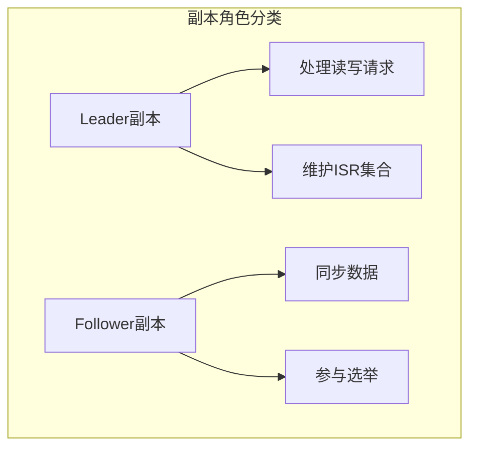

副本配置示例：

```properties
# 副本基础配置
num.replica.fetchers=4
replica.lag.time.max.ms=10000
replica.fetch.min.bytes=1
replica.fetch.max.bytes=1048576
replica.fetch.wait.max.ms=500
```

### 1.2 副本状态

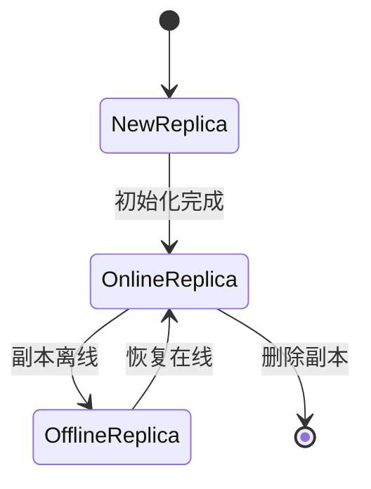

副本状态检查命令：

```bash
# 查看副本状态
bin/kafka-topics.sh --describe \
    --bootstrap-server localhost:9092 \
    --topic my-topic

# 查看副本同步状态
bin/kafka-replica-verification.sh \
    --bootstrap-server localhost:9092 \
    --topic-white-list my-topic
```

### 1.3 副本分配

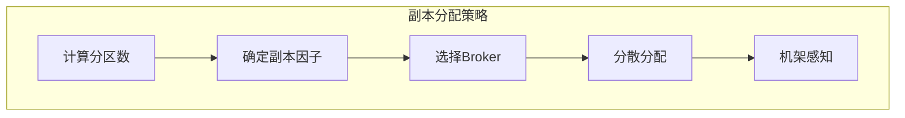

副本分配代码示例：

```java
public class ReplicaAssignment {
    public Map<Integer, List<Integer>> assignReplicas(
            List<Integer> brokerIds,
            int numPartitions,
            int replicationFactor) {
        
        Map<Integer, List<Integer>> assignment = new HashMap<>();
        for (int partitionId = 0; partitionId < numPartitions; partitionId++) {
            List<Integer> replicas = new ArrayList<>();
            // 选择起始broker
            int startIndex = partitionId % brokerIds.size();
            // 分配副本
            for (int i = 0; i < replicationFactor; i++) {
                int brokerIndex = (startIndex + i) % brokerIds.size();
                replicas.add(brokerIds.get(brokerIndex));
            }
            assignment.put(partitionId, replicas);
        }
        return assignment;
    }
}
```

## 2. 副本同步机制

### 2.1 同步流程

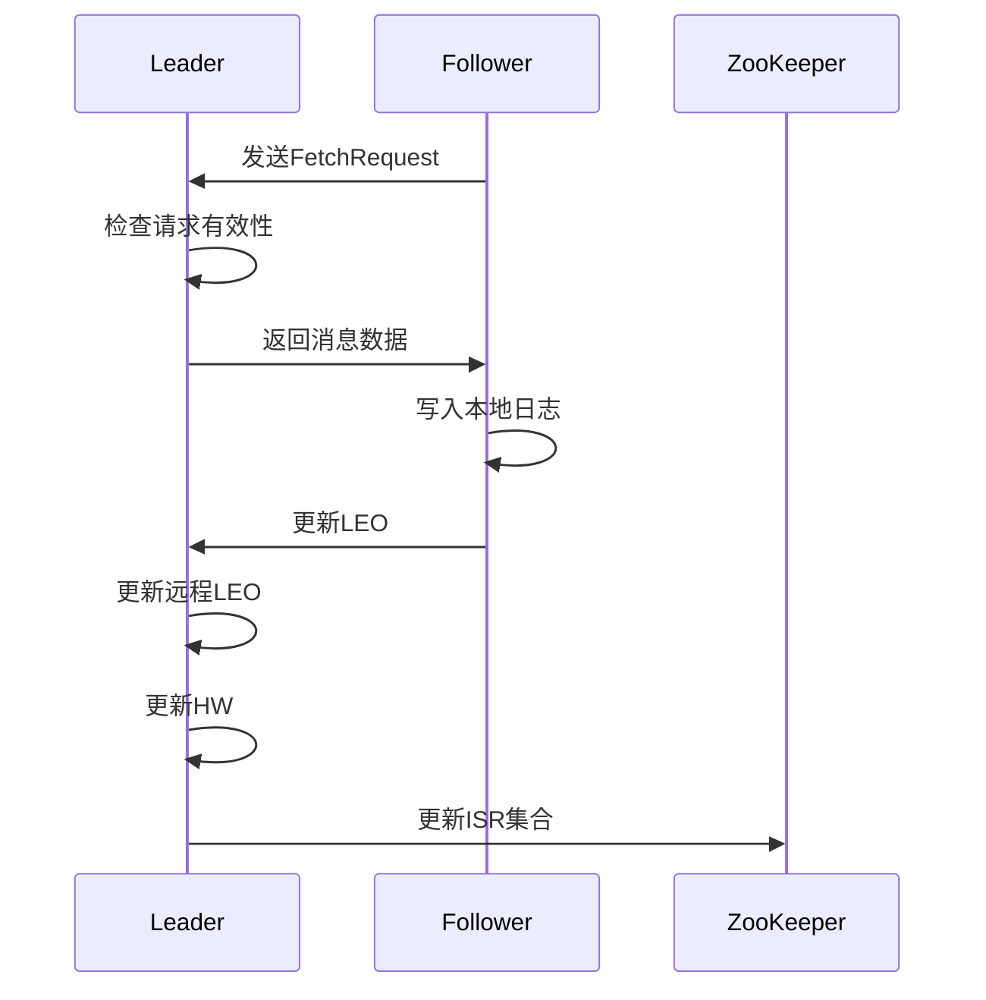

同步配置示例：

```properties
# 同步相关配置
replica.fetch.max.bytes=1048576
replica.fetch.wait.max.ms=500
replica.high.watermark.checkpoint.interval.ms=5000
replica.lag.time.max.ms=10000
```

### 2.2 ISR管理

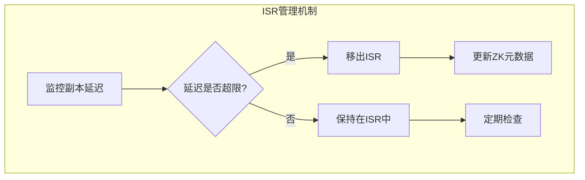

ISR管理代码示例：

```java
public class ISRManager {
    private final long replicaLagTimeMaxMs;
    private final Set<Integer> isrSet;
    
    public void updateISR() {
        long now = time.milliseconds();
        Iterator<Integer> it = isrSet.iterator();
        
        while (it.hasNext()) {
            Integer replicaId = it.next();
            long lastCaughtUpTimeMs = replicaLastCaughtUpTimeMs.get(replicaId);
            
            if (now - lastCaughtUpTimeMs > replicaLagTimeMaxMs) {
                it.remove(); // 从ISR中移除
                updateZkIsrChange(); // 更新ZK
            }
        }
    }
}
```

### 2.3 HW和LEO

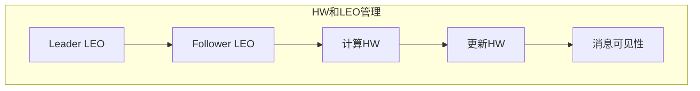

## 3. Leader选举机制

### 3.1 选举触发条件

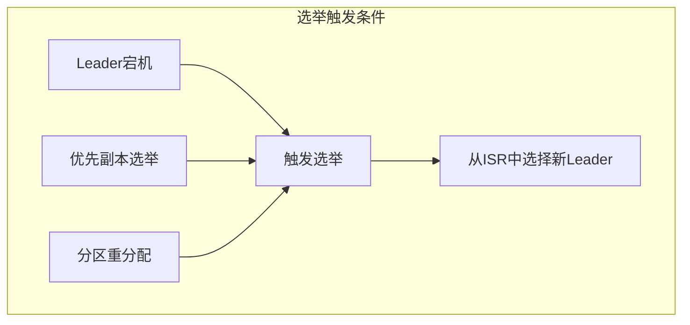

### 3.2 选举流程

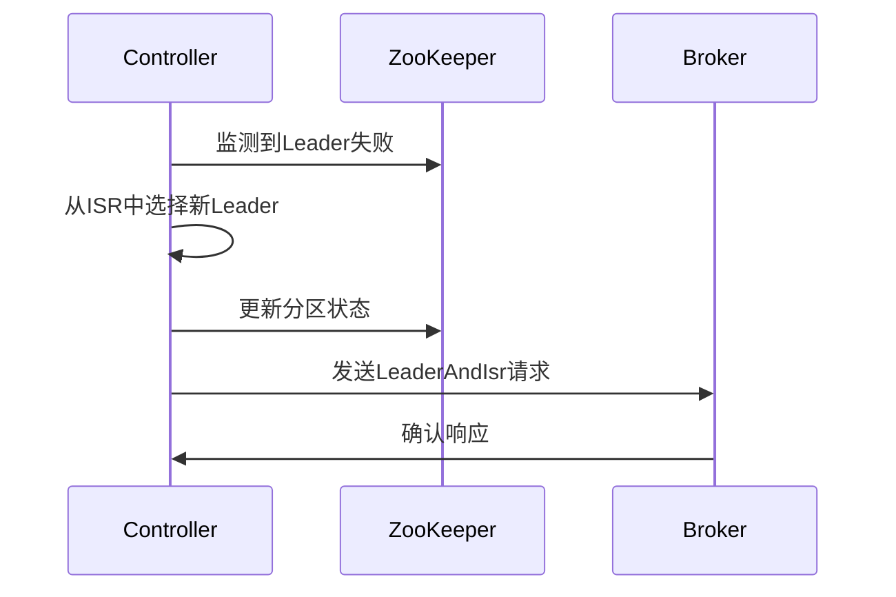

Leader选举代码示例：

```java
public class LeaderElector {
    public int electLeader(int partitionId, List<Integer> isr) {
        if (isr.isEmpty()) {
            throw new NoReplicaInSyncException();
        }
        
        // 从ISR中选择第一个可用的副本作为Leader
        for (Integer replicaId : isr) {
            if (isReplicaAlive(replicaId)) {
                return replicaId;
            }
        }
        
        throw new NoAvailableLeaderException();
    }
}
```

### 3.3 优先副本选举

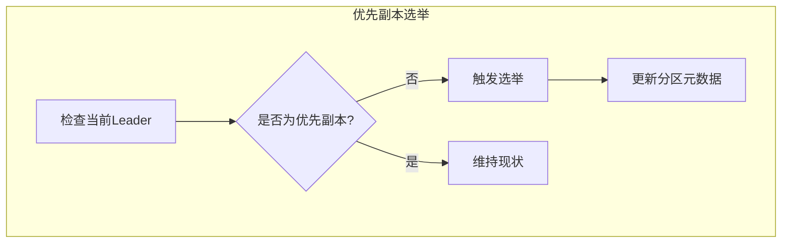

优先副本选举命令：

```bash
# 创建选举计划文件
cat > election-plan.json <<EOF
{
  "partitions": [
    {"topic": "my-topic", "partition": 0},
    {"topic": "my-topic", "partition": 1}
  ]
}
EOF

# 执行优先副本选举
bin/kafka-preferred-replica-election.sh \
    --bootstrap-server localhost:9092 \
    --path-to-json-file election-plan.json
```

## 4. 副本故障处理

### 4.1 故障检测

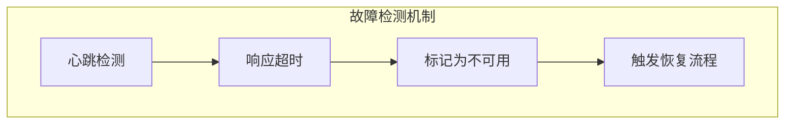

故障检测配置：

```properties
# 故障检测相关配置
replica.lag.time.max.ms=30000
replica.socket.timeout.ms=30000
replica.socket.receive.buffer.bytes=65536
```

### 4.2 故障恢复

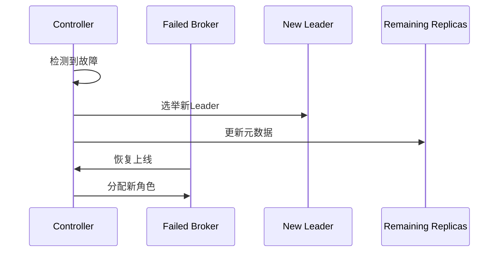

### 4.3 数据一致性

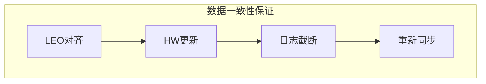

## 5. 副本管理最佳实践

### 5.1 配置优化

关键配置参数：

```properties
# 副本管理优化配置
num.replica.fetchers=4
replica.fetch.max.bytes=1048576
replica.fetch.wait.max.ms=500
replica.lag.time.max.ms=10000
min.insync.replicas=2
```

### 5.2 监控告警

监控指标示例：

```java
public class ReplicationMetrics {
    // ISR大小变化
    public void monitorISRSize(String topic, int partition, int isrSize) {
        if (isrSize < minInsyncReplicas) {
            alertService.sendAlert(
                String.format("Topic %s partition %d ISR size (%d) below minimum",
                    topic, partition, isrSize)
            );
        }
    }
    
    // 副本延迟监控
    public void monitorReplicaLag(int replicaId, long lagMs) {
        if (lagMs > replicaLagTimeMaxMs) {
            alertService.sendAlert(
                String.format("Replica %d lag (%d ms) exceeds maximum",
                    replicaId, lagMs)
            );
        }
    }
}
```

### 5.3 运维管理

1. **副本因子设置建议**
   - 重要数据建议设置3个副本
   - 考虑存储成本和可靠性平衡
   - 监控副本同步状态

2. **分区平衡建议**
   - 定期检查分区分布
   - 避免副本分配不均
   - 合理使用分区重分配工具

3. **故障处理流程**
   - 建立故障响应机制
   - 定期进行故障演练
   - 保持操作文档更新

4. **性能优化建议**
   - 优化网络配置
   - 调整副本同步参数
   - 监控同步延迟
```

