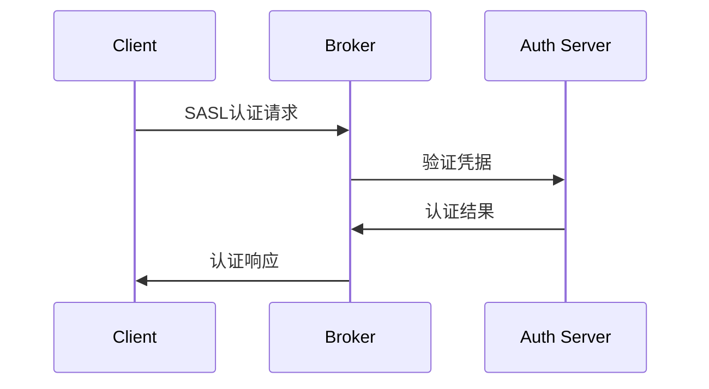
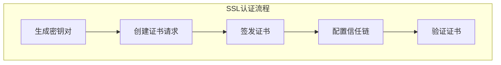
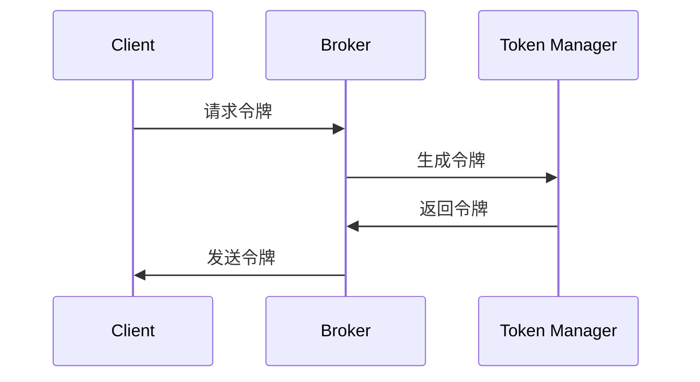
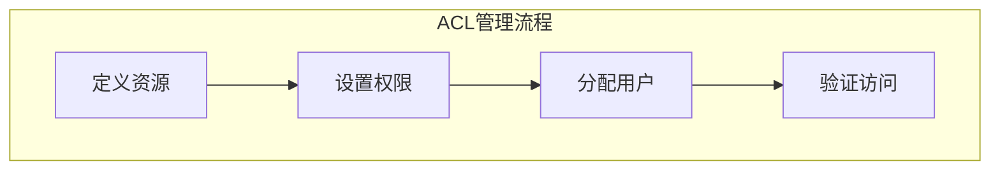
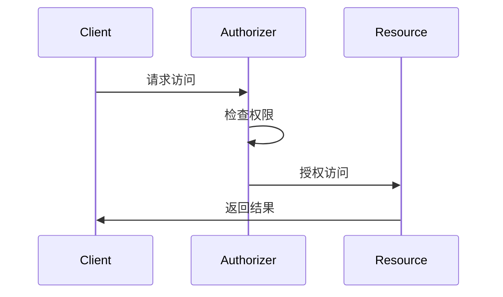
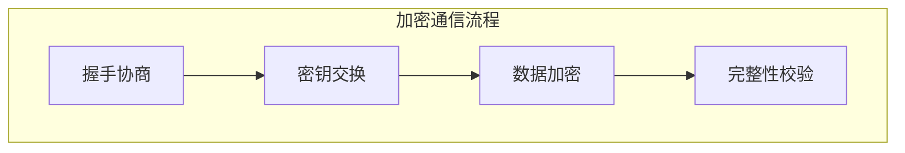
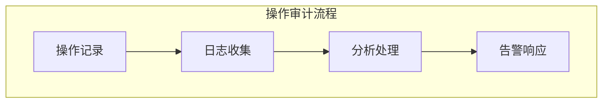
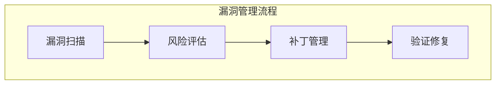

# Kafka 安全管理详解

## 目录
- [1. 认证机制](#1-认证机制)
  - [1.1 SASL认证](#11-sasl认证)
  - [1.2 SSL认证](#12-ssl认证)
  - [1.3 委托令牌](#13-委托令牌)
- [2. 授权管理](#2-授权管理)
  - [2.1 ACL配置](#21-acl配置)
  - [2.2 角色管理](#22-角色管理)
  - [2.3 权限控制](#23-权限控制)
- [3. 传输加密](#3-传输加密)
  - [3.1 SSL/TLS配置](#31-ssltls配置)
  - [3.2 加密机制](#32-加密机制)
  - [3.3 证书管理](#33-证书管理)
- [4. 安全审计](#4-安全审计)
  - [4.1 审计日志](#41-审计日志)
  - [4.2 操作追踪](#42-操作追踪)
  - [4.3 合规管理](#43-合规管理)
- [5. 安全运维](#5-安全运维)
  - [5.1 安全加固](#51-安全加固)
  - [5.2 漏洞管理](#52-漏洞管理)
  - [5.3 应急响应](#53-应急响应)

## 1. 认证机制

### 1.1 SASL认证



SASL配置示例：

```properties
# server.properties
listeners=SASL_PLAINTEXT://host.name:9092
security.protocol=SASL_PLAINTEXT
sasl.enabled.mechanisms=PLAIN,SCRAM-SHA-256
sasl.mechanism.inter.broker.protocol=PLAIN

# JAAS配置
sasl.jaas.config=org.apache.kafka.common.security.plain.PlainLoginModule required \
    username="admin" \
    password="admin-secret" \
    user_admin="admin-secret" \
    user_alice="alice-secret";
```

SASL认证实现：

```java
public class SaslAuthenticator {
    private final LoginContext loginContext;
    
    public void authenticate(String username, String password) {
        try {
            // 创建回调处理器
            CallbackHandler handler = new NamePasswordCallbackHandler(
                username, password);
            
            // 执行登录
            loginContext = new LoginContext("KafkaClient", handler);
            loginContext.login();
            
            // 获取Subject
            Subject subject = loginContext.getSubject();
            
            // 验证权限
            verifyPermissions(subject);
            
        } catch (LoginException e) {
            throw new AuthenticationException("SASL authentication failed", e);
        }
    }
}
```

### 1.2 SSL认证



SSL配置生成脚本：

```bash
#!/bin/bash
# 生成SSL证书和密钥

# 生成CA密钥和证书
openssl req -new -x509 -keyout ca-key -out ca-cert -days 365 \
    -subj "/CN=Kafka-Security-CA/OU=Dev/O=Company/L=City/ST=State/C=US"

# 生成服务器密钥
keytool -keystore kafka.server.keystore.jks -alias localhost \
    -validity 365 -genkey -keyalg RSA \
    -dname "CN=kafka.example.com,OU=Dev,O=Company,L=City,ST=State,C=US"

# 生成证书签名请求
keytool -keystore kafka.server.keystore.jks -alias localhost \
    -certreq -file cert-request

# 使用CA签发证书
openssl x509 -req -CA ca-cert -CAkey ca-key -in cert-request \
    -out cert-signed -days 365 -CAcreateserial

# 导入CA证书和签名证书
keytool -keystore kafka.server.keystore.jks -alias CARoot \
    -import -file ca-cert
keytool -keystore kafka.server.keystore.jks -alias localhost \
    -import -file cert-signed
```

### 1.3 委托令牌



令牌管理实现：

```java
public class TokenManager {
    private final SecureRandom random;
    private final Map<String, TokenInfo> tokenStore;
    
    public String generateToken(String username, long expiryTime) {
        // 生成令牌
        byte[] tokenBytes = new byte[32];
        random.nextBytes(tokenBytes);
        String token = Base64.getEncoder().encodeToString(tokenBytes);
        
        // 存储令牌信息
        TokenInfo info = new TokenInfo(username, expiryTime);
        tokenStore.put(token, info);
        
        return token;
    }
    
    public boolean validateToken(String token) {
        TokenInfo info = tokenStore.get(token);
        if (info == null) {
            return false;
        }
        
        // 检查过期时间
        if (System.currentTimeMillis() > info.getExpiryTime()) {
            tokenStore.remove(token);
            return false;
        }
        
        return true;
    }
}
```

## 2. 授权管理

### 2.1 ACL配置



ACL配置命令：

```bash
# 添加ACL
bin/kafka-acls.sh --bootstrap-server localhost:9092 \
    --add --allow-principal User:Alice \
    --operation Read --operation Write \
    --topic test-topic

# 列出ACL
bin/kafka-acls.sh --bootstrap-server localhost:9092 \
    --list

# 删除ACL
bin/kafka-acls.sh --bootstrap-server localhost:9092 \
    --remove --allow-principal User:Alice \
    --operation Read --operation Write \
    --topic test-topic
```

### 2.2 角色管理

角色管理实现：

```java
public class RoleManager {
    private final Map<String, Set<Permission>> rolePermissions;
    private final Map<String, Set<String>> userRoles;
    
    public void assignRole(String username, String role) {
        userRoles.computeIfAbsent(username, k -> new HashSet<>())
            .add(role);
    }
    
    public boolean hasPermission(String username, Permission permission) {
        Set<String> roles = userRoles.get(username);
        if (roles == null) {
            return false;
        }
        
        return roles.stream()
            .anyMatch(role -> rolePermissions.get(role)
                .contains(permission));
    }
}
```

### 2.3 权限控制



## 3. 传输加密

### 3.1 SSL/TLS配置

SSL配置示例：

```properties
# SSL配置
ssl.keystore.location=/path/to/kafka.server.keystore.jks
ssl.keystore.password=test1234
ssl.key.password=test1234
ssl.truststore.location=/path/to/kafka.server.truststore.jks
ssl.truststore.password=test1234
ssl.client.auth=required
ssl.enabled.protocols=TLSv1.2,TLSv1.3
ssl.cipher.suites=TLS_AES_256_GCM_SHA384
```

### 3.2 加密机制



### 3.3 证书管理

证书管理工具：

```java
public class CertificateManager {
    private final KeyStore keyStore;
    private final KeyStore trustStore;
    
    public void importCertificate(String alias, X509Certificate cert) {
        try {
            // 导入证书
            trustStore.setCertificateEntry(alias, cert);
            
            // 保存信任库
            try (FileOutputStream fos = new FileOutputStream(trustStorePath)) {
                trustStore.store(fos, trustStorePassword);
            }
        } catch (Exception e) {
            throw new SecurityException("Failed to import certificate", e);
        }
    }
    
    public void renewCertificate(String alias) {
        try {
            // 生成新的密钥对
            KeyPairGenerator generator = KeyPairGenerator.getInstance("RSA");
            KeyPair keyPair = generator.generateKeyPair();
            
            // 创建证书请求
            PKCS10CertificationRequest csr = generateCSR(alias, keyPair);
            
            // 签发新证书
            X509Certificate newCert = signCertificate(csr);
            
            // 更新密钥库
            keyStore.setKeyEntry(alias, keyPair.getPrivate(), 
                keyPassword, new Certificate[]{newCert});
                
        } catch (Exception e) {
            throw new SecurityException("Failed to renew certificate", e);
        }
    }
}
```

## 4. 安全审计

### 4.1 审计日志

审计日志配置：

```properties
# 审计日志配置
audit.logs.enabled=true
audit.logs.destination=FILE
audit.logs.path=/var/log/kafka/audit.log
audit.logs.max.size=100MB
audit.logs.max.backup.index=10
```

### 4.2 操作追踪



### 4.3 合规管理

合规检查实现：

```java
public class ComplianceChecker {
    private final AuditLogger auditLogger;
    private final AlertService alertService;
    
    public void checkCompliance() {
        // 检查认证配置
        checkAuthenticationCompliance();
        
        // 检查加密配置
        checkEncryptionCompliance();
        
        // 检查权限配置
        checkAuthorizationCompliance();
        
        // 检查审计日志
        checkAuditLogCompliance();
    }
    
    private void checkAuthenticationCompliance() {
        // 检查SASL配置
        if (!isSaslEnabled()) {
            reportViolation("SASL authentication not enabled");
        }
        
        // 检查SSL配置
        if (!isSslEnabled()) {
            reportViolation("SSL encryption not enabled");
        }
    }
}
```

## 5. 安全运维

### 5.1 安全加固

系统加固脚本：

```bash
#!/bin/bash
# Kafka安全加固脚本

# 设置文件权限
chmod 600 config/server.properties
chmod 600 config/*.keystore
chmod 600 config/*.truststore

# 禁用不安全的协议
sed -i 's/PLAINTEXT/SSL/g' config/server.properties

# 配置防火墙
iptables -A INPUT -p tcp --dport 9092 -j ACCEPT
iptables -A INPUT -p tcp --dport 9093 -j ACCEPT

# 设置日志权限
chmod 644 /var/log/kafka/
chown kafka:kafka /var/log/kafka/
```

### 5.2 漏洞管理



### 5.3 应急响应

应急响应流程：

```java
public class SecurityIncidentHandler {
    private final IncidentLogger logger;
    private final NotificationService notifier;
    
    public void handleSecurityIncident(SecurityIncident incident) {
        // 记录事件
        logger.logIncident(incident);
        
        // 评估严重性
        SeverityLevel severity = assessSeverity(incident);
        
        // 执行响应
        switch (severity) {
            case CRITICAL:
                handleCriticalIncident(incident);
                break;
            case HIGH:
                handleHighIncident(incident);
                break;
            case MEDIUM:
                handleMediumIncident(incident);
                break;
            default:
                handleLowIncident(incident);
        }
        
        // 通知相关人员
        notifier.notifySecurityTeam(incident);
    }
}
```

## 最佳实践建议

1. **认证建议**
   - 使用强认证机制
   - 定期轮换密钥
   - 安全存储凭据
   - 监控认证失败

2. **授权建议**
   - 最小权限原则
   - 定期审查权限
   - 及时撤销权限
   - 记录权限变更

3. **加密建议**
   - 使用强加密算法
   - 安全管理密钥
   - 定期更新证书
   - 禁用不安全协议

4. **审计建议**
   - 全面记录操作
   - 保护审计日志
   - 定期分析日志
   - 及时响应异常
```

