# Kafka 消息存储机制详解

## 目录
- [1. 存储架构设计](#1-存储架构设计)
  - [1.1 存储层次](#11-存储层次)
  - [1.2 文件组织](#12-文件组织)
  - [1.3 目录结构](#13-目录结构)
- [2. 日志文件管理](#2-日志文件管理)
  - [2.1 日志分段](#21-日志分段)
  - [2.2 日志索引](#22-日志索引)
  - [2.3 日志清理](#23-日志清理)
- [3. 消息写入机制](#3-消息写入机制)
  - [3.1 写入流程](#31-写入流程)
  - [3.2 刷盘策略](#32-刷盘策略)
  - [3.3 性能优化](#33-性能优化)
- [4. 消息读取机制](#4-消息读取机制)
  - [4.1 读取流程](#41-读取流程)
  - [4.2 缓存机制](#42-缓存机制)
  - [4.3 性能优化](#43-性能优化)
- [5. 存储可靠性](#5-存储可靠性)
  - [5.1 副本机制](#51-副本机制)
  - [5.2 一致性保证](#52-一致性保证)
  - [5.3 故障恢复](#53-故障恢复)

## 1. 存储架构设计

### 1.1 存储层次

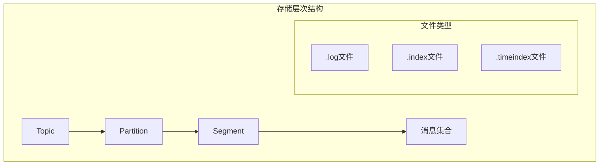

### 1.2 文件组织

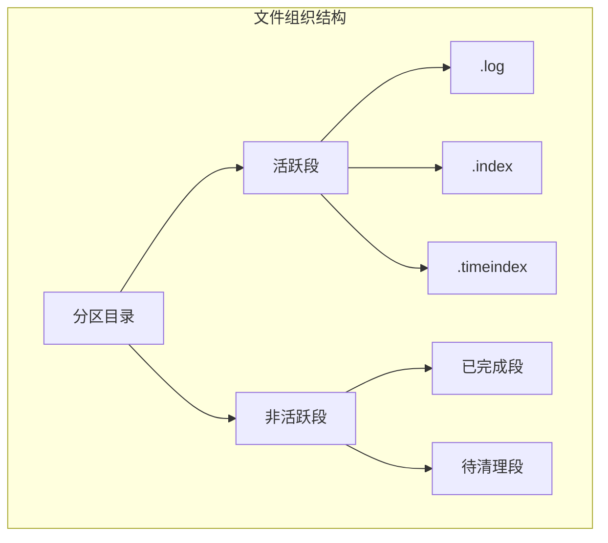

### 1.3 目录结构

目录结构示例：

```bash
/kafka-logs/
├── my-topic-0/
│   ├── 00000000000000000000.log
│   ├── 00000000000000000000.index
│   ├── 00000000000000000000.timeindex
│   ├── 00000000000000123456.log
│   ├── 00000000000000123456.index
│   ├── 00000000000000123456.timeindex
│   └── leader-epoch-checkpoint
├── my-topic-1/
│   └── ...
└── replication-offset-checkpoint
```

存储配置示例：

```properties
# 存储基础配置
log.dirs=/data/kafka-logs
log.segment.bytes=1073741824
log.retention.hours=168
log.retention.bytes=-1
log.cleanup.policy=delete
```

## 2. 日志文件管理

### 2.1 日志分段

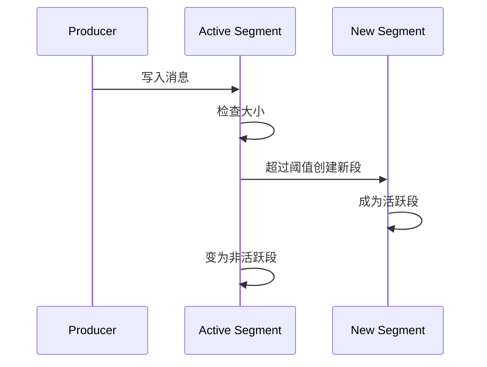

分段管理代码示例：

```java
public class LogSegmentManager {
    private final long maxSegmentBytes;
    private LogSegment activeSegment;
    
    public void roll() {
        if (activeSegment.size() >= maxSegmentBytes) {
            // 关闭当前活跃段
            activeSegment.close();
            // 创建新的活跃段
            activeSegment = new LogSegment(
                baseOffset + size(),
                time.milliseconds()
            );
        }
    }
}
```

### 2.2 日志索引

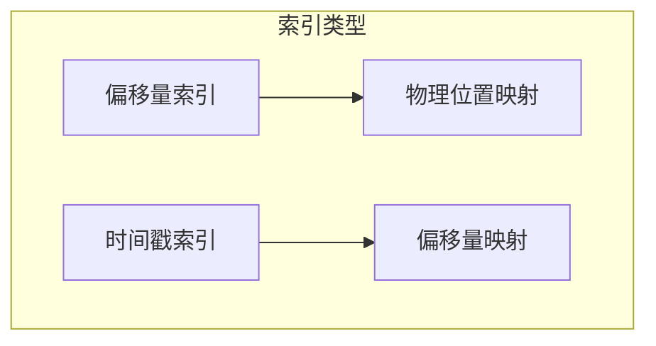

索引项结构：

```java
public class OffsetIndex {
    // 偏移量索引项结构
    private static final int OFFSET_LENGTH = 8;    // 相对偏移量
    private static final int POSITION_LENGTH = 4;  // 物理位置
    
    public void append(long offset, int position) {
        buffer.putLong(offset);  // 写入偏移量
        buffer.putInt(position); // 写入位置
    }
}
```

### 2.3 日志清理

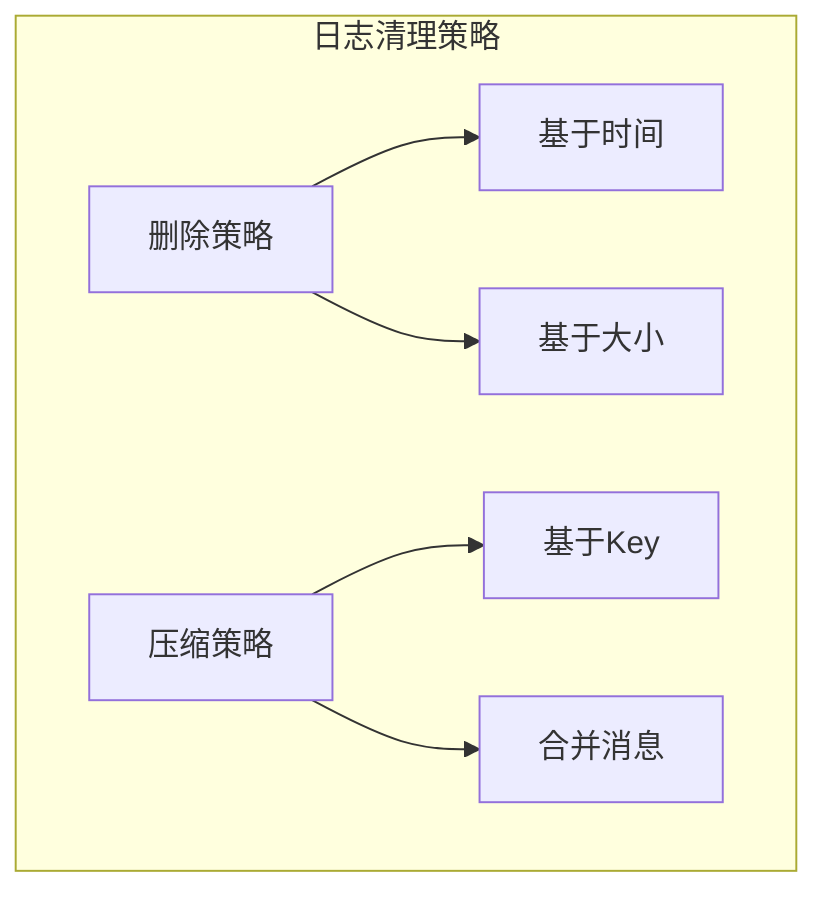

清理配置示例：

```properties
# 日志清理配置
log.cleanup.policy=delete,compact
log.cleaner.min.cleanable.ratio=0.5
log.cleaner.threads=1
log.cleaner.dedupe.buffer.size=134217728
```

## 3. 消息写入机制

### 3.1 写入流程

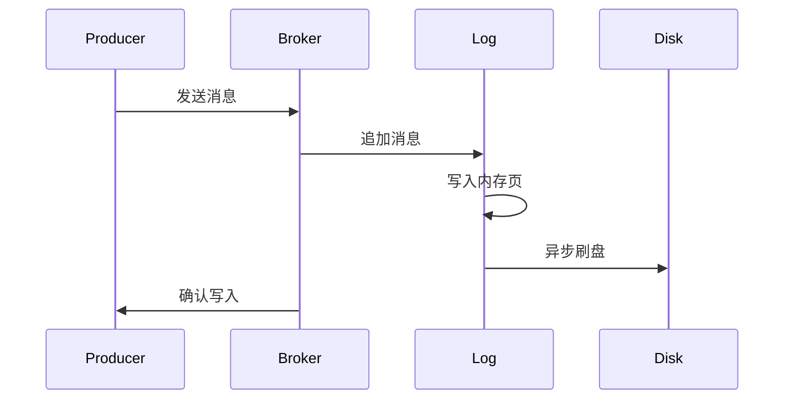

写入代码示例：

```java
public class LogAppender {
    public void append(ByteBuffer records) {
        // 验证消息
        validateMessages(records);
        
        // 写入消息
        long offset = log.appendAsLeader(records, leaderEpoch);
        
        // 更新索引
        updateIndex(offset, records.position());
        
        // 触发刷盘
        maybeFlush();
    }
}
```

### 3.2 刷盘策略

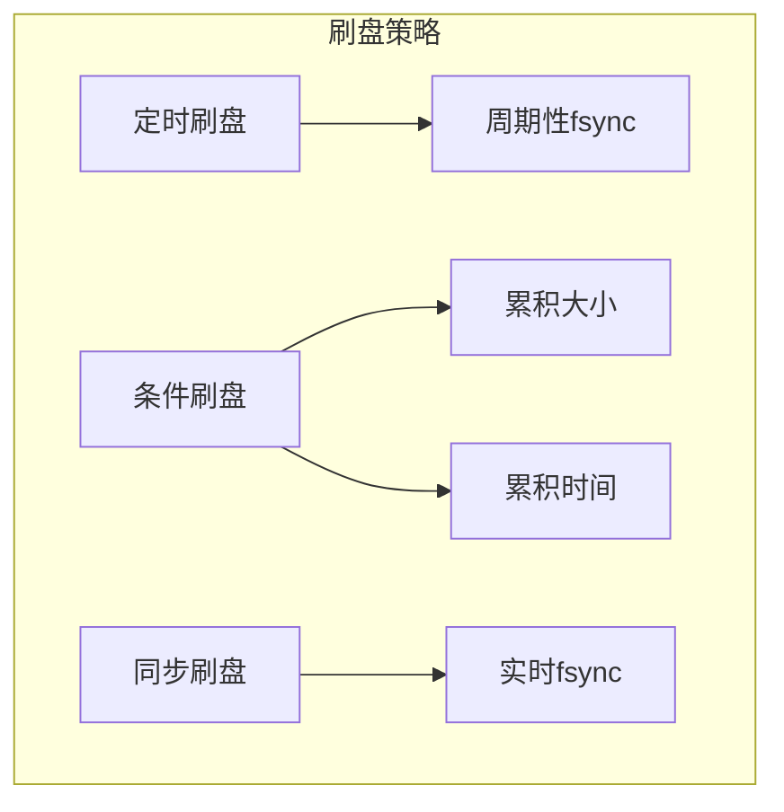

刷盘配置：

```properties
# 刷盘相关配置
log.flush.interval.messages=10000
log.flush.interval.ms=1000
log.flush.scheduler.interval.ms=2000
```

### 3.3 性能优化

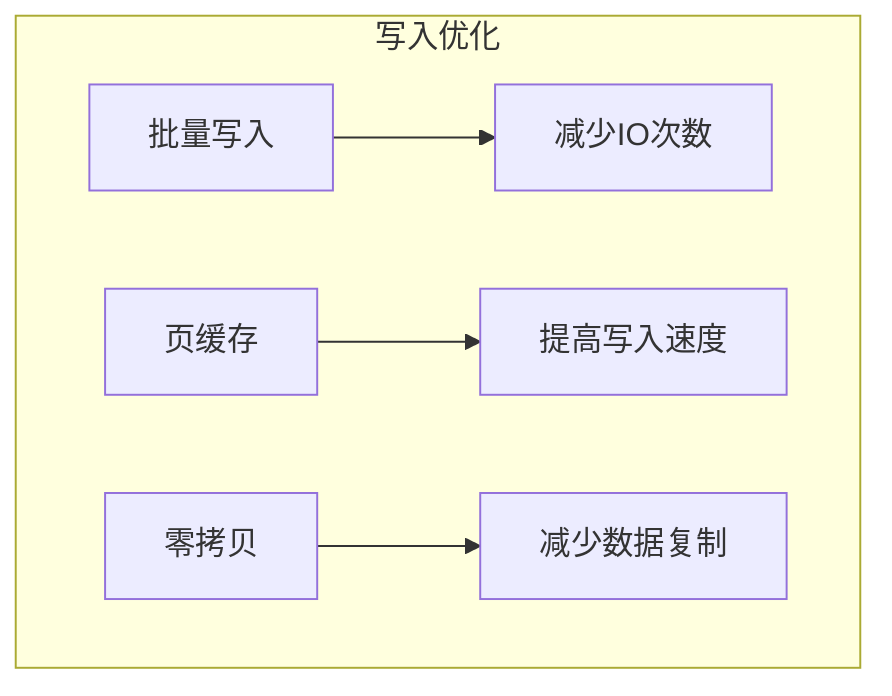

## 4. 消息读取机制

### 4.1 读取流程

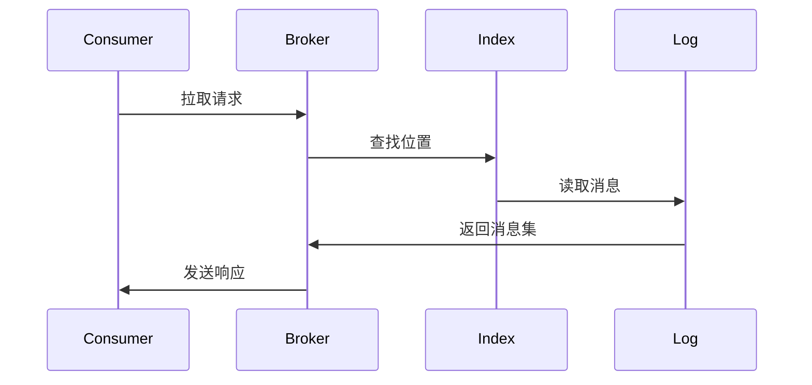

读取代码示例：

```java
public class LogReader {
    public FetchDataInfo read(long offset, int maxBytes) {
        // 查找段
        LogSegment segment = segments.find(offset);
        
        // 查找位置
        int position = segment.index.lookup(offset);
        
        // 读取消息
        ByteBuffer messages = segment.read(position, maxBytes);
        
        return new FetchDataInfo(offset, messages);
    }
}
```

### 4.2 缓存机制

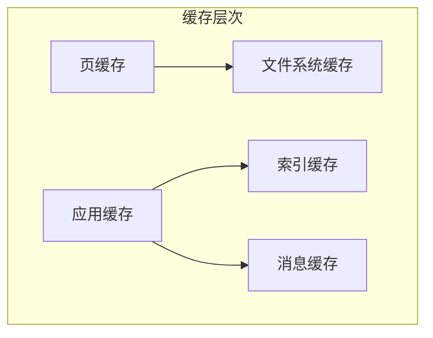

缓存配置：

```properties
# 缓存相关配置
log.index.interval.bytes=4096
log.index.size.max.bytes=10485760
replica.fetch.max.bytes=1048576
```

### 4.3 性能优化

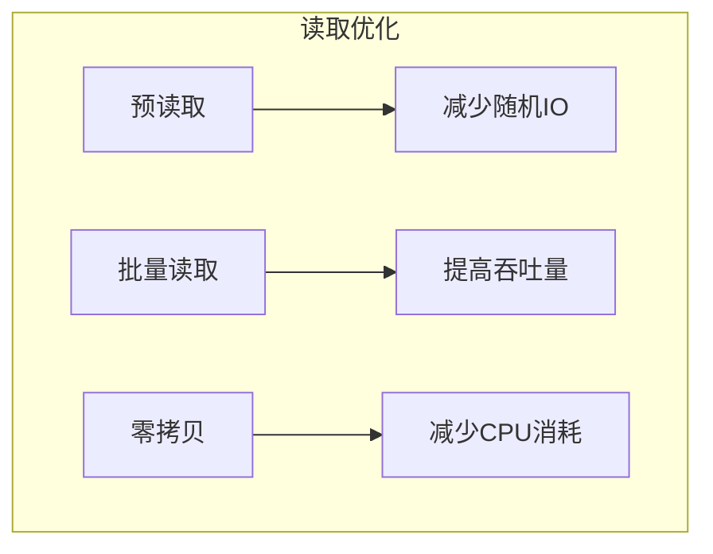

## 5. 存储可靠性

### 5.1 副本机制

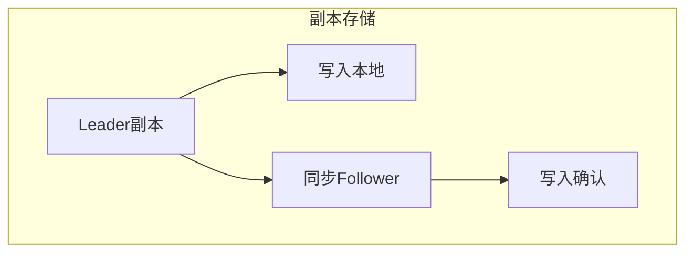

副本配置：

```properties
# 副本相关配置
num.replica.fetchers=4
replica.fetch.min.bytes=1
replica.fetch.max.bytes=1048576
replica.high.watermark.checkpoint.interval.ms=5000
```

### 5.2 一致性保证

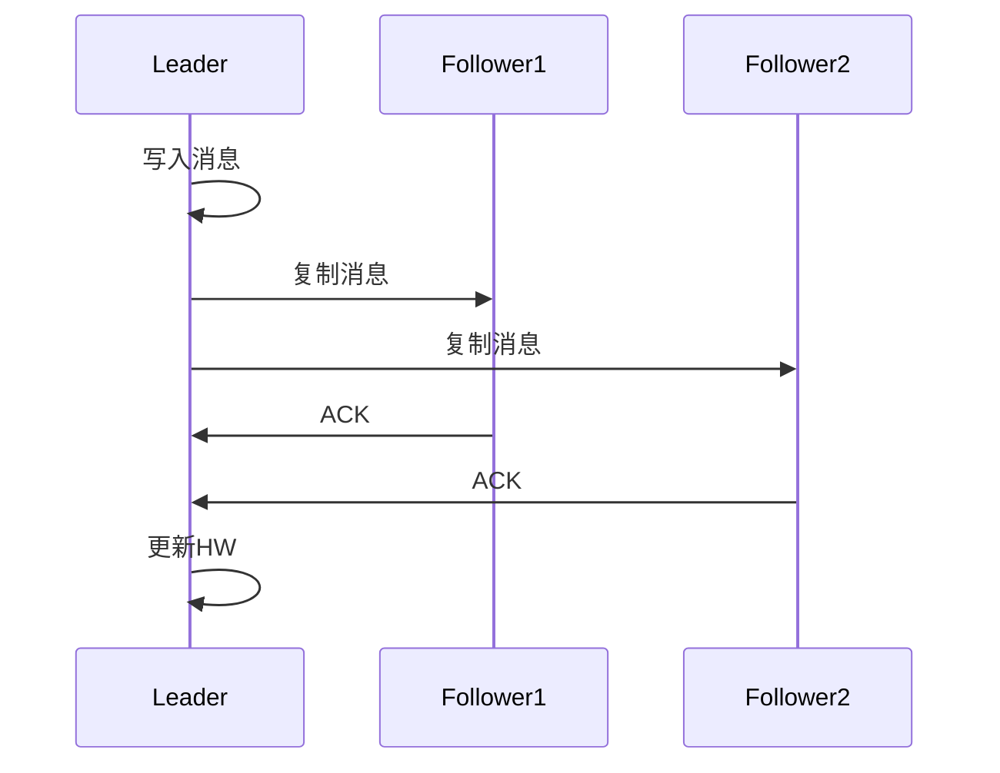

### 5.3 故障恢复


## 最佳实践建议

1. **存储配置优化**
   - 合理设置日志段大小
   - 配置适当的保留策略
   - 启用日志压缩
   - 监控磁盘使用情况

2. **性能优化建议**
   - 使用SSD存储
   - 启用零拷贝
   - 合理配置刷盘策略
   - 优化文件系统参数

3. **可靠性保证**
   - 配置足够的副本数
   - 启用同步复制
   - 定期备份数据
   - 监控复制状态

4. **运维建议**
   - 定期清理过期数据
   - 监控存储指标
   - 做好容量规划
   - 及时处理故障
```
