# Kafka 事务与一致性机制详解

## 目录
- [1. 事务基础](#1-事务基础)
  - [1.1 事务概念](#11-事务概念)
  - [1.2 事务保证](#12-事务保证)
  - [1.3 事务限制](#13-事务限制)
- [2. 事务实现机制](#2-事务实现机制)
  - [2.1 事务协调器](#21-事务协调器)
  - [2.2 事务日志](#22-事务日志)
  - [2.3 事务状态管理](#23-事务状态管理)
- [3. 事务操作流程](#3-事务操作流程)
  - [3.1 事务初始化](#31-事务初始化)
  - [3.2 事务提交](#32-事务提交)
  - [3.3 事务回滚](#33-事务回滚)
- [4. 一致性保证](#4-一致性保证)
  - [4.1 消息一致性](#41-消息一致性)
  - [4.2 读取一致性](#42-读取一致性)
  - [4.3 故障恢复](#43-故障恢复)
- [5. 最佳实践](#5-最佳实践)
  - [5.1 配置建议](#51-配置建议)
  - [5.2 性能优化](#52-性能优化)
  - [5.3 监控告警](#53-监控告警)

## 1. 事务基础

### 1.1 事务概念

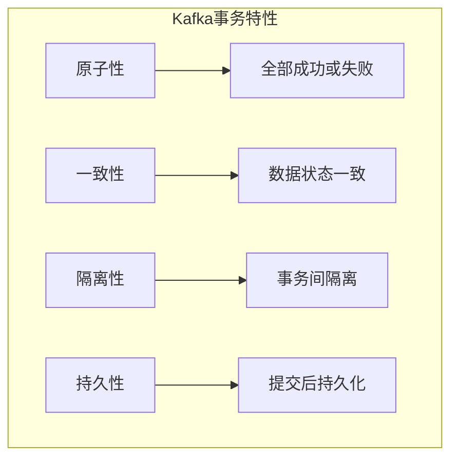

事务配置示例：

```properties
# 事务基础配置
transaction.timeout.ms=900000
transaction.max.timeout.ms=900000
transactional.id.expiration.ms=604800000
```

### 1.2 事务保证

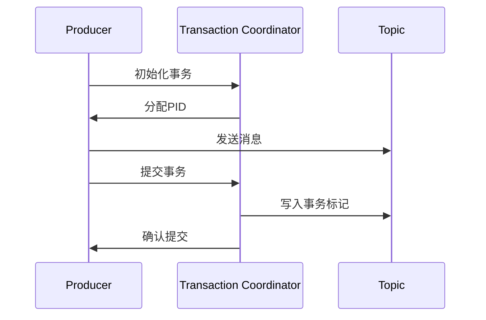

### 1.3 事务限制

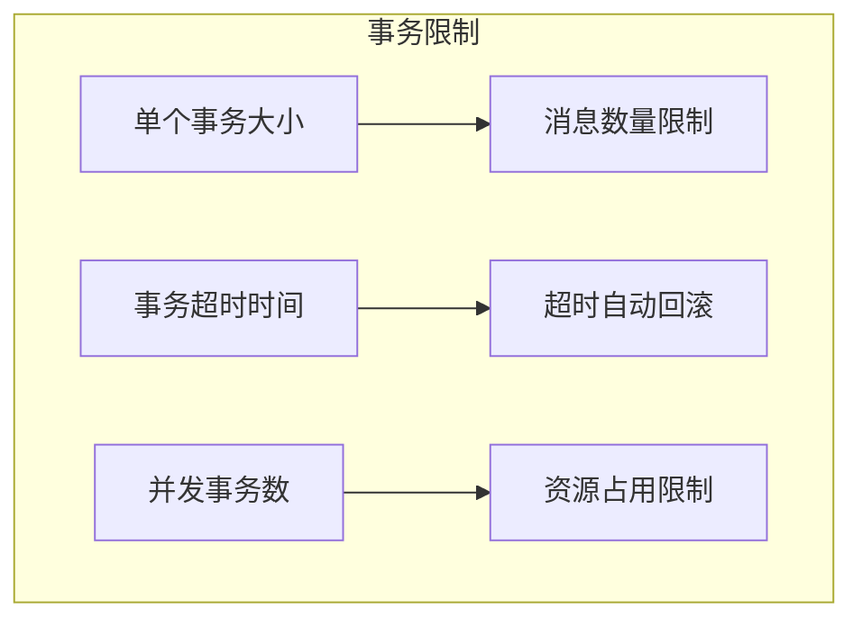

## 2. 事务实现机制

### 2.1 事务协调器

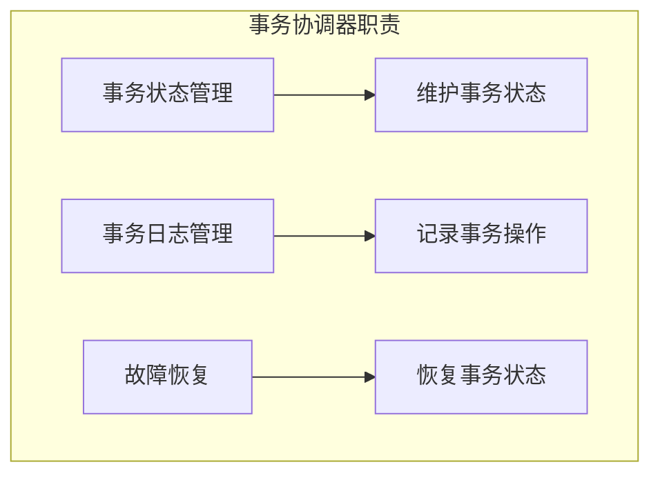

事务协调器代码示例：

```java
public class TransactionCoordinator {
    private final TransactionStateManager stateManager;
    private final ProducerStateManager producerState;
    
    public TransactionResult handleInitPid(String transactionalId) {
        // 验证事务ID
        validateTransactionalId(transactionalId);
        
        // 分配PID
        long pid = producerState.allocateProducerId();
        
        // 初始化事务状态
        TransactionMetadata metadata = new TransactionMetadata(
            transactionalId,
            pid,
            TransactionState.EMPTY
        );
        
        // 保存事务元数据
        stateManager.putTransactionState(metadata);
        
        return new TransactionResult(pid, epoch);
    }
}
```

### 2.2 事务日志

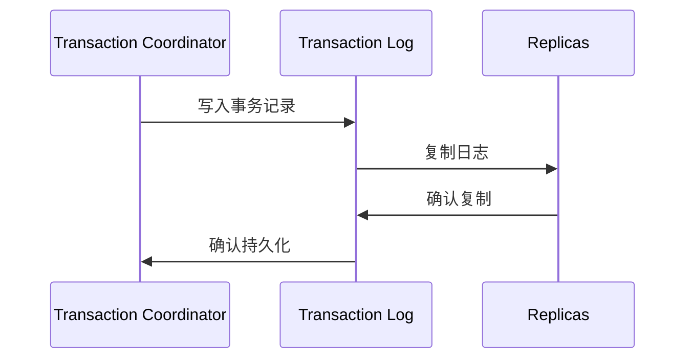

事务日志结构：

```java
public class TransactionLog {
    public static class TxnLogEntry {
        private final String transactionalId;
        private final long producerId;
        private final short epoch;
        private final TransactionState state;
        private final long timestamp;
        
        // 事务日志条目
        public byte[] serialize() {
            ByteBuffer buffer = ByteBuffer.allocate(1024);
            buffer.putLong(timestamp);
            buffer.putString(transactionalId);
            buffer.putLong(producerId);
            buffer.putShort(epoch);
            buffer.putInt(state.id);
            return buffer.array();
        }
    }
}
```

### 2.3 事务状态管理

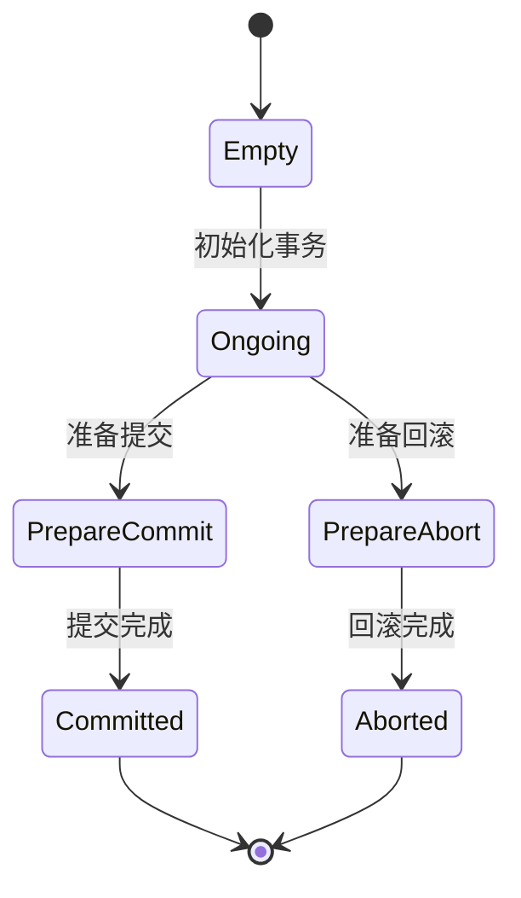

## 3. 事务操作流程

### 3.1 事务初始化

事务生产者示例：

```java
public class TransactionalProducer {
    public void initializeTransaction() {
        Properties props = new Properties();
        props.put("bootstrap.servers", "localhost:9092");
        props.put("transactional.id", "my-transactional-id");
        props.put("enable.idempotence", true);
        
        Producer<String, String> producer = new KafkaProducer<>(props);
        
        // 初始化事务
        producer.initTransactions();
        
        try {
            // 开始事务
            producer.beginTransaction();
            
            // 发送消息
            producer.send(new ProducerRecord<>("topic", "key", "value"));
            
            // 提交事务
            producer.commitTransaction();
        } catch (Exception e) {
            // 回滚事务
            producer.abortTransaction();
            throw e;
        }
    }
}
```

### 3.2 事务提交

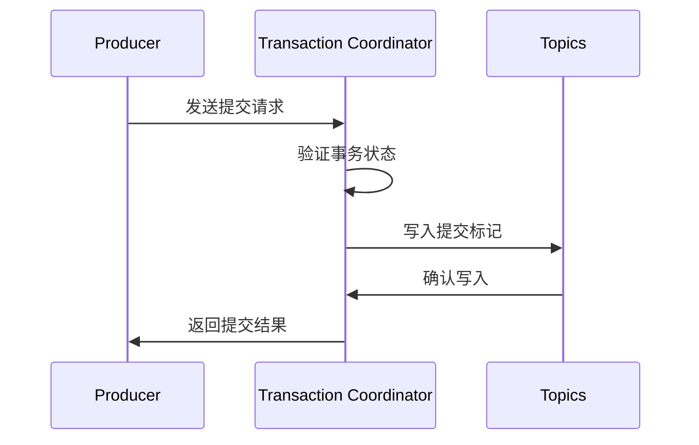

### 3.3 事务回滚

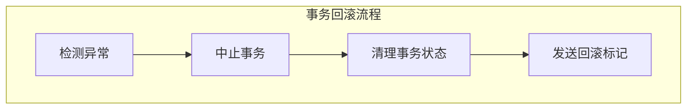

## 4. 一致性保证

### 4.1 消息一致性

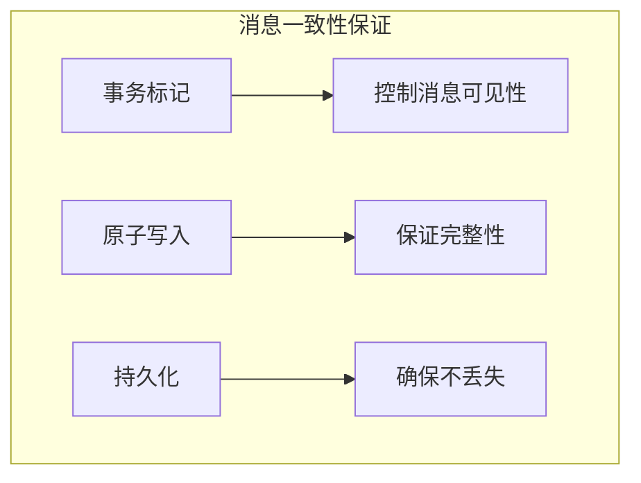

消费者事务配置：

```properties
# 消费者事务配置
isolation.level=read_committed
enable.auto.commit=false
```

### 4.2 读取一致性

事务消费者示例：

```java
public class TransactionalConsumer {
    public void consumeTransactionalMessages() {
        Properties props = new Properties();
        props.put("bootstrap.servers", "localhost:9092");
        props.put("group.id", "my-group");
        props.put("isolation.level", "read_committed");
        
        KafkaConsumer<String, String> consumer = new KafkaConsumer<>(props);
        
        try {
            consumer.subscribe(Arrays.asList("topic"));
            
            while (true) {
                ConsumerRecords<String, String> records = 
                    consumer.poll(Duration.ofMillis(100));
                
                for (ConsumerRecord<String, String> record : records) {
                    // 处理已提交的事务消息
                    processRecord(record);
                }
                
                // 手动提交位移
                consumer.commitSync();
            }
        } finally {
            consumer.close();
        }
    }
}
```

### 4.3 故障恢复

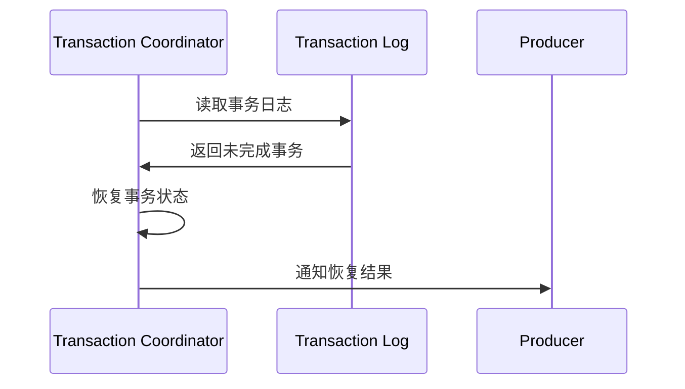

## 5. 最佳实践

### 5.1 配置建议

```properties
# 事务相关最佳实践配置
transaction.timeout.ms=900000
min.insync.replicas=2
acks=all
retries=Integer.MAX_VALUE
max.in.flight.requests.per.connection=5
```

### 5.2 性能优化

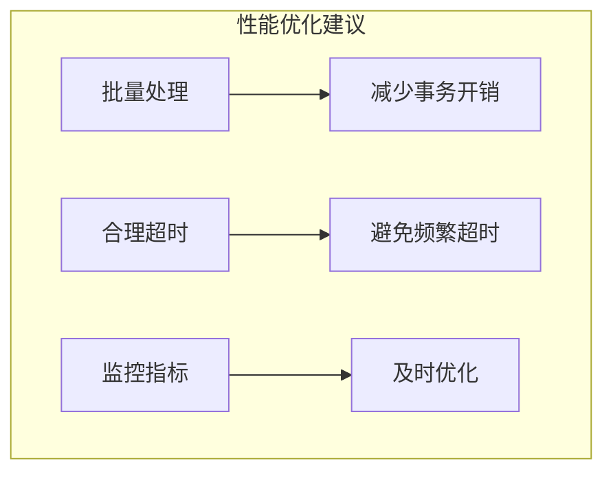

### 5.3 监控告警

监控代码示例：

```java
public class TransactionMonitor {
    private final MetricRegistry metrics;
    private final AlertService alertService;
    
    public void monitorTransactions() {
        // 监控事务完成率
        metrics.meter("transaction.success.rate");
        
        // 监控事务延迟
        metrics.timer("transaction.latency");
        
        // 监控事务回滚率
        metrics.meter("transaction.rollback.rate");
        
        // 设置告警阈值
        if (getTransactionFailureRate() > threshold) {
            alertService.sendAlert("Transaction failure rate too high");
        }
    }
}
```

## 最佳实践建议

1. **事务使用建议**
   - 仅在必要时使用事务
   - 控制事务范围和大小
   - 正确处理事务异常
   - 监控事务性能

2. **配置优化建议**
   - 合理设置超时时间
   - 配置适当的重试次数
   - 启用幂等性
   - 确保足够的副本数

3. **监控建议**
   - 监控事务成功率
   - 监控事务延迟
   - 监控资源使用
   - 设置合理的告警阈值

4. **运维建议**
   - 定期清理过期事务
   - 及时处理失败事务
   - 保持日志清理
   - 做好容量规划
```

