# MongoDB 架构详解

## 目录
- [1. MongoDB 整体架构](#1-mongodb-整体架构)
  - [1.1 逻辑架构](#11-逻辑架构)
  - [1.2 部署模式](#12-部署模式)
- [2. 存储引擎架构](#2-存储引擎架构)
  - [2.1 WiredTiger存储引擎](#21-wiredtiger存储引擎)
- [3. 复制集机制详解](#3-复制集机制详解)
  - [3.1 复制集架构与角色](#31-复制集架构与角色)
  - [3.2 选举机制详解](#32-选举机制详解)
  - [3.3 数据同步机制](#33-数据同步机制)
- [4. 分片集群详解](#4-分片集群详解)
  - [4.1 数据分片策略](#41-数据分片策略)
  - [4.2 数据分布与均衡](#42-数据分布与均衡)
  - [4.3 请求路由机制](#43-请求路由机制)
- [5. 监控与运维](#5-监控与运维)
  - [5.1 关键监控指标](#51-关键监控指标)
  - [5.2 性能优化建议](#52-性能优化建议)
- [6. 总结](#6-总结)

---

## 1. MongoDB 整体架构
### 1.1 逻辑架构

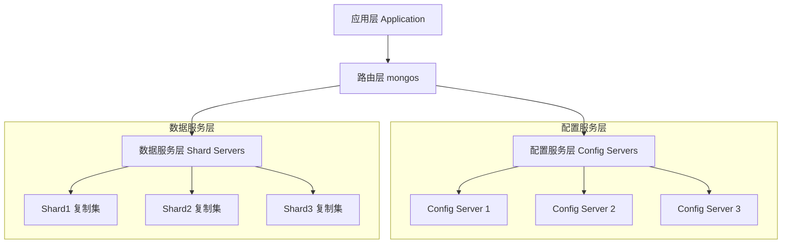

每一层的详细职责：

1. **应用层**
   - 使用MongoDB驱动程序连接数据库
   - 执行CRUD操作
   - 处理业务逻辑

2. **路由层**
   - 解析客户端请求
   - 根据分片规则路由请求
   - 合并分片结果返回
   - 缓存集群元数据

3. **配置服务层**
   - 存储集群元数据
   - 存储分片数据分布信息
   - 存储认证配置信息
   - 必须部署为复制集（通常3节点）

4. **数据服务层**
   - 实际存储数据的分片
   - 每个分片通常是一个复制集
   - 执行具体的数据操作

### 1.2 部署模式

1. **单机模式**


配置示例：
```bash
# 启动单机实例
mongod --dbpath /data/db --port 27017 --bind_ip 0.0.0.0

# 配置文件方式
storage:
  dbPath: "/data/db"
net:
  port: 27017
  bindIp: "0.0.0.0"
```

2. **复制集模式**

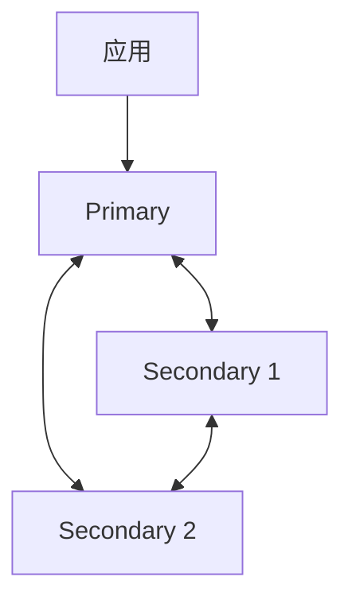

复制集配置示例：
```javascript
// 初始化复制集
rs.initiate({
  _id: "rs0",
  members: [
    { _id: 0, host: "mongodb0.example.net:27017", priority: 2 },
    { _id: 1, host: "mongodb1.example.net:27017", priority: 1 },
    { _id: 2, host: "mongodb2.example.net:27017", priority: 1 }
  ],
  settings: {
    heartbeatTimeoutSecs: 10,
    electionTimeoutMillis: 10000,
    catchUpTimeoutMillis: 2000
  }
})

// 查看复制集状态
rs.status()
```

3. **分片集群模式**

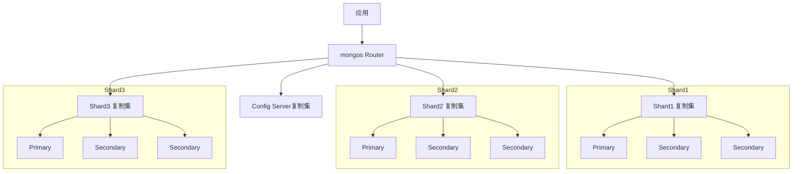

分片集群配置示例：
```javascript
// 添加分片
sh.addShard("rs0/mongodb0.example.net:27017")
sh.addShard("rs1/mongodb1.example.net:27017")
sh.addShard("rs2/mongodb2.example.net:27017")

// 启用数据库分片
sh.enableSharding("mydb")

// 对集合进行分片
sh.shardCollection("mydb.users", {userId: "hashed"})
```

## 2. 存储引擎架构

### 2.1 WiredTiger存储引擎

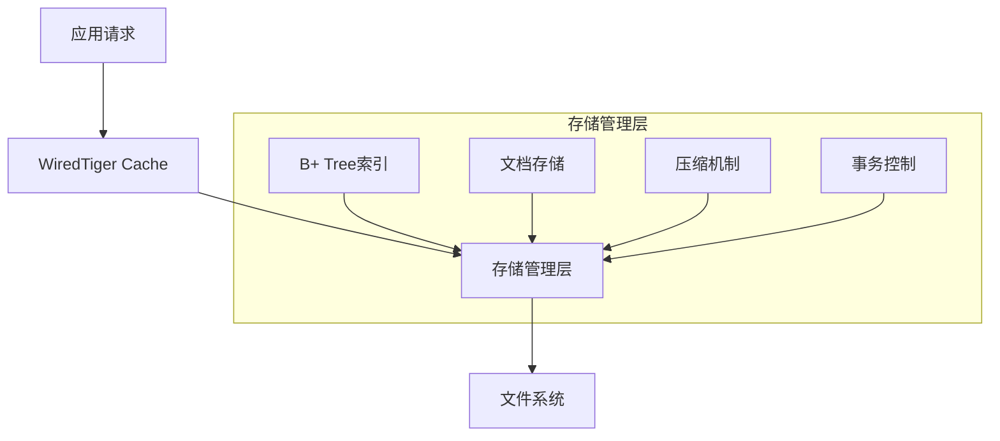

WiredTiger关键特性详解：

1. **内存管理**
   - Cache大小默认为(RAM-1GB)/2
   - 支持压缩存储，降低内存占用
   - 使用eviction线程管理脏页刷盘
   ```bash
   # 配置cache大小
   mongod --wiredTigerCacheSizeGB 4
   ```

2. **数据压缩**
   - 默认使用snappy压缩算法
   - 支持zlib和zstd压缩
   - 索引默认使用prefix压缩
   ```javascript
   // 创建集合时指定压缩算法
   db.createCollection("users", {
     storageEngine: {
       wiredTiger: {
         configString: "block_compressor=zlib"
       }
     }
   })
   ```

3. **并发控制**
   - 文档级别锁
   - MVCC支持
   - 快照隔离
   ```javascript
   // 查看锁状态
   db.serverStatus().wiredTiger.concurrentTransactions
   ```


## 3. 复制集机制详解

### 3.1 复制集架构与角色

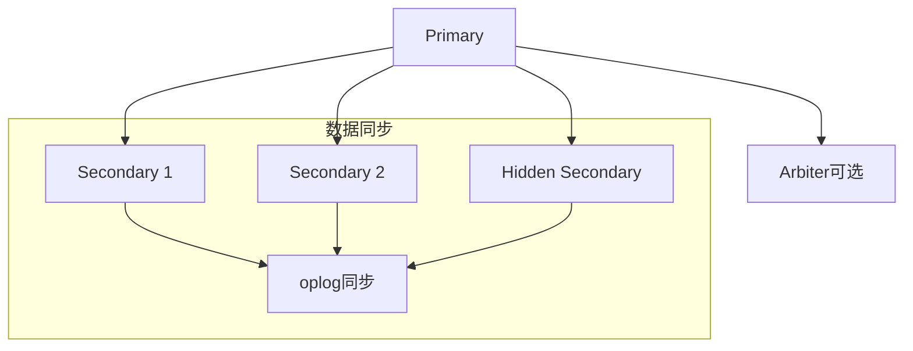

节点角色详解：

1. **Primary节点**
   - 处理所有写操作
   - 生成oplog
   - 默认处理读操作
   ```javascript
   // 查看当前是否为主节点
   db.isMaster()
   
   // 查看oplog状态
   db.getReplicationInfo()
   ```

2. **Secondary节点**
   - 复制Primary数据
   - 参与选举
   - 可配置读取权限
   ```javascript
   // 允许从节点读取
   db.getMongo().setReadPref('secondary')
   
   // 查看复制状态
   db.printSlaveReplicationInfo()
   ```

3. **特殊节点**
   - Hidden节点：不参与选举，用于备份
   - Delayed节点：延迟复制，容灾保护
   - Arbiter节点：仅投票，不存储数据

### 3.2 选举机制详解

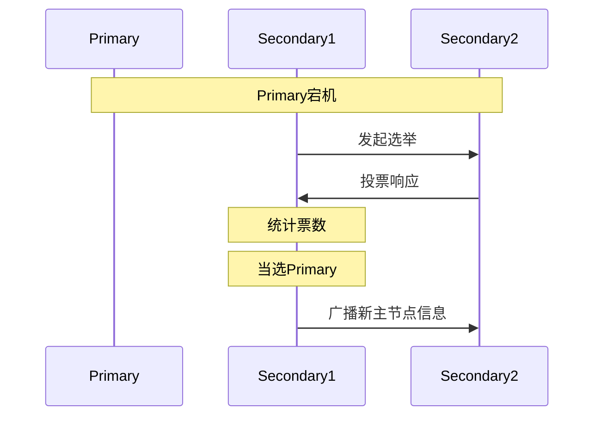

选举过程详解：

1. **选举触发条件**
   - Primary节点心跳超时
   - Primary主动降级
   - 复制集初始化
   ```javascript
   // 配置选举超时时间
   cfg = rs.conf()
   cfg.settings.electionTimeoutMillis = 10000
   rs.reconfig(cfg)
   ```

2. **投票机制**
   - 基于Raft协议
   - 多数派投票原则
   - 优先级影响选举
   ```javascript
   // 设置节点优先级
   cfg = rs.conf()
   cfg.members[0].priority = 2
   rs.reconfig(cfg)
   ```

### 3.3 数据同步机制

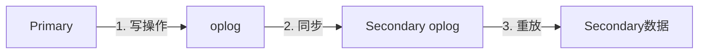

1. **初始同步流程**
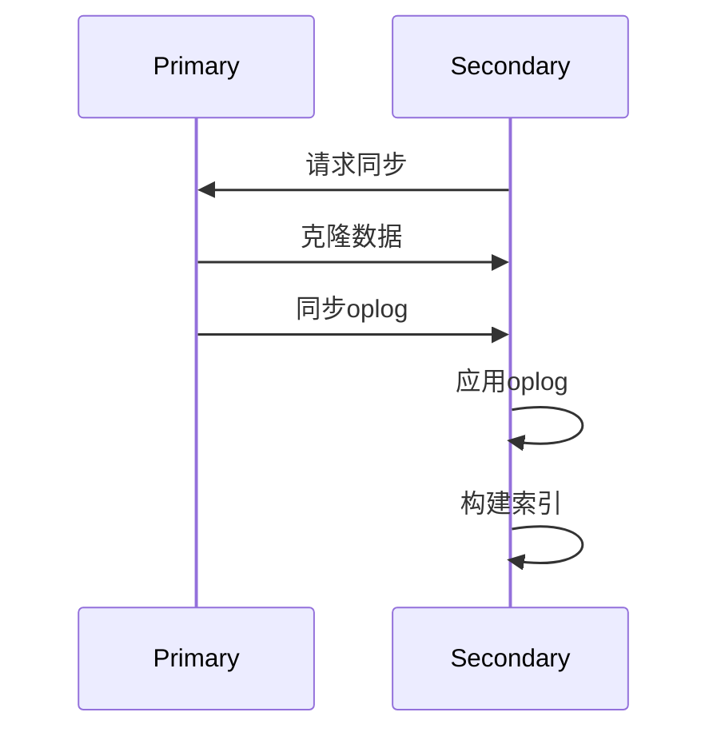

2. **增量同步机制**
   - oplog大小配置
   ```javascript
   // 查看oplog大小
   db.getReplicationInfo()
   
   // 配置oplog大小（启动时）
   mongod --oplogSize 10240
   ```
   
   - 同步状态监控
   ```javascript
   // 查看复制延迟
   rs.printSlaveReplicationInfo()
   
   // 详细同步状态
   db.serverStatus().repl
   ```

## 4. 分片集群详解

### 4.1 数据分片策略

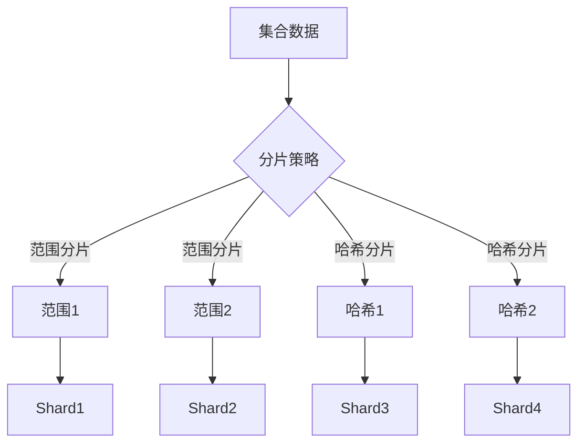

1. **范围分片**
```javascript
// 启用范围分片
sh.shardCollection(
    "mydb.users",
    { age: 1 }  // 按age字段范围分片
)

// 创建区域
sh.addShardToZone("shard0000", "zone1")
sh.updateZoneKeyRange(
    "mydb.users",
    { age: 0 },
    { age: 100 },
    "zone1"
)
```

2. **哈希分片**
```javascript
// 启用哈希分片
sh.shardCollection(
    "mydb.users",
    { userId: "hashed" }
)
```

### 4.2 数据分布与均衡

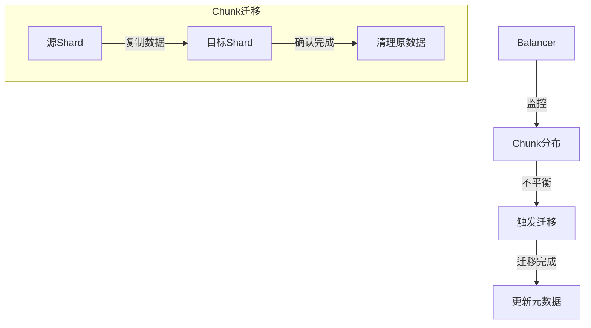

1. **Chunk管理**
```javascript
// 查看chunk分布
db.chunks.find().pretty()

// 修改chunk大小
sh.setBalancerState(false)  // 暂停均衡器
use config
db.settings.save({
    _id: "chunksize",
    value: 64  // 64MB
})
sh.setBalancerState(true)   // 重启均衡器
```

2. **均衡器配置**
```javascript
// 查看均衡器状态
sh.getBalancerState()

// 设置均衡时间窗口
db.settings.update(
    { _id: "balancer" },
    {
        $set: {
            activeWindow: {
                start: "23:00",
                stop: "6:00"
            }
        }
    },
    { upsert: true }
)
```

### 4.3 请求路由机制

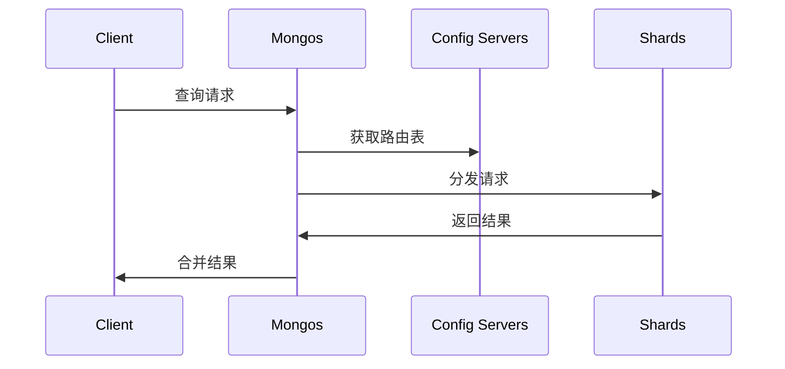

1. **路由表缓存**
```javascript
// 刷新路由表缓存
db.adminCommand({ flushRouterConfig: 1 })

// 查看路由信息
db.printShardingStatus()
```

2. **查询优化**
```javascript
// 查看查询计划
db.collection.explain("executionStats")

// 强制特定分片查询
db.collection.find().hint({ _id: 1 })
```

## 5. 监控与运维

### 5.1 关键监控指标

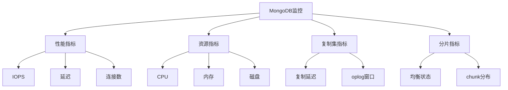

监控命令示例：
```javascript
// 服务器状态
db.serverStatus()

// 复制集状态
rs.status()

// 分片状态
sh.status()

// 数据库统计
db.stats()

// 集合统计
db.collection.stats()
```

### 5.2 性能优化建议

1. **索引优化**
```javascript
// 索引使用分析
db.collection.aggregate([
    { $indexStats: {} }
])

// 未使用索引的查询分析
db.system.profile.find(
    { op: "query", millis: { $gt: 100 } }
).pretty()
```

2. **硬件配置**
   - 内存配置：WiredTiger缓存建议为RAM的60%
   - 磁盘配置：使用SSD，建议RAID10
   - CPU配置：建议每1000 IOPS配置一个核心

3. **参数调优**
```javascript
// 连接池设置
db.adminCommand({
    setParameter: 1,
    maxConnecting: 100
})

// 慢查询阈值设置
db.setProfilingLevel(1, { slowms: 100 })
```

## 6. 总结

MongoDB的架构设计充分考虑了分布式系统的各项要求：
1. 通过复制集实现高可用
2. 通过分片实现水平扩展
3. 通过各种机制保证数据一致性
4. 提供灵活的部署方案

建议根据实际业务场景选择合适的部署方案：
- 数据量小于1TB：考虑复制集
- 数据量大于1TB：考虑分片集群
- 读写比例：影响节点数量配置
- 可用性要求：影响复制集部署方式
```

这份完整的架构文档涵盖了MongoDB的主要架构特性，包括：
1. 使用mermaid图表直观展示各个组件关系
2. 提供详细的配置示例和命令
3. 深入解释各个机制的工作原理
4. 给出实际运维中的最佳实践建议

