# MongoDB 集群运维详解

## 目录
- [1. 集群架构](#1-集群架构)
  - [1.1 复制集架构](#11-复制集架构)
  - [1.2 分片集群架构](#12-分片集群架构)
  - [1.3 配置服务器](#13-配置服务器)
- [2. 集群部署](#2-集群部署)
  - [2.1 复制集部署](#21-复制集部署)
  - [2.2 分片集群部署](#22-分片集群部署)
  - [2.3 安全配置](#23-安全配置)
- [3. 集群维护](#3-集群维护)
  - [3.1 监控管理](#31-监控管理)
  - [3.2 备份恢复](#32-备份恢复)
  - [3.3 版本升级](#33-版本升级)
- [4. 故障处理](#4-故障处理)
  - [4.1 故障诊断](#41-故障诊断)
  - [4.2 数据修复](#42-数据修复)
  - [4.3 性能优化](#43-性能优化)
- [5. 日常运维](#5-日常运维)
  - [5.1 容量规划](#51-容量规划)
  - [5.2 安全审计](#52-安全审计)
  - [5.3 运维自动化](#53-运维自动化)

---
## 1. 集群架构

### 1.1 复制集架构

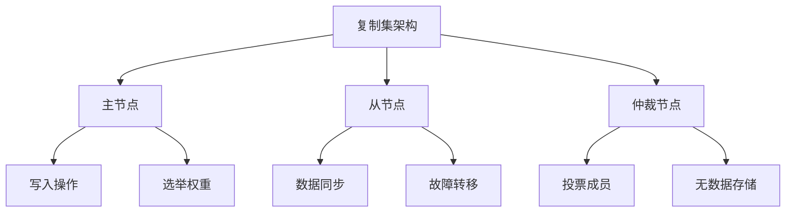

复制集配置示例：
```javascript


// 1. 初始化复制集
rs.initiate({
    _id: "myReplicaSet",
    members: [
        {
            _id: 0,
            host: "mongodb1.example.net:27017",
            priority: 2
        },
        {
            _id: 1,
            host: "mongodb2.example.net:27017",
            priority: 1
        },
        {
            _id: 2,
            host: "mongodb3.example.net:27017",
            arbiterOnly: true
        }
    ]
})

// 2. 复制集状态检查
rs.status()
rs.conf()

// 3. 成员管理
// 添加新成员
rs.add("mongodb4.example.net:27017")

// 移除成员
rs.remove("mongodb4.example.net:27017")

// 4. 复制集配置优化
const optimizeRsConfig = {
    settings: {
        chainingAllowed: true,
        heartbeatTimeoutSecs: 10,
        electionTimeoutMillis: 10000,
        catchUpTimeoutMillis: 2000
    }
};

rs.reconfig(rs.conf())
```

### 1.2 分片集群架构

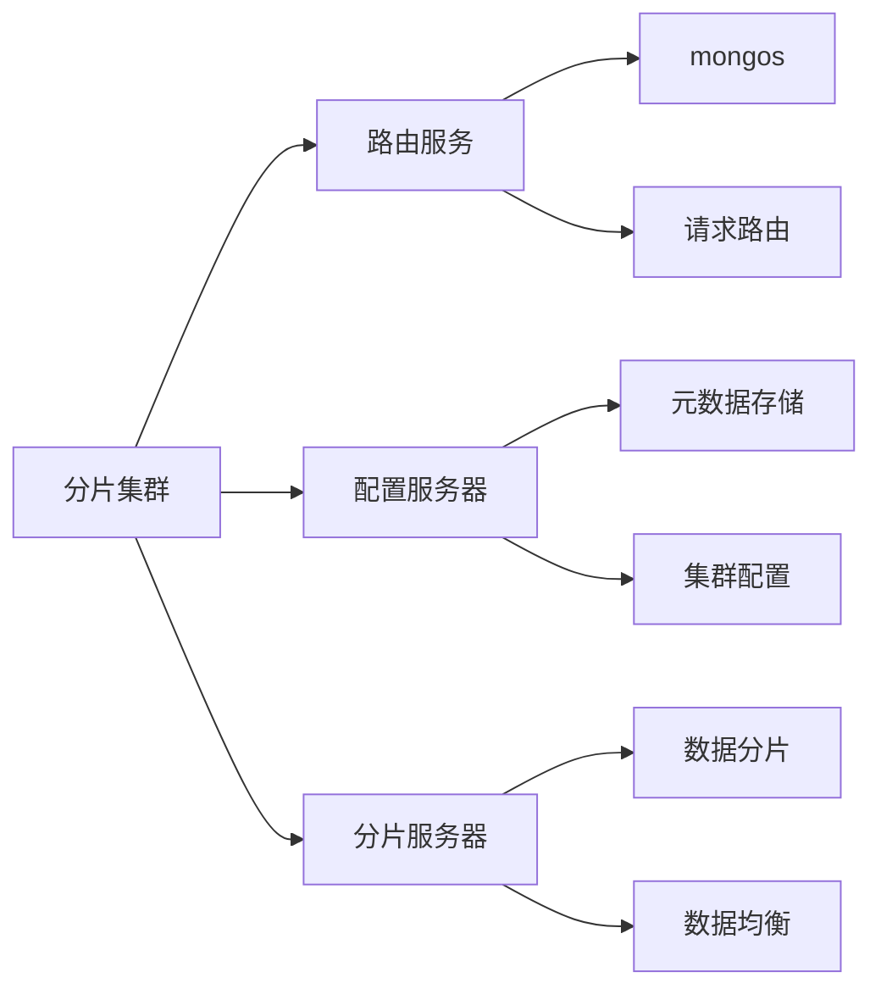

分片集群配置示例：
```javascript

// 1. 配置分片集群
// 添加分片
sh.addShard("rs1/mongodb1.example.net:27017")
sh.addShard("rs2/mongodb2.example.net:27017")

// 启用数据库分片
sh.enableSharding("mydb")

// 配置集合分片
sh.shardCollection(
    "mydb.users",
    { userId: "hashed" }  // 哈希分片
)

// 2. 分片状态检查
sh.status()

// 3. 均衡器配置
// 设置均衡窗口
db.settings.updateOne(
    { _id: "balancer" },
    {
        $set: {
            activeWindow: {
                start: "01:00",
                stop: "05:00"
            }
        }
    },
    { upsert: true }
)

// 4. 分片监控
const monitorShardStatus = () => {
    const shardStatus = sh.status();
    
    // 检查分片分布
    shardStatus.shards.forEach(shard => {
        print(`分片： ${shard._id}`);
        print(`主机： ${shard.host}`);
        print(`状态： ${shard.state}`);
    });
    
    // 检查数据分布
    db.collections.find().forEach(coll => {
        const stats = db[coll.name].stats();
        print(`集合： ${coll.name}`);
        print(`分片数： ${stats.shards.length}`);
        print(`块数： ${stats.chunks}`);
    });
};
```
### 1.3 配置服务器

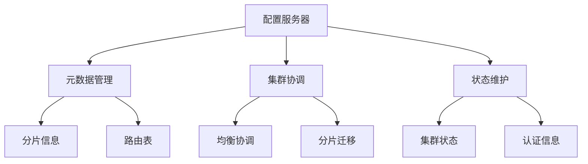

配置服务器管理示例：
```javascript

// 1. 配置服务器复制集初始化
rs.initiate({
    _id: "configReplSet",
    configsvr: true,
    members: [
        { _id: 0, host: "config1.example.net:27019" },
        { _id: 1, host: "config2.example.net:27019" },
        { _id: 2, host: "config3.example.net:27019" }
    ]
})

// 2. 配置服务器状态监控
const monitorConfigServer = () => {
    // 检查复制集状态
    const rsStatus = rs.status();
    print("配置服务器状态:");
    rsStatus.members.forEach(member => {
        print(`节点： ${member.name}`);
        print(`状态： ${member.stateStr}`);
        print(`延迟： ${member.optimeDate}`);
    });
    
    // 检查数据库大小
    const dbStats = db.stats();
    print(`数据大小： ${dbStats.dataSize}`);
    print(`存储大小： ${dbStats.storageSize}`);
    
    // 检查集合状态
    db.collections.find().forEach(coll => {
        const stats = db[coll.name].stats();
        print(`集合： ${coll.name}`);
        print(`文档数： ${stats.count}`);
        print(`大小： ${stats.size}`);
    });
};

// 3. 配置备份
const backupConfig = () => {
    const timestamp = new Date()
        .toISOString()
        .replace(/[:.]/g, '-');
    const backupPath = `/backup/config_${timestamp}`;
    
    // 使用 mongodump 备份配置数据
    sh.runCommand({
        mongodump: 1,
        db: "config",
        out: backupPath
    });
    
    // 备份配置文件
    sh.runCommand({
        copyFile: "/etc/mongod.conf",
        destination: `${backupPath}/mongod.conf`
    });
    
    return backupPath;
};
```

## 2. 集群部署

### 2.1 复制集部署

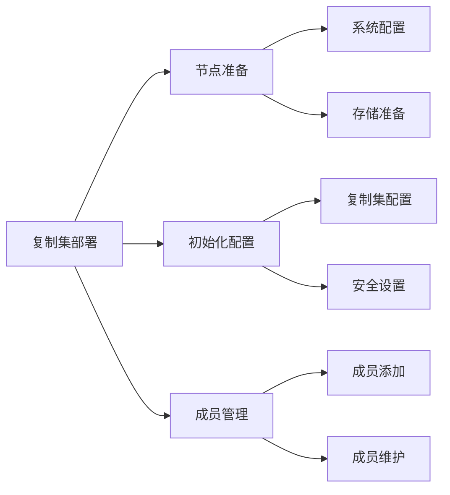

复制集部署示例：
```javascript

// 1. 节点配置文件
// mongod.conf
const replicaConfig = `
systemLog:
  destination: file
  path: /var/log/mongodb/mongod.log
  logAppend: true

storage:
  dbPath: /var/lib/mongodb
  journal:
    enabled: true

net:
  port: 27017
  bindIp: 0.0.0.0

replication:
  replSetName: myReplicaSet

security:
  authorization: enabled
  keyFile: /etc/mongodb/keyfile
`;

// 2. 初始化脚本
const initReplicaSet = async () => {
    // 创建管理员用户
    await db.createUser({
        user: "admin",
        pwd: "secure_password",
        roles: ["root"]
    });
    
    // 初始化复制集
    await rs.initiate({
        _id: "myReplicaSet",
        members: [
            {
                _id: 0,
                host: "node1:27017",
                priority: 2
            },
            {
                _id: 1,
                host: "node2:27017",
                priority: 1
            },
            {
                _id: 2,
                host: "node3:27017",
                priority: 1
            }
        ],
        settings: {
            chainingAllowed: true,
            heartbeatTimeoutSecs: 10,
            electionTimeoutMillis: 10000
        }
    });
    
    // 等待复制集初始化完成
    while (!rs.isMaster().ismaster) {
        await sleep(1000);
    }
    
    print("复制集初始化完成");
};

// 3. 成员管理函数
const manageMember = async (operation, host) => {
    switch (operation) {
        case 'add':
            await rs.add(host);
            break;
        case 'remove':
            await rs.remove(host);
            break;
        case 'stepDown':
            await rs.stepDown();
            break;
        case 'freeze':
            await rs.freeze(120);  // 冻结 120 秒
            break;
        default:
            throw new Error('未知操作');
    }
    
    // 等待复制集重新配置
    await sleep(5000);
    print(`成员${operation}操作完成`);
};
```

### 2.2 分片集群部署

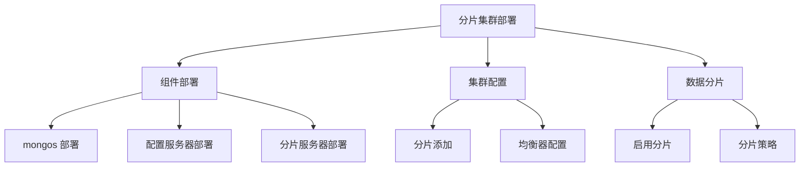

分片集群部署示例：
```javascript
// 1. mongos 配置文件
// mongos.conf
const mongosConfig = `
systemLog:
  destination: file
  path: /var/log/mongodb/mongos.log
  logAppend: true

net:
  port: 27017
  bindIp: 0.0.0.0

sharding:
  configDB: configReplSet/config1:27019,config2:27019,config3:27019

security:
  keyFile: /etc/mongodb/keyfile
`;

// 2. 分片集群初始化
const initShardCluster = async () => {
    // 添加分片
    await sh.addShard(
        "shard1 RepSet/shard1 a:27018,shard1 b:27018,shard1 c:27018"
    );
    await sh.addShard(
        "shard2 RepSet/shard2 a:27018,shard2 b:27018,shard2 c:27018"
    );
    
    // 启用数据库分片
    await sh.enableSharding("mydb");
    
    // 配置集合分片
    await sh.shardCollection(
        "mydb.users",
        { userId: "hashed" }
    );
    
    // 配置区域
    await sh.addShardToZone(
        "shard1 RepSet",
        "zone1"
    );
    await sh.addShardToZone(
        "shard2 RepSet",
        "zone2"
    );
    
    // 配置区域范围
    await sh.updateZoneKeyRange(
        "mydb.users",
        {
            min: { region: "east" },
            max: { region: "west" },
            zone: "zone1"
        }
    );
};

// 3. 均衡器配置
const configureBalancer = async () => {
    // 设置均衡窗口
    await db.settings.updateOne(
        { _id: "balancer" },
        {
            $set: {
                activeWindow: {
                    start: "01:00",
                    stop: "05:00"
                },
                _secondaryThrottle: true,
                waitForDelete: true
            }
        },
        { upsert: true }
    );
    
    // 配置迁移限制
    await db.settings.updateOne(
        { _id: "migrations" },
        {
            $set: {
                maxChunkSizeBytes: 64 * 1024 * 1024,  // 64 MB
                maxChunkCount: 1000,
                maxTimeMS: 60000
            }
        },
        { upsert: true }
    );
};
```
### 2.3 安全配置

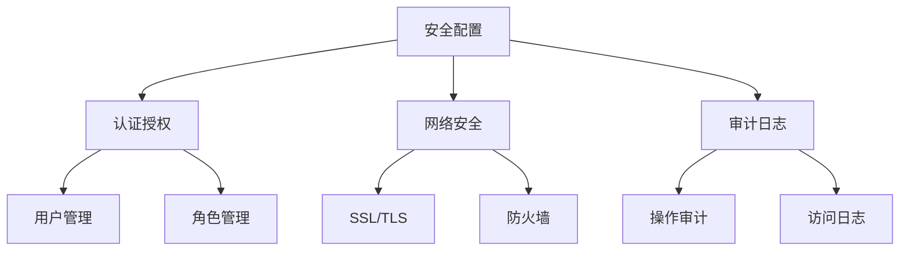

安全配置示例：
```javascript

// 1. 用户和角色管理
const setupSecurity = async () => {
    // 创建管理员用户
    await db.createUser({
        user: "admin",
        pwd: "secure_password",
        roles: [
            { role: "userAdminAnyDatabase", db: "admin" },
            { role: "clusterAdmin", db: "admin" }
        ]
    });
    
    // 创建应用用户
    await db.createUser({
        user: "appUser",
        pwd: "app_password",
        roles: [
            { role: "readWrite", db: "mydb" },
            { role: "clusterMonitor", db: "admin" }
        ]
    });
    
    // 创建自定义角色
    await db.createRole({
        role: "dataAnalyst",
        privileges: [
            {
                resource: { db: "mydb", collection: "" },
                actions: ["find", "aggregate"]
            }
        ],
        roles: []
    });
};

// 2. SSL/TLS 配置
const sslConfig = `
net:
  ssl:
    mode: requireSSL
    PEMKeyFile: /etc/mongodb/server.pem
    CAFile: /etc/mongodb/ca.pem
    clusterFile: /etc/mongodb/cluster.pem
    allowInvalidCertificates: false
    allowInvalidHostnames: false
`;

// 3. 审计配置
const auditConfig = `
auditLog:
  destination: file
  format: JSON
  path: /var/log/mongodb/audit.log
  filter: '{
    atype: {
      $in: [
        "authenticate",
        "createUser",
        "dropUser",
        "createRole",
        "dropRole",
        "grantRole",
        "revokeRole"
      ]
    }
  }'
`;

// 4. 安全检查函数
const securityCheck = async () => {
    // 检查用户权限
    const users = await db.getUsers();
    users.forEach(user => {
        print(`用户： ${user.user}`);
        print(`角色： ${JSON.stringify(user.roles)}`);
    });
    
    // 检查网络配置
    const serverStatus = await db.serverStatus();
    print(`SSL 状态： ${serverStatus.security.SSLServerSubjectName}`);
    
    // 检查审计日志
    const auditStats = await db.adminCommand({ getAuditConfig: 1 });
    print(`审计状态： ${JSON.stringify(auditStats)}`);
};
```

## 3. 集群维护

### 3.1 监控管理

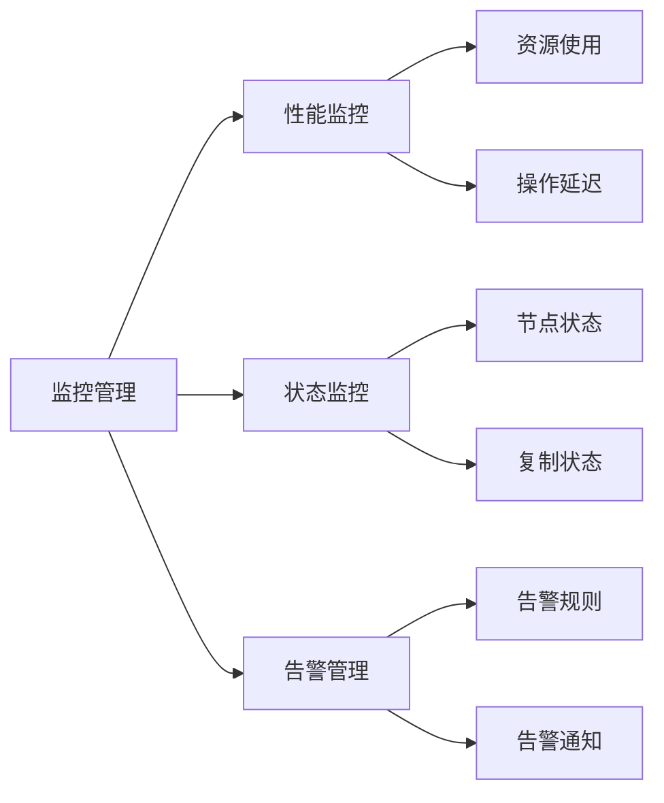

监控管理示例：
```javascript

// 1. 性能监控
const monitorPerformance = async () => {
    // 服务器状态
    const serverStatus = await db.serverStatus();
    
    // 资源使用
    const resourceMetrics = {
        connections: serverStatus.connections.current,
        memory: {
            resident: serverStatus.mem.resident,
            virtual: serverStatus.mem.virtual
        },
        cpu: serverStatus.extra_info.page_faults,
        network: {
            bytesIn: serverStatus.network.bytesIn,
            bytesOut: serverStatus.network.bytesOut
        }
    };
    
    // 操作统计
    const opMetrics = {
        insert: serverStatus.opcounters.insert,
        query: serverStatus.opcounters.query,
        update: serverStatus.opcounters.update,
        delete: serverStatus.opcounters.delete
    };
    
    // 延迟统计
    const latencyStats = await db.serverStatus().opLatencies;
    
    return {
        timestamp: new Date(),
        resource: resourceMetrics,
        operations: opMetrics,
        latency: latencyStats
    };
};

// 2. 集群状态监控
const monitorClusterStatus = async () => {
    // 复制集状态
    const rsStatus = await rs.status();
    const rsMetrics = rsStatus.members.map(member => ({
        host: member.name,
        state: member.stateStr,
        health: member.health,
        uptime: member.uptime,
        lag: member.optimeDate
    }));
    
    // 分片状态
    const shardStatus = await sh.status();
    const shardMetrics = shardStatus.shards.map(shard => ({
        id: shard._id,
        host: shard.host,
        state: shard.state,
        chunks: shard.chunks
    }));
    
    return {
        replicaSet: rsMetrics,
        sharding: shardMetrics
    };
};

// 3. 告警系统
class MongoAlertSystem {
    constructor(config) {
        this.rules = config.rules || [];
        this.notifications = config.notifications || [];
    }
    
    async checkAlerts() {
        const metrics = await monitorPerformance();
        const clusterStatus = await monitorClusterStatus();
        
        for (const rule of this.rules) {
            const triggered = await this.evaluateRule(
                rule, metrics, clusterStatus
            );
            
            if (triggered) {
                await this.sendAlert(rule, metrics);
            }
        }
    }
    
    async evaluateRule(rule, metrics, status) {
        // 规则评估逻辑
        switch (rule.type) {
            case 'threshold':
                return this.checkThreshold(rule, metrics);
            case 'status':
                return this.checkStatus(rule, status);
            case 'trend':
                return this.checkTrend(rule, metrics);
            default:
                return false;
        }
    }
    
    async sendAlert(rule, data) {
        const alert = {
            timestamp: new Date(),
            rule: rule.name,
            level: rule.level,
            message: rule.message,
            data: data
        };
        
        // 发送通知
        for (const notifier of this.notifications) {
            await notifier.send(alert);
        }
    }
}
```
## 3.2 备份恢复

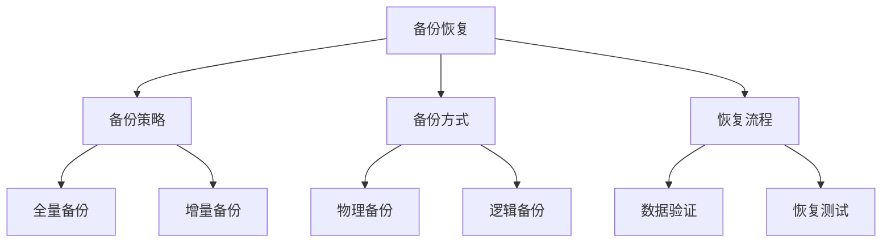

备份恢复示例：
```javascript

// 1. 备份管理类
class MongoBackupManager {
    constructor(config) {
        this.backupPath = config.backupPath;
        this.retention = config.retention || 7; // 保留天数
    }
    
    async fullBackup() {
        const timestamp = new Date().toISOString()
            .replace(/[:.]/g, '-');
        const backupDir = `${this.backupPath}/full_${timestamp}`;
        
        // 执行 mongodump
        await runCommand({
            mongodump: 1,
            out: backupDir,
            gzip: true,
            oplog: true
        });
        
        // 备份配置文件
        await this.backupConfig(backupDir);
        
        // 清理旧备份
        await this.cleanOldBackups();
        
        return backupDir;
    }
    
    async incrementalBackup() {
        const timestamp = new Date().toISOString()
            .replace(/[:.]/g, '-');
        const backupDir = `${this.backupPath}/incr_${timestamp}`;
        
        // 获取上次备份的时间戳
        const lastBackup = await this.getLastBackupTimestamp();
        
        // 执行 oplog 备份
        await runCommand({
            mongodump: 1,
            out: backupDir,
            oplog: true,
            query: {
                ts: { $gt: lastBackup }
            }
        });
        
        return backupDir;
    }
    
    async restore(backupPath, options = {}) {
        // 验证备份数据
        await this.validateBackup(backupPath);
        
        // 执行恢复
        await runCommand({
            mongorestore: 1,
            dir: backupPath,
            drop: options.drop || false,
            oplogReplay: true,
            ...options
        });
        
        // 验证恢复结果
        await this.validateRestore();
    }
    
    async validateBackup(backupPath) {
        // 检查备份完整性
        const result = await runCommand({
            dbHash: 1,
            collections: await this.getCollectionsList()
        });
        
        // 保存哈希值用于恢复验证
        await fs.writeFile(
            `${backupPath}/hash.json`,
            JSON.stringify(result)
        );
    }
    
    async validateRestore() {
        // 比较恢复前后的数据哈希
        const beforeHash = JSON.parse(
            await fs.readFile('hash.json')
        );
        const afterHash = await runCommand({
            dbHash: 1,
            collections: Object.keys(beforeHash)
        });
        
        return this.compareHashes(beforeHash, afterHash);
    }
}

// 2. 备份策略实现
const backupStrategy = {
    // 全量备份计划
    fullBackupSchedule: {
        frequency: 'weekly',
        day: 'sunday',
        time: '00:00',
        retention: 4  // 保留 4 周
    },
    
    // 增量备份计划
    incrementalBackupSchedule: {
        frequency: 'daily',
        time: '12:00',
        retention: 7  // 保留 7 天
    },
    
    // 执行备份
    async executeBackup(type) {
        const backup = new MongoBackupManager({
            backupPath: '/data/backup'
        });
        
        try {
            if (type === 'full') {
                return await backup.fullBackup();
            } else {
                return await backup.incrementalBackup();
            }
        } catch (error) {
            await this.handleBackupError(error);
        }
    }
};

// 3. 恢复流程管理
const recoveryManager = {
    async planRecovery(backupPath) {
        // 分析备份数据
        const backupInfo = await this.analyzeBackup(backupPath);
        
        // 制定恢复计划
        const recoveryPlan = {
            steps: [
                {
                    type: 'preparation',
                    actions: ['停止应用', '验证备份']
                },
                {
                    type: 'restore',
                    actions: ['恢复数据', '重放 oplog']
                },
                {
                    type: 'validation',
                    actions: ['验证数据', '检查索引']
                }
            ],
            estimatedTime: this.calculateRecoveryTime(backupInfo),
            risks: this.assessRecoveryRisks(backupInfo)
        };
        
        return recoveryPlan;
    },
    
    async executeRecovery(plan) {
        for (const step of plan.steps) {
            await this.executeRecoveryStep(step);
        }
    }
};
```

### 3.3 版本升级

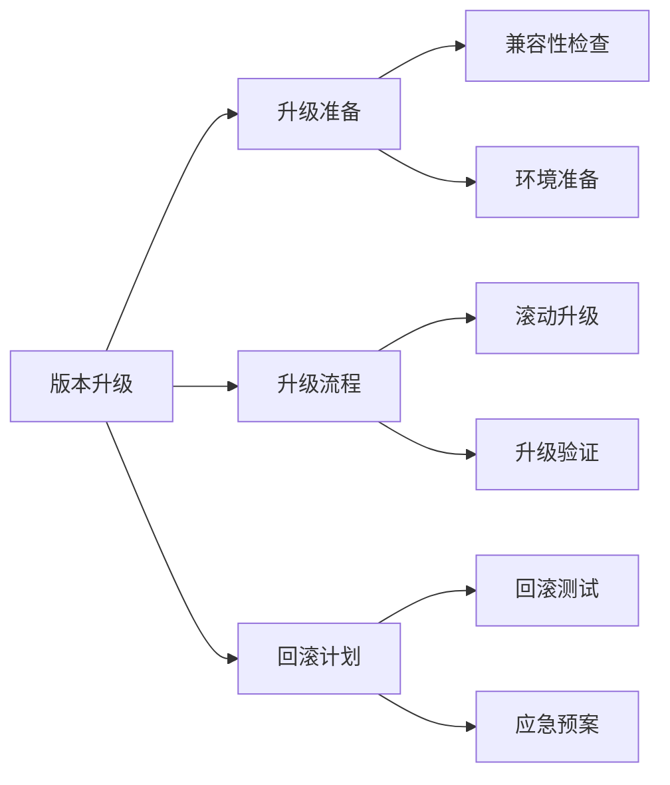

版本升级示例：
```javascript


// 1. 升级准备类
class UpgradeManager {
    constructor(config) {
        this.currentVersion = config.currentVersion;
        this.targetVersion = config.targetVersion;
        this.nodes = config.nodes;
    }
    
    async checkCompatibility() {
        // 检查特性兼容性
        const incompatibleFeatures = 
            await this.findIncompatibleFeatures();
        
        // 检查驱动兼容性
        const driverCompatibility = 
            await this.checkDriverCompatibility();
        
        // 检查存储引擎兼容性
        const storageCompatibility = 
            await this.checkStorageCompatibility();
        
        return {
            features: incompatibleFeatures,
            drivers: driverCompatibility,
            storage: storageCompatibility
        };
    }
    
    async prepareUpgrade() {
        // 创建备份
        await backupManager.fullBackup();
        
        // 准备新版本二进制文件
        await this.prepareNewBinaries();
        
        // 更新配置文件
        await this.updateConfigurations();
    }
    
    async rollingUpgrade() {
        for (const node of this.nodes) {
            // 将节点从负载均衡器移除
            await this.removeFromLoadBalancer(node);
            
            // 停止节点
            await this.stopNode(node);
            
            // 升级二进制文件
            await this.upgradeBinaries(node);
            
            // 启动节点
            await this.startNode(node);
            
            // 验证节点状态
            await this.validateNode(node);
            
            // 将节点添加回负载均衡器
            await this.addToLoadBalancer(node);
            
            // 等待复制完成
            await this.waitForReplication(node);
        }
    }
    
    async rollback() {
        // 实施回滚计划
        for (const node of this.nodes.reverse()) {
            await this.rollbackNode(node);
        }
    }
}

// 2. 升级流程实现
const upgradeProcess = {
    async execute() {
        const upgrade = new UpgradeManager({
            currentVersion: '4.4',
            targetVersion: '5.0',
            nodes: [
                'mongodb1.example.net',
                'mongodb2.example.net',
                'mongodb3.example.net'
            ]
        });
        
        try {
            // 检查兼容性
            const compatibility = 
                await upgrade.checkCompatibility();
            if (!this.isCompatible(compatibility)) {
                throw new Error('兼容性检查失败');
            }
            
            // 准备升级
            await upgrade.prepareUpgrade();
            
            // 执行滚动升级
            await upgrade.rollingUpgrade();
            
            // 验证升级结果
            await this.validateUpgrade();
            
        } catch (error) {
            // 执行回滚
            await upgrade.rollback();
            throw error;
        }
    }
};
```


## 4. 故障处理

### 4.1 故障诊断

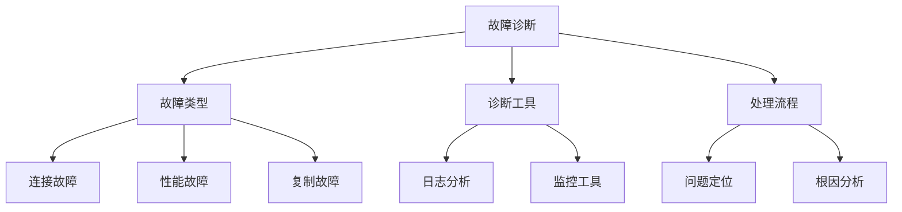

故障诊断示例：
```javascript
// 1. 故障诊断类
class TroubleshootingManager {
    constructor() {
        this.diagnosticTools = {
            logAnalyzer: new LogAnalyzer(),
            performanceAnalyzer: new PerformanceAnalyzer(),
            connectivityTester: new ConnectivityTester()
        };
    }
    
    async diagnose(issue) {
        // 收集诊断信息
        const diagnosticInfo = await this.gatherDiagnosticInfo();
        
        // 分析问题
        const analysis = await this.analyzeIssue(
            issue, 
            diagnosticInfo
        );
        
        // 生成诊断报告
        return this.generateReport(analysis);
    }
    
    async gatherDiagnosticInfo() {
        return {
            // 系统状态
            serverStatus: await db.serverStatus(),
            
            // 复制集状态
            rsStatus: await rs.status(),
            
            // 日志分析
            logs: await this.diagnosticTools.logAnalyzer
                .analyze('/var/log/mongodb/*.log'),
            
            // 性能统计
            performanceStats: await this.diagnosticTools
                .performanceAnalyzer.collect(),
            
            // 连接测试
            connectivityTests: await this.diagnosticTools
                .connectivityTester.runTests()
        };
    }
    
    async analyzeIssue(issue, info) {
        // 根据不同类型的问题执行相应的分析
        switch (issue.type) {
            case 'connectivity':
                return this.analyzeConnectivity(info);
            case 'performance':
                return this.analyzePerformance(info);
            case 'replication':
                return this.analyzeReplication(info);
            default:
                throw new Error('未知的问题类型');
        }
    }
}

// 2. 具体故障分析工具
class PerformanceAnalyzer {
    async analyze() {
        // 收集性能指标
        const metrics = await this.collectMetrics();
        
        // 分析慢查询
        const slowQueries = await this.analyzeSlowQueries();
        
        // 检查资源使用
        const resourceUsage = await this.checkResourceUsage();
        
        // 索引使用分析
        const indexUsage = await this.analyzeIndexUsage();
        
        return {
            metrics,
            slowQueries,
            resourceUsage,
            indexUsage,
            recommendations: this.generateRecommendations()
        };
    }
    
    async analyzeSlowQueries() {
        return db.system.profile.find({
            millis: { $gt: 100 }
        }).sort({ millis: -1 }).limit(10);
    }
}

// 3. 故障处理流程
const troubleshootingProcess = {
    async handleIssue(issue) {
        const manager = new TroubleshootingManager();
        
        // 记录问题
        await this.logIssue(issue);
        
        try {
            // 诊断问题
            const diagnosis = await manager.diagnose(issue);
            
            // 实施解决方案
            await this.implementSolution(diagnosis);
            
            // 验证解决结果
            await this.validateSolution(issue);
            
        } catch (error) {
            // 升级处理
            await this.escalateIssue(issue, error);
        }
    }
};
```

### 4.2 数据修复

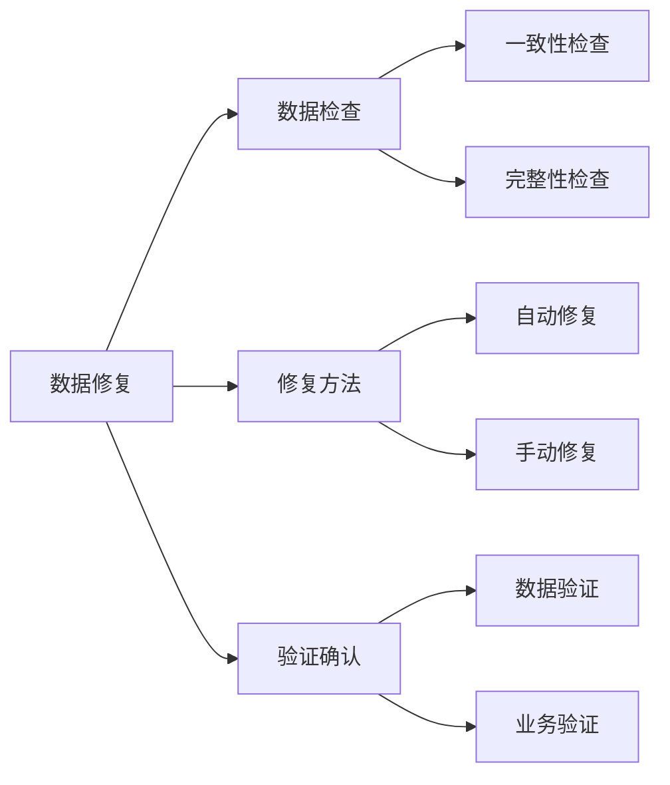

数据修复示例：
```javascript

// 1. 数据修复管理器
class DataRepairManager {
    async checkDataIntegrity() {
        // 检查集合完整性
        const collections = await db.getCollectionNames();
        const integrityResults = {};
        
        for (const coll of collections) {
            integrityResults[coll] = await this.validateCollection(coll);
        }
        
        // 检查索引完整性
        const indexResults = await this.validateIndexes();
        
        return { collections: integrityResults, indexes: indexResults };
    }
    
    async repairData(options) {
        // 备份待修复数据
        await this.backupBeforeRepair();
        
        try {
            // 执行修复
            if (options.autoRepair) {
                await this.autoRepair();
            } else {
                await this.manualRepair(options.repairScript);
            }
            
            // 验证修复结果
            await this.validateRepair();
            
        } catch (error) {
            // 回滚修复
            await this.rollbackRepair();
            throw error;
        }
    }
    
    async validateRepair() {
        // 数据一致性检查
        const consistencyCheck = await this.checkConsistency();
        
        // 业务规则验证
        const businessCheck = await this.validateBusinessRules();
        
        return {
            dataConsistency: consistencyCheck,
            businessValidation: businessCheck
        };
    }
}

// 2. 自动修复工具
class AutoRepairTool {
    async repair() {
        // 修复孤立文档
        await this.repairOrphanedDocuments();
        
        // 重建损坏的索引
        await this.rebuildCorruptedIndexes();
        
        // 修复复制集不一致
        await this.repairReplicationInconsistencies();
    }
    
    async repairOrphanedDocuments() {
        const collections = await db.getCollectionNames();
        
        for (const coll of collections) {
            // 查找并修复孤立文档
            const orphans = await this.findOrphans(coll);
            await this.fixOrphans(orphans);
        }
    }
}

// 3. 修复验证工具
class RepairValidator {
    async validateRepair(repairResult) {
        // 检查数据完整性
        const integrityCheck = await this.checkDataIntegrity();
        
        // 验证业务规则
        const businessRules = await this.validateBusinessRules();
        
        // 检查性能影响
        const performanceImpact = await this.checkPerformanceImpact();
        
        return {
            integrity: integrityCheck,
            business: businessRules,
            performance: performanceImpact
        };
    }
}
```
### 4.3 性能优化

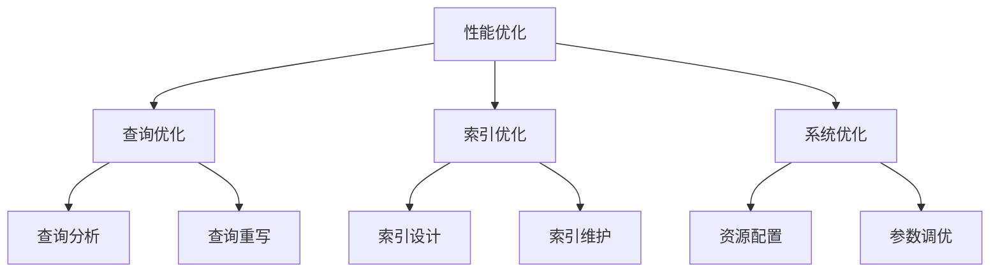

性能优化示例：
```javascript   
// 1. 性能优化管理器
class PerformanceOptimizer {
    constructor() {
        this.analyzers = {
            query: new QueryAnalyzer(),
            index: new IndexAnalyzer(),
            system: new SystemAnalyzer()
        };
    }
    
    async optimize() {
        // 收集性能数据
        const performanceData = await this.collectPerformanceData();
        
        // 分析性能瓶颈
        const bottlenecks = await this.analyzeBottlenecks(
            performanceData
        );
        
        // 生成优化建议
        const recommendations = 
            await this.generateRecommendations(bottlenecks);
        
        // 实施优化措施
        return await this.implementOptimizations(recommendations);
    }
    
    async analyzeBottlenecks(data) {
        return {
            // 查询性能分析
            queryPerformance: await this.analyzers.query
                .analyze(data.queryStats),
            
            // 索引使用分析
            indexUsage: await this.analyzers.index
                .analyze(data.indexStats),
            
            // 系统资源分析
            systemResources: await this.analyzers.system
                .analyze(data.systemStats)
        };
    }
}

// 2. 查询优化器
class QueryOptimizer {
    async optimizeQueries() {
        // 分析慢查询
        const slowQueries = await this.analyzeSlowQueries();
        
        // 优化每个慢查询
        for (const query of slowQueries) {
            await this.optimizeQuery(query);
        }
    }
    
    async optimizeQuery(query) {
        // 获取执行计划
        const plan = await this.getQueryPlan(query);
        
        // 分析优化机会
        const opportunities = this.findOptimizationOpportunities(plan);
        
        // 应用优化
        return await this.applyOptimizations(query, opportunities);
    }
    
    async getQueryPlan(query) {
        return db.collection.explain("executionStats").find(query);
    }
}

// 3. 索引优化器
class IndexOptimizer {
    async optimizeIndexes() {
        // 分析索引使用情况
        const indexUsage = await this.analyzeIndexUsage();
        
        // 识别未使用的索引
        const unusedIndexes = this.identifyUnusedIndexes(indexUsage);
        
        // 建议新索引
        const suggestedIndexes = this.suggestNewIndexes(indexUsage);
        
        return {
            removeIndexes: unusedIndexes,
            createIndexes: suggestedIndexes
        };
    }
    
    async implementIndexChanges(changes) {
        // 删除未使用的索引
        for (const index of changes.removeIndexes) {
            await this.removeIndex(index);
        }
        
        // 创建建议的索引
        for (const index of changes.createIndexes) {
            await this.createIndex(index);
        }
    }
}
```

## 5. 日常运维

### 5.1 容量规划

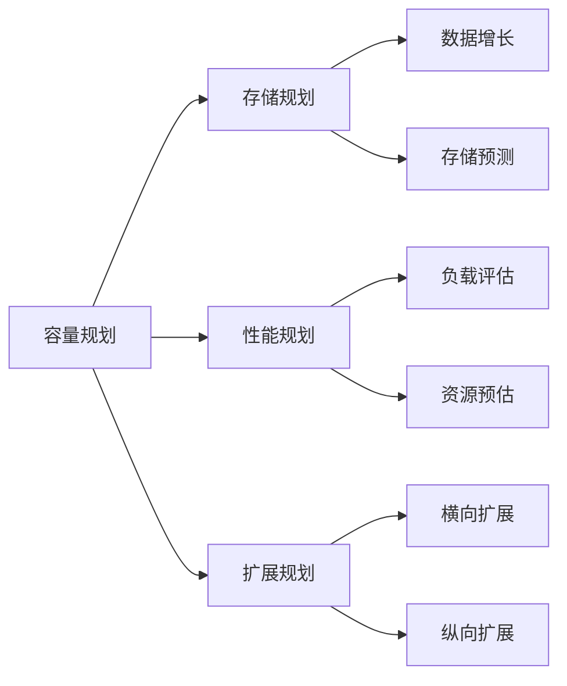

容量规划示例：
```javascript

// 1. 容量规划管理器
class CapacityPlanner {
    async planCapacity() {
        // 收集历史数据
        const historicalData = await this.collectHistoricalData();
        
        // 预测增长
        const growthPrediction = this.predictGrowth(historicalData);
        
        // 规划资源
        return this.planResources(growthPrediction);
    }
    
    async collectHistoricalData() {
        return {
            // 存储使用趋势
            storage: await this.getStorageHistory(),
            
            // 负载趋势
            workload: await this.getWorkloadHistory(),
            
            // 性能指标
            performance: await this.getPerformanceHistory()
        };
    }
    
    predictGrowth(data) {
        return {
            // 存储增长预测
            storagePrediction: this.predictStorageGrowth(data.storage),
            
            // 负载增长预测
            workloadPrediction: this.predictWorkloadGrowth(data.workload),
            
            // 资源需求预测
            resourcePrediction: this.predictResourceNeeds(data)
        };
    }
}

// 2. 扩展规划器
class ScalePlanner {
    async planScaling(predictions) {
        // 评估当前容量
        const currentCapacity = await this.assessCurrentCapacity();
        
        // 确定扩展需求
        const scalingNeeds = this.determineScalingNeeds(
            currentCapacity,
            predictions
        );
        
        // 生成扩展计划
        return this.createScalingPlan(scalingNeeds);
    }
    
    async createScalingPlan(needs) {
        return {
            horizontal: this.planHorizontalScaling(needs),
            vertical: this.planVerticalScaling(needs),
            timeline: this.createTimeline(needs),
            costs: this.estimateCosts(needs)
        };
    }
}

// 3. 资源监控器
class ResourceMonitor {
    async monitorResources() {
        // 监控存储使用
        const storageUsage = await this.monitorStorage();
        
        // 监控系统资源
        const systemResources = await this.monitorSystem();
        
        // 监控性能指标
        const performanceMetrics = await this.monitorPerformance();
        
        // 生成报告
        return this.generateReport({
            storage: storageUsage,
            system: systemResources,
            performance: performanceMetrics
        });
    }
}
```

### 5.2 安全审计

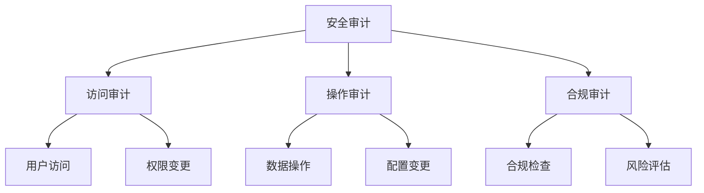

安全审计示例：
```javascript

// 1. 安全审计管理器
class SecurityAuditor {
    async performAudit() {
        // 执行访问审计
        const accessAudit = await this.auditAccess();
        
        // 执行操作审计
        const operationAudit = await this.auditOperations();
        
        // 执行合规审计
        const complianceAudit = await this.auditCompliance();
        
        // 生成审计报告
        return this.generateAuditReport({
            access: accessAudit,
            operations: operationAudit,
            compliance: complianceAudit
        });
    }
    
    async auditAccess() {
        return {
            // 用户访问记录
            userAccess: await this.getUserAccessLogs(),
            
            // 权限变更记录
            permissionChanges: await this.getPermissionChangeLogs(),
            
            // 异常访问
            anomalies: await this.detectAccessAnomalies()
        };
    }
}

// 2. 合规检查器
class ComplianceChecker {
    async checkCompliance() {
        // 检查安全配置
        const securityConfig = await this.checkSecurityConfig();
        
        // 检查数据加密
        const encryption = await this.checkEncryption();
        
        // 检查访问控制
        const accessControl = await this.checkAccessControl();
        
        return {
            security: securityConfig,
            encryption: encryption,
            access: accessControl,
            recommendations: this.generateRecommendations()
        };
    }
}

// 3. 风险评估器
class RiskAssessor {
    async assessRisks() {
        // 识别风险
        const risks = await this.identifyRisks();
        
        // 评估影响
        const impacts = await this.assessImpacts(risks);
        
        // 生成缓解策略
        const mitigations = await this.developMitigations(risks);
        
        return {
            risks: risks,
            impacts: impacts,
            mitigations: mitigations,
            riskMatrix: this.generateRiskMatrix()
        };
    }
}
```

### 5.3 运维自动化

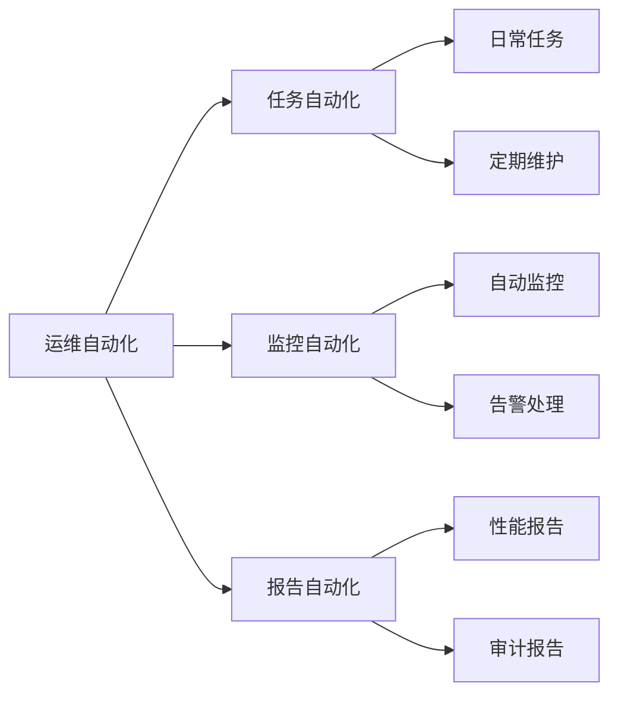

运维自动化示例：
```javascript
// 1. 自动化任务管理器
class AutomationManager {
    constructor() {
        this.tasks = new Map();
        this.scheduler = new TaskScheduler();
    }
    
    async registerTask(task) {
        // 注册自动化任务
        this.tasks.set(task.id, {
            execute: task.execute,
            schedule: task.schedule,
            retry: task.retry || {}
        });
        
        // 调度任务
        await this.scheduler.schedule(task);
    }
    
    async executeTask(taskId) {
        const task = this.tasks.get(taskId);
        
        try {
            // 执行任务
            await task.execute();
            
            // 记录执行结果
            await this.logTaskExecution(taskId, 'success');
            
        } catch (error) {
            // 处理失败
            await this.handleTaskFailure(taskId, error);
            
            // 重试逻辑
            if (task.retry.enabled) {
                await this.retryTask(taskId);
            }
        }
    }
}

// 2. 监控自动化
class AutomatedMonitoring {
    async setupMonitoring() {
        // 配置监控项
        await this.configureMonitors();
        
        // 设置告警规则
        await this.setupAlertRules();
        
        // 配置响应动作
        await this.configureResponses();
    }
    
    async handleAlert(alert) {
        // 分析告警
        const analysis = await this.analyzeAlert(alert);
        
        // 自动响应
        if (analysis.canAutoResolve) {
            await this.autoResolve(alert);
        } else {
            await this.escalateAlert(alert);
        }
    }
}

// 3. 报告自动化
class ReportAutomation {
    async generateReports() {
        // 生成性能报告
        const performanceReport = 
            await this.generatePerformanceReport();
        
        // 生成审计报告
        const auditReport = 
            await this.generateAuditReport();
        
        // 生成容量报告
        const capacityReport = 
            await this.generateCapacityReport();
        
        // 分发报告
        await this.distributeReports({
            performance: performanceReport,
            audit: auditReport,
            capacity: capacityReport
        });
    }
}
```

## 总结

MongoDB 集群运维的核心要点：

1. **集群架构**
   - 复制集架构设计
   - 分片集群架构设计
   - 配置服务器管理

2. **集群部署**
   - 部署策略制定
   - 安全配置实施
   - 性能优化配置

3. **集群维护**
   - 监控体系建设
   - 备份恢复策略
   - 版本升级管理

4. **故障处理**
   - 故障诊断流程
   - 数据修复方案
   - 性能优化方法

5. **日常运维**
   - 容量规划管理
   - 安全审计执行
   - 运维自动化实现
```

