# MongoDB 并发控制机制详解

## 目录
- [1. 并发控制概述](#1-并发控制概述)
  - [1.1 并发控制的必要性](#11-并发控制的必要性)
  - [1.2 MongoDB并发控制演进](#12-mongodb并发控制演进)
- [2. WiredTiger并发控制](#2-wiredtiger并发控制)
  - [2.1 MVCC机制](#21-mvcc机制)
  - [2.2 快照隔离](#22-快照隔离)
  - [2.3 时间戳管理](#23-时间戳管理)
- [3. 锁机制详解](#3-锁机制详解)
  - [3.1 锁的类型与级别](#31-锁的类型与级别)
  - [3.2 锁的获取与释放](#32-锁的获取与释放)
  - [3.3 死锁处理](#33-死锁处理)
- [4. 事务实现机制](#4-事务实现机制)
  - [4.1 单文档事务](#41-单文档事务)
  - [4.2 多文档事务](#42-多文档事务)
  - [4.3 分布式事务](#43-分布式事务)
- [5. 性能优化与最佳实践](#5-性能优化与最佳实践)
  - [5.1 并发性能优化](#51-并发性能优化)
  - [5.2 事务性能优化](#52-事务性能优化)
  - [5.3 最佳实践建议](#53-最佳实践建议)

---

## 1. 并发控制概述

### 1.1 并发控制的必要性

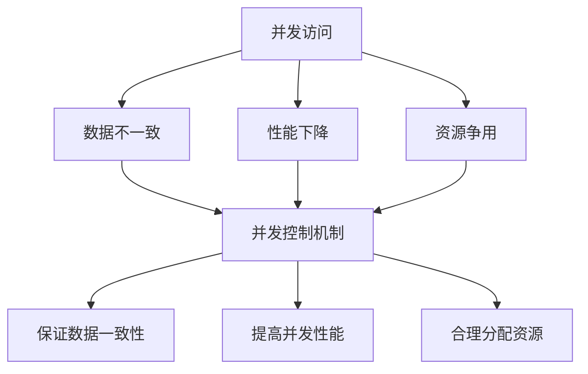

并发问题示例：
```javascript
// 转账场景的并发问题
// 事务1：A向B转账100元
db.accounts.updateOne(
    { user: "A" }, 
    { $inc: { balance: -100 } }
)
db.accounts.updateOne(
    { user: "B" }, 
    { $inc: { balance: 100 } }
)

// 同时事务2：A向C转账50元
db.accounts.updateOne(
    { user: "A" }, 
    { $inc: { balance: -50 } }
)
db.accounts.updateOne(
    { user: "C" }, 
    { $inc: { balance: 50 } }
)
```

### 1.2 MongoDB并发控制演进

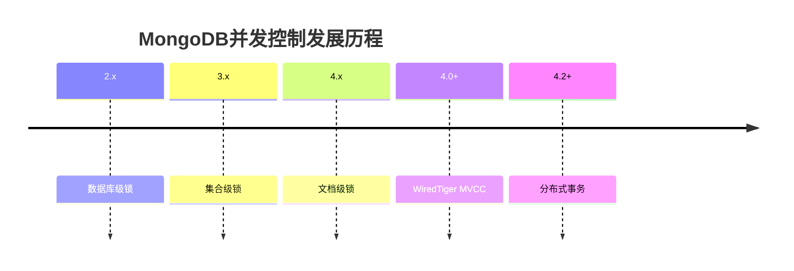

## 2. WiredTiger并发控制

### 2.1 MVCC机制

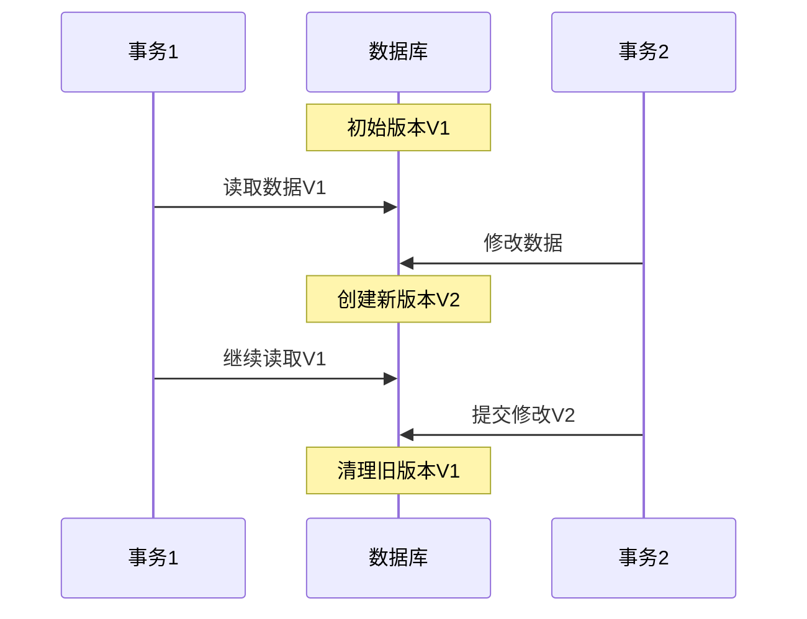

MVCC实现细节：
```javascript
// 查看当前快照
db.runCommand({
    serverStatus: 1,
    "wiredTiger": 1
})

// 设置快照窗口大小
db.adminCommand({
    setParameter: 1,
    "wiredTigerEngineRuntimeConfig": "cache_size=10GB"
})
```

### 2.2 快照隔离

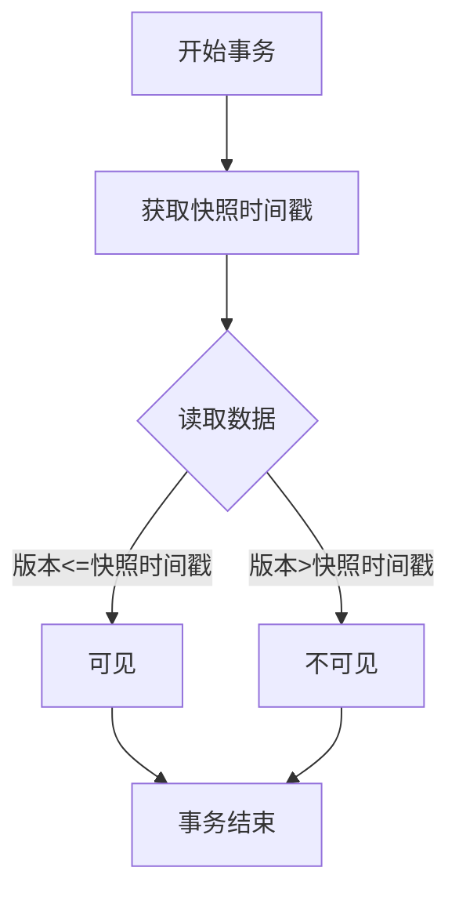

快照隔离示例：
```javascript
// 启动带有因果一致性的会话
const session = db.getMongo().startSession({
    causalConsistency: true
});

session.startTransaction({
    readConcern: { level: "snapshot" },
    writeConcern: { w: "majority" }
});

try {
    const coll = session.getDatabase("test").getCollection("users");
    // 读取的是事务开始时的快照
    const doc = coll.findOne({ _id: 1 });
    // 修改数据
    coll.updateOne({ _id: 1 }, { $set: { status: "updated" } });
    session.commitTransaction();
} catch (error) {
    session.abortTransaction();
}
```

### 2.3 时间戳管理

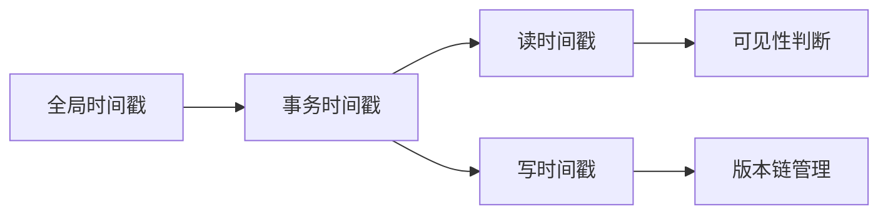

时间戳相关操作：
```javascript
// 查看操作时间戳
db.runCommand({
    serverStatus: 1,
    "oplog": 1
})

// 设置操作时间戳
db.adminCommand({
    setParameter: 1,
    "minSnapshotHistoryWindowInSeconds": 3600
})
```

## 3. 锁机制详解

### 3.1 锁的类型与级别

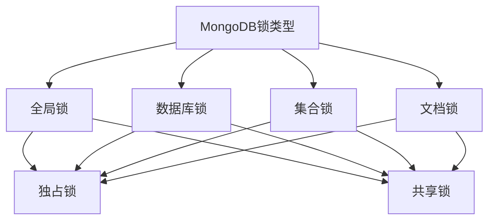

锁级别操作示例：
```javascript
// 查看当前锁状态
db.currentOp(true)

// 查看锁等待情况
db.serverStatus().locks

// 终止长时间锁等待操作
db.killOp(opId)
```

### 3.2 锁的获取与释放

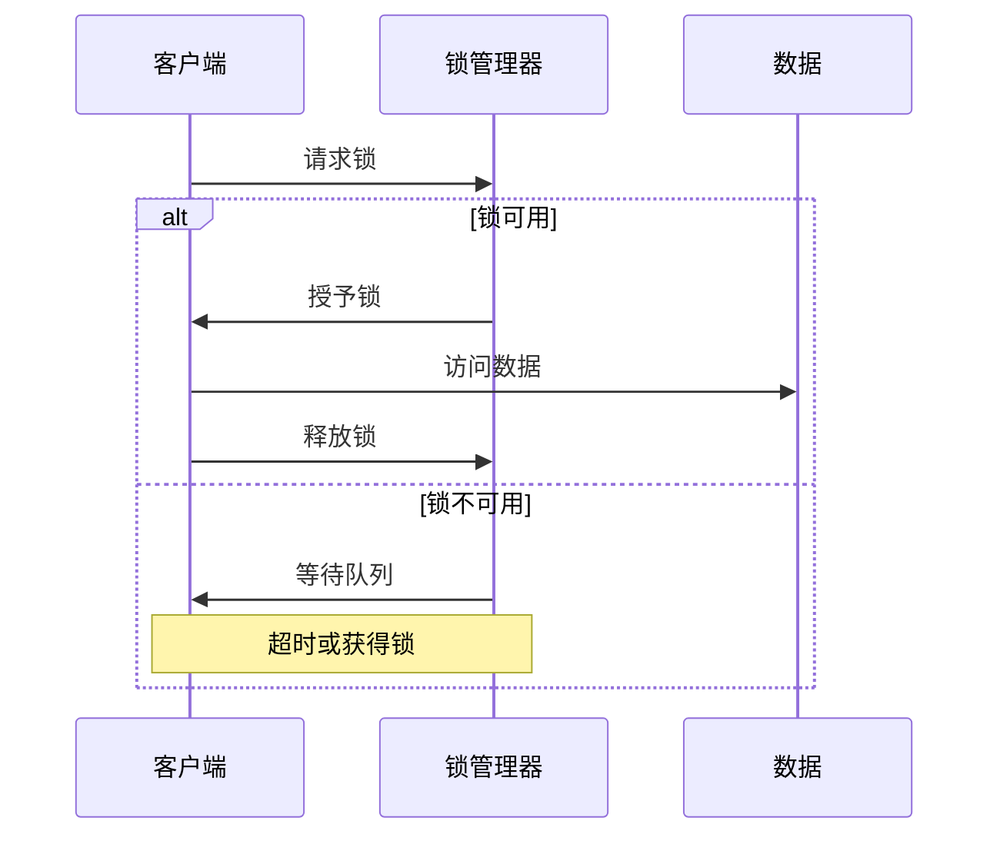

锁相关配置：
```javascript
// 设置锁等待超时时间
db.adminCommand({
    setParameter: 1,
    maxTransactionLockRequestTimeoutMillis: 5000
})

// 查看锁信息
db.serverStatus().locks
```

### 3.3 死锁处理

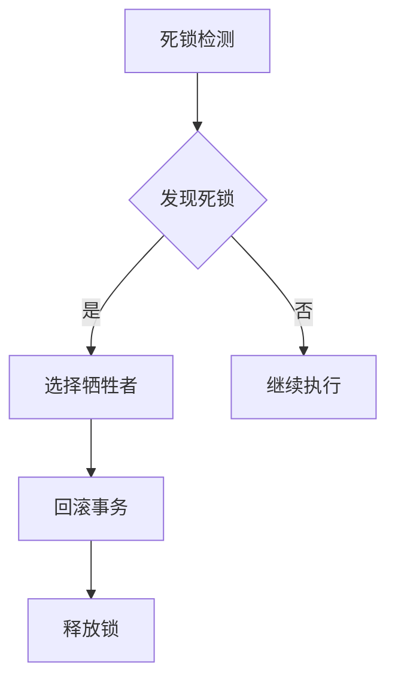

死锁处理示例：
```javascript
// 设置死锁检测时间
db.adminCommand({
    setParameter: 1,
    transactionLifetimeLimitSeconds: 60
})

// 监控死锁情况
db.serverStatus().wiredTiger.lock

// 处理死锁
db.currentOp({
    "waitingForLock": true,
    "secs_running": { $gt: 10 }
})
```


## 4. 事务实现机制

### 4.1 单文档事务

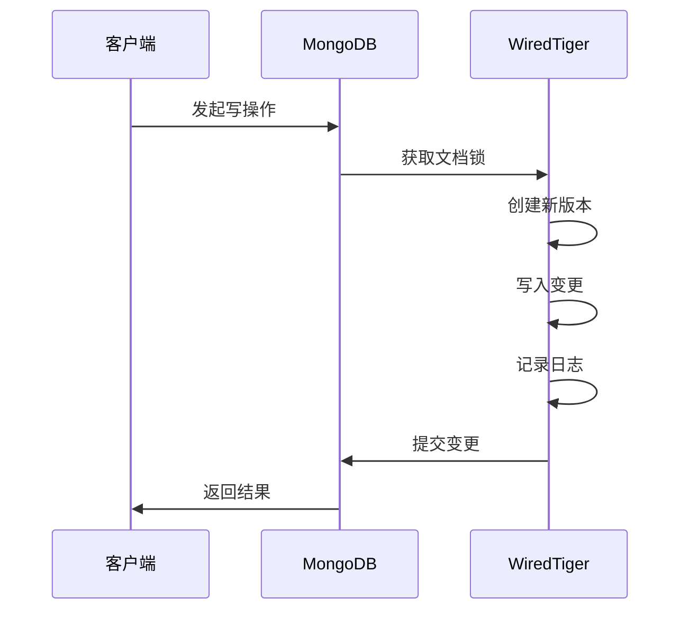

单文档事务特点：
1. 原子性保证
2. 无需显式开启事务
3. 性能开销小

示例代码：
```javascript
// 单文档原子操作
db.accounts.updateOne(
    { _id: 1 },
    {
        $set: { balance: 1000 },
        $push: { 
            transactions: {
                type: "deposit",
                amount: 1000,
                timestamp: new Date()
            }
        }
    }
)
```

### 4.2 多文档事务

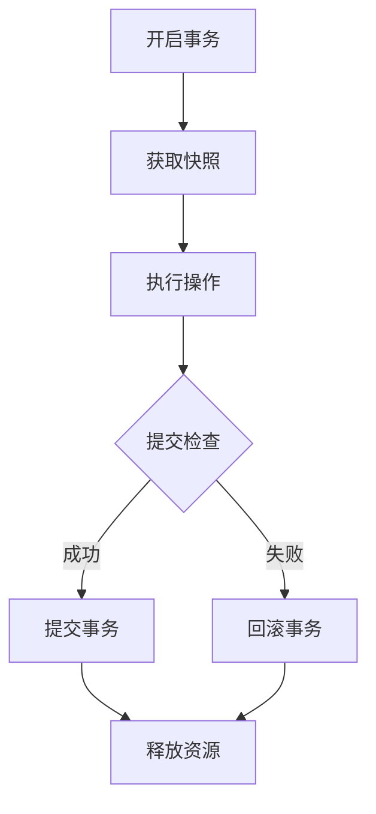

多文档事务示例：
```javascript
// 启动事务会话
const session = db.getMongo().startSession();
session.startTransaction({
    readConcern: { level: "snapshot" },
    writeConcern: { w: "majority" },
    readPreference: "primary"
});

try {
    // 转账操作
    const accounts = session.getDatabase("bank").accounts;
    
    // 扣款方减少余额
    accounts.updateOne(
        { _id: "A" },
        { $inc: { balance: -100 } }
    );
    
    // 收款方增加余额
    accounts.updateOne(
        { _id: "B" },
        { $inc: { balance: 100 } }
    );
    
    // 提交事务
    session.commitTransaction();
} catch (error) {
    // 错误时回滚
    session.abortTransaction();
    throw error;
} finally {
    session.endSession();
}
```

### 4.3 分布式事务

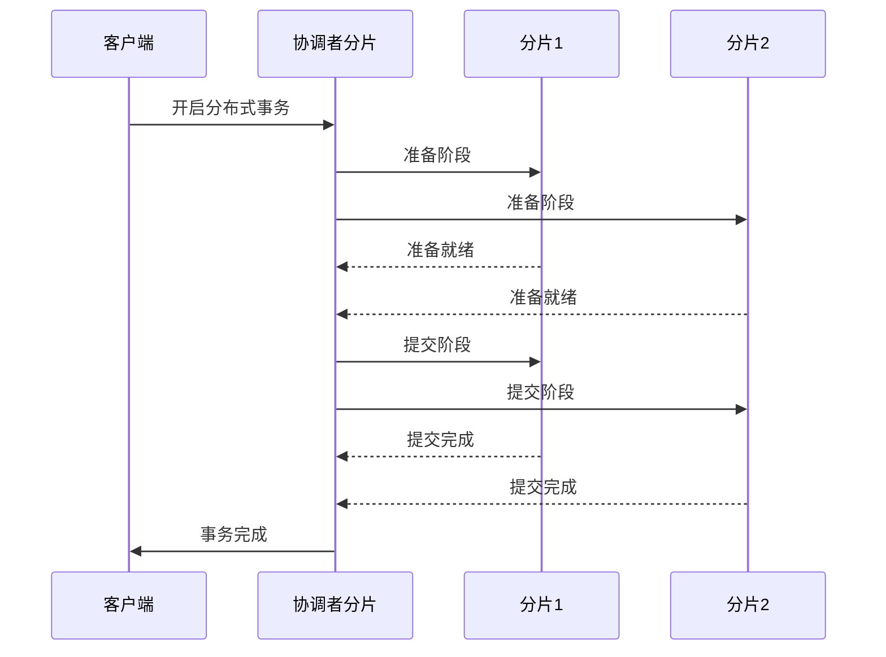

分布式事务配置：
```javascript
// 启用分布式事务
db.adminCommand({
    setFeatureCompatibilityVersion: "4.4"
});

// 配置事务超时时间
db.adminCommand({
    setParameter: 1,
    transactionLifetimeLimitSeconds: 120
});

// 监控分布式事务
db.serverStatus().transactions
```

## 5. 性能优化与最佳实践

### 5.1 并发性能优化

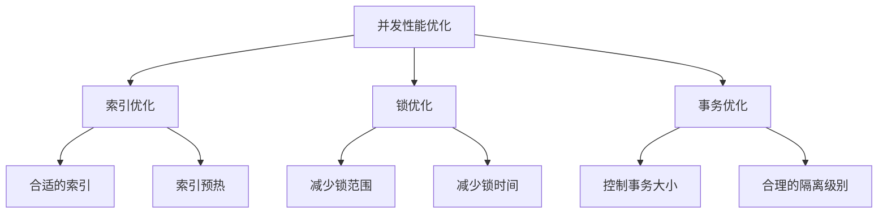

优化措施示例：
```javascript
// 创建合适的索引
db.collection.createIndex(
    { field1: 1, field2: 1 },
    { background: true }
);

// 索引使用分析
db.collection.aggregate([
    { $indexStats: {} }
]);

// 监控锁等待
db.serverStatus().locks
```

### 5.2 事务性能优化

1. **事务大小控制**
```javascript
// 批量操作替代循环
db.collection.bulkWrite([
    { updateOne: { 
        filter: { _id: 1 },
        update: { $set: { status: "updated" } }
    }},
    { updateOne: { 
        filter: { _id: 2 },
        update: { $set: { status: "updated" } }
    }}
], { ordered: false });
```

2. **事务超时设置**
```javascript
// 设置合理的超时时间
session.startTransaction({
    maxTimeMS: 5000,
    readConcern: { level: "snapshot" }
});
```

3. **并发控制优化**
```javascript
// 使用适当的读关注级别
db.collection.find().readConcern("local");

// 使用适当的写关注级别
db.collection.insertOne(
    { doc },
    { writeConcern: { w: 1, wtimeout: 5000 } }
);
```

### 5.3 最佳实践建议

1. **事务使用建议**
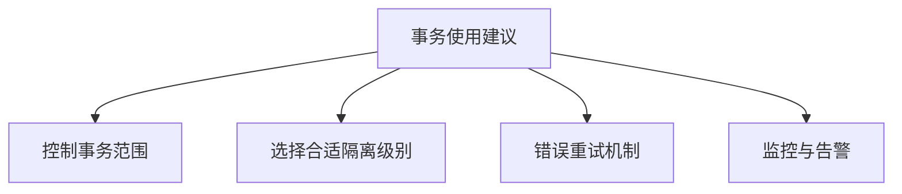

2. **具体建议**:
   - 尽量使用单文档事务
   - 控制事务操作文档数量
   - 避免长时间运行的事务
   - 合理设置超时时间
   - 实现重试机制

3. **监控指标**
```javascript
// 性能监控
db.serverStatus().wiredTiger
db.serverStatus().locks
db.serverStatus().transactions

// 慢查询分析
db.setProfilingLevel(1, { slowms: 100 });
db.system.profile.find().pretty();
```

4. **常见问题处理**
```javascript
// 处理死锁
db.currentOp({
    "waitingForLock": true,
    "secs_running": { $gt: 10 }
}).forEach(function(op) {
    db.killOp(op.opid);
});

// 终止长时间运行的事务
db.adminCommand({
    killAllSessions: []
});
```

## 6. 总结

MongoDB的并发控制机制通过多个层面保证数据一致性和并发性能：

1. **架构层面**
   - WiredTiger存储引擎的MVCC机制
   - 文档级别的并发控制
   - 分布式事务支持

2. **实现层面**
   - 多版本并发控制
   - 快照隔离
   - 多级锁机制

3. **优化层面**
   - 索引优化
   - 锁优化
   - 事务优化

4. **最佳实践**
   - 合理使用事务
   - 性能监控
   - 问题诊断处理

通过合理使用这些机制，可以在保证数据一致性的同时获得较好的并发性能。
```


