# MongoDB 数据一致性详解

## 目录
- [1. 一致性基础概念](#1-一致性基础概念)
  - [1.1 CAP理论与MongoDB](#11-cap理论与mongodb)
  - [1.2 一致性级别](#12-一致性级别)
  - [1.3 写关注与读关注](#13-写关注与读关注)
- [2. 复制集一致性](#2-复制集一致性)
  - [2.1 复制机制](#21-复制机制)
  - [2.2 选举机制](#22-选举机制)
  - [2.3 数据同步](#23-数据同步)
- [3. 事务管理](#3-事务管理)
  - [3.1 单文档事务](#31-单文档事务)
  - [3.2 多文档事务](#32-多文档事务)
  - [3.3 分布式事务](#33-分布式事务)
- [4. 并发控制](#4-并发控制)
  - [4.1 读写锁](#41-读写锁)
  - [4.2 WiredTiger存储引擎](#42-wiredtiger存储引擎)
  - [4.3 并发冲突处理](#43-并发冲突处理)
- [5. 最佳实践与案例](#5-最佳实践与案例)
  - [5.1 一致性保证方案](#51-一致性保证方案)
  - [5.2 性能优化建议](#52-性能优化建议)
  - [5.3 问题诊断处理](#53-问题诊断处理)

---

## 1. 一致性基础概念

### 1.1 CAP理论与MongoDB

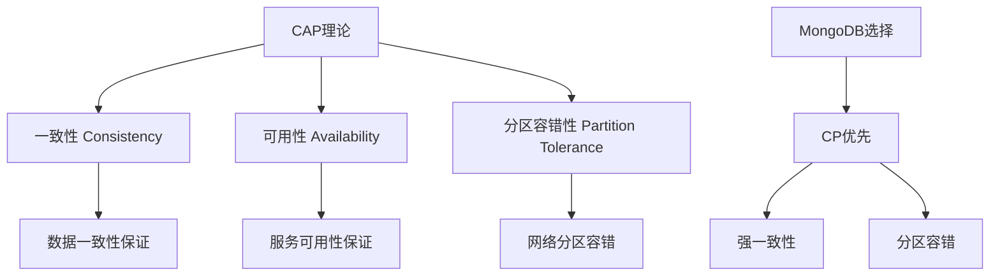

MongoDB在CAP中的选择：
```javascript


// 配置复制集写关注以保证一致性
db.collection.insertOne(
    { item: "example" },
    { writeConcern: { w: "majority" } }
)

// 配置读关注以保证一致性读取
db.collection.find().readConcern("majority")
```

### 1.2 一致性级别

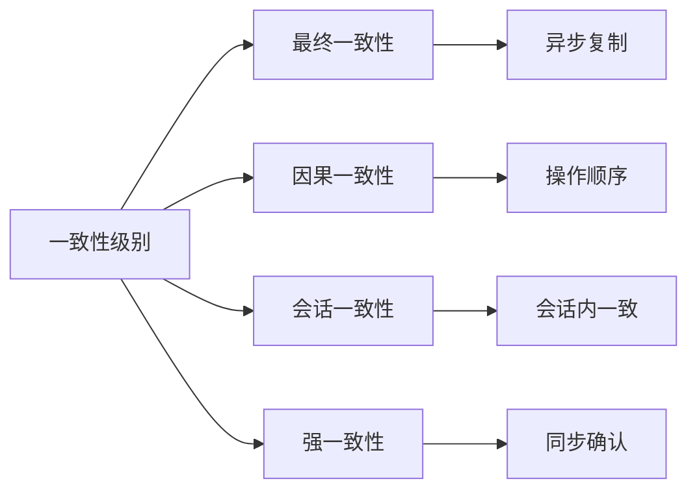

一致性级别配置示例：
```javascript


// 强一致性写入
db.collection.insertOne(
    { _id: 1, value: "test" },
    {
        writeConcern: { w: "majority", j: true }
    }
)

// 因果一致性会话
const session = db.getMongo().startSession({
    causalConsistency: true
});

session.startTransaction();
try {
    const coll = session.getDatabase("test").collection;
    await coll.insertOne({ _id: 1, value: "test" });
    await coll.updateOne(
        { _id: 1 },
        { $set: { value: "updated" } }
    );
    await session.commitTransaction();
} catch (error) {
    await session.abortTransaction();
}
```

### 1.3 写关注与读关注

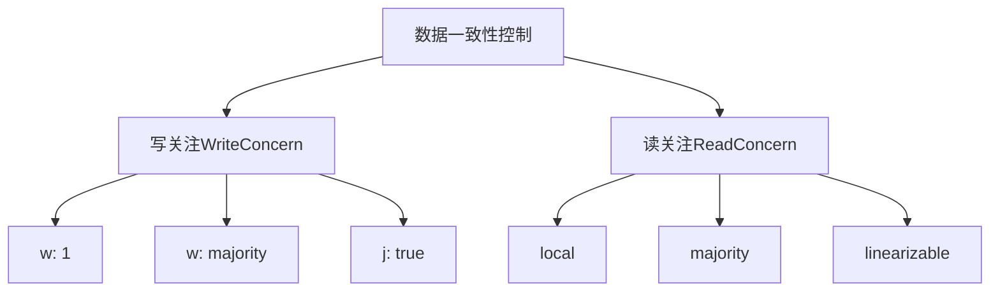

写关注和读关注配置：
```javascript


// 写关注级别配置
db.collection.insertOne(
    { item: "example" },
    {
        writeConcern: {
            w: "majority",  // 多数节点确认
            j: true,        // 写入日志
            wtimeout: 5000  // 超时时间
        }
    }
)

// 读关注级别配置
db.collection.find().readConcern("majority")

// 组合使用示例
const session = db.getMongo().startSession();
session.startTransaction({
    readConcern: { level: "snapshot" },
    writeConcern: { w: "majority" }
});

try {
    const coll = session.getDatabase("test").collection;
    await coll.updateOne(
        { _id: 1 },
        { $set: { status: "processed" } }
    );
    await session.commitTransaction();
} catch (error) {
    await session.abortTransaction();
}
```

## 2. 复制集一致性

### 2.1 复制机制

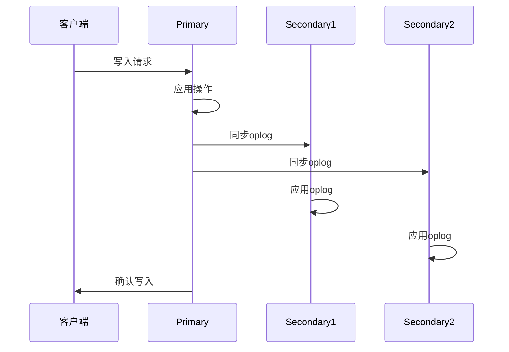

复制集配置示例：
```javascript


// 初始化复制集
rs.initiate({
    _id: "myReplicaSet",
    members: [
        { _id: 0, host: "mongodb1:27017" },
        { _id: 1, host: "mongodb2:27017" },
        { _id: 2, host: "mongodb3:27017" }
    ]
})

// 监控复制状态
rs.status()

// 检查oplog大小
db.getReplicationInfo()

// 配置oplog大小
db.adminCommand({
    replSetResizeOplog: 1,
    size: 16384  // 16GB
})
```
### 2.2 选举机制

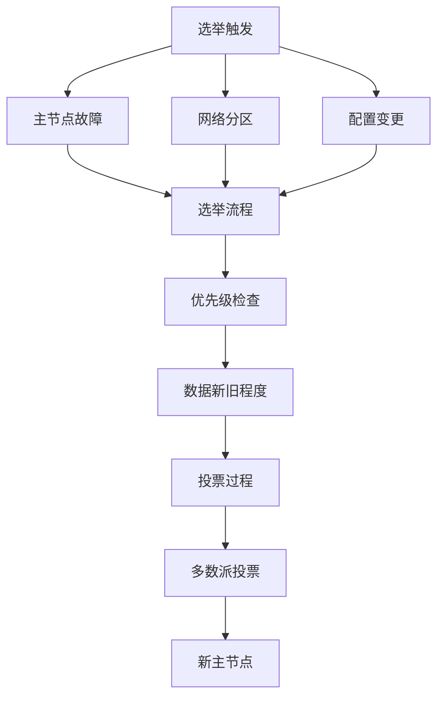

选举配置与监控：
```javascript
// 配置节点优先级
cfg = rs.conf()
cfg.members[0].priority = 2  // 提高优先级
cfg.members[1].priority = 1
cfg.members[2].priority = 1
rs.reconfig(cfg)

// 强制选举
rs.stepDown()

// 监控选举状态
db.adminCommand({
    replSetGetStatus: 1,
    initialSync: true
})

// 选举调试日志
db.setLogLevel(1, "replication")
```

### 2.3 数据同步

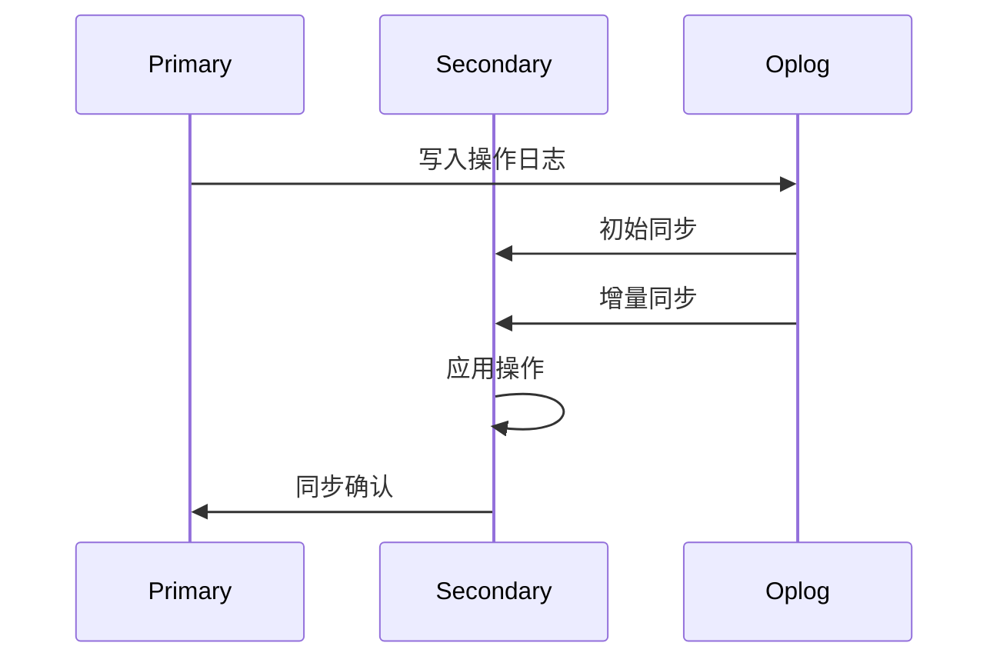

数据同步管理：
```javascript
// 检查同步状态
db.adminCommand({ replSetGetStatus: 1 })

// 监控同步延迟
rs.printSecondaryReplicationInfo()

// 配置同步参数
cfg = rs.conf()
cfg.settings = {
    chainingAllowed: true,
    heartbeatTimeoutSecs: 10,
    electionTimeoutMillis: 10000
}
rs.reconfig(cfg)

// 处理同步问题
db.adminCommand({
    resync: 1,
    force: true
})
```

## 3. 事务管理

### 3.1 单文档事务

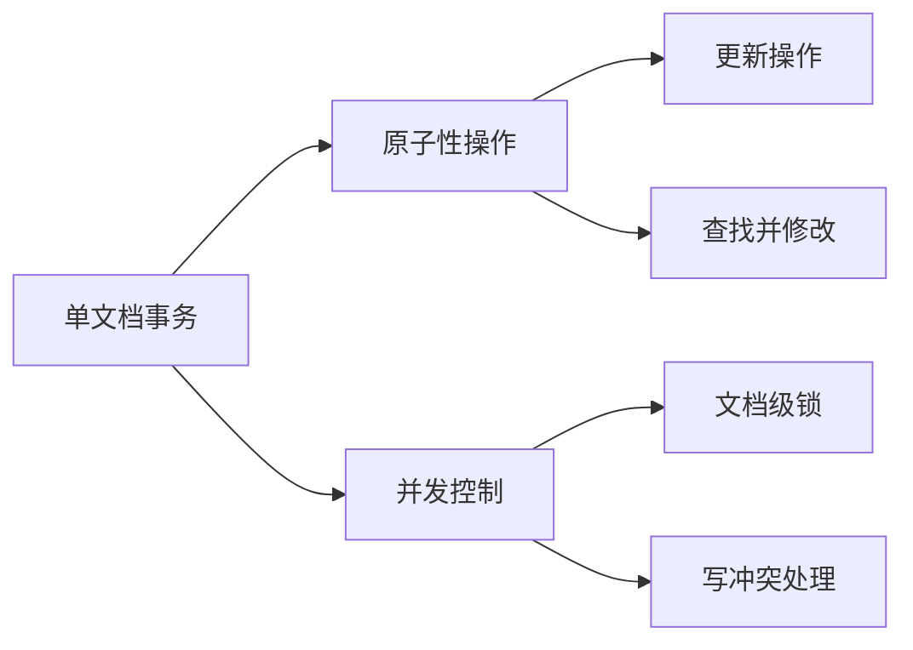

单文档事务示例：
```javascript
// 原子更新操作
db.accounts.updateOne(
    { _id: "account1" },
    {
        $inc: { balance: -100 },
        $push: {
            transactions: {
                type: "debit",
                amount: 100,
                timestamp: new Date()
            }
        }
    }
)

// 查找并修改
db.orders.findOneAndUpdate(
    { status: "pending" },
    {
        $set: { status: "processing" },
        $currentDate: { lastModified: true }
    },
    { returnDocument: "after" }
)
```

### 3.2 多文档事务

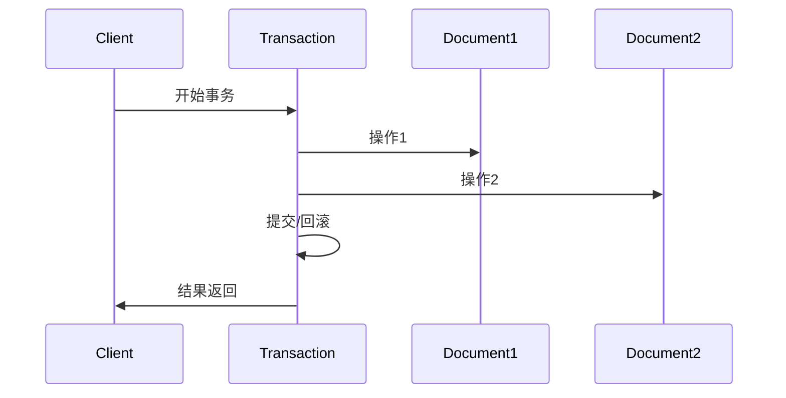

多文档事务示例：
```javascript
// 启动事务会话
const session = db.getMongo().startSession();
session.startTransaction({
    readConcern: { level: "snapshot" },
    writeConcern: { w: "majority" }
});

try {
    // 转账操作
    const accounts = session.getDatabase("bank").accounts;
    
    // 扣款
    await accounts.updateOne(
        { _id: "account1" },
        { $inc: { balance: -100 } }
    );
    
    // 入账
    await accounts.updateOne(
        { _id: "account2" },
        { $inc: { balance: 100 } }
    );
    
    // 记录交易
    await accounts.insertOne({
        type: "transfer",
        from: "account1",
        to: "account2",
        amount: 100,
        timestamp: new Date()
    });
    
    await session.commitTransaction();
} catch (error) {
    await session.abortTransaction();
    throw error;
} finally {
    session.endSession();
}
```

### 3.3 分布式事务

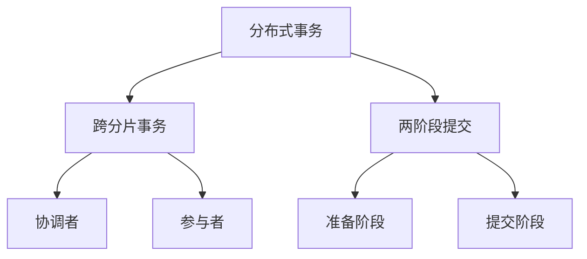

分布式事务配置：
```javascript
// 配置分布式事务
db.adminCommand({
    setFeatureCompatibilityVersion: "4.4"
})

// 跨分片事务示例
const session = db.getMongo().startSession();
session.startTransaction({
    readConcern: { level: "snapshot" },
    writeConcern: { w: "majority" },
    readPreference: "primary"
});

try {
    // 跨分片操作
    const orders = session.getDatabase("shop").orders;
    const inventory = session.getDatabase("shop").inventory;
    
    // 创建订单
    await orders.insertOne({
        _id: "order1",
        items: ["item1", "item2"],
        status: "pending"
    });
    
    // 更新库存
    await inventory.updateMany(
        { _id: { $in: ["item1", "item2"] } },
        { $inc: { stock: -1 } }
    );
    
    await session.commitTransaction();
} catch (error) {
    await session.abortTransaction();
    throw error;
} finally {
    session.endSession();
}
```

## 4. 并发控制

### 4.1 读写锁

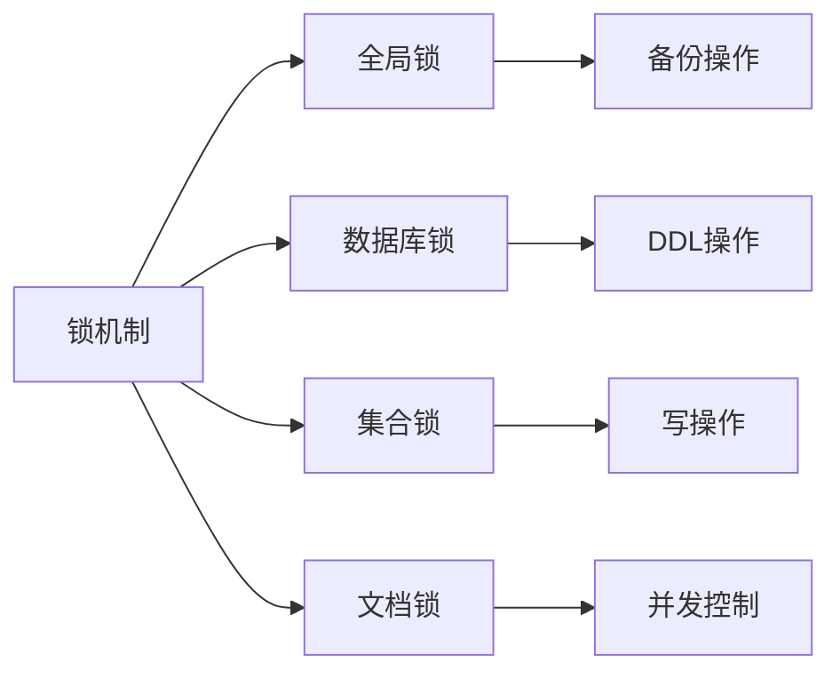

锁管理示例：
```javascript
// 查看当前锁状态
db.currentOp(
    { waitingForLock: true }
)

// 查看锁信息
db.serverStatus().locks

// 终止长时间锁定的操作
db.killOp(opId)

// 设置最大锁等待时间
db.adminCommand({
    setParameter: 1,
    maxTransactionLockRequestTimeoutMillis: 5000
})
```

### 4.2 WiredTiger存储引擎

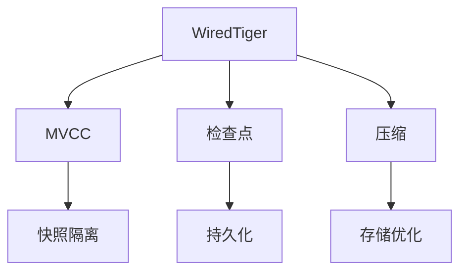

WiredTiger配置：
```javascript
// 配置WiredTiger参数
db.adminCommand({
    setParameter: 1,
    wiredTigerConcurrentReadTransactions: 128,
    wiredTigerConcurrentWriteTransactions: 32
})

// 检查点设置
db.adminCommand({
    setParameter: 1,
    wiredTigerCheckpointDelaySecs: 60
})

// 监控存储引擎状态
db.serverStatus().wiredTiger
```

### 4.3 并发冲突处理

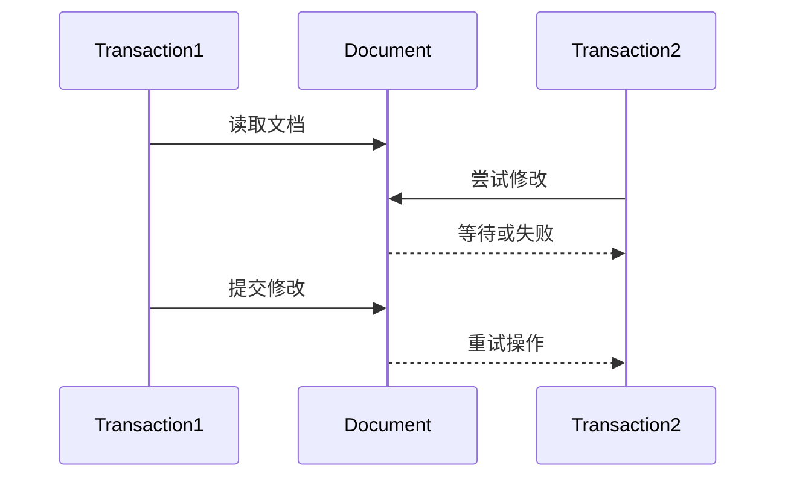

冲突处理示例：
```javascript
// 乐观并发控制
const doc = await collection.findOne({ _id: 1 });
const version = doc._version;

try {
    await collection.updateOne(
        {
            _id: 1,
            _version: version
        },
        {
            $set: { 
                data: "new value",
                _version: version + 1
            }
        }
    );
} catch (error) {
    // 处理并发冲突
    console.log("Version conflict, retrying...");
}

// 使用重试逻辑
const retryOperation = async (operation, maxAttempts = 3) => {
    for (let attempt = 1; attempt <= maxAttempts; attempt++) {
        try {
            return await operation();
        } catch (error) {
            if (attempt === maxAttempts) throw error;
            await new Promise(resolve => 
                setTimeout(resolve, Math.random() * 1000)
            );
        }
    }
};
```

## 5. 最佳实践与案例

### 5.1 一致性保证方案

1. **强一致性场景**
```javascript
// 金融交易示例
const session = db.getMongo().startSession();
session.startTransaction({
    readConcern: { level: "linearizable" },
    writeConcern: { w: "majority", j: true }
});

try {
    const accounts = session.getDatabase("bank").accounts;
    // 转账操作
    await accounts.updateOne(
        { _id: "account1", balance: { $gte: 100 } },
        { $inc: { balance: -100 } }
    );
    await accounts.updateOne(
        { _id: "account2" },
        { $inc: { balance: 100 } }
    );
    await session.commitTransaction();
} catch (error) {
    await session.abortTransaction();
    throw error;
}
```

2. **最终一致性场景**
```javascript
// 日志记录示例
db.logs.insertOne(
    {
        timestamp: new Date(),
        action: "user_login",
        userId: "user123"
    },
    { writeConcern: { w: 1 } }
)
```

### 5.2 性能优化建议

```javascript
// 1. 批量写入优化
const bulk = db.collection.initializeUnorderedBulkOp();
for (let i = 0; i < 1000; i++) {
    bulk.insert({ data: i });
}
await bulk.execute();

// 2. 读取优化
db.collection.find({
    status: "active"
}).hint({ status: 1 }).readConcern("local")

// 3. 索引优化
db.collection.createIndex(
    { status: 1, timestamp: -1 },
    { background: true }
)
```

### 5.3 问题诊断处理

```javascript
// 1. 监控复制延迟
rs.printSecondaryReplicationInfo()

// 2. 检查事务状态
db.currentOp(
    { "transaction": { $exists: true } }
)

// 3. 分析锁竞争
db.serverStatus().globalLock

// 4. 性能诊断
db.setProfilingLevel(1, { slowms: 100 })
db.system.profile.find().sort({ ts: -1 })
```

## 6. 总结

MongoDB数据一致性管理的核心要点：

1. **一致性级别选择**
   - 根据业务需求选择合适的一致性级别
   - 权衡性能和一致性需求
   - 合理配置读写关注

2. **事务管理策略**
   - 适当使用事务保证数据一致性
   - 注意事务范围和性能影响
   - 正确处理事务异常

3. **并发控制机制**
   - 理解锁机制和MVCC
   - 合理使用乐观并发控制
   - 妥善处理并发冲突

4. **最佳实践**
   - 定期监控系统状态
   - 及时处理复制延迟
   - 优化查询和写入性能
```

