# MongoDB 数据建模详解

## 目录
- [1. 数据建模基础](#1-数据建模基础)
  - [1.1 文档模型特点](#11-文档模型特点)
  - [1.2 数据模型设计原则](#12-数据模型设计原则)
  - [1.3 与关系型数据库的区别](#13-与关系型数据库的区别)
- [2. 数据模型设计策略](#2-数据模型设计策略)
  - [2.1 嵌入式模型](#21-嵌入式模型)
  - [2.2 引用式模型](#22-引用式模型)
  - [2.3 混合型模型](#23-混合型模型)
- [3. 模式设计模式](#3-模式设计模式)
  - [3.1 一对一关系](#31-一对一关系)
  - [3.2 一对多关系](#32-一对多关系)
  - [3.3 多对多关系](#33-多对多关系)
- [4. 数据模型优化](#4-数据模型优化)
  - [4.1 索引优化](#41-索引优化)
  - [4.2 数据访问优化](#42-数据访问优化)
  - [4.3 数据一致性保证](#43-数据一致性保证)
- [5. 最佳实践与案例](#5-最佳实践与案例)
  - [5.1 常见应用场景](#51-常见应用场景)
  - [5.2 性能优化建议](#52-性能优化建议)
  - [5.3 实战案例分析](#53-实战案例分析)

---

## 1. 数据建模基础

### 1.1 文档模型特点

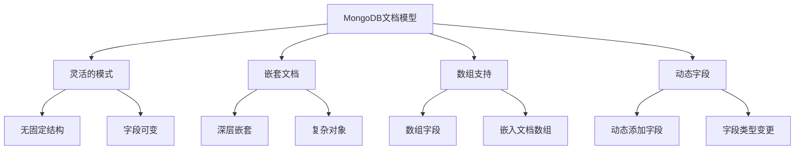

文档结构示例：
```javascript
// 用户文档示例
{
    _id: ObjectId("..."),
    name: "张三",
    age: 30,
    contact: {
        email: "zhangsan@example.com",
        phone: "13800138000",
        address: {
            city: "北京",
            street: "朝阳路"
        }
    },
    tags: ["vip", "active"],
    created_at: ISODate("2024-01-20")
}

// 查询嵌套字段
db.users.find({
    "contact.address.city": "北京"
})
```

### 1.2 数据模型设计原则

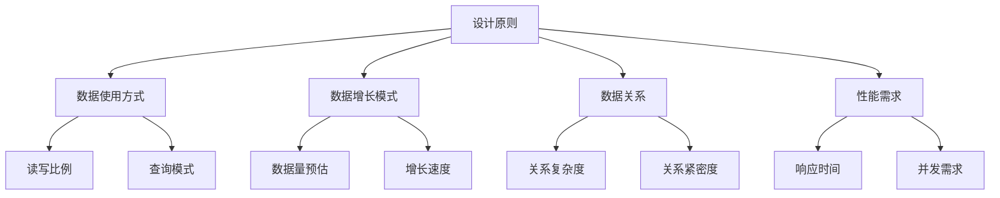

设计考虑因素：
```javascript
// 1. 文档大小限制
const DOC_SIZE_LIMIT = 16 * 1024 * 1024; // 16MB

// 2. 数组元素数量
const ARRAY_SIZE_RECOMMENDATION = 1000; // 建议限制

// 3. 嵌套层级
const NESTING_LEVEL_RECOMMENDATION = 3; // 建议最大层级

// 性能测试示例
db.users.explain("executionStats").find({
    "contact.address.city": "北京"
})
```

### 1.3 与关系型数据库的区别

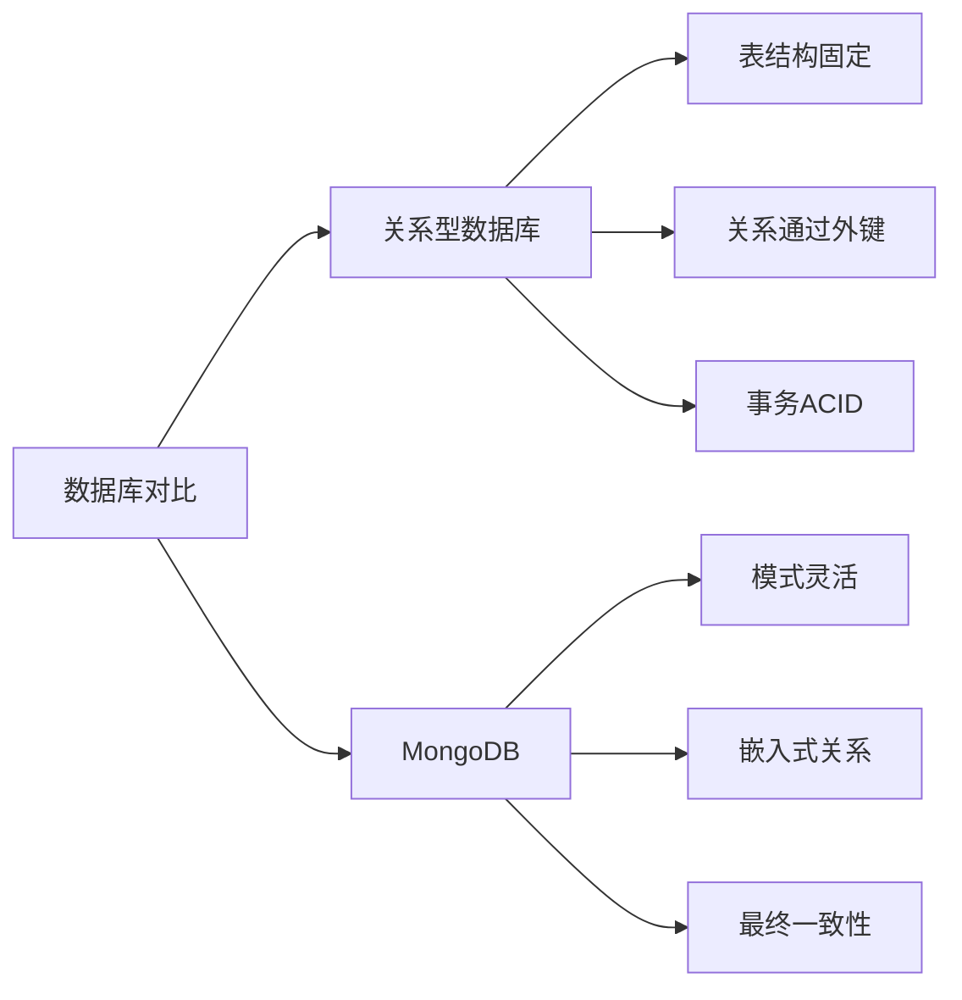

模型转换示例：
```javascript
// 关系型数据库表结构
/*
CREATE TABLE users (
    id INT PRIMARY KEY,
    name VARCHAR(50),
    age INT
);

CREATE TABLE addresses (
    id INT PRIMARY KEY,
    user_id INT,
    city VARCHAR(50),
    street VARCHAR(100),
    FOREIGN KEY (user_id) REFERENCES users(id)
);
*/

// MongoDB对应的文档模型
{
    _id: ObjectId("..."),
    name: "张三",
    age: 30,
    addresses: [
        {
            city: "北京",
            street: "朝阳路"
        },
        {
            city: "上海",
            street: "南京路"
        }
    ]
}
```

## 2. 数据模型设计策略

### 2.1 嵌入式模型

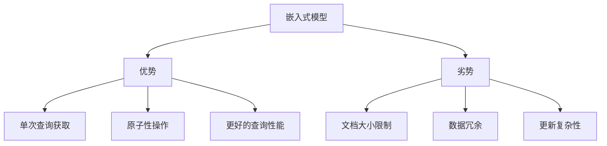

嵌入式模型示例：
```javascript
// 博客文章及其评论
{
    _id: ObjectId("..."),
    title: "MongoDB最佳实践",
    content: "...",
    author: "张三",
    comments: [
        {
            user: "李四",
            content: "很有帮助",
            created_at: ISODate("2024-01-20")
        },
        {
            user: "王五",
            content: "写得不错",
            created_at: ISODate("2024-01-21")
        }
    ]
}

// 查询包含特定评论的文章
db.posts.find({
    "comments.user": "李四"
})

// 添加新评论
db.posts.updateOne(
    { _id: ObjectId("...") },
    {
        $push: {
            comments: {
                user: "赵六",
                content: "学习了",
                created_at: new Date()
            }
        }
    }
)
```


### 2.2 引用式模型

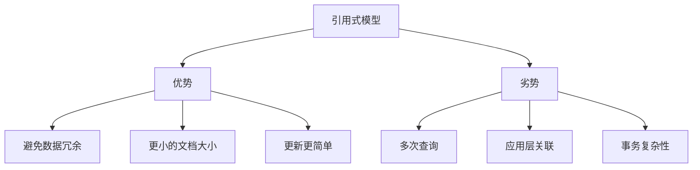

引用式模型示例：
```javascript

// 用户集合
db.users.insertOne({
    _id: ObjectId("user123"),
    name: "张三",
    email: "zhangsan@example.com"
})

// 订单集合
db.orders.insertOne({
    _id: ObjectId("order456"),
    user_id: ObjectId("user123"),  // 引用用户ID
    total: 199.99,
    items: [
        { product_id: ObjectId("prod789"), quantity: 2 }
    ]
})

// 使用$lookup进行关联查询
db.orders.aggregate([
    {
        $lookup: {
            from: "users",
            localField: "user_id",
            foreignField: "_id",
            as: "user_info"
        }
    }
])

// 手动关联查询
async function getOrderWithUser(orderId) {
    const order = await db.orders.findOne({ _id: orderId });
    const user = await db.users.findOne({ _id: order.user_id });
    return { ...order, user };
}
```

### 2.3 混合型模型

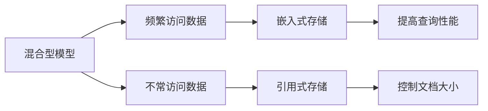

混合型模型示例：
```javascript

// 产品集合
{
    _id: ObjectId("prod123"),
    name: "智能手机",
    price: 4999,
    // 常用信息嵌入
    basic_specs: {
        color: "黑色",
        storage: "128GB",
        screen: "6.1英寸"
    },
    // 详细信息引用
    detailed_spec_id: ObjectId("spec789"),
    // 最新5条评论嵌入
    recent_reviews: [
        {
            user_id: ObjectId("user111"),
            rating: 5,
            comment: "很好用"
        }
    ],
    // 历史评论引用
    review_collection_id: ObjectId("reviews456")
}

// 查询和更新示例
// 1. 更新最新评论
db.products.updateOne(
    { _id: ObjectId("prod123") },
    {
        $push: {
            recent_reviews: {
                $each: [newReview],
                $slice: -5  // 只保留最新5条
            }
        }
    }
)

// 2. 获取详细信息
const getProductDetails = async (productId) => {
    const product = await db.products.findOne({ _id: productId });
    const specs = await db.specifications.findOne({ 
        _id: product.detailed_spec_id 
    });
    return { ...product, detailed_specs: specs };
}
```

## 3. 模式设计模式

### 3.1 一对一关系

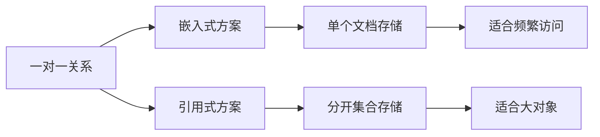

一对一关系示例：
```javascript

// 方案1：嵌入式（用户和个人资料）
{
    _id: ObjectId("user123"),
    name: "张三",
    profile: {
        birthday: ISODate("1990-01-01"),
        gender: "male",
        bio: "这是一段个人简介...",
        avatar_url: "http://example.com/avatar.jpg"
    }
}

// 方案2：引用式
// users集合
{
    _id: ObjectId("user123"),
    name: "张三"
}

// profiles集合
{
    _id: ObjectId("profile123"),
    user_id: ObjectId("user123"),
    birthday: ISODate("1990-01-01"),
    gender: "male",
    bio: "这是一段个人简介...",
    avatar_url: "http://example.com/avatar.jpg"
}
```

### 3.2 一对多关系

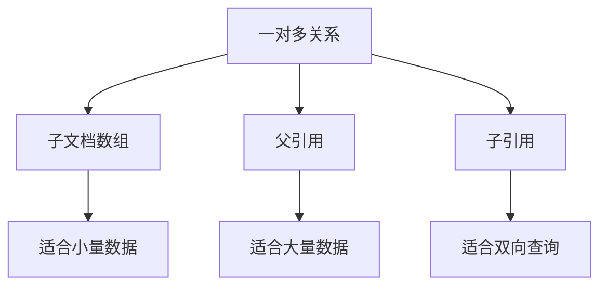

一对多关系示例：
```javascript

// 方案1：子文档数组（博客文章和评论）
{
    _id: ObjectId("post123"),
    title: "MongoDB进阶指南",
    content: "...",
    comments: [
        {
            user_id: ObjectId("user1"),
            content: "评论1",
            created_at: ISODate("2024-01-20")
        },
        // ... 更多评论
    ]
}

// 方案2：父引用（订单和订单项）
// orders集合
{
    _id: ObjectId("order123"),
    user_id: ObjectId("user1"),
    total: 599.98,
    status: "completed"
}

// order_items集合
{
    _id: ObjectId("item1"),
    order_id: ObjectId("order123"),  // 父引用
    product_id: ObjectId("prod1"),
    quantity: 2,
    price: 299.99
}

// 方案3：子引用（用户和文章）
{
    _id: ObjectId("user123"),
    name: "张三",
    post_ids: [  // 子引用
        ObjectId("post1"),
        ObjectId("post2"),
        ObjectId("post3")
    ]
}
```

### 3.3 多对多关系

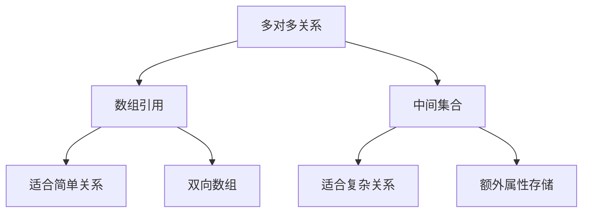

多对多关系示例：
```javascript

// 方案1：数组引用（学生和课程）
// students集合
{
    _id: ObjectId("student1"),
    name: "张三",
    course_ids: [
        ObjectId("course1"),
        ObjectId("course2")
    ]
}

// courses集合
{
    _id: ObjectId("course1"),
    name: "数学",
    student_ids: [
        ObjectId("student1"),
        ObjectId("student2")
    ]
}

// 方案2：中间集合（用户和角色，带权限信息）
// users集合
{
    _id: ObjectId("user1"),
    name: "张三"
}

// roles集合
{
    _id: ObjectId("role1"),
    name: "管理员"
}

// user_roles集合（中间集合）
{
    _id: ObjectId("ur1"),
    user_id: ObjectId("user1"),
    role_id: ObjectId("role1"),
    granted_at: ISODate("2024-01-01"),
    permissions: ["read", "write", "admin"]
}

// 关联查询示例
db.user_roles.aggregate([
    {
        $match: { user_id: ObjectId("user1") }
    },
    {
        $lookup: {
            from: "roles",
            localField: "role_id",
            foreignField: "_id",
            as: "role_info"
        }
    }
])
```

## 4. 数据模型优化

### 4.1 索引优化

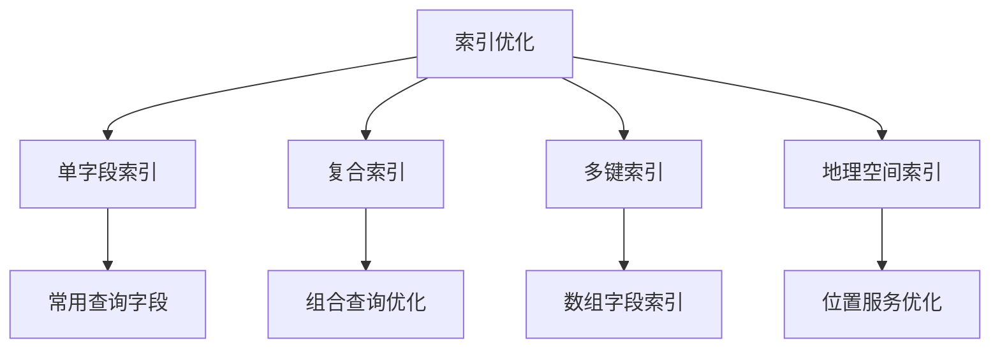

索引优化示例：
```javascript

// 创建单字段索引
db.users.createIndex({ email: 1 }, { unique: true })

// 创建复合索引
db.orders.createIndex({ 
    user_id: 1, 
    created_at: -1 
})

// 创建多键索引
db.products.createIndex({ tags: 1 })

// 创建地理空间索引
db.stores.createIndex({ 
    location: "2dsphere" 
})

// 索引使用分析
db.users.find({ email: "test@example.com" })
    .explain("executionStats")
```

### 4.2 数据访问优化

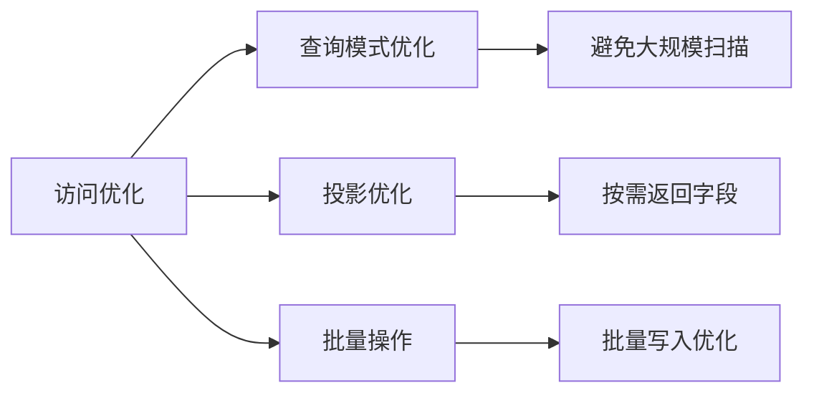

访问优化示例：
```javascript

// 使用投影减少返回字段
db.users.find(
    { age: { $gt: 18 } },
    { name: 1, email: 1 }
)

// 批量插入优化
db.products.bulkWrite([
    { insertOne: { document: { name: "产品1" } } },
    { insertOne: { document: { name: "产品2" } } }
], { ordered: false })

// 分批处理大结果集
const cursor = db.users.find().batchSize(100);
while (await cursor.hasNext()) {
    const doc = await cursor.next();
    // 处理文档
}
```

### 4.3 数据一致性保证

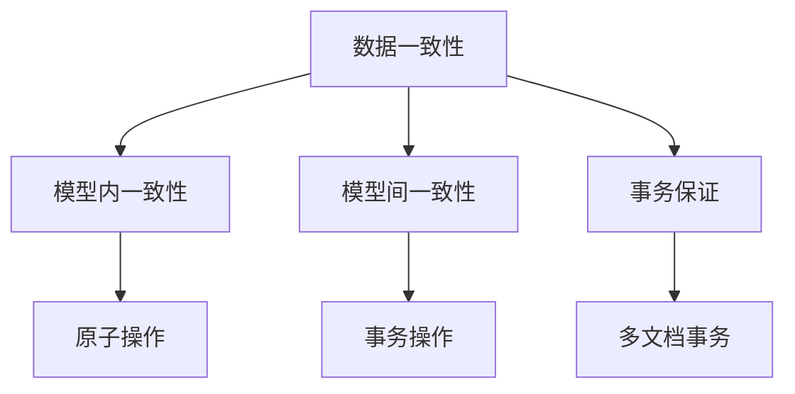

一致性保证示例：
```javascript

// 使用事务保证一致性
const session = db.getMongo().startSession();
session.startTransaction();

try {
    // 更新用户余额
    await db.users.updateOne(
        { _id: userId },
        { $inc: { balance: -100 } },
        { session }
    );
    
    // 创建订单
    await db.orders.insertOne({
        user_id: userId,
        amount: 100,
        status: "completed"
    }, { session });
    
    await session.commitTransaction();
} catch (error) {
    await session.abortTransaction();
    throw error;
} finally {
    session.endSession();
}
```

## 5. 最佳实践与案例

### 5.1 常见应用场景

1. **电商系统**
```javascript

// 产品文档
{
    _id: ObjectId("prod123"),
    name: "智能手机",
    price: 4999,
    inventory: {
        total: 100,
        reserved: 5,
        available: 95
    },
    categories: ["电子产品", "手机"],
    variants: [
        {
            color: "黑色",
            storage: "128GB",
            sku: "SP-BLK-128"
        }
    ]
}

// 订单文档
{
    _id: ObjectId("order123"),
    user_id: ObjectId("user123"),
    items: [
        {
            product_id: ObjectId("prod123"),
            quantity: 1,
            price: 4999
        }
    ],
    status: "pending",
    shipping_address: {
        city: "北京",
        street: "朝阳路"
    }
}
```

2. **内容管理系统**
```javascript

// 文章文档
{
    _id: ObjectId("article123"),
    title: "MongoDB最佳实践",
    content: "...",
    author_id: ObjectId("user123"),
    tags: ["数据库", "MongoDB"],
    status: "published",
    comments: [
        {
            user_id: ObjectId("user456"),
            content: "很有帮助",
            created_at: ISODate("2024-01-20")
        }
    ]
}
```

### 5.2 性能优化建议

1. **文档大小控制**
```javascript

// 大文档拆分示例
// 主文档
{
    _id: ObjectId("doc123"),
    title: "大型文档",
    summary: "摘要信息",
    content_ref: ObjectId("content123")
}

// 内容文档
{
    _id: ObjectId("content123"),
    doc_id: ObjectId("doc123"),
    content: "详细内容...",
    created_at: ISODate("2024-01-20")
}
```

2. **查询优化**
```javascript

// 创建合适的索引
db.articles.createIndex({
    title: "text",
    tags: 1,
    created_at: -1
})

// 使用覆盖查询
db.users.find(
    { age: { $gt: 18 } },
    { _id: 0, name: 1 }
).hint({ age: 1 })
```

### 5.3 实战案例分析

1. **社交网络数据模型**
```javascript

// 用户文档
{
    _id: ObjectId("user123"),
    name: "张三",
    profile: {
        avatar: "url",
        bio: "个人简介"
    },
    followers_count: 1000,
    following_count: 500
}

// 关注关系集合
{
    _id: ObjectId("relation123"),
    follower_id: ObjectId("user123"),
    following_id: ObjectId("user456"),
    created_at: ISODate("2024-01-20")
}

// 帖子集合
{
    _id: ObjectId("post123"),
    user_id: ObjectId("user123"),
    content: "分享内容",
    likes: 100,
    comments: [
        {
            user_id: ObjectId("user456"),
            content: "评论内容",
            created_at: ISODate("2024-01-20")
        }
    ]
}
```

2. **日志系统**
```javascript

// 时间分片集合命名
db.logs_2024_01

// 日志文档
{
    _id: ObjectId("log123"),
    timestamp: ISODate("2024-01-20T10:00:00Z"),
    level: "ERROR",
    service: "user-service",
    message: "错误信息",
    metadata: {
        request_id: "req123",
        user_id: ObjectId("user123")
    }
}

// 创建TTL索引
db.logs_2024_01.createIndex(
    { timestamp: 1 },
    { expireAfterSeconds: 30 * 24 * 60 * 60 }  // 30天后过期
)
```

## 6. 总结

MongoDB数据建模的核心原则：

1. **设计考虑因素**
   - 应用程序的数据访问模式
   - 数据关系的复杂度
   - 性能需求
   - 数据一致性要求

2. **模型选择策略**
   - 嵌入式用于紧密关联的数据
   - 引用式用于松散关联的数据
   - 混合式平衡性能和维护性

3. **优化方向**
   - 合理的索引策略
   - 高效的数据访问模式
   - 适当的数据分片
   - 定期的性能监控和优化
```

