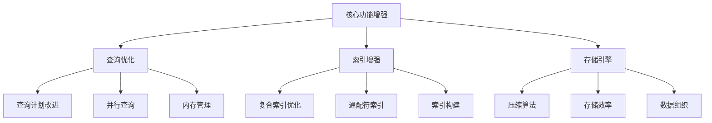
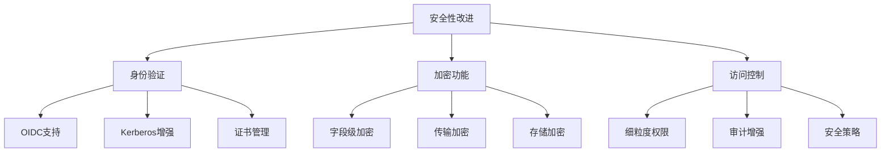
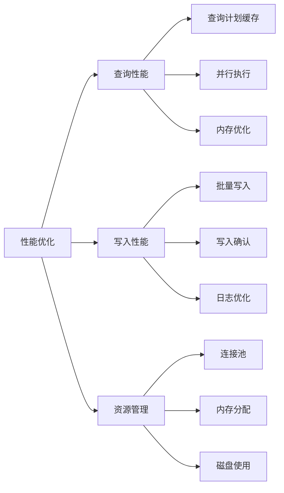
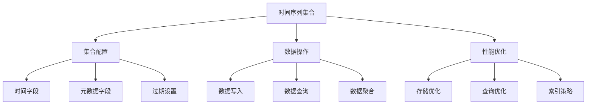
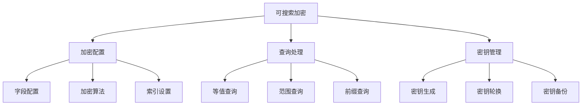
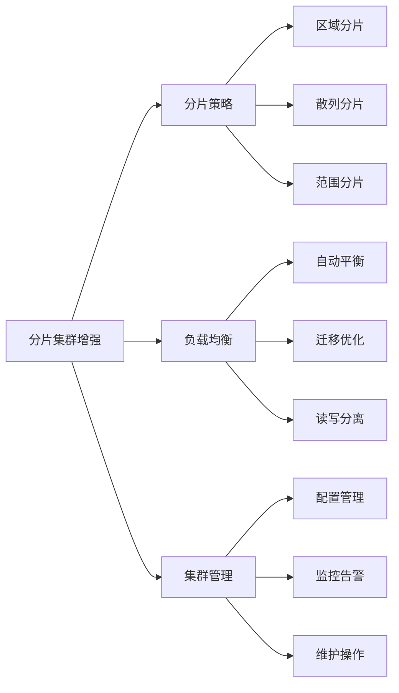
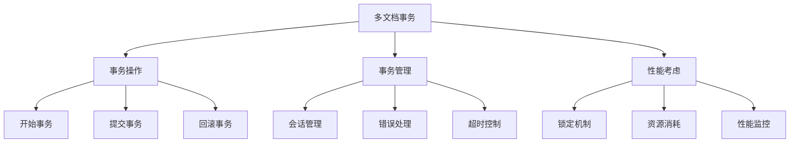
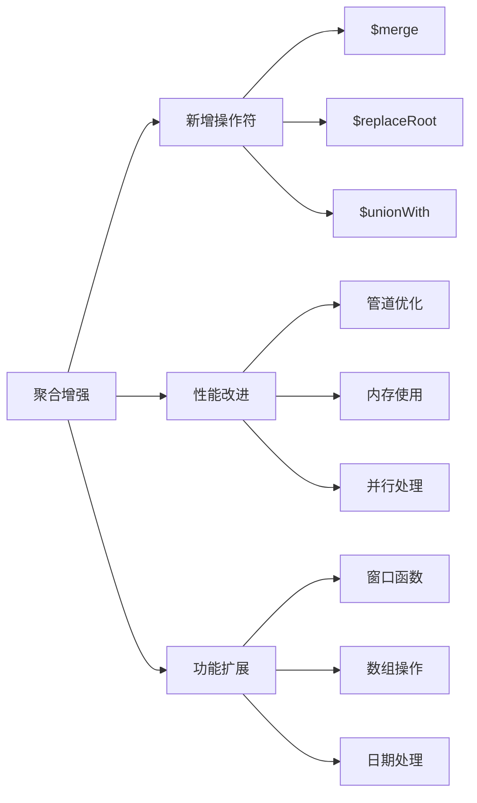
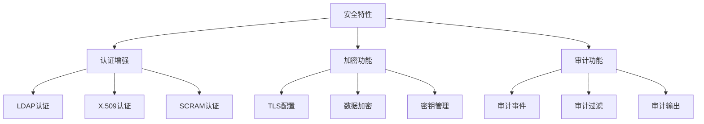

# MongoDB 版本特性指南

## 目录
- [1. MongoDB 6.x 特性](#1-mongodb-6x-特性)
  - [1.1 核心功能增强](#11-核心功能增强)
  - [1.2 安全性改进](#12-安全性改进)
  - [1.3 性能优化](#13-性能优化)
- [2. MongoDB 5.x 特性](#2-mongodb-5x-特性)
  - [2.1 时间序列集合](#21-时间序列集合)
  - [2.2 可搜索加密](#22-可搜索加密)
  - [2.3 分片集群增强](#23-分片集群增强)
- [3. MongoDB 4.x 特性](#3-mongodb-4x-特性)
  - [3.1 多文档事务](#31-多文档事务)
  - [3.2 聚合增强](#32-聚合增强)
  - [3.3 安全特性](#33-安全特性)

## 1. MongoDB 6.x 特性

### 1.1 核心功能增强



核心功能示例：
```javascript

// 1. 查询优化器增强
// 使用改进的查询提示
db.users.find({
    age: { $gt: 18 },
    status: "active"
}).hint({ age: 1, status: 1 }).explain("executionStats")

// 2. 索引优化
// 创建优化的复合索引
db.createIndex({
    email: 1,
    username: 1
}, {
    unique: true,
    collation: { locale: "simple" },
    sparse: true
})

// 3. 存储引擎改进
// 配置压缩选项
db.adminCommand({
    setParameter: 1,
    wiredTigerEngineConfig: {
        "block_compressor": "zstd"
    }
})
```

### 1.2 安全性改进



安全特性示例：
```javascript
// 1. OIDC身份验证配置
db.adminCommand({
    setParameter: 1,
    authenticationMechanisms: [
        "SCRAM-SHA-256",
        "OIDC"
    ],
    oidcIdentityProviders: [{
        name: "myOIDCProvider",
        issuer: "https://auth.example.com",
        clientId: "mongodbClient",
        requestScopes: ["openid", "profile", "email"]
    }]
})

// 2. 字段级加密配置
db.createCollection("users", {
    validator: {
        $jsonSchema: {
            bsonType: "object",
            encryptMetadata: {
                keyId: [UUID("...")]
            },
            properties: {
                ssn: {
                    encrypt: {
                        bsonType: "string",
                        algorithm: "AEAD_AES_256_CBC_HMAC_SHA_512_Random"
                    }
                },
                creditCard: {
                    encrypt: {
                        bsonType: "object",
                        algorithm: "AEAD_AES_256_CBC_HMAC_SHA_512_Deterministic"
                    }
                }
            }
        }
    }
})

// 3. 细粒度访问控制
// 创建自定义角色
db.createRole({
    role: "dataAnalyst",
    privileges: [{
        resource: { db: "analytics", collection: "" },
        actions: ["find", "aggregate"]
    }],
    roles: [],
    authenticationRestrictions: [{
        clientSource: ["192.168.1.0/24"],
        serverAddress: ["192.168.1.100"]
    }]
})
```

### 1.3 性能优化



性能优化示例：
```javascript
// 1. 查询性能优化
// 配置查询计划缓存
db.adminCommand({
    setParameter: 1,
    internalQueryCacheSize: 10000,
    internalQueryCacheEvictionRatio: 0.1
})

// 使用新的聚合优化器
db.orders.aggregate([
    {
        $match: {
            status: "completed",
            orderDate: {
                $gte: ISODate("2024-01-01")
            }
        }
    },
    {
        $group: {
            _id: {
                year: { $year: "$orderDate" },
                month: { $month: "$orderDate" }
            },
            totalOrders: { $sum: 1 },
            revenue: { $sum: "$amount" }
        }
    }
], {
    hint: { status: 1, orderDate: 1 },
    comment: "Monthly sales analysis"
})

// 2. 写入性能优化
// 批量写入优化
const bulkOps = [];
for (let i = 0; i < 1000; i++) {
    bulkOps.push({
        insertOne: {
            document: {
                item: `item_${i}`,
                qty: Math.floor(Math.random() * 100),
                timestamp: new Date()
            }
        }
    });
}

db.inventory.bulkWrite(bulkOps, {
    ordered: false,
    writeConcern: { w: "majority", wtimeout: 5000 }
})

// 3. 资源管理优化
// 配置连接池
db.adminCommand({
    setParameter: 1,
    maxConnecting: 100,
    connPoolMaxConnections: 2000,
    connPoolMaxSize: { size: 2000 }
})
```

## 2. MongoDB 5.x 特性

### 2.1 时间序列集合




时间序列集合示例：
```javascript

// 1. 创建时间序列集合
db.createCollection(
    "deviceMetrics",
    {
        timeseries: {
            timeField: "timestamp",
            metaField: "metadata",
            granularity: "minutes"
        },
        expireAfterSeconds: 2592000 // 30天后过期
    }
)

// 2. 写入时间序列数据
db.deviceMetrics.insertMany([
    {
        timestamp: new Date(),
        metadata: {
            deviceId: "d1",
            type: "temperature"
        },
        value: 22.5,
        battery: 98
    },
    {
        timestamp: new Date(),
        metadata: {
            deviceId: "d1",
            type: "humidity"
        },
        value: 45,
        battery: 98
    }
])

// 3. 时间序列查询和分析
// 按时间窗口聚合
db.deviceMetrics.aggregate([
    {
        $match: {
            "metadata.deviceId": "d1",
            timestamp: {
                $gte: ISODate("2024-01-01"),
                $lt: ISODate("2024-02-01")
            }
        }
    },
    {
        $group: {
            _id: {
                $dateTrunc: {
                    date: "$timestamp",
                    unit: "hour"
                }
            },
            avgValue: { $avg: "$value" },
            minValue: { $min: "$value" },
            maxValue: { $max: "$value" }
        }
    },
    {
        $sort: { "_id": 1 }
    }
])

### 2.2 可搜索加密



可搜索加密示例：
```javascript

// 1. 配置可搜索加密
const encryptedFields = {
    fields: [{
        path: "ssn",
        bsonType: "string",
        queries: {
            type: "equality"
        }
    }, {
        path: "dob",
        bsonType: "date",
        queries: {
            type: "rangePreview"
        }
    }, {
        path: "firstName",
        bsonType: "string",
        queries: {
            type: "prefixPreview"
        }
    }]
};

// 2. 创建加密集合
db.createCollection("customers", {
    encryptedFields: encryptedFields,
    validator: {
        $jsonSchema: {
            bsonType: "object",
            properties: {
                ssn: {
                    encrypt: {
                        keyId: UUID("..."),
                        algorithm: "RandomEncryption"
                    }
                },
                dob: {
                    encrypt: {
                        keyId: UUID("..."),
                        algorithm: "RangeEncryption"
                    }
                },
                firstName: {
                    encrypt: {
                        keyId: UUID("..."),
                        algorithm: "DeterministicEncryption"
                    }
                }
            }
        }
    }
})

// 3. 加密查询示例
// 等值查询
db.customers.find({
    ssn: "123-45-6789"
})

// 范围查询
db.customers.find({
    dob: {
        $gte: ISODate("1990-01-01"),
        $lt: ISODate("2000-01-01")
    }
})

// 前缀查询
db.customers.find({
    firstName: /^Jo/
})
```

### 2.3 分片集群增强



分片集群增强示例：
```javascript

// 1. 配置分片集合
sh.enableSharding("mydb")

// 配置区域分片
sh.addShardToZone("shard0", "zone1")
sh.addShardToZone("shard1", "zone2")

sh.updateZoneKeyRange(
    "mydb.users",
    {
        region: "Asia"
    },
    {
        region: "Europe"
    },
    "zone1"
)

// 2. 高级分片配置
db.adminCommand({
    shardCollection: "mydb.orders",
    key: {
        customerId: "hashed",
        orderDate: 1
    },
    numInitialChunks: 100,
    presplitHashedZones: true
})

// 3. 分片集群监控
// 检查分片状态
db.adminCommand({ listShards: 1 })

// 检查块分布
db.chunks.aggregate([
    {
        $group: {
            _id: "$shard",
            chunks: { $sum: 1 }
        }
    }
])

// 监控迁移操作
db.getSiblingDB("config").changelog.find({
    what: "moveChunk.from",
    time: {
        $gte: new Date(Date.now() - 24*60*60*1000)
    }
}).sort({ time: -1 })

```

## 3. MongoDB 4.x 特性

### 3.1 多文档事务



多文档事务示例：
```javascript

// 1. 基本事务操作
const session = db.getMongo().startSession();
session.startTransaction({
    readConcern: { level: "snapshot" },
    writeConcern: { w: "majority" }
});

try {
    // 转账操作
    const accounts = session.getDatabase("bank").accounts;
    
    // 扣款
    accounts.updateOne(
        { accountId: "A123" },
        { $inc: { balance: -100 } },
        { session }
    );
    
    // 入账
    accounts.updateOne(
        { accountId: "B456" },
        { $inc: { balance: 100 } },
        { session }
    );
    
    // 提交事务
    session.commitTransaction();
} catch (error) {
    // 错误处理和回滚
    session.abortTransaction();
    throw error;
} finally {
    session.endSession();
}

// 2. 高级事务特性
// 带重试的事务
async function runTransactionWithRetry(txnFunc, session) {
    while (true) {
        try {
            await txnFunc(session);  // 执行事务
            break;
        } catch (error) {
            if (error.hasOwnProperty('errorLabels') && 
                error.errorLabels.includes('TransientTransactionError')) {
                console.log("重试事务...");
                continue;
            }
            throw error;
        }
    }
}

// 3. 事务监控
db.adminCommand({
    currentOp: true,
    $or: [
        { "transaction": { $exists: true } },
        { "lockInfo": { $exists: true } }
    ]
})
```

### 3.2 聚合增强



聚合增强示例：
```javascript

// 1. 使用新的聚合操作符
// $merge 操作符示例
db.sales.aggregate([
    {
        $group: {
            _id: {
                product: "$product",
                year: { $year: "$date" }
            },
            totalSales: { $sum: "$amount" }
        }
    },
    {
        $merge: {
            into: "annualSales",
            on: ["_id.product", "_id.year"],
            whenMatched: "replace",
            whenNotMatched: "insert"
        }
    }
])

// 2. 窗口函数示例
db.sales.aggregate([
    {
        $setWindowFields: {
            partitionBy: "$region",
            sortBy: { amount: -1 },
            output: {
                rank: {
                    $rank: {}
                },
                runningTotal: {
                    $sum: "$amount",
                    window: {
                        documents: ["unbounded", "current"]
                    }
                }
            }
        }
    }
])

// 3. 联合查询示例
db.orders.aggregate([
    {
        $unionWith: {
            coll: "archive.orders",
            pipeline: [
                {
                    $match: {
                        orderDate: {
                            $gte: ISODate("2023-01-01")
                        }
                    }
                }
            ]
        }
    },
    {
        $sort: { orderDate: -1 }
    }
])
```

### 3.3 安全特性



安全特性示例：
```javascript

// 1. 配置LDAP认证
db.adminCommand({
    setParameter: 1,
    authenticationMechanisms: [
        "PLAIN",
        "SCRAM-SHA-256"
    ],
    ldapServers: "ldap://ldap.example.com",
    ldapQueryUser: "cn=mongodb,dc=example,dc=com",
    ldapQueryPassword: "secret"
})

// 2. 配置审计
db.setAuditConfig({
    auditLog: {
        destination: "file",
        format: "JSON",
        path: "/var/log/mongodb/audit.log",
        filter: {
            users: ["admin", "dbOwner"],
            actions: ["authenticate", "createUser", "dropUser"]
        }
    }
})

// 3. 加密配置
db.adminCommand({
    setParameter: 1,
    scramIterationCount: 15000,
    scramSHA256IterationCount: 15000,
    tlsMode: "requireTLS",
    tlsCertificateKeyFile: "/etc/ssl/mongodb.pem",
    tlsCAFile: "/etc/ssl/ca.pem"
})
```

## 总结

MongoDB各版本的主要特性改进：

1. **MongoDB 6.x**
   - 查询优化器改进
   - 安全性增强
   - 性能优化

2. **MongoDB 5.x**
   - 时间序列集合
   - 可搜索加密
   - 分片集群增强

3. **MongoDB 4.x**
   - 多文档事务支持
   - 聚合功能增强
   - 安全特性改进

最佳实践建议：

1. **版本升级**
   - 仔细评估新特性
   - 制定升级计划
   - 进行充分测试

2. **特性使用**
   - 合理使用新特性
   - 注意性能影响
   - 保持安全性

3. **监控维护**
   - 持续性能监控
   - 定期安全审计
   - 及时问题处理

通过合理利用MongoDB各版本的新特性，可以显著提升应用程序的性能、安全性和可维护性。建议根据实际需求选择合适的特性进行使用。
```

