# MongoDB 索引管理详解

## 目录
- [1. 索引基础概念](#1-索引基础概念)
  - [1.1 索引工作原理](#11-索引工作原理)
  - [1.2 索引类型概述](#12-索引类型概述)
  - [1.3 索引属性特征](#13-索引属性特征)
- [2. 索引类型详解](#2-索引类型详解)
  - [2.1 单字段索引](#21-单字段索引)
  - [2.2 复合索引](#22-复合索引)
  - [2.3 多键索引](#23-多键索引)
  - [2.4 地理空间索引](#24-地理空间索引)
  - [2.5 文本索引](#25-文本索引)
  - [2.6 哈希索引](#26-哈希索引)
- [3. 索引管理操作](#3-索引管理操作)
  - [3.1 索引创建与删除](#31-索引创建与删除)
  - [3.2 索引属性设置](#32-索引属性设置)
  - [3.3 索引维护管理](#33-索引维护管理)
- [4. 索引性能优化](#4-索引性能优化)
  - [4.1 索引选择策略](#41-索引选择策略)
  - [4.2 索引使用分析](#42-索引使用分析)
  - [4.3 性能调优建议](#43-性能调优建议)
- [5. 最佳实践与案例](#5-最佳实践与案例)
  - [5.1 常见应用场景](#51-常见应用场景)
  - [5.2 性能优化案例](#52-性能优化案例)
  - [5.3 问题诊断处理](#53-问题诊断处理)

---

## 1. 索引基础概念

### 1.1 索引工作原理

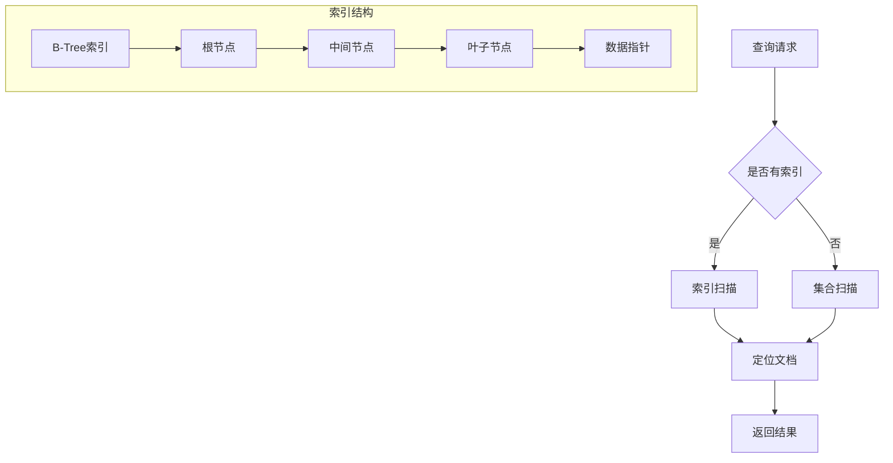

索引结构示例：
```javascript

// 创建示例集合和索引
db.users.createIndex({ age: 1 })

// 查看索引使用情况
db.users.find({ age: 25 }).explain("executionStats")

// 索引统计信息
db.users.stats().indexSizes
```

### 1.2 索引类型概述

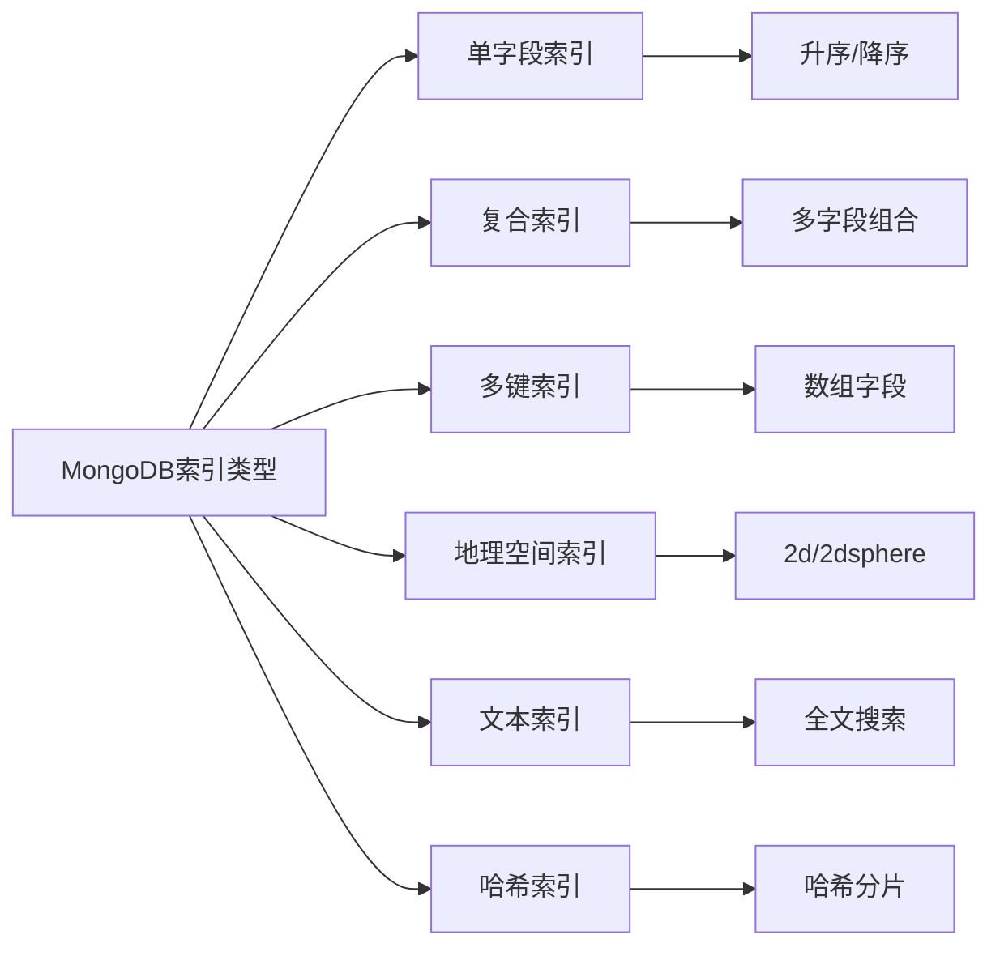

### 1.3 索引属性特征

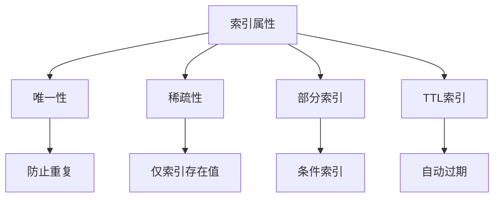

索引属性示例：
```javascript

// 唯一索引
db.users.createIndex(
    { email: 1 },
    { unique: true }
)

// 稀疏索引
db.products.createIndex(
    { category: 1 },
    { sparse: true }
)

// 部分索引
db.orders.createIndex(
    { orderDate: 1 },
    {
        partialFilterExpression: {
            status: "active"
        }
    }
)

// TTL索引
db.logs.createIndex(
    { createdAt: 1 },
    { expireAfterSeconds: 86400 }  // 24小时后过期
)
```

## 2. 索引类型详解

### 2.1 单字段索引

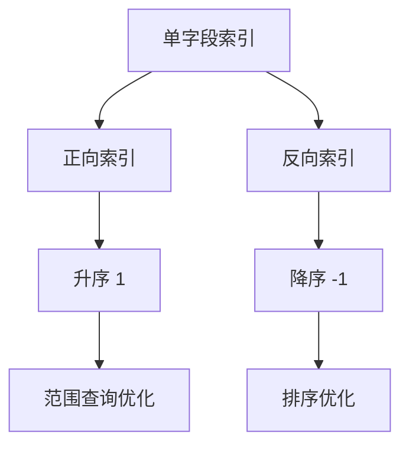

单字段索引示例：
```javascript

// 创建正向索引
db.users.createIndex({ age: 1 })

// 创建反向索引
db.users.createIndex({ timestamp: -1 })

// 索引使用示例
db.users.find({ age: { $gt: 20 } }).sort({ age: 1 })

// 查看索引使用情况
db.users.find({ age: { $gt: 20 } })
    .explain("executionStats")
```

### 2.2 复合索引

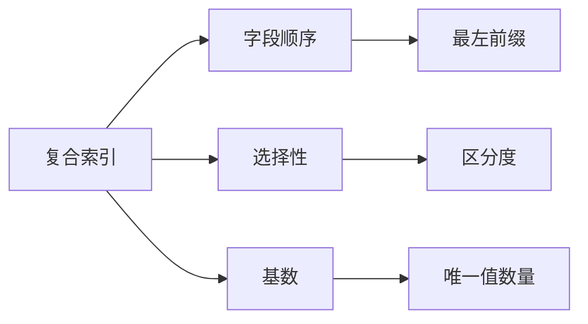

复合索引示例：
```javascript

// 创建复合索引
db.orders.createIndex({
    userId: 1,
    orderDate: -1,
    status: 1
})

// 最左前缀匹配查询
db.orders.find({
    userId: "user123",
    orderDate: {
        $gte: ISODate("2024-01-01"),
        $lt: ISODate("2024-02-01")
    }
})

// 复合索引排序
db.orders.find({ userId: "user123" })
    .sort({ orderDate: -1 })

// 索引使用分析
db.orders.find({
    userId: "user123",
    status: "completed"
}).explain("executionStats")
```

### 2.3 多键索引

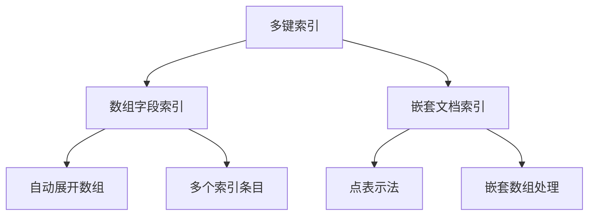

多键索引示例：
```javascript


// 文档结构
{
    _id: ObjectId("..."),
    item: "手机",
    tags: ["电子", "数码", "通讯"],
    specs: {
        colors: ["黑色", "白色", "金色"],
        features: ["5G", "快充"]
    }
}

// 创建多键索引
db.products.createIndex({ tags: 1 })  // 数组字段索引
db.products.createIndex({ "specs.colors": 1 })  // 嵌套数组索引

// 查询示例
db.products.find({ tags: "电子" })
db.products.find({ "specs.colors": "黑色" })

// 多键索引统计
db.products.stats().keysPerIndex
```

### 2.4 地理空间索引

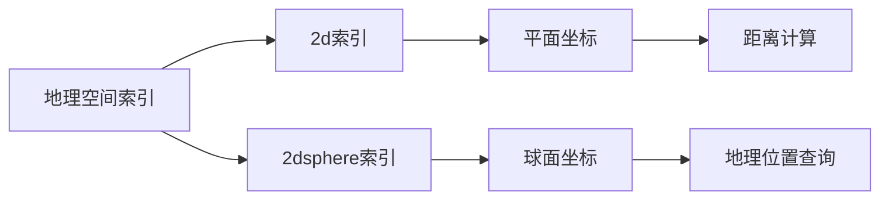

地理空间索引示例：
```javascript


// 创建2dsphere索引
db.locations.createIndex({ 
    location: "2dsphere" 
})

// 插入地理位置数据
db.locations.insertOne({
    name: "北京咖啡店",
    location: {
        type: "Point",
        coordinates: [116.4074, 39.9042]  // 经度，纬度
    }
})

// 近距离查询
db.locations.find({
    location: {
        $near: {
            $geometry: {
                type: "Point",
                coordinates: [116.4074, 39.9042]
            },
            $maxDistance: 1000  // 1公里内
        }
    }
})

// 区域查询
db.locations.find({
    location: {
        $geoWithin: {
            $geometry: {
                type: "Polygon",
                coordinates: [[
                    [116.3, 39.8],
                    [116.5, 39.8],
                    [116.5, 40.0],
                    [116.3, 40.0],
                    [116.3, 39.8]
                ]]
            }
        }
    }
})
```

### 2.5 文本索引

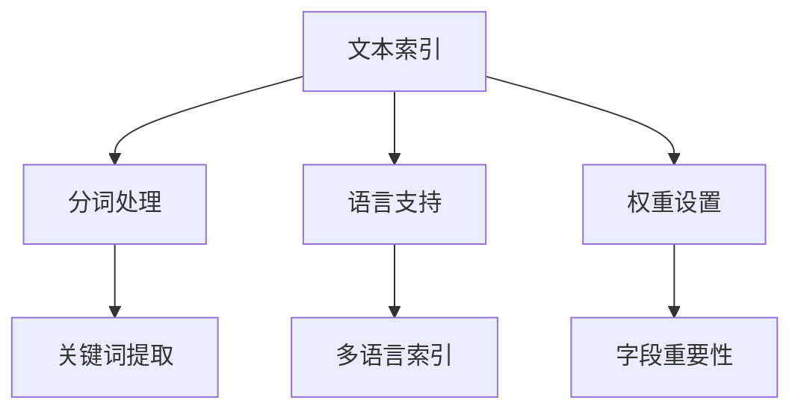

文本索引示例：
```javascript


// 创建文本索引
db.articles.createIndex({
    title: "text",
    content: "text",
    tags: "text"
}, {
    weights: {
        title: 10,    // 标题权重更高
        content: 5,
        tags: 2
    },
    default_language: "simplified chinese"
})

// 文本搜索查询
db.articles.find({
    $text: {
        $search: "MongoDB 索引优化",
        $language: "simplified chinese"
    }
})

// 按相关性排序
db.articles.find(
    { $text: { $search: "MongoDB" } },
    { score: { $meta: "textScore" } }
).sort({ score: { $meta: "textScore" } })
```

### 2.6 哈希索引

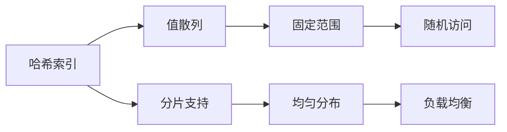

哈希索引示例：
```javascript


// 创建哈希索引
db.users.createIndex(
    { userId: "hashed" }
)

// 分片集合使用哈希索引
sh.shardCollection(
    "mydb.users",
    { userId: "hashed" }
)

// 哈希索引查询
db.users.find({
    userId: "user123"
}).explain()
```

## 3. 索引管理操作

### 3.1 索引创建与删除

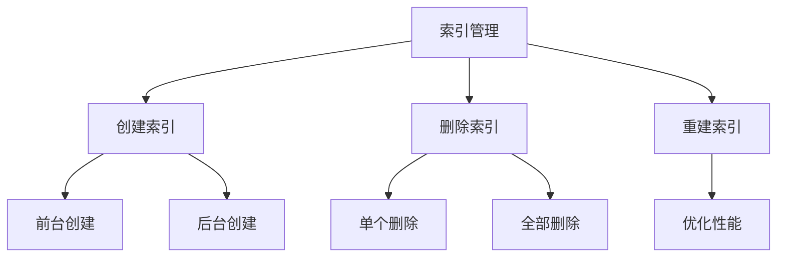

索引管理示例：
```javascript


// 前台创建索引
db.users.createIndex(
    { email: 1 },
    { unique: true }
)

// 后台创建索引
db.users.createIndex(
    { lastLogin: 1 },
    { background: true }
)

// 删除特定索引
db.users.dropIndex("email_1")

// 删除所有索引
db.users.dropIndexes()

// 重建索引
db.users.reIndex()

// 监控索引创建进度
db.currentOp(
    { "command.createIndexes": { $exists: true } }
)
```

### 3.2 索引属性设置

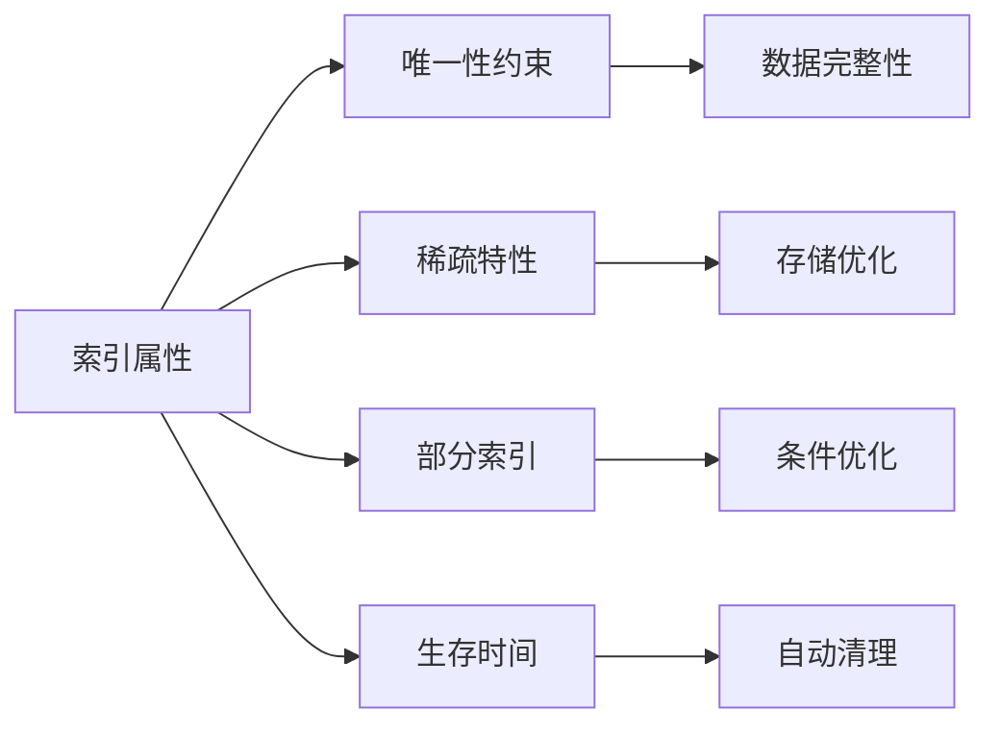

属性设置示例：
```javascript   


// 唯一索引
db.users.createIndex(
    { email: 1 },
    { 
        unique: true,
        sparse: true  // 只对非空值建立索引
    }
)

// 部分索引
db.orders.createIndex(
    { orderDate: 1 },
    {
        partialFilterExpression: {
            status: "active",
            amount: { $gt: 1000 }
        }
    }
)

// TTL索引
db.sessions.createIndex(
    { lastAccess: 1 },
    { expireAfterSeconds: 3600 }  // 1小时后过期
)

// 隐藏索引
db.products.createIndex(
    { category: 1 },
    { hidden: true }
)
```

### 3.3 索引维护管理

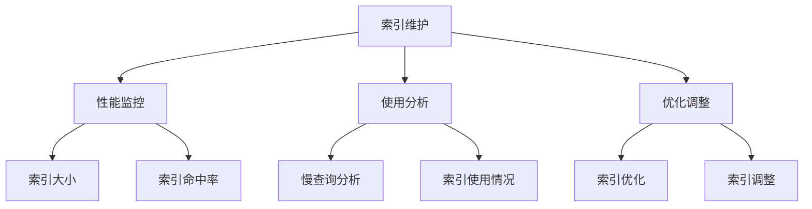

维护管理示例：
```javascript


// 查看集合索引
db.users.getIndexes()

// 索引使用统计
db.users.aggregate([
    { $indexStats: {} }
])

// 查看索引大小
db.users.stats().indexSizes

// 监控索引使用
db.users.find({
    email: "test@example.com"
}).explain("executionStats")

// 查找未使用的索引
db.getSiblingDB('admin').runCommand({
    serverStatus: 1
}).metrics.commands
```

## 4. 索引性能优化

### 4.1 索引选择策略

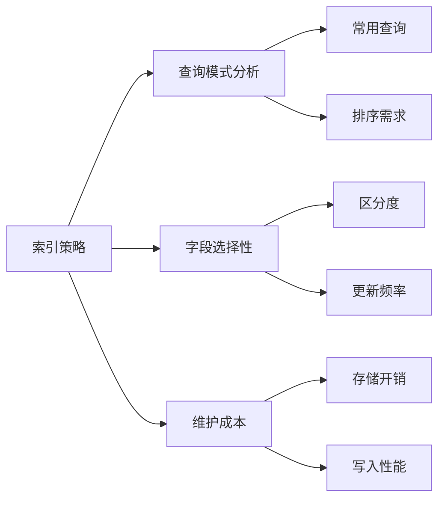

策略实施示例：
```javascript


// 分析查询模式
db.users.find({
    age: { $gt: 20 },
    status: "active"
}).sort({ lastLogin: -1 })
.explain("executionStats")

// 创建合适的复合索引
db.users.createIndex({
    status: 1,
    age: 1,
    lastLogin: -1
})

// 评估索引效果
db.users.aggregate([
    { $indexStats: {} }
])
```

### 4.2 索引使用分析

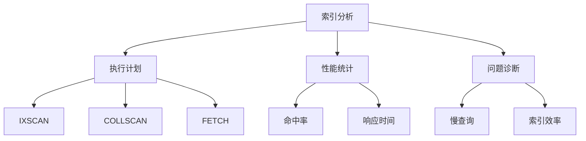

索引分析示例：
```javascript


// 查看执行计划
db.users.find({ 
    age: { $gt: 25 },
    status: "active" 
}).explain("executionStats")

// 分析索引使用情况
db.users.aggregate([
    { $indexStats: {} }
])

// 查找未被使用的索引
const unusedIndexes = [];
db.getCollectionNames().forEach(collection => {
    const indexes = db[collection].getIndexes();
    const stats = db[collection].aggregate([
        { $indexStats: {} }
    ]).toArray();
    
    indexes.forEach(index => {
        const indexName = index.name;
        const isUsed = stats.some(stat => 
            stat.name === indexName && stat.accesses.ops > 0
        );
        if (!isUsed && indexName !== '_id_') {
            unusedIndexes.push({
                collection: collection,
                index: indexName
            });
        }
    });
});

// 监控慢查询
db.setProfilingLevel(1, { slowms: 100 });
db.system.profile.find({
    millis: { $gt: 100 }
}).sort({ ts: -1 })
```

### 4.3 性能调优建议

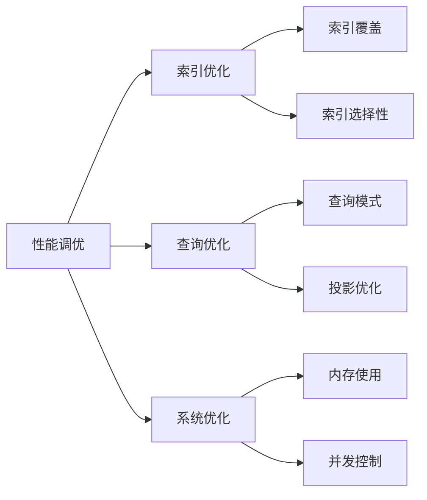

性能优化示例：
```javascript


// 1. 使用索引覆盖查询
db.users.find(
    { age: { $gt: 25 } },
    { _id: 0, name: 1, age: 1 }
).hint({ age: 1 })

// 2. 复合索引优化排序
db.users.createIndex({
    age: 1,
    name: 1
})

// 3. 避免在高频更新字段上建立索引
db.users.createIndex({
    email: 1,  // 低频更新
    lastLogin: 1  // 高频更新，考虑是否必要
})

// 4. 定期分析和清理无用索引
const indexStats = db.users.aggregate([
    { $indexStats: {} }
]).toArray();

indexStats.forEach(stat => {
    if (stat.accesses.ops === 0) {
        print(`考虑删除未使用的索引: ${stat.name}`);
    }
});
```

## 5. 最佳实践与案例

### 5.1 常见应用场景

1. **电商系统索引设计**
```javascript


// 商品集合索引
db.products.createIndex({
    category: 1,
    price: 1
})

db.products.createIndex({
    name: "text",
    description: "text"
})

// 订单集合索引
db.orders.createIndex({
    userId: 1,
    orderDate: -1
})

db.orders.createIndex({
    status: 1,
    orderDate: 1
}, {
    partialFilterExpression: {
        status: { $in: ["pending", "processing"] }
    }
})
```

2. **日志系统索引设计**
```javascript


// 创建TTL索引
db.logs.createIndex(
    { timestamp: 1 },
    { expireAfterSeconds: 7 * 24 * 60 * 60 }  // 7天后过期
)

// 创建复合索引支持查询
db.logs.createIndex({
    level: 1,
    timestamp: -1,
    service: 1
})

// 文本搜索索引
db.logs.createIndex({
    message: "text"
}, {
    weights: {
        message: 10
    }
})
```

### 5.2 性能优化案例

1. **查询性能优化**
```javascript


// 优化前
db.users.find({
    status: "active",
    age: { $gt: 25 },
    city: "北京"
}).sort({ lastLogin: -1 })

// 创建支持查询的复合索引
db.users.createIndex({
    status: 1,
    city: 1,
    age: 1,
    lastLogin: -1
})

// 使用覆盖查询
db.users.find(
    {
        status: "active",
        city: "北京"
    },
    {
        _id: 0,
        name: 1,
        age: 1
    }
).hint({ status: 1, city: 1 })
```

2. **内存优化案例**
```javascript


// 限制索引大小
db.users.createIndex(
    { email: 1 },
    {
        sparse: true,
        partialFilterExpression: {
            status: "active"
        }
    }
)

// 使用投影减少内存使用
db.users.find(
    { status: "active" },
    { name: 1, email: 1 }
).hint({ status: 1 })
```

### 5.3 问题诊断处理

1. **索引问题诊断**
```javascript


// 检查缺失索引
db.users.find({
    age: { $gt: 25 },
    city: "北京"
}).explain("executionStats")

// 分析索引使用效率
db.users.aggregate([
    { $indexStats: {} }
]).forEach(stat => {
    print(`索引 ${stat.name}:`);
    print(`  操作次数: ${stat.accesses.ops}`);
    print(`  自: ${stat.accesses.since}`);
});

// 查找问题查询
db.system.profile.find({
    millis: { $gt: 100 },
    ns: "mydb.users"
}).sort({ ts: -1 })
```

2. **性能问题解决方案**
```javascript


// 1. 创建合适的索引
db.users.createIndex({
    age: 1,
    city: 1
}, {
    background: true  // 后台创建
})

// 2. 强制使用索引
db.users.find({
    age: { $gt: 25 }
}).hint({ age: 1 })

// 3. 监控索引使用
db.serverStatus().metrics.commands

// 4. 定期维护索引
db.users.reIndex()
```

## 6. 总结

MongoDB索引管理的核心要点：

1. **索引设计原则**
   - 支持查询需求
   - 考虑写入性能
   - 平衡存储开销
   - 定期评估和优化

2. **性能优化策略**
   - 选择合适的索引类型
   - 优化索引字段顺序
   - 利用索引覆盖查询
   - 控制索引数量

3. **维护管理建议**
   - 定期监控索引使用
   - 删除无用索引
   - 优化慢查询
   - 平衡资源使用

4. **最佳实践**
   - 根据业务场景选择索引
   - 定期进行性能分析
   - 建立监控和告警机制
   - 制定维护计划
```
