# MongoDB 查询与聚合操作详解

## 目录
- [1. 查询基础](#1-查询基础)
  - [1.1 查询操作符](#11-查询操作符)
  - [1.2 查询条件](#12-查询条件)
  - [1.3 查询选项](#13-查询选项)
- [2. 高级查询](#2-高级查询)
  - [2.1 地理空间查询](#21-地理空间查询)
  - [2.2 文本搜索](#22-文本搜索)
  - [2.3 正则表达式](#23-正则表达式)
- [3. 聚合管道](#3-聚合管道)
  - [3.1 管道阶段](#31-管道阶段)
  - [3.2 表达式操作符](#32-表达式操作符)
  - [3.3 聚合优化](#33-聚合优化)
- [4. 聚合框架](#4-聚合框架)
  - [4.1 数据转换](#41-数据转换)
  - [4.2 数据分析](#42-数据分析)
  - [4.3 结果处理](#43-结果处理)
- [5. 性能优化](#5-性能优化)
  - [5.1 查询优化](#51-查询优化)
  - [5.2 聚合优化](#52-聚合优化)
  - [5.3 索引策略](#53-索引策略)

## 1. 查询基础

### 1.1 查询操作符

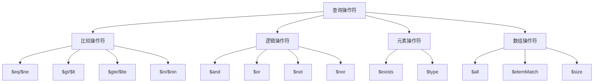

查询操作符示例：
```javascript 
// 1. 比较操作符
// 等于和不等于
db.users.find({ age: { $eq: 25 } })
db.users.find({ age: { $ne: 30 } })

// 大于和小于
db.users.find({ 
    age: { 
        $gt: 20,
        $lt: 30 
    } 
})

// 包含和不包含
db.users.find({ 
    status: { 
        $in: ["active", "pending"] 
    } 
})

// 2. 逻辑操作符
// AND 条件
db.users.find({
    $and: [
        { age: { $gt: 20 } },
        { status: "active" }
    ]
})

// OR 条件
db.users.find({
    $or: [
        { age: { $lt: 20 } },
        { status: "vip" }
    ]
})

// 3. 元素操作符
// 字段存在检查
db.users.find({
    email: { $exists: true }
})

// 类型检查
db.users.find({
    age: { $type: "number" }
})

// 4. 数组操作符
// 包含所有元素
db.users.find({
    tags: { $all: ["mongodb", "database"] }
})

// 数组元素匹配
db.users.find({
    scores: { 
        $elemMatch: { 
            $gt: 80,
            $lt: 90 
        } 
    }
})

// 数组大小匹配
db.users.find({
    friends: { $size: 3 }
})
```

### 1.2 查询条件

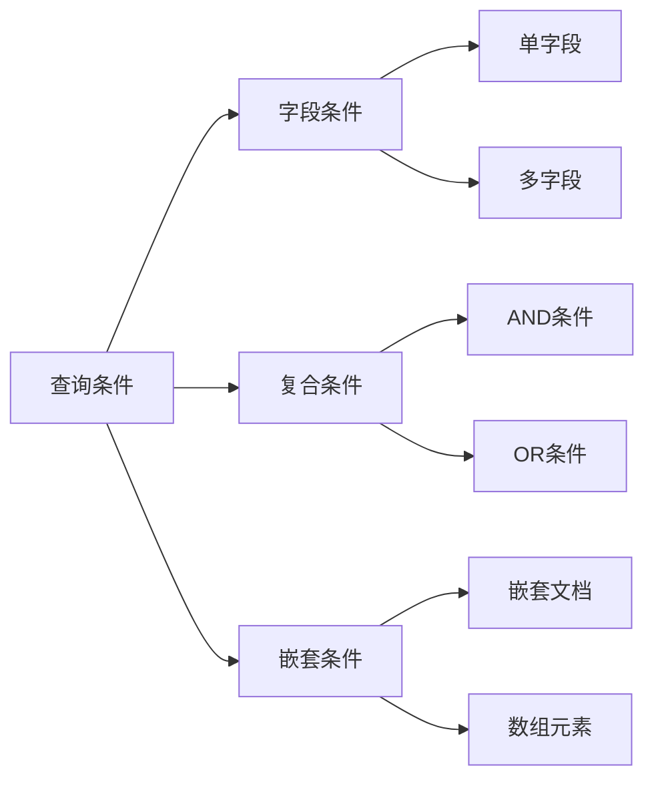

查询条件示例：
```javascript
// 1. 基本字段查询
// 单字段精确匹配
db.users.find({ 
    username: "张三" 
})

// 多字段组合查询
db.users.find({
    age: { $gte: 18 },
    status: "active",
    city: "北京"
})

// 2. 嵌套文档查询
// 完整匹配
db.users.find({
    "address": {
        city: "北京",
        district: "朝阳"
    }
})

// 点表示法
db.users.find({
    "address.city": "北京",
    "address.district": "朝阳"
})

// 3. 数组查询
// 数组元素匹配
db.users.find({
    interests: "编程"
})

// 数组对象匹配
db.users.find({
    "education": {
        $elemMatch: {
            degree: "本科",
            major: "计算机"
        }
    }
})

// 4. 复合条件查询
// AND + OR 组合
db.users.find({
    $and: [
        { age: { $gte: 18 } },
        {
            $or: [
                { status: "active" },
                { vipLevel: { $gt: 0 } }
            ]
        }
    ]
})
```

### 1.3 查询选项

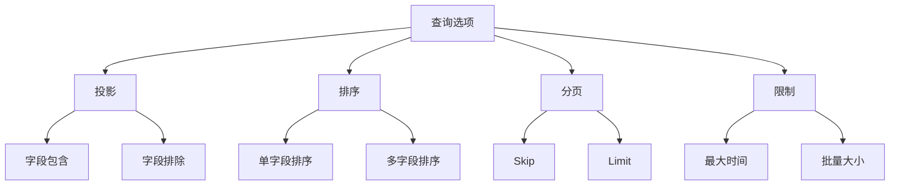

查询选项示例：
```javascript

// 1. 投影操作
// 包含特定字段
db.users.find(
    { status: "active" },
    { username: 1, email: 1 }
)

// 排除特定字段
db.users.find(
    { age: { $gt: 18 } },
    { password: 0, secretKey: 0 }
)

// 2. 排序操作
// 单字段排序
db.users.find()
    .sort({ age: -1 })  // 降序

// 多字段排序
db.users.find()
    .sort({ 
        status: 1,    // 先按状态升序
        age: -1       // 再按年龄降序
    })

// 3. 分页操作
// 基本分页
const pageSize = 10;
const pageNum = 2;
db.users.find()
    .skip((pageNum - 1) * pageSize)
    .limit(pageSize)

// 4. 高级选项
// 设置查询选项
db.users.find({
    status: "active"
}, {
    maxTimeMS: 1000,        // 最大执行时间
    batchSize: 100,         // 批量大小
    noCursorTimeout: true   // 禁用游标超时
})

// 使用提示
db.users.find({
    age: { $gt: 20 }
})
.hint({ age: 1 })          // 强制使用索引
```

## 2. 高级查询

### 2.1 地理空间查询

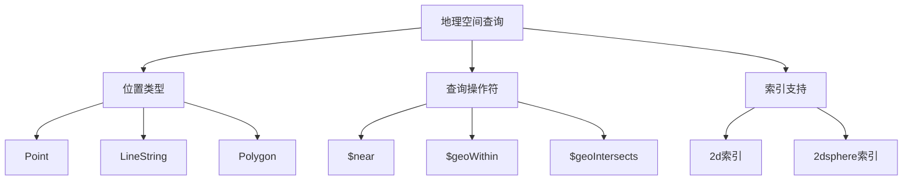

地理空间查询示例：
```javascript
// 1. 创建地理空间索引
db.locations.createIndex({ 
    position: "2dsphere" 
})

// 2. 近距离查询
// 查找附近的地点
db.locations.find({
    position: {
        $near: {
            $geometry: {
                type: "Point",
                coordinates: [116.397428, 39.90923]  // 北京坐标
            },
            $maxDistance: 1000  // 1公里内
        }
    }
})

// 3. 区域查询
// 在多边形区域内查询
db.locations.find({
    position: {
        $geoWithin: {
            $geometry: {
                type: "Polygon",
                coordinates: [[
                    [116.3, 39.9],
                    [116.4, 39.9],
                    [116.4, 40.0],
                    [116.3, 40.0],
                    [116.3, 39.9]
                ]]
            }
        }
    }
})

// 4. 复杂地理查询
// 查找与路线相交的位置
const route = {
    type: "LineString",
    coordinates: [
        [116.3, 39.9],
        [116.4, 39.95],
        [116.5, 40.0]
    ]
};

db.locations.find({
    position: {
        $geoIntersects: {
            $geometry: route
        }
    }
})
```

### 2.2 文本搜索

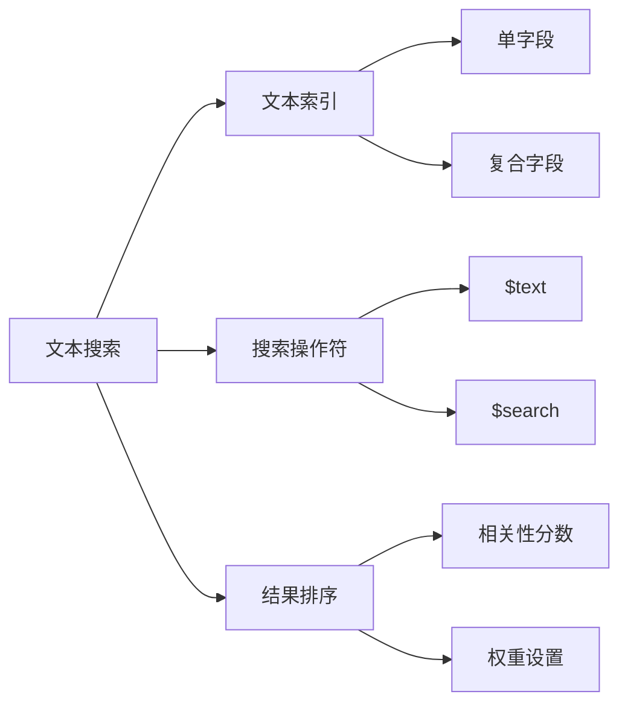

文本搜索示例：
```javascript
// 1. 创建文本索引
// 单字段文本索引
db.articles.createIndex({ 
    content: "text" 
})

// 多字段文本索引
db.articles.createIndex({
    title: "text",
    content: "text",
    tags: "text"
}, {
    weights: {
        title: 10,    // 标题权重更高
        content: 5,
        tags: 2
    },
    default_language: "simplified chinese"
})

// 2. 基本文本搜索
db.articles.find({
    $text: {
        $search: "MongoDB 最佳实践",
        $language: "simplified chinese"
    }
})

// 3. 相关性排序
db.articles.find(
    { $text: { $search: "数据库 性能优化" } },
    { score: { $meta: "textScore" } }
).sort({
    score: { $meta: "textScore" }
})

// 4. 高级文本搜索
// 短语匹配
db.articles.find({
    $text: {
        $search: "\"MongoDB 集群\"",  // 精确短语匹配
        $caseSensitive: false
    }
})

// 排除词搜索
db.articles.find({
    $text: {
        $search: "MongoDB -关系型",  // 包含MongoDB但不包含关系型
        $language: "simplified chinese"
    }
})
```

### 2.3 正则表达式

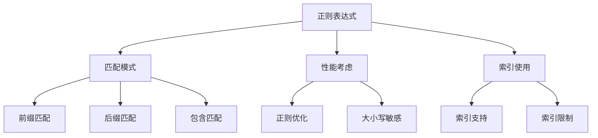

正则表达式示例：
```javascript

// 1. 基本正则匹配
// 前缀匹配（可以使用索引）
db.users.find({
    username: /^张/
})

// 后缀匹配
db.users.find({
    email: /\.com$/
})

// 包含匹配
db.users.find({
    description: /MongoDB/i  // i表示不区分大小写
})

// 2. 复杂正则匹配
// 组合匹配
db.users.find({
    $and: [
        { email: /^[a-zA-Z0-9._%+-]+@[a-zA-Z0-9.-]+\.[a-zA-Z]{2,}$/ },
        { phone: /^1[3-9]\d{9}$/ }  // 中国手机号格式
    ]
})

// 3. 正则表达式优化
const optimizeRegex = (field, pattern) => {
    // 检查是否可以使用前缀索引
    const canUseIndex = /^\^/.test(pattern);
    
    let query = {};
    if (canUseIndex) {
        // 使用前缀索引
        const prefix = pattern
            .replace(/^\^/, '')
            .replace(/[\\.*+?^${}()|[\]]/g, '');
        query[field] = {
            $regex: pattern,
            $options: 'i'
        };
    } else {
        // 无法使用索引时的查询
        query[field] = new RegExp(pattern, 'i');
    }
    
    return query;
};

// 使用优化函数
const query = optimizeRegex('username', '^张.*三$');
db.users.find(query)
```

## 3. 聚合管道

### 3.1 管道阶段

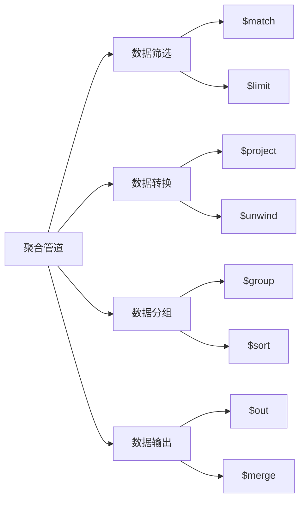

管道阶段示例：
```javascript

// 1. 基本聚合管道
db.orders.aggregate([
    // 筛选条件
    { 
        $match: { 
            status: "completed",
            orderDate: {
                $gte: new Date("2024-01-01")
            }
        }
    },
    // 字段投影
    {
        $project: {
            _id: 0,
            orderId: 1,
            totalAmount: 1,
            customerName: "$customer.name"
        }
    },
    // 分组统计
    {
        $group: {
            _id: "$customerName",
            totalOrders: { $sum: 1 },
            totalSpent: { $sum: "$totalAmount" },
            avgOrderValue: { $avg: "$totalAmount" }
        }
    },
    // 排序
    {
        $sort: { 
            totalSpent: -1 
        }
    }
])

// 2. 复杂聚合管道
// 销售数据分析
db.sales.aggregate([
    // 时间范围筛选
    {
        $match: {
            date: {
                $gte: new Date("2024-01-01"),
                $lt: new Date("2024-02-01")
            }
        }
    },
    // 展开商品数组
    {
        $unwind: "$items"
    },
    // 分组计算
    {
        $group: {
            _id: {
                category: "$items.category",
                month: { $month: "$date" }
            },
            totalSales: { $sum: "$items.amount" },
            totalQuantity: { $sum: "$items.quantity" },
            avgPrice: {
                $avg: {
                    $divide: [
                        "$items.amount",
                        "$items.quantity"
                    ]
                }
            }
        }
    },
    // 结果重塑
    {
        $project: {
            _id: 0,
            category: "$_id.category",
            month: "$_id.month",
            totalSales: 1,
            totalQuantity: 1,
            avgPrice: { $round: ["$avgPrice", 2] }
        }
    },
    // 输出到新集合
    {
        $out: "sales_analysis"
    }
])
```

### 3.2 表达式操作符

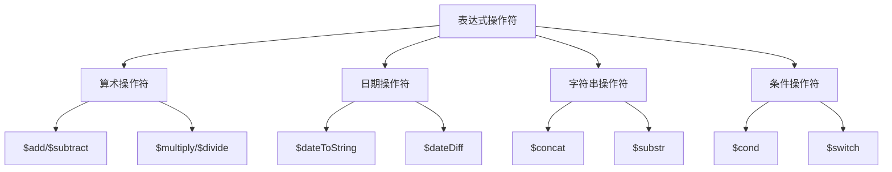

表达式操作符示例：
```javascript
// 1. 算术操作符
db.orders.aggregate([
    {
        $project: {
            orderTotal: {
                $add: ["$subtotal", "$tax"]  // 计算总额
            },
            discount: {
                $multiply: [  // 计算折扣
                    "$subtotal",
                    { $divide: ["$discountPercent", 100] }
                ]
            },
            netAmount: {
                $subtract: [  // 计算净额
                    { $add: ["$subtotal", "$tax"] },
                    "$discount"
                ]
            }
        }
    }
])

// 2. 日期操作符
db.events.aggregate([
    {
        $project: {
            eventDate: {
                $dateToString: {  // 格式化日期
                    format: "%Y-%m-%d %H:%M",
                    date: "$timestamp",
                    timezone: "Asia/Shanghai"
                }
            },
            daysSinceStart: {
                $dateDiff: {  // 计算日期差
                    startDate: "$startDate",
                    endDate: "$$NOW",
                    unit: "day"
                }
            }
        }
    }
])

// 3. 字符串操作符
db.users.aggregate([
    {
        $project: {
            fullName: {
                $concat: [  // 连接字符串
                    "$firstName", " ", "$lastName"
                ]
            },
            nameInitials: {
                $concat: [
                    { $substr: ["$firstName", 0, 1] },
                    { $substr: ["$lastName", 0, 1] }
                ]
            }
        }
    }
])

// 4. 条件操作符
db.sales.aggregate([
    {
        $project: {
            status: {
                $cond: {  // 条件判断
                    if: { $gt: ["$amount", 1000] },
                    then: "高价值",
                    else: "普通"
                }
            },
            level: {
                $switch: {  // 多条件判断
                    branches: [
                        {
                            case: { $gte: ["$amount", 5000] },
                            then: "钻石"
                        },
                        {
                            case: { $gte: ["$amount", 1000] },
                            then: "黄金"
                        }
                    ],
                    default: "普通"
                }
            }
        }
    }
])
```

### 3.3 聚合优化

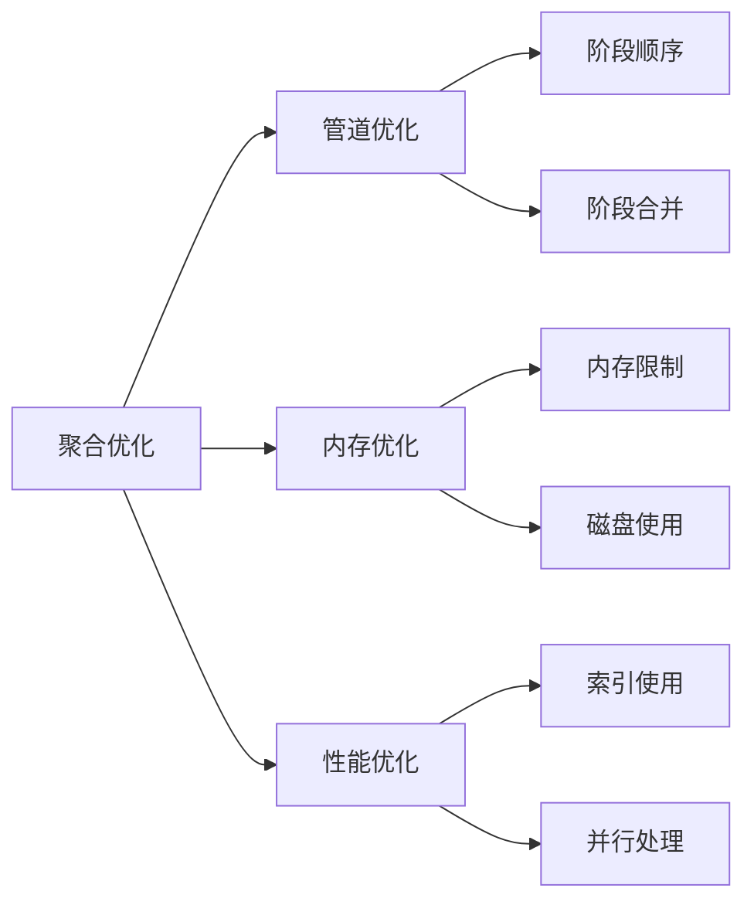

聚合优化示例：
```javascript

// 1. 管道优化
// 优化前
db.orders.aggregate([
    { $sort: { date: -1 } },
    { $match: { status: "completed" } },
    { $limit: 100 }
])

// 优化后（将$match移到前面）
db.orders.aggregate([
    { $match: { status: "completed" } },
    { $sort: { date: -1 } },
    { $limit: 100 }
])

// 2. 内存优化
// 允许使用磁盘
db.orders.aggregate([
    {
        $group: {
            _id: "$customerId",
            totalAmount: { $sum: "$amount" }
        }
    },
    { $sort: { totalAmount: -1 } }
], {
    allowDiskUse: true
})

// 3. 性能优化工具
const optimizeAggregation = (pipeline) => {
    // 分析管道
    const explain = db.orders.explain("executionStats")
        .aggregate(pipeline);
    
    // 检查每个阶段
    const stages = explain.stages;
    const optimizations = [];
    
    stages.forEach((stage, index) => {
        // 检查是否使用了索引
        if (stage.needsSort && !stage.usedIndex) {
            optimizations.push({
                stage: index,
                suggestion: "考虑为排序字段创建索引"
            });
        }
        
        // 检查文档扫描数
        if (stage.docsExamined > stage.nReturned * 10) {
            optimizations.push({
                stage: index,
                suggestion: "考虑添加$match以减少扫描文档数"
            });
        }
    });
    
    return optimizations;
};

// 4. 实际优化示例
const optimizedPipeline = [
    // 使用索引的$match
    {
        $match: {
            date: { 
                $gte: new Date("2024-01-01") 
            },
            status: "completed"
        }
    },
    // 限制处理文档数
    { $limit: 10000 },
    // 必要的字段投影
    {
        $project: {
            _id: 0,
            customerId: 1,
            amount: 1,
            date: 1
        }
    },
    // 分组计算
    {
        $group: {
            _id: {
                customerId: "$customerId",
                month: { $month: "$date" }
            },
            totalAmount: { $sum: "$amount" }
        }
    }
];
```

## 4. 聚合框架

### 4.1 数据转换

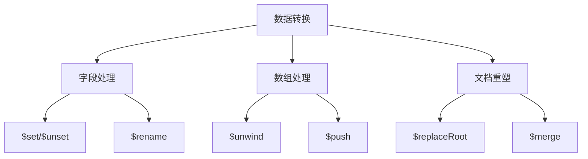

数据转换示例：
```javascript
// 1. 字段处理
db.orders.aggregate([
    // 添加和修改字段
    {
        $set: {
            orderYear: { $year: "$orderDate" },
            totalWithTax: {
                $multiply: ["$total", 1.17]
            },
            status: "processed"
        }
    },
    // 删除不需要的字段
    {
        $unset: [
            "tempField",
            "internalNotes"
        ]
    },
    // 重命名字段
    {
        $rename: {
            "customerName": "buyer",
            "orderTotal": "amount"
        }
    }
])

// 2. 数组处理
db.products.aggregate([
    // 展开数组
    {
        $unwind: {
            path: "$variants",
            preserveNullAndEmptyArrays: true
        }
    },
    // 分组并重建数组
    {
        $group: {
            _id: "$productId",
            variants: { 
                $push: {
                    size: "$variants.size",
                    color: "$variants.color",
                    price: "$variants.price"
                }
            }
        }
    }
])

// 3. 文档重塑
db.sales.aggregate([
    // 重组文档结构
    {
        $replaceRoot: {
            newRoot: {
                $mergeObjects: [
                    "$$ROOT",
                    "$customerInfo",
                    {
                        processedAt: "$$NOW",
                        status: "transformed"
                    }
                ]
            }
        }
    }
])
```

### 4.2 数据分析

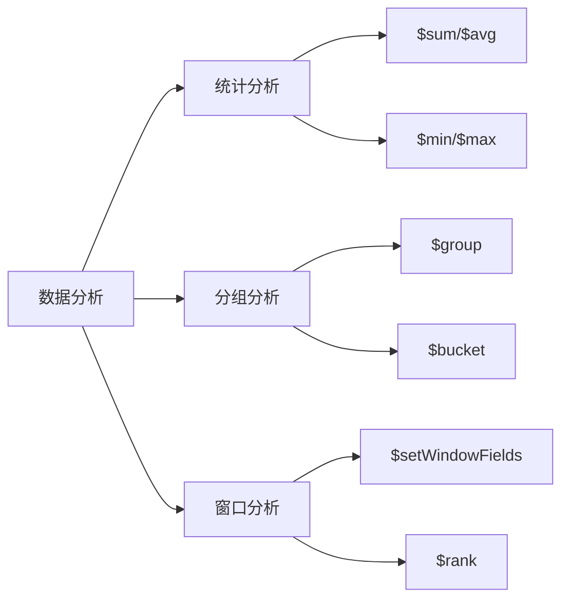

数据分析示例：
```javascript

// 1. 统计分析
db.sales.aggregate([
    // 基础统计
    {
        $group: {
            _id: "$category",
            totalSales: { $sum: "$amount" },
            avgSale: { $avg: "$amount" },
            minSale: { $min: "$amount" },
            maxSale: { $max: "$amount" },
            salesCount: { $sum: 1 }
        }
    },
    // 计算标准差
    {
        $set: {
            standardDeviation: {
                $sqrt: {
                    $subtract: [
                        { $avg: { $multiply: ["$amount", "$amount"] } },
                        { $multiply: [
                            { $avg: "$amount" },
                            { $avg: "$amount" }
                        ]}
                    ]
                }
            }
        }
    }
])

// 2. 分组分析
db.orders.aggregate([
    // 按范围分组
    {
        $bucket: {
            groupBy: "$amount",
            boundaries: [0, 100, 500, 1000, 5000],
            default: "5000+",
            output: {
                count: { $sum: 1 },
                total: { $sum: "$amount" },
                orders: { $push: "$orderId" }
            }
        }
    }
])

// 3. 窗口分析
db.sales.aggregate([
    // 计算移动平均
    {
        $setWindowFields: {
            partitionBy: "$category",
            sortBy: { date: 1 },
            output: {
                movingAvg: {
                    $avg: "$amount",
                    window: {
                        range: [-5, 0],
                        unit: "day"
                    }
                },
                rank: {
                    $rank: {}
                }
            }
        }
    }
])
```

### 4.3 结果处理

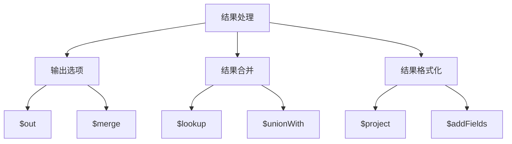

结果处理示例：
```javascript

// 1. 输出处理
// 输出到新集合
db.orders.aggregate([
    { $match: { status: "completed" } },
    { $group: {
        _id: "$customerId",
        totalOrders: { $sum: 1 }
    }},
    { $out: "customer_statistics" }
])

// 合并更新现有集合
db.sales.aggregate([
    { $group: {
        _id: "$productId",
        totalSales: { $sum: "$amount" }
    }},
    { 
        $merge: {
            into: "product_metrics",
            on: "_id",
            whenMatched: "merge",
            whenNotMatched: "insert"
        }
    }
])

// 2. 数据关联
db.orders.aggregate([
    {
        $lookup: {
            from: "customers",
            localField: "customerId",
            foreignField: "_id",
            as: "customerInfo"
        }
    },
    {
        $unwind: "$customerInfo"
    },
    {
        $project: {
            orderId: 1,
            amount: 1,
            customerName: "$customerInfo.name",
            customerEmail: "$customerInfo.email"
        }
    }
])

// 3. 结果格式化
const formatResults = (results) => {
    return results.map(result => ({
        ...result,
        formattedDate: new Date(result.date)
            .toLocaleDateString('zh-CN'),
        formattedAmount: `¥${result.amount.toFixed(2)}`,
        status: result.status.toUpperCase(),
        metadata: {
            processedAt: new Date(),
            version: "1.0"
        }
    }));
};

// 使用格式化函数
const pipeline = [
    { $match: { status: "active" } },
    { $sort: { date: -1 } },
    { $limit: 100 }
];

const results = await db.orders.aggregate(pipeline).toArray();
const formattedResults = formatResults(results);
```

## 5. 总结

MongoDB查询与聚合操作的核心要点：

1. **查询基础**
   - 掌握查询操作符
   - 理解查询条件组合
   - 合理使用查询选项

2. **高级查询**
   - 地理空间查询
   - 文本搜索功能
   - 正则表达式使用

3. **聚合管道**
   - 管道阶段设计
   - 表达式操作符
   - 性能优化策略

4. **聚合框架**
   - 数据转换处理
   - 统计分析功能
   - 结果处理方法

5. **最佳实践**
   - 优化查询性能
   - 合理使用索引
   - 注意内存使用
   - 处理大数据集
```

