# MongoDB 读取操作详解

## 目录
- [1. 读取基础概念](#1-读取基础概念)
  - [1.1 读取类型](#11-读取类型)
  - [1.2 读取流程](#12-读取流程)
  - [1.3 读取选项](#13-读取选项)
- [2. 单节点读取](#2-单节点读取)
  - [2.1 查询执行](#21-查询执行)
  - [2.2 索引使用](#22-索引使用)
  - [2.3 内存管理](#23-内存管理)
- [3. 复制集读取](#3-复制集读取)
  - [3.1 读偏好](#31-读偏好)
  - [3.2 一致性保证](#32-一致性保证)
  - [3.3 故障转移](#33-故障转移)
- [4. 分片集群读取](#4-分片集群读取)
  - [4.1 查询路由](#41-查询路由)
  - [4.2 数据聚合](#42-数据聚合)
  - [4.3 并行查询](#43-并行查询)
- [5. 读取性能优化](#5-读取性能优化)
  - [5.1 查询优化](#51-查询优化)
  - [5.2 性能监控](#52-性能监控)
  - [5.3 问题诊断](#53-问题诊断)

---

## 1. 读取基础概念

### 1.1 读取类型

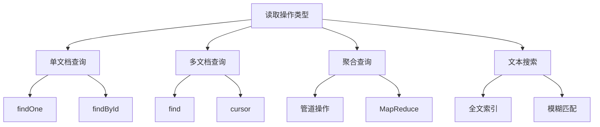

读取操作示例：
```javascript


// 1. 单文档查询
// 按ID查询
const user = await db.users.findOne({ 
    _id: ObjectId("507f1f77bcf86cd799439011") 
})

// 条件查询
const activeUser = await db.users.findOne({ 
    status: "active",
    age: { $gt: 18 }
})

// 2. 多文档查询
// 基本查询
const users = await db.users.find({
    age: { $gte: 18, $lte: 30 }
}).toArray()

// 使用游标
const cursor = db.users.find()
while (await cursor.hasNext()) {
    const doc = await cursor.next()
    console.log(doc)
}

// 3. 聚合查询
const result = await db.orders.aggregate([
    { $match: { status: "completed" } },
    { $group: {
        _id: "$userId",
        totalAmount: { $sum: "$amount" },
        count: { $sum: 1 }
    }}
])

// 4. 文本搜索
await db.articles.createIndex({ content: "text" })
const articles = await db.articles.find({
    $text: { 
        $search: "MongoDB 最佳实践",
        $language: "simplified chinese"
    }
})
```

### 1.2 读取流程

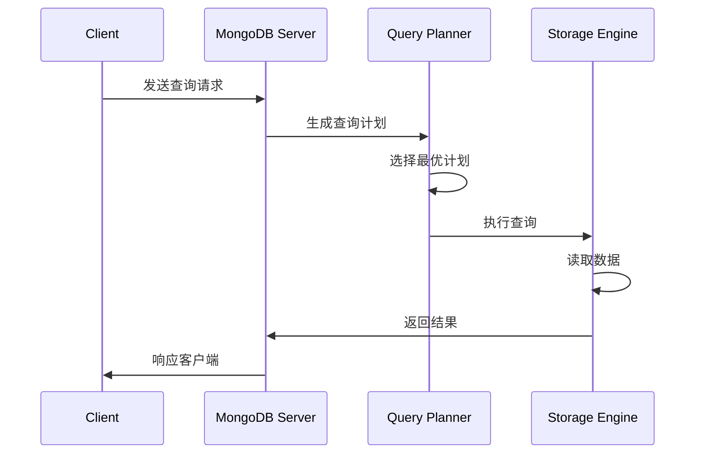

查询流程示例：
```javascript

// 1. 查看查询计划
db.users.find({ 
    age: { $gt: 20 },
    status: "active" 
}).explain("executionStats")

// 2. 强制使用索引
db.users.find({
    age: { $gt: 20 }
}).hint({ age: 1 })

// 3. 查询分析
const explainOutput = db.users.explain("allPlansExecution").find({
    age: { $gt: 20 },
    status: "active"
})

// 4. 查询优化器状态
db.users.find({
    $or: [
        { age: { $gt: 20 } },
        { status: "active" }
    ]
}).explain("queryPlanner")
```

### 1.3 读取选项

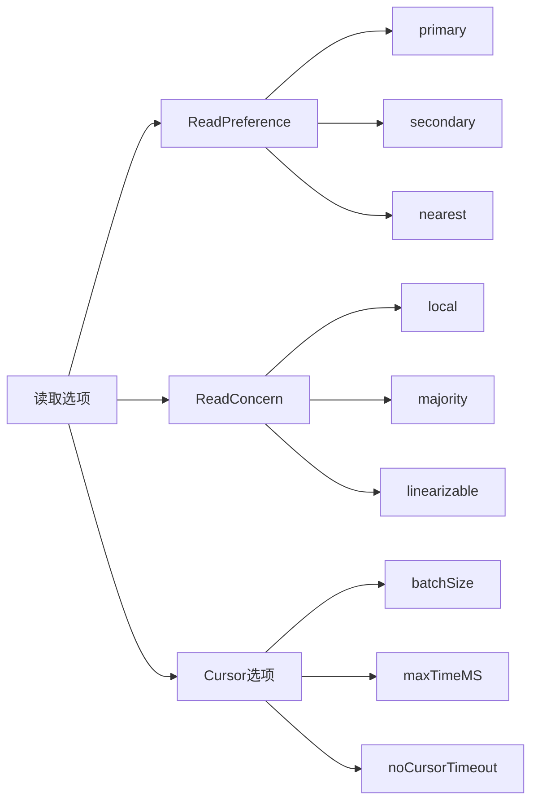

读取选项示例：
```javascript

// 1. ReadPreference配置
db.users.find({}, {
    readPreference: "secondary",
    maxTimeMS: 5000
})

// 2. ReadConcern配置
db.users.find({}, {
    readConcern: { level: "majority" }
})

// 3. Cursor选项
const cursor = db.users.find().batchSize(100)
cursor.maxTimeMS(5000)
cursor.noCursorTimeout()

// 4. 组合使用
const result = await db.users.find({
    status: "active"
}, {
    readPreference: "nearest",
    readConcern: { level: "local" },
    maxTimeMS: 1000,
    batchSize: 50
}).toArray()
```

## 2. 单节点读取

### 2.1 查询执行

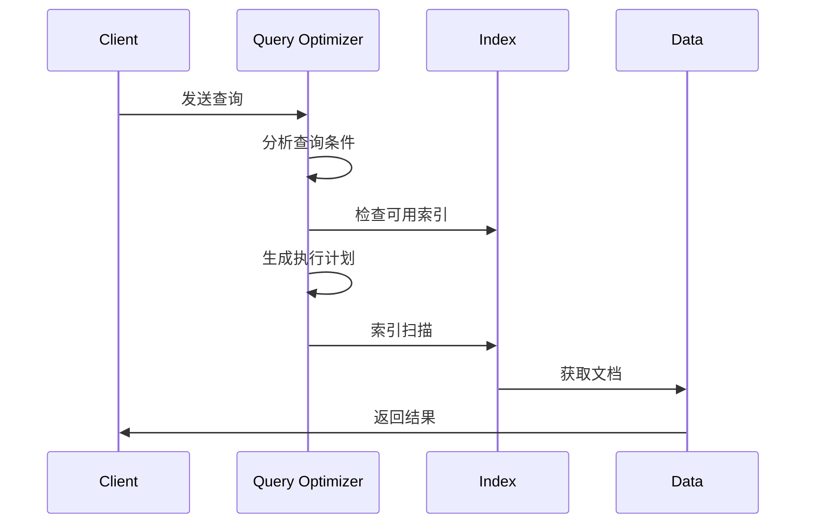

查询执行示例：
```javascript

// 1. 基础查询执行
const result = await db.users.find({
    age: { $gt: 25 },
    status: "active"
}).explain("executionStats")

// 2. 查询计划缓存
db.users.getPlanCache().clear()
db.users.getPlanCache().listQueryShapes()

// 3. 强制执行计划
db.users.find({
    age: { $gt: 25 }
}).hint({ age: 1, status: 1 })

// 4. 查询优化器分析
const analyzeQuery = async (collection, query) => {
    const explain = await collection.find(query)
        .explain("allPlansExecution");
    
    console.log("已检查的文档数:", 
        explain.executionStats.totalDocsExamined);
    console.log("返回的文档数:", 
        explain.executionStats.nReturned);
    console.log("执行时间(ms):", 
        explain.executionStats.executionTimeMillis);
    
    explain.queryPlanner.winningPlan.inputStage.inputStages?.forEach(
        stage => {
            if (stage.stage === "IXSCAN") {
                console.log("使用的索引:", stage.indexName);
            }
        }
    );
};
```

### 2.2 索引使用

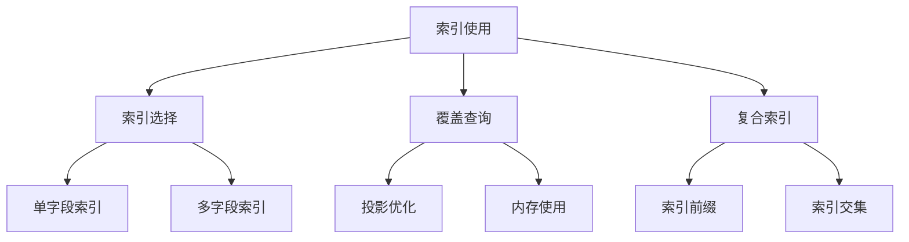

索引优化示例：
```javascript

// 1. 创建合适的索引
db.users.createIndex(
    { age: 1, status: 1 },
    { background: true }
)

// 2. 覆盖查询优化
const result = await db.users.find(
    { age: { $gt: 25 } },
    { _id: 0, age: 1, status: 1 }  // 只返回索引字段
).hint({ age: 1, status: 1 })

// 3. 索引使用分析
const analyzeIndexUsage = async (collection) => {
    const indexes = await collection.indexes();
    const stats = await collection.aggregate([
        { $indexStats: {} }
    ]).toArray();
    
    indexes.forEach(index => {
        const indexStats = stats.find(
            s => s.name === index.name
        );
        console.log(`索引: ${index.name}`);
        console.log(`使用次数: ${
            indexStats?.accesses?.ops || 0
        }`);
    });
};

// 4. 复合索引优化
db.users.find({
    age: 25,
    status: "active",
    city: "北京"
}).explain().queryPlanner.winningPlan
```

### 2.3 内存管理

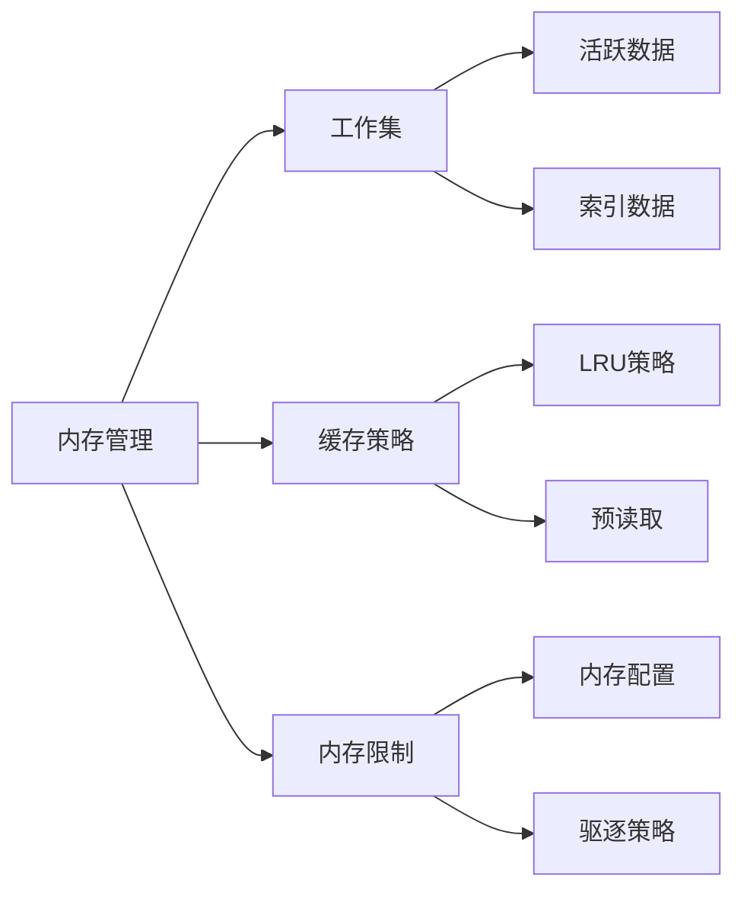

内存管理示例：
```javascript

// 1. 监控内存使用
db.serverStatus().wiredTiger.cache

// 2. 配置缓存大小
db.adminCommand({
    setParameter: 1,
    wiredTigerCacheSizeGB: 4
})

// 3. 内存使用分析
const analyzeMemoryUsage = () => {
    const stats = db.serverStatus();
    const cache = stats.wiredTiger.cache;
    
    console.log("缓存使用情况:");
    console.log(`最大大小: ${
        cache.maximum_bytes_configured / (1024 * 1024 * 1024)
    }GB`);
    console.log(`当前使用: ${
        cache.bytes_currently_in_cache / (1024 * 1024 * 1024)
    }GB`);
    console.log(`读入页数: ${cache.pages_read_into_cache}`);
    console.log(`写出页数: ${cache.pages_written_from_cache}`);
};

// 4. 优化内存使用
db.users.find({
    status: "active"
}, {
    name: 1,
    age: 1,
    _id: 0  // 减少返回字段
}).batchSize(100)  // 控制批量大小
```

## 3. 复制集读取

### 3.1 读偏好

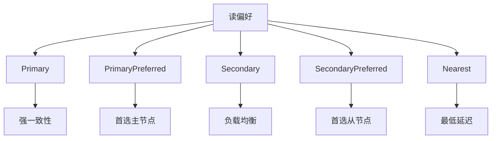

读偏好配置：
```javascript

// 1. 设置不同的读偏好
// 主节点读取
db.users.find({}, {
    readPreference: "primary"
})

// 首选从节点
db.users.find({}, {
    readPreference: "secondaryPreferred",
    maxStalenessSeconds: 90
})

// 最近节点
db.users.find({}, {
    readPreference: "nearest",
    maxStalenessSeconds: 120,
    readPreferenceTags: [
        { "datacenter": "east" },
        { "datacenter": "west" }
    ]
})

// 2. 监控读取分布
const monitorReadDistribution = async (timeMinutes = 5) => {
    const startTime = new Date();
    const endTime = new Date(
        startTime.getTime() + timeMinutes * 60000
    );
    
    while (new Date() < endTime) {
        const status = rs.status();
        status.members.forEach(member => {
            console.log(`${member.name}: ${
                member.optime.t
            } operations`);
        });
        await sleep(1000);
    }
};
```
### 3.2 一致性保证

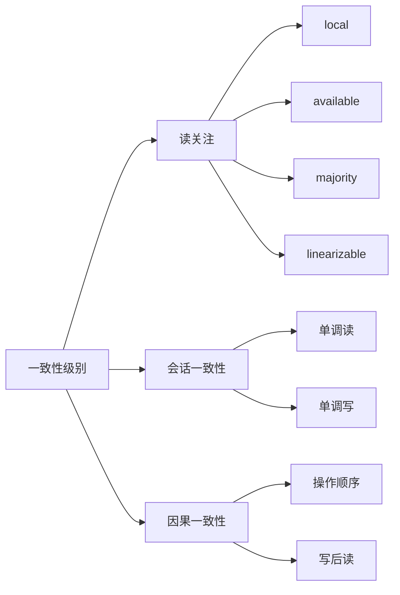

一致性配置示例：
```javascript


// 1. 不同读关注级别
// local读关注
db.users.find({}, {
    readConcern: { level: "local" }
})

// majority读关注
db.users.find({}, {
    readConcern: { level: "majority" }
})

// linearizable读关注
db.users.find({}, {
    readConcern: { level: "linearizable" },
    maxTimeMS: 10000
})

// 2. 因果一致性会话
const session = db.getMongo().startSession({
    causalConsistency: true
});

try {
    const collection = session.getDatabase("test").users;
    
    // 写操作
    await collection.updateOne(
        { _id: 1 },
        { $set: { status: "updated" } }
    );
    
    // 确保读取到最新写入
    await collection.findOne(
        { _id: 1 },
        { readConcern: { level: "majority" } }
    );
} finally {
    session.endSession();
}

// 3. 监控一致性状态
const monitorReplicationLag = async () => {
    const status = rs.status();
    const primary = status.members.find(m => m.state === 1);
    const secondaries = status.members.filter(m => m.state === 2);
    
    secondaries.forEach(secondary => {
        const lagSeconds = (primary.optimeDate - 
            secondary.optimeDate) / 1000;
        console.log(`节点 ${secondary.name} 延迟: ${
            lagSeconds.toFixed(2)
        }秒`);
    });
};
```

### 3.3 故障转移

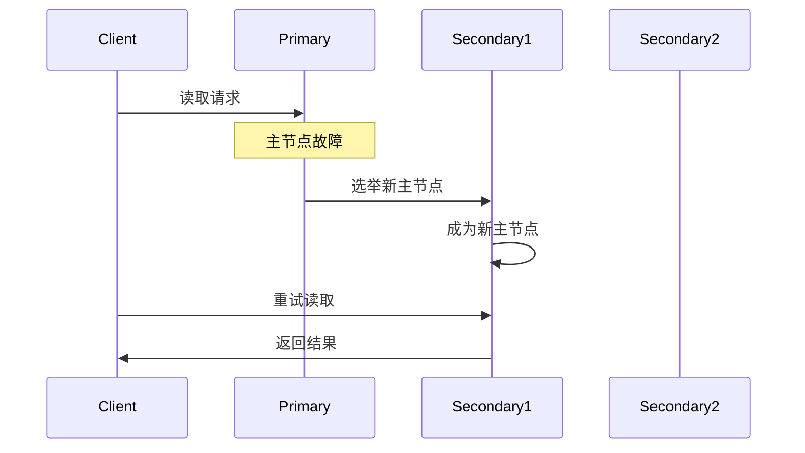

故障转移处理：
```javascript

// 1. 故障转移配置
const retryReads = async (operation, maxAttempts = 3) => {
    for (let attempt = 1; attempt <= maxAttempts; attempt++) {
        try {
            return await operation();
        } catch (error) {
            if (error.code === 11600 || // 节点故障
                error.code === 13436) { // 不是主节点
                if (attempt === maxAttempts) throw error;
                await sleep(1000 * Math.pow(2, attempt));
                continue;
            }
            throw error;
        }
    }
};

// 2. 应用层重试逻辑
const readWithRetry = async () => {
    return await retryReads(async () => {
        return await db.users.find({
            status: "active"
        }, {
            readPreference: "primaryPreferred",
            maxTimeMS: 5000
        }).toArray();
    });
};

// 3. 监控故障转移
db.adminCommand({ replSetGetStatus: 1 })
```

## 4. 分片集群读取

### 4.1 查询路由

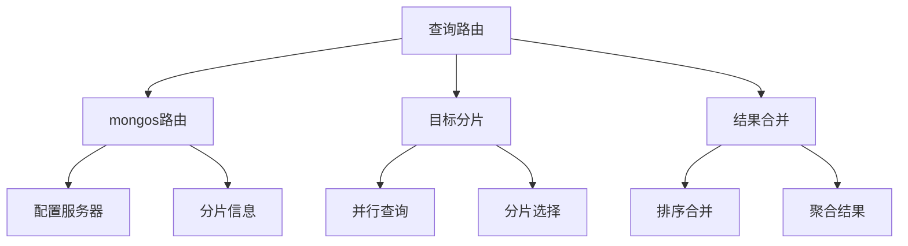

查询路由示例：
```javascript
// 1. 查看分片分布
sh.status()

// 2. 追踪查询路由
db.users.find({
    age: { $gt: 25 }
}).explain("executionStats")

// 3. 分片查询优化
const optimizeShardQuery = async (query) => {
    // 确保查询使用分片键
    const shardKey = db.users.getShardDistribution().key;
    
    // 添加分片键到查询条件
    if (!query[shardKey]) {
        const keyRange = await db.users.distinct(shardKey);
        query[shardKey] = { $in: keyRange };
    }
    
    return await db.users.find(query).toArray();
};

// 4. 监控分片查询
db.adminCommand({
    aggregate: 1,
    pipeline: [
        { $currentOp: { allUsers: true, localOps: false } },
        { $match: { "command.find": "users" } }
    ]
})
```

### 4.2 数据聚合

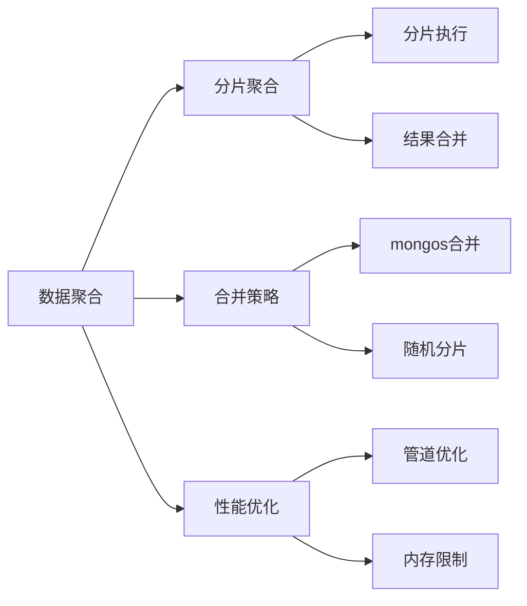

聚合操作示例：
```javascript
// 1. 分片聚合查询
db.orders.aggregate([
    { $match: { status: "completed" } },
    { $group: {
        _id: "$userId",
        totalAmount: { $sum: "$amount" }
    }},
    { $sort: { totalAmount: -1 } }
], {
    allowDiskUse: true,
    maxTimeMS: 60000
})

// 2. 优化聚合管道
const optimizeAggregatePipeline = (pipeline) => {
    // 将 $match 移到管道前面
    const matchStage = pipeline.find(
        stage => stage.$match
    );
    if (matchStage) {
        pipeline = [
            matchStage,
            ...pipeline.filter(
                stage => !stage.$match
            )
        ];
    }
    
    // 添加内存限制
    return {
        pipeline,
        allowDiskUse: true,
        maxTimeMS: 30000
    };
};

// 3. 监控聚合性能
const monitorAggregatePerformance = async (pipeline) => {
    const explain = await db.users.aggregate(
        pipeline,
        { explain: true }
    );
    
    console.log("执行时间:", 
        explain.executionStats?.executionTimeMillis);
    console.log("使用的内存:", 
        explain.serverInfo?.memLimit);
    
    return explain;
};
```

### 4.3 并行查询

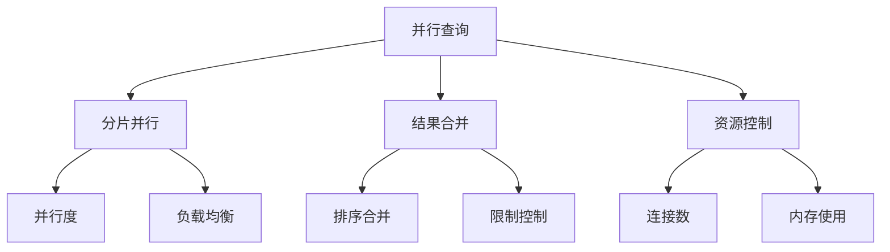

并行查询优化：
```javascript
// 1. 配置并行查询
const parallelQuery = async (query, options = {}) => {
    const defaultOptions = {
        maxTimeMS: 30000,
        batchSize: 1000,
        allowPartialResults: true
    };
    
    const mergedOptions = { ...defaultOptions, ...options };
    
    return await db.users.find(
        query,
        mergedOptions
    ).toArray();
};

// 2. 分片并行扫描
db.users.find({
    age: { $gt: 25 }
}, {
    allowPartialResults: true,
    batchSize: 1000,
    maxTimeMS: 60000
}).noCursorTimeout()

// 3. 监控并行查询
const monitorParallelQueries = async () => {
    const currentOps = await db.adminCommand({
        currentOp: true,
        $all: true
    });
    
    const parallelOps = currentOps.inprog.filter(
        op => op.command?.find === "users"
    );
    
    parallelOps.forEach(op => {
        console.log(`查询ID: ${op.opid}`);
        console.log(`执行时间: ${op.secs_running}秒`);
        console.log(`状态: ${op.state}`);
    });
};
```

## 5. 读取性能优化

### 5.1 查询优化

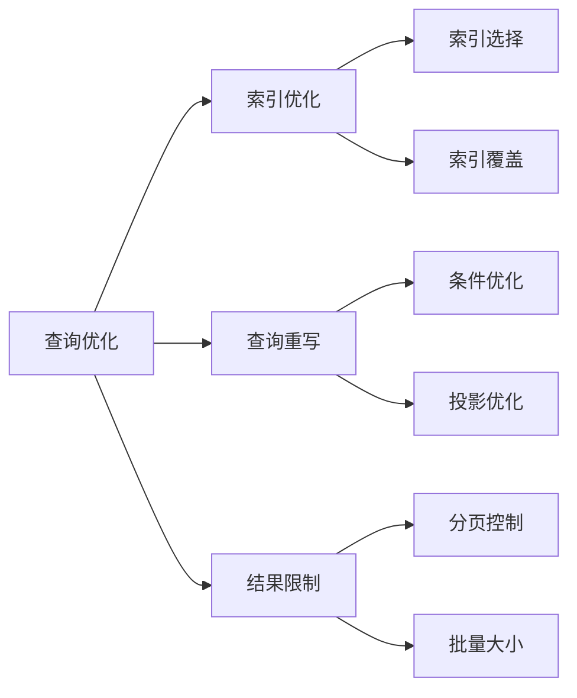

性能优化示例：
```javascript
// 1. 查询优化器分析
const analyzeQueryPerformance = async (query) => {
    const explain = await db.users.find(query)
        .explain("allPlansExecution");
    
    // 分析执行计划
    const winningPlan = explain.queryPlanner.winningPlan;
    console.log("选择的执行计划:", winningPlan.stage);
    
    // 分析索引使用
    if (winningPlan.inputStage?.indexName) {
        console.log("使用的索引:", 
            winningPlan.inputStage.indexName);
    }
    
    // 性能统计
    const stats = explain.executionStats;
    console.log("扫描文档数:", stats.totalDocsExamined);
    console.log("返回文档数:", stats.nReturned);
    console.log("执行时间:", stats.executionTimeMillis);
    
    return explain;
};

// 2. 索引优化建议
const suggestIndexes = async (collection, query) => {
    const explain = await collection.find(query)
        .explain("allPlansExecution");
    
    const suggestions = [];
    
    // 检查全表扫描
    if (explain.queryPlanner.winningPlan.stage === "COLLSCAN") {
        const fields = Object.keys(query);
        suggestions.push({
            type: "CREATE_INDEX",
            fields: fields
        });
    }
    
    // 检查选择性
    const stats = await collection.stats();
    Object.entries(query).forEach(([field, value]) => {
        if (typeof value === "object") {
            suggestions.push({
                type: "CHECK_SELECTIVITY",
                field: field
            });
        }
    });
    
    return suggestions;
};

// 3. 查询重写优化
const optimizeQuery = (query) => {
    const optimized = { ...query };
    
    // 优化范围查询
    Object.entries(optimized).forEach(([field, value]) => {
        if (typeof value === "object" && 
            Object.keys(value).length > 1) {
            // 合并范围条件
            const ranges = {};
            Object.entries(value).forEach(([op, val]) => {
                if (op === "$gt" || op === "$gte") {
                    ranges.min = val;
                } else if (op === "$lt" || op === "$lte") {
                    ranges.max = val;
                }
            });
            optimized[field] = {
                $gte: ranges.min,
                $lte: ranges.max
            };
        }
    });
    
    return optimized;
};
```

### 5.2 性能监控

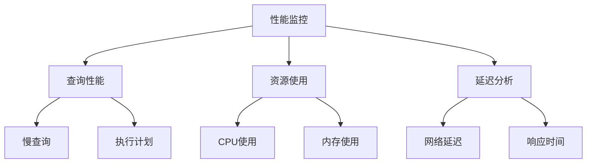

监控工具示例：
```javascript

// 1. 设置慢查询监控
db.setProfilingLevel(1, { slowms: 100 })

// 2. 性能统计分析
const analyzePerformance = async (timeMinutes = 5) => {
    const startTime = new Date();
    const endTime = new Date(
        startTime.getTime() + timeMinutes * 60000
    );
    
    const stats = {
        queries: 0,
        slowQueries: 0,
        avgResponseTime: 0,
        maxResponseTime: 0
    };
    
    while (new Date() < endTime) {
        const currentStats = db.serverStatus();
        const profile = db.system.profile.find({
            ts: { 
                $gt: new Date(Date.now() - 60000)
            }
        }).toArray();
        
        stats.queries += currentStats.opcounters.query;
        stats.slowQueries += profile.length;
        
        if (profile.length > 0) {
            const responseTimes = profile.map(
                p => p.millis
            );
            stats.avgResponseTime = 
                responseTimes.reduce((a, b) => a + b) / 
                responseTimes.length;
            stats.maxResponseTime = Math.max(
                stats.maxResponseTime,
                ...responseTimes
            );
        }
        
        await sleep(5000);
    }
    
    return stats;
};

// 3. 资源使用监控
const monitorResourceUsage = async () => {
    const serverStatus = db.serverStatus();
    
    return {
        connections: serverStatus.connections,
        memory: {
            resident: serverStatus.mem.resident,
            virtual: serverStatus.mem.virtual
        },
        opcounters: serverStatus.opcounters,
        network: serverStatus.network
    };
};
```

### 5.3 问题诊断

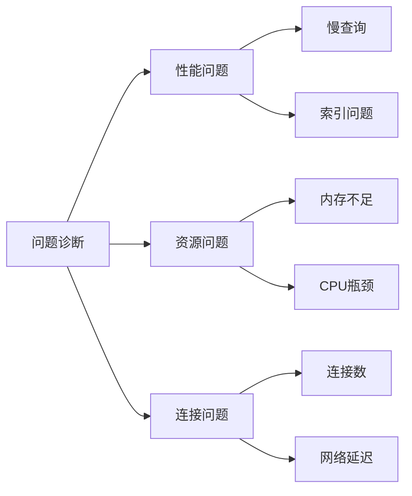

诊断工具示例：
```javascript

// 1. 诊断慢查询
const analyzeSlow

Queries = async () => {
    const slowQueries = await db.system.profile.find({
        millis: { $gt: 100 }
    }).toArray();
    
    slowQueries.forEach(query => {
        console.log("查询语句:", query.query);
        console.log("执行时间:", query.millis);
        console.log("扫描文档数:", 
            query.docsExamined);
        console.log("返回文档数:", 
            query.nreturned);
        
        // 提供优化建议
        if (query.docsExamined / query.nreturned > 100) {
            console.log("建议: 考虑添加索引");
        }
    });
};

// 2. 连接问题诊断
const diagnoseConnections = () => {
    const status = db.serverStatus();
    const conns = status.connections;
    
    console.log("当前连接数:", conns.current);
    console.log("可用连接数:", conns.available);
    
    if (conns.current / conns.available > 0.8) {
        console.log("警告: 连接数接近上限");
    }
};

// 3. 资源问题诊断
const diagnoseResources = () => {
    const status = db.serverStatus();
    
    // 内存使用
    const memoryUsage = status.mem.resident / 
        status.mem.mapped;
    if (memoryUsage > 0.9) {
        console.log("警告: 内存使用率过高");
    }
    
    // 页面错误
    if (status.extra_info.page_faults > 1000) {
        console.log("警告: 页面错误率高");
    }
};
```

## 6. 总结

MongoDB读取操作的核心要点：

1. **读取基础**
   - 理解读取类型和流程
   - 合理配置读取选项
   - 正确使用游标和批量

2. **复制集读取**
   - 读偏好设置
   - 一致性保证
   - 故障转移处理

3. **分片集群读取**
   - 查询路由优化
   - 并行查询处理
   - 数据聚合策略

4. **性能优化**
   - 索引使用优化
   - 查询执行优化
   - 资源使用监控

5. **最佳实践**
   - 根据场景选择读取策略
   - 定期监控性能指标
   - 建立问题诊断流程
```

