# MongoDB 安全管理指南

## 目录
- [1. 认证与授权](#1-认证与授权)
  - [1.1 认证机制](#11-认证机制)
  - [1.2 用户管理](#12-用户管理)
  - [1.3 角色管理](#13-角色管理)
- [2. 访问控制](#2-访问控制)
  - [2.1 网络安全](#21-网络安全)
  - [2.2 防火墙配置](#22-防火墙配置)
  - [2.3 SSL/TLS配置](#23-ssltls配置)
- [3. 审计与合规](#3-审计与合规)
  - [3.1 审计配置](#31-审计配置)
  - [3.2 日志管理](#32-日志管理)
  - [3.3 合规检查](#33-合规检查)
- [4. 数据加密](#4-数据加密)
  - [4.1 传输加密](#41-传输加密)
  - [4.2 存储加密](#42-存储加密)
  - [4.3 字段级加密](#43-字段级加密)

## 1. 认证与授权

### 1.1 认证机制

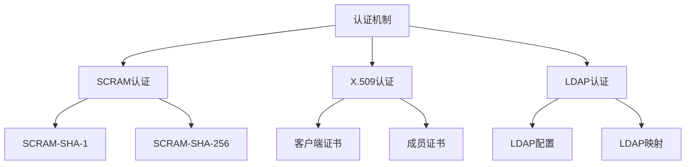

认证机制实现示例：
```javascript
// 1. 认证管理器
class AuthenticationManager {
    async setupAuthentication(config) {
        // 配置认证机制
        await this.configureAuthMechanism(config.mechanism);
        
        // 设置认证数据库
        await this.setupAuthDatabase();
        
        // 配置认证选项
        await this.configureAuthOptions(config.options);
    }
    
    async configureAuthMechanism(mechanism) {
        switch (mechanism) {
            case 'SCRAM':
                await this.configureSCRAM();
                break;
            case 'X509':
                await this.configureX509();
                break;
            case 'LDAP':
                await this.configureLDAP();
                break;
            default:
                throw new Error(
                    `Unsupported auth mechanism: ${mechanism}`
                );
        }
    }
    
    async configureSCRAM() {
        return db.adminCommand({
            setParameter: 1,
            authenticationMechanisms: ['SCRAM-SHA-256']
        });
    }
}

// 2. SCRAM认证实现
class SCRAMAuthenticator {
    async authenticate(credentials) {
        // 第一步：客户端首次请求
        const firstRequest = this.generateFirstRequest(
            credentials.username
        );
        
        // 第二步：服务器响应
        const serverResponse = await this.sendToServer(firstRequest);
        
        // 第三步：客户端最终请求
        const finalRequest = this.generateFinalRequest(
            credentials.password,
            serverResponse
        );
        
        // 第四步：验证服务器响应
        return await this.validateServerResponse(
            await this.sendToServer(finalRequest)
        );
    }
    
    generateFirstRequest(username) {
        return {
            saslStart: 1,
            mechanism: 'SCRAM-SHA-256',
            payload: this.createClientFirstMessage(username)
        };
    }
}

// 3. X.509认证实现
class X509Authenticator {
    async setupX509Auth(config) {
        // 配置SSL/TLS
        await this.configureSSL(config.ssl);
        
        // 配置证书
        await this.configureCertificates({
            clientCertificate: config.clientCert,
            clientKey: config.clientKey,
            caCertificate: config.caCert
        });
        
        // 启用X.509认证
        return await db.adminCommand({
            setParameter: 1,
            authenticationMechanisms: ['MONGODB-X509']
        });
    }
    
    async authenticateWithX509(certificate) {
        return await db.adminCommand({
            authenticate: 1,
            mechanism: 'MONGODB-X509',
            user: this.extractUserFromCert(certificate)
        });
    }
}
```

### 1.2 用户管理

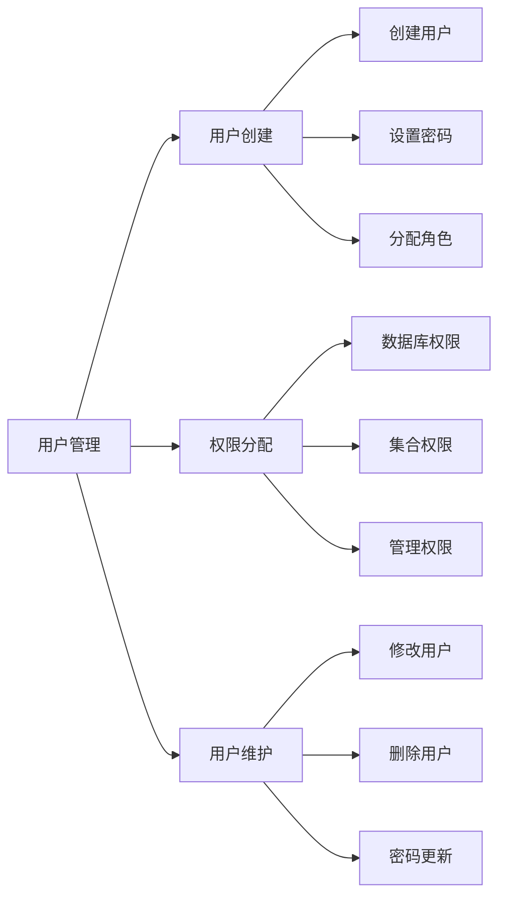


用户管理示例：
```javascript


// 1. 用户管理器
class UserManager {
    async createUser(userInfo) {
        try {
            // 创建用户
            await db.createUser({
                user: userInfo.username,
                pwd: userInfo.password,
                roles: userInfo.roles,
                customData: userInfo.customData || {},
                authenticationRestrictions: 
                    userInfo.restrictions || []
            });
            
            // 验证用户创建
            await this.verifyUserCreation(userInfo.username);
            
            return {
                success: true,
                username: userInfo.username,
                roles: userInfo.roles
            };
            
        } catch (error) {
            throw new Error(
                `Failed to create user: ${error.message}`
            );
        }
    }
    
    async updateUser(username, updates) {
        // 验证更新内容
        this.validateUpdates(updates);
        
        // 执行更新
        await db.updateUser(username, {
            pwd: updates.password,
            roles: updates.roles,
            customData: updates.customData,
            authenticationRestrictions: updates.restrictions
        });
        
        // 验证更新结果
        return await this.verifyUserUpdate(username, updates);
    }
    
    async deleteUser(username) {
        // 检查用户依赖
        await this.checkUserDependencies(username);
        
        // 删除用户
        await db.dropUser(username);
        
        // 验证删除
        return await this.verifyUserDeletion(username);
    }
}

// 2. 权限管理器
class PermissionManager {
    async grantPermissions(username, permissions) {
        // 验证权限
        this.validatePermissions(permissions);
        
        // 授予权限
        for (const permission of permissions) {
            await db.grantRolesToUser(username, [{
                role: permission.role,
                db: permission.database
            }]);
        }
        
        // 验证权限分配
        return await this.verifyPermissions(username, permissions);
    }
    
    async revokePermissions(username, permissions) {
        // 检查权限依赖
        await this.checkPermissionDependencies(
            username, 
            permissions
        );
        
        // 撤销权限
        for (const permission of permissions) {
            await db.revokeRolesFromUser(username, [{
                role: permission.role,
                db: permission.database
            }]);
        }
    }
    
    validatePermissions(permissions) {
        const validRoles = [
            'read', 'readWrite', 'dbAdmin', 
            'userAdmin', 'clusterAdmin', 'root'
        ];
        
        for (const permission of permissions) {
            if (!validRoles.includes(permission.role)) {
                throw new Error(
                    `Invalid role: ${permission.role}`
                );
            }
        }
    }
}

// 3. 密码管理器
class PasswordManager {
    async updatePassword(username, newPassword) {
        // 验证密码强度
        this.validatePasswordStrength(newPassword);
        
        // 更新密码
        await db.updateUser(username, {
            pwd: newPassword
        });
        
        // 验证密码更新
        return await this.verifyPasswordUpdate(username);
    }
    
    validatePasswordStrength(password) {
        // 检查长度
        if (password.length < 12) {
            throw new Error('Password too short');
        }
        
        // 检查复杂度
        const checks = {
            hasUpperCase: /[A-Z]/.test(password),
            hasLowerCase: /[a-z]/.test(password),
            hasNumbers: /\d/.test(password),
            hasSpecialChars: /[!@#$%^&*]/.test(password)
        };
        
        const failedChecks = Object.entries(checks)
            .filter(([_, passed]) => !passed)
            .map(([check]) => check);
            
        if (failedChecks.length > 0) {
            throw new Error(
                `Password fails checks: ${failedChecks.join(', ')}`
            );
        }
    }
}
```

### 1.3 角色管理

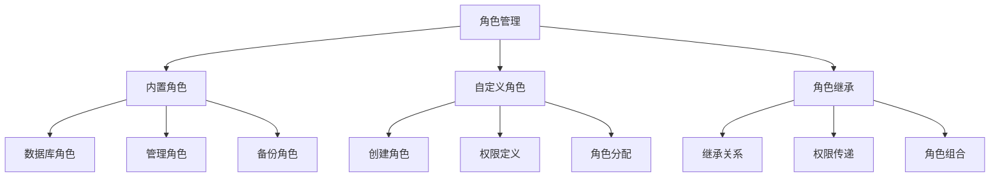

角色管理示例：
```javascript

// 1. 角色管理器
class RoleManager {
    async createRole(roleInfo) {
        // 验证角色信息
        this.validateRoleInfo(roleInfo);
        
        // 创建角色
        await db.createRole({
            role: roleInfo.name,
            privileges: roleInfo.privileges,
            roles: roleInfo.inheritedRoles || []
        });
        
        // 验证角色创建
        return await this.verifyRoleCreation(roleInfo.name);
    }
    
    async updateRole(roleName, updates) {
        // 检查角色依赖
        await this.checkRoleDependencies(roleName);
        
        // 更新角色
        await db.updateRole(roleName, {
            privileges: updates.privileges,
            roles: updates.inheritedRoles
        });
        
        // 验证更新
        return await this.verifyRoleUpdate(roleName, updates);
    }
    
    validateRoleInfo(roleInfo) {
        // 验证角色名称
        if (!roleInfo.name || typeof roleInfo.name !== 'string') {
            throw new Error('Invalid role name');
        }
        
        // 验证权限
        if (!Array.isArray(roleInfo.privileges)) {
            throw new Error('Invalid privileges format');
        }
        
        // 验证继承角色
        if (roleInfo.inheritedRoles && 
            !Array.isArray(roleInfo.inheritedRoles)) {
            throw new Error('Invalid inherited roles format');
        }
    }
}

// 2. 权限定义器
class PrivilegeDefinition {
    createDatabasePrivileges(database) {
        return {
            read: {
                resource: { db: database, collection: '' },
                actions: ['find', 'listCollections']
            },
            readWrite: {
                resource: { db: database, collection: '' },
                actions: [
                    'find', 'insert', 'update', 'delete',
                    'listCollections'
                ]
            },
            dbAdmin: {
                resource: { db: database, collection: '' },
                actions: [
                    'createCollection', 'dropCollection',
                    'createIndex', 'dropIndex'
                ]
            }
        };
    }
    
    createCollectionPrivileges(database, collection) {
        return {
            read: {
                resource: { db: database, collection },
                actions: ['find']
            },
            readWrite: {
                resource: { db: database, collection },
                actions: ['find', 'insert', 'update', 'delete']
            },
            admin: {
                resource: { db: database, collection },
                actions: [
                    'find', 'insert', 'update', 'delete',
                    'createIndex', 'dropIndex'
                ]
            }
        };
    }
}

// 3. 角色继承管理器
class RoleInheritanceManager {
    async setupInheritance(roleInfo) {
        // 验证继承关系
        await this.validateInheritance(
            roleInfo.role,
            roleInfo.inheritsFrom
        );
        
        // 建立继承关系
        await db.updateRole(roleInfo.role, {
            roles: roleInfo.inheritsFrom.map(role => ({
                role: role,
                db: roleInfo.database
            }))
        });
        
        // 验证继承设置
        return await this.verifyInheritance(
            roleInfo.role,
            roleInfo.inheritsFrom
        );
    }
    
    async validateInheritance(role, inheritedRoles) {
        // 检查循环继承
        if (await this.hasCircularInheritance(
            role, 
            inheritedRoles
        )) {
            throw new Error('Circular inheritance detected');
        }
        
        // 检查权限冲突
        const conflicts = await this.checkPrivilegeConflicts(
            role,
            inheritedRoles
        );
        
        if (conflicts.length > 0) {
            throw new Error(
                `Privilege conflicts detected: ${conflicts.join(', ')}`
            );
        }
    }
}
```


## 2. 访问控制

### 2.1 网络安全

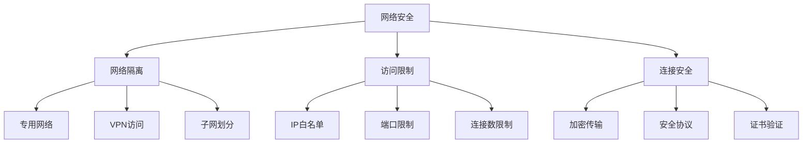

网络安全配置示例：
```javascript
// 1. 网络安全管理器
class NetworkSecurityManager {
    async configureNetworkSecurity(config) {
        // 配置网络绑定
        await this.configureNetworkBinding(config.binding);
        
        // 配置访问限制
        await this.configureAccessRestrictions(config.restrictions);
        
        // 配置连接安全
        await this.configureConnectionSecurity(config.security);
        
        return await this.verifyNetworkSecurity();
    }
    
    async configureNetworkBinding(binding) {
        // 设置绑定IP
        await db.adminCommand({
            setParameter: 1,
            net: {
                bindIp: binding.addresses.join(','),
                port: binding.port,
                maxIncomingConnections: binding.maxConnections
            }
        });
    }
    
    async configureAccessRestrictions(restrictions) {
        // 配置IP白名单
        await this.configureIpWhitelist(restrictions.allowedIps);
        
        // 配置端口访问
        await this.configurePortAccess(restrictions.ports);
        
        // 设置连接限制
        await this.configureConnectionLimits(
            restrictions.connectionLimits
        );
    }
}

// 2. 访问控制管理器
class AccessControlManager {
    async setupAccessControl(rules) {
        // 创建防火墙规则
        await this.createFirewallRules(rules.firewall);
        
        // 配置IP过滤
        await this.configureIpFiltering(rules.ipFilter);
        
        // 设置连接策略
        await this.configureConnectionPolicy(rules.policy);
    }
    
    async createFirewallRules(rules) {
        for (const rule of rules) {
            await this.createFirewallRule({
                priority: rule.priority,
                direction: rule.direction,
                source: rule.source,
                destination: rule.destination,
                protocol: rule.protocol,
                action: rule.action
            });
        }
    }
    
    async configureIpFiltering(filterConfig) {
        return await db.adminCommand({
            setParameter: 1,
            netfilter: {
                allowedIps: filterConfig.allowList,
                blockedIps: filterConfig.blockList,
                defaultAction: filterConfig.defaultAction
            }
        });
    }
}

// 3. 连接安全管理器
class ConnectionSecurityManager {
    async setupConnectionSecurity(config) {
        // 配置SSL/TLS
        await this.configureSSL(config.ssl);
        
        // 配置安全协议
        await this.configureSecureProtocols(config.protocols);
        
        // 配置证书验证
        await this.configureCertValidation(config.certificates);
    }
    
    async configureSSL(sslConfig) {
        return await db.adminCommand({
            setParameter: 1,
            net: {
                ssl: {
                    mode: sslConfig.mode,
                    PEMKeyFile: sslConfig.keyFile,
                    CAFile: sslConfig.caFile,
                    allowInvalidCertificates: 
                        sslConfig.allowInvalidCerts,
                    allowInvalidHostnames: 
                        sslConfig.allowInvalidHostnames
                }
            }
        });
    }
    
    async configureCertValidation(certConfig) {
        // 配置证书验证策略
        const validationPolicy = {
            validateCertificates: true,
            certificateExpirationWarningDays: 30,
            requireClientCertificate: certConfig.requireClientCert,
            allowExpiredCertificates: false
        };
        
        await this.applyCertValidationPolicy(validationPolicy);
    }
}
```

### 2.2 防火墙配置

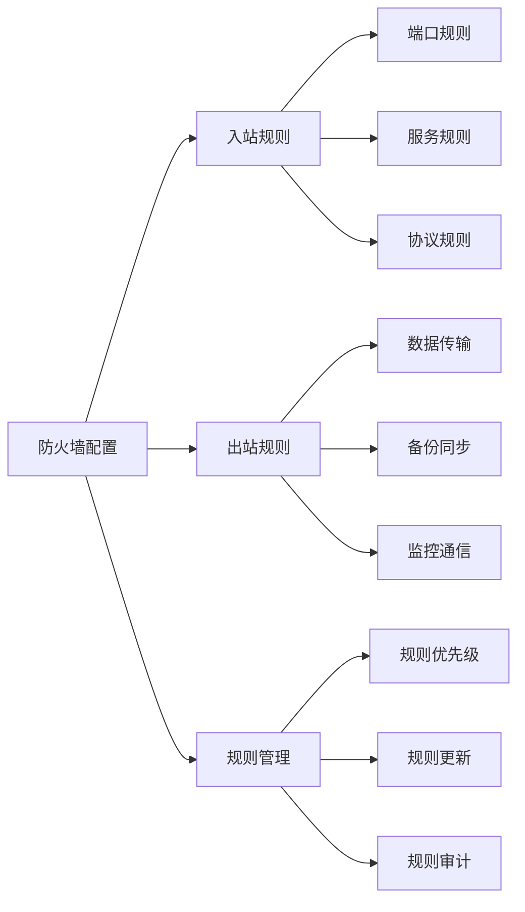

防火墙配置示例：
```javascript
// 1. 防火墙规则管理器
class FirewallRuleManager {
    async configureFirewall(config) {
        // 配置入站规则
        await this.configureInboundRules(config.inbound);
        
        // 配置出站规则
        await this.configureOutboundRules(config.outbound);
        
        // 应用规则配置
        return await this.applyRuleConfiguration();
    }
    
    async configureInboundRules(rules) {
        const inboundRules = rules.map(rule => ({
            priority: rule.priority,
            direction: 'inbound',
            source: rule.source,
            port: rule.port,
            protocol: rule.protocol,
            action: rule.action,
            description: rule.description
        }));
        
        await this.validateRules(inboundRules);
        return await this.applyRules(inboundRules);
    }
    
    async configureOutboundRules(rules) {
        const outboundRules = rules.map(rule => ({
            priority: rule.priority,
            direction: 'outbound',
            destination: rule.destination,
            port: rule.port,
            protocol: rule.protocol,
            action: rule.action,
            description: rule.description
        }));
        
        await this.validateRules(outboundRules);
        return await this.applyRules(outboundRules);
    }
}

// 2. 规则验证器
class RuleValidator {
    validateRule(rule) {
        // 验证规则格式
        this.validateRuleFormat(rule);
        
        // 验证IP地址/范围
        this.validateAddresses(rule);
        
        // 验证端口配置
        this.validatePorts(rule);
        
        // 验证协议设置
        this.validateProtocols(rule);
    }
    
    validateRuleFormat(rule) {
        const requiredFields = [
            'priority',
            'direction',
            'action'
        ];
        
        for (const field of requiredFields) {
            if (!rule[field]) {
                throw new Error(
                    `Missing required field: ${field}`
                );
            }
        }
    }
    
    validateAddresses(rule) {
        const validateIp = (ip) => {
            const ipRegex = /^(\d{1,3}\.){3}\d{1,3}(\/\d{1,2})?$/;
            if (!ipRegex.test(ip)) {
                throw new Error(`Invalid IP address: ${ip}`);
            }
        };
        
        if (rule.source) validateIp(rule.source);
        if (rule.destination) validateIp(rule.destination);
    }
}

// 3. 规则应用器
class RuleApplier {
    async applyRules(rules) {
        // 排序规则
        const sortedRules = this.sortRulesByPriority(rules);
        
        // 备份当前规则
        await this.backupCurrentRules();
        
        try {
            // 应用新规则
            for (const rule of sortedRules) {
                await this.applyRule(rule);
            }
            
            // 验证规则应用
            await this.verifyRuleApplication();
            
            return true;
            
        } catch (error) {
            // 回滚规则
            await this.rollbackRules();
            throw error;
        }
    }
    
    sortRulesByPriority(rules) {
        return rules.sort((a, b) => a.priority - b.priority);
    }
    
    async applyRule(rule) {
        // 构建规则命令
        const command = this.buildRuleCommand(rule);
        
        // 执行规则命令
        await this.executeCommand(command);
        
        // 记录规则变更
        await this.logRuleChange(rule);
    }
}
```
### 2.3 SSL/TLS配置

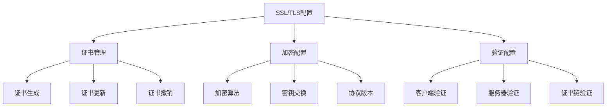

SSL/TLS配置示例：
```javascript
// 1. SSL/TLS配置管理器
class SSLTLSManager {
    async configureSSLTLS(config) {
        // 配置证书
        await this.configureCertificates(config.certificates);
        
        // 配置加密设置
        await this.configureEncryption(config.encryption);
        
        // 配置验证设置
        await this.configureValidation(config.validation);
        
        return await this.verifySSLTLSConfiguration();
    }
    
    async configureCertificates(certConfig) {
        return await db.adminCommand({
            setParameter: 1,
            net: {
                tls: {
                    certificateKeyFile: certConfig.keyFile,
                    certificateKeyFilePassword: certConfig.keyPassword,
                    CAFile: certConfig.caFile,
                    CRLFile: certConfig.crlFile,
                    allowInvalidCertificates: false,
                    allowInvalidHostnames: false
                }
            }
        });
    }
    
    async configureEncryption(encConfig) {
        return await db.adminCommand({
            setParameter: 1,
            net: {
                tls: {
                    disabledProtocols: ['TLS1_0', 'TLS1_1'],
                    cipherConfig: encConfig.ciphers.join(','),
                    minimumTLSVersion: 'TLS1_2'
                }
            }
        });
    }
}

// 2. 证书管理器
class CertificateManager {
    async generateCertificates(config) {
        // 生成CA证书
        const caKeyPair = await this.generateKeyPair({
            type: 'ca',
            bits: 4096,
            days: 3650
        });
        
        // 生成服务器证书
        const serverKeyPair = await this.generateKeyPair({
            type: 'server',
            bits: 2048,
            days: 365,
            ca: caKeyPair
        });
        
        // 生成客户端证书
        const clientKeyPair = await this.generateKeyPair({
            type: 'client',
            bits: 2048,
            days: 365,
            ca: caKeyPair
        });
        
        return {
            ca: caKeyPair,
            server: serverKeyPair,
            client: clientKeyPair
        };
    }
    
    async renewCertificate(certInfo) {
        // 验证当前证书
        await this.validateCurrentCert(certInfo);
        
        // 生成新证书
        const newCert = await this.generateNewCert(certInfo);
        
        // 更新证书
        await this.updateCertificate(certInfo.type, newCert);
        
        // 验证新证书
        return await this.verifyCertificate(newCert);
    }
}

// 3. 证书验证器
class CertificateValidator {
    async validateCertificateChain(chain) {
        // 验证证书链完整性
        await this.validateChainIntegrity(chain);
        
        // 验证证书有效期
        await this.validateCertDates(chain);
        
        // 验证证书撤销状态
        await this.validateRevocationStatus(chain);
        
        // 验证密钥用法
        await this.validateKeyUsage(chain);
    }
    
    async validateChainIntegrity(chain) {
        let currentCert = chain[0];
        
        for (let i = 1; i < chain.length; i++) {
            const issuerCert = chain[i];
            
            // 验证签名
            if (!await this.verifySignature(
                currentCert, 
                issuerCert
            )) {
                throw new Error(
                    'Certificate chain signature verification failed'
                );
            }
            
            currentCert = issuerCert;
        }
    }
}
```

## 3. 审计与合规

### 3.1 审计配置

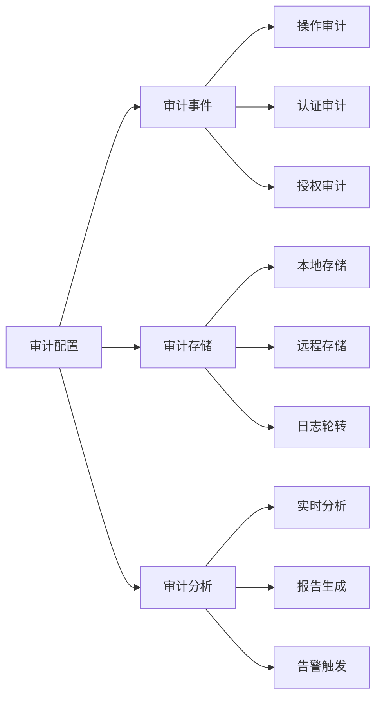

审计配置示例：
```javascript

// 1. 审计管理器
class AuditManager {
    async configureAuditing(config) {
        // 配置审计目标
        await this.configureAuditDestination(config.destination);
        
        // 配置审计过滤器
        await this.configureAuditFilter(config.filter);
        
        // 启用审计
        return await this.enableAuditing(config);
    }
    
    async configureAuditDestination(destination) {
        return await db.adminCommand({
            setParameter: 1,
            auditLog: {
                destination: destination.type,
                format: destination.format,
                path: destination.path,
                filter: destination.filter
            }
        });
    }
    
    async configureAuditFilter(filter) {
        return await db.adminCommand({
            setParameter: 1,
            auditAuthorizationSuccess: filter.authSuccess,
            auditAuthorizationFailure: filter.authFailure,
            auditOpFilter: filter.operations
        });
    }
}

// 2. 审计事件处理器
class AuditEventHandler {
    async handleAuditEvent(event) {
        // 格式化事件
        const formattedEvent = this.formatEvent(event);
        
        // 存储事件
        await this.storeEvent(formattedEvent);
        
        // 分析事件
        await this.analyzeEvent(formattedEvent);
        
        // 触发告警（如果需要）
        await this.triggerAlerts(formattedEvent);
    }
    
    formatEvent(event) {
        return {
            timestamp: new Date(),
            type: event.type,
            user: event.user,
            operation: event.operation,
            database: event.database,
            collection: event.collection,
            status: event.status,
            details: event.details
        };
    }
}

// 3. 审计报告生成器
class AuditReportGenerator {
    async generateReport(options) {
        // 收集审计数据
        const auditData = await this.collectAuditData(
            options.timeRange
        );
        
        // 分析数据
        const analysis = this.analyzeAuditData(auditData);
        
        // 生成报告
        const report = this.createReport(analysis);
        
        // 导出报告
        return await this.exportReport(report, options.format);
    }
    
    async collectAuditData(timeRange) {
        return await db.system.auditLog.find({
            timestamp: {
                $gte: timeRange.start,
                $lte: timeRange.end
            }
        }).toArray();
    }
    
    analyzeAuditData(data) {
        return {
            // 操作统计
            operations: this.analyzeOperations(data),
            
            // 用户活动
            userActivity: this.analyzeUserActivity(data),
            
            // 安全事件
            securityEvents: this.analyzeSecurityEvents(data),
            
            // 异常检测
            anomalies: this.detectAnomalies(data)
        };
    }
}
```


### 3.2 日志管理

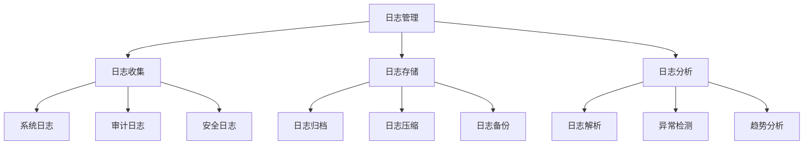

日志管理示例：
```javascript

// 1. 日志管理器
class LogManager {
    async configureLogs(config) {
        // 配置日志收集
        await this.configureLogCollection(config.collection);
        
        // 配置日志存储
        await this.configureLogStorage(config.storage);
        
        // 配置日志分析
        await this.configureLogAnalysis(config.analysis);
        
        return await this.verifyLogConfiguration();
    }
    
    async configureLogCollection(collectionConfig) {
        return await db.adminCommand({
            setParameter: 1,
            logLevel: collectionConfig.level,
            systemLog: {
                destination: collectionConfig.destination,
                path: collectionConfig.path,
                logRotate: collectionConfig.rotate,
                logAppend: collectionConfig.append
            }
        });
    }
    
    async rotateLogFiles() {
        // 检查日志大小
        const logStats = await this.getLogStats();
        
        if (logStats.size > this.maxLogSize) {
            // 创建新日志文件
            await this.createNewLogFile();
            
            // 压缩旧日志
            await this.compressOldLog();
            
            // 更新日志指针
            await this.updateLogPointer();
        }
    }
}

// 2. 日志分析器
class LogAnalyzer {
    async analyzeLogs(options) {
        // 收集日志数据
        const logs = await this.collectLogs(options.timeRange);
        
        // 解析日志
        const parsedLogs = this.parseLogs(logs);
        
        // 检测异常
        const anomalies = this.detectAnomalies(parsedLogs);
        
        // 生成分析报告
        return this.generateAnalysisReport({
            logs: parsedLogs,
            anomalies,
            trends: this.analyzeTrends(parsedLogs)
        });
    }
    
    parseLogs(logs) {
        return logs.map(log => ({
            timestamp: new Date(log.ts),
            level: log.level,
            component: log.component,
            context: log.context,
            message: log.msg,
            details: this.parseLogDetails(log)
        }));
    }
    
    detectAnomalies(parsedLogs) {
        const anomalies = [];
        
        // 检测错误模式
        const errorPatterns = this.detectErrorPatterns(parsedLogs);
        if (errorPatterns.length > 0) {
            anomalies.push(...errorPatterns);
        }
        
        // 检测异常访问
        const accessAnomalies = this.detectAccessAnomalies(
            parsedLogs
        );
        if (accessAnomalies.length > 0) {
            anomalies.push(...accessAnomalies);
        }
        
        return anomalies;
    }
}

// 3. 日志存储管理器
class LogStorageManager {
    async manageLogStorage(config) {
        // 检查存储空间
        await this.checkStorageSpace();
        
        // 执行日志归档
        await this.archiveLogs(config.archiveRules);
        
        // 清理旧日志
        await this.cleanupOldLogs(config.retentionPolicy);
    }
    
    async archiveLogs(rules) {
        // 获取需要归档的日志
        const logsToArchive = await this.getLogsForArchival(rules);
        
        for (const log of logsToArchive) {
            // 压缩日志
            const compressedLog = await this.compressLog(log);
            
            // 存储到归档位置
            await this.storeArchive(compressedLog);
            
            // 更新归档元数据
            await this.updateArchiveMetadata(log);
        }
    }
    
    async cleanupOldLogs(policy) {
        const retentionDate = new Date();
        retentionDate.setDate(
            retentionDate.getDate() - policy.retentionDays
        );
        
        // 查找过期日志
        const expiredLogs = await this.findExpiredLogs(
            retentionDate
        );
        
        // 删除过期日志
        for (const log of expiredLogs) {
            await this.deleteLog(log);
        }
        
        // 更新存储统计
        await this.updateStorageStats();
    }
}
```

### 3.3 合规检查

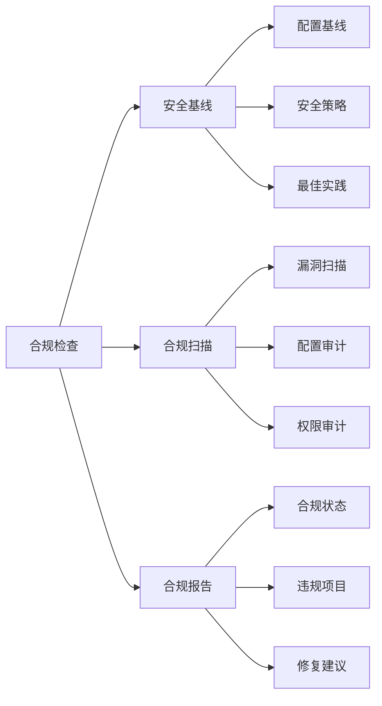

合规检查示例：
```javascript

// 1. 合规检查管理器
class ComplianceManager {
    async performComplianceCheck() {
        // 检查安全基线
        const baselineResults = await this.checkSecurityBaseline();
        
        // 执行合规扫描
        const scanResults = await this.performComplianceScan();
        
        // 生成合规报告
        return await this.generateComplianceReport({
            baseline: baselineResults,
            scan: scanResults
        });
    }
    
    async checkSecurityBaseline() {
        const baseline = {
            authentication: await this.checkAuthenticationCompliance(),
            encryption: await this.checkEncryptionCompliance(),
            access: await this.checkAccessControlCompliance(),
            audit: await this.checkAuditingCompliance()
        };
        
        return {
            results: baseline,
            score: this.calculateComplianceScore(baseline),
            violations: this.identifyViolations(baseline)
        };
    }
    
    async performComplianceScan() {
        // 执行漏洞扫描
        const vulnerabilities = await this.scanVulnerabilities();
        
        // 执行配置审计
        const configAudit = await this.auditConfigurations();
        
        // 执行权限审计
        const permissionAudit = await this.auditPermissions();
        
        return {
            vulnerabilities,
            configAudit,
            permissionAudit,
            timestamp: new Date()
        };
    }
}

// 2. 安全基线检查器
class SecurityBaselineChecker {
    async checkBaseline() {
        const checks = [
            // 认证检查
            {
                name: 'authentication',
                check: this.checkAuthenticationSettings
            },
            // 加密检查
            {
                name: 'encryption',
                check: this.checkEncryptionSettings
            },
            // 访问控制检查
            {
                name: 'accessControl',
                check: this.checkAccessControlSettings
            },
            // 审计检查
            {
                name: 'auditing',
                check: this.checkAuditingSettings
            }
        ];
        
        const results = {};
        
        for (const check of checks) {
            results[check.name] = await check.check();
        }
        
        return {
            results,
            passed: this.evaluateResults(results),
            recommendations: this.generateRecommendations(results)
        };
    }
    
    async checkAuthenticationSettings() {
        return {
            passwordPolicy: await this.checkPasswordPolicy(),
            authMechanism: await this.checkAuthMechanism(),
            sessionSecurity: await this.checkSessionSecurity()
        };
    }
}

// 3. 合规报告生成器
class ComplianceReportGenerator {
    async generateReport(checkResults) {
        // 汇总合规结果
        const summary = this.summarizeResults(checkResults);
        
        // 分析违规项
        const violations = this.analyzeViolations(checkResults);
        
        // 生成修复建议
        const recommendations = 
            this.generateRecommendations(violations);
        
        return {
            summary,
            violations,
            recommendations,
            details: this.generateDetailedReport(checkResults),
            timestamp: new Date()
        };
    }
    
    summarizeResults(results) {
        return {
            totalChecks: results.length,
            passedChecks: results.filter(r => r.passed).length,
            failedChecks: results.filter(r => !r.passed).length,
            complianceScore: this.calculateComplianceScore(results),
            riskLevel: this.assessRiskLevel(results)
        };
    }
}
```

## 4. 数据加密

### 4.1 传输加密

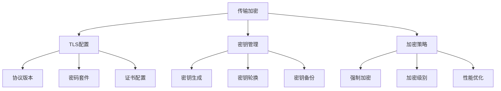

传输加密示例：
```javascript
// 1. 传输加密管理器
class TransportEncryptionManager {
    async configureTransportEncryption(config) {
        // 配置TLS
        await this.configureTLS(config.tls);
        
        // 配置密钥管理
        await this.configureKeyManagement(config.keyManagement);
        
        // 配置加密策略
        await this.configureEncryptionPolicy(config.policy);
        
        return await this.verifyEncryptionConfig();
    }
    
    async configureTLS(tlsConfig) {
        return await db.adminCommand({
            setParameter: 1,
            net: {
                tls: {
                    mode: "requireTLS",
                    certificateKeyFile: tlsConfig.certKeyFile,
                    CAFile: tlsConfig.caFile,
                    cipherConfig: tlsConfig.ciphers.join(':'),
                    disabledProtocols: ['TLS1_0', 'TLS1_1'],
                    allowConnectionsWithoutCertificates: false,
                    FIPSMode: true
                }
            }
        });
    }
    
    async configureKeyManagement(keyConfig) {
        // 设置密钥轮换策略
        await this.setKeyRotationPolicy(keyConfig.rotation);
        
        // 配置密钥备份
        await this.configureKeyBackup(keyConfig.backup);
        
        // 设置密钥恢复流程
        await this.setupKeyRecovery(keyConfig.recovery);
    }
}

// 2. 密钥管理器
class KeyManager {
    async manageKeys() {
        // 生成新密钥
        const newKey = await this.generateKey();
        
        // 备份密钥
        await this.backupKey(newKey);
        
        // 分发密钥
        await this.distributeKey(newKey);
        
        // 验证密钥部署
        return await this.verifyKeyDeployment(newKey);
    }
    
    async rotateKeys() {
        // 检查密钥年龄
        const keysToRotate = await this.checkKeyAge();
        
        for (const key of keysToRotate) {
            // 生成新密钥
            const newKey = await this.generateKey();
            
            // 更新使用旧密钥的连接
            await this.updateConnections(key, newKey);
            
            // 归档旧密钥
            await this.archiveKey(key);
        }
    }
    
    async backupKeys() {
        const keys = await this.getAllKeys();
        
        // 加密密钥备份
        const encryptedBackup = await this.encryptKeys(keys);
        
        // 存储加密备份
        await this.storeKeyBackup(encryptedBackup);
        
        // 验证备份
        return await this.verifyKeyBackup(encryptedBackup);
    }
}

// 3. 加密策略执行器
class EncryptionPolicyEnforcer {
    async enforcePolicy(policy) {
        // 验证加密要求
        await this.validateEncryptionRequirements(policy);
        
        // 应用加密策略
        await this.applyEncryptionPolicy(policy);
        
        // 监控加密合规性
        return await this.monitorEncryptionCompliance(policy);
    }
    
    async validateEncryptionRequirements(policy) {
        const requirements = [
            this.checkProtocolVersions(policy.minProtocolVersion),
            this.checkCipherStrength(policy.minCipherStrength),
            this.checkKeyLength(policy.minKeyLength),
            this.checkCertificateValidity()
        ];
        
        const validationResults = await Promise.all(requirements);
        
        if (validationResults.some(result => !result.passed)) {
            throw new Error('Encryption requirements not met');
        }
    }
    
    async optimizeEncryptionPerformance() {
        // 分析当前性能
        const perfMetrics = await this.analyzeEncryptionPerformance();
        
        // 优化加密配置
        const optimizations = this.calculateOptimizations(perfMetrics);
        
        // 应用优化
        await this.applyOptimizations(optimizations);
        
        // 验证性能改进
        return await this.verifyPerformanceImprovements();
    }
}
```

### 4.2 存储加密

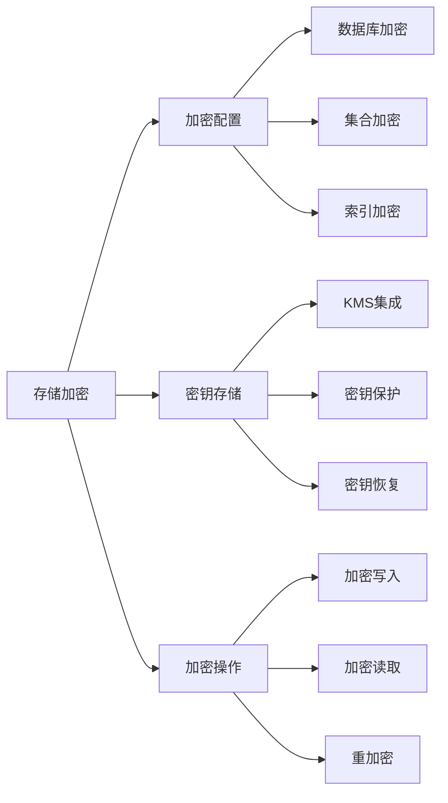

存储加密示例：
```javascript


// 1. 存储加密管理器
class StorageEncryptionManager {
    async configureStorageEncryption(config) {
        // 配置数据库加密
        await this.configureDatabaseEncryption(config.database);
        
        // 配置密钥存储
        await this.configureKeyStorage(config.keyStorage);
        
        // 配置加密操作
        await this.configureEncryptionOperations(config.operations);
        
        return await this.verifyEncryptionSetup();
    }
    
    async configureDatabaseEncryption(dbConfig) {
        return await db.adminCommand({
            setParameter: 1,
            storage: {
                engine: 'wiredTiger',
                wiredTiger: {
                    engineConfig: {
                        encryptionCipherMode: dbConfig.cipherMode,
                        encryptionKeyIdentifier: dbConfig.keyId,
                        encryptionKeyRotationInterval: 
                            dbConfig.rotationInterval
                    }
                }
            }
        });
    }
    
    async reEncryptDatabase(options) {
        // 创建备份
        const backup = await this.createBackup();
        
        try {
            // 执行重加密
            await this.performReEncryption(options);
            
            // 验证重加密结果
            await this.verifyReEncryption();
            
        } catch (error) {
            // 回滚到备份
            await this.rollbackToBackup(backup);
            throw error;
        }
    }
}

// 2. KMS集成管理器
class KMSIntegrationManager {
    async configureKMS(config) {
        // 配置KMS连接
        await this.configureKMSConnection(config.connection);
        
        // 设置密钥策略
        await this.configureKeyPolicies(config.policies);
        
        // 配置自动化操作
        await this.configureAutomation(config.automation);
    }
    
    async rotateKMSKeys() {
        // 获取需要轮换的密钥
        const keysToRotate = await this.getKeysForRotation();
        
        for (const key of keysToRotate) {
            // 在KMS中创建新密钥
            const newKey = await this.createNewKMSKey();
            
            // 使用新密钥重新加密数据
            await this.reEncryptWithNewKey(key, newKey);
            
            // 更新密钥引用
            await this.updateKeyReferences(key, newKey);
            
            // 归档旧密钥
            await this.archiveKMSKey(key);
        }
    }
}

// 3. 加密操作管理器
class EncryptionOperationsManager {
    async performEncryptedWrite(data, options) {
        // 获取加密密钥
        const key = await this.getEncryptionKey();
        
        // 加密数据
        const encryptedData = await this.encryptData(data, key);
        
        // 写入加密数据
        await this.writeEncryptedData(encryptedData);
        
        // 验证写入
        return await this.verifyEncryptedWrite();
    }
    
    async performEncryptedRead(query) {
        // 读取加密数据
        const encryptedData = await this.readEncryptedData(query);
        
        // 获取解密密钥
        const key = await this.getDecryptionKey();
        
        // 解密数据
        const decryptedData = await this.decryptData(
            encryptedData, 
            key
        );
        
        // 验证解密
        return await this.verifyDecryptedData(decryptedData);
    }
}
```

### 4.3 字段级加密


### 4.3 字段级加密

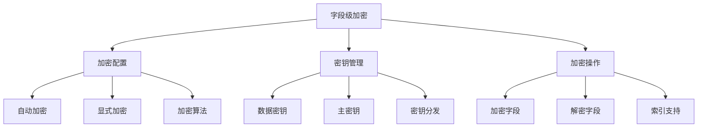

字段级加密示例：
```javascript

// 1. 字段级加密管理器
class FieldLevelEncryptionManager {
    async configureFieldEncryption(config) {
        // 配置加密选项
        await this.configureEncryptionOptions(config.options);
        
        // 设置密钥管理
        await this.configureKeyManagement(config.keys);
        
        // 配置加密规则
        await this.configureEncryptionRules(config.rules);
        
        return await this.verifyConfiguration();
    }
    
    async configureEncryptionOptions(options) {
        return await db.adminCommand({
            setParameter: 1,
            autoEncryption: {
                keyVaultNamespace: options.keyVaultNamespace,
                kmsProviders: options.kmsProviders,
                schemaMap: options.schemaMap,
                bypassAutoEncryption: false,
                bypassQueryAnalysis: false
            }
        });
    }
    
    async createEncryptedCollection(collectionInfo) {
        const schema = this.buildEncryptionSchema(
            collectionInfo.fields
        );
        
        return await db.createCollection(
            collectionInfo.name,
            {
                validator: {
                    $jsonSchema: schema
                },
                encryptedFields: {
                    fields: collectionInfo.encryptedFields
                }
            }
        );
    }
}

// 2. 加密字段配置器
class EncryptedFieldConfigurator {
    buildEncryptionSchema(fields) {
        return {
            bsonType: "object",
            encryptMetadata: {
                algorithm: "AEAD_AES_256_CBC_HMAC_SHA_512_Random"
            },
            properties: this.buildFieldProperties(fields)
        };
    }
    
    buildFieldProperties(fields) {
        const properties = {};
        
        for (const field of fields) {
            properties[field.name] = {
                bsonType: field.type,
                encrypt: {
                    bsonType: field.type,
                    algorithm: field.algorithm || 
                        "AEAD_AES_256_CBC_HMAC_SHA_512_Random",
                    keyId: field.keyId
                }
            };
        }
        
        return properties;
    }
    
    async validateEncryptedFields(collection, fields) {
        // 验证字段配置
        const validationResults = await Promise.all(
            fields.map(field => 
                this.validateFieldConfiguration(collection, field)
            )
        );
        
        // 检查索引兼容性
        await this.checkIndexCompatibility(collection, fields);
        
        return validationResults;
    }
}

// 3. 加密操作执行器
class EncryptionOperationExecutor {
    async encryptField(value, fieldConfig) {
        // 获取加密密钥
        const key = await this.getEncryptionKey(fieldConfig.keyId);
        
        // 执行加密
        const encryptedValue = await this.performEncryption(
            value,
            key,
            fieldConfig.algorithm
        );
        
        // 验证加密结果
        await this.verifyEncryption(value, encryptedValue, key);
        
        return encryptedValue;
    }
    
    async performBulkEncryption(documents, schema) {
        const encryptedDocs = [];
        
        for (const doc of documents) {
            const encryptedDoc = {};
            
            for (const [field, value] of Object.entries(doc)) {
                if (schema.properties[field]?.encrypt) {
                    encryptedDoc[field] = await this.encryptField(
                        value,
                        schema.properties[field].encrypt
                    );
                } else {
                    encryptedDoc[field] = value;
                }
            }
            
            encryptedDocs.push(encryptedDoc);
        }
        
        return encryptedDocs;
    }
    
    async createEncryptedIndex(collection, field, options) {
        // 验证字段加密配置
        await this.validateFieldForIndexing(collection, field);
        
        // 创建加密索引
        const indexOptions = {
            ...options,
            encryptedFields: {
                keyId: options.keyId,
                algorithm: options.algorithm,
                type: options.type
            }
        };
        
        return await collection.createIndex(
            { [field]: 1 },
            indexOptions
        );
    }
}

// 4. 安全审计器
class SecurityAuditor {
    async auditEncryptionConfiguration() {
        return {
            fieldEncryption: await this.auditFieldEncryption(),
            keyManagement: await this.auditKeyManagement(),
            accessControl: await this.auditAccessControl()
        };
    }
    
    async auditFieldEncryption() {
        const collections = await this.getEncryptedCollections();
        const auditResults = [];
        
        for (const collection of collections) {
            auditResults.push({
                collection: collection.name,
                encryptedFields: await this.getEncryptedFields(
                    collection
                ),
                schemaValidation: await this.validateSchema(
                    collection
                ),
                indexConfiguration: await this.checkIndexes(
                    collection
                )
            });
        }
        
        return {
            results: auditResults,
            recommendations: this.generateRecommendations(
                auditResults
            )
        };
    }
}
```

## 总结

MongoDB安全管理的关键点：

1. **认证与授权**
   - 完善的认证机制配置
   - 细粒度的用户权限管理
   - 灵活的角色管理系统

2. **访问控制**
   - 严格的网络安全配置
   - 完整的防火墙规则
   - 安全的SSL/TLS配置

3. **审计与合规**
   - 全面的审计日志配置
   - 系统化的日志管理
   - 规范的合规检查流程

4. **数据加密**
   - 可靠的传输加密机制
   - 安全的存储加密方案
   - 灵活的字段级加密支持

最佳实践建议：

1. **定期安全审计**
   - 执行常规安全检查
   - 更新安全配置
   - 跟踪安全事件

2. **持续监控**
   - 监控异常活动
   - 跟踪性能影响
   - 及时响应问题

3. **文档维护**
   - 保持配置文档更新
   - 记录变更历史
   - 维护操作手册

4. **培训和更新**
   - 定期安全培训
   - 更新安全知识
   - 跟踪最新威胁

通过实施这些安全措施，可以显著提高MongoDB数据库的安全性，降低安全风险，确保数据的机密性、完整性和可用性。
```

