# MongoDB 分片机制详解

## 目录
- [1. 分片基础概念](#1-分片基础概念)
  - [1.1 为什么需要分片](#11-为什么需要分片)
  - [1.2 分片集群架构](#12-分片集群架构)
  - [1.3 核心组件介绍](#13-核心组件介绍)
- [2. 分片策略详解](#2-分片策略详解)
  - [2.1 范围分片](#21-范围分片)
  - [2.2 哈希分片](#22-哈希分片)
  - [2.3 区域分片](#23-区域分片)
- [3. 数据分布与均衡](#3-数据分布与均衡)
  - [3.1 数据块(Chunk)管理](#31-数据块chunk管理)
  - [3.2 均衡器工作机制](#32-均衡器工作机制)
  - [3.3 数据迁移流程](#33-数据迁移流程)
- [4. 分片集群部署](#4-分片集群部署)
  - [4.1 集群搭建步骤](#41-集群搭建步骤)
  - [4.2 分片配置管理](#42-分片配置管理)
  - [4.3 监控与维护](#43-监控与维护)
- [5. 性能优化与最佳实践](#5-性能优化与最佳实践)
  - [5.1 分片键选择](#51-分片键选择)
  - [5.2 查询优化](#52-查询优化)
  - [5.3 运维建议](#53-运维建议)

---

## 1. 分片基础概念

### 1.1 为什么需要分片

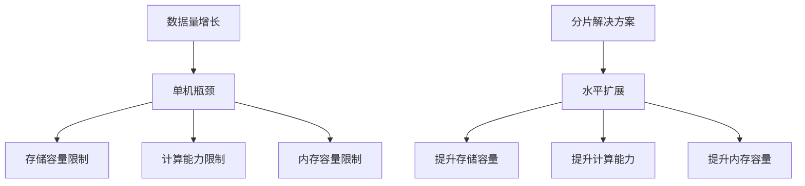

### 1.2 分片集群架构

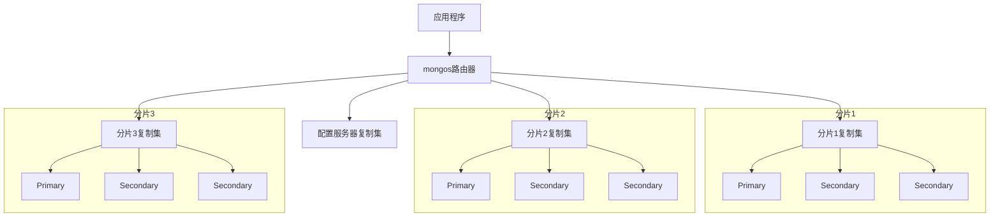

### 1.3 核心组件介绍

1. **mongos路由器**
```javascript
// 连接mongos
mongo "mongodb://mongos1.example.net:27017,mongos2.example.net:27017"

// 查看分片状态
sh.status()
```

2. **配置服务器**
```javascript
// 初始化配置服务器复制集
rs.initiate({
  _id: "configReplSet",
  configsvr: true,
  members: [
    { _id: 0, host: "config1.example.net:27017" },
    { _id: 1, host: "config2.example.net:27017" },
    { _id: 2, host: "config3.example.net:27017" }
  ]
})
```

3. **分片服务器**
```javascript
// 添加分片
sh.addShard("rs1/shard1.example.net:27017")
sh.addShard("rs2/shard2.example.net:27017")
sh.addShard("rs3/shard3.example.net:27017")
```

## 2. 分片策略详解

### 2.1 范围分片

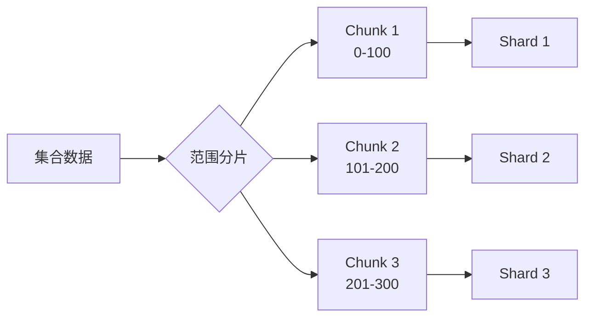

范围分片配置：
```javascript
// 开启分片
sh.enableSharding("mydb")

// 创建索引
db.users.createIndex({ age: 1 })

// 对集合进行范围分片
sh.shardCollection(
    "mydb.users",
    { age: 1 }  // 按age字段范围分片
)

// 查看分片状态
db.users.getShardDistribution()
```

### 2.2 哈希分片

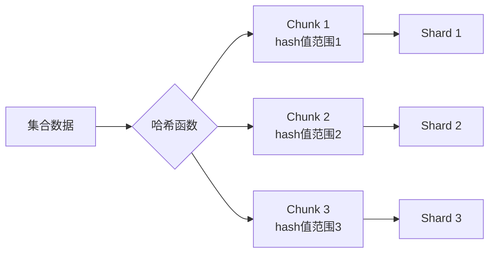

哈希分片配置：
```javascript
// 创建哈希索引
db.users.createIndex({ userId: "hashed" })

// 配置哈希分片
sh.shardCollection(
    "mydb.users",
    { userId: "hashed" }
)

// 查看chunk分布
db.users.getShardDistribution()
```

### 2.3 区域分片

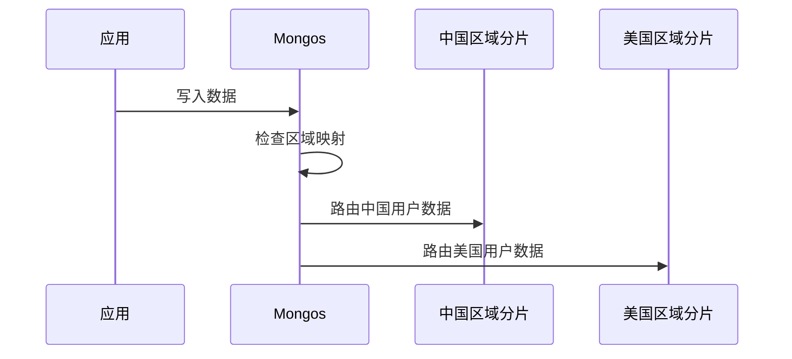

区域分片配置：
```javascript
// 添加区域
sh.addShardToZone("rs1", "CN")
sh.addShardToZone("rs2", "US")

// 配置区域范围
sh.updateZoneKeyRange(
    "mydb.users",
    { country: "CN" },
    { country: "CN" },
    "CN"
)

sh.updateZoneKeyRange(
    "mydb.users",
    { country: "US" },
    { country: "US" },
    "US"
)
```

## 3. 数据分布与均衡

### 3.1 数据块(Chunk)管理

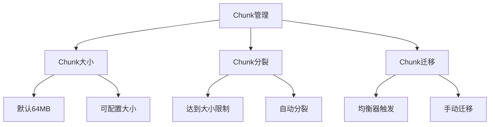

Chunk配置与管理：
```javascript
// 修改chunk大小（默认64MB）
use config
db.settings.updateOne(
    { _id: "chunksize" },
    { $set: { value: 128 } },  // 设置为128MB
    { upsert: true }
)

// 查看chunk分布
db.chunks.find().pretty()

// 查看chunk详细信息
sh.status(true)

// 手动分割chunk
sh.splitFind("mydb.users", { age: 25 })
sh.splitAt("mydb.users", { age: 25 })
```

### 3.2 均衡器工作机制

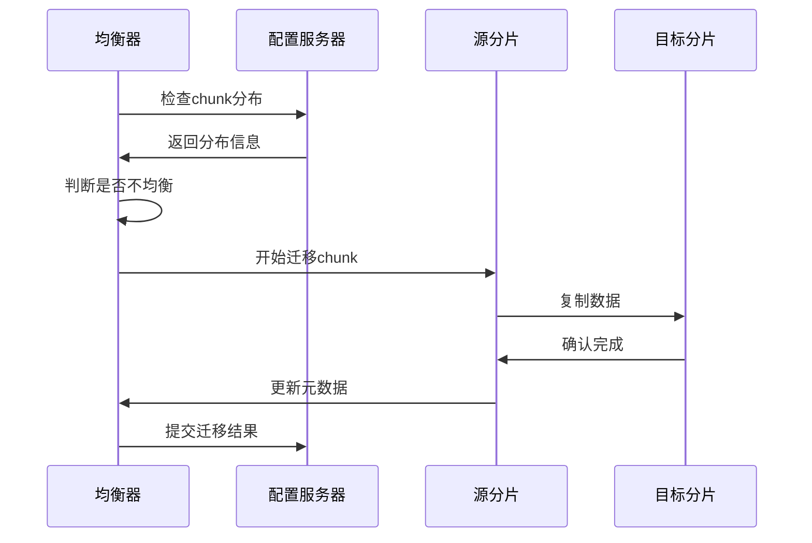

均衡器配置：
```javascript
// 查看均衡器状态
sh.getBalancerState()

// 启用/禁用均衡器
sh.setBalancerState(true/false)

// 配置均衡器时间窗口
db.settings.updateOne(
    { _id: "balancer" },
    {
        $set: {
            activeWindow: {
                start: "23:00",
                stop: "06:00"
            }
        }
    },
    { upsert: true }
)

// 查看均衡器统计
db.getSiblingDB("config").actionlog.find({what: "balancer"})
```

### 3.3 数据迁移流程

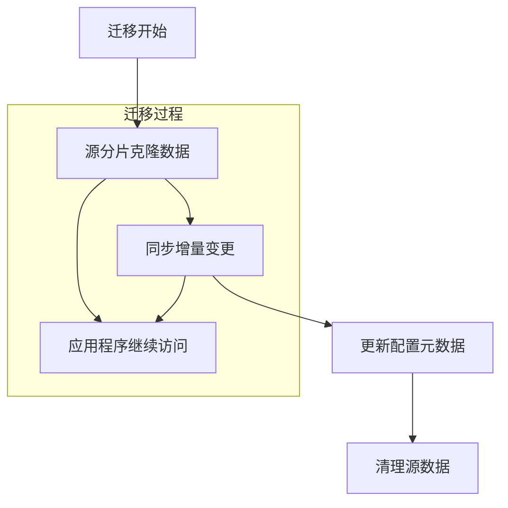

迁移监控与管理：
```javascript
// 查看当前迁移状态
db.adminCommand({ balancerStatus: 1 })

// 查看迁移详情
db.getSiblingDB("config").changelog.find({
    what: "moveChunk.from",
    time: {
        $gte: new Date(Date.now() - 24 * 60 * 60 * 1000)
    }
}).pretty()

// 手动迁移chunk
sh.moveChunk(
    "mydb.users",
    { age: 25 },
    "shard2"
)
```

## 4. 分片集群部署

### 4.1 集群搭建步骤

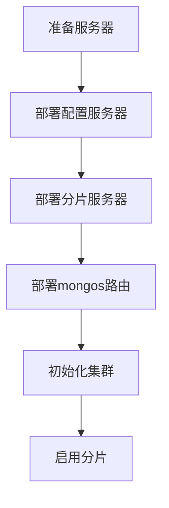

部署配置示例：
```javascript
// 1. 配置服务器复制集
rs.initiate({
    _id: "configReplSet",
    configsvr: true,
    members: [
        { _id: 0, host: "config1:27019" },
        { _id: 1, host: "config2:27019" },
        { _id: 2, host: "config3:27019" }
    ]
})

// 2. 分片服务器复制集
rs.initiate({
    _id: "shard1ReplSet",
    members: [
        { _id: 0, host: "shard1-1:27018" },
        { _id: 1, host: "shard1-2:27018" },
        { _id: 2, host: "shard1-3:27018" }
    ]
})

// 3. 启动mongos
mongos --configdb configReplSet/config1:27019,config2:27019,config3:27019 --bind_ip_all

// 4. 添加分片
sh.addShard("shard1ReplSet/shard1-1:27018")
sh.addShard("shard2ReplSet/shard2-1:27018")
```

### 4.2 分片配置管理


配置管理命令：
```javascript
// 启用数据库分片
sh.enableSharding("mydb")

// 创建索引
db.users.createIndex({ userId: 1 })

// 配置集合分片
sh.shardCollection(
    "mydb.users",
    { userId: 1 },
    false,  // 是否使用unique索引
    { numInitialChunks: 4 }  // 初始chunk数量
)

// 配置区域
sh.addShardToZone("shard1", "zone1")
sh.updateZoneKeyRange(
    "mydb.users",
    { userId: MinKey },
    { userId: 100 },
    "zone1"
)
```

### 4.3 监控与维护

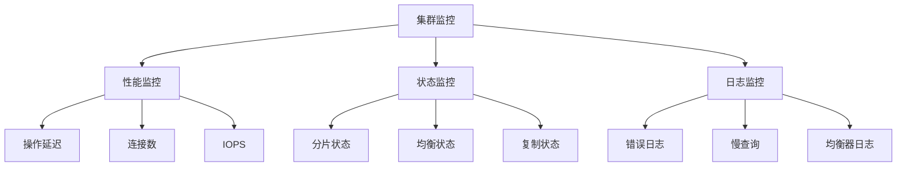

监控命令示例：
```javascript
// 查看分片状态
sh.status()

// 查看集群统计
db.adminCommand({ listShards: 1 })

// 查看分片分布
db.users.getShardDistribution()

// 查看均衡器日志
db.getSiblingDB("config").changelog.find().pretty()

// 设置慢查询监控
db.setProfilingLevel(1, { slowms: 100 })
```

## 5. 性能优化与最佳实践

### 5.1 分片键选择

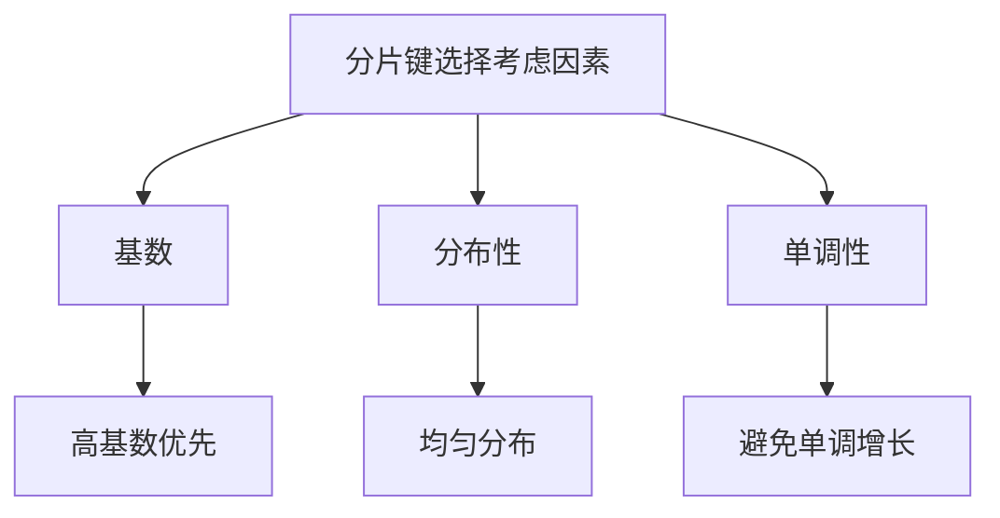

分片键最佳实践：
```javascript
// 复合分片键示例
sh.shardCollection(
    "mydb.orders",
    { userId: 1, orderDate: 1 }
)

// 哈希分片键示例
sh.shardCollection(
    "mydb.logs",
    { timestamp: "hashed" }
)
```

### 5.2 查询优化

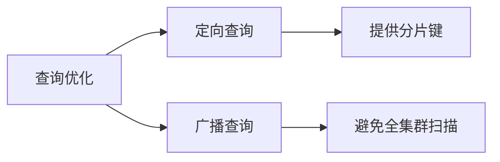

查询优化示例：
```javascript
// 定向查询（推荐）
db.users.find({ userId: 12345 })

// 避免的查询模式
db.users.find({ name: "John" })  // 可能导致广播查询

// 使用explain分析查询
db.users.find({ userId: 12345 }).explain("executionStats")

// 创建支持查询的索引
db.users.createIndex({ userId: 1, name: 1 })
```

### 5.3 运维建议

1. **容量规划**
```javascript
// 监控分片大小
db.users.stats()

// 监控分片使用率
sh.status(true)
```

2. **性能监控**
```javascript
// 监控操作延迟
db.serverStatus().opcounters

// 监控连接数
db.serverStatus().connections

// 监控网络流量
db.serverStatus().network
```

3. **最佳实践清单**
- 选择合适的分片键
- 预分片大集合
- 控制chunk大小
- 合理配置均衡器
- 定期监控和维护
- 做好容量规划
- 建立备份机制

4. **故障处理**
```javascript
// 检查分片健康状态
sh.status()

// 修复不一致的chunk
db.adminCommand({ checkShardingIndex: "mydb.users" })

// 重新平衡数据
sh.balancerStart()
```

## 6. 总结

MongoDB分片集群通过以下机制实现水平扩展：

1. **架构设计**
   - 分片服务器存储数据
   - 配置服务器管理元数据
   - mongos路由请求

2. **数据分布**
   - 灵活的分片策略
   - 自动数据均衡
   - chunk管理机制

3. **性能保障**
   - 并行处理能力
   - 就近读写优化
   - 负载均衡

4. **运维管理**
   - 完善的监控体系
   - 灵活的配置调整
   - 可靠的容错机制
```


