# MongoDB 故障处理指南

## 目录
- [1. 故障诊断流程](#1-故障诊断流程)
  - [1.1 问题识别](#11-问题识别)
  - [1.2 日志分析](#12-日志分析)
  - [1.3 监控分析](#13-监控分析)
- [2. 常见故障处理](#2-常见故障处理)
  - [2.1 连接故障](#21-连接故障)
  - [2.2 性能故障](#22-性能故障)
  - [2.3 复制故障](#23-复制故障)
  - [2.4 分片故障](#24-分片故障)
- [3. 数据修复](#3-数据修复)
  - [3.1 数据一致性](#31-数据一致性)
  - [3.2 索引修复](#32-索引修复)
  - [3.3 数据恢复](#33-数据恢复)
- [4. 性能诊断](#4-性能诊断)
  - [4.1 慢查询分析](#41-慢查询分析)
  - [4.2 资源瓶颈](#42-资源瓶颈)
  - [4.3 性能优化](#43-性能优化)

## 1. 故障诊断流程

### 1.1 问题识别

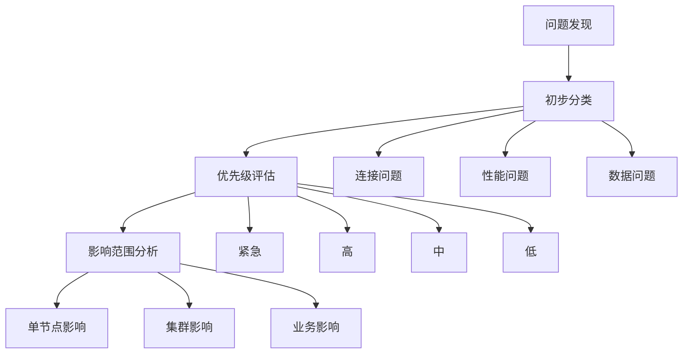

问题识别示例：
```javascript
// 1. 问题识别类
class ProblemIdentifier {
    async identifyProblem() {
        // 收集基础信息
        const basicInfo = await this.gatherBasicInfo();
        
        // 问题分类
        const category = this.categorizeIssue(basicInfo);
        
        // 评估优先级
        const priority = this.assessPriority(category, basicInfo);
        
        return {
            category,
            priority,
            impact: this.assessImpact(basicInfo),
            initialDiagnosis: this.getInitialDiagnosis(category)
        };
    }
    
    async gatherBasicInfo() {
        return {
            // 服务器状态
            serverStatus: await db.serverStatus(),
            
            // 复制集状态
            rsStatus: await rs.status(),
            
            // 系统资源
            hostInfo: await db.hostInfo(),
            
            // 最近错误日志
            logs: await this.getRecentLogs(),
            
            // 当前连接信息
            connectionStatus: await db.currentOp()
        };
    }
    
    categorizeIssue(info) {
        // 分析症状确定类别
        if (this.hasConnectivitySymptoms(info)) {
            return 'connectivity';
        }
        if (this.hasPerformanceSymptoms(info)) {
            return 'performance';
        }
        if (this.hasDataSymptoms(info)) {
            return 'data';
        }
        if (this.hasReplicationSymptoms(info)) {
            return 'replication';
        }
        return 'unknown';
    }
}

// 2. 诊断工具集
const diagnosticTools = {
    // 连接测试
    async testConnectivity(host, port) {
        try {
            await MongoClient.connect(
                `mongodb://${host}:${port}`,
                { serverSelectionTimeoutMS: 5000 }
            );
            return true;
        } catch (error) {
            return {
                success: false,
                error: error.message
            };
        }
    },
    
    // 资源检查
    async checkResources() {
        const serverStatus = await db.serverStatus();
        return {
            connections: serverStatus.connections,
            memory: serverStatus.mem,
            cpu: serverStatus.extra_info.page_faults,
            storage: await db.stats()
        };
    },
    
    // 日志分析
    async analyzeLogs(timeRange) {
        const logs = await db.getLog("global");
        return logs
            .filter(log => this.isInTimeRange(log.time, timeRange))
            .map(log => this.parseLogEntry(log));
    }
};

// 3. 问题报告生成器
class ProblemReportGenerator {
    generateReport(problem) {
        return {
            timestamp: new Date(),
            problemId: this.generateProblemId(),
            category: problem.category,
            priority: problem.priority,
            symptoms: this.describeSymptoms(problem),
            initialDiagnosis: problem.initialDiagnosis,
            recommendedActions: this.getRecommendedActions(problem)
        };
    }
    
    describeSymptoms(problem) {
        const symptoms = [];
        
        if (problem.connectivity) {
            symptoms.push({
                type: 'connectivity',
                details: problem.connectivity
            });
        }
        
        if (problem.performance) {
            symptoms.push({
                type: 'performance',
                metrics: problem.performance
            });
        }
        
        return symptoms;
    }
}
```

### 1.2 日志分析

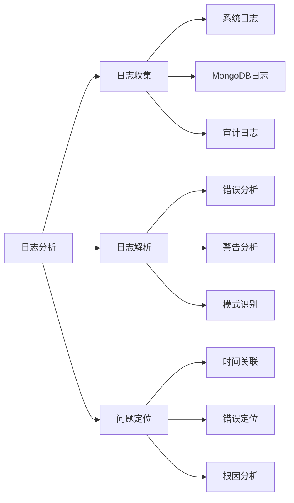


### 1.3 监控分析

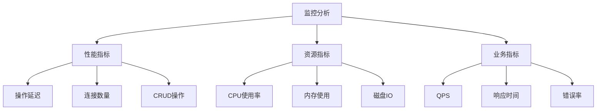

监控分析示例：
```javascript


// 1. 监控分析器
class MonitoringAnalyzer {
    async analyzeMetrics(timeRange) {
        // 收集监控数据
        const metrics = await this.collectMetrics(timeRange);
        
        // 分析性能指标
        const performanceAnalysis = 
            await this.analyzePerformance(metrics);
        
        // 分析资源使用
        const resourceAnalysis = 
            await this.analyzeResources(metrics);
        
        // 分析业务指标
        const businessAnalysis = 
            await this.analyzeBusiness(metrics);
        
        return {
            performance: performanceAnalysis,
            resources: resourceAnalysis,
            business: businessAnalysis,
            anomalies: this.detectAnomalies(metrics)
        };
    }
    
    async collectMetrics(timeRange) {
        return {
            // 服务器状态指标
            serverStatus: await db.serverStatus(),
            
            // 操作统计
            operationStats: await db.collection('system.profile')
                .find({
                    ts: { 
                        $gte: timeRange.start,
                        $lte: timeRange.end
                    }
                }).toArray(),
            
            // 资源使用统计
            resourceStats: await this.getResourceStats(timeRange)
        };
    }
    
    detectAnomalies(metrics) {
        const anomalies = [];
        
        // 检查延迟异常
        if (this.hasLatencyAnomaly(metrics.performance)) {
            anomalies.push({
                type: 'latency',
                details: this.getLatencyDetails(metrics)
            });
        }
        
        // 检查资源异常
        if (this.hasResourceAnomaly(metrics.resources)) {
            anomalies.push({
                type: 'resource',
                details: this.getResourceDetails(metrics)
            });
        }
        
        return anomalies;
    }
}

// 2. 性能指标分析
class PerformanceAnalyzer {
    async analyzePerformance(metrics) {
        return {
            // 操作延迟分析
            latency: this.analyzeLatency(metrics),
            
            // 连接状况分析
            connections: this.analyzeConnections(metrics),
            
            // CRUD操作分析
            operations: this.analyzeOperations(metrics)
        };
    }
    
    analyzeLatency(metrics) {
        const latencyStats = {
            read: this.calculateLatencyStats(
                metrics.filter(m => m.op === 'query')
            ),
            write: this.calculateLatencyStats(
                metrics.filter(m => 
                    ['insert', 'update', 'delete']
                        .includes(m.op)
                )
            )
        };
        
        return {
            stats: latencyStats,
            trends: this.analyzeLatencyTrends(metrics),
            anomalies: this.detectLatencyAnomalies(metrics)
        };
    }
}

// 3. 资源监控分析
class ResourceAnalyzer {
    async analyzeResources(metrics) {
        // CPU分析
        const cpuAnalysis = this.analyzeCPU(metrics);
        
        // 内存分析
        const memoryAnalysis = this.analyzeMemory(metrics);
        
        // IO分析
        const ioAnalysis = this.analyzeIO(metrics);
        
        return {
            cpu: cpuAnalysis,
            memory: memoryAnalysis,
            io: ioAnalysis,
            bottlenecks: this.identifyBottlenecks({
                cpu: cpuAnalysis,
                memory: memoryAnalysis,
                io: ioAnalysis
            })
        };
    }
    
    identifyBottlenecks(analyses) {
        const bottlenecks = [];
        
        // CPU瓶颈检查
        if (analyses.cpu.utilization > 80) {
            bottlenecks.push({
                type: 'CPU',
                severity: 'high',
                details: analyses.cpu
            });
        }
        
        // 内存瓶颈检查
        if (analyses.memory.usage > 90) {
            bottlenecks.push({
                type: 'Memory',
                severity: 'critical',
                details: analyses.memory
            });
        }
        
        return bottlenecks;
    }
}
```

## 2. 常见故障处理

### 2.1 连接故障

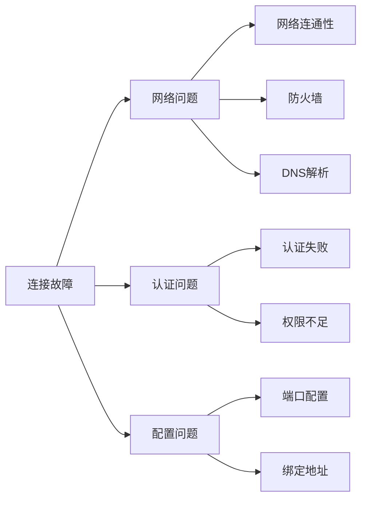

连接故障处理示例：
```javascript

// 1. 连接故障诊断器
class ConnectionTroubleshooter {
    async diagnose(connectionInfo) {
        // 网络连通性测试
        const networkCheck = await this.checkNetwork(
            connectionInfo.host,
            connectionInfo.port
        );
        
        // 认证测试
        const authCheck = await this.checkAuthentication(
            connectionInfo.credentials
        );
        
        // 配置检查
        const configCheck = await this.checkConfiguration();
        
        return {
            network: networkCheck,
            auth: authCheck,
            config: configCheck,
            recommendations: this.generateRecommendations({
                networkCheck,
                authCheck,
                configCheck
            })
        };
    }
    
    async checkNetwork(host, port) {
        try {
            // 检查DNS解析
            const dnsCheck = await dns.resolve(host);
            
            // 检查端口可达性
            const portCheck = await this.checkPort(host, port);
            
            // 检查防火墙规则
            const firewallCheck = await this.checkFirewall(host, port);
            
            return {
                dns: dnsCheck,
                port: portCheck,
                firewall: firewallCheck
            };
        } catch (error) {
            return {
                success: false,
                error: error.message
            };
        }
    }
    
    generateRecommendations(checks) {
        const recommendations = [];
        
        if (!checks.networkCheck.dns) {
            recommendations.push({
                type: 'DNS',
                action: '检查DNS配置和解析',
                priority: 'high'
            });
        }
        
        if (!checks.networkCheck.port) {
            recommendations.push({
                type: 'Port',
                action: '检查端口配置和防火墙规则',
                priority: 'high'
            });
        }
        
        return recommendations;
    }
}

// 2. 认证问题处理器
class AuthenticationHandler {
    async handleAuthIssue(authError) {
        // 分析认证错误
        const errorAnalysis = this.analyzeAuthError(authError);
        
        // 检查用户权限
        const permissionCheck = 
            await this.checkPermissions(authError.user);
        
        // 生成解决方案
        return this.generateSolution(errorAnalysis, permissionCheck);
    }
    
    analyzeAuthError(error) {
        const errorPatterns = {
            'Authentication failed': '认证失败',
            'not authorized': '权限不足',
            'SCRAM-SHA-1 authentication failed': 'SCRAM认证失败'
        };
        
        for (const [pattern, type] of Object.entries(errorPatterns)) {
            if (error.message.includes(pattern)) {
                return {
                    type,
                    details: error.message,
                    recommendation: this.getRecommendation(type)
                };
            }
        }
    }
}

// 3. 配置问题修复器
class ConfigurationFixer {
    async fixConfiguration(issues) {
        // 备份当前配置
        await this.backupConfig();
        
        try {
            // 修复绑定地址
            if (issues.bindIp) {
                await this.fixBindIp();
            }
            
            // 修复端口配置
            if (issues.port) {
                await this.fixPort();
            }
            
            // 重启服务
            await this.restartService();
            
            // 验证修复
            return await this.validateFix();
            
        } catch (error) {
            // 回滚配置
            await this.rollbackConfig();
            throw error;
        }
    }
}
```

### 2.2 性能故障

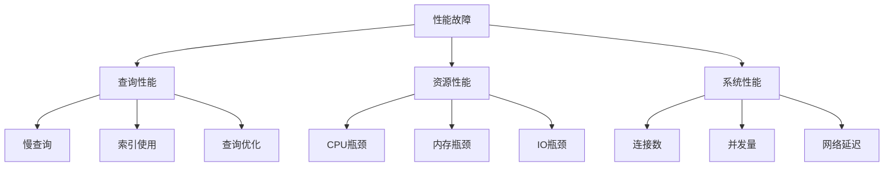

性能故障处理示例：
```javascript
// 1. 性能故障诊断器
class PerformanceTroubleshooter {
    async diagnose() {
        // 收集性能数据
        const performanceData = await this.collectPerformanceData();
        
        // 分析性能问题
        const analysis = await this.analyzePerformanceIssues(
            performanceData
        );
        
        // 生成优化建议
        return this.generateOptimizationPlan(analysis);
    }
    
    async collectPerformanceData() {
        return {
            // 查询性能数据
            queryPerformance: await this.getQueryPerformance(),
            
            // 资源使用数据
            resourceUsage: await this.getResourceUsage(),
            
            // 系统性能数据
            systemPerformance: await this.getSystemPerformance()
        };
    }
    
    async getQueryPerformance() {
        // 获取慢查询日志
        const slowQueries = await db.getSiblingDB('admin')
            .system.profile.find({
                millis: { $gt: 100 }
            }).toArray();
        
        // 分析索引使用情况
        const indexStats = await this.analyzeIndexUsage();
        
        return {
            slowQueries,
            indexStats,
            queryPatterns: this.analyzeQueryPatterns(slowQueries)
        };
    }
    
    async analyzePerformanceIssues(data) {
        const issues = [];
        
        // 分析查询性能问题
        const queryIssues = this.analyzeQueryIssues(
            data.queryPerformance
        );
        if (queryIssues.length > 0) {
            issues.push(...queryIssues);
        }
        
        // 分析资源问题
        const resourceIssues = this.analyzeResourceIssues(
            data.resourceUsage
        );
        if (resourceIssues.length > 0) {
            issues.push(...resourceIssues);
        }
        
        return issues;
    }
}

// 2. 查询优化器
class QueryOptimizer {
    async optimizeSlowQueries(slowQueries) {
        const optimizations = [];
        
        for (const query of slowQueries) {
            // 分析执行计划
            const plan = await this.analyzeQueryPlan(query);
            
            // 找出优化机会
            const opportunities = this.findOptimizationOpportunities(
                plan
            );
            
            // 生成优化建议
            const recommendations = 
                this.generateOptimizationRecommendations(
                    opportunities
                );
            
            optimizations.push({
                query: query,
                plan: plan,
                recommendations: recommendations
            });
        }
        
        return optimizations;
    }
    
    async analyzeQueryPlan(query) {
        // 获取执行计划
        const explainOutput = await db.collection(query.ns)
            .explain("executionStats")
            .find(query.query);
            
        return {
            queryPlanner: explainOutput.queryPlanner,
            executionStats: explainOutput.executionStats,
            analysis: this.analyzePlanDetails(explainOutput)
        };
    }
}

// 3. 资源优化器
class ResourceOptimizer {
    async optimizeResources(resourceIssues) {
        // 优化CPU使用
        if (resourceIssues.cpu) {
            await this.optimizeCPU(resourceIssues.cpu);
        }
        
        // 优化内存使用
        if (resourceIssues.memory) {
            await this.optimizeMemory(resourceIssues.memory);
        }
        
        // 优化IO操作
        if (resourceIssues.io) {
            await this.optimizeIO(resourceIssues.io);
        }
    }
    
    async optimizeCPU(cpuIssues) {
        return {
            // 调整工作负载
            workloadAdjustments: this.adjustWorkload(),
            
            // 优化查询
            queryOptimizations: await this.optimizeQueries(),
            
            // 资源分配建议
            resourceRecommendations: this.recommendResourceAllocation()
        };
    }
    
    async optimizeMemory(memoryIssues) {
        return {
            // 内存限制调整
            limits: this.adjustMemoryLimits(),
            
            // 缓存优化
            cache: this.optimizeCache(),
            
            // 内存使用建议
            recommendations: this.getMemoryRecommendations()
        };
    }
}
```

### 2.3 复制故障


复制故障处理示例：
```javascript

// 1. 复制集故障处理器
class ReplicationTroubleshooter {
    async diagnoseReplicationIssues() {
        // 检查复制集状态
        const rsStatus = await rs.status();
        
        // 分析同步问题
        const syncIssues = this.analyzeSyncIssues(rsStatus);
        
        // 分析选举问题
        const electionIssues = this.analyzeElectionIssues(rsStatus);
        
        // 分析配置问题
        const configIssues = await this.analyzeConfigIssues();
        
        return {
            syncIssues,
            electionIssues,
            configIssues,
            recommendations: this.generateRecommendations({
                sync: syncIssues,
                election: electionIssues,
                config: configIssues
            })
        };
    }
    
    analyzeSyncIssues(rsStatus) {
        const issues = [];
        
        // 检查复制延迟
        rsStatus.members.forEach(member => {
            if (member.state === 2) { // SECONDARY
                const replicationLag = this.calculateReplicationLag(
                    member
                );
                
                if (replicationLag > 10) { // 10秒阈值
                    issues.push({
                        type: 'replication_lag',
                        member: member.name,
                        lag: replicationLag,
                        severity: this.calculateSeverity(replicationLag)
                    });
                }
            }
        });
        
        return issues;
    }
    
    async fixReplicationIssues(issues) {
        for (const issue of issues) {
            switch (issue.type) {
                case 'replication_lag':
                    await this.fixReplicationLag(issue);
                    break;
                case 'election_timeout':
                    await this.fixElectionTimeout(issue);
                    break;
                case 'config_sync':
                    await this.fixConfigSync(issue);
                    break;
                default:
                    throw new Error(`Unknown issue type: ${issue.type}`);
            }
        }
    }
}

// 2. 同步问题修复器
class SyncRepairTool {
    async repairSync(syncIssues) {
        // 处理复制延迟
        if (syncIssues.replicationLag) {
            await this.handleReplicationLag(syncIssues.replicationLag);
        }
        
        // 处理数据不一致
        if (syncIssues.dataInconsistency) {
            await this.handleDataInconsistency(
                syncIssues.dataInconsistency
            );
        }
        
        // 处理同步中断
        if (syncIssues.syncInterruption) {
            await this.handleSyncInterruption(
                syncIssues.syncInterruption
            );
        }
    }
    
    async handleReplicationLag(lagInfo) {
        // 分析延迟原因
        const lagCause = await this.analyzeLagCause(lagInfo);
        
        // 实施修复措施
        switch (lagCause.type) {
            case 'network':
                await this.optimizeNetwork();
                break;
            case 'resource':
                await this.optimizeResources();
                break;
            case 'workload':
                await this.adjustWorkload();
                break;
        }
    }
}

// 3. 选举问题处理器
class ElectionHandler {
    async handleElectionIssues(electionIssues) {
        // 分析选举失败原因
        const cause = await this.analyzeElectionFailure(
            electionIssues
        );
        
        // 修复选举问题
        await this.fixElectionIssues(cause);
        
        // 验证修复结果
        return await this.validateElection();
    }
    
    async fixElectionIssues(cause) {
        switch (cause.type) {
            case 'network_partition':
                await this.handleNetworkPartition();
                break;
            case 'priority_conflict':
                await this.resolvePriorityConflict();
                break;
            case 'version_mismatch':
                await this.handleVersionMismatch();
                break;
        }
    }
}
```

### 2.4 分片故障

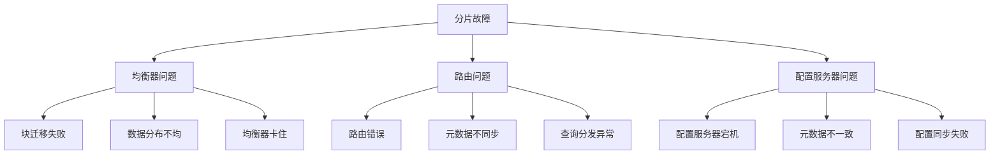

分片故障处理示例：
```javascript
// 1. 分片故障诊断器
class ShardingTroubleshooter {
    async diagnoseShardingIssues() {
        // 检查分片状态
        const shardStatus = await sh.status();
        
        // 检查均衡器状态
        const balancerStatus = await this.checkBalancerStatus();
        
        // 检查路由状态
        const routerStatus = await this.checkRouterStatus();
        
        // 检查配置服务器状态
        const configStatus = await this.checkConfigServerStatus();
        
        return {
            shardStatus,
            balancerStatus,
            routerStatus,
            configStatus,
            issues: this.identifyIssues({
                shard: shardStatus,
                balancer: balancerStatus,
                router: routerStatus,
                config: configStatus
            })
        };
    }
    
    async checkBalancerStatus() {
        // 获取均衡器详细状态
        const balancerState = await db.getSiblingDB("config")
            .settings.findOne({ _id: "balancer" });
            
        // 获取当前迁移操作
        const migrations = await db.getSiblingDB("config")
            .migrations.find().toArray();
            
        // 检查是否有卡住的迁移
        const stuckMigrations = migrations.filter(
            m => this.isStuckMigration(m)
        );
        
        return {
            enabled: balancerState.enabled,
            running: balancerState.running,
            mode: balancerState.mode,
            currentMigrations: migrations,
            stuckMigrations: stuckMigrations
        };
    }
    
    async fixShardingIssues(issues) {
        for (const issue of issues) {
            switch (issue.type) {
                case 'balancer_stuck':
                    await this.fixBalancerStuck(issue);
                    break;
                case 'chunk_migration':
                    await this.fixChunkMigration(issue);
                    break;
                case 'router_metadata':
                    await this.fixRouterMetadata(issue);
                    break;
                case 'config_sync':
                    await this.fixConfigSync(issue);
                    break;
            }
        }
    }
}

// 2. 均衡器修复工具
class BalancerRepairTool {
    async repairBalancer(issues) {
        // 停止当前均衡
        await sh.stopBalancer();
        
        try {
            // 清理卡住的迁移
            await this.cleanStuckMigrations();
            
            // 修复数据分布
            await this.rebalanceChunks();
            
            // 重启均衡器
            await this.restartBalancer();
            
        } catch (error) {
            // 记录错误并尝试恢复
            await this.handleBalancerError(error);
        }
    }
    
    async cleanStuckMigrations() {
        const stuckMigrations = await db.getSiblingDB("config")
            .migrations.find({
                state: "failed",
                whenStarted: {
                    $lt: new Date(Date.now() - 3600000) // 1小时前
                }
            }).toArray();
            
        for (const migration of stuckMigrations) {
            await this.cleanupMigration(migration);
        }
    }
    
    async rebalanceChunks() {
        // 分析当前chunk分布
        const distribution = await this.analyzeChunkDistribution();
        
        // 计算理想分布
        const idealDistribution = this.calculateIdealDistribution();
        
        // 执行再平衡
        return await this.executeRebalancing(
            distribution,
            idealDistribution
        );
    }
}

// 3. 路由问题处理器
class RouterTroubleshooter {
    async handleRoutingIssues() {
        // 检查mongos状态
        const routerStatus = await this.checkRouterStatus();
        
        // 验证元数据一致性
        const metadataStatus = await this.verifyMetadata();
        
        // 检查查询分发
        const queryRouting = await this.checkQueryRouting();
        
        // 修复发现的问题
        await this.fixRoutingIssues({
            router: routerStatus,
            metadata: metadataStatus,
            routing: queryRouting
        });
    }
    
    async verifyMetadata() {
        // 获取所有mongos实例的元数据版本
        const routers = await this.getAllRouters();
        const metadataVersions = new Map();
        
        for (const router of routers) {
            const version = await this.getMetadataVersion(router);
            metadataVersions.set(router, version);
        }
        
        // 检查版本一致性
        return this.checkMetadataConsistency(metadataVersions);
    }
    
    async fixRoutingIssues(issues) {
        if (issues.metadata.inconsistent) {
            await this.refreshRouterMetadata();
        }
        
        if (issues.routing.hasErrors) {
            await this.repairQueryRouting();
        }
    }
}
```

## 3. 数据修复

### 3.1 数据一致性

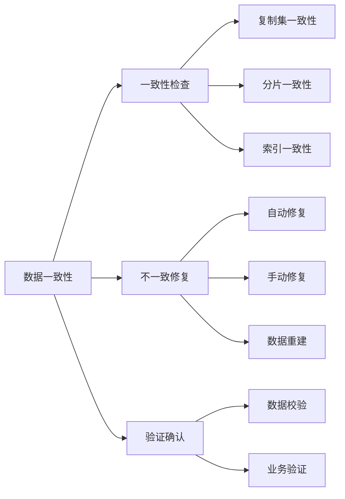

数据一致性处理示例：
```javascript

// 1. 数据一致性检查器
class ConsistencyChecker {
    async checkConsistency() {
        // 检查复制集一致性
        const replicationConsistency = 
            await this.checkReplicationConsistency();
            
        // 检查分片一致性
        const shardingConsistency = 
            await this.checkShardingConsistency();
            
        // 检查索引一致性
        const indexConsistency = 
            await this.checkIndexConsistency();
            
        return {
            replication: replicationConsistency,
            sharding: shardingConsistency,
            indexes: indexConsistency,
            recommendations: this.generateRecommendations({
                replication: replicationConsistency,
                sharding: shardingConsistency,
                indexes: indexConsistency
            })
        };
    }
    
    async checkReplicationConsistency() {
        const secondaries = await this.getSecondaryNodes();
        const inconsistencies = [];
        
        for (const secondary of secondaries) {
            // 比较数据校验和
            const comparison = await this.compareDataChecksum(
                'primary',
                secondary
            );
            
            if (!comparison.consistent) {
                inconsistencies.push({
                    node: secondary,
                    details: comparison.details
                });
            }
        }
        
        return {
            consistent: inconsistencies.length === 0,
            inconsistencies
        };
    }
    
    async repairInconsistencies(inconsistencies) {
        for (const inconsistency of inconsistencies) {
            switch (inconsistency.type) {
                case 'replication':
                    await this.repairReplicationData(inconsistency);
                    break;
                case 'sharding':
                    await this.repairShardingData(inconsistency);
                    break;
                case 'index':
                    await this.repairIndexData(inconsistency);
                    break;
            }
        }
    }
}

// 2. 数据修复执行器
class DataRepairExecutor {
    async executeRepair(repairPlan) {
        // 创建备份
        const backup = await this.createBackup();
        
        try {
            // 执行自动修复
            if (repairPlan.autoRepair) {
                await this.executeAutoRepair(repairPlan);
            }
            
            // 执行手动修复
            if (repairPlan.manualRepair) {
                await this.executeManualRepair(repairPlan);
            }
            
            // 验证修复结果
            const validation = await this.validateRepair();
            
            if (!validation.success) {
                throw new Error('Repair validation failed');
            }
            
            return validation;
            
        } catch (error) {
            // 回滚到备份
            await this.rollbackToBackup(backup);
            throw error;
        }
    }
    
    async executeAutoRepair(plan) {
        // 执行数据重建
        await this.rebuildData(plan.collections);
        
        // 重建索引
        await this.rebuildIndexes(plan.indexes);
        
        // 同步数据
        await this.syncData(plan.sync);
    }
}

// 3. 修复验证器
class RepairValidator {
    async validateRepair(repair) {
        // 验证数据完整性
        const integrityCheck = await this.checkDataIntegrity();
        
        // 验证索引一致性
        const indexCheck = await this.checkIndexConsistency();
        
        // 验证业务规则
        const businessCheck = await this.validateBusinessRules();
        
        return {
            success: 
                integrityCheck.success && 
                indexCheck.success && 
                businessCheck.success,
            details: {
                integrity: integrityCheck,
                indexes: indexCheck,
                business: businessCheck
            }
        };
    }
}
``` 

### 3.2 索引修复

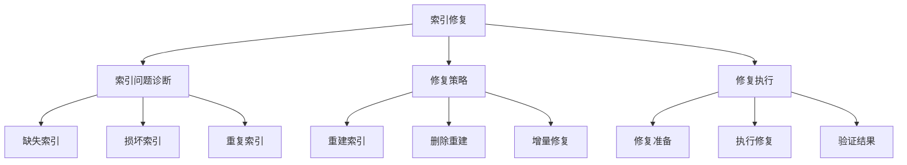

索引修复示例：
```javascript
// 1. 索引问题诊断器
class IndexDiagnostics {
    async diagnoseIndexIssues() {
        const collections = await this.getAllCollections();
        const indexIssues = [];
        
        for (const collection of collections) {
            // 检查索引状态
            const indexStatus = await this.checkIndexStatus(collection);
            
            // 检查索引使用情况
            const indexUsage = await this.checkIndexUsage(collection);
            
            // 检查索引完整性
            const indexIntegrity = 
                await this.checkIndexIntegrity(collection);
            
            if (this.hasIssues(indexStatus, indexUsage, indexIntegrity)) {
                indexIssues.push({
                    collection: collection,
                    status: indexStatus,
                    usage: indexUsage,
                    integrity: indexIntegrity
                });
            }
        }
        
        return {
            issues: indexIssues,
            recommendations: this.generateRecommendations(indexIssues)
        };
    }
    
    async checkIndexStatus(collection) {
        const indexes = await collection.getIndexes();
        const issues = [];
        
        for (const index of indexes) {
            // 检查索引是否损坏
            const isCorrupted = await this.isIndexCorrupted(
                collection, 
                index
            );
            
            // 检查索引是否重复
            const isDuplicate = await this.isIndexDuplicate(
                collection, 
                index
            );
            
            if (isCorrupted || isDuplicate) {
                issues.push({
                    index: index.name,
                    corrupted: isCorrupted,
                    duplicate: isDuplicate
                });
            }
        }
        
        return issues;
    }
}

// 2. 索引修复执行器
class IndexRepairExecutor {
    async repairIndexes(repairPlan) {
        // 创建修复会话
        const session = await this.createRepairSession();
        
        try {
            // 执行前准备
            await this.prepareForRepair(session);
            
            // 执行索引修复
            for (const repair of repairPlan.repairs) {
                await this.executeIndexRepair(repair, session);
            }
            
            // 验证修复结果
            await this.validateRepair(session);
            
            // 提交修复
            await session.commitRepair();
            
        } catch (error) {
            // 回滚修复
            await session.abortRepair();
            throw error;
        }
    }
    
    async executeIndexRepair(repair, session) {
        switch (repair.type) {
            case 'rebuild':
                await this.rebuildIndex(repair, session);
                break;
            case 'recreate':
                await this.recreateIndex(repair, session);
                break;
            case 'remove_duplicate':
                await this.removeDuplicateIndex(repair, session);
                break;
        }
    }
    
    async rebuildIndex(repair, session) {
        const collection = repair.collection;
        const indexName = repair.indexName;
        
        // 创建临时索引
        const tempIndexName = `${indexName}_temp`;
        await collection.createIndex(
            repair.key,
            {
                name: tempIndexName,
                background: true,
                session
            }
        );
        
        // 验证临时索引
        await this.validateIndex(collection, tempIndexName);
        
        // 替换原索引
        await this.swapIndexes(
            collection,
            indexName,
            tempIndexName,
            session
        );
    }
}

// 3. 索引验证器
class IndexValidator {
    async validateIndexes(collection) {
        const validationResults = {
            indexes: [],
            overall: true
        };
        
        // 获取所有索引
        const indexes = await collection.getIndexes();
        
        for (const index of indexes) {
            // 验证索引完整性
            const integrityCheck = await this.checkIndexIntegrity(
                collection,
                index
            );
            
            // 验证索引覆盖率
            const coverageCheck = await this.checkIndexCoverage(
                collection,
                index
            );
            
            // 验证索引性能
            const performanceCheck = await this.checkIndexPerformance(
                collection,
                index
            );
            
            validationResults.indexes.push({
                name: index.name,
                integrity: integrityCheck,
                coverage: coverageCheck,
                performance: performanceCheck,
                valid: this.isIndexValid(
                    integrityCheck,
                    coverageCheck,
                    performanceCheck
                )
            });
            
            // 更新整体验证状态
            validationResults.overall = validationResults.overall &&
                validationResults.indexes[
                    validationResults.indexes.length - 1
                ].valid;
        }
        
        return validationResults;
    }
    
    async checkIndexIntegrity(collection, index) {
        // 验证索引条目
        const indexStats = await collection.aggregate([
            { $indexStats: {} }
        ]).toArray();
        
        const indexStat = indexStats.find(
            stat => stat.name === index.name
        );
        
        // 检查是否有丢失的索引条目
        const documentCount = await collection.countDocuments();
        const indexedCount = indexStat.accesses.ops;
        
        return {
            complete: documentCount === indexedCount,
            documentCount,
            indexedCount,
            missing: documentCount - indexedCount
        };
    }
}
```

### 3.3 数据恢复

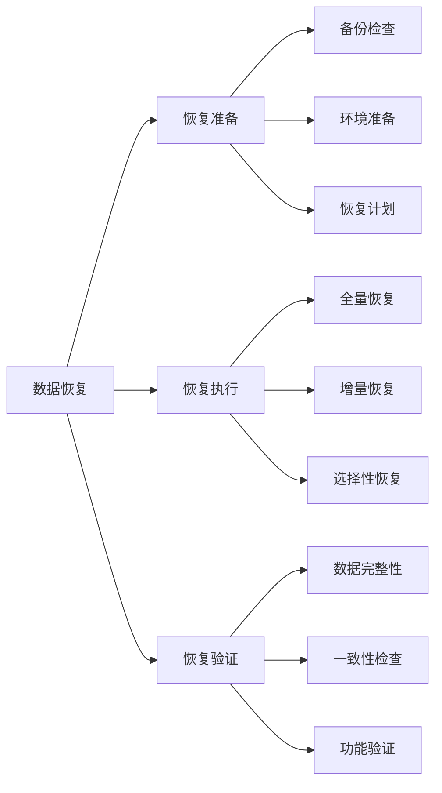

数据恢复示例：
```javascript

// 1. 数据恢复管理器
class DataRecoveryManager {
    constructor(config) {
        this.backupPath = config.backupPath;
        this.recoveryPath = config.recoveryPath;
        this.validator = new RecoveryValidator();
    }
    
    async planRecovery(options) {
        // 分析备份数据
        const backupAnalysis = await this.analyzeBackup();
        
        // 评估恢复方案
        const recoveryStrategies = this.evaluateRecoveryStrategies(
            backupAnalysis,
            options
        );
        
        // 选择最优恢复方案
        const selectedStrategy = this.selectBestStrategy(
            recoveryStrategies
        );
        
        return {
            analysis: backupAnalysis,
            strategy: selectedStrategy,
            estimatedTime: this.estimateRecoveryTime(selectedStrategy),
            risks: this.assessRecoveryRisks(selectedStrategy)
        };
    }
    
    async executeRecovery(plan) {
        // 准备恢复环境
        await this.prepareRecoveryEnvironment();
        
        try {
            // 执行数据恢复
            const result = await this.performRecovery(plan);
            
            // 验证恢复结果
            await this.validator.validateRecovery(result);
            
            // 执行后处理
            await this.postRecoveryProcessing(result);
            
            return result;
            
        } catch (error) {
            // 处理恢复失败
            await this.handleRecoveryFailure(error);
            throw error;
        }
    }
    
    async performRecovery(plan) {
        switch (plan.strategy.type) {
            case 'full':
                return await this.performFullRecovery(plan);
            case 'incremental':
                return await this.performIncrementalRecovery(plan);
            case 'selective':
                return await this.performSelectiveRecovery(plan);
            default:
                throw new Error(
                    `Unknown recovery type: ${plan.strategy.type}`
                );
        }
    }
}

// 2. 恢复执行器
class RecoveryExecutor {
    async performFullRecovery(plan) {
        // 停止数据库服务
        await this.stopDatabase();
        
        try {
            // 清理目标目录
            await this.cleanTargetDirectory();
            
            // 恢复数据文件
            await this.restoreDataFiles(plan.backup);
            
            // 恢复配置
            await this.restoreConfiguration(plan.backup);
            
            // 启动数据库
            await this.startDatabase();
            
            // 执行数据检查
            return await this.verifyRecovery();
            
        } catch (error) {
            // 回滚恢复
            await this.rollbackRecovery();
            throw error;
        }
    }
    
    async performIncrementalRecovery(plan) {
        // 获取增量备份列表
        const incrementalBackups = 
            await this.getIncrementalBackups(plan);
        
        // 按顺序应用增量备份
        for (const backup of incrementalBackups) {
            await this.applyIncrementalBackup(backup);
            
            // 验证每个增量恢复
            await this.verifyIncrementalRecovery(backup);
        }
    }
}

// 3. 恢复验证器
class RecoveryValidator {
    async validateRecovery(recovery) {
        // 检查数据完整性
        const integrityCheck = await this.checkDataIntegrity(recovery);
        
        // 检查数据一致性
        const consistencyCheck = 
            await this.checkDataConsistency(recovery);
        
        // 执行功能测试
        const functionalCheck = 
            await this.performFunctionalTests(recovery);
        
        return {
            success: 
                integrityCheck.success && 
                consistencyCheck.success && 
                functionalCheck.success,
            details: {
                integrity: integrityCheck,
                consistency: consistencyCheck,
                functional: functionalCheck
            }
        };
    }
    
    async checkDataIntegrity(recovery) {
        const collections = await this.getRecoveredCollections();
        const integrityResults = {};
        
        for (const collection of collections) {
            // 检查文档计数
            const countCheck = await this.checkDocumentCount(
                collection,
                recovery.expectedCounts[collection.name]
            );
            
            // 检查数据校验和
            const checksumCheck = await this.checkDataChecksum(
                collection,
                recovery.expectedChecksums[collection.name]
            );
            
            integrityResults[collection.name] = {
                countMatch: countCheck,
                checksumMatch: checksumCheck
            };
        }
        
        return {
            success: this.allChecksPass(integrityResults),
            results: integrityResults
        };
    }
}
```

## 4. 性能诊断

### 4.1 慢查询分析

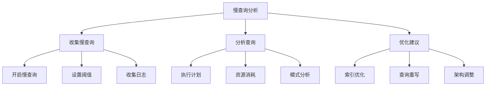

慢查询分析示例：
```javascript
// 1. 慢查询分析器
class SlowQueryAnalyzer {
    async analyzeSlowQueries(options = {}) {
        // 配置慢查询收集
        await this.configureSlowQueryLogging(options);
        
        // 收集慢查询
        const slowQueries = await this.collectSlowQueries(
            options.timeRange
        );
        
        // 分析查询模式
        const patterns = this.analyzeQueryPatterns(slowQueries);
        
        // 生成优化建议
        return {
            queries: slowQueries,
            patterns: patterns,
            recommendations: this.generateRecommendations(
                slowQueries,
                patterns
            )
        };
    }
    
    async collectSlowQueries(timeRange) {
        return await db.system.profile.find({
            millis: { $gt: 100 },  // 慢查询阈值
            ts: {
                $gte: timeRange.start,
                $lte: timeRange.end
            }
        }).toArray();
    }
    
    analyzeQueryPatterns(slowQueries) {
        const patterns = new Map();
        
        for (const query of slowQueries) {
            // 提取查询模式
            const pattern = this.extractQueryPattern(query);
            
            // 统计模式出现次数
            if (patterns.has(pattern)) {
                patterns.set(
                    pattern,
                    patterns.get(pattern) + 1
                );
            } else {
                patterns.set(pattern, 1);
            }
        }
        
        return Array.from(patterns.entries())
            .map(([pattern, count]) => ({
                pattern,
                count,
                percentage: (count / slowQueries.length) * 100
            }))
            .sort((a, b) => b.count - a.count);
    }
}

// 2. 查询优化器
class QueryOptimizer {
    async optimizeSlowQueries(analysis) {
        const optimizations = [];
        
        for (const pattern of analysis.patterns) {
            // 分析执行计划
            const plan = await this.analyzeQueryPlan(pattern);
            
            // 生成优化建议
            const recommendations = 
                this.generateOptimizations(plan);
            
            // 评估优化效果
            const impact = await this.evaluateOptimizations(
                recommendations
            );
            
            optimizations.push({
                pattern: pattern,
                plan: plan,
                recommendations: recommendations,
                impact: impact
            });
        }
        
        return optimizations;
    }
    
    async analyzeQueryPlan(pattern) {
        // 获取详细执行计划
        const explain = await db.collection(pattern.collection)
            .explain("allPlansExecution")
            .find(pattern.query);
            
        return {
            queryPlanner: explain.queryPlanner,
            executionStats: explain.executionStats,
            analysis: this.analyzePlanDetails(explain)
        };
    }
}

// 3. 性能建议生成器
class PerformanceAdvisor {
    generateRecommendations(analysis) {
        const recommendations = [];
        
        // 索引建议
        const indexRecommendations = 
            this.recommendIndexes(analysis);
        if (indexRecommendations.length > 0) {
            recommendations.push({
                type: 'index',
                suggestions: indexRecommendations
            });
        }
        
        // 查询重写建议
        const queryRecommendations = 
            this.recommendQueryRewrites(analysis);
        if (queryRecommendations.length > 0) {
            recommendations.push({
                type: 'query',
                suggestions: queryRecommendations
            });
        }
        
        // 架构优化建议
        const schemaRecommendations = 
            this.recommendSchemaChanges(analysis);
        if (schemaRecommendations.length > 0) {
            recommendations.push({
                type: 'schema',
                suggestions: schemaRecommendations
            });
        }
        
        return recommendations;
    }
}
```

### 4.2 资源瓶颈

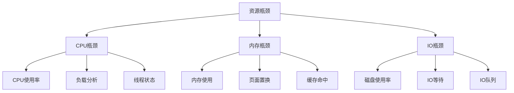

资源瓶颈分析示例：
```javascript
// 1. 资源瓶颈分析器
class ResourceBottleneckAnalyzer {
    async analyzeBottlenecks() {
        // 收集资源指标
        const metrics = await this.collectResourceMetrics();
        
        // 分析CPU瓶颈
        const cpuBottlenecks = await this.analyzeCPUBottlenecks(
            metrics.cpu
        );
        
        // 分析内存瓶颈
        const memoryBottlenecks = await this.analyzeMemoryBottlenecks(
            metrics.memory
        );
        
        // 分析IO瓶颈
        const ioBottlenecks = await this.analyzeIOBottlenecks(
            metrics.io
        );
        
        return {
            cpu: cpuBottlenecks,
            memory: memoryBottlenecks,
            io: ioBottlenecks,
            recommendations: this.generateRecommendations({
                cpu: cpuBottlenecks,
                memory: memoryBottlenecks,
                io: ioBottlenecks
            })
        };
    }
    
    async collectResourceMetrics() {
        return {
            cpu: await this.getCPUMetrics(),
            memory: await this.getMemoryMetrics(),
            io: await this.getIOMetrics()
        };
    }
    
    async analyzeCPUBottlenecks(metrics) {
        const bottlenecks = [];
        
        // 分析CPU使用率
        if (metrics.utilization > 80) {
            bottlenecks.push({
                type: 'high_utilization',
                value: metrics.utilization,
                threshold: 80,
                impact: 'high'
            });
        }
        
        // 分析负载
        if (metrics.load > metrics.cores * 2) {
            bottlenecks.push({
                type: 'high_load',
                value: metrics.load,
                threshold: metrics.cores * 2,
                impact: 'high'
            });
        }
        
        return bottlenecks;
    }
}

// 2. 内存分析器
class MemoryAnalyzer {
    async analyzeMemoryUsage() {
        // 获取内存统计
        const memStats = await db.serverStatus().mem;
        
        // 分析内存使用情况
        const usage = this.analyzeUsagePatterns(memStats);
        
        // 分析页面置换
        const paging = await this.analyzePaging();
        
        // 分析缓存效率
        const caching = this.analyzeCaching(memStats);
        
        return {
            usage,
            paging,
            caching,
            recommendations: this.getMemoryRecommendations({
                usage,
                paging,
                caching
            })
        };
    }
    
    analyzePaging() {
        return new Promise((resolve) => {
            const pagingStats = {
                pageIns: 0,
                pageOuts: 0,
                swapUsage: 0
            };
            
            // 使用操作系统命令获取页面置换信息
            exec('vmstat 1 5', (error, stdout, stderr) => {
                if (!error) {
                    // 解析vmstat输出
                    pagingStats = this.parseVmstatOutput(stdout);
                }
                resolve(pagingStats);
            });
        });
    }
}

// 3. IO分析器
class IOAnalyzer {
    async analyzeIO() {
        // 收集IO统计
        const ioStats = await this.collectIOStats();
        
        // 分析IO模式
        const patterns = this.analyzeIOPatterns(ioStats);
        
        // 检测IO瓶颈
        const bottlenecks = this.detectIOBottlenecks(ioStats);
        
        return {
            stats: ioStats,
            patterns,
            bottlenecks,
            recommendations: this.generateIORecommendations({
                patterns,
                bottlenecks
            })
        };
    }
    
    async collectIOStats() {
        return new Promise((resolve) => {
            exec('iostat -x 1 5', (error, stdout, stderr) => {
                if (!error) {
                    const stats = this.parseIostatOutput(stdout);
                    resolve(stats);
                } else {
                    resolve({
                        error: 'Failed to collect IO stats'
                    });
                }
            });
        });
    }
}
```

### 4.3 性能优化

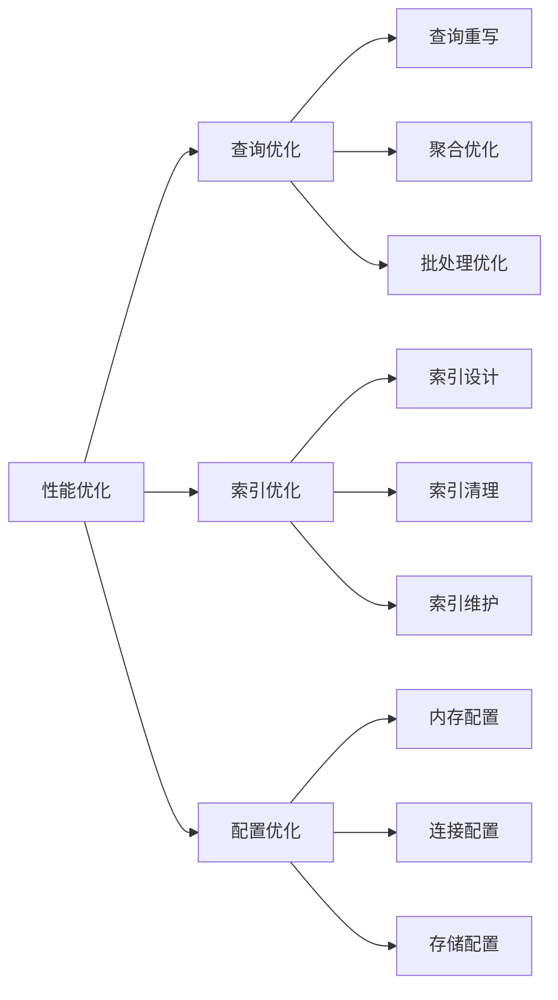

性能优化示例：
```javascript

// 1. 性能优化管理器
class PerformanceOptimizer {
    async optimizePerformance() {
        // 分析当前性能
        const analysis = await this.analyzeCurrentPerformance();
        
        // 生成优化计划
        const plan = this.createOptimizationPlan(analysis);
        
        // 执行优化
        const results = await this.executeOptimizations(plan);
        
        // 验证优化效果
        return await this.validateOptimizations(results);
    }
    
    async analyzeCurrentPerformance() {
        return {
            // 查询性能分析
            queries: await this.analyzeQueryPerformance(),
            
            // 索引使用分析
            indexes: await this.analyzeIndexUsage(),
            
            // 资源使用分析
            resources: await this.analyzeResourceUsage()
        };
    }
    
    createOptimizationPlan(analysis) {
        const plan = {
            queries: [],
            indexes: [],
            configuration: []
        };
        
        // 添加查询优化任务
        if (analysis.queries.needsOptimization) {
            plan.queries = this.planQueryOptimizations(
                analysis.queries
            );
        }
        
        // 添加索引优化任务
        if (analysis.indexes.needsOptimization) {
            plan.indexes = this.planIndexOptimizations(
                analysis.indexes
            );
        }
        
        // 添加配置优化任务
        if (analysis.resources.needsOptimization) {
            plan.configuration = this.planConfigOptimizations(
                analysis.resources
            );
        }
        
        return plan;
    }
}

// 2. 查询优化器
class QueryOptimizer {
    async optimizeQueries(queries) {
        const optimizations = [];
        
        for (const query of queries) {
            // 分析查询模式
            const pattern = this.analyzeQueryPattern(query);
            
            // 生成优化建议
            const suggestions = this.suggestOptimizations(pattern);
            
            // 实施优化
            const result = await this.applyOptimizations(
                query,
                suggestions
            );
            
            optimizations.push({
                original: query,
                optimized: result.optimized,
                improvement: result.improvement
            });
        }
        
        return optimizations;
    }
    
    suggestOptimizations(pattern) {
        const suggestions = [];
        
        // 检查查询结构
        if (this.canSimplifyQuery(pattern)) {
            suggestions.push({
                type: 'simplify',
                details: this.getSimplificationDetails(pattern)
            });
        }
        
        // 检查索引使用
        if (this.canImproveIndexUsage(pattern)) {
            suggestions.push({
                type: 'index',
                details: this.getIndexSuggestions(pattern)
            });
        }
        
        return suggestions;
    }
}

// 3. 配置优化器
class ConfigurationOptimizer {
    async optimizeConfiguration(analysis) {
        // 优化内存配置
        const memoryConfig = await this.optimizeMemoryConfig(
            analysis.memory
        );
        
        // 优化连接配置
        const connectionConfig = await this.optimizeConnectionConfig(
            analysis.connections
        );
        
        // 优化存储配置
        const storageConfig = await this.optimizeStorageConfig(
            analysis.storage
        );
        
        return {
            memory: memoryConfig,
            connections: connectionConfig,
            storage: storageConfig,
            applied: await this.applyConfigurations({
                memory: memoryConfig,
                connections: connectionConfig,
                storage: storageConfig
            })
        };
    }
    
    async optimizeMemoryConfig(analysis) {
        return {
            wiredTiger: {
                engineConfig: {
                    cacheSizeGB: this.calculateOptimalCacheSize(
                        analysis
                    )
                }
            },
            operationProfiling: {
                slowOpThresholdMs: this.calculateOptimalThreshold(
                    analysis
                )
            }
        };
    }
}
```

## 总结

MongoDB故障处理的关键点：

1. **故障诊断流程**
   - 系统化的问题识别方法
   - 全面的日志分析策略
   - 精确的监控分析手段

2. **常见故障处理**
   - 连接故障的排查与修复
   - 性能故障的诊断与优化
   - 复制故障的处理流程
   - 分片故障的解决方案

3. **数据修复**
   - 数据一致性的检查与修复
   - 索引修复的方法与工具
   - 数据恢复的策略与实施

4. **性能诊断**
   - 慢查询的分析与优化
   - 资源瓶颈的识别与解决
   - 性能优化的方法与实践

通过本文档的学习，您应该能够：
1. 理解MongoDB常见故障的类型和特征
2. 掌握系统化的故障诊断和处理方法
3. 能够进行数据修复和性能优化
4. 建立完整的故障处理知识体系

如果需要更深入地了解某个具体主题，请参考MongoDB官方文档或社区资源。
```
